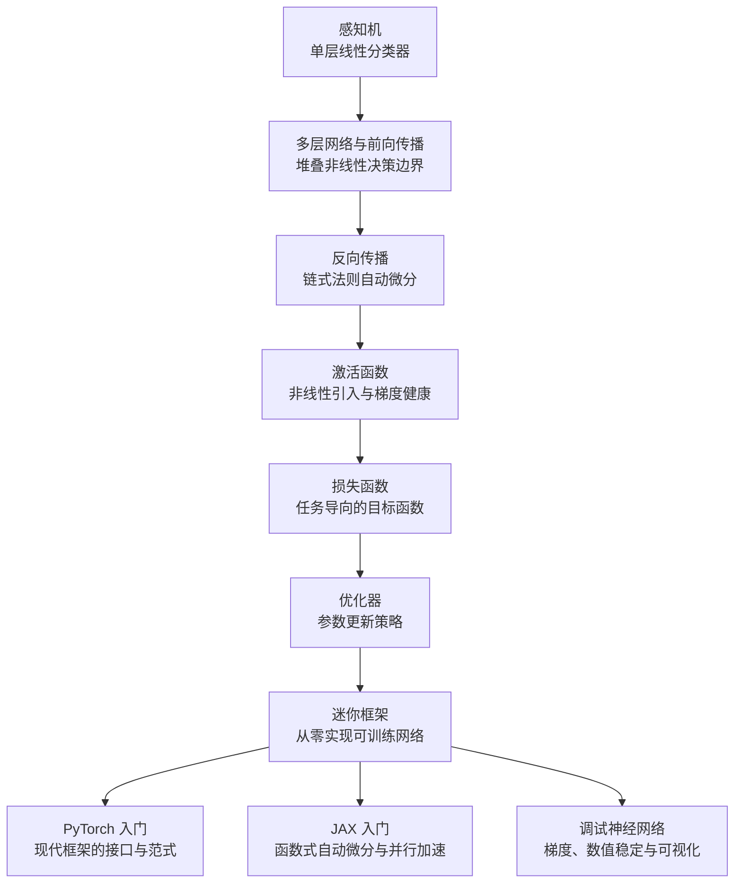
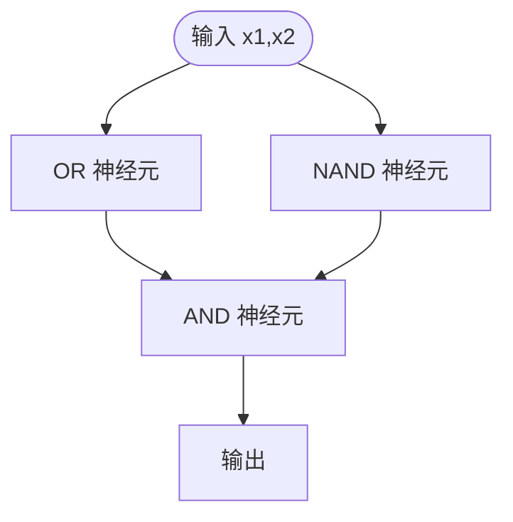
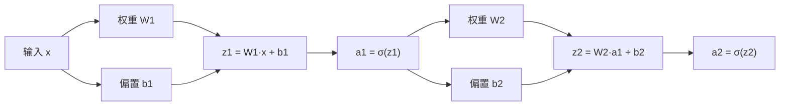
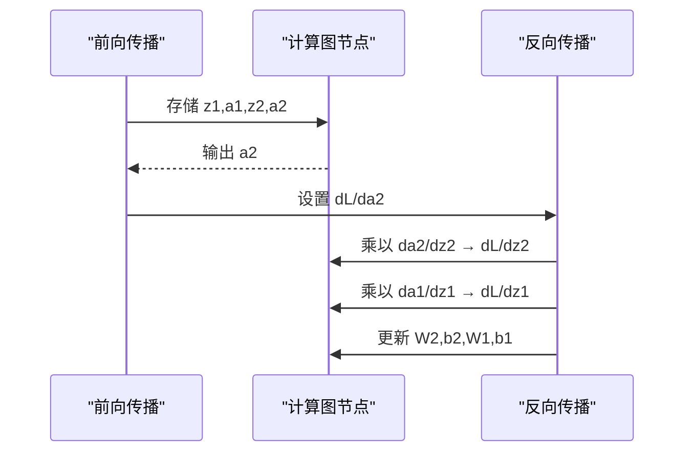
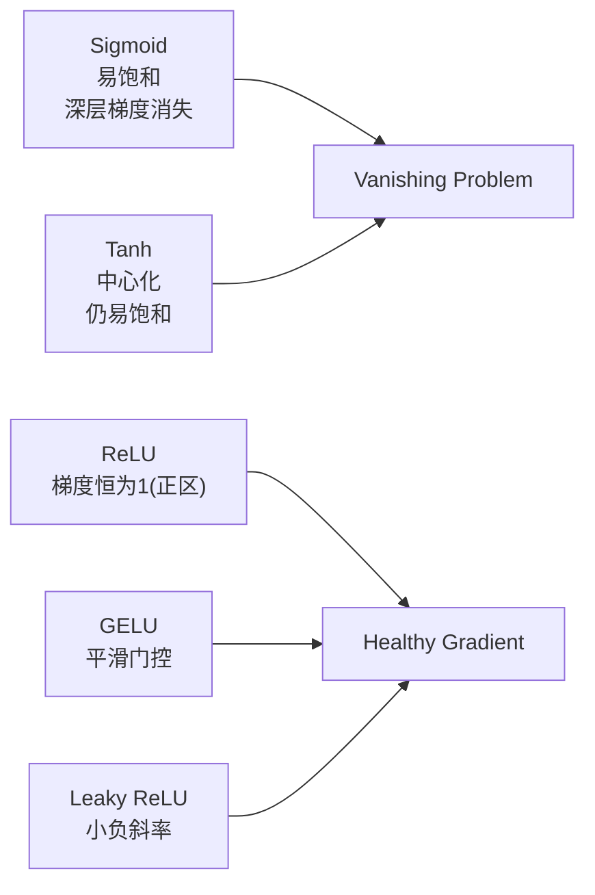
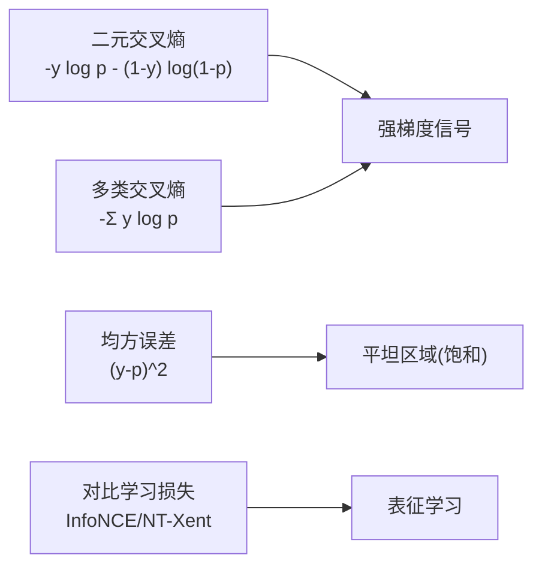
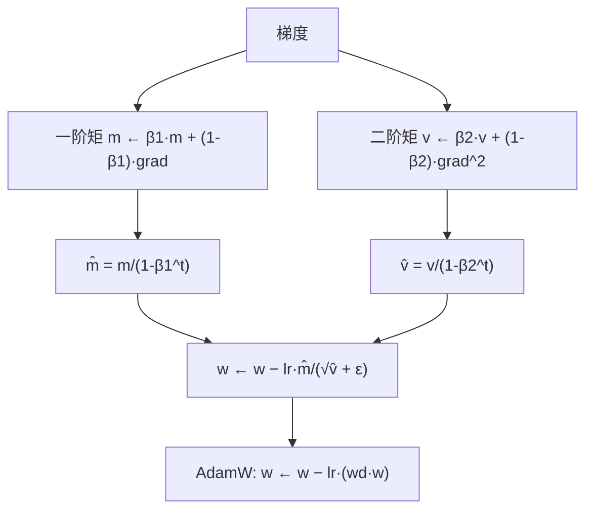
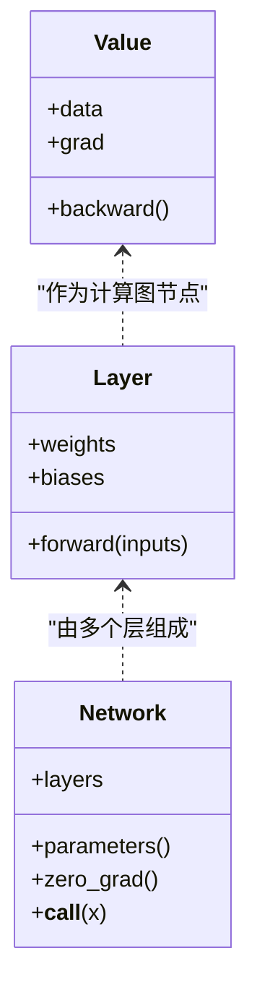
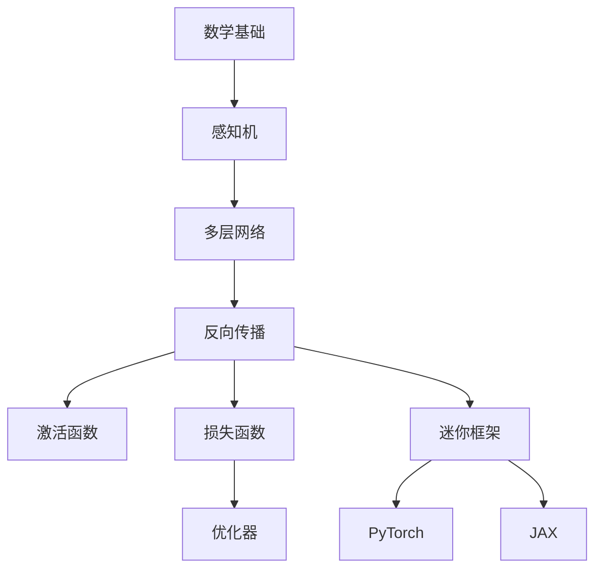

# 深度学习核心

<cite>
**本文引用的文件**
- [深度学习核心阶段说明](file://phases/03-deep-learning-core/README.md)
- [总路线图](file://ROADMAP.md)
- [感知机（英文）](file://phases/03-deep-learning-core/01-the-perceptron/docs/en.md)
- [多层网络与前向传播（英文）](file://phases/03-deep-learning-core/02-multi-layer-networks/docs/en.md)
- [反向传播（英文）](file://phases/03-deep-learning-core/03-backpropagation/docs/en.md)
- [激活函数（英文）](file://phases/03-deep-learning-core/04-activation-functions/docs/en.md)
- [损失函数（英文）](file://phases/03-deep-learning-core/05-loss-functions/docs/en.md)
- [优化器（英文）](file://phases/03-deep-learning-core/06-optimizers/docs/en.md)
</cite>

## 目录
1. [引言](#引言)
2. [项目结构](#项目结构)
3. [核心组件](#核心组件)
4. [架构总览](#架构总览)
5. [详细组件分析](#详细组件分析)
6. [依赖关系分析](#依赖关系分析)
7. [性能考量](#性能考量)
8. [故障排查指南](#故障排查指南)
9. [结论](#结论)
10. [附录](#附录)

## 引言
本课程面向“从零构建神经网络”的目标，系统讲解深度学习的核心原理与实现：从感知机出发，逐步过渡到多层网络、前向传播、反向传播、激活函数、损失函数、优化器，并最终在不依赖任何框架的前提下，亲手实现一个可训练的小型深度学习框架。同时，课程覆盖 PyTorch 与 JAX 的使用方法，帮助学习者理解主流框架的内部机制与最佳实践。

## 项目结构
深度学习核心课程位于 phases/03-deep-learning-core，共包含 13 个主题单元，每个单元均提供英文教学文档、Python 示例代码与练习题，形成“理论—实现—验证”的完整闭环。总路线图显示该阶段约需 15 小时，涵盖感知机、多层网络、反向传播、激活函数、损失函数、优化器、正则化、权重初始化、学习率调度、迷你框架、PyTorch/JAX 入门以及神经网络调试等内容。



图表来源
- [深度学习核心阶段说明](file://phases/03-deep-learning-core/README.md)
- [总路线图](file://ROADMAP.md)

章节来源
- [深度学习核心阶段说明:1-6](file://phases/03-deep-learning-core/README.md#L1-L6)
- [总路线图:78-95](file://ROADMAP.md#L78-L95)

## 核心组件
本阶段的核心知识模块如下：
- 感知机：单层线性分类器，演示 XOR 不可分问题，引出多层网络的必要性。
- 多层网络与前向传播：矩阵乘法、权重与偏置、逐层激活、维度追踪。
- 反向传播：计算图、链式法则、梯度回传、内存与计算权衡。
- 激活函数：Sigmoid、Tanh、ReLU、GELU、Swish、Softmax 的数学性质与梯度健康。
- 损失函数：MSE、二元交叉熵、多类交叉熵、对比学习损失、标签平滑与焦点损失。
- 优化器：SGD、动量、Adam、AdamW 的直觉与实现要点、权重衰减与偏差修正。
- 迷你框架：从零实现可训练网络，贯穿前向与反向流程。
- PyTorch/JAX：现代框架的张量操作、自动微分与分布式训练思路。
- 调试神经网络：梯度爆炸/消失、数值稳定性、可视化与检查清单。

章节来源
- [感知机（英文）:10-16](file://phases/03-deep-learning-core/01-the-perceptron/docs/en.md#L10-L16)
- [多层网络与前向传播（英文）:10-16](file://phases/03-deep-learning-core/02-multi-layer-networks/docs/en.md#L10-L16)
- [反向传播（英文）:10-16](file://phases/03-deep-learning-core/03-backpropagation/docs/en.md#L10-L16)
- [激活函数（英文）:10-16](file://phases/03-deep-learning-core/04-activation-functions/docs/en.md#L10-L16)
- [损失函数（英文）:10-16](file://phases/03-deep-learning-core/05-loss-functions/docs/en.md#L10-L16)
- [优化器（英文）:10-16](file://phases/03-deep-learning-core/06-optimizers/docs/en.md#L10-L16)

## 架构总览
下图展示了从输入到输出的端到端流程，以及反向传播如何通过计算图回传梯度，驱动参数更新。

```mermaid
graph TB
subgraph "前向传播"
X["输入 x"] --> Z1["z1 = W1·x + b1"]
Z1 --> A1["a1 = σ(z1)"]
A1 --> Z2["z2 = W2·a1 + b2"]
Z2 --> A2["a2 = σ(z2)"]
A2 --> L["L = loss(a2, y)"]
end
subgraph "反向传播"
DLDA2["∂L/∂a2"] --> DA2DZ2["∂a2/∂z2"]
DLDA2 --> DA2DZ2
DA2DZ2 --> DLZ2["∂L/∂z2"]
DLZ2 --> DW2["∂L/∂W2"], DB2["∂L/∂b2"]
DLZ2 --> DA1["∂L/∂a1"]
DA1 --> DA1DZ1["∂a1/∂z1"]
DA1 --> DA1DZ1
DA1DZ1 --> DLZ1["∂L/∂z1"]
DLZ1 --> DW1["∂L/∂W1"], DB1["∂L/∂b1"]
end
L --> DLDA2
```

图表来源
- [反向传播（英文）:54-71](file://phases/03-deep-learning-core/03-backpropagation/docs/en.md#L54-L71)

## 详细组件分析

### 感知机与 XOR 难点
- 单层感知机只能解决线性可分问题；XOR 是非线性不可分的经典反例。
- 通过组合 OR、NAND、AND 等门电路，可以手工构造两层网络解决 XOR。
- 使用 Sigmoid 替代阶跃函数，配合反向传播可自动学习权重。



图表来源
- [感知机（英文）:218-227](file://phases/03-deep-learning-core/01-the-perceptron/docs/en.md#L218-L227)

章节来源
- [感知机（英文）:85-113](file://phases/03-deep-learning-core/01-the-perceptron/docs/en.md#L85-L113)
- [感知机（英文）:214-255](file://phases/03-deep-learning-core/01-the-perceptron/docs/en.md#L214-L255)

### 多层网络与前向传播
- 层次结构：输入层、隐藏层、输出层；每层执行线性变换（W·x + b）后经激活。
- 维度追踪：权重矩阵形状（当前层神经元数 × 上一层神经元数），确保连贯。
- 前向传播是纯计算过程，不涉及梯度更新。



图表来源
- [多层网络与前向传播（英文）:88-98](file://phases/03-deep-learning-core/02-multi-layer-networks/docs/en.md#L88-L98)

章节来源
- [多层网络与前向传播（英文）:109-122](file://phases/03-deep-learning-core/02-multi-layer-networks/docs/en.md#L109-L122)
- [多层网络与前向传播（英文）:223-258](file://phases/03-deep-learning-core/02-multi-layer-networks/docs/en.md#L223-L258)

### 反向传播与链式法则
- 计算图：前向存储中间值，后向按拓扑序回传梯度。
- 梯度流经激活函数与线性层，逐层乘以局部导数。
- 深层 Sigmoid 容易出现梯度消失，导致早期层几乎不更新。



图表来源
- [反向传播（英文）:37-51](file://phases/03-deep-learning-core/03-backpropagation/docs/en.md#L37-L51)
- [反向传播（英文）:75-85](file://phases/03-deep-learning-core/03-backpropagation/docs/en.md#L75-L85)

章节来源
- [反向传播（英文）:89-102](file://phases/03-deep-learning-core/03-backpropagation/docs/en.md#L89-L102)
- [反向传播（英文）:103-133](file://phases/03-deep-learning-core/03-backpropagation/docs/en.md#L103-L133)

### 激活函数与梯度健康
- 非线性是深度模型的关键：无非线性，再多层也等价于单层线性变换。
- Sigmoid/Tanh 在深层易饱和，ReLU/GELU/Leaky ReLU 提供更稳定的梯度。
- 死神经元问题：ReLU 若长期接收负输入会永久失效，GELU 通过平滑门控缓解此问题。



图表来源
- [激活函数（英文）:169-182](file://phases/03-deep-learning-core/04-activation-functions/docs/en.md#L169-L182)

章节来源
- [激活函数（英文）:118-128](file://phases/03-deep-learning-core/04-activation-functions/docs/en.md#L118-L128)
- [激活函数（英文）:334-370](file://phases/03-deep-learning-core/04-activation-functions/docs/en.md#L334-L370)

### 损失函数与任务匹配
- MSE：回归默认；对分类效果差，易产生“预测 0.5”陷阱。
- 交叉熵：分类首选；对错误的置信预测施加指数惩罚，梯度更强。
- 对比学习损失（InfoNCE/NT-Xent）：自监督表征学习，拉近正样本、推开负样本。
- 标签平滑与焦点损失：缓解过拟合与类别不平衡。



图表来源
- [损失函数（英文）:156-175](file://phases/03-deep-learning-core/05-loss-functions/docs/en.md#L156-L175)

章节来源
- [损失函数（英文）:17-26](file://phases/03-deep-learning-core/05-loss-functions/docs/en.md#L17-L26)
- [损失函数（英文）:101-112](file://phases/03-deep-learning-core/05-loss-functions/docs/en.md#L101-L112)

### 优化器与参数更新
- SGD：最简单但易震荡；适合某些场景但通常不是首选。
- 动量：累积历史梯度，抑制震荡，加速有用方向。
- RMSProp：按参数自适应缩放学习率，解决不同尺度权重的差异。
- Adam：一阶（动量）+ 二阶（平方动量）+ 偏差修正；默认超参适用面广。
- AdamW：解耦权重衰减，一般优于 Adam + L2；现代大模型普遍采用。



图表来源
- [优化器（英文）:75-99](file://phases/03-deep-learning-core/06-optimizers/docs/en.md#L75-L99)
- [优化器（英文）:101-116](file://phases/03-deep-learning-core/06-optimizers/docs/en.md#L101-L116)

章节来源
- [优化器（英文）:117-140](file://phases/03-deep-learning-core/06-optimizers/docs/en.md#L117-L140)
- [优化器（英文）:141-166](file://phases/03-deep-learning-core/06-optimizers/docs/en.md#L141-L166)

### 从零实现迷你框架
- 自定义自动微分引擎：Value 节点、加法/乘法/激活/损失的反向规则、拓扑排序。
- 网络层与参数收集：前向传播、参数列表、梯度清零、权重更新。
- 训练循环：前向→损失→反向→更新→评估。



图表来源
- [反向传播（英文）:145-156](file://phases/03-deep-learning-core/03-backpropagation/docs/en.md#L145-L156)
- [反向传播（英文）:248-302](file://phases/03-deep-learning-core/03-backpropagation/docs/en.md#L248-L302)

章节来源
- [反向传播（英文）:139-193](file://phases/03-deep-learning-core/03-backpropagation/docs/en.md#L139-L193)
- [反向传播（英文）:222-244](file://phases/03-deep-learning-core/03-backpropagation/docs/en.md#L222-L244)

### PyTorch 与 JAX 入门
- PyTorch：Sequential、Linear、Sigmoid、MSELoss、SGD/AdamW、autograd、学习率调度。
- JAX：函数式编程风格、纯函数、vmap/pmap/jit、随机数与设备管理。
- 两者都强调“先理解原理，再用框架”，避免盲目调包。

章节来源
- [多层网络与前向传播（英文）:297-320](file://phases/03-deep-learning-core/02-multi-layer-networks/docs/en.md#L297-L320)
- [反向传播（英文）:397-434](file://phases/03-deep-learning-core/03-backpropagation/docs/en.md#L397-L434)
- [优化器（英文）:388-419](file://phases/03-deep-learning-core/06-optimizers/docs/en.md#L388-L419)

### 调试神经网络
- 检查清单：梯度范数、激活分布、损失曲线、过拟合/欠拟合迹象。
- 常见问题：梯度爆炸（裁剪）、梯度消失（换激活/归一化/更深网络）、数值不稳定（log 稳定性、温度参数）。
- 实践建议：可视化中间特征、记录梯度统计、逐步增加复杂度。

章节来源
- [反向传播（英文）:435-439](file://phases/03-deep-learning-core/03-backpropagation/docs/en.md#L435-L439)
- [激活函数（英文）:496-500](file://phases/03-deep-learning-core/04-activation-functions/docs/en.md#L496-L500)
- [损失函数（英文）:420-425](file://phases/03-deep-learning-core/05-loss-functions/docs/en.md#L420-L425)

## 依赖关系分析
- 数学基础（线性代数、微积分、概率论）是理解权重矩阵、链式法则与梯度下降的前提。
- 感知机是多层网络的原子单元；多层网络是反向传播的载体；反向传播驱动激活函数与损失函数的梯度流动；优化器决定参数更新步长与方向。
- 迷你框架串联上述所有组件，形成完整的训练闭环；PyTorch/JAX 则提供工业级实现与扩展能力。



图表来源
- [总路线图:78-95](file://ROADMAP.md#L78-L95)

章节来源
- [总路线图:78-95](file://ROADMAP.md#L78-L95)

## 性能考量
- 深层网络中，Sigmoid/Tanh 易导致梯度消失；优先选择 ReLU/GELU/Swish 等平滑且非单调的激活。
- 损失函数与任务匹配至关重要：分类用交叉熵，回归用 MSE/Huber；自监督用对比学习损失。
- 优化器选择：默认 AdamW，结合学习率预热与余弦退火；权重衰减采用解耦形式（AdamW）。
- 数值稳定性：对数项加截断、softmax 加中心化、对比学习损失加温度参数与数值稳定项。
- 批大小与学习率：二者相互影响，需协同调整；大数据集上可采用更大的批与更高的学习率。

## 故障排查指南
- 损失不下降或震荡：检查学习率是否过高/过低、是否使用了合适的优化器与调度。
- 准确率停滞：考虑更换激活函数、加入正则化、检查数据分布与标签质量。
- 梯度爆炸：启用梯度裁剪、降低学习率、检查权重初始化。
- 梯度消失：改用 ReLU/GELU、残差连接、归一化层、更深网络或更好的初始化。
- 数值不稳定：对数项加截断、softmax 中心化、对比损失中使用数值稳定技巧。

章节来源
- [优化器（英文）:425-436](file://phases/03-deep-learning-core/06-optimizers/docs/en.md#L425-L436)
- [损失函数（英文）:426-437](file://phases/03-deep-learning-core/05-loss-functions/docs/en.md#L426-L437)
- [激活函数（英文）:501-512](file://phases/03-deep-learning-core/04-activation-functions/docs/en.md#L501-L512)

## 结论
本课程以“从零实现”为主线，将感知机、多层网络、反向传播、激活函数、损失函数与优化器逐一拆解，辅以 PyTorch/JAX 的实战入门与系统化的调试方法。通过手写代码与可视化分析，学习者能够真正理解深度学习的工作原理与实现细节，为后续计算机视觉、自然语言处理与生成模型打下坚实基础。

## 附录
- 推荐阅读：Nielsen《Neural Networks and Deep Learning》、Goodfellow《Deep Learning》、3Blue1Brown 系列视频。
- 练习建议：在每个单元完成后，尝试修改超参、更换激活/损失/优化器，观察对收敛速度与最终性能的影响。