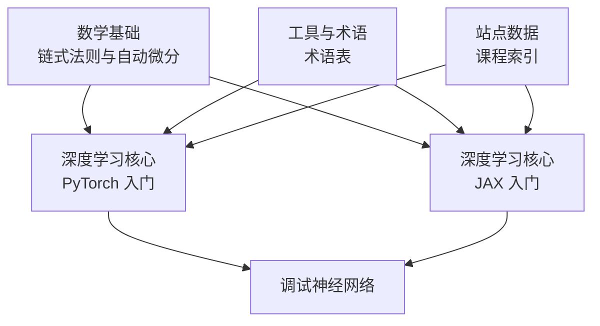
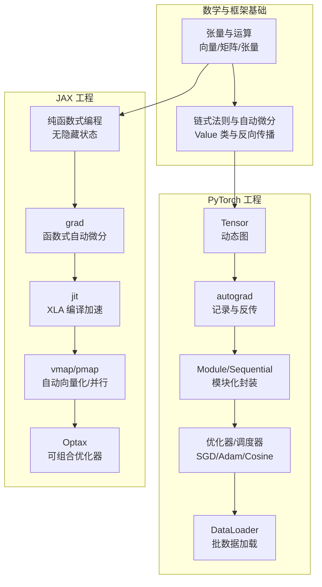
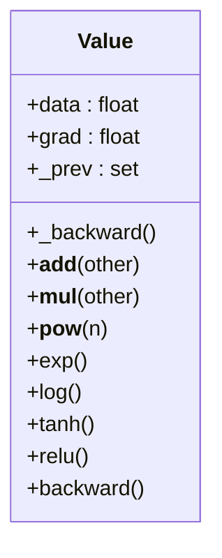
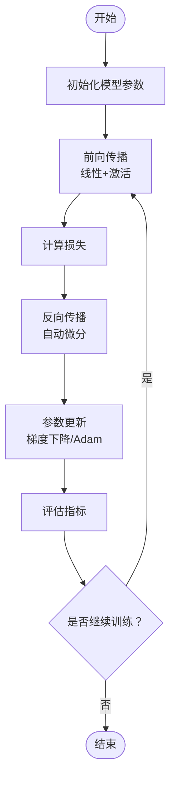
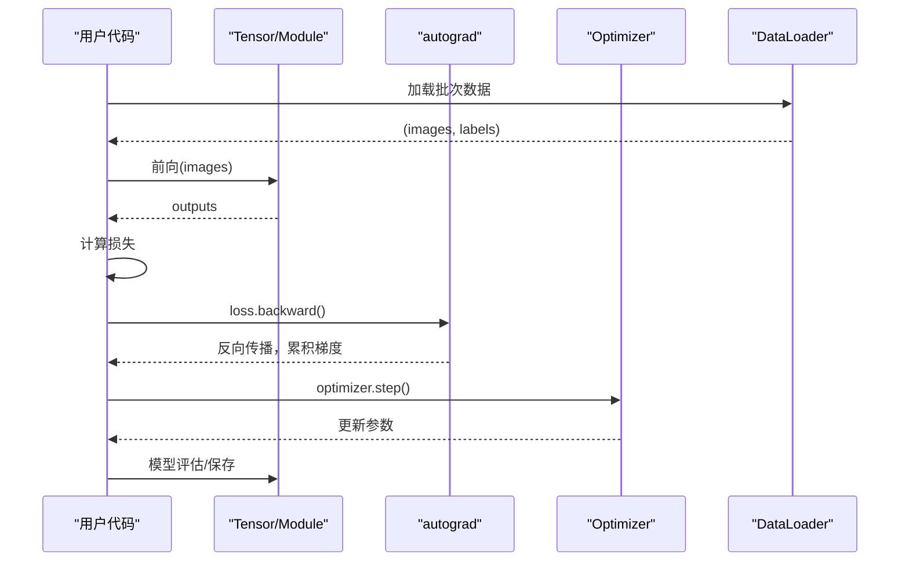
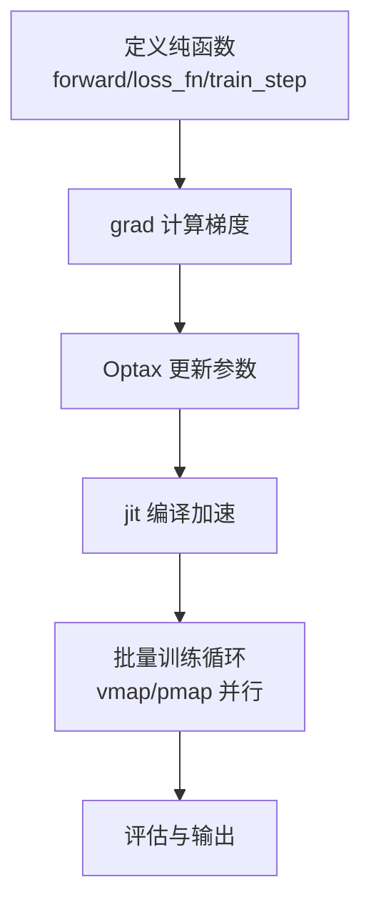
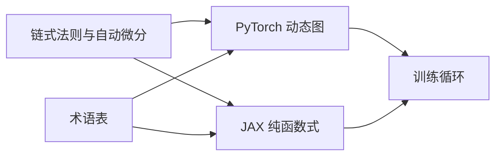

# 深度学习框架入门

<cite>
**本文引用的文件**
- [autodiff.py](file://phases/01-math-foundations/05-chain-rule-and-autodiff/code/autodiff.py)
- [autodiff 教程](file://phases/01-math-foundations/05-chain-rule-and-autodiff/docs/en.md)
- [pytorch 入门](file://phases/03-deep-learning-core/11-intro-to-pytorch/code/pytorch_intro.py)
- [jax 入门](file://phases/03-deep-learning-core/12-intro-to-jax/code/jax_intro.py)
- [技能：梯度计算](file://phases/01-math-foundations/04-calculus-for-ml/outputs/skill-gradient-computation.md)
- [术语表](file://glossary/terms.md)
- [站点数据](file://site/data.js)
</cite>

## 目录
1. [引言](#引言)
2. [项目结构](#项目结构)
3. [核心组件](#核心组件)
4. [架构总览](#架构总览)
5. [详细组件分析](#详细组件分析)
6. [依赖关系分析](#依赖关系分析)
7. [性能考量](#性能考量)
8. [故障排查指南](#故障排查指南)
9. [结论](#结论)
10. [附录](#附录)

## 引言
本指南面向希望从零理解并动手构建深度学习框架的学习者，系统讲解张量与自动微分、神经网络层的实现，并以 PyTorch 与 JAX 为例，对比其核心理念与工程实践（动态图 vs 纯函数式、自动微分、XLA 编译、向量化与并行）。同时提供完整代码示例路径与训练流程，帮助你完成从数学原理到工程落地的完整闭环。

## 项目结构
该仓库围绕“数学基础—机器学习基础—深度学习核心—计算机视觉/NLP/生成模型—工程化与生产”组织，其中与本指南直接相关的内容主要分布在：
- 数学基础：链式法则与自动微分、向量矩阵运算、微积分在机器学习中的应用
- 深度学习核心：PyTorch 入门、JAX 入门、调试神经网络
- 工具与术语：术语表、站点数据（课程索引）

章节来源
- [站点数据:591-616](file://site/data.js#L591-L616)

## 核心组件
- 自动微分引擎（从零实现）：通过记录运算图与反向传播，计算任意可微表达式的梯度；用于理解 PyTorch/JAX 的本质。
- 神经网络层：线性层、激活函数、损失与优化器、训练循环。
- PyTorch 组件：Tensor、autograd、Module、Sequential、优化器与调度器、DataLoader。
- JAX 组件：函数式自动微分（grad）、JIT 编译（jit）、向量化（vmap）、随机数、Optax 优化器。

章节来源
- [autodiff.py:4-105](file://phases/01-math-foundations/05-chain-rule-and-autodiff/code/autodiff.py#L4-L105)
- [pytorch 入门:45-112](file://phases/03-deep-learning-core/11-intro-to-pytorch/code/pytorch_intro.py#L45-L112)
- [jax 入门:39-106](file://phases/03-deep-learning-core/12-intro-to-jax/code/jax_intro.py#L39-L106)

## 架构总览
下图展示了从“张量与自动微分”到“训练循环”的端到端流程，以及 PyTorch 与 JAX 在工程上的差异：

图表来源
- [autodiff 教程:145-168](file://phases/01-math-foundations/05-chain-rule-and-autodiff/docs/en.md#L145-L168)
- [pytorch 入门:45-112](file://phases/03-deep-learning-core/11-intro-to-pytorch/code/pytorch_intro.py#L45-L112)
- [jax 入门:39-106](file://phases/03-deep-learning-core/12-intro-to-jax/code/jax_intro.py#L39-L106)

## 详细组件分析

### 自动微分引擎（Value 类）
- 设计目标：在不引入外部依赖的前提下，实现一个最小可用的自动微分引擎，支持加法、乘法、幂、指数、对数、tanh、ReLU 等常见操作，并能通过拓扑排序进行反向传播。
- 关键点：
  - 值包装：每个数值被包装为节点，保存 data、grad、上游依赖与局部反传函数。
  - 图记录：运算时创建新节点并记录父节点，形成可微计算图。
  - 反向传播：拓扑序遍历，自顶向下应用链式法则累积梯度。
- 验证手段：与 PyTorch 结果比对、数值梯度检查（有限差分）。

图表来源
- [autodiff.py:4-105](file://phases/01-math-foundations/05-chain-rule-and-autodiff/code/autodiff.py#L4-L105)

章节来源
- [autodiff.py:171-239](file://phases/01-math-foundations/05-chain-rule-and-autodiff/code/autodiff.py#L171-L239)
- [autodiff 教程:135-168](file://phases/01-math-foundations/05-chain-rule-and-autodiff/docs/en.md#L135-L168)

### 神经网络层与训练循环
- 单层感知机与 MLP：权重与偏置作为可微参数，前向通过线性变换与激活，反向通过自动微分更新。
- 训练循环：前向、损失计算、反向、参数更新、评估指标统计。
- 梯度检查：通过数值微分验证自动微分结果的正确性。

图表来源
- [autodiff.py:243-273](file://phases/01-math-foundations/05-chain-rule-and-autodiff/code/autodiff.py#L243-L273)
- [技能：梯度计算:1-29](file://phases/01-math-foundations/04-calculus-for-ml/outputs/skill-gradient-computation.md#L1-L29)

章节来源
- [autodiff.py:243-273](file://phases/01-math-foundations/05-chain-rule-and-autodiff/code/autodiff.py#L243-L273)
- [技能：梯度计算:1-29](file://phases/01-math-foundations/04-calculus-for-ml/outputs/skill-gradient-computation.md#L1-L29)

### PyTorch 组件与训练流程
- Tensor：多维数组，支持设备（CPU/GPU）与 dtype 切换。
- autograd：动态图记录与反向传播，支持 requires_grad、grad_fn、累积梯度。
- Module/Sequential：模块化封装，参数管理（parameters/named_parameters），训练/推理模式切换。
- 优化器与调度器：SGD、Adam、余弦退火等。
- DataLoader：批数据加载与打乱。
- 完整示例：MNIST 分类、Dropout/BatchNorm、学习率调度、模型保存/加载。

图表来源
- [pytorch 入门:79-112](file://phases/03-deep-learning-core/11-intro-to-pytorch/code/pytorch_intro.py#L79-L112)
- [pytorch 入门:136-166](file://phases/03-deep-learning-core/11-intro-to-pytorch/code/pytorch_intro.py#L136-L166)

章节来源
- [pytorch 入门:45-112](file://phases/03-deep-learning-core/11-intro-to-pytorch/code/pytorch_intro.py#L45-L112)
- [pytorch 入门:136-234](file://phases/03-deep-learning-core/11-intro-to-pytorch/code/pytorch_intro.py#L136-L234)

### JAX 组件与函数式范式
- 函数式自动微分：grad 对标 PyTorch 的 autograd，支持一阶/高阶导数。
- JIT 编译：jit 将纯函数编译为 XLA，显著加速计算。
- 自动向量化：vmap 将函数向量化到批量维度，提升吞吐。
- 并行与分布式：pmap 支持跨设备并行。
- 参数与随机数：使用 PRNGKey 控制随机性，参数以 Pytree 形式组织。
- 完整示例：MNIST 前向、损失、优化（Optax）、训练循环。

图表来源
- [jax 入门:39-106](file://phases/03-deep-learning-core/12-intro-to-jax/code/jax_intro.py#L39-L106)
- [jax 入门:109-171](file://phases/03-deep-learning-core/12-intro-to-jax/code/jax_intro.py#L109-L171)

章节来源
- [jax 入门:39-106](file://phases/03-deep-learning-core/12-intro-to-jax/code/jax_intro.py#L39-L106)
- [jax 入门:109-171](file://phases/03-deep-learning-core/12-intro-to-jax/code/jax_intro.py#L109-L171)

## 依赖关系分析
- 数学基础依赖：链式法则是自动微分的数学根基，贯穿 PyTorch 与 JAX 的实现。
- 框架依赖：
  - PyTorch：动态图 + autograd + Module/Sequential + 优化器/调度器 + DataLoader。
  - JAX：纯函数式 + grad/jit/vmap/pmap + Optax + Pytree。
- 术语支撑：张量、自动微分、梯度、反向传播、激活函数、优化器、学习率调度等术语统一了讨论口径。

图表来源
- [术语表:35-37](file://glossary/terms.md#L35-L37)
- [术语表:335-337](file://glossary/terms.md#L335-L337)
- [站点数据:591-616](file://site/data.js#L591-L616)

章节来源
- [术语表:35-37](file://glossary/terms.md#L35-L37)
- [术语表:335-337](file://glossary/terms.md#L335-L337)
- [站点数据:591-616](file://site/data.js#L591-L616)

## 性能考量
- 计算图与内存：PyTorch 动态图灵活但需注意中间激活的内存占用；JAX 纯函数式便于编译优化，但需避免不必要的 Python 循环。
- JIT 与 XLA：JAX 的 jit 可显著加速重复计算；注意首次编译开销与常数折叠。
- 向量化与并行：JAX 的 vmap/pmap 提升吞吐；PyTorch 的 DataLoader 与 GPU/AMP 有助于吞吐与稳定性。
- 学习率与调度：合适的调度策略（如余弦退火）可稳定收敛并提升最终精度。
- 梯度检查：开发阶段使用数值梯度验证自动微分正确性，避免 NaN/爆炸梯度等问题。

## 故障排查指南
- 梯度异常：NaN、无穷大或爆炸梯度，优先检查学习率、损失缩放、数值稳定性（log、softmax）。
- 梯度检查：使用数值微分对比自动微分结果，定位自定义操作的反传错误。
- 训练不收敛：检查激活函数选择、权重初始化、正则化强度、学习率与调度策略。
- 设备与数据：确保张量与标签在同一设备上，DataLoader 批大小与洗牌设置合理。

章节来源
- [技能：梯度计算:1-29](file://phases/01-math-foundations/04-calculus-for-ml/outputs/skill-gradient-computation.md#L1-L29)
- [pytorch 入门:79-112](file://phases/03-deep-learning-core/11-intro-to-pytorch/code/pytorch_intro.py#L79-L112)

## 结论
通过从零实现自动微分引擎，结合 PyTorch 的动态图与 JAX 的纯函数式范式，你可以深入理解“张量—自动微分—神经网络—训练循环”的全栈流程。建议先掌握数学原理与最小引擎，再迁移到工程框架，最后根据场景选择合适的工具链（PyTorch 更适合研究与快速迭代，JAX 更适合函数式与高性能编译）。

## 附录
- 代码示例路径（不含具体代码内容，仅提供定位）：
  - 自动微分引擎与 MLP 训练：[autodiff.py:243-273](file://phases/01-math-foundations/05-chain-rule-and-autodiff/code/autodiff.py#L243-L273)
  - PyTorch MNIST 训练与评估：[pytorch 入门:79-112](file://phases/03-deep-learning-core/11-intro-to-pytorch/code/pytorch_intro.py#L79-L112)
  - JAX MNIST 训练与 JIT：[jax 入门:72-106](file://phases/03-deep-learning-core/12-intro-to-jax/code/jax_intro.py#L72-L106)
- 术语参考：
  - 自动微分、张量、梯度、反向传播、优化器、学习率调度等见术语表对应条目。