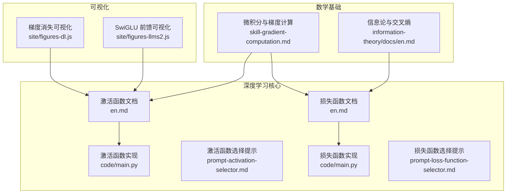
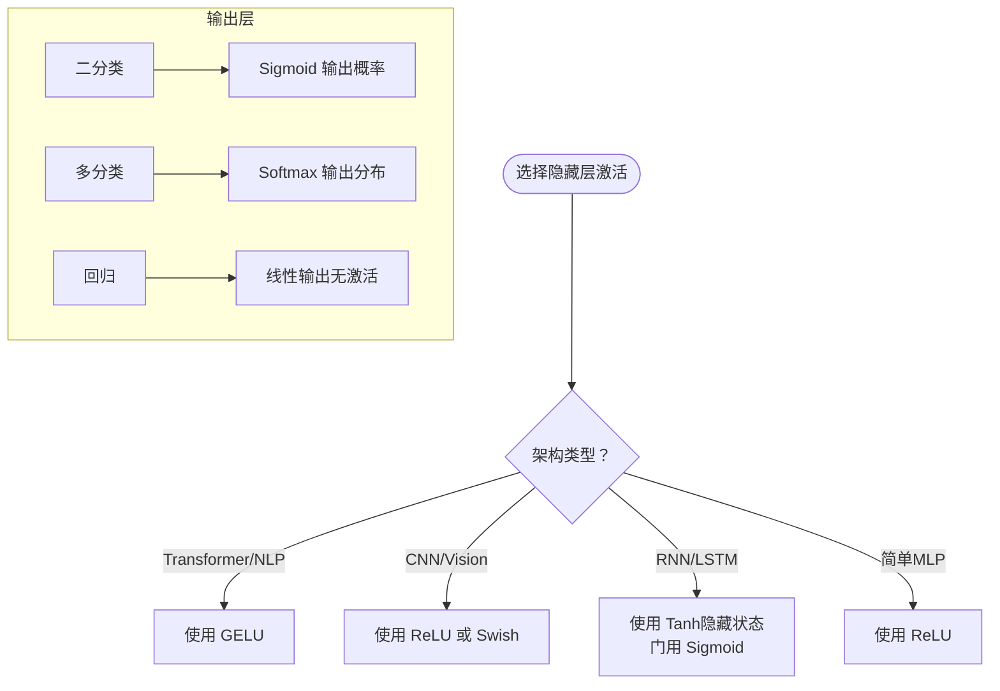
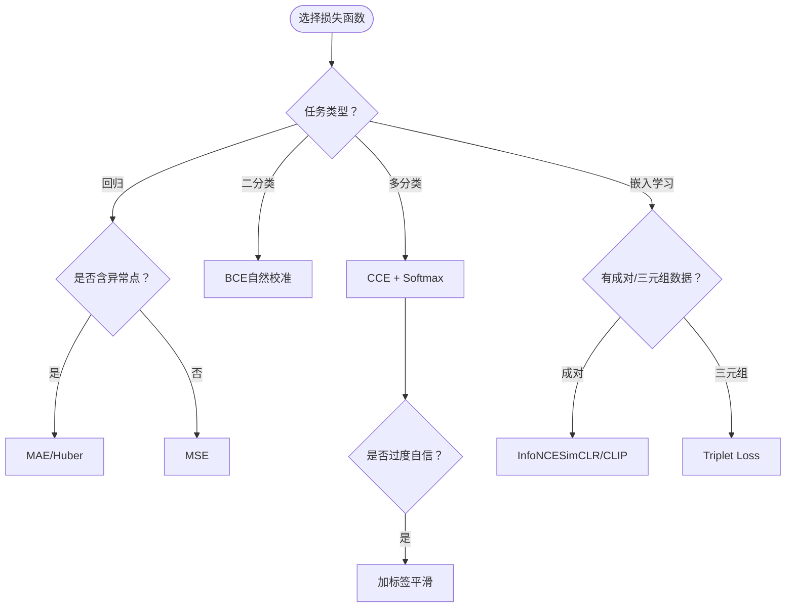
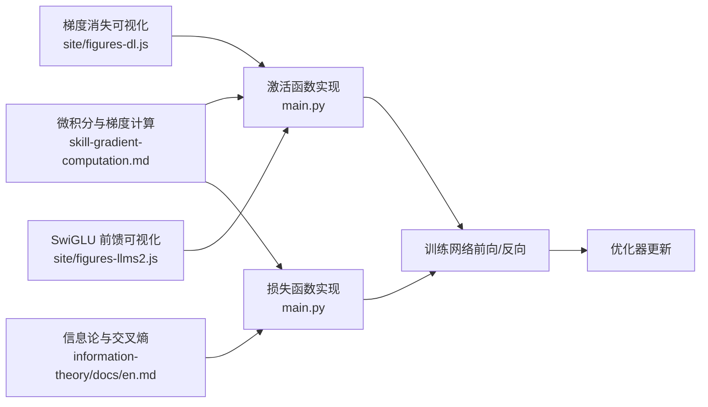

# 激活函数与损失函数

<cite>
**本文引用的文件**
- [激活函数文档](file://phases/03-deep-learning-core/04-activation-functions/docs/en.md)
- [激活函数实现](file://phases/03-deep-learning-core/04-activation-functions/code/main.py)
- [激活函数选择提示](file://phases/03-deep-learning-core/04-activation-functions/outputs/prompt-activation-selector.md)
- [激活函数测验](file://phases/03-deep-learning-core/04-activation-functions/quiz.json)
- [损失函数文档](file://phases/03-deep-learning-core/05-loss-functions/docs/en.md)
- [损失函数实现](file://phases/03-deep-learning-core/05-loss-functions/code/main.py)
- [损失函数选择提示](file://phases/03-deep-learning-core/05-loss-functions/outputs/prompt-loss-function-selector.md)
- [损失函数测验](file://phases/03-deep-learning-core/05-loss-functions/quiz.json)
- [微积分与梯度计算](file://phases/01-math-foundations/04-calculus-for-ml/outputs/skill-gradient-computation.md)
- [信息论与交叉熵](file://phases/01-math-foundations/09-information-theory/docs/en.md)
- [深度学习可视化：梯度消失](file://site/figures-dl.js)
- [LLM2 可视化：SwiGLU 前馈](file://site/figures-llms2.js)
</cite>

## 目录
1. [简介](#简介)
2. [项目结构](#项目结构)
3. [核心组件](#核心组件)
4. [架构总览](#架构总览)
5. [详细组件分析](#详细组件分析)
6. [依赖关系分析](#依赖关系分析)
7. [性能考量](#性能考量)
8. [故障排查指南](#故障排查指南)
9. [结论](#结论)
10. [附录](#附录)

## 简介
本章节聚焦于“激活函数”与“损失函数”的系统化知识与工程实践，结合仓库中的教学文档、可运行示例与可视化资源，帮助读者：
- 深入理解各类激活函数的数学特性、梯度行为与适用场景（Sigmoid、Tanh、ReLU、Leaky ReLU、GELU、Swish/SiLU、Softmax）。
- 掌握不同任务下的损失函数选择策略（回归：MSE；二分类：BCE；多分类：CCE；自监督：对比损失/InfoNCE；不平衡：Focal Loss）。
- 通过可视化与实验脚本，直观认识梯度消失/爆炸、过拟合/欠拟合、收敛速度差异等关键现象。
- 提供最佳实践与调试建议，指导在真实项目中做出稳健的函数选择与超参数配置。

## 项目结构
本主题涉及的资料主要分布在以下路径：
- 深度学习核心模块：激活函数与损失函数的教学文档与代码示例
- 数学基础：微积分与梯度、信息论与交叉熵
- 可视化：梯度消失演示、SwiGLU 前馈可视化
- 工程提示：激活函数与损失函数的选择提示词



图示来源
- [激活函数文档](file://phases/03-deep-learning-core/04-activation-functions/docs/en.md)
- [激活函数实现](file://phases/03-deep-learning-core/04-activation-functions/code/main.py)
- [激活函数选择提示](file://phases/03-deep-learning-core/04-activation-functions/outputs/prompt-activation-selector.md)
- [损失函数文档](file://phases/03-deep-learning-core/05-loss-functions/docs/en.md)
- [损失函数实现](file://phases/03-deep-learning-core/05-loss-functions/code/main.py)
- [损失函数选择提示](file://phases/03-deep-learning-core/05-loss-functions/outputs/prompt-loss-function-selector.md)
- [微积分与梯度计算](file://phases/01-math-foundations/04-calculus-for-ml/outputs/skill-gradient-computation.md)
- [信息论与交叉熵](file://phases/01-math-foundations/09-information-theory/docs/en.md)
- [深度学习可视化：梯度消失](file://site/figures-dl.js)
- [LLM2 可视化：SwiGLU 前馈](file://site/figures-llms2.js)

章节来源
- [激活函数文档](file://phases/03-deep-learning-core/04-activation-functions/docs/en.md)
- [损失函数文档](file://phases/03-deep-learning-core/05-loss-functions/docs/en.md)

## 核心组件
- 激活函数族：Sigmoid、Tanh、ReLU、Leaky ReLU、GELU、Swish/SiLU、Softmax
- 损失函数族：MSE、二元交叉熵（BCE）、多类交叉熵（CCE）、对比损失（InfoNCE）、三元组损失（Triplet）、焦点损失（Focal Loss）
- 关键概念：梯度消失/爆炸、饱和区、零中心化、平滑梯度、概率分布、数值稳定性

章节来源
- [激活函数文档](file://phases/03-deep-learning-core/04-activation-functions/docs/en.md)
- [损失函数文档](file://phases/03-deep-learning-core/05-loss-functions/docs/en.md)

## 架构总览
激活函数与损失函数在神经网络训练中的位置与交互如下：

```mermaid
sequenceDiagram
participant Data as "数据"
participant Net as "网络前向"
participant Act as "激活函数"
participant Loss as "损失函数"
participant Grad as "反向传播"
participant Opt as "优化器"
Data->>Net : 输入样本
Net->>Act : 线性变换后送入激活
Act-->>Net : 激活输出
Net->>Loss : 计算损失预测 vs 标签
Loss-->>Grad : 损失标量
Grad->>Act : 乘以激活导数链式法则
Grad->>Opt : 更新权重
Opt-->>Net : 参数更新
```

图示来源
- [激活函数文档](file://phases/03-deep-learning-core/04-activation-functions/docs/en.md)
- [损失函数文档](file://phases/03-deep-learning-core/05-loss-functions/docs/en.md)

## 详细组件分析

### 激活函数详解与可视化

- Sigmoid
  - 数学特性：输出范围(0,1)，平滑、可导，最大导数约0.25
  - 梯度问题：深层连乘导致梯度指数级衰减，易出现“梯度消失”
  - 场景：早期网络、输出层二分类（配合Sigmoid输出概率）
  - 代码实现路径：[sigmoid 实现](file://phases/03-deep-learning-core/04-activation-functions/code/main.py)
  - 可视化：梯度消失演示中展示其导数上限与深度衰减
    - [梯度消失可视化](file://site/figures-dl.js)

- Tanh
  - 数学特性：输出范围(-1,1)，零中心化，导数最大1.0
  - 梯度问题：仍会随输入增大趋近于0，深层仍有消失风险
  - 场景：历史上的隐藏层激活，现代多被ReLU/GELU替代
  - 代码实现路径：[tanh 实现](file://phases/03-deep-learning-core/04-activation-functions/code/main.py)

- ReLU
  - 数学特性：输出[0,+∞)，正区间导数恒为1，简单高效
  - 梯度问题：负区间导数为0，可能导致“死亡神经元”
  - 场景：默认隐藏层激活，深度网络首选
  - 代码实现路径：[ReLU 实现](file://phases/03-deep-learning-core/04-activation-functions/code/main.py)
  - 实验：死亡神经元检测与训练比较
    - [死亡神经元检测](file://phases/03-deep-learning-core/04-activation-functions/code/main.py)

- Leaky ReLU
  - 数学特性：负区间有小斜率α（通常0.01），缓解死亡神经元
  - 场景：当ReLU出现大量死亡时的替代
  - 代码实现路径：[Leaky ReLU 实现](file://phases/03-deep-learning-core/04-activation-functions/code/main.py)

- GELU
  - 数学特性：平滑、非单调、允许小负值，基于高斯误差的平滑门控
  - 梯度优势：无“硬截断”，避免ReLU的死亡神经元，梯度更稳定
  - 场景：现代Transformer（BERT/GPT）默认隐藏层激活
  - 代码实现路径：[GELU 实现](file://phases/03-deep-learning-core/04-activation-functions/code/main.py)

- Swish/SiLU
  - 数学特性：x·sigmoid(x)，自门控，平滑且非单调
  - 场景：EfficientNet等视觉模型；与GELU性能相近
  - 代码实现路径：[Swish 实现](file://phases/03-deep-learning-core/04-activation-functions/code/main.py)
  - 可视化：SwiGLU前馈对比（ReLU vs SwiGLU）
    - [SwiGLU 前馈可视化](file://site/figures-llms2.js)

- Softmax
  - 数学特性：将logits转为概率分布，所有输出和为1
  - 场景：多分类输出层
  - 代码实现路径：[Softmax 实现](file://phases/03-deep-learning-core/04-activation-functions/code/main.py)



图示来源
- [激活函数文档](file://phases/03-deep-learning-core/04-activation-functions/docs/en.md)

章节来源
- [激活函数文档](file://phases/03-deep-learning-core/04-activation-functions/docs/en.md)
- [激活函数实现](file://phases/03-deep-learning-core/04-activation-functions/code/main.py)
- [深度学习可视化：梯度消失](file://site/figures-dl.js)
- [LLM2 可视化：SwiGLU 前馈](file://site/figures-llms2.js)

### 损失函数详解与可视化

- 回归任务
  - MSE：平方误差，对大误差敏感，易受异常点影响
  - MAE/Huber：鲁棒性更强，适合存在异常点的数据
  - 代码实现路径：[MSE/BCE/CCE/对比损失实现](file://phases/03-deep-learning-core/05-loss-functions/code/main.py)

- 分类任务
  - 二分类：BCE（-y log p - (1-y) log (1-p)），梯度在错误预测时强，在正确预测时弱
  - 多分类：CCE（-log p_true），常与Softmax配对，梯度简洁
  - 代码实现路径：[BCE/CCE/Softmax 实现](file://phases/03-deep-learning-core/05-loss-functions/code/main.py)
  - 信息论视角：交叉熵衡量编码效率，最小化交叉熵等价于最大化似然
    - [信息论与交叉熵](file://phases/01-math-foundations/09-information-theory/docs/en.md)

- 自监督/表示学习
  - InfoNCE（SimCLR/CLIP风格）：温度缩放的对比损失，使正样本相似度最高
  - Triplet Loss：锚-正-负三元组距离约束
  - 代码实现路径：[对比损失/Triplet 实现](file://phases/03-deep-learning-core/05-loss-functions/code/main.py)

- 不平衡数据
  - Focal Loss：降低易例权重，聚焦难例，提升召回
  - 代码实现路径：[Focal Loss 实现思路](file://phases/03-deep-learning-core/05-loss-functions/docs/en.md)



图示来源
- [损失函数文档](file://phases/03-deep-learning-core/05-loss-functions/docs/en.md)

章节来源
- [损失函数文档](file://phases/03-deep-learning-core/05-loss-functions/docs/en.md)
- [损失函数实现](file://phases/03-deep-learning-core/05-loss-functions/code/main.py)
- [信息论与交叉熵](file://phases/01-math-foundations/09-information-theory/docs/en.md)

### 梯度问题与收敛影响

- 梯度消失/爆炸
  - 深层连乘激活导数：Sigmoid≈0.25、Tanh≈~0.42、ReLU在正区间为1
  - 深度越深，连乘结果越小（消失）或越大（爆炸）
  - 可视化：梯度消失演示（对数坐标）
    - [梯度消失可视化](file://site/figures-dl.js)

- 激活函数对收敛的影响
  - ReLU/GELU保持梯度幅度，加速深层训练
  - Sigmoid/Tanh在深层易饱和，导致早期层难以更新
  - Swish/SiLU/GELU的平滑性有助于稳定训练与更快收敛

- 损失函数对收敛的影响
  - MSE在分类上梯度在0/1饱和区变平，BCE在错误预测处产生强梯度，更适合分类
  - 交叉熵与Softmax配对时梯度简洁，便于优化
  - 对比损失通过温度控制分离难度，影响收敛速度与稳定性

章节来源
- [微积分与梯度计算](file://phases/01-math-foundations/04-calculus-for-ml/outputs/skill-gradient-computation.md)
- [深度学习可视化：梯度消失](file://site/figures-dl.js)
- [损失函数文档](file://phases/03-deep-learning-core/05-loss-functions/docs/en.md)

## 依赖关系分析



图示来源
- [激活函数实现](file://phases/03-deep-learning-core/04-activation-functions/code/main.py)
- [损失函数实现](file://phases/03-deep-learning-core/05-loss-functions/code/main.py)
- [微积分与梯度计算](file://phases/01-math-foundations/04-calculus-for-ml/outputs/skill-gradient-computation.md)
- [信息论与交叉熵](file://phases/01-math-foundations/09-information-theory/docs/en.md)
- [深度学习可视化：梯度消失](file://site/figures-dl.js)
- [LLM2 可视化：SwiGLU 前馈](file://site/figures-llms2.js)

章节来源
- [激活函数实现](file://phases/03-deep-learning-core/04-activation-functions/code/main.py)
- [损失函数实现](file://phases/03-deep-learning-core/05-loss-functions/code/main.py)

## 性能考量
- 激活函数
  - ReLU/GELU在深层网络中梯度稳定，训练更快；Swish/SiLU在某些视觉任务表现优异
  - 避免深层使用Sigmoid/Tanh，防止梯度消失
  - 若出现大量死亡神经元，优先考虑GELU或Leaky ReLU

- 损失函数
  - 分类任务首选BCE（二分类）与CCE（多分类），并配合Softmax
  - 回归任务若存在异常点，优先MAE/Huber
  - 自监督学习中，合理设置温度参数，避免过度尖锐导致不稳定
  - 不平衡数据使用Focal Loss聚焦难例

[本节为通用指导，无需特定文件引用]

## 故障排查指南

- 激活函数相关
  - 梯度消失：检查是否使用ReLU/GELU；确认初始化与学习率；必要时使用残差连接
  - 死亡神经元：将ReLU替换为Leaky ReLU或GELU；检查偏置初始化
  - 训练不稳定：尝试GELU替代ReLU；检查学习率与权重初始化

- 损失函数相关
  - MSE用于分类导致“全0.5”预测：改用BCE/CCE
  - 过度自信/校准差：加入标签平滑或温度缩放
  - 自监督嵌入退化：检查对比损失温度与负样本数量；确保正负样本质量

- 调试工具与提示
  - 使用激活函数选择提示词快速定位合适激活
    - [激活函数选择提示](file://phases/03-deep-learning-core/04-activation-functions/outputs/prompt-activation-selector.md)
  - 使用损失函数选择提示词快速定位合适损失
    - [损失函数选择提示](file://phases/03-deep-learning-core/05-loss-functions/outputs/prompt-loss-function-selector.md)
  - 测验题目可辅助巩固关键概念
    - [激活函数测验](file://phases/03-deep-learning-core/04-activation-functions/quiz.json)
    - [损失函数测验](file://phases/03-deep-learning-core/05-loss-functions/quiz.json)

章节来源
- [激活函数选择提示](file://phases/03-deep-learning-core/04-activation-functions/outputs/prompt-activation-selector.md)
- [损失函数选择提示](file://phases/03-deep-learning-core/05-loss-functions/outputs/prompt-loss-function-selector.md)
- [激活函数测验](file://phases/03-deep-learning-core/04-activation-functions/quiz.json)
- [损失函数测验](file://phases/03-deep-learning-core/05-loss-functions/quiz.json)

## 结论
- 激活函数与损失函数的选择直接决定模型能否有效学习与稳定收敛。
- 深度网络应优先采用ReLU/GELU等平滑、非饱和的激活；输出层根据任务选择Sigmoid/Softmax/线性。
- 分类任务必须使用BCE/CCE，回归任务在异常点存在时优先MAE/Huber；自监督学习采用对比损失并合理设置温度。
- 通过可视化与实验脚本，可以直观理解梯度行为与收敛差异，从而做出更稳健的工程决策。

[本节为总结性内容，无需特定文件引用]

## 附录

### 激活函数与损失函数的可视化与代码路径索引
- 激活函数实现与实验
  - [sigmoid/tanh/relu/leaky_relu/gelu/swish/softmax 实现](file://phases/03-deep-learning-core/04-activation-functions/code/main.py)
  - [梯度扫描与梯度消失实验](file://phases/03-deep-learning-core/04-activation-functions/code/main.py)
  - [死亡神经元检测与训练比较](file://phases/03-deep-learning-core/04-activation-functions/code/main.py)
  - [SwiGLU 前馈可视化](file://site/figures-llms2.js)

- 损失函数实现与实验
  - [MSE/BCE/CCE/Softmax/对比损失实现](file://phases/03-deep-learning-core/05-loss-functions/code/main.py)
  - [MSE vs BCE 训练比较](file://phases/03-deep-learning-core/05-loss-functions/code/main.py)

- 数学基础与概念
  - [微积分与梯度计算（含常见导数表）](file://phases/01-math-foundations/04-calculus-for-ml/outputs/skill-gradient-computation.md)
  - [信息论与交叉熵（交叉熵损失来源与动机）](file://phases/01-math-foundations/09-information-theory/docs/en.md)

章节来源
- [激活函数实现](file://phases/03-deep-learning-core/04-activation-functions/code/main.py)
- [损失函数实现](file://phases/03-deep-learning-core/05-loss-functions/code/main.py)
- [微积分与梯度计算](file://phases/01-math-foundations/04-calculus-for-ml/outputs/skill-gradient-computation.md)
- [信息论与交叉熵](file://phases/01-math-foundations/09-information-theory/docs/en.md)
- [LLM2 可视化：SwiGLU 前馈](file://site/figures-llms2.js)