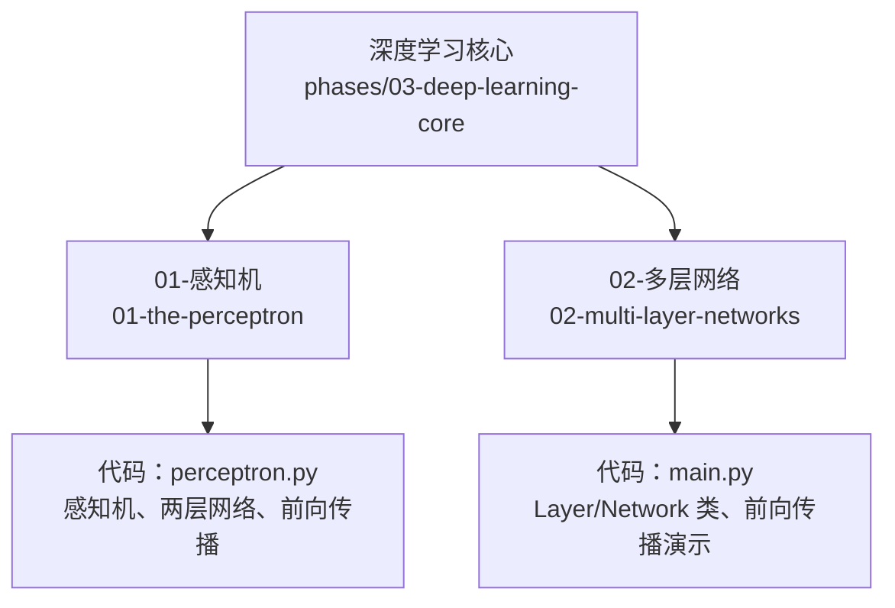
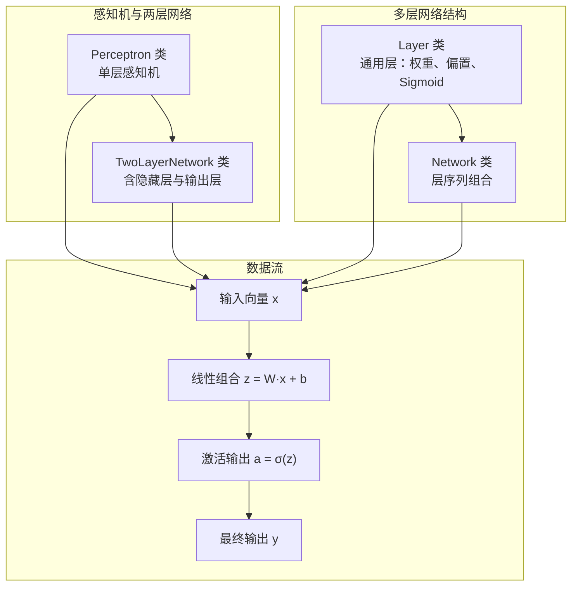
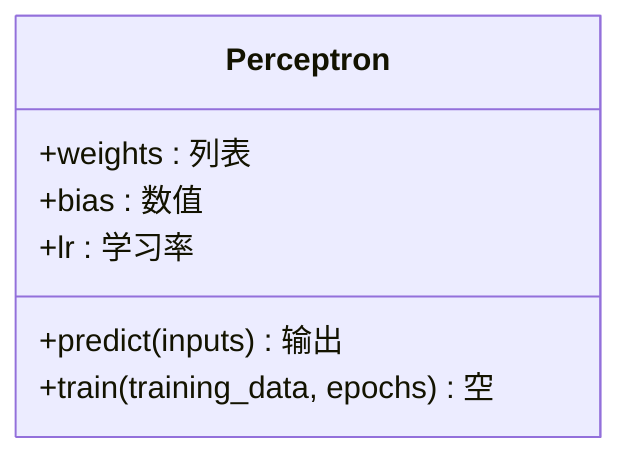
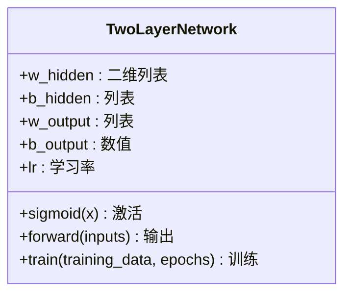
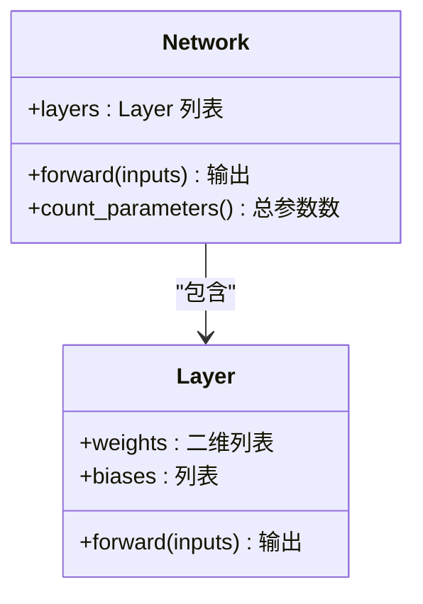
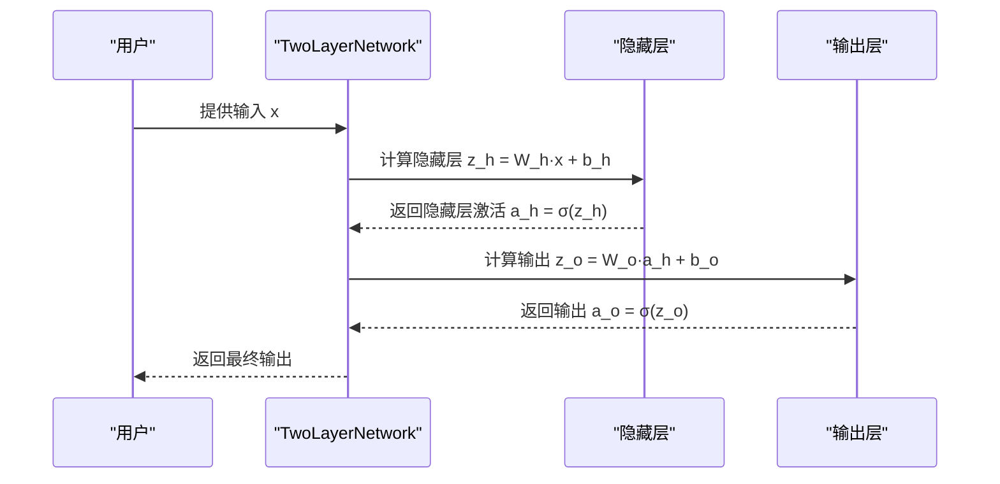
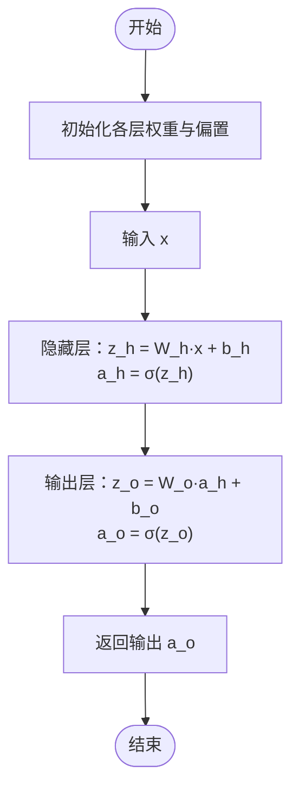

# 神经网络基础

<cite>
**本文引用的文件**
- [phases/03-deep-learning-core/01-the-perceptron/code/perceptron.py](file://phases/03-deep-learning-core/01-the-perceptron/code/perceptron.py)
- [phases/03-deep-learning-core/02-multi-layer-networks/code/main.py](file://phases/03-deep-learning-core/02-multi-layer-networks/code/main.py)
</cite>

## 目录
1. [引言](#引言)
2. [项目结构](#项目结构)
3. [核心组件](#核心组件)
4. [架构总览](#架构总览)
5. [详细组件分析](#详细组件分析)
6. [依赖分析](#依赖分析)
7. [性能考量](#性能考量)
8. [故障排查指南](#故障排查指南)
9. [结论](#结论)
10. [附录](#附录)

## 引言
本课程面向零基础学习者，系统讲解神经网络的基础知识与实践方法。内容覆盖感知机的数学原理与实现、单层感知机无法解决异或问题的根源、多层神经网络的结构设计与前向传播流程，并通过从零实现的代码示例帮助读者建立“权重、偏置、激活函数”的直观理解。同时给出网络架构选择策略与调试技巧，使学习者能够独立搭建并验证小型神经网络。

## 项目结构
本次文档聚焦于深度学习核心模块中的两个关键示例：单层感知机与多层网络。它们分别位于以下路径：
- 感知机与多层网络实现：phases/03-deep-learning-core/01-the-perceptron/code/perceptron.py
- 多层网络结构与前向传播演示：phases/03-deep-learning-core/02-multi-layer-networks/code/main.py

下图展示这两个文件在课程体系中的位置与职责：

图表来源
- [phases/03-deep-learning-core/01-the-perceptron/code/perceptron.py](file://phases/03-deep-learning-core/01-the-perceptron/code/perceptron.py)
- [phases/03-deep-learning-core/02-multi-layer-networks/code/main.py](file://phases/03-deep-learning-core/02-multi-layer-networks/code/main.py)

章节来源
- [phases/03-deep-learning-core/01-the-perceptron/code/perceptron.py](file://phases/03-deep-learning-core/01-the-perceptron/code/perceptron.py)
- [phases/03-deep-learning-core/02-multi-layer-networks/code/main.py](file://phases/03-deep-learning-core/02-multi-layer-networks/code/main.py)

## 核心组件
本节对两类核心组件进行深入解析：
- 单层感知机与两层网络：实现权重更新规则、前向传播、Sigmoid 激活与参数初始化。
- 多层网络结构：以 Layer 与 Network 组合的方式组织网络，支持任意层数与节点数配置。

关键点
- 权重与偏置：每个连接与每个神经元都有对应参数；训练时通过误差反传更新。
- 激活函数：使用 Sigmoid 将线性组合映射到(0,1)，便于二分类输出。
- 前向传播：逐层计算 z = W·x + b，再经激活得到下一层输入。

章节来源
- [phases/03-deep-learning-core/01-the-perceptron/code/perceptron.py](file://phases/03-deep-learning-core/01-the-perceptron/code/perceptron.py)
- [phases/03-deep-learning-core/02-multi-layer-networks/code/main.py](file://phases/03-deep-learning-core/02-multi-layer-networks/code/main.py)

## 架构总览
下图展示了两类实现的整体架构与数据流：

图表来源
- [phases/03-deep-learning-core/01-the-perceptron/code/perceptron.py](file://phases/03-deep-learning-core/01-the-perceptron/code/perceptron.py)
- [phases/03-deep-learning-core/02-multi-layer-networks/code/main.py](file://phases/03-deep-learning-core/02-multi-layer-networks/code/main.py)

## 详细组件分析

### 单层感知机（Perceptron）
- 职责：实现感知机的学习规则与预测逻辑，用于线性可分任务（如 AND/OR），无法直接求解 XOR。
- 关键方法：
  - predict：计算加权和并加偏置，用阶跃函数输出类别。
  - train：按批更新权重与偏置，直到收敛或达到最大轮次。
- 数学基础：权重向量与输入向量的内积决定决策边界；偏置控制边界平移。

图表来源
- [phases/03-deep-learning-core/01-the-perceptron/code/perceptron.py](file://phases/03-deep-learning-core/01-the-perceptron/code/perceptron.py)

章节来源
- [phases/03-deep-learning-core/01-the-perceptron/code/perceptron.py](file://phases/03-deep-learning-core/01-the-perceptron/code/perceptron.py)

### 两层网络（TwoLayerNetwork）
- 职责：构建含一个隐藏层的全连接网络，使用 Sigmoid 激活与手写反向传播。
- 结构要点：
  - 隐藏层：2 个神经元，各自计算 z = W·x + b 并经 Sigmoid。
  - 输出层：1 个神经元，接收隐藏层输出作为输入。
  - 参数初始化：随机均匀分布，便于观察训练效果。
- 训练流程：前向传播计算损失，反向传播计算梯度并更新权重与偏置。

图表来源
- [phases/03-deep-learning-core/01-the-perceptron/code/perceptron.py](file://phases/03-deep-learning-core/01-the-perceptron/code/perceptron.py)

章节来源
- [phases/03-deep-learning-core/01-the-perceptron/code/perceptron.py](file://phases/03-deep-learning-core/01-the-perceptron/code/perceptron.py)

### 多层网络结构（Layer 与 Network）
- Layer：封装每层的权重矩阵、偏置向量与前向传播逻辑；使用 Sigmoid 激活。
- Network：由多个 Layer 组成，依次传递输出，形成完整的前向链路。
- 参数统计：累计每层权重与偏置数量，便于评估模型容量。

图表来源
- [phases/03-deep-learning-core/02-multi-layer-networks/code/main.py](file://phases/03-deep-learning-core/02-multi-layer-networks/code/main.py)

章节来源
- [phases/03-deep-learning-core/02-multi-layer-networks/code/main.py](file://phases/03-deep-learning-core/02-multi-layer-networks/code/main.py)

### 前向传播序列（以两层网络为例）
下图展示一次前向传播的关键步骤与数据流向：

图表来源
- [phases/03-deep-learning-core/01-the-perceptron/code/perceptron.py](file://phases/03-deep-learning-core/01-the-perceptron/code/perceptron.py)

章节来源
- [phases/03-deep-learning-core/01-the-perceptron/code/perceptron.py](file://phases/03-deep-learning-core/01-the-perceptron/code/perceptron.py)

### 多层网络前向传播流程（Layer/Network）
该流程强调层间数据传递与激活应用：

图表来源
- [phases/03-deep-learning-core/02-multi-layer-networks/code/main.py](file://phases/03-deep-learning-core/02-multi-layer-networks/code/main.py)

章节来源
- [phases/03-deep-learning-core/02-multi-layer-networks/code/main.py](file://phases/03-deep-learning-core/02-multi-layer-networks/code/main.py)

## 依赖分析
- 内部耦合
  - TwoLayerNetwork 依赖 Sigmoid 实现与内部变量保存（隐藏层输出、权重等），与单层感知机共享激活函数思想但不直接继承。
  - Layer/Network 之间为组合关系，Network 仅负责顺序调用各层的 forward。
- 外部依赖
  - 两个实现均使用 Python 标准库（math、random），未引入外部框架，适合教学演示。
- 循环依赖
  - 无循环导入，结构清晰。

图表来源
- [phases/03-deep-learning-core/01-the-perceptron/code/perceptron.py](file://phases/03-deep-learning-core/01-the-perceptron/code/perceptron.py)
- [phases/03-deep-learning-core/02-multi-layer-networks/code/main.py](file://phases/03-deep-learning-core/02-multi-layer-networks/code/main.py)

章节来源
- [phases/03-deep-learning-core/01-the-perceptron/code/perceptron.py](file://phases/03-deep-learning-core/01-the-perceptron/code/perceptron.py)
- [phases/03-deep-learning-core/02-multi-layer-networks/code/main.py](file://phases/03-deep-learning-core/02-multi-layer-networks/code/main.py)

## 性能考量
- 计算复杂度
  - 前向传播：每层计算为 O(n_in × n_out)，整体随层数与节点数线性增长。
  - 反向传播：与前向传播同阶，需额外存储中间激活值。
- 收敛与稳定性
  - 学习率过大可能导致震荡，过小导致收敛缓慢；建议从较小学习率开始并观察误差曲线。
  - Sigmoid 容易饱和，可能引发梯度消失；深层网络可考虑其他激活函数（此处为教学演示使用 Sigmoid）。
- 参数规模
  - 通过 count_parameters 可估算参数量，指导网络深度与宽度的选择。

章节来源
- [phases/03-deep-learning-core/01-the-perceptron/code/perceptron.py](file://phases/03-deep-learning-core/01-the-perceptron/code/perceptron.py)
- [phases/03-deep-learning-core/02-multi-layer-networks/code/main.py](file://phases/03-deep-learning-core/02-multi-layer-networks/code/main.py)

## 故障排查指南
- 无法收敛或精度低
  - 检查学习率是否合适；尝试增大训练轮次；确认标签与输入格式一致。
  - 对于 XOR 等非线性可分问题，确保使用多层网络而非单层感知机。
- 梯度消失/爆炸
  - 观察隐藏层输出是否接近饱和（接近 0 或 1）；调整权重初始化范围或更换激活函数。
- 运行结果异常
  - 打印前向传播中间值（如隐藏层输出），定位是哪一层出现问题。
  - 使用更小的数据集快速验证逻辑正确性。

章节来源
- [phases/03-deep-learning-core/01-the-perceptron/code/perceptron.py](file://phases/03-deep-learning-core/01-the-perceptron/code/perceptron.py)
- [phases/03-deep-learning-core/02-multi-layer-networks/code/main.py](file://phases/03-deep-learning-core/02-multi-layer-networks/code/main.py)

## 结论
通过单层感知机与多层网络的对比实现，学习者可以清晰理解权重、偏置与激活函数在前向传播中的作用，掌握多层结构如何突破线性可分限制。配合参数统计与调试技巧，能够为进一步学习反向传播、优化器与正则化打下坚实基础。

## 附录
- 层设计与架构选择策略
  - 输入层：节点数等于特征维度。
  - 隐藏层：通常采用 2^n 或按经验倍增，避免过浅导致表达能力不足。
  - 输出层：二分类使用 1 个 Sigmoid 神经元；多分类使用 Softmax 或多个 Sigmoid。
  - 层数选择：先浅后深，逐步增加深度以提升拟合能力，同时关注过拟合风险。
- 实践建议
  - 先用小数据集验证前向传播与反向传播逻辑。
  - 固定随机种子以便复现实验结果。
  - 记录误差随轮次变化，绘制学习曲线辅助调参。