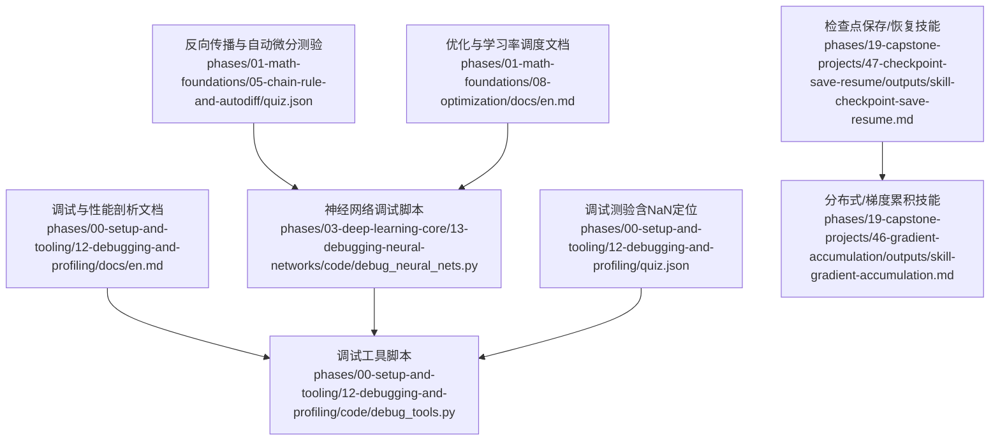
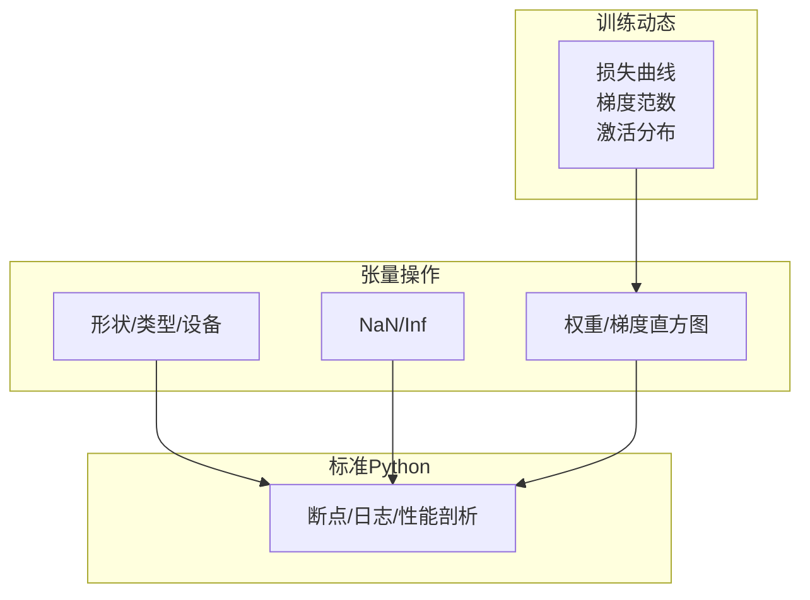
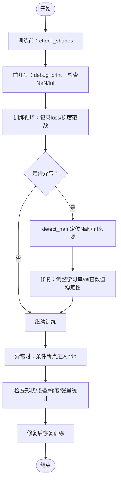
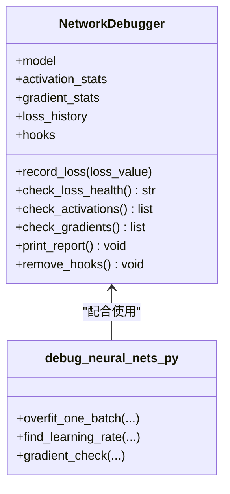
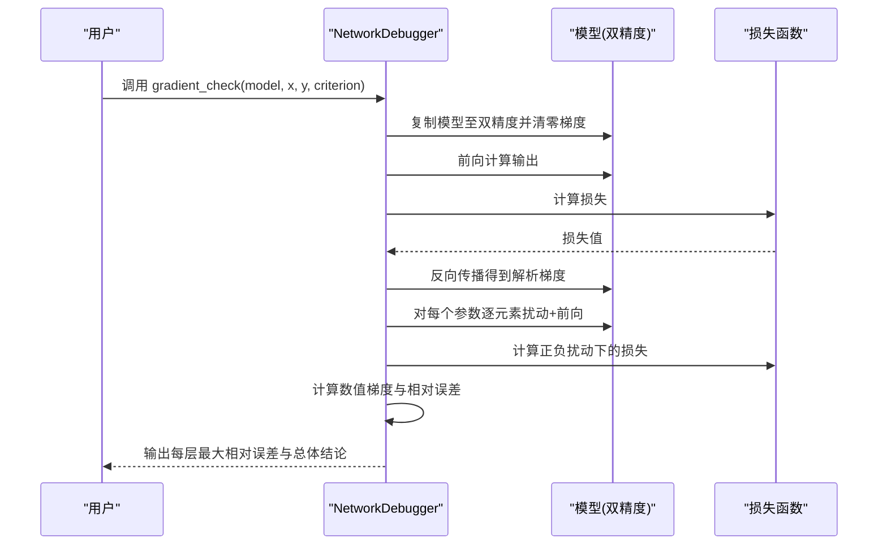
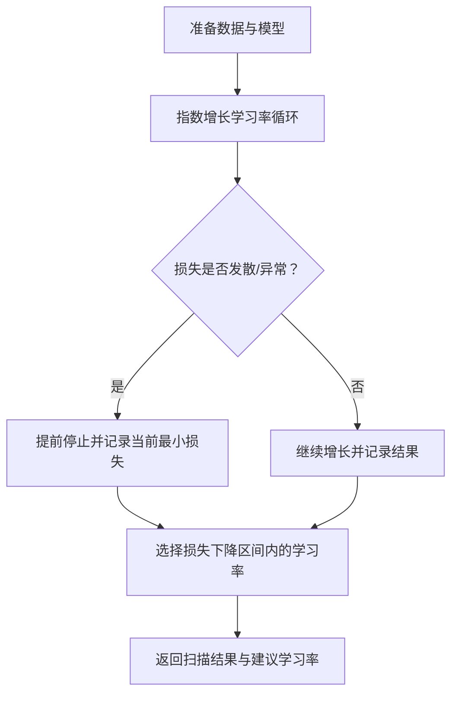
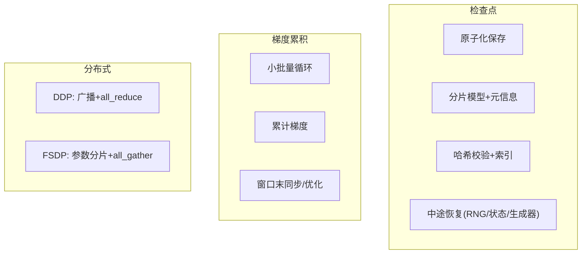
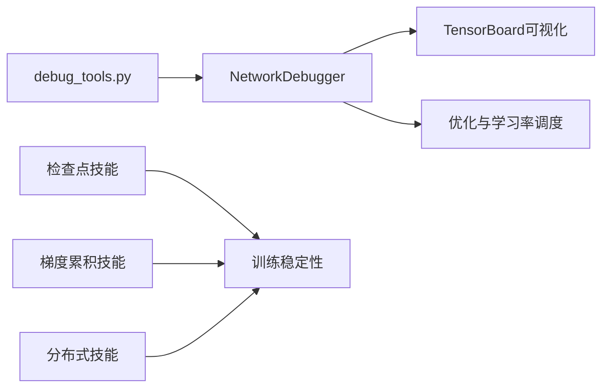

# 神经网络调试与实践

<cite>
**本文引用的文件**
- [phases/00-setup-and-tooling/12-debugging-and-profiling/docs/en.md](file://phases/00-setup-and-tooling/12-debugging-and-profiling/docs/en.md)
- [phases/00-setup-and-tooling/12-debugging-and-profiling/code/debug_tools.py](file://phases/00-setup-and-tooling/12-debugging-and-profiling/code/debug_tools.py)
- [phases/03-deep-learning-core/13-debugging-neural-networks/code/debug_neural_nets.py](file://phases/03-deep-learning-core/13-debugging-neural-networks/code/debug_neural_nets.py)
- [phases/01-math-foundations/05-chain-rule-and-autodiff/quiz.json](file://phases/01-math-foundations/05-chain-rule-and-autodiff/quiz.json)
- [phases/00-setup-and-tooling/12-debugging-and-profiling/quiz.json](file://phases/00-setup-and-tooling/12-debugging-and-profiling/quiz.json)
- [phases/19-capstone-projects/47-checkpoint-save-resume/outputs/skill-checkpoint-save-resume.md](file://phases/19-capstone-projects/47-checkpoint-save-resume/outputs/skill-checkpoint-save-resume.md)
- [phases/19-capstone-projects/46-gradient-accumulation/outputs/skill-gradient-accumulation.md](file://phases/19-capstone-projects/46-gradient-accumulation/outputs/skill-gradient-accumulation.md)
- [phases/19-capstone-projects/48-distributed-fsdp-ddp/outputs/skill-distributed-fsdp-ddp.md](file://phases/19-capstone-projects/48-distributed-fsdp-ddp/outputs/skill-distributed-fsdp-ddp.md)
- [phases/01-math-foundations/08-optimization/docs/en.md](file://phases/01-math-foundations/08-optimization/docs/en.md)
</cite>

## 目录
1. [引言](#引言)
2. [项目结构](#项目结构)
3. [核心组件](#核心组件)
4. [架构总览](#架构总览)
5. [详细组件分析](#详细组件分析)
6. [依赖关系分析](#依赖关系分析)
7. [性能考量](#性能考量)
8. [故障排查指南](#故障排查指南)
9. [结论](#结论)
10. [附录](#附录)

## 引言
本文件面向神经网络训练中的调试与实践，系统梳理常见问题（如梯度消失/爆炸、NaN、过拟合/欠拟合）的诊断与修复路径；总结可落地的调试工具链（打印调试、形状检查、NaN检测、设备一致性、梯度健康度、GPU内存、结构化日志、条件断点）与可视化手段（TensorBoard）；给出从“训练前-训练中-训练后”的系统性流程与检查清单；并结合分布式、梯度累积、检查点恢复等工程能力，提供可复用的最佳实践与案例。

## 项目结构
本仓库在不同阶段提供了从数学基础到深度学习核心再到工程落地的完整知识体系。与神经网络调试直接相关的内容主要分布在：
- 基础工具与调试：环境搭建与调试/性能剖析模块
- 深度学习核心：神经网络调试专项
- 数学基础：反向传播与自动微分、优化器与学习率调度
- 工程技能：检查点保存/恢复、梯度累积、分布式（DDP/FSDP）

**图表来源**
- [phases/00-setup-and-tooling/12-debugging-and-profiling/docs/en.md:1-394](file://phases/00-setup-and-tooling/12-debugging-and-profiling/docs/en.md#L1-L394)
- [phases/00-setup-and-tooling/12-debugging-and-profiling/code/debug_tools.py:1-311](file://phases/00-setup-and-tooling/12-debugging-and-profiling/code/debug_tools.py#L1-L311)
- [phases/03-deep-learning-core/13-debugging-neural-networks/code/debug_neural_nets.py:1-404](file://phases/03-deep-learning-core/13-debugging-neural-networks/code/debug_neural_nets.py#L1-L404)
- [phases/01-math-foundations/05-chain-rule-and-autodiff/quiz.json:30-39](file://phases/01-math-foundations/05-chain-rule-and-autodiff/quiz.json#L30-L39)
- [phases/00-setup-and-tooling/12-debugging-and-profiling/quiz.json:30-39](file://phases/00-setup-and-tooling/12-debugging-and-profiling/quiz.json#L30-L39)
- [phases/19-capstone-projects/47-checkpoint-save-resume/outputs/skill-checkpoint-save-resume.md:1-53](file://phases/19-capstone-projects/47-checkpoint-save-resume/outputs/skill-checkpoint-save-resume.md#L1-L53)
- [phases/19-capstone-projects/46-gradient-accumulation/outputs/skill-gradient-accumulation.md:1-34](file://phases/19-capstone-projects/46-gradient-accumulation/outputs/skill-gradient-accumulation.md#L1-L34)
- [phases/01-math-foundations/08-optimization/docs/en.md:1-81](file://phases/01-math-foundations/08-optimization/docs/en.md#L1-L81)

**章节来源**
- [phases/00-setup-and-tooling/12-debugging-and-profiling/docs/en.md:1-394](file://phases/00-setup-and-tooling/12-debugging-and-profiling/docs/en.md#L1-L394)
- [phases/00-setup-and-tooling/12-debugging-and-profiling/code/debug_tools.py:1-311](file://phases/00-setup-and-tooling/12-debugging-and-profiling/code/debug_tools.py#L1-L311)
- [phases/03-deep-learning-core/13-debugging-neural-networks/code/debug_neural_nets.py:1-404](file://phases/03-deep-learning-core/13-debugging-neural-networks/code/debug_neural_nets.py#L1-L404)
- [phases/01-math-foundations/05-chain-rule-and-autodiff/quiz.json:30-39](file://phases/01-math-foundations/05-chain-rule-and-autodiff/quiz.json#L30-L39)
- [phases/00-setup-and-tooling/12-debugging-and-profiling/quiz.json:30-39](file://phases/00-setup-and-tooling/12-debugging-and-profiling/quiz.json#L30-L39)
- [phases/19-capstone-projects/47-checkpoint-save-resume/outputs/skill-checkpoint-save-resume.md:1-53](file://phases/19-capstone-projects/47-checkpoint-save-resume/outputs/skill-checkpoint-save-resume.md#L1-L53)
- [phases/19-capstone-projects/46-gradient-accumulation/outputs/skill-gradient-accumulation.md:1-34](file://phases/19-capstone-projects/46-gradient-accumulation/outputs/skill-gradient-accumulation.md#L1-L34)
- [phases/01-math-foundations/08-optimization/docs/en.md:1-81](file://phases/01-math-foundations/08-optimization/docs/en.md#L1-L81)

## 核心组件
- 调试工具集：提供张量打印、形状追踪、NaN/Inf检测、设备一致性校验、梯度健康度统计、GPU内存摘要、结构化日志与条件断点模式演示。
- 神经网络调试器：注册前向/反向钩子，统计激活与梯度均值/方差/零点比例/最大绝对值，记录损失历史并进行健康度判断；内置过拟合单批次测试、学习率扫描、数值梯度检查。
- 可视化与观测：TensorBoard写入标量与直方图，辅助识别损失震荡、权重/梯度分布异常。
- 工程能力：检查点原子化保存与分片布局、跨设备一致性注意事项；梯度累积窗口化训练；分布式DDP/FSDP参数分片与同步要点。

**章节来源**
- [phases/00-setup-and-tooling/12-debugging-and-profiling/code/debug_tools.py:20-97](file://phases/00-setup-and-tooling/12-debugging-and-profiling/code/debug_tools.py#L20-L97)
- [phases/03-deep-learning-core/13-debugging-neural-networks/code/debug_neural_nets.py:7-137](file://phases/03-deep-learning-core/13-debugging-neural-networks/code/debug_neural_nets.py#L7-L137)
- [phases/00-setup-and-tooling/12-debugging-and-profiling/docs/en.md:308-342](file://phases/00-setup-and-tooling/12-debugging-and-profiling/docs/en.md#L308-L342)
- [phases/19-capstone-projects/47-checkpoint-save-resume/outputs/skill-checkpoint-save-resume.md:28-53](file://phases/19-capstone-projects/47-checkpoint-save-resume/outputs/skill-checkpoint-save-resume.md#L28-L53)
- [phases/19-capstone-projects/46-gradient-accumulation/outputs/skill-gradient-accumulation.md:14-34](file://phases/19-capstone-projects/46-gradient-accumulation/outputs/skill-gradient-accumulation.md#L14-L34)
- [phases/19-capstone-projects/48-distributed-fsdp-ddp/outputs/skill-distributed-fsdp-ddp.md:14-46](file://phases/19-capstone-projects/48-distributed-fsdp-ddp/outputs/skill-distributed-fsdp-ddp.md#L14-L46)

## 架构总览
下图展示“训练动态—张量操作—标准Python”三层调试视角，以及工具链如何贯穿三层次。

**图表来源**
- [phases/00-setup-and-tooling/12-debugging-and-profiling/docs/en.md:27-32](file://phases/00-setup-and-tooling/12-debugging-and-profiling/docs/en.md#L27-L32)

## 详细组件分析

### 组件A：调试工具集（debug_tools.py）
- 功能要点
  - 张量打印：输出形状、dtype、device、min/max/mean、是否含NaN。
  - 形状追踪：通过forward hook遍历模块，打印输入→输出形状链路。
  - NaN/Inf检测：在loss为NaN时回溯各参数梯度，定位NaN/Inf来源。
  - 设备一致性：比对模型与张量所在设备，避免跨设备运算。
  - 梯度健康度：统计每层梯度范数与总体范数，标记过大/过小。
  - GPU内存：打印已分配/缓存内存，演示清理与峰值观察。
  - 结构化日志：使用logging记录训练事件，便于聚合分析。
  - 条件断点：演示在loss异常或NaN时触发交互式调试。
- 典型用法
  - 训练前：check_shapes(model, sample_input)快速发现维度不匹配。
  - 训练中：detect_nan(model, loss, step)与check_gradient_health(model)持续监控。
  - 可视化：TensorBoard写入标量/直方图，观察权重/梯度分布。
- 故障定位
  - NaN出现：先定位NaN/Inf梯度，再回溯到具体层；常见原因：学习率过高、log(0)、除零。
  - 设备不一致：统一模型与数据在同一设备上。
  - 梯度异常：过大→考虑梯度裁剪；过小→检查初始化、激活函数、学习率。

**图表来源**
- [phases/00-setup-and-tooling/12-debugging-and-profiling/code/debug_tools.py:42-97](file://phases/00-setup-and-tooling/12-debugging-and-profiling/code/debug_tools.py#L42-L97)
- [phases/00-setup-and-tooling/12-debugging-and-profiling/docs/en.md:308-342](file://phases/00-setup-and-tooling/12-debugging-and-profiling/docs/en.md#L308-L342)

**章节来源**
- [phases/00-setup-and-tooling/12-debugging-and-profiling/code/debug_tools.py:20-97](file://phases/00-setup-and-tooling/12-debugging-and-profiling/code/debug_tools.py#L20-L97)
- [phases/00-setup-and-tooling/12-debugging-and-profiling/docs/en.md:308-342](file://phases/00-setup-and-tooling/12-debugging-and-profiling/docs/en.md#L308-L342)

### 组件B：神经网络调试器（NetworkDebugger）
- 功能要点
  - 注册钩子：对Linear/Conv/ReLU/LeakyReLU等模块注册前向与全反向钩子，收集激活与梯度统计。
  - 损失健康度：判断最近若干步是否存在NaN/Inf、是否持续下降、是否震荡。
  - 激活诊断：零激活比例、均值/标准差是否异常。
  - 梯度诊断：绝对均值是否过小/过大，首末层梯度比值趋势。
  - 过拟合单批次测试：验证训练循环与模型是否能收敛于单批次。
  - 学习率扫描：指数增长法寻找损失下降区间，推荐学习率。
  - 数值梯度检查：与自动微分梯度比较，验证反向正确性。
- 使用场景
  - 快速定位梯度消失/爆炸、死神经元、学习率不当、反向实现错误等问题。
  - 在引入新算子或修改损失函数后进行回归验证。

**图表来源**
- [phases/03-deep-learning-core/13-debugging-neural-networks/code/debug_neural_nets.py:7-137](file://phases/03-deep-learning-core/13-debugging-neural-networks/code/debug_neural_nets.py#L7-L137)

**章节来源**
- [phases/03-deep-learning-core/13-debugging-neural-networks/code/debug_neural_nets.py:7-137](file://phases/03-deep-learning-core/13-debugging-neural-networks/code/debug_neural_nets.py#L7-L137)
- [phases/03-deep-learning-core/13-debugging-neural-networks/code/debug_neural_nets.py:140-224](file://phases/03-deep-learning-core/13-debugging-neural-networks/code/debug_neural_nets.py#L140-L224)
- [phases/03-deep-learning-core/13-debugging-neural-networks/code/debug_neural_nets.py:235-294](file://phases/03-deep-learning-core/13-debugging-neural-networks/code/debug_neural_nets.py#L235-L294)

### 组件C：数值梯度检查（反向传播与自动微分）
- 概念说明
  - 数值梯度检查通过有限差分近似计算梯度并与自动微分对比，用于验证反向实现正确性。
  - 建议在添加新算子或修改损失函数后执行，作为回归测试的一部分。
- 测验要点
  - 正确答案强调：与自动微分对比，而非阈值检查、非零梯度检查、梯度范数监控。

**图表来源**
- [phases/03-deep-learning-core/13-debugging-neural-networks/code/debug_neural_nets.py:235-294](file://phases/03-deep-learning-core/13-debugging-neural-networks/code/debug_neural_nets.py#L235-L294)
- [phases/01-math-foundations/05-chain-rule-and-autodiff/quiz.json:30-39](file://phases/01-math-foundations/05-chain-rule-and-autodiff/quiz.json#L30-L39)

**章节来源**
- [phases/03-deep-learning-core/13-debugging-neural-networks/code/debug_neural_nets.py:235-294](file://phases/03-deep-learning-core/13-debugging-neural-networks/code/debug_neural_nets.py#L235-L294)
- [phases/01-math-foundations/05-chain-rule-and-autodiff/quiz.json:30-39](file://phases/01-math-foundations/05-chain-rule-and-autodiff/quiz.json#L30-L39)

### 组件D：学习率扫描与过拟合单批次测试
- 学习率扫描
  - 以指数方式增大学习率，记录损失变化，选择损失下降区间的合适学习率。
  - 注意：若损失发散过快则提前终止，需合理设置上限。
- 过拟合单批次测试
  - 在极少数样本上验证训练循环是否工作，若无法收敛则暴露模型/循环问题。

**图表来源**
- [phases/03-deep-learning-core/13-debugging-neural-networks/code/debug_neural_nets.py:174-224](file://phases/03-deep-learning-core/13-debugging-neural-networks/code/debug_neural_nets.py#L174-L224)
- [phases/03-deep-learning-core/13-debugging-neural-networks/code/debug_neural_nets.py:140-172](file://phases/03-deep-learning-core/13-debugging-neural-networks/code/debug_neural_nets.py#L140-L172)

**章节来源**
- [phases/03-deep-learning-core/13-debugging-neural-networks/code/debug_neural_nets.py:140-224](file://phases/03-deep-learning-core/13-debugging-neural-networks/code/debug_neural_nets.py#L140-L224)

### 组件E：工程能力与最佳实践
- 检查点保存/恢复
  - 原子化保存：临时文件写入后同目录替换，避免部分写入。
  - 分片布局：模型参数按分片存储，元信息包含优化器/调度器/训练状态/RNG清单，加载前校验哈希。
  - 中途恢复：保存epoch/batch_in_epoch，恢复前还原RNG，跳过已消费批次。
- 梯度累积
  - 通过多次小批量前向/反向累加梯度，最后统一一步优化，实现有效批大小超过显存限制。
  - 关键：按窗口缩放损失、仅在窗口末尾同步/优化、记录吞吐与成本指标。
- 分布式（DDP/FSDP）
  - DDP：广播参数、在反向后归约梯度并平均，所有rank使用相同梯度更新。
  - FSDP：参数分片，前向/反向时全量gather/rebuild，注意CPU/GPU张量混用导致后端不匹配。

**图表来源**
- [phases/19-capstone-projects/47-checkpoint-save-resume/outputs/skill-checkpoint-save-resume.md:28-53](file://phases/19-capstone-projects/47-checkpoint-save-resume/outputs/skill-checkpoint-save-resume.md#L28-L53)
- [phases/19-capstone-projects/46-gradient-accumulation/outputs/skill-gradient-accumulation.md:14-34](file://phases/19-capstone-projects/46-gradient-accumulation/outputs/skill-gradient-accumulation.md#L14-L34)
- [phases/19-capstone-projects/48-distributed-fsdp-ddp/outputs/skill-distributed-fsdp-ddp.md:14-46](file://phases/19-capstone-projects/48-distributed-fsdp-ddp/outputs/skill-distributed-fsdp-ddp.md#L14-L46)

**章节来源**
- [phases/19-capstone-projects/47-checkpoint-save-resume/outputs/skill-checkpoint-save-resume.md:10-53](file://phases/19-capstone-projects/47-checkpoint-save-resume/outputs/skill-checkpoint-save-resume.md#L10-L53)
- [phases/19-capstone-projects/46-gradient-accumulation/outputs/skill-gradient-accumulation.md:10-34](file://phases/19-capstone-projects/46-gradient-accumulation/outputs/skill-gradient-accumulation.md#L10-L34)
- [phases/19-capstone-projects/48-distributed-fsdp-ddp/outputs/skill-distributed-fsdp-ddp.md:10-46](file://phases/19-capstone-projects/48-distributed-fsdp-ddp/outputs/skill-distributed-fsdp-ddp.md#L10-L46)

## 依赖关系分析
- 组件耦合
  - NetworkDebugger依赖模型结构与钩子机制，对Linear/Conv/ReLU等模块进行统计。
  - debug_tools提供通用张量/形状/设备/梯度/内存/日志能力，可独立使用或与NetworkDebugger组合。
  - 工程技能（检查点/梯度累积/分布式）与训练稳定性密切相关，应与调试工具协同部署。
- 外部依赖
  - PyTorch为核心张量与自动微分后端；TensorBoard用于可视化。
- 潜在风险
  - 钩子未移除导致内存泄漏。
  - 分布式中CPU/GPU张量混用引发后端不匹配。
  - 检查点未原子化导致部分写入损坏。

**图表来源**
- [phases/00-setup-and-tooling/12-debugging-and-profiling/code/debug_tools.py:12-17](file://phases/00-setup-and-tooling/12-debugging-and-profiling/code/debug_tools.py#L12-L17)
- [phases/03-deep-learning-core/13-debugging-neural-networks/code/debug_neural_nets.py:7-14](file://phases/03-deep-learning-core/13-debugging-neural-networks/code/debug_neural_nets.py#L7-L14)
- [phases/01-math-foundations/08-optimization/docs/en.md:10-16](file://phases/01-math-foundations/08-optimization/docs/en.md#L10-L16)
- [phases/19-capstone-projects/47-checkpoint-save-resume/outputs/skill-checkpoint-save-resume.md:10-12](file://phases/19-capstone-projects/47-checkpoint-save-resume/outputs/skill-checkpoint-save-resume.md#L10-L12)
- [phases/19-capstone-projects/46-gradient-accumulation/outputs/skill-gradient-accumulation.md:10-12](file://phases/19-capstone-projects/46-gradient-accumulation/outputs/skill-gradient-accumulation.md#L10-L12)
- [phases/19-capstone-projects/48-distributed-fsdp-ddp/outputs/skill-distributed-fsdp-ddp.md:10-12](file://phases/19-capstone-projects/48-distributed-fsdp-ddp/outputs/skill-distributed-fsdp-ddp.md#L10-L12)

**章节来源**
- [phases/00-setup-and-tooling/12-debugging-and-profiling/code/debug_tools.py:12-17](file://phases/00-setup-and-tooling/12-debugging-and-profiling/code/debug_tools.py#L12-L17)
- [phases/03-deep-learning-core/13-debugging-neural-networks/code/debug_neural_nets.py:7-14](file://phases/03-deep-learning-core/13-debugging-neural-networks/code/debug_neural_nets.py#L7-L14)
- [phases/19-capstone-projects/47-checkpoint-save-resume/outputs/skill-checkpoint-save-resume.md:10-12](file://phases/19-capstone-projects/47-checkpoint-save-resume/outputs/skill-checkpoint-save-resume.md#L10-L12)
- [phases/19-capstone-projects/46-gradient-accumulation/outputs/skill-gradient-accumulation.md:10-12](file://phases/19-capstone-projects/46-gradient-accumulation/outputs/skill-gradient-accumulation.md#L10-L12)
- [phases/19-capstone-projects/48-distributed-fsdp-ddp/outputs/skill-distributed-fsdp-ddp.md:10-12](file://phases/19-capstone-projects/48-distributed-fsdp-ddp/outputs/skill-distributed-fsdp-ddp.md#L10-L12)

## 性能考量
- 训练瓶颈定位
  - 使用cProfile/line_profiler/tracemalloc识别热点函数与内存分配峰值，优先优化数据加载与前向/反向耗时。
- 内存管理
  - tracemalloc定位高开销行号；及时释放大张量并调用empty_cache；必要时采用梯度累积或FSDP分片。
- 可视化与可观测性
  - TensorBoard记录loss/lr/权重/梯度直方图，观察训练动态与异常信号（震荡、NaN、崩溃）。
- 学习率与优化器
  - 合理的学习率是稳定训练的关键；结合学习率调度（阶梯衰减、余弦退火、warmup）提升收敛稳定性。

[本节为通用指导，无需特定文件引用]

## 故障排查指南
- NaN/Inf损失
  - 使用detect_nan定位含NaN/Inf的梯度；常见原因：学习率过高、log(0)、除零；修复后重试。
- 梯度异常
  - 梯度爆炸：启用梯度裁剪；梯度消失：检查初始化/激活/学习率；核对权重/偏置尺度。
- 设备不一致
  - 统一模型与数据在同一设备；分布式中避免CPU/GPU张量混用。
- 形状不匹配
  - 使用check_shapes在训练前快速发现模块间维度不兼容。
- 过拟合/欠拟合
  - 训练损失下降但验证上升：过拟合，考虑正则化/早停/数据增强；两者都高：欠拟合，增大模型/改进特征。
- 反向实现验证
  - 使用数值梯度检查对比自动微分，确保自定义算子/损失正确。

**章节来源**
- [phases/00-setup-and-tooling/12-debugging-and-profiling/quiz.json:30-39](file://phases/00-setup-and-tooling/12-debugging-and-profiling/quiz.json#L30-L39)
- [phases/03-deep-learning-core/13-debugging-neural-networks/code/debug_neural_nets.py:235-294](file://phases/03-deep-learning-core/13-debugging-neural-networks/code/debug_neural_nets.py#L235-L294)
- [phases/00-setup-and-tooling/12-debugging-and-profiling/docs/en.md:334-342](file://phases/00-setup-and-tooling/12-debugging-and-profiling/docs/en.md#L334-L342)

## 结论
通过“三层调试视角+工具链+工程能力”的组合，可以系统地定位并解决神经网络训练中的大多数问题。建议将调试工具纳入日常训练流水线：训练前做形状与设备检查，训练中持续记录损失与梯度健康度，异常时使用条件断点与数值梯度检查快速定位根因，并结合检查点、梯度累积与分布式能力保障大规模训练的稳定性与可恢复性。

[本节为总结，无需特定文件引用]

## 附录
- 系统性调试流程与检查清单
  - 训练前：check_shapes + 设备一致性检查 + 初始化合理性评估
  - 训练中：记录loss/lr/梯度范数；观察TensorBoard；定期打印调试信息
  - 出错时：detect_nan + 条件断点 + 检查RNG/优化器状态
  - 大规模训练：启用梯度累积/检查点/分布式，关注原子化保存与哈希校验
- 实战案例
  - 使用NetworkDebugger快速识别“学习率过高导致发散”“初始化导致死神经元”“遗漏zero_grad导致梯度累积”等典型问题。
  - 使用学习率扫描与过拟合单批次测试快速验证训练循环与模型有效性。

**章节来源**
- [phases/00-setup-and-tooling/12-debugging-and-profiling/docs/en.md:369-376](file://phases/00-setup-and-tooling/12-debugging-and-profiling/docs/en.md#L369-L376)
- [phases/03-deep-learning-core/13-debugging-neural-networks/code/debug_neural_nets.py:297-397](file://phases/03-deep-learning-core/13-debugging-neural-networks/code/debug_neural_nets.py#L297-L397)