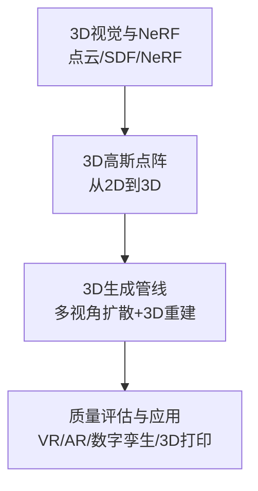
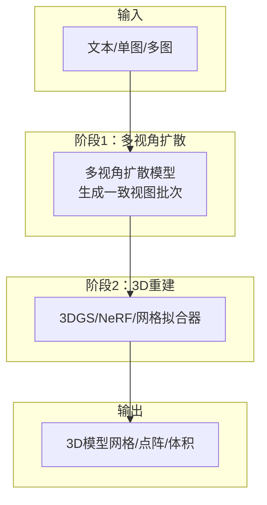
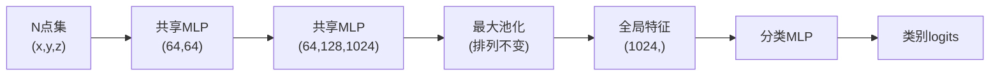
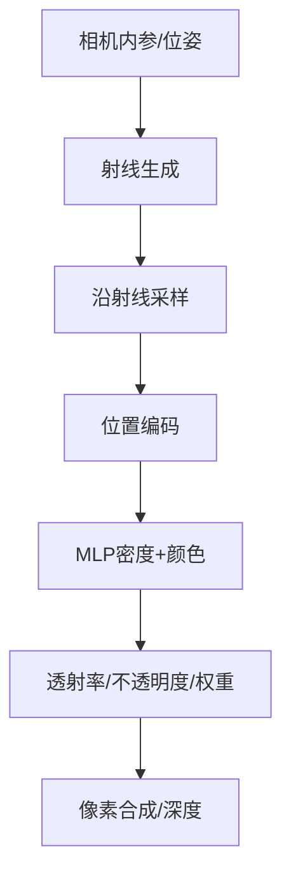
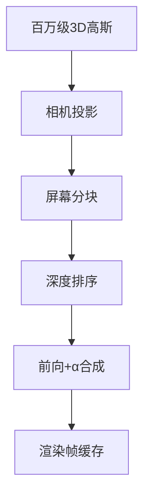
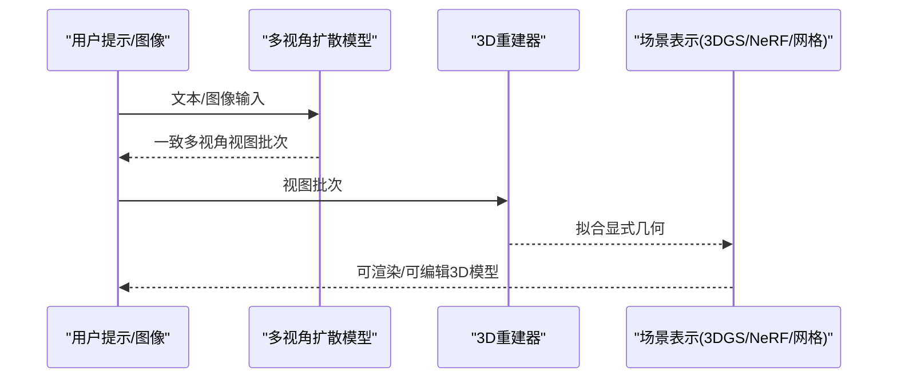
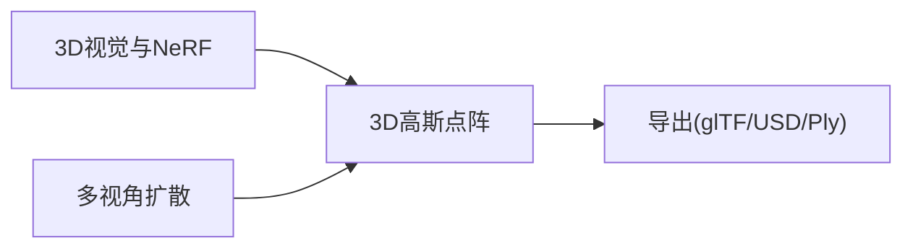

# 3D生成

<cite>
**本文引用的文件**
- [phases/08-generative-ai/12-3d-generation/docs/en.md](file://phases/08-generative-ai/12-3d-generation/docs/en.md)
- [phases/04-computer-vision/13-3d-vision-nerf/docs/en.md](file://phases/04-computer-vision/13-3d-vision-nerf/docs/en.md)
- [phases/04-computer-vision/22-3d-gaussian-splatting/docs/en.md](file://phases/04-computer-vision/22-3d-gaussian-splatting/docs/en.md)
- [site/data.js](file://site/data.js)
- [phases/08-generative-ai/12-3d-generation/assets/3d-generation.svg](file://phases/08-generative-ai/12-3d-generation/assets/3d-generation.svg)
</cite>

## 目录
1. [引言](#引言)
2. [项目结构](#项目结构)
3. [核心组件](#核心组件)
4. [架构总览](#架构总览)
5. [详细组件分析](#详细组件分析)
6. [依赖关系分析](#依赖关系分析)
7. [性能考量](#性能考量)
8. [故障排查指南](#故障排查指南)
9. [结论](#结论)
10. [附录](#附录)

## 引言
本文件面向3D生成技术，系统梳理从隐式表征到显式几何的建模路径，覆盖体积建模（点云、体素、SDF）、神经辐射场（NeRF）与3D高斯点阵（3DGS），并延展至多视角扩散、风格化与场景表示等前沿方向。文档同时总结质量评估方法与典型应用，并针对分辨率、计算复杂度与内存瓶颈提出优化建议。

## 项目结构
该仓库将3D生成知识按“理解—构建—部署”三段式组织：
- 理解阶段：3D视觉与NeRF（点云、SDF、NeRF）基础概念与实现要点
- 构建阶段：3D高斯点阵从2D到3D的完整推导与可微光栅化
- 应用阶段：多视角扩散+3D重建的端到端管线与代表性模型

**章节来源**
- [phases/04-computer-vision/13-3d-vision-nerf/docs/en.md:1-299](file://phases/04-computer-vision/13-3d-vision-nerf/docs/en.md#L1-L299)
- [phases/04-computer-vision/22-3d-gaussian-splatting/docs/en.md:1-366](file://phases/04-computer-vision/22-3d-gaussian-splatting/docs/en.md#L1-L366)
- [phases/08-generative-ai/12-3d-generation/docs/en.md:1-164](file://phases/08-generative-ai/12-3d-generation/docs/en.md#L1-L164)

## 核心组件
- 隐式表征与体积渲染
  - 点云：无序集合，通过共享MLP+对称聚合实现排列不变性；适用于传感器原始输出与分类/分割任务
  - SDF：符号距离函数，适合拓扑修复与网格化；常用于隐式场重建
  - NeRF：MLP映射(x,y,z,视角)→(密度,颜色)，沿射线积分渲染；研究主导但推理较慢
- 显式表征与可微光栅化
  - 3D高斯点阵（3DGS）：以百万级3D高斯为场景基元，GPU光栅化+α合成，训练分钟级、渲染实时，已成2026生产默认
- 多视角扩散与3D重建
  - 先用扩散模型生成一致的多视角图像，再拟合3DGS/NeRF/网格等显式几何

**章节来源**
- [phases/04-computer-vision/13-3d-vision-nerf/docs/en.md:27-118](file://phases/04-computer-vision/13-3d-vision-nerf/docs/en.md#L27-L118)
- [phases/04-computer-vision/22-3d-gaussian-splatting/docs/en.md:27-122](file://phases/04-computer-vision/22-3d-gaussian-splatting/docs/en.md#L27-L122)
- [phases/08-generative-ai/12-3d-generation/docs/en.md:25-56](file://phases/08-generative-ai/12-3d-generation/docs/en.md#L25-L56)

## 架构总览
下图展示2026主流3D生成管线：多视角扩散生成一致视图，随后拟合3DGS/NeRF/网格等显式几何。

**图表来源**
- [phases/08-generative-ai/12-3d-generation/assets/3d-generation.svg](file://phases/08-generative-ai/12-3d-generation/assets/3d-generation.svg)
- [phases/08-generative-ai/12-3d-generation/docs/en.md:23-56](file://phases/08-generative-ai/12-3d-generation/docs/en.md#L23-L56)

**章节来源**
- [phases/08-generative-ai/12-3d-generation/docs/en.md:23-56](file://phases/08-generative-ai/12-3d-generation/docs/en.md#L23-L56)

## 详细组件分析

### 组件A：点云与PointNet
- 排列不变性与可变长度N：通过共享MLP+最大池化实现固定长度全局特征
- 实现要点：Conv1d替代逐点MLP，BN+ReLU，最后全连接分类头
- 复杂度：参数规模与点数无关，主要由通道维度决定

**图表来源**
- [phases/04-computer-vision/13-3d-vision-nerf/docs/en.md:53-67](file://phases/04-computer-vision/13-3d-vision-nerf/docs/en.md#L53-L67)

**章节来源**
- [phases/04-computer-vision/13-3d-vision-nerf/docs/en.md:27-70](file://phases/04-computer-vision/13-3d-vision-nerf/docs/en.md#L27-L70)

### 组件B：NeRF与体积渲染
- 输入编码：位置坐标经正弦/余弦展开至高频，缓解MLP低频偏置
- 体积渲染：沿射线采样，计算密度与颜色，使用透射率与不透明度合成像素
- 关键公式：密度→不透明度→权重→加权合成；深度由权重平均得到

**图表来源**
- [phases/04-computer-vision/13-3d-vision-nerf/docs/en.md:71-108](file://phases/04-computer-vision/13-3d-vision-nerf/docs/en.md#L71-L108)

**章节来源**
- [phases/04-computer-vision/13-3d-vision-nerf/docs/en.md:88-108](file://phases/04-computer-vision/13-3d-vision-nerf/docs/en.md#L88-L108)

### 组件C：3D高斯点阵（3DGS）
- 场景参数：每高斯含位置、四元数旋转、尺度、不透明度、球谐色系数等
- 渲染流程：投影→分块→深度排序→前向→α合成；与NeRF体积渲染等价但更高效
- 可微性：投影、分块、排序、合成均对参数可微，支持梯度下降拟合
- 自适应增长：克隆/分裂/修剪保持细节并控制数量

**图表来源**
- [phases/04-computer-vision/22-3d-gaussian-splatting/docs/en.md:43-91](file://phases/04-computer-vision/22-3d-gaussian-splatting/docs/en.md#L43-L91)

**章节来源**
- [phases/04-computer-vision/22-3d-gaussian-splatting/docs/en.md:27-122](file://phases/04-computer-vision/22-3d-gaussian-splatting/docs/en.md#L27-L122)

### 组件D：多视角扩散+3D重建（端到端）
- 多视角扩散：零样本/少样本生成一致视图，作为3D重建监督信号
- 3D重建：拟合3DGS/NeRF/网格，形成可编辑、可渲染的显式几何
- 代表性模型：DreamFusion、Magic3D、Shap-E、LRM、InstantMesh、SV3D、CAT3D、TripoSR、Rodin Gen-1.5、Hunyuan3D 2.0等

**图表来源**
- [phases/08-generative-ai/12-3d-generation/docs/en.md:35-56](file://phases/08-generative-ai/12-3d-generation/docs/en.md#L35-L56)

**章节来源**
- [phases/08-generative-ai/12-3d-generation/docs/en.md:35-56](file://phases/08-generative-ai/12-3d-generation/docs/en.md#L35-L56)

## 依赖关系分析
- 知识依赖
  - 3DGS依赖3D视觉（投影、协方差、球谐）与体积渲染思想
  - 多视角扩散依赖2D扩散（DiT）与一致性约束
- 工具链依赖
  - 3DGS常用nerfstudio/gsplat等训练/渲染/导出工具链
  - 导出格式：.ply/.splat/glTF KHR_gaussian_splatting/OpenUSD UsdVolParticleField3DGaussianSplat

**图表来源**
- [phases/04-computer-vision/22-3d-gaussian-splatting/docs/en.md:106-122](file://phases/04-computer-vision/22-3d-gaussian-splatting/docs/en.md#L106-L122)
- [phases/08-generative-ai/12-3d-generation/docs/en.md:144-152](file://phases/08-generative-ai/12-3d-generation/docs/en.md#L144-L152)

**章节来源**
- [phases/04-computer-vision/22-3d-gaussian-splatting/docs/en.md:106-122](file://phases/04-computer-vision/22-3d-gaussian-splatting/docs/en.md#L106-L122)
- [phases/08-generative-ai/12-3d-generation/docs/en.md:144-152](file://phases/08-generative-ai/12-3d-generation/docs/en.md#L144-L152)

## 性能考量
- 训练/推理速度
  - NeRF：训练耗时长、渲染慢；3DGS：训练分钟级、渲染实时
  - 多视角扩散：推理延迟取决于视图数量与模型规模
- 内存占用
  - 3DGS场景参数约60浮点数/高斯，百万级高斯对应GB级存储
  - 体积表示（如NeRF）需大量MLP前向，显存压力大
- 采样与分辨率
  - 体积渲染采样密度影响质量与速度；3DGS通过自适应增长平衡细节与效率
- 并行与加速
  - 3DGS采用GPU分块+CUDA核；NeRF可用SDPA/xFormers批处理射线

**章节来源**
- [phases/04-computer-vision/22-3d-gaussian-splatting/docs/en.md:17-23](file://phases/04-computer-vision/22-3d-gaussian-splatting/docs/en.md#L17-L23)
- [phases/04-computer-vision/13-3d-vision-nerf/docs/en.md:109-118](file://phases/04-computer-vision/13-3d-vision-nerf/docs/en.md#L109-L118)
- [phases/08-generative-ai/12-3d-generation/docs/en.md:144-152](file://phases/08-generative-ai/12-3d-generation/docs/en.md#L144-L152)

## 故障排查指南
- 视图不一致
  - 症状：独立生成的多视角存在结构差异，导致3D拟合模糊
  - 处理：采用共享注意力的多视角扩散，确保跨视角一致性
- 背面幻觉
  - 症状：单图→3D时对不可见面的重建质量波动大
  - 处理：结合多视角监督与几何先验（对称、拓扑约束）
- 高斯爆炸与过拟合
  - 症状：未加控制的训练导致高斯数量暴涨
  - 处理：启用克隆/分裂/修剪策略，限制总数并去除低贡献高斯
- 拓扑问题
  - 症状：隐式场网格存在孔洞或自交
  - 处理：后处理重网格（如体素重网格）后再发布
- 数据许可
  - 注意训练数据的许可条款，避免商用风险

**章节来源**
- [phases/08-generative-ai/12-3d-generation/docs/en.md:100-107](file://phases/08-generative-ai/12-3d-generation/docs/en.md#L100-L107)

## 结论
3D生成当前以“多视角扩散+3D重建”为主流范式，其中3DGS凭借可微光栅化与高效训练成为生产首选。NeRF与点云/SDF等隐式/显式表征仍各具优势：前者研究占优，后者在特定任务（如拓扑修复）表现突出。未来方向包括动态场景（4DGS）、生成式点阵、以及更丰富的几何先验与风格化表示。

## 附录

### A. 代表性模型与能力矩阵
- 文本→3D对象：DreamFusion、Magic3D、Shap-E、SJC/ProlificDreamer
- 图像→3D：LRM、InstantMesh、SV3D、CAT3D、TripoSR、Rodin Gen-1.5、Hunyuan3D 2.0
- 直接网格/点阵：Meshy 4、Rodin Gen-1.5（PBR）

**章节来源**
- [phases/08-generative-ai/12-3d-generation/docs/en.md:39-56](file://phases/08-generative-ai/12-3d-generation/docs/en.md#L39-L56)

### B. 几何先验与约束
- 形状先验：引导生成符合类目分布（如椅子/车）
- 对称性：利用轴对称/镜像约束提升结构稳定性
- 拓扑约束：隐式场后处理重网格，网格重建时引入连通性/非自交约束

**章节来源**
- [phases/08-generative-ai/12-3d-generation/docs/en.md:100-107](file://phases/08-generative-ai/12-3d-generation/docs/en.md#L100-L107)

### C. 质量评估方法
- 几何精度：与真实几何的重叠度、距离误差、法向一致性
- 渲染质量：PSNR/SSIM/LPIPS等
- 语义一致性：类别标签与局部结构的一致性
- 评估工具：仓库中提供LLM评估框架与自动化指标思路，可借鉴其评估流程设计

**章节来源**
- [site/data.js:469-499](file://site/data.js#L469-L499)

### D. 应用案例
- 虚拟现实/增强现实：3DGS实现实时渲染与交互编辑
- 数字孪生：基于多视角扩散的快速场景重建与更新
- 3D打印：网格化输出（PBR材质）直接进入切片与打印流程

**章节来源**
- [phases/08-generative-ai/12-3d-generation/docs/en.md:108-121](file://phases/08-generative-ai/12-3d-generation/docs/en.md#L108-L121)

### E. 可视化与交互编辑
- 可视化：glTF KHR_gaussian_splatting、OpenUSD、Three.js/Babylon.js/Vision Pro等生态
- 交互编辑：基于高斯参数的直接变换（平移/旋转/缩放/不透明度），无需重训练

**章节来源**
- [phases/04-computer-vision/22-3d-gaussian-splatting/docs/en.md:313-331](file://phases/04-computer-vision/22-3d-gaussian-splatting/docs/en.md#L313-L331)