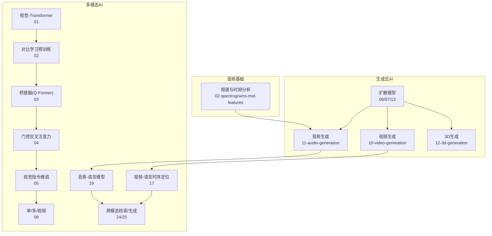
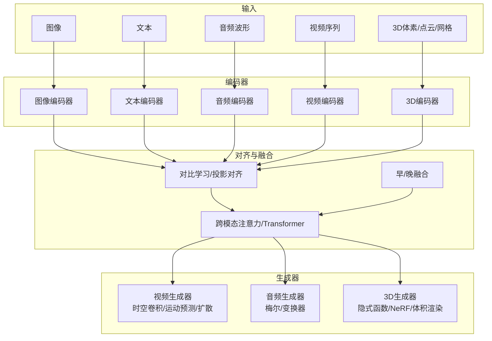
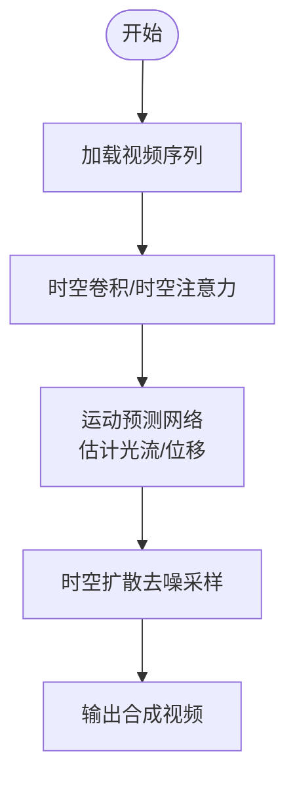
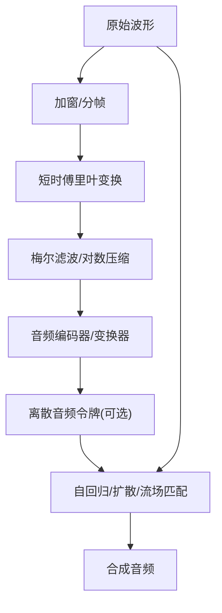
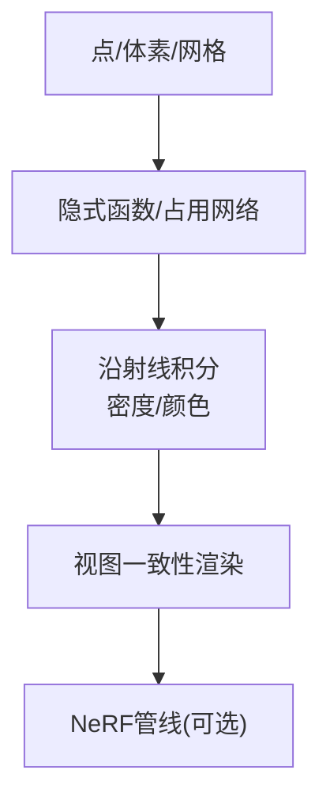
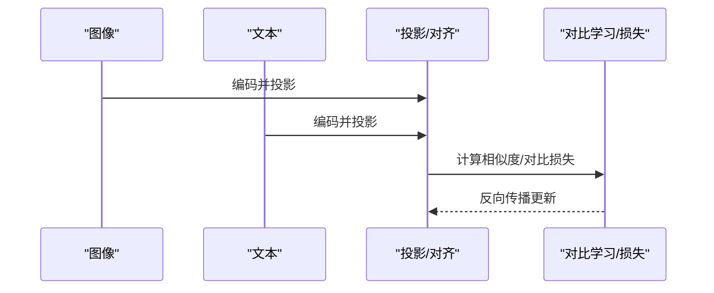
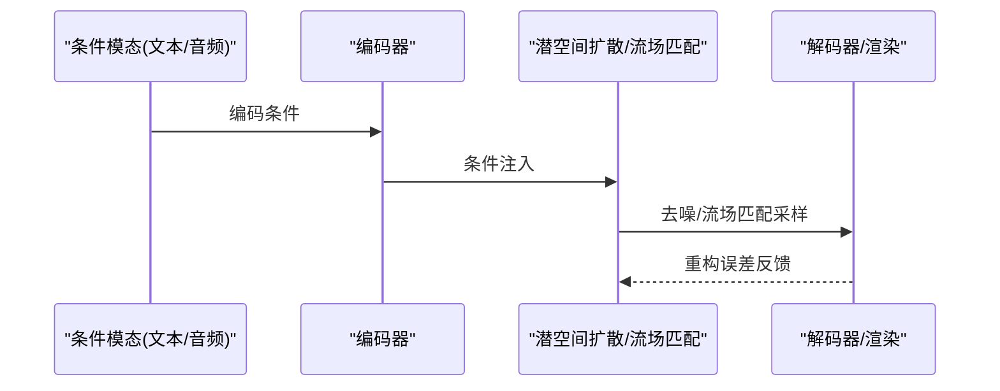
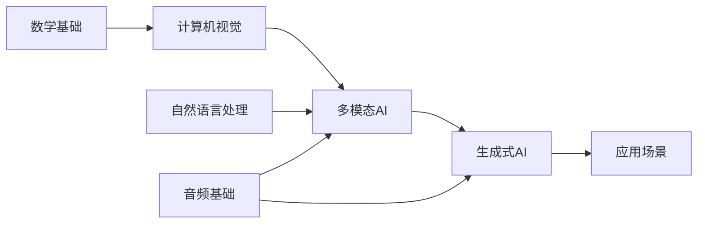

# 多模态生成

<cite>
**本文引用的文件**   
- [README.md](file://README.md)
- [ROADMAP.md](file://ROADMAP.md)
- [site/data.js](file://site/data.js)
- [site/figures-llms-systems.js](file://site/figures-llms-systems.js)
- [site/figures-vision-speech.js](file://site/figures-vision-speech.js)
- [phases/08-generative-ai/10-video-generation/docs/zh.md](file://phases/08-generative-ai/10-video-generation/docs/zh.md)
- [phases/08-generative-ai/11-audio-generation/docs/zh.md](file://phases/08-generative-ai/11-audio-generation/docs/zh.md)
- [phases/08-generative-ai/12-3d-generation/docs/zh.md](file://phases/08-generative-ai/12-3d-generation/docs/zh.md)
- [phases/12-multimodal-ai/01-vision-transformer-patch-tokens/docs/zh.md](file://phases/12-multimodal-ai/01-vision-transformer-patch-tokens/docs/zh.md)
- [phases/12-multimodal-ai/02-clip-contrastive-pretraining/docs/zh.md](file://phases/12-multimodal-ai/02-clip-contrastive-pretraining/docs/zh.md)
- [phases/12-multimodal-ai/03-blip2-qformer-bridge/docs/zh.md](file://phases/12-multimodal-ai/03-blip2-qformer-bridge/docs/zh.md)
- [phases/12-multimodal-ai/04-flamingo-gated-cross-attention/docs/zh.md](file://phases/12-multimodal-ai/04-flamingo-gated-cross-attention/docs/zh.md)
- [phases/12-multimodal-ai/05-llava-visual-instruction-tuning/docs/zh.md](file://phases/12-multimodal-ai/05-llava-visual-instruction-tuning/docs/zh.md)
- [phases/12-multimodal-ai/08-llava-onevision-single-multi-video/docs/zh.md](file://phases/12-multimodal-ai/08-llava-onevision-single-multi-video/docs/zh.md)
- [phases/12-multimodal-ai/17-video-language-temporal-grounding/docs/zh.md](file://phases/12-multimodal-ai/17-video-language-temporal-grounding/docs/zh.md)
- [phases/12-multimodal-ai/19-audio-language-whisper-to-af3/docs/zh.md](file://phases/12-multimodal-ai/19-audio-language-whisper-to-af3/docs/zh.md)
- [phases/12-multimodal-ai/24-multimodal-rag-cross-modal/docs/zh.md](file://phases/12-multimodal-ai/24-multimodal-rag-cross-modal/docs/zh.md)
- [phases/12-multimodal-ai/25-multimodal-agents-computer-use/docs/zh.md](file://phases/12-multimodal-ai/25-multimodal-agents-computer-use/docs/zh.md)
- [phases/06-speech-and-audio/02-spectrograms-mel-features/docs/zh.md](file://phases/06-speech-and-audio/02-spectrograms-mel-features/docs/zh.md)
- [phases/08-generative-ai/06-diffusion-ddpm-from-scratch/docs/zh.md](file://phases/08-generative-ai/06-diffusion-ddpm-from-scratch/docs/zh.md)
- [phases/08-generative-ai/07-latent-diffusion-stable-diffusion/docs/zh.md](file://phases/08-generative-ai/07-latent-diffusion-stable-diffusion/docs/zh.md)
- [phases/08-generative-ai/13-flow-matching-rectified-flows/docs/zh.md](file://phases/08-generative-ai/13-flow-matching-rectified-flows/docs/zh.md)
- [phases/08-generative-ai/10-video-generation/code/main.py](file://phases/08-generative-ai/10-video-generation/code/main.py)
</cite>

## 目录
1. [引言](#引言)
2. [项目结构](#项目结构)
3. [核心组件](#核心组件)
4. [架构总览](#架构总览)
5. [详细组件分析](#详细组件分析)
6. [依赖关系分析](#依赖关系分析)
7. [性能考量](#性能考量)
8. [故障排查指南](#故障排查指南)
9. [结论](#结论)
10. [附录](#附录)

## 引言
本文件面向多模态生成技术，系统梳理视频生成的时空建模（3D卷积、时空注意力、运动预测）、音频生成的时频域建模（梅尔频谱、波形建模、音频变换器）、3D生成的体积建模（Occupancy Networks、隐式函数、Neural Radiance Fields），以及跨模态对齐与扩散模型在多模态生成中的实现路径。同时给出在内容创作、虚拟现实、数字孪生等场景的应用前景与实践建议，并总结同步性、一致性与计算效率等关键挑战。

## 项目结构
该仓库围绕“通识—基础—进阶—专题—实战”分阶段组织知识与实践，其中与多模态生成直接相关的内容主要分布在以下模块：
- 生成式AI专题：视频生成、音频生成、3D生成、扩散模型、流场匹配等
- 多模态AI专题：视觉-语言融合、跨模态检索与生成、视频理解与时序定位等
- 音频基础与梅尔建模：时频分析、梅尔尺度、STFT窗口与混叠等
- 系统可视化：多模态融合（早/晚融合）与视频理解流水线示意图

图示来源
- [README.md:476-495](file://README.md#L476-L495)
- [ROADMAP.md:292-320](file://ROADMAP.md#L292-L320)
- [site/data.js:1164-1174](file://site/data.js#L1164-L1174)
- [site/data.js:1564-1581](file://site/data.js#L1564-L1581)

章节来源
- [README.md:476-495](file://README.md#L476-L495)
- [ROADMAP.md:292-320](file://ROADMAP.md#L292-L320)
- [site/data.js:1164-1174](file://site/data.js#L1164-L1174)
- [site/data.js:1564-1581](file://site/data.js#L1564-L1581)

## 核心组件
- 视频生成：覆盖从时空卷积到时序注意力、运动预测与扩散的完整链路
- 音频生成：覆盖梅尔频谱、波形建模与音频变换器架构
- 3D生成：覆盖体积表示（Occupancy/隐式函数）与NeRF等显式渲染管线
- 跨模态对齐：视觉-语言对比学习、Q-Former桥接、门控交叉注意力、视频-语言时序定位
- 扩散模型：DDPM、潜空间扩散、流场匹配统一框架
- 音频-语言：Whisper到AF3等端到端音素-语言建模

章节来源
- [phases/08-generative-ai/10-video-generation/docs/zh.md](file://phases/08-generative-ai/10-video-generation/docs/zh.md)
- [phases/08-generative-ai/11-audio-generation/docs/zh.md](file://phases/08-generative-ai/11-audio-generation/docs/zh.md)
- [phases/08-generative-ai/12-3d-generation/docs/zh.md](file://phases/08-generative-ai/12-3d-generation/docs/zh.md)
- [phases/12-multimodal-ai/02-clip-contrastive-pretraining/docs/zh.md](file://phases/12-multimodal-ai/02-clip-contrastive-pretraining/docs/zh.md)
- [phases/12-multimodal-ai/03-blip2-qformer-bridge/docs/zh.md](file://phases/12-multimodal-ai/03-blip2-qformer-bridge/docs/zh.md)
- [phases/12-multimodal-ai/04-flamingo-gated-cross-attention/docs/zh.md](file://phases/12-multimodal-ai/04-flamingo-gated-cross-attention/docs/zh.md)
- [phases/12-multimodal-ai/17-video-language-temporal-grounding/docs/zh.md](file://phases/12-multimodal-ai/17-video-language-temporal-grounding/docs/zh.md)
- [phases/12-multimodal-ai/19-audio-language-whisper-to-af3/docs/zh.md](file://phases/12-multimodal-ai/19-audio-language-whisper-to-af3/docs/zh.md)
- [phases/08-generative-ai/06-diffusion-ddpm-from-scratch/docs/zh.md](file://phases/08-generative-ai/06-diffusion-ddpm-from-scratch/docs/zh.md)
- [phases/08-generative-ai/07-latent-diffusion-stable-diffusion/docs/zh.md](file://phases/08-generative-ai/07-latent-diffusion-stable-diffusion/docs/zh.md)
- [phases/08-generative-ai/13-flow-matching-rectified-flows/docs/zh.md](file://phases/08-generative-ai/13-flow-matching-rectified-flows/docs/zh.md)

## 架构总览
下图展示多模态生成的关键路径：输入模态经编码器映射至共享嵌入空间，随后通过跨模态注意力或扩散/流场匹配进行联合优化与采样；视频侧可结合时空卷积与运动预测，音频侧采用梅尔频谱与变换器，3D侧采用体积表示与NeRF渲染。

图示来源
- [site/figures-llms-systems.js:417-486](file://site/figures-llms-systems.js#L417-L486)
- [phases/12-multimodal-ai/02-clip-contrastive-pretraining/docs/zh.md](file://phases/12-multimodal-ai/02-clip-contrastive-pretraining/docs/zh.md)
- [phases/12-multimodal-ai/03-blip2-qformer-bridge/docs/zh.md](file://phases/12-multimodal-ai/03-blip2-qformer-bridge/docs/zh.md)
- [phases/12-multimodal-ai/04-flamingo-gated-cross-attention/docs/zh.md](file://phases/12-multimodal-ai/04-flamingo-gated-cross-attention/docs/zh.md)
- [phases/08-generative-ai/10-video-generation/docs/zh.md](file://phases/08-generative-ai/10-video-generation/docs/zh.md)
- [phases/08-generative-ai/11-audio-generation/docs/zh.md](file://phases/08-generative-ai/11-audio-generation/docs/zh.md)
- [phases/08-generative-ai/12-3d-generation/docs/zh.md](file://phases/08-generative-ai/12-3d-generation/docs/zh.md)

## 详细组件分析

### 视频生成：时空建模与运动预测
- 时空建模
  - 3D卷积：对时空立方体（帧×高度×宽度）进行卷积，捕获时空平滑变化
  - 时空注意力：在时间维引入注意力，使不同帧之间建立长程依赖
- 运动预测网络
  - 估计光流或位移场，作为先验约束提升生成稳定性与一致性
- 时空扩散
  - 在潜空间中对视频张量施加扩散过程，利用跨帧条件与运动先验进行去噪采样

图示来源
- [phases/08-generative-ai/10-video-generation/docs/zh.md](file://phases/08-generative-ai/10-video-generation/docs/zh.md)
- [phases/08-generative-ai/07-latent-diffusion-stable-diffusion/docs/zh.md](file://phases/08-generative-ai/07-latent-diffusion-stable-diffusion/docs/zh.md)
- [phases/08-generative-ai/06-diffusion-ddpm-from-scratch/docs/zh.md](file://phases/08-generative-ai/06-diffusion-ddpm-from-scratch/docs/zh.md)

章节来源
- [phases/08-generative-ai/10-video-generation/docs/zh.md](file://phases/08-generative-ai/10-video-generation/docs/zh.md)
- [phases/08-generative-ai/06-diffusion-ddpm-from-scratch/docs/zh.md](file://phases/08-generative-ai/06-diffusion-ddpm-from-scratch/docs/zh.md)
- [phases/08-generative-ai/07-latent-diffusion-stable-diffusion/docs/zh.md](file://phases/08-generative-ai/07-latent-diffusion-stable-diffusion/docs/zh.md)

### 音频生成：时频域建模与音频变换器
- 梅尔频谱与STFT
  - 将波形切帧、加窗、做短时傅里叶变换，映射到梅尔频率域，作为神经网络的稳定输入
- 波形建模与音频变换器
  - 可直接对波形建模，或在离散符号空间（如音频令牌）上使用自回归/扩散/流场匹配
- 音频-语言对齐
  - Whisper等语音模型与AF3等音素-语言模型，实现跨模态对齐与生成

图示来源
- [site/figures-vision-speech.js:282-386](file://site/figures-vision-speech.js#L282-L386)
- [phases/06-speech-and-audio/02-spectrograms-mel-features/docs/zh.md](file://phases/06-speech-and-audio/02-spectrograms-mel-features/docs/zh.md)
- [phases/12-multimodal-ai/19-audio-language-whisper-to-af3/docs/zh.md](file://phases/12-multimodal-ai/19-audio-language-whisper-to-af3/docs/zh.md)

章节来源
- [site/figures-vision-speech.js:282-386](file://site/figures-vision-speech.js#L282-L386)
- [phases/06-speech-and-audio/02-spectrograms-mel-features/docs/zh.md](file://phases/06-speech-and-audio/02-spectrograms-mel-features/docs/zh.md)
- [phases/12-multimodal-ai/19-audio-language-whisper-to-af3/docs/zh.md](file://phases/12-multimodal-ai/19-audio-language-whisper-to-af3/docs/zh.md)

### 3D生成：体积建模与NeRF
- 体积表示
  - Occupancy Networks：以占用概率建模体表面
  - 隐式函数：用神经网络参数化隐式表面，支持梯度与渲染
- NeRF与显式渲染
  - 通过沿射线积分密度与颜色，重建视图一致的3D场景
- 与扩散/流场匹配结合
  - 在潜空间或参数空间中对隐式函数进行扩散/流场匹配优化

图示来源
- [phases/08-generative-ai/12-3d-generation/docs/zh.md](file://phases/08-generative-ai/12-3d-generation/docs/zh.md)
- [phases/08-generative-ai/13-flow-matching-rectified-flows/docs/zh.md](file://phases/08-generative-ai/13-flow-matching-rectified-flows/docs/zh.md)

章节来源
- [phases/08-generative-ai/12-3d-generation/docs/zh.md](file://phases/08-generative-ai/12-3d-generation/docs/zh.md)
- [phases/08-generative-ai/13-flow-matching-rectified-flows/docs/zh.md](file://phases/08-generative-ai/13-flow-matching-rectified-flows/docs/zh.md)

### 跨模态对齐与生成
- 视觉-语言对齐
  - 对比学习（CLIP风格）：分别编码图像与文本，投影到共享空间后对比学习
  - Q-Former桥接：将视觉tokens与语言tokens对齐到统一语义空间
  - 门控交叉注意力：允许视觉与语言双向交互
- 视频-语言时序定位
  - 在视频时序上定位与文本描述最相关的片段，用于检索与生成
- 音频-语言对齐
  - Whisper到AF3：将音频特征与语言建模统一，支撑端到端音素级对齐

图示来源
- [site/figures-llms-systems.js:417-486](file://site/figures-llms-systems.js#L417-L486)
- [phases/12-multimodal-ai/02-clip-contrastive-pretraining/docs/zh.md](file://phases/12-multimodal-ai/02-clip-contrastive-pretraining/docs/zh.md)
- [phases/12-multimodal-ai/03-blip2-qformer-bridge/docs/zh.md](file://phases/12-multimodal-ai/03-blip2-qformer-bridge/docs/zh.md)
- [phases/12-multimodal-ai/04-flamingo-gated-cross-attention/docs/zh.md](file://phases/12-multimodal-ai/04-flamingo-gated-cross-attention/docs/zh.md)
- [phases/12-multimodal-ai/17-video-language-temporal-grounding/docs/zh.md](file://phases/12-multimodal-ai/17-video-language-temporal-grounding/docs/zh.md)
- [phases/12-multimodal-ai/19-audio-language-whisper-to-af3/docs/zh.md](file://phases/12-multimodal-ai/19-audio-language-whisper-to-af3/docs/zh.md)

章节来源
- [site/figures-llms-systems.js:417-486](file://site/figures-llms-systems.js#L417-L486)
- [phases/12-multimodal-ai/02-clip-contrastive-pretraining/docs/zh.md](file://phases/12-multimodal-ai/02-clip-contrastive-pretraining/docs/zh.md)
- [phases/12-multimodal-ai/03-blip2-qformer-bridge/docs/zh.md](file://phases/12-multimodal-ai/03-blip2-qformer-bridge/docs/zh.md)
- [phases/12-multimodal-ai/04-flamingo-gated-cross-attention/docs/zh.md](file://phases/12-multimodal-ai/04-flamingo-gated-cross-attention/docs/zh.md)
- [phases/12-multimodal-ai/17-video-language-temporal-grounding/docs/zh.md](file://phases/12-multimodal-ai/17-video-language-temporal-grounding/docs/zh.md)
- [phases/12-multimodal-ai/19-audio-language-whisper-to-af3/docs/zh.md](file://phases/12-multimodal-ai/19-audio-language-whisper-to-af3/docs/zh.md)

### 多模态扩散模型与时空扩散
- 统一框架
  - 扩散/流场匹配在潜空间中对齐多模态分布，提升生成一致性与质量
- 时空扩散
  - 在视频潜空间中引入跨帧条件与运动先验，控制时序一致性
- 跨模态注意力设计
  - 在扩散过程中引入跨模态注意力，使文本/音频条件指导图像/视频/3D生成

图示来源
- [phases/08-generative-ai/06-diffusion-ddpm-from-scratch/docs/zh.md](file://phases/08-generative-ai/06-diffusion-ddpm-from-scratch/docs/zh.md)
- [phases/08-generative-ai/07-latent-diffusion-stable-diffusion/docs/zh.md](file://phases/08-generative-ai/07-latent-diffusion-stable-diffusion/docs/zh.md)
- [phases/08-generative-ai/13-flow-matching-rectified-flows/docs/zh.md](file://phases/08-generative-ai/13-flow-matching-rectified-flows/docs/zh.md)
- [phases/12-multimodal-ai/04-flamingo-gated-cross-attention/docs/zh.md](file://phases/12-multimodal-ai/04-flamingo-gated-cross-attention/docs/zh.md)

章节来源
- [phases/08-generative-ai/06-diffusion-ddpm-from-scratch/docs/zh.md](file://phases/08-generative-ai/06-diffusion-ddpm-from-scratch/docs/zh.md)
- [phases/08-generative-ai/07-latent-diffusion-stable-diffusion/docs/zh.md](file://phases/08-generative-ai/07-latent-diffusion-stable-diffusion/docs/zh.md)
- [phases/08-generative-ai/13-flow-matching-rectified-flows/docs/zh.md](file://phases/08-generative-ai/13-flow-matching-rectified-flows/docs/zh.md)
- [phases/12-multimodal-ai/04-flamingo-gated-cross-attention/docs/zh.md](file://phases/12-multimodal-ai/04-flamingo-gated-cross-attention/docs/zh.md)

### 应用前景与实践要点
- 内容创作：视频-文本/音频-语言的跨模态生成，支持自动字幕、配乐与场景切换
- 虚拟现实：3D场景的快速生成与编辑，结合NeRF实现沉浸式渲染
- 数字孪生：基于视频与传感器数据的时空建模，结合运动预测与扩散控制
- 实践建议：优先采用梅尔频谱与变换器处理音频；在视频侧结合运动先验与跨帧注意力；在3D侧以隐式函数/NeRF为主，配合扩散/流场匹配提升一致性

## 依赖关系分析
- 课程与专题依赖
  - 多模态AI专题依赖计算机视觉与NLP基础，以及音频基础与时频分析
  - 生成式AI专题为多模态提供统一的生成范式（扩散/流场匹配）
- 技术耦合
  - 视频理解与生成依赖于视觉-语言对齐与跨模态注意力
  - 音频-语言对齐依赖梅尔频谱与变换器架构
  - 3D生成依赖体积建模与NeRF渲染

图示来源
- [ROADMAP.md:292-320](file://ROADMAP.md#L292-L320)
- [site/data.js:1164-1174](file://site/data.js#L1164-L1174)
- [site/data.js:1564-1581](file://site/data.js#L1564-L1581)

章节来源
- [ROADMAP.md:292-320](file://ROADMAP.md#L292-L320)
- [site/data.js:1164-1174](file://site/data.js#L1164-L1174)
- [site/data.js:1564-1581](file://site/data.js#L1564-L1581)

## 性能考量
- 同步性
  - 视频生成需跨帧一致性约束，结合运动预测与跨模态注意力
  - 音频-语言对齐需保证时序对齐精度，避免延迟漂移
- 一致性
  - 使用对比学习与跨模态对齐损失，确保多模态嵌入空间的一致性
- 计算效率
  - 音频侧优先使用梅尔频谱与变换器，降低长序列建模成本
  - 3D生成采用隐式函数与NeRF，减少显式网格存储与渲染开销
  - 扩散/流场匹配在潜空间进行，显著降低计算复杂度

## 故障排查指南
- 视频生成不稳定
  - 检查运动预测先验是否合理，跨帧注意力权重是否过拟合
  - 调整扩散噪声调度与条件强度
- 音频生成失真
  - 检查梅尔滤波参数与归一化策略，确认STFT窗口与重叠率
  - 若使用离散令牌，检查令牌化与解码一致性
- 3D生成几何错误
  - 检查隐式函数初始化与梯度回传，核对NeRF射线积分参数
- 跨模态对齐不佳
  - 检查投影维度与对齐损失权重，必要时增加对比学习温度系数

## 结论
多模态生成的核心在于“对齐—融合—生成”的闭环：以对比学习与跨模态注意力实现对齐，以变换器/扩散/流场匹配实现融合与生成。针对视频、音频与3D三类模态，分别采用时空建模、时频域建模与体积建模，可在内容创作、VR与数字孪生等领域实现高质量、高效率的多模态生成。

## 附录
- 相关课程索引与摘要
  - 视频生成：覆盖时空卷积、注意力与扩散
  - 音频生成：覆盖梅尔频谱、波形建模与音频变换器
  - 3D生成：覆盖体积建模与NeRF
  - 多模态融合：对比学习、Q-Former与门控交叉注意力
  - 音频-语言：Whisper到AF3的端到端对齐

章节来源
- [README.md:476-495](file://README.md#L476-L495)
- [site/data.js:1164-1174](file://site/data.js#L1164-L1174)
- [site/data.js:1564-1581](file://site/data.js#L1564-L1581)
- [phases/12-multimodal-ai/01-vision-transformer-patch-tokens/docs/zh.md](file://phases/12-multimodal-ai/01-vision-transformer-patch-tokens/docs/zh.md)
- [phases/12-multimodal-ai/02-clip-contrastive-pretraining/docs/zh.md](file://phases/12-multimodal-ai/02-clip-contrastive-pretraining/docs/zh.md)
- [phases/12-multimodal-ai/03-blip2-qformer-bridge/docs/zh.md](file://phases/12-multimodal-ai/03-blip2-qformer-bridge/docs/zh.md)
- [phases/12-multimodal-ai/04-flamingo-gated-cross-attention/docs/zh.md](file://phases/12-multimodal-ai/04-flamingo-gated-cross-attention/docs/zh.md)
- [phases/12-multimodal-ai/05-llava-visual-instruction-tuning/docs/zh.md](file://phases/12-multimodal-ai/05-llava-visual-instruction-tuning/docs/zh.md)
- [phases/12-multimodal-ai/08-llava-onevision-single-multi-video/docs/zh.md](file://phases/12-multimodal-ai/08-llava-onevision-single-multi-video/docs/zh.md)
- [phases/12-multimodal-ai/17-video-language-temporal-grounding/docs/zh.md](file://phases/12-multimodal-ai/17-video-language-temporal-grounding/docs/zh.md)
- [phases/12-multimodal-ai/19-audio-language-whisper-to-af3/docs/zh.md](file://phases/12-multimodal-ai/19-audio-language-whisper-to-af3/docs/zh.md)
- [phases/12-multimodal-ai/24-multimodal-rag-cross-modal/docs/zh.md](file://phases/12-multimodal-ai/24-multimodal-rag-cross-modal/docs/zh.md)
- [phases/12-multimodal-ai/25-multimodal-agents-computer-use/docs/zh.md](file://phases/12-multimodal-ai/25-multimodal-agents-computer-use/docs/zh.md)
- [phases/06-speech-and-audio/02-spectrograms-mel-features/docs/zh.md](file://phases/06-speech-and-audio/02-spectrograms-mel-features/docs/zh.md)
- [phases/08-generative-ai/06-diffusion-ddpm-from-scratch/docs/zh.md](file://phases/08-generative-ai/06-diffusion-ddpm-from-scratch/docs/zh.md)
- [phases/08-generative-ai/07-latent-diffusion-stable-diffusion/docs/zh.md](file://phases/08-generative-ai/07-latent-diffusion-stable-diffusion/docs/zh.md)
- [phases/08-generative-ai/13-flow-matching-rectified-flows/docs/zh.md](file://phases/08-generative-ai/13-flow-matching-rectified-flows/docs/zh.md)
- [phases/08-generative-ai/10-video-generation/code/main.py](file://phases/08-generative-ai/10-video-generation/code/main.py)