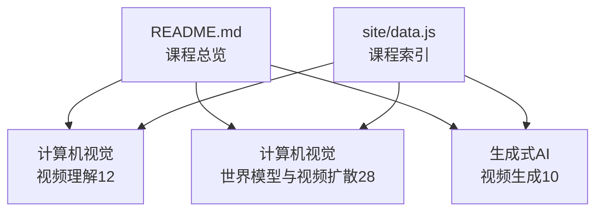
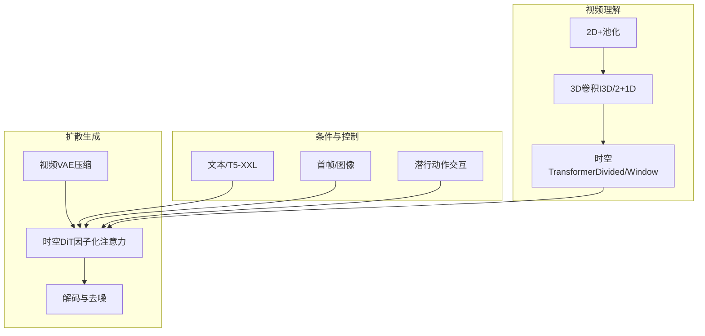
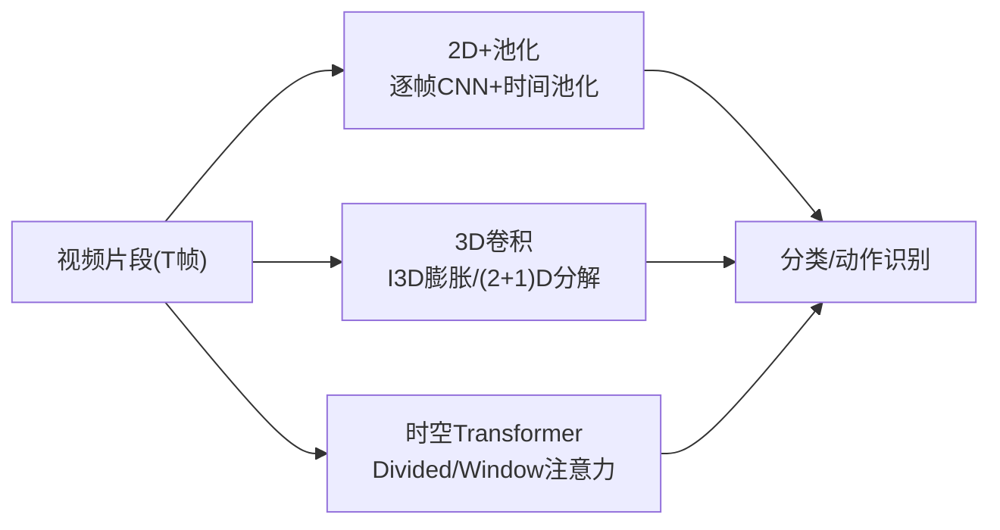
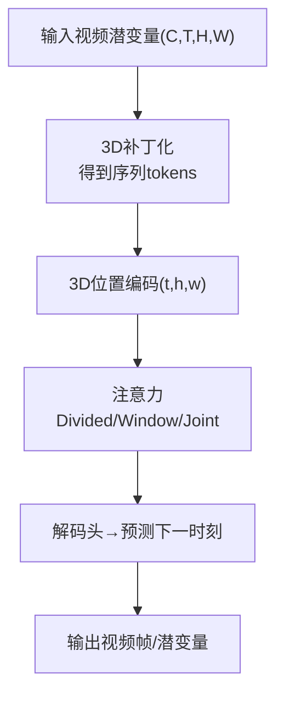
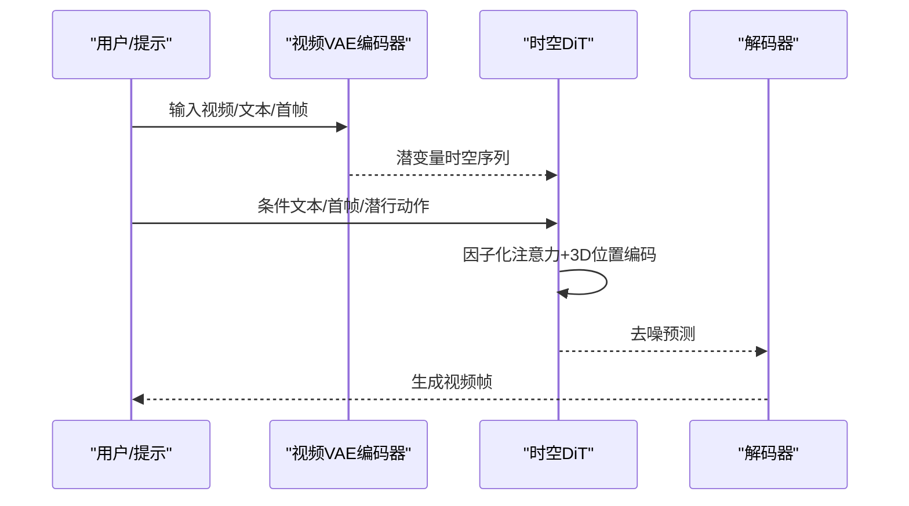
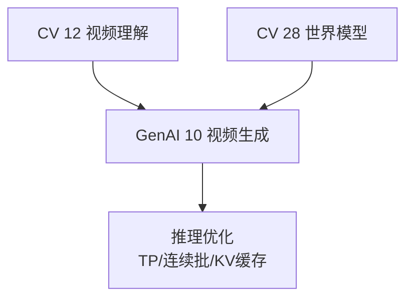

# 视频生成

<cite>
**本文引用的文件**
- [README.md](file://README.md)
- [phases/08-generative-ai/10-video-generation/docs/en.md](file://phases/08-generative-ai/10-video-generation/docs/en.md)
- [phases/08-generative-ai/10-video-generation/code/main.py](file://phases/08-generative-ai/10-video-generation/code/main.py)
- [phases/04-computer-vision/12-video-understanding/docs/en.md](file://phases/04-computer-vision/12-video-understanding/docs/en.md)
- [phases/04-computer-vision/28-world-models-video-diffusion/docs/en.md](file://phases/04-computer-vision/28-world-models-video-diffusion/docs/en.md)
- [site/data.js](file://site/data.js)
- [phases/19-capstone-projects/12-video-understanding-pipeline/code/main.py](file://phases/19-capstone-projects/12-video-understanding-pipeline/code/main.py)
</cite>

## 目录
1. [引言](#引言)
2. [项目结构](#项目结构)
3. [核心组件](#核心组件)
4. [架构总览](#架构总览)
5. [详细组件分析](#详细组件分析)
6. [依赖分析](#依赖分析)
7. [性能考量](#性能考量)
8. [故障排查指南](#故障排查指南)
9. [结论](#结论)
10. [附录](#附录)

## 引言
本文件围绕视频生成技术展开，系统梳理时空卷积网络、3D卷积神经网络、时空注意力机制在视频理解与生成中的建模方法；阐述扩散模型在视频生成中的时空扩散过程、噪声调度策略与条件生成技术；总结视频生成数据集构建与评估指标；并给出内容创作、视频修复、动作预测等典型应用场景的技术实现与性能优化策略。

## 项目结构
该仓库以“阶段化学习路径”组织视频与生成式AI相关内容，视频生成相关材料主要分布在以下模块：
- 计算机视觉：视频理解（时空建模）、世界模型与视频扩散
- 生成式AI：视频生成（扩散Transformer）
- 站点数据：索引与导航信息

图表来源
- [README.md:350-379](file://README.md#L350-L379)
- [README.md:476-495](file://README.md#L476-L495)
- [site/data.js:725-7196](file://site/data.js#L725-L7196)

章节来源
- [README.md:350-379](file://README.md#L350-L379)
- [README.md:476-495](file://README.md#L476-L495)
- [site/data.js:725-7196](file://site/data.js#L725-L7196)

## 核心组件
- 视频理解（时空建模）：覆盖三大家族架构（2D+池化、3D卷积、时空Transformer），帧采样与评估指标，标准数据集（Kinetics、UCF101等）。
- 世界模型与视频扩散：将视频生成视为世界模拟器，区分纯视频生成与动作条件化世界模型，强调物理可塑性、交互可控性与评估体系。
- 视频生成（扩散Transformer）：以DiT为核心，采用时空补丁化、因子化注意力、文本条件与推理优化策略。

章节来源
- [phases/04-computer-vision/12-video-understanding/docs/en.md:1-273](file://phases/04-computer-vision/12-video-understanding/docs/en.md#L1-L273)
- [phases/04-computer-vision/28-world-models-video-diffusion/docs/en.md:1-300](file://phases/04-computer-vision/28-world-models-video-diffusion/docs/en.md#L1-L300)
- [phases/08-generative-ai/10-video-generation/docs/en.md:1-155](file://phases/08-generative-ai/10-video-generation/docs/en.md#L1-L155)

## 架构总览
视频生成与理解的关键路径如下：先以2D骨干或3D卷积/时空Transformer进行视频理解与预训练；再在扩散框架下引入时空DiT，通过因子化注意力与位置编码建模运动与一致性；最后结合文本/图像/音频/首帧等条件实现高质量生成与可控编辑。

图表来源
- [phases/04-computer-vision/12-video-understanding/docs/en.md:27-94](file://phases/04-computer-vision/12-video-understanding/docs/en.md#L27-L94)
- [phases/04-computer-vision/28-world-models-video-diffusion/docs/en.md:52-74](file://phases/04-computer-vision/28-world-models-video-diffusion/docs/en.md#L52-L74)
- [phases/08-generative-ai/10-video-generation/docs/en.md:25-44](file://phases/08-generative-ai/10-video-generation/docs/en.md#L25-L44)

## 详细组件分析

### 组件A：视频理解（时空建模）
- 三大家族架构对比与适用场景：
  - 2D+池化：逐帧CNN + 时间池化，适合外观主导任务，可直接迁移ImageNet权重，成本低但无法显式建模运动。
  - 3D卷积（I3D膨胀、（2+1）D分解）：原生建模运动，I3D通过膨胀继承2D预训练权重；（2+1）D分解降低参数与提升精度。
  - 时空Transformer（Divided/Window）：SOTA准确率，支持长上下文与稀疏注意力，但计算开销大。
- 帧采样策略：均匀采样、密集采样、多片段聚合；T通常取8/16/32/64。
- 评估：剪辑级与视频级准确率双轨评估。
- 数据集：Kinetics-400/600/700、Something-Something V2、UCF101/HMDB-51、AVA。

图表来源
- [phases/04-computer-vision/12-video-understanding/docs/en.md:27-94](file://phases/04-computer-vision/12-video-understanding/docs/en.md#L27-L94)

章节来源
- [phases/04-computer-vision/12-video-understanding/docs/en.md:10-119](file://phases/04-computer-vision/12-video-understanding/docs/en.md#L10-L119)
- [phases/04-computer-vision/12-video-understanding/docs/en.md:120-253](file://phases/04-computer-vision/12-video-understanding/docs/en.md#L120-L253)

### 组件B：世界模型与视频扩散
- 两类范式：
  - 纯视频生成（如Sora 2）：文本/图像提示，生成连贯视频，不可中途“操控”。
  - 动作条件化世界模型（如Genie 3/GWM-1 Worlds）：从观测视频推断潜行动作，条件化未来帧预测，具备交互能力。
- 视频DiT架构要点：
  - 时空补丁化：先空间分块再时间聚合，得到(token_t, token_h, token_w)网格。
  - 3D位置编码：分别对t、h、w轴施加旋转位置编码。
  - 注意力模式：全联合（昂贵）、Divided（交替时间/空间）、Window（局部窗口）。
- 物理可塑性与评估：手标可塑性评分、FVD、提示对齐度、可控性（交互）。
- 应用：自动驾驶合成、机器人规划-仿真-逆动力学闭环。

图表来源
- [phases/04-computer-vision/28-world-models-video-diffusion/docs/en.md:52-74](file://phases/04-computer-vision/28-world-models-video-diffusion/docs/en.md#L52-L74)
- [phases/04-computer-vision/28-world-models-video-diffusion/docs/en.md:124-244](file://phases/04-computer-vision/28-world-models-video-diffusion/docs/en.md#L124-L244)

章节来源
- [phases/04-computer-vision/28-world-models-video-diffusion/docs/en.md:10-108](file://phases/04-computer-vision/28-world-models-video-diffusion/docs/en.md#L10-L108)
- [phases/04-computer-vision/28-world-models-video-diffusion/docs/en.md:122-277](file://phases/04-computer-vision/28-world-models-video-diffusion/docs/en.md#L122-L277)

### 组件C：视频生成（扩散Transformer DiT）
- 核心流程：视频VAE→时空补丁→DiT（因子化注意力+3D位置编码）→去噪解码。
- 条件建模：文本（T5-XXL/CogVideoX-5B）、首帧图像、潜行动作（交互）。
- 训练损失：标准扩散（ε或v预测）；数据来源Web视频+精选剪辑+合成文本标注。
- 推理优化：张量并行（TP）、连续批处理（帧级滑窗）、首帧KV缓存（预填充）。

图表来源
- [phases/08-generative-ai/10-video-generation/docs/en.md:25-44](file://phases/08-generative-ai/10-video-generation/docs/en.md#L25-L44)
- [phases/08-generative-ai/10-video-generation/docs/en.md:136-145](file://phases/08-generative-ai/10-video-generation/docs/en.md#L136-L145)

章节来源
- [phases/08-generative-ai/10-video-generation/docs/en.md:10-122](file://phases/08-generative-ai/10-video-generation/docs/en.md#L10-L122)
- [phases/08-generative-ai/10-video-generation/code/main.py:1-209](file://phases/08-generative-ai/10-video-generation/code/main.py#L1-L209)

### 组件D：数据集与评估
- 数据集：
  - Kinetics系列：400/600/700类，YouTube链接，标准动作识别基准。
  - UCF101、HMDB-51：较早且仍常报告。
  - AVA：时空动作定位。
- 评估指标：
  - 视觉质量：Fréchet视频距离（FVD）、用户研究。
  - 提示对齐：每帧CLIP分数、视频问答风格评估。
  - 物理可塑性：手标可塑性评分（Sora 2内部基准VBench）。
  - 可控性（交互）：动作→观测一致性、能否回到先前状态。

章节来源
- [phases/04-computer-vision/12-video-understanding/docs/en.md:113-119](file://phases/04-computer-vision/12-video-understanding/docs/en.md#L113-L119)
- [phases/04-computer-vision/28-world-models-video-diffusion/docs/en.md:102-108](file://phases/04-computer-vision/28-world-models-video-diffusion/docs/en.md#L102-L108)

### 组件E：端到端实现与调试
- 示例实现：以纯Python实现1D“视频”的联合去噪，展示帧间平滑性（联合采样vs独立采样）。
- 调试建议：日志记录、计时器、cProfile/line_profiler剖析瓶颈；数据加载常占训练时间60%，优先启用多进程加载。

章节来源
- [phases/08-generative-ai/10-video-generation/code/main.py:173-209](file://phases/08-generative-ai/10-video-generation/code/main.py#L173-L209)
- [phases/19-capstone-projects/12-video-understanding-pipeline/code/main.py:1-44](file://phases/19-capstone-projects/12-video-understanding-pipeline/code/main.py#L1-L44)

## 依赖分析
- 模块耦合：
  - 视频理解（CV 12）为扩散生成（GenAI 10）提供预训练与数据准备基础。
  - 世界模型（CV 28）承接生成与交互，形成“计划→仿真→逆动力学”的闭环。
- 外部依赖：
  - 文本编码器（T5-XXL/CogVideoX-5B）用于文本条件。
  - 推理优化依赖分布式并行（TP/PP）与缓存策略。

图表来源
- [phases/04-computer-vision/12-video-understanding/docs/en.md:1-24](file://phases/04-computer-vision/12-video-understanding/docs/en.md#L1-L24)
- [phases/04-computer-vision/28-world-models-video-diffusion/docs/en.md:1-24](file://phases/04-computer-vision/28-world-models-video-diffusion/docs/en.md#L1-L24)
- [phases/08-generative-ai/10-video-generation/docs/en.md:136-145](file://phases/08-generative-ai/10-video-generation/docs/en.md#L136-L145)

章节来源
- [phases/04-computer-vision/12-video-understanding/docs/en.md:1-24](file://phases/04-computer-vision/12-video-understanding/docs/en.md#L1-L24)
- [phases/04-computer-vision/28-world-models-video-diffusion/docs/en.md:1-24](file://phases/04-computer-vision/28-world-models-video-diffusion/docs/en.md#L1-L24)
- [phases/08-generative-ai/10-video-generation/docs/en.md:136-145](file://phases/08-generative-ai/10-video-generation/docs/en.md#L136-L145)

## 性能考量
- 内存带宽瓶颈：视频潜变量在时空序列上移动数据量巨大，内存带宽常成为瓶颈而非算力。
- 推理优化三板斧：
  - 张量并行（TP）跨DiT参数切分。
  - 连续批处理（帧级滑窗）提升吞吐。
  - 首帧KV缓存（预填充）减少重复计算。
- 注意力模式选择：Divided/Window显著降低复杂度，适合长视频与高分辨率。

章节来源
- [phases/08-generative-ai/10-video-generation/docs/en.md:136-145](file://phases/08-generative-ai/10-video-generation/docs/en.md#L136-L145)
- [phases/04-computer-vision/28-world-models-video-diffusion/docs/en.md:184-213](file://phases/04-computer-vision/28-world-models-video-diffusion/docs/en.md#L184-L213)

## 故障排查指南
- 常见问题与对策：
  - 独立逐帧采样导致闪烁（flicker）：需联合序列去噪，共享噪声或注意力耦合。
  - 全3D注意力OOM：改用因子化注意力（Divided/Window）。
  - 数据标注质量影响更大：更详细的密集标注（dense captions）显著提升效果。
  - 首帧条件化：多数生产模型支持图像→视频模式，训练中纳入该变体。
  - 物理漂移：长视频累积不一致，采用滑动窗口生成与关键帧锚定。
- 调试工具与实践：
  - 日志记录、计时器、cProfile/line_profiler定位瓶颈。
  - 数据加载多进程（num_workers>0）是常见优化手段。

章节来源
- [phases/08-generative-ai/10-video-generation/docs/en.md:91-98](file://phases/08-generative-ai/10-video-generation/docs/en.md#L91-L98)
- [phases/04-computer-vision/12-video-understanding/docs/en.md:250-253](file://phases/04-computer-vision/12-video-understanding/docs/en.md#L250-L253)
- [phases/19-capstone-projects/12-video-understanding-pipeline/code/main.py:1-44](file://phases/19-capstone-projects/12-video-understanding-pipeline/code/main.py#L1-L44)

## 结论
视频生成在2026年已进入“世界模型+扩散”的主流范式：以DiT为核心，结合因子化时空注意力、3D位置编码与多源条件（文本/图像/潜行动作），在保证视觉质量的同时实现物理可塑性与交互可控性。数据与标注质量、注意力设计与推理优化共同决定最终效果与效率。

## 附录
- 关键术语速查：
  - 视频VAE：将视频压缩至时空潜变量。
  - 补丁：时空3D块，作为DiT输入token。
  - 因子化注意力：时间→空间交替或窗口化，降低复杂度。
  - 图像→视频（I2V）：以首帧图像+文本生成视频。
  - 潜行动作：从帧对推断的动作潜变量，用于条件化未来帧。
  - 运动笔刷：用户在图像上绘制方向提示的交互输入。
  - 重新标注：用LLM为训练剪辑生成详细提示词。
  - 闪烁：帧间不一致的人工制品，需联合去噪消除。

章节来源
- [phases/08-generative-ai/10-video-generation/docs/en.md:123-135](file://phases/08-generative-ai/10-video-generation/docs/en.md#L123-L135)
- [phases/04-computer-vision/28-world-models-video-diffusion/docs/en.md:278-290](file://phases/04-computer-vision/28-world-models-video-diffusion/docs/en.md#L278-L290)