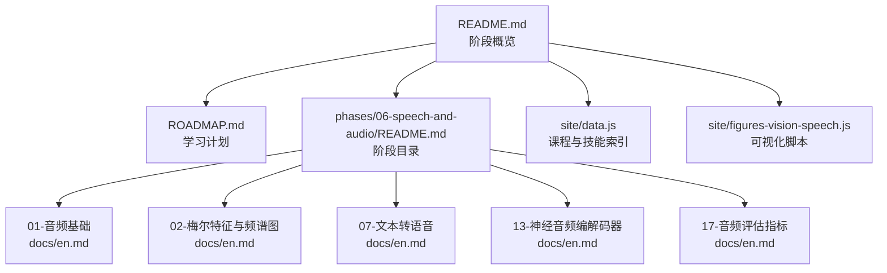
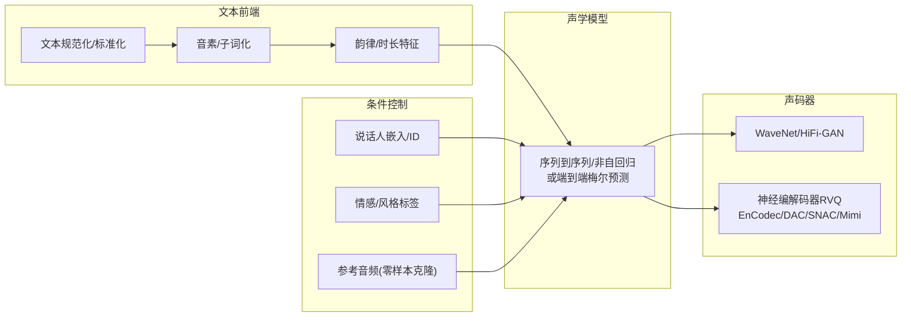
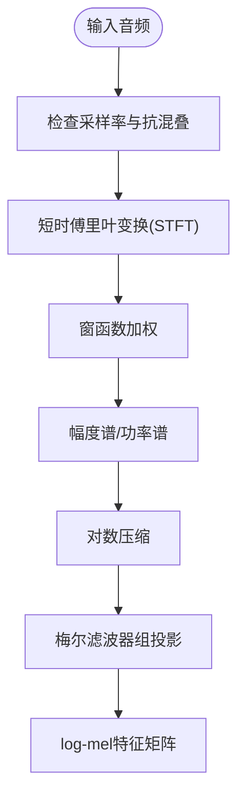
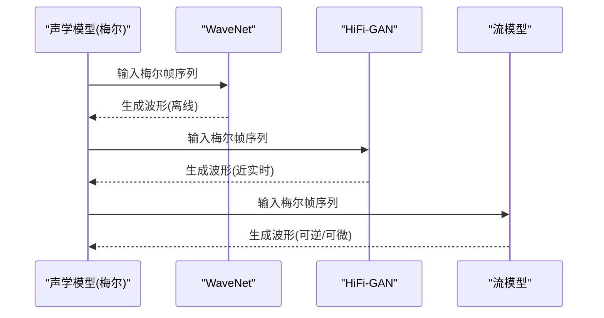
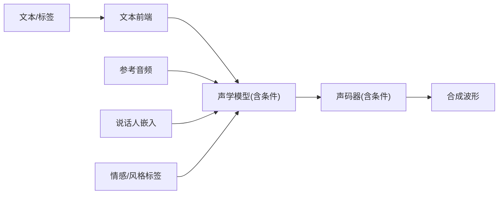
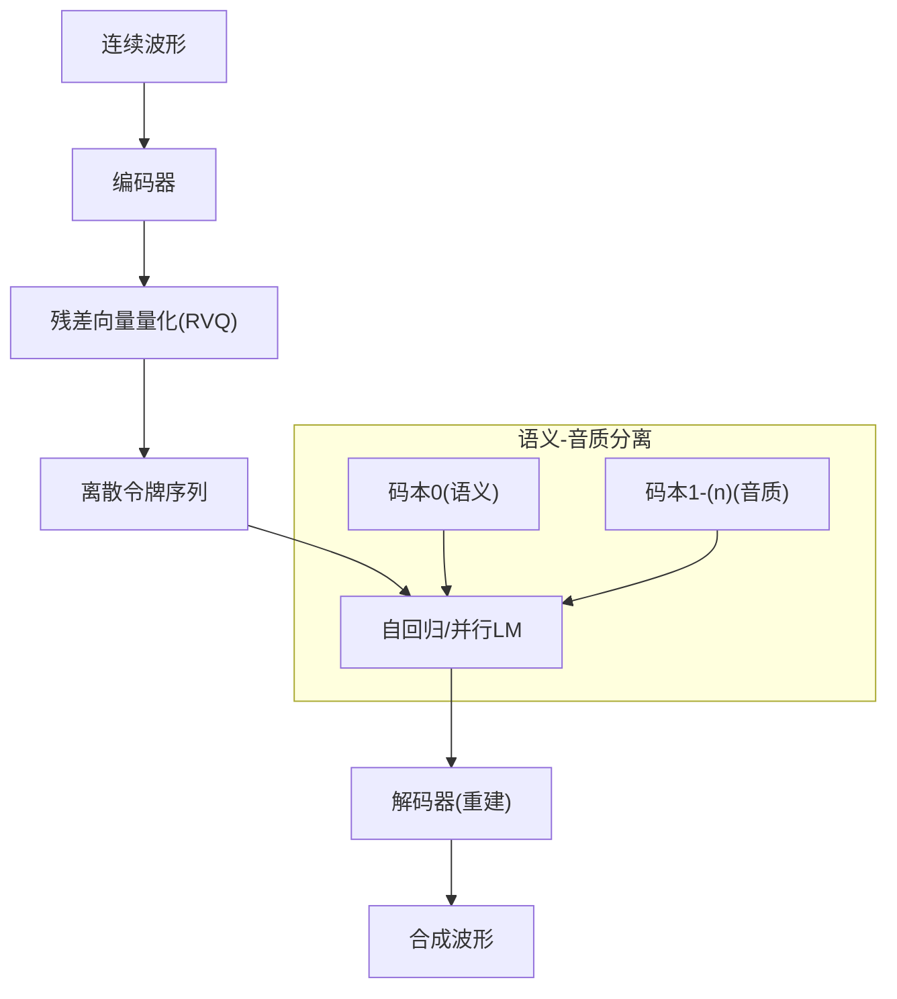
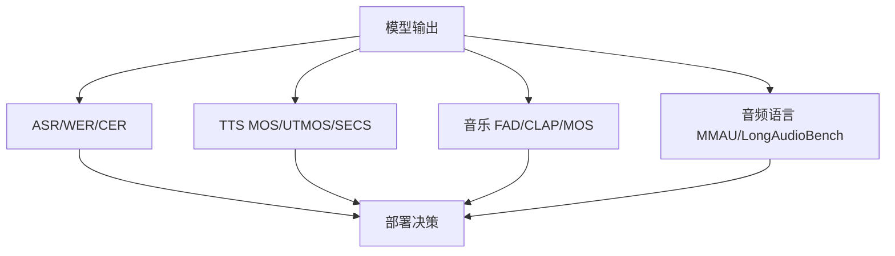
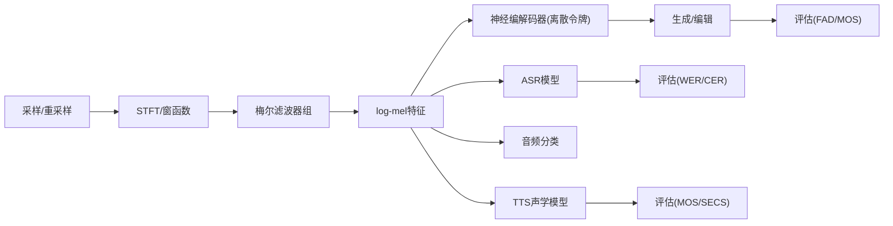

# 音频生成

<cite>
**本文引用的文件**
- [README.md](file://README.md)
- [ROADMAP.md](file://ROADMAP.md)
- [phases/06-speech-and-audio/README.md](file://phases/06-speech-and-audio/README.md)
- [phases/06-speech-and-audio/01-audio-fundamentals/docs/en.md](file://phases/06-speech-and-audio/01-audio-fundamentals/docs/en.md)
- [phases/06-speech-and-audio/02-spectrograms-mel-features/docs/en.md](file://phases/06-speech-and-audio/02-spectrograms-mel-features/docs/en.md)
- [phases/06-speech-and-audio/07-text-to-speech/docs/en.md](file://phases/06-speech-and-audio/07-text-to-speech/docs/en.md)
- [phases/06-speech-and-audio/13-neural-audio-codecs/docs/en.md](file://phases/06-speech-and-audio/13-neural-audio-codecs/docs/en.md)
- [phases/06-speech-and-audio/17-audio-evaluation-metrics/docs/en.md](file://phases/06-speech-and-audio/17-audio-evaluation-metrics/docs/en.md)
- [site/figures-vision-speech.js](file://site/figures-vision-speech.js)
- [site/data.js](file://site/data.js)
</cite>

## 目录
1. [引言](#引言)
2. [项目结构](#项目结构)
3. [核心组件](#核心组件)
4. [架构总览](#架构总览)
5. [详细组件分析](#详细组件分析)
6. [依赖关系分析](#依赖关系分析)
7. [性能考量](#性能考量)
8. [故障排查指南](#故障排查指南)
9. [结论](#结论)
10. [附录](#附录)

## 引言
本文件面向“音频生成”主题，系统梳理从时频域建模到波形级生成、从变换器建模到条件控制、再到质量评估与典型应用的完整知识框架。内容基于仓库中“语音与音频”阶段的课程资料与示意图实现，覆盖梅尔频谱、频谱图、时频联合表示、WaveNet、HiFi-GAN、流模型、音频变换器、条件控制（说话人、情感、风格）、以及客观与主观评估指标，并给出在语音合成、音乐创作、音频修复等场景的落地建议。

## 项目结构
该仓库将“语音与音频”作为独立阶段，包含多个子课时，围绕音频基础、特征提取、端到端TTS、神经编解码器、评估指标等形成完整的工程化学习路径。下图展示该阶段的整体组织方式与关键文件映射。



**图表来源**
- [README.md](file://README.md)
- [ROADMAP.md](file://ROADMAP.md)
- [phases/06-speech-and-audio/README.md](file://phases/06-speech-and-audio/README.md)
- [site/data.js](file://site/data.js)
- [site/figures-vision-speech.js](file://site/figures-vision-speech.js)

**章节来源**
- [README.md](file://README.md)
- [ROADMAP.md](file://ROADMAP.md)
- [phases/06-speech-and-audio/README.md](file://phases/06-speech-and-audio/README.md)

## 核心组件
- 时频域建模与特征工程：从采样、STFT到梅尔滤波器组、对数幅度、MFCC，奠定现代ASR/TTS/分类的基础。
- 波形级生成：涵盖WaveNet、HiFi-GAN、流模型等声码器与端到端生成范式。
- 变换器与自回归/非自回归策略：文本→音素/子词→梅尔→波形的三段式流水线，以及基于RVQ离散令牌的生成。
- 条件控制：说话人嵌入、情感标签、风格提示等多模态条件注入。
- 评估体系：WER/CER、MOS/UTMOS、SECS、FAD、MMAU等指标与公开排行榜。

**章节来源**
- [phases/06-speech-and-audio/01-audio-fundamentals/docs/en.md](file://phases/06-speech-and-audio/01-audio-fundamentals/docs/en.md)
- [phases/06-speech-and-audio/02-spectrograms-mel-features/docs/en.md](file://phases/06-speech-and-audio/02-spectrograms-mel-features/docs/en.md)
- [phases/06-speech-and-audio/07-text-to-speech/docs/en.md](file://phases/06-speech-and-audio/07-text-to-speech/docs/en.md)
- [phases/06-speech-and-audio/13-neural-audio-codecs/docs/en.md](file://phases/06-speech-and-audio/13-neural-audio-codecs/docs/en.md)
- [phases/06-speech-and-audio/17-audio-evaluation-metrics/docs/en.md](file://phases/06-speech-and-audio/17-audio-evaluation-metrics/docs/en.md)

## 架构总览
下图给出“从文本到波形”的端到端生成架构，强调三个阶段：文本前端、声学模型（梅尔预测）、声码器（波形重建）。同时展示RVQ离散令牌在生成中的角色，以及可选的流/扩散范式。



**图表来源**
- [phases/06-speech-and-audio/07-text-to-speech/docs/en.md](file://phases/06-speech-and-audio/07-text-to-speech/docs/en.md)
- [phases/06-speech-and-audio/13-neural-audio-codecs/docs/en.md](file://phases/06-speech-and-audio/13-neural-audio-codecs/docs/en.md)

## 详细组件分析

### 时频域建模与梅尔特征
- 基础概念：采样率、奈奎斯特定理、混叠、比特深度、DFT/FFT、STFT、窗函数、梅尔刻度与滤波器组、对数幅度、MFCC。
- 实践要点：帧长/步长权衡、窗函数选择、动态范围压缩、训练/推理归一化一致性、填充方式避免泄漏。
- 工具链：soundfile/torchaudio/librosa等库的使用建议。



**图表来源**
- [phases/06-speech-and-audio/01-audio-fundamentals/docs/en.md](file://phases/06-speech-and-audio/01-audio-fundamentals/docs/en.md)
- [phases/06-speech-and-audio/02-spectrograms-mel-features/docs/en.md](file://phases/06-speech-and-audio/02-spectrograms-mel-features/docs/en.md)

**章节来源**
- [phases/06-speech-and-audio/01-audio-fundamentals/docs/en.md](file://phases/06-speech-and-audio/01-audio-fundamentals/docs/en.md)
- [phases/06-speech-and-audio/02-spectrograms-mel-features/docs/en.md](file://phases/06-speech-and-audio/02-spectrograms-mel-features/docs/en.md)
- [site/figures-vision-speech.js](file://site/figures-vision-speech.js)

### 波形级音频生成：WaveNet、HiFi-GAN、流模型
- WaveNet：自回归建模梅尔帧，以扩张卷积捕获长期依赖，适合高质量但离线。
- HiFi-GAN：基于GAN的并行声码器，实时性好，音质接近人类水平。
- 流模型：通过可逆变换与似然最大化进行端到端建模，兼顾质量与效率。
- 适用场景：TTS后端声码器、语音转换、音乐/环境音合成。



**图表来源**
- [phases/06-speech-and-audio/07-text-to-speech/docs/en.md](file://phases/06-speech-and-audio/07-text-to-speech/docs/en.md)

**章节来源**
- [phases/06-speech-and-audio/07-text-to-speech/docs/en.md](file://phases/06-speech-and-audio/07-text-to-speech/docs/en.md)

### 音频变换器与自回归/非自回归策略
- 自回归：以注意力机制逐步生成梅尔帧，典型代表Tacotron系列；优点是建模强，缺点是延迟高。
- 非自回归：引入持续时间预测器，一步到位生成梅尔，速度更快，但可能牺牲部分自然度。
- 端到端：VITS/F5-TTS/Kokoro等，联合优化编码器、时长/韵律模块与声码器，简化管线。

```mermaid
classDiagram
class 自回归模型 {
+逐步生成梅尔帧
+高保真但延迟高
}
class 非自回归模型 {
+一步生成梅尔帧
+速度快但略失自然
}
class 端到端模型 {
+联合优化编码/解码
+简化管线
}
自回归模型 <|-- Tacotron系列
非自回归模型 <|-- FastSpeech系列
端到端模型 <|-- VITS/F5-TTS/Kokoro
```

**图表来源**
- [phases/06-speech-and-audio/07-text-to-speech/docs/en.md](file://phases/06-speech-and-audio/07-text-to-speech/docs/en.md)

**章节来源**
- [phases/06-speech-and-audio/07-text-to-speech/docs/en.md](file://phases/06-speech-and-audio/07-text-to-speech/docs/en.md)

### 条件控制：说话人、情感、风格
- 说话人编码：通过说话人嵌入或ID条件，实现多说话人TTS与零样本克隆。
- 情感/风格：在声学模型或声码器中注入情感标签或风格提示，提升表达力。
- 参考控制：利用少量参考音频进行零样本语音克隆（如F5-TTS）。



**图表来源**
- [phases/06-speech-and-audio/07-text-to-speech/docs/en.md](file://phases/06-speech-and-audio/07-text-to-speech/docs/en.md)

**章节来源**
- [phases/06-speech-and-audio/07-text-to-speech/docs/en.md](file://phases/06-speech-and-audio/07-text-to-speech/docs/en.md)

### 离散令牌与神经编解码器：EnCodec/DAC/SNAC/Mimi
- 核心思想：将连续波形量化为离散令牌，使语言模型可直接预测，显著降低上下文长度与计算开销。
- 语义-音质分离：Mimi将第一个码本对齐语音内容（语义），其余为音质细节（音系/韵律/噪声），实现高效可控生成。
- 适用场景：音乐生成（EnCodec）、高保真重建（DAC）、层级RVQ（SNAC）、流式语音（Mimi）。



**图表来源**
- [phases/06-speech-and-audio/13-neural-audio-codecs/docs/en.md](file://phases/06-speech-and-audio/13-neural-audio-codecs/docs/en.md)

**章节来源**
- [phases/06-speech-and-audio/13-neural-audio-codecs/docs/en.md](file://phases/06-speech-and-audio/13-neural-audio-codecs/docs/en.md)

### 评估体系：客观指标与主观评测
- ASR：WER/CER、首Token延迟、实时因子。
- TTS：MOS/UTMOS、SECS、ASR往返WERCER、首音频时间。
- 音乐生成：Fréchet音频距离（FAD）、CLAP对齐、听感MOS。
- 音频语言模型：MMAU/MMAU-Pro、LongAudioBench、AudioCaps。
- 公开排行榜：Open ASR Leaderboard、TTS Arena、Artificial Analysis Speech、HEAR Benchmark等。



**图表来源**
- [phases/06-speech-and-audio/17-audio-evaluation-metrics/docs/en.md](file://phases/06-speech-and-audio/17-audio-evaluation-metrics/docs/en.md)

**章节来源**
- [phases/06-speech-and-audio/17-audio-evaluation-metrics/docs/en.md](file://phases/06-speech-and-audio/17-audio-evaluation-metrics/docs/en.md)

## 依赖关系分析
- 数据预处理依赖：采样率一致性、抗混叠滤波、窗函数与STFT参数；特征工程依赖梅尔刻度与滤波器组。
- 模型依赖：TTS通常依赖文本前端（音素化/韵律）、声学模型（梅尔预测）、声码器（波形重建）；神经编解码器依赖RVQ与离散令牌。
- 评估依赖：指标需严格归一化与分布报告；跨任务指标不可直接比较，需对齐数据与协议。



**图表来源**
- [phases/06-speech-and-audio/01-audio-fundamentals/docs/en.md](file://phases/06-speech-and-audio/01-audio-fundamentals/docs/en.md)
- [phases/06-speech-and-audio/02-spectrograms-mel-features/docs/en.md](file://phases/06-speech-and-audio/02-spectrograms-mel-features/docs/en.md)
- [phases/06-speech-and-audio/07-text-to-speech/docs/en.md](file://phases/06-speech-and-audio/07-text-to-speech/docs/en.md)
- [phases/06-speech-and-audio/13-neural-audio-codecs/docs/en.md](file://phases/06-speech-and-audio/13-neural-audio-codecs/docs/en.md)
- [phases/06-speech-and-audio/17-audio-evaluation-metrics/docs/en.md](file://phases/06-speech-and-audio/17-audio-evaluation-metrics/docs/en.md)

## 性能考量
- 计算效率：非自回归/并行声码器/离散令牌/低帧率RVQ可显著降低延迟与内存占用。
- 自然度与多样性：流/扩散建模、对抗训练、多说话人嵌入、情感/风格条件有助于提升自然度与可控多样性。
- 推理稳定性：特征维度/采样率/归一化必须与训练一致；离线模型与在线模型的延迟-质量权衡需明确。

[本节为通用指导，无需列出具体文件来源]

## 故障排查指南
- 特征不一致：梅尔数量/采样率不匹配导致模型崩溃或性能骤降。
- 归一化漂移：训练与推理采用不同归一化策略，导致WAV质量异常。
- 窗口与填充：零填充造成尾部频谱平坦，应对称填充或复制。
- 采样率与抗混叠：上采样/下采样前务必低通滤波。
- 评估陷阱：仅看聚合指标，忽略分层表现；UTMOS在嘈杂/克隆/情绪化音频上可能失准。

**章节来源**
- [phases/06-speech-and-audio/02-spectrograms-mel-features/docs/en.md](file://phases/06-speech-and-audio/02-spectrograms-mel-features/docs/en.md)
- [phases/06-speech-and-audio/17-audio-evaluation-metrics/docs/en.md](file://phases/06-speech-and-audio/17-audio-evaluation-metrics/docs/en.md)

## 结论
音频生成在2026已进入“特征驱动+离散令牌+条件控制”的成熟阶段。时频域建模（尤其是log-mel与梅尔）仍是主流；离散RVQ令牌显著降低生成复杂度；条件控制（说话人/情感/风格）让生成更具可控性与个性化；完善的评估体系确保从实验室到生产的质量可度量。结合本仓库提供的课程与可视化资源，可快速搭建从特征到波形的端到端管线，并在语音合成、音乐创作、音频修复等场景落地。

[本节为总结性内容，无需列出具体文件来源]

## 附录
- 课程与技能索引：仓库通过站点数据文件维护各课时与技能清单，便于检索与导航。
- 可视化资源：站点脚本提供梅尔刻度、STFT窗口、奈奎斯特与混叠等交互式演示，加深对时频概念的理解。

**章节来源**
- [site/data.js](file://site/data.js)
- [site/figures-vision-speech.js](file://site/figures-vision-speech.js)