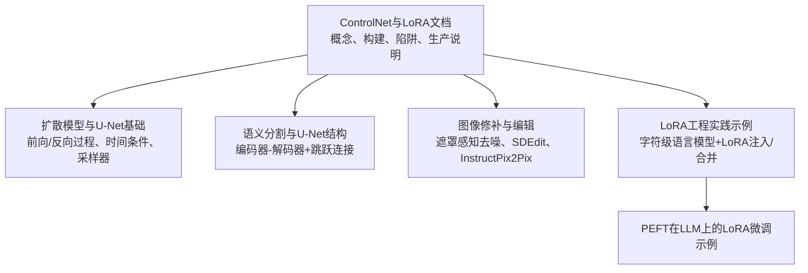
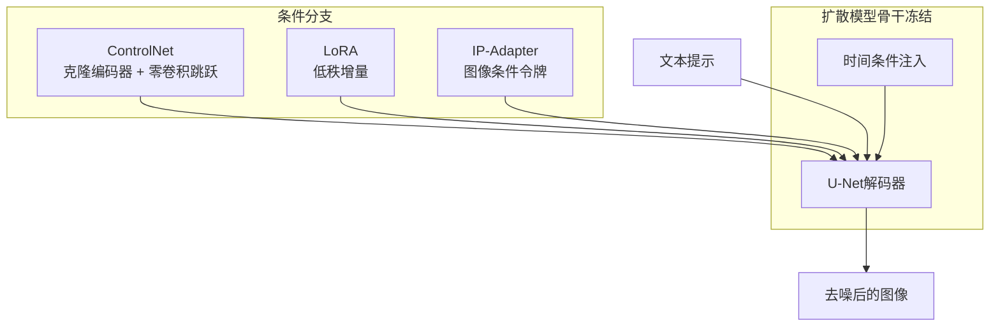
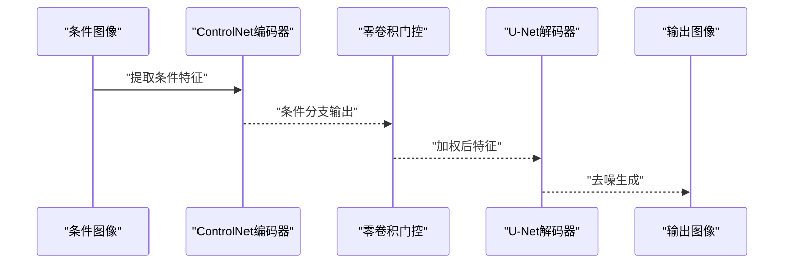
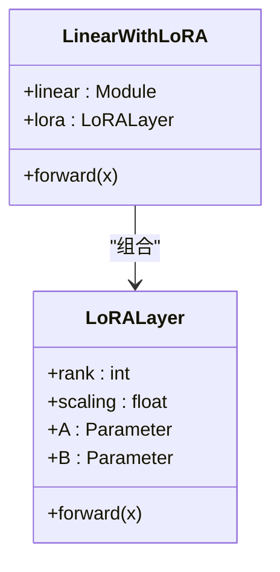
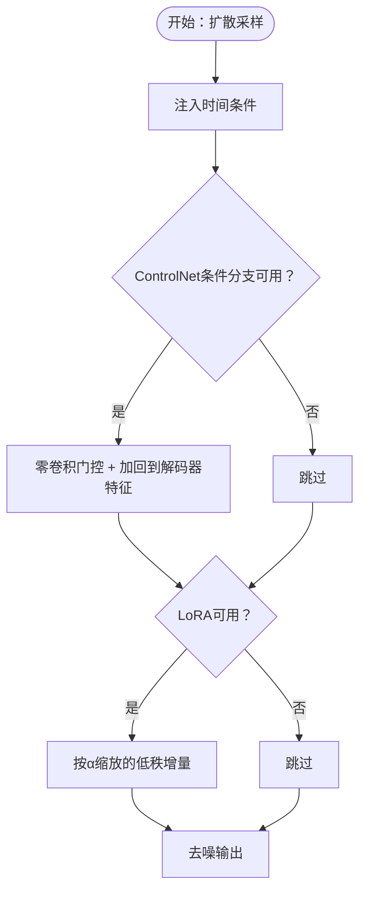
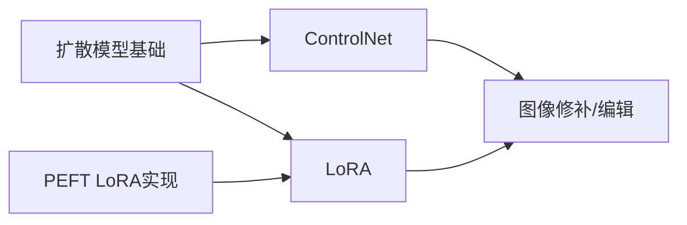

# ControlNet与LoRA条件控制

<cite>
**本文引用的文件**
- [phases/08-generative-ai/08-controlnet-lora-conditioning/docs/zh.md](file://phases/08-generative-ai/08-controlnet-lora-conditioning/docs/zh.md)
- [phases/08-generative-ai/08-controlnet-lora-conditioning/code/main.py](file://phases/08-generative-ai/08-controlnet-lora-conditioning/code/main.py)
- [test_lora_demo.py](file://test_lora_demo.py)
- [finetune.py](file://finetune.py)
- [phases/04-computer-vision/10-image-generation-diffusion/docs/zh.md](file://phases/04-computer-vision/10-image-generation-diffusion/docs/zh.md)
- [phases/04-computer-vision/07-semantic-segmentation-unet/docs/zh.md](file://phases/04-computer-vision/07-semantic-segmentation-unet/docs/zh.md)
- [phases/08-generative-ai/09-inpainting-outpainting-editing/docs/zh.md](file://phases/08-generative-ai/09-inpainting-outpainting-editing/docs/zh.md)
- [site/data.js](file://site/data.js)
</cite>

## 目录
1. [简介](#简介)
2. [项目结构](#项目结构)
3. [核心组件](#核心组件)
4. [架构总览](#架构总览)
5. [详细组件分析](#详细组件分析)
6. [依赖关系分析](#依赖关系分析)
7. [性能考量](#性能考量)
8. [故障排查指南](#故障排查指南)
9. [结论](#结论)
10. [附录](#附录)

## 简介
本技术文档聚焦于ControlNet与LoRA两类条件控制技术，系统阐述其在扩散模型中的作用机理、实现方式与工程实践。ControlNet通过“克隆U-Net编码器 + 零卷积跳跃连接”的方式，将额外的条件信号（如边缘、深度、姿态）融入主干解码器，实现对空间结构的精确控制；LoRA则以低秩矩阵分解的方式，在不改动骨干权重的前提下，注入可训练增量，实现参数高效的微调。二者结合，构成2026年图像流水线的标准工具箱。

## 项目结构
围绕ControlNet与LoRA的主题，仓库中相关资料主要分布在以下位置：
- ControlNet与LoRA概念与构建：位于“generative-ai/08-controlnet-lora-conditioning”
- 扩散模型基础与U-Net背景：位于“computer-vision/10-image-generation-diffusion”、“computer-vision/07-semantic-segmentation-unet”
- 图像修补与编辑（与ControlNet联动）：位于“generative-ai/09-inpainting-outpainting-editing”
- LoRA在LLM微调中的工程实践示例：位于根目录脚本“test_lora_demo.py”、“finetune.py”

**章节来源**
- [site/data.js:1531-1540](file://site/data.js#L1531-L1540)

## 核心组件
- ControlNet（条件控制）
  - 克隆预训练扩散模型的U-Net编码器，冻结原模型，训练克隆模型接受额外条件（边缘、深度、姿态等）。
  - 采用“零卷积”（初始化为0的1×1卷积）作为门控，将条件分支的输出以可学习权重加回到解码器中间特征，实现从恒等映射开始的渐进式控制。
  - 可在推理时组合多个条件分支，形成“features += Σ weight_i * control_i(condition_i)”的加性融合。

- LoRA（低秩适配）
  - 冻结骨干权重W，添加低秩增量ΔW = B·A（r ≪ d），将参数量从d²降至2·d·r。
  - 运行时可通过缩放系数α调整增量强度，支持多LoRA叠加，便于风格迁移与个性化。

- IP-Adapter（图像条件）
  - 通过CLIP图像编码器生成图像令牌，注入交叉注意力与文本令牌并行，实现“参考图像风格/主体”的条件化。

**章节来源**
- [phases/08-generative-ai/08-controlnet-lora-conditioning/docs/zh.md:24-54](file://phases/08-generative-ai/08-controlnet-lora-conditioning/docs/zh.md#L24-L54)

## 架构总览
ControlNet与LoRA在扩散模型中的协同工作方式如下：

- ControlNet：将条件信号（如边缘/深度/姿态）经克隆编码器提取特征，通过零卷积门控后加回到解码器中间特征，实现空间结构控制。
- LoRA：在注意力/线性层中注入低秩增量，实现风格/概念的参数高效微调。
- IP-Adapter：将参考图像编码为令牌，与文本令牌共同参与交叉注意力，实现图像条件化。

**图表来源**
- [phases/08-generative-ai/08-controlnet-lora-conditioning/docs/zh.md:24-54](file://phases/08-generative-ai/08-controlnet-lora-conditioning/docs/zh.md#L24-L54)

## 详细组件分析

### ControlNet组件分析
- 设计要点
  - 克隆U-Net编码器，冻结原模型，训练克隆模型以接受条件输入。
  - 零卷积跳跃连接：初始为无操作，随着训练逐步学习有用的增量。
  - 条件分支可组合：推理时以权重求和的方式融合多个ControlNet输出。

- 训练与推理流程
  - 训练：以标准扩散损失在“提示、条件、图像”三元组上进行，步数通常在百万级。
  - 推理：将条件特征经零卷积门控后加到解码器中间特征，实现可控生成。

**图表来源**
- [phases/08-generative-ai/08-controlnet-lora-conditioning/docs/zh.md:28-38](file://phases/08-generative-ai/08-controlnet-lora-conditioning/docs/zh.md#L28-L38)

**章节来源**
- [phases/08-generative-ai/08-controlnet-lora-conditioning/docs/zh.md:24-40](file://phases/08-generative-ai/08-controlnet-lora-conditioning/docs/zh.md#L24-L40)

### LoRA组件分析
- 数学原理
  - 对任意线性层W，冻结W，添加低秩增量ΔW = B·A（A∈R^{r×d}, B∈R^{d×r}），整体输出为(W + ΔW)·x。
  - 参数量从d²降至2·d·r，显著减少可训练参数。

- 注入与合并
  - 注入：在目标层（如注意力投影）替换为LinearWithLoRA，冻结原线性层权重。
  - 合并：推理阶段可将LoRA增量合并回基础权重，提升运行时速度但失去α动态调节能力。

**图表来源**
- [test_lora_demo.py:89-111](file://test_lora_demo.py#L89-L111)

**章节来源**
- [phases/08-generative-ai/08-controlnet-lora-conditioning/docs/zh.md:40-51](file://phases/08-generative-ai/08-controlnet-lora-conditioning/docs/zh.md#L40-L51)
- [test_lora_demo.py:89-131](file://test_lora_demo.py#L89-L131)

### ControlNet与LoRA在扩散模型中的融合
- 扩散模型基础
  - 前向加噪与反向去噪构成训练与采样的核心；时间条件（t的正弦嵌入）帮助模型理解噪声水平。
  - 采样器（DDPM/DDIM）决定质量与速度权衡。

- ControlNet与LoRA的融合点
  - ControlNet在U-Net解码器的中间特征上引入条件分支，零卷积确保从恒等映射开始，避免灾难性漂移。
  - LoRA在注意力/线性层中注入低秩增量，实现风格/概念的参数高效微调。

**图表来源**
- [phases/04-computer-vision/10-image-generation-diffusion/docs/zh.md:55-122](file://phases/04-computer-vision/10-image-generation-diffusion/docs/zh.md#L55-L122)
- [phases/08-generative-ai/08-controlnet-lora-conditioning/docs/zh.md:28-51](file://phases/08-generative-ai/08-controlnet-lora-conditioning/docs/zh.md#L28-L51)

**章节来源**
- [phases/04-computer-vision/10-image-generation-diffusion/docs/zh.md:17-122](file://phases/04-computer-vision/10-image-generation-diffusion/docs/zh.md#L17-L122)

### ControlNet在图像到图像与风格迁移中的应用
- 图像到图像（I2I）
  - 使用ControlNet-OpenPose + SDXL + 文本提示，实现姿态引导的生成。
  - 使用ControlNet-Depth + SD3，实现深度感知构图。
  - 使用ControlNet-Scribble/ControlNet-Canny，实现精确布局控制。

- 风格迁移
  - 使用ControlNet-Edge/ControlNet-Seg + 修补（Inpainting）实现背景替换与风格融合。
  - 使用LoRA（风格LoRA）叠加在SDXL-Turbo上的LCM-LoRA，实现快速风格迁移。

**章节来源**
- [phases/08-generative-ai/08-controlnet-lora-conditioning/docs/zh.md:103-115](file://phases/08-generative-ai/08-controlnet-lora-conditioning/docs/zh.md#L103-L115)
- [phases/08-generative-ai/09-inpainting-outpainting-editing/docs/zh.md:101-112](file://phases/08-generative-ai/09-inpainting-outpainting-editing/docs/zh.md#L101-L112)

### LoRA在不同任务中的微调策略与效果对比
- 人物生成
  - 在约30张精选图像上训练的秩32 LoRA，可实现稳定的人像风格迁移。
- 场景变换
  - 使用风格LoRA叠加在基础模型上，配合ControlNet-Depth实现场景风格与结构的双重控制。
- 多LoRA叠加
  - 可在推理时按权重叠加多个LoRA，但需注意非线性交互带来的效果变化。

**章节来源**
- [phases/08-generative-ai/08-controlnet-lora-conditioning/docs/zh.md:107-114](file://phases/08-generative-ai/08-controlnet-lora-conditioning/docs/zh.md#L107-L114)

### 条件图像预处理与模型配置最佳实践
- 条件图像预处理
  - 边缘/深度/姿态等条件图需与目标分辨率一致，并进行归一化与尺寸适配。
  - SAM（Segment Anything）可用于生成高质量遮罩，配合修补流水线使用。

- 模型配置
  - ControlNet权重之和≈1.0是安全默认，避免过度控制。
  - LoRA的α建议控制在≤1.5，避免过度风格化。
  - Diffusers 0.30+会在LoRA与基础模型注意力维度不匹配时发出警告。

**章节来源**
- [phases/08-generative-ai/08-controlnet-lora-conditioning/docs/zh.md:95-102](file://phases/08-generative-ai/08-controlnet-lora-conditioning/docs/zh.md#L95-L102)
- [phases/08-generative-ai/09-inpainting-outpainting-editing/docs/zh.md:139-147](file://phases/08-generative-ai/09-inpainting-outpainting-editing/docs/zh.md#L139-L147)

### 推理优化与生产实践
- LoRA切换与合并
  - 生产服务建议热切换LoRA而不合并，以便在运行时按需调整α与基础模型。
  - 可量化LoRA以进一步节省显存，尤其在4位基础模型上叠加多个LoRA。

- ControlNet通道
  - 将ControlNet作为第二个注意力通道，每个活跃的ControlNet带来约1.5倍步成本，批处理空间二次下降。
  - 推荐在推理时按需加载与组合多个ControlNet。

**章节来源**
- [phases/08-generative-ai/08-controlnet-lora-conditioning/docs/zh.md:139-147](file://phases/08-generative-ai/08-controlnet-lora-conditioning/docs/zh.md#L139-L147)

## 依赖关系分析
- 概念依赖
  - ControlNet依赖U-Net结构与零卷积门控；LoRA依赖线性层与低秩分解。
  - 扩散模型的前向/反向过程与时间条件为二者提供统一的训练与推理框架。

- 工程依赖
  - LoRA在LLM微调中的实现（PEFT）可迁移到扩散模型的注意力/线性层。
  - 图像修补与编辑（Inpainting/Outpainting/SDEdit）与ControlNet在工程上常组合使用。

**图表来源**
- [phases/04-computer-vision/10-image-generation-diffusion/docs/zh.md:17-122](file://phases/04-computer-vision/10-image-generation-diffusion/docs/zh.md#L17-L122)
- [test_lora_demo.py:113-131](file://test_lora_demo.py#L113-L131)

**章节来源**
- [phases/04-computer-vision/10-image-generation-diffusion/docs/zh.md:17-122](file://phases/04-computer-vision/10-image-generation-diffusion/docs/zh.md#L17-L122)
- [test_lora_demo.py:113-131](file://test_lora_demo.py#L113-L131)

## 性能考量
- 参数效率
  - LoRA将参数量从d²降至2·d·r，通常为20-200MB，远小于基础模型的数千MB。
- 计算成本
  - ControlNet每次活跃带来约1.5倍步成本；LoRA增量为常数级加法，成本可忽略。
- 推理速度
  - 合并LoRA可提升单步速度（约3-5%），但会冻结α与基础模型；热切换LoRA更灵活。
- 显存占用
  - 在4位基础模型上叠加多个LoRA需谨慎，建议量化LoRA以避免显存溢出。

[本节为通用指导，不直接分析具体文件]

## 故障排查指南
- LoRA过度缩放
  - 症状：输出过度风格化或破损。
  - 处理：将α控制在≤1.5范围内。

- ControlNet权重冲突
  - 症状：同时使用权重1.0的姿态与深度ControlNet导致过度控制。
  - 处理：确保权重之和≈1.0。

- 基础模型不兼容
  - 症状：在不匹配的注意力维度上加载LoRA无效。
  - 处理：使用Diffusers 0.30+以获得维度不匹配警告。

- Textual Inversion漂移
  - 症状：在不同检查点上训练的令牌表现不稳定。
  - 处理：优先使用LoRA以获得更好的可移植性。

- LoRA权重复合与存储
  - 症状：合并后无法动态调整α。
  - 处理：保留LoRA增量以便运行时缩放。

**章节来源**
- [phases/08-generative-ai/08-controlnet-lora-conditioning/docs/zh.md:95-102](file://phases/08-generative-ai/08-controlnet-lora-conditioning/docs/zh.md#L95-L102)

## 结论
ControlNet与LoRA构成了现代扩散模型条件控制的核心工具：前者通过零卷积门控将空间结构条件融入解码器，后者以低秩增量实现参数高效的风格/概念微调。二者结合，既保证了生成的可控性与多样性，又维持了工程上的灵活性与可扩展性。在生产环境中，建议采用热切换LoRA、按需加载ControlNet通道、量化LoRA等策略，以平衡质量、速度与资源消耗。

[本节为总结性内容，不直接分析具体文件]

## 附录
- 关键术语
  - ControlNet：克隆编码器 + 零卷积跳跃连接；读取条件化图像。
  - 零卷积：初始化为0的1×1卷积；从恒等映射开始。
  - LoRA：W + B·A，r ≪ d；参数比全量微调少100倍。
  - 秩r：LoRA压缩度；通常4-16，重度个性化可达64+。
  - α：LoRA增量的运行时缩放。
  - IP-Adapter：通过CLIP图像令牌的小型图像条件化适配器。

- 相关实现参考
  - ControlNet与LoRA概念与构建：[docs/zh.md](file://phases/08-generative-ai/08-controlnet-lora-conditioning/docs/zh.md)
  - ControlNet与LoRA代码示例：[code/main.py](file://phases/08-generative-ai/08-controlnet-lora-conditioning/code/main.py)
  - LoRA在字符级语言模型中的注入/合并：[test_lora_demo.py](file://test_lora_demo.py)
  - PEFT在LLM上的LoRA微调：[finetune.py](file://finetune.py)
  - 扩散模型与U-Net基础：[docs/zh.md](file://phases/04-computer-vision/10-image-generation-diffusion/docs/zh.md)
  - 语义分割与U-Net结构：[docs/zh.md](file://phases/04-computer-vision/07-semantic-segmentation-unet/docs/zh.md)
  - 图像修补与编辑：[docs/zh.md](file://phases/08-generative-ai/09-inpainting-outpainting-editing/docs/zh.md)

**章节来源**
- [phases/08-generative-ai/08-controlnet-lora-conditioning/docs/zh.md:126-138](file://phases/08-generative-ai/08-controlnet-lora-conditioning/docs/zh.md#L126-L138)