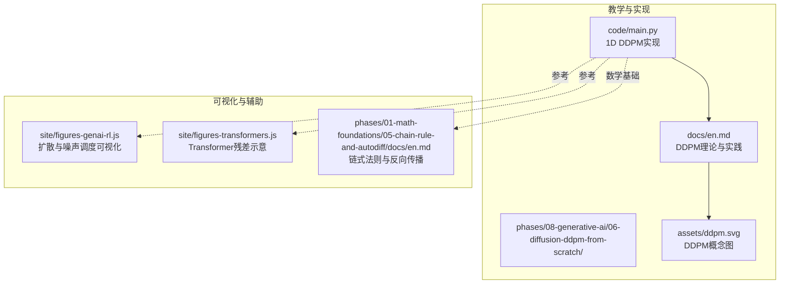
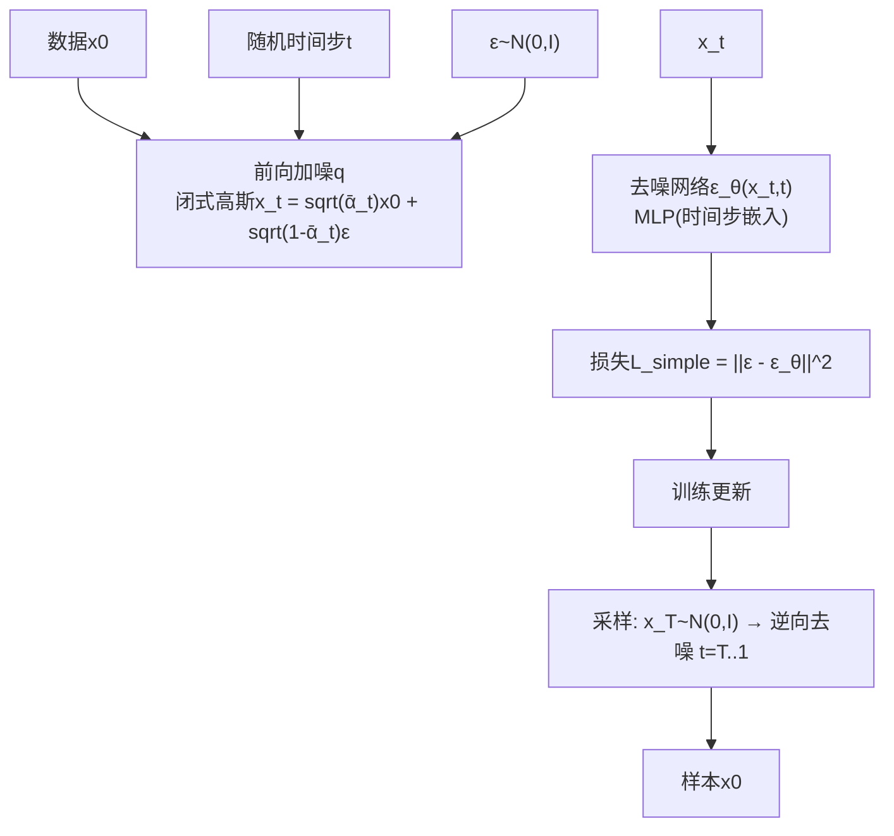
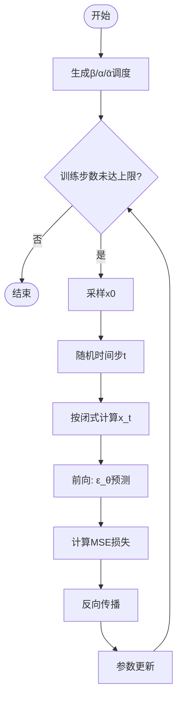
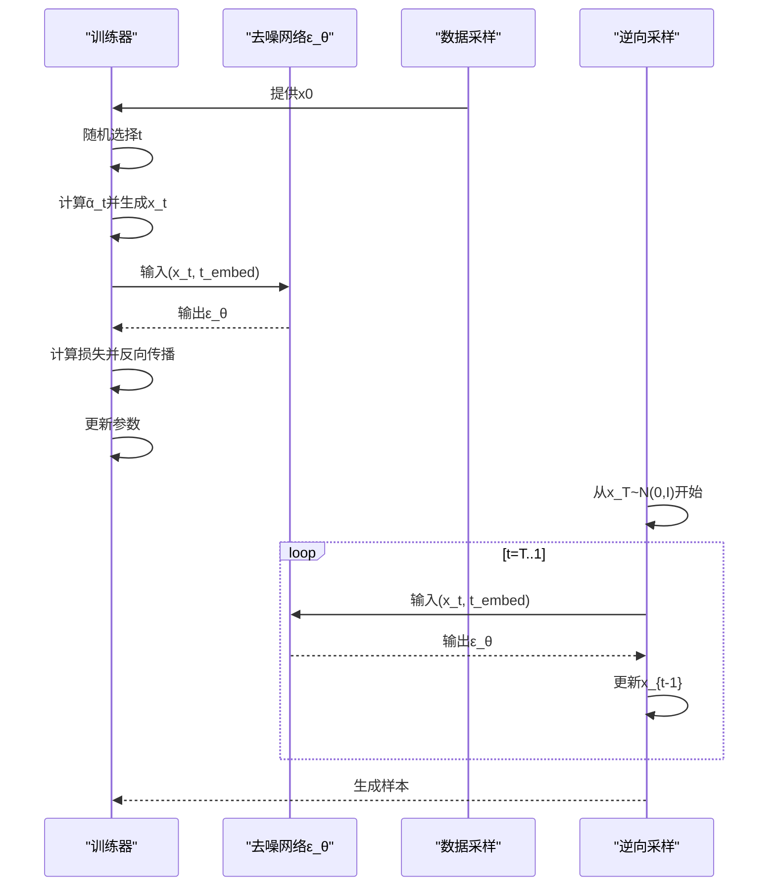
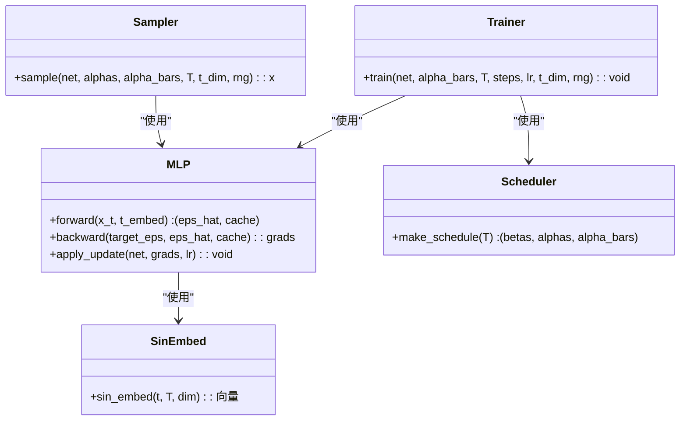
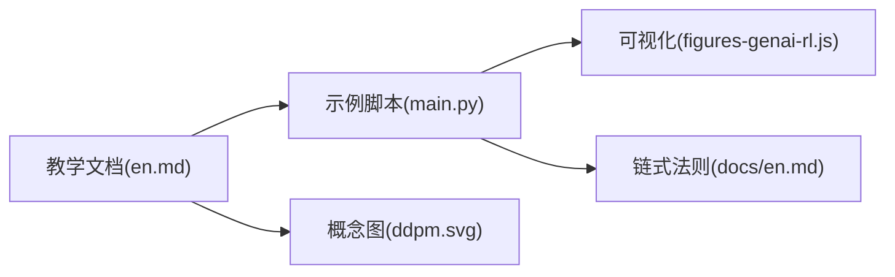

# DDPM理论与实现

<cite>
**本文引用的文件**
- [main.py](file://phases/08-generative-ai/06-diffusion-ddpm-from-scratch/code/main.py)
- [en.md](file://phases/08-generative-ai/06-diffusion-ddpm-from-scratch/docs/en.md)
- [ddpm.svg](file://phases/08-generative-ai/06-diffusion-ddpm-from-scratch/assets/ddpm.svg)
- [figures-genai-rl.js](file://site/figures-genai-rl.js)
- [figures-transformers.js](file://site/figures-transformers.js)
- [en.md](file://phases/01-math-foundations/05-chain-rule-and-autodiff/docs/en.md)
</cite>

## 目录
1. [引言](#引言)
2. [项目结构](#项目结构)
3. [核心组件](#核心组件)
4. [架构总览](#架构总览)
5. [详细组件分析](#详细组件分析)
6. [依赖关系分析](#依赖关系分析)
7. [性能考量](#性能考量)
8. [故障排查指南](#故障排查指南)
9. [结论](#结论)
10. [附录](#附录)

## 引言
本文件面向希望从零理解并实现DDPM（去噪扩散概率模型）的读者，系统梳理其数学原理与工程实现要点，并结合仓库中的教学材料与示例代码，给出可直接复用的实现路径。内容覆盖：
- 扩散过程的数学基础：前向加噪的SDE推导、反向生成的PDE求解思路
- 网络架构设计：U-Net去噪网络的编码器-解码器结构、残差连接与注意力机制的工程化要点
- 噪声调度策略：线性、余弦等对生成质量与收敛行为的影响
- 从零实现DDPM：数据预处理、损失函数、训练循环、采样流程
- 超参数调优、收敛监控与生成质量评估
- 实际训练配置与推理优化技巧

## 项目结构
本仓库中与DDPM直接相关的资料集中在“生成式AI”阶段下的“从零实现DDPM”任务目录，配套有教学文档、SVG图示以及一个可运行的1维DDPM示例脚本；同时，网站前端可视化模块提供了扩散过程与噪声调度的交互演示。

**图表来源**
- [main.py:1-182](file://phases/08-generative-ai/06-diffusion-ddpm-from-scratch/code/main.py#L1-L182)
- [en.md:1-186](file://phases/08-generative-ai/06-diffusion-ddpm-from-scratch/docs/en.md#L1-L186)
- [ddpm.svg](file://phases/08-generative-ai/06-diffusion-ddpm-from-scratch/assets/ddpm.svg)
- [figures-genai-rl.js:19-94](file://site/figures-genai-rl.js#L19-L94)
- [figures-transformers.js:358-404](file://site/figures-transformers.js#L358-L404)
- [en.md:39-99](file://phases/01-math-foundations/05-chain-rule-and-autodiff/docs/en.md#L39-L99)

**章节来源**
- [main.py:1-182](file://phases/08-generative-ai/06-diffusion-ddpm-from-scratch/code/main.py#L1-L182)
- [en.md:1-186](file://phases/08-generative-ai/06-diffusion-ddpm-from-scratch/docs/en.md#L1-L186)

## 核心组件
- 前向噪声调度与闭式分布
  - 线性β调度与累积ᾱ的计算，得到q(x_t|x_0)的闭式高斯形式
- 去噪网络（ε-预测）
  - 小型MLP作为去噪器，输入为(x_t, 时间步嵌入)，输出为噪声预测ε_θ
- 训练目标
  - 简单MSE损失：预测噪声与真实噪声的均方误差
- 反向采样
  - 从x_T~N(0,I)开始，按t从T到1迭代去噪，得到样本

上述组件在1D示例脚本中均有清晰体现，且教学文档对公式与流程进行了系统阐述。

**章节来源**
- [main.py:98-126](file://phases/08-generative-ai/06-diffusion-ddpm-from-scratch/code/main.py#L98-L126)
- [en.md:20-44](file://phases/08-generative-ai/06-diffusion-ddpm-from-scratch/docs/en.md#L20-L44)

## 架构总览
下图展示了DDPM的训练与采样主流程，对应于教学文档中的“前向加噪、反向去噪”两阶段，以及1D示例脚本中的具体实现。

**图表来源**
- [en.md:20-44](file://phases/08-generative-ai/06-diffusion-ddpm-from-scratch/docs/en.md#L20-L44)
- [main.py:112-139](file://phases/08-generative-ai/06-diffusion-ddpm-from-scratch/code/main.py#L112-L139)

## 详细组件分析

### 数学原理与SDE/PDE推导（概念性说明）
- 前向过程q：逐步添加高斯噪声，最终在T时刻近似纯噪声。闭式高斯形式使得联合分布可解析，便于推导训练目标。
- 反向过程p：学习每一步的噪声预测ε_θ，从而以给定的后验均值更新x_t，逐步恢复x_0。
- 从SDE视角看，前向是扩散（扩散系数随时间变化），反向是逆过程（驱动项由噪声预测主导）。PDE角度则通过Fokker-Planck或变分推导得到等价的确定性/随机微分方程。

本节为概念性说明，不直接分析具体源码文件。

### 去噪网络与U-Net结构（工程化要点）
- 1D示例采用小型MLP，输入维度为x_t与时间步嵌入拼接，输出为噪声预测。该结构可直接扩展到图像/视频的U-Net。
- 编码器-解码器与残差连接：编码器逐步降采样并提取特征，解码器逐步上采样并融合跳跃连接，残差连接有助于梯度稳定与细节保留。
- 注意力机制：在U-Net中常引入自注意力或跨注意力，以建模长程依赖与条件信息（如文本-图像对齐）。
- 时间步嵌入：Sinusoidal嵌入或FiLM条件投影，使网络能感知当前时间步并调整通道尺度/偏置。

这些要点在教学文档中有明确说明，可作为从1D到U-Net的迁移指南。

**章节来源**
- [en.md:113-121](file://phases/08-generative-ai/06-diffusion-ddpm-from-scratch/docs/en.md#L113-L121)
- [figures-transformers.js:358-404](file://site/figures-transformers.js#L358-L404)

### 噪声调度策略与生成质量
- 线性β：默认选择，早期信号衰减快，中间阶段信息量适中。
- 余弦调度：在中间步保留更多有用信号，提升中间目标的可判别性，通常带来更好的FID与视觉质量。
- 其他策略：Sigmoid类调度亦被研究，实践中可根据算力预算与质量要求切换。

网站可视化模块提供了线性与余弦ᾱ随步数变化的对比，直观展示不同调度对SNR与信号留存的影响。

**章节来源**
- [en.md:122-128](file://phases/08-generative-ai/06-diffusion-ddpm-from-scratch/docs/en.md#L122-L128)
- [figures-genai-rl.js:61-94](file://site/figures-genai-rl.js#L61-L94)

### 从零实现DDPM（1D示例）
- 数据预处理：1D两峰混合分布，便于观察多模态恢复能力。
- 模型结构：MLP，时间步嵌入采用正余弦编码，随后经tanh隐藏层，输出噪声预测。
- 损失函数：简单MSE，回归目标为真实噪声。
- 训练循环：随机采样x0，随机时间步t，按闭式计算x_t，前向得到ε_θ，反向传播更新权重。
- 采样过程：从高斯噪声开始，按逆向公式逐步去噪，得到样本。

**图表来源**
- [main.py:98-126](file://phases/08-generative-ai/06-diffusion-ddpm-from-scratch/code/main.py#L98-L126)

**章节来源**
- [main.py:1-182](file://phases/08-generative-ai/06-diffusion-ddpm-from-scratch/code/main.py#L1-L182)
- [en.md:60-111](file://phases/08-generative-ai/06-diffusion-ddpm-from-scratch/docs/en.md#L60-L111)

### 关键流程时序（训练与采样）

**图表来源**
- [main.py:112-139](file://phases/08-generative-ai/06-diffusion-ddpm-from-scratch/code/main.py#L112-L139)

**章节来源**
- [main.py:112-139](file://phases/08-generative-ai/06-diffusion-ddpm-from-scratch/code/main.py#L112-L139)

### 1D网络结构（MLP）类图

**图表来源**
- [main.py:5-96](file://phases/08-generative-ai/06-diffusion-ddpm-from-scratch/code/main.py#L5-L96)
- [main.py:98-139](file://phases/08-generative-ai/06-diffusion-ddpm-from-scratch/code/main.py#L98-L139)

**章节来源**
- [main.py:5-139](file://phases/08-generative-ai/06-diffusion-ddpm-from-scratch/code/main.py#L5-L139)

## 依赖关系分析
- 教学文档与示例脚本强关联：文档提供公式与流程，脚本提供可执行实现与验证手段（直方图、均值/众数统计）。
- 可视化模块辅助理解：扩散过程与噪声调度的交互图帮助把握ᾱ与SNR的动态。
- 数学基础支撑：链式法则与反向传播文档为理解MLP的反向传播提供理论依据。

**图表来源**
- [en.md:1-186](file://phases/08-generative-ai/06-diffusion-ddpm-from-scratch/docs/en.md#L1-L186)
- [main.py:1-182](file://phases/08-generative-ai/06-diffusion-ddpm-from-scratch/code/main.py#L1-L182)
- [figures-genai-rl.js:19-94](file://site/figures-genai-rl.js#L19-L94)
- [en.md:39-99](file://phases/01-math-foundations/05-chain-rule-and-autodiff/docs/en.md#L39-L99)
- [ddpm.svg](file://phases/08-generative-ai/06-diffusion-ddpm-from-scratch/assets/ddpm.svg)

**章节来源**
- [en.md:1-186](file://phases/08-generative-ai/06-diffusion-ddpm-from-scratch/docs/en.md#L1-L186)
- [main.py:1-182](file://phases/08-generative-ai/06-diffusion-ddpm-from-scratch/code/main.py#L1-L182)

## 性能考量
- 训练稳定性
  - 使用合适的β调度（如余弦）可提升中间步的信息量，改善收敛。
  - 时间步嵌入必须正确构造，避免直接使用原始浮点t导致图像任务失败。
- 推理效率
  - DDPM默认T=1000步，生产环境通常采用DDIM、DPM-Solver或蒸馏策略大幅减少步数。
  - 编译与缓存：利用编译加速、bf16权重、高效注意力库等降低单步延迟。
- 生成质量
  - 在相同算力预算下，余弦调度通常优于线性调度；必要时引入v-prediction以提升低/高噪声区的稳定性。
  - 条件控制：分类无关指导（CFG）可在推理时增强条件一致性与可控性。

**章节来源**
- [en.md:122-128](file://phases/08-generative-ai/06-diffusion-ddpm-from-scratch/docs/en.md#L122-L128)
- [en.md:167-176](file://phases/08-generative-ai/06-diffusion-ddpm-from-scratch/docs/en.md#L167-L176)

## 故障排查指南
- 采样质量差
  - 检查调度是否切换至余弦；确认时间步嵌入是否使用正余弦编码而非原始浮点数。
  - 若在高噪声区间不稳定，考虑改用v-prediction并相应调整逆向公式。
- 收敛缓慢或发散
  - 适当降低学习率；检查损失打印频率与数值范围；确保批内随机性一致（固定随机种子用于调试）。
- 运行时错误
  - 确认输入维度与时间步嵌入维度匹配；核对矩阵乘法与加法的形状广播。
  - 参考链式法则与反向传播文档，确保反向传播的梯度回传顺序与激活函数导数正确。

**章节来源**
- [main.py:57-84](file://phases/08-generative-ai/06-diffusion-ddpm-from-scratch/code/main.py#L57-L84)
- [en.md:122-128](file://phases/08-generative-ai/06-diffusion-ddpm-from-scratch/docs/en.md#L122-L128)
- [en.md:39-99](file://phases/01-math-foundations/05-chain-rule-and-autodiff/docs/en.md#L39-L99)

## 结论
本文件基于仓库中的教学文档与1D示例脚本，系统阐述了DDPM的数学原理、网络设计要点、调度策略与工程实现路径。通过可视化模块与链式法则文档的辅助，读者可以快速建立从理论到代码的完整认知闭环，并在此基础上扩展到U-Net与更高维任务。

## 附录
- 术语速查
  - 前向过程：固定马尔可夫链q(x_t|x_{t-1})，逐步破坏数据
  - 反向过程：学习链p_θ(x_{t-1}|x_t)，逐步重建数据
  - β调度：每步方差；线性、余弦、Sigmoid
  - ᾱ：累积乘积∏(1-β)，决定闭式x_t的信号比例
  - 简单损失：对噪声预测的MSE；所有变分推导均可归约为此
  - ε-预测：输出为加入的噪声；标准DDPM
  - v-预测：输出为α·ε - σ·x；在极小/极大噪声区间更稳定
  - DDPM：论文Ho et al. 2020；线性β、1000步、U-Net
  - DDIM：无马尔可夫采样器，20-50步，相同训练目标
  - 分类无关指导（CFG）：混合条件与无条件噪声预测以增强条件性

**章节来源**
- [en.md:152-166](file://phases/08-generative-ai/06-diffusion-ddpm-from-scratch/docs/en.md#L152-L166)