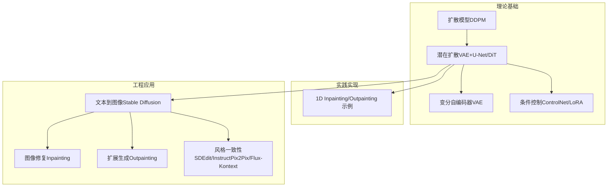
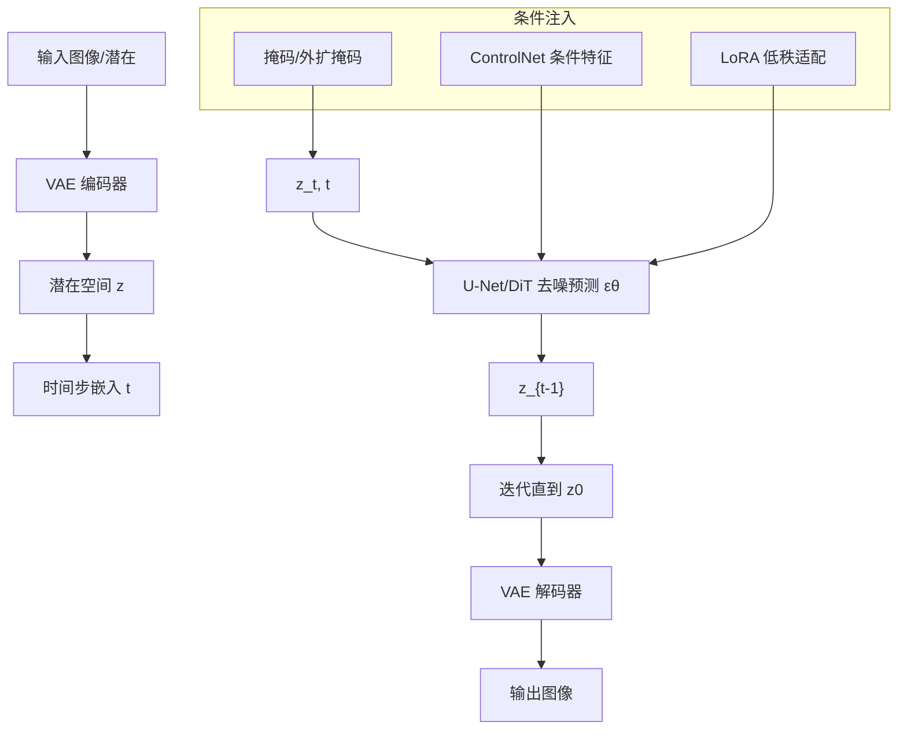
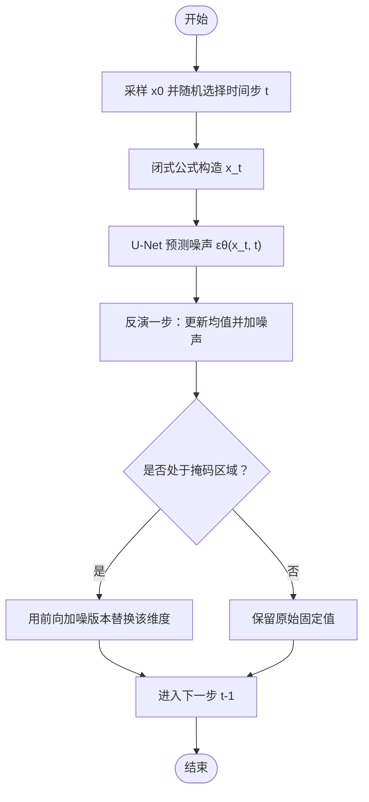
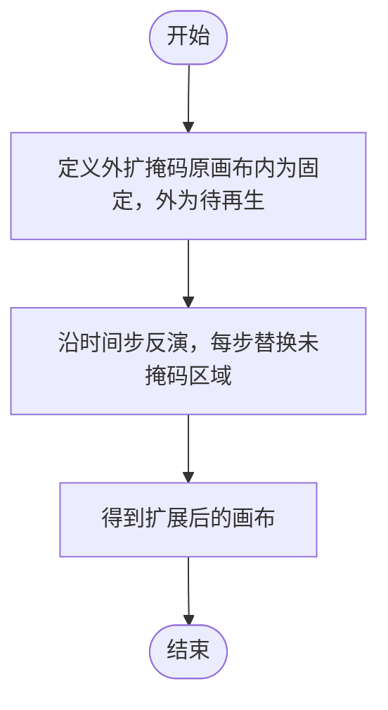
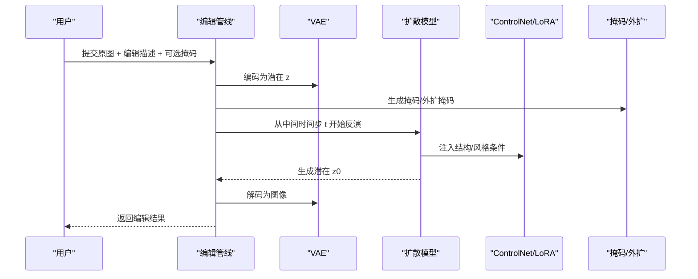
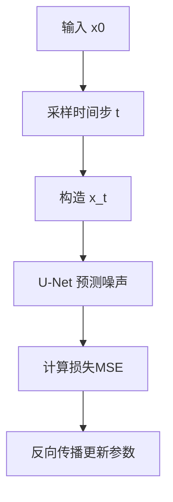
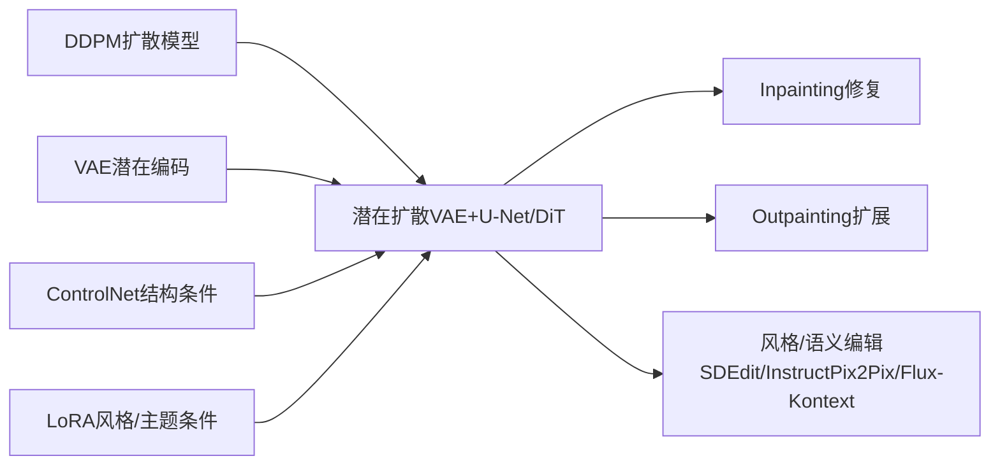

# 图像编辑与修复技术

<cite>
**本文引用的文件**
- [图像修复与编辑（英文）](file://phases/08-generative-ai/09-inpainting-outpainting-editing/docs/en.md)
- [图像修复与编辑（代码）](file://phases/08-generative-ai/09-inpainting-outpainting-editing/code/main.py)
- [扩散模型（DDPM从零构建，英文）](file://phases/08-generative-ai/06-diffusion-ddpm-from-scratch/docs/en.md)
- [潜在扩散与Stable Diffusion（英文）](file://phases/08-generative-ai/07-latent-diffusion-stable-diffusion/docs/en.md)
- [变分自编码器（VAE，英文）](file://phases/08-generative-ai/02-autoencoders-vae/docs/en.md)
- [控制网络、LoRA与条件控制（英文）](file://phases/08-generative-ai/08-controlnet-lora-conditioning/docs/en.md)
- [术语表（节选）](file://glossary/terms.md)
- [站点数据（索引）](file://site/data.js)
</cite>

## 目录
1. [简介](#简介)
2. [项目结构](#项目结构)
3. [核心组件](#核心组件)
4. [架构总览](#架构总览)
5. [详细组件分析](#详细组件分析)
6. [依赖关系分析](#依赖关系分析)
7. [性能考量](#性能考量)
8. [故障排除指南](#故障排除指南)
9. [结论](#结论)
10. [附录](#附录)

## 简介
本技术文档围绕图像编辑与修复（inpainting/outpainting/editing）展开，系统阐述掩码引导的局部重建、边缘对齐与纹理合成原理；解释扩展生成（outpainting）的边界填充与风格一致性保持策略；并结合扩散模型、潜在空间、VAE、ControlNet/LoRA等关键技术，给出可落地的实现路径与工程建议。文档同时覆盖质量评估、性能优化与常见伪影规避，并提供生产级最佳实践与排障清单。

## 项目结构
本仓库中与图像编辑修复直接相关的知识模块主要集中在“生成式AI”阶段的若干课程与文档中，形成“理论—实现—工具—工程”的完整链条：
- 理论基础：扩散模型（DDPM）、潜在扩散（VAE+U-Net/DiT）、条件控制（ControlNet/LoRA）
- 实践实现：1D示例的inpainting/outpainting训练与推理流程
- 工程应用：文本到图像、图像修复、风格一致性、渐进式扩展

图示来源
- [扩散模型（DDPM从零构建，英文）:1-186](file://phases/08-generative-ai/06-diffusion-ddpm-from-scratch/docs/en.md#L1-L186)
- [潜在扩散与Stable Diffusion（英文）:1-150](file://phases/08-generative-ai/07-latent-diffusion-stable-diffusion/docs/en.md#L1-L150)
- [变分自编码器（VAE，英文）:1-157](file://phases/08-generative-ai/02-autoencoders-vae/docs/en.md#L1-L157)
- [控制网络、LoRA与条件控制（英文）:1-157](file://phases/08-generative-ai/08-controlnet-lora-conditioning/docs/en.md#L1-L157)
- [图像修复与编辑（代码）:1-198](file://phases/08-generative-ai/09-inpainting-outpainting-editing/code/main.py#L1-L198)
- [图像修复与编辑（英文）:1-157](file://phases/08-generative-ai/09-inpainting-outpainting-editing/docs/en.md#L1-L157)

章节来源
- [图像修复与编辑（英文）:1-157](file://phases/08-generative-ai/09-inpainting-outpainting-editing/docs/en.md#L1-L157)
- [图像修复与编辑（代码）:1-198](file://phases/08-generative-ai/09-inpainting-outpainting-editing/code/main.py#L1-L198)

## 核心组件
- 扩散去噪与时间步嵌入：通过噪声调度与正弦时间步嵌入，指导U-Net在不同噪声水平下进行去噪预测。
- 潜在空间扩散：VAE将像素空间压缩至低维潜在空间，扩散模型在潜在空间中运行，显著降低计算成本。
- 条件控制：ControlNet在U-Net编码器侧注入额外结构化条件（如边缘、深度、姿态），LoRA以低秩适配微调风格或主题。
- 掩码引导的修复：训练9通道U-Net（噪声潜在+编码源+单通道掩码），在推理时用前向加噪版本替换未掩码区域，仅再生被遮挡区域。
- 扩展生成（Outpainting）：与inpainting相同目标，但掩码反转，用于超出原画布区域的扩展。
- 风格一致性编辑：SDEdit（从中间时间步开始反演）、InstructPix2Pix（指令微调）、Flux-Kontext（参考图像+指令）。

章节来源
- [扩散模型（DDPM从零构建，英文）:1-186](file://phases/08-generative-ai/06-diffusion-ddpm-from-scratch/docs/en.md#L1-L186)
- [潜在扩散与Stable Diffusion（英文）:1-150](file://phases/08-generative-ai/07-latent-diffusion-stable-diffusion/docs/en.md#L1-L150)
- [变分自编码器（VAE，英文）:1-157](file://phases/08-generative-ai/02-autoencoders-vae/docs/en.md#L1-L157)
- [控制网络、LoRA与条件控制（英文）:1-157](file://phases/08-generative-ai/08-controlnet-lora-conditioning/docs/en.md#L1-L157)
- [图像修复与编辑（英文）:1-157](file://phases/08-generative-ai/09-inpainting-outpainting-editing/docs/en.md#L1-L157)

## 架构总览
下图展示了从输入到输出的关键路径：VAE编码潜在空间、扩散模型在潜在空间中逐步去噪、ControlNet/LoRA提供结构/风格条件、掩码/外扩策略决定哪些区域被再生。

图示来源
- [潜在扩散与Stable Diffusion（英文）:1-150](file://phases/08-generative-ai/07-latent-diffusion-stable-diffusion/docs/en.md#L1-L150)
- [变分自编码器（VAE，英文）:1-157](file://phases/08-generative-ai/02-autoencoders-vae/docs/en.md#L1-L157)
- [控制网络、LoRA与条件控制（英文）:1-157](file://phases/08-generative-ai/08-controlnet-lora-conditioning/docs/en.md#L1-L157)
- [图像修复与编辑（英文）:1-157](file://phases/08-generative-ai/09-inpainting-outpainting-editing/docs/en.md#L1-L157)

## 详细组件分析

### 组件A：掩码引导的局部重建（Inpainting）
- 核心思想：训练9通道U-Net（噪声潜在、编码源、单通道掩码），在推理时将未掩码区域替换为前向加噪版本，仅再生被遮挡区域。
- 关键步骤：
  - 训练：随机遮挡图像区域，回归噪声预测。
  - 推理：按时间步反演，每步用前向加噪版本替换未掩码维度，再执行标准去噪更新。
- 复杂度与性能：9通道输入增加计算量，但只对掩码区域有效，未掩码区域被固定，整体效率优于全图去噪。

图示来源
- [图像修复与编辑（代码）:112-160](file://phases/08-generative-ai/09-inpainting-outpainting-editing/code/main.py#L112-L160)
- [图像修复与编辑（英文）:30-40](file://phases/08-generative-ai/09-inpainting-outpainting-editing/docs/en.md#L30-L40)

章节来源
- [图像修复与编辑（英文）:30-41](file://phases/08-generative-ai/09-inpainting-outpainting-editing/docs/en.md#L30-L41)
- [图像修复与编辑（代码）:140-160](file://phases/08-generative-ai/09-inpainting-outpainting-editing/code/main.py#L140-L160)

### 组件B：扩展生成（Outpainting）
- 核心思想：与inpainting相同的目标函数，但掩码反转，用于在原画布之外生成新区域。
- 实现要点：保持与inpainting一致的9通道输入与反演流程，仅改变掩码定义域。

图示来源
- [图像修复与编辑（英文）:89-92](file://phases/08-generative-ai/09-inpainting-outpainting-editing/docs/en.md#L89-L92)

章节来源
- [图像修复与编辑（英文）:89-92](file://phases/08-generative-ai/09-inpainting-outpainting-editing/docs/en.md#L89-L92)

### 组件C：风格一致性与语义编辑（SDEdit/InstructPix2Pix/Flux-Kontext）
- SDEdit：从中间时间步开始反演，结合新提示，平衡保真与创意自由度。
- InstructPix2Pix：在（输入图像、指令、输出图像）三元组上微调，实现文本指令驱动的编辑。
- Flux-Kontext：接受参考图像+指令，无需单独掩码，端到端完成编辑。

图示来源
- [图像修复与编辑（英文）:42-56](file://phases/08-generative-ai/09-inpainting-outpainting-editing/docs/en.md#L42-L56)
- [控制网络、LoRA与条件控制（英文）:1-157](file://phases/08-generative-ai/08-controlnet-lora-conditioning/docs/en.md#L1-L157)
- [潜在扩散与Stable Diffusion（英文）:1-150](file://phases/08-generative-ai/07-latent-diffusion-stable-diffusion/docs/en.md#L1-L150)

章节来源
- [图像修复与编辑（英文）:42-56](file://phases/08-generative-ai/09-inpainting-outpainting-editing/docs/en.md#L42-L56)
- [控制网络、LoRA与条件控制（英文）:1-157](file://phases/08-generative-ai/08-controlnet-lora-conditioning/docs/en.md#L1-L157)
- [潜在扩散与Stable Diffusion（英文）:1-150](file://phases/08-generative-ai/07-latent-diffusion-stable-diffusion/docs/en.md#L1-L150)

### 组件D：掩码处理与损失函数设计
- 掩码处理：在推理时将未掩码维度替换为前向加噪版本，确保上下文信息参与再生过程。
- 损失函数：基于扩散的简单MSE（噪声预测），在潜在空间中进行，训练稳定且效果良好。
- 多尺度生成：通过不同时间步起始（SDEdit）或不同分辨率逐步扩展（Outpainting）实现多尺度一致性。

图示来源
- [扩散模型（DDPM从零构建，英文）:36-44](file://phases/08-generative-ai/06-diffusion-ddpm-from-scratch/docs/en.md#L36-L44)
- [图像修复与编辑（代码）:112-123](file://phases/08-generative-ai/09-inpainting-outpainting-editing/code/main.py#L112-L123)

章节来源
- [扩散模型（DDPM从零构建，英文）:36-44](file://phases/08-generative-ai/06-diffusion-ddpm-from-scratch/docs/en.md#L36-L44)
- [图像修复与编辑（代码）:112-123](file://phases/08-generative-ai/09-inpainting-outpainting-editing/code/main.py#L112-L123)

## 依赖关系分析
- 理论依赖：扩散模型（DDPM）是潜在扩散的基础；VAE提供潜在空间；ControlNet/LoRA提供条件注入。
- 实现依赖：1D示例代码依赖于时间步嵌入、前向加噪与反演步骤；真实图像修复依赖9通道U-Net与掩码替换逻辑。
- 工具链依赖：Diffusers等框架提供预训练模型与管线，便于快速集成。

图示来源
- [扩散模型（DDPM从零构建，英文）:1-186](file://phases/08-generative-ai/06-diffusion-ddpm-from-scratch/docs/en.md#L1-L186)
- [潜在扩散与Stable Diffusion（英文）:1-150](file://phases/08-generative-ai/07-latent-diffusion-stable-diffusion/docs/en.md#L1-L150)
- [变分自编码器（VAE，英文）:1-157](file://phases/08-generative-ai/02-autoencoders-vae/docs/en.md#L1-L157)
- [控制网络、LoRA与条件控制（英文）:1-157](file://phases/08-generative-ai/08-controlnet-lora-conditioning/docs/en.md#L1-L157)
- [图像修复与编辑（英文）:1-157](file://phases/08-generative-ai/09-inpainting-outpainting-editing/docs/en.md#L1-L157)

章节来源
- [扩散模型（DDPM从零构建，英文）:1-186](file://phases/08-generative-ai/06-diffusion-ddpm-from-scratch/docs/en.md#L1-L186)
- [潜在扩散与Stable Diffusion（英文）:1-150](file://phases/08-generative-ai/07-latent-diffusion-stable-diffusion/docs/en.md#L1-L150)
- [变分自编码器（VAE，英文）:1-157](file://phases/08-generative-ai/02-autoencoders-vae/docs/en.md#L1-L157)
- [控制网络、LoRA与条件控制（英文）:1-157](file://phases/08-generative-ai/08-controlnet-lora-conditioning/docs/en.md#L1-L157)
- [图像修复与编辑（英文）:1-157](file://phases/08-generative-ai/09-inpainting-outpainting-editing/docs/en.md#L1-L157)

## 性能考量
- 推理步数与速度：DDPM默认1000步，生产环境采用DDIM、DPM-Solver等更少步数方案；Distillation进一步减少步数。
- 潜在空间优势：VAE将像素空间降至低维潜在空间，显著降低计算与内存开销。
- 条件注入成本：ControlNet并行运行，叠加LoRA增量权重，需权衡显存与吞吐。
- VAE解码切片/平铺：在高分辨率下使用切片/平铺降低峰值内存。
- 量化与卸载：在消费级GPU上可采用4位量化与CPU卸载策略。

章节来源
- [扩散模型（DDPM从零构建，英文）:167-176](file://phases/08-generative-ai/06-diffusion-ddpm-from-scratch/docs/en.md#L167-L176)
- [潜在扩散与Stable Diffusion（英文）:131-140](file://phases/08-generative-ai/07-latent-diffusion-stable-diffusion/docs/en.md#L131-L140)
- [变分自编码器（VAE，英文）:142-148](file://phases/08-generative-ai/02-autoencoders-vae/docs/en.md#L142-L148)
- [控制网络、LoRA与条件控制（英文）:139-148](file://phases/08-generative-ai/08-controlnet-lora-conditioning/docs/en.md#L139-L148)

## 故障排除指南
- 边界伪影（接缝）：小掩码导致大量无效计算，建议扩大掩码或使用专门的inpainting模型；必要时采用RePaint定期重加噪。
- 掩码泄漏：若条件图像未掩码区域质量差，会污染生成区域，应先进行降噪或轻微模糊。
- CFG与掩码大小交互：小掩码配合高CFG会产生过饱和补丁，应降低CFG。
- SDEdit保真悬崖：从t/T=0.5跳到0.6可能丢失主体身份，需扫描并留档。
- 提示不匹配：提示应描述整幅画面而非仅新增内容。
- 生产延迟敏感：编辑管线TTFT主导，需优化各阶段（SAM、VAE、U-Net）并尽量复用潜在表示。

章节来源
- [图像修复与编辑（英文）:93-118](file://phases/08-generative-ai/09-inpainting-outpainting-editing/docs/en.md#L93-L118)
- [图像修复与编辑（英文）:139-147](file://phases/08-generative-ai/09-inpainting-outpainting-editing/docs/en.md#L139-L147)

## 结论
图像编辑与修复以扩散模型为核心，结合VAE潜在空间、ControlNet/LoRA条件注入与掩码/外扩策略，实现了高质量、可控的局部重建与扩展生成。实践中需重视掩码设计、CFG与时间步选择、以及VAE/模型量化与卸载等工程细节，才能在质量与延迟之间取得平衡。

## 附录
- 术语速查
  - Inpainting：掩码引导的局部重建。
  - Outpainting：扩展生成，掩码反转。
  - 9通道U-Net：噪声潜在+编码源+掩码作为输入。
  - SDEdit：从中间时间步开始的图像合成与编辑。
  - InstructPix2Pix：文本指令驱动的图像编辑。
  - RePaint：无需重训的边界伪影缓解方法。
  - Flux-Kontext：参考图像+指令的端到端编辑。

章节来源
- [术语表（节选）:90-115](file://glossary/terms.md#L90-L115)
- [图像修复与编辑（英文）:126-138](file://phases/08-generative-ai/09-inpainting-outpainting-editing/docs/en.md#L126-L138)