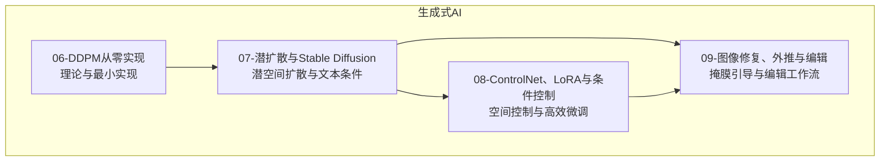
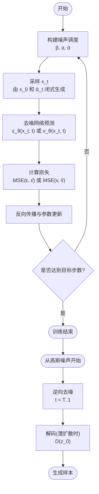
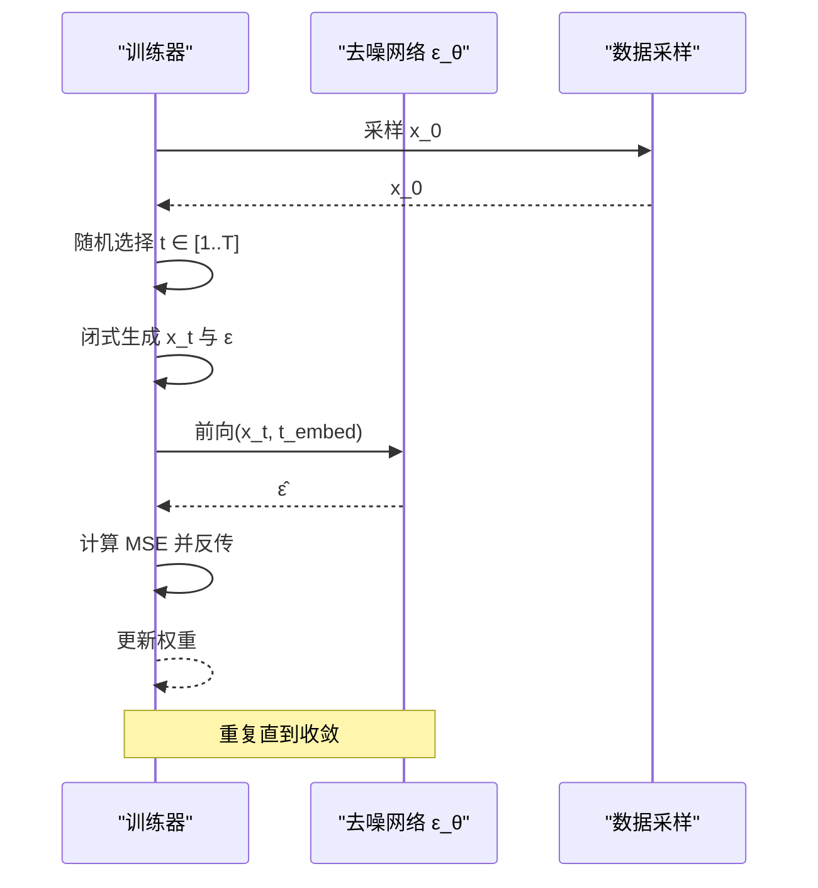
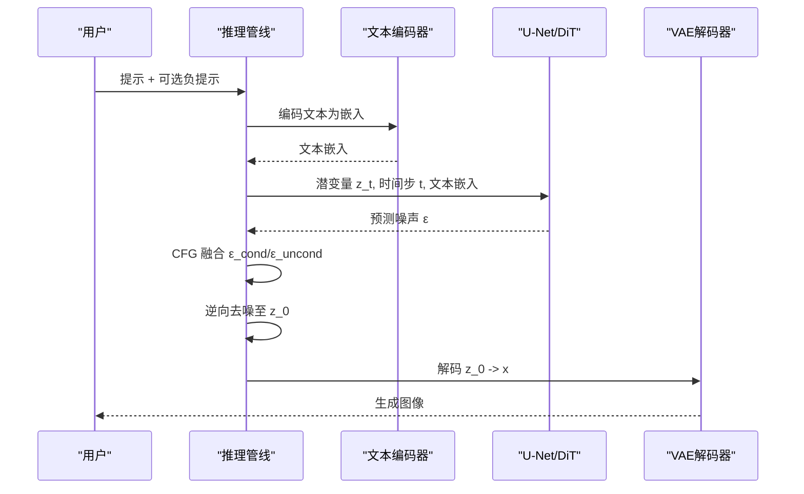
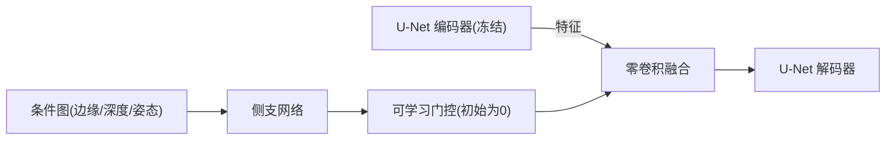
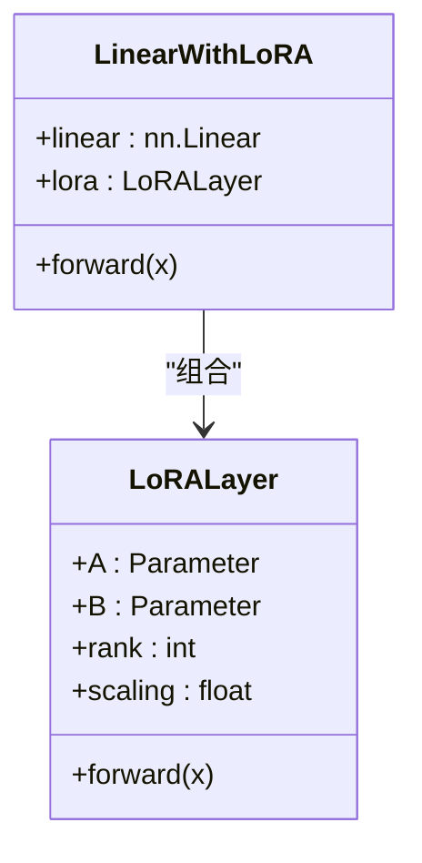
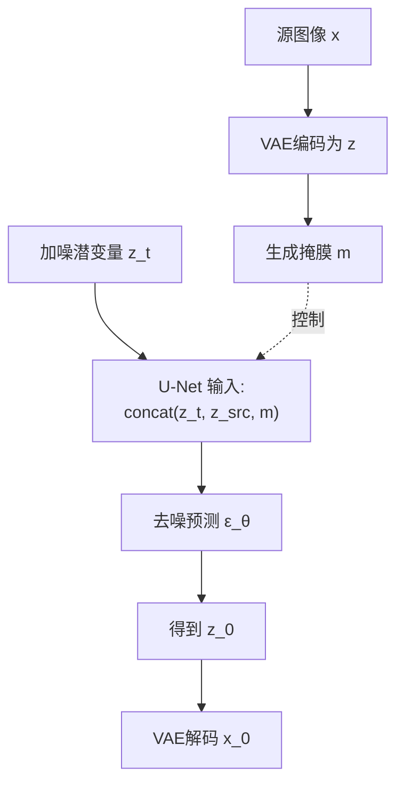
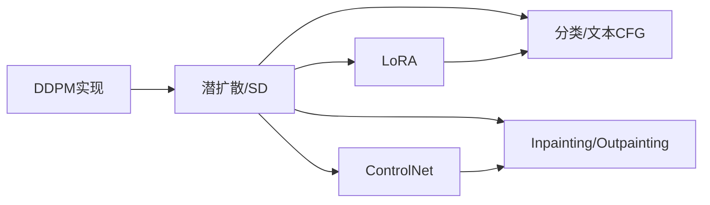

# 扩散模型

<cite>
**本文引用的文件**
- [phases/08-generative-ai/06-diffusion-ddpm-from-scratch/docs/en.md](file://phases/08-generative-ai/06-diffusion-ddpm-from-scratch/docs/en.md)
- [phases/08-generative-ai/06-diffusion-ddpm-from-scratch/code/main.py](file://phases/08-generative-ai/06-diffusion-ddpm-from-scratch/code/main.py)
- [phases/08-generative-ai/07-latent-diffusion-stable-diffusion/docs/en.md](file://phases/08-generative-ai/07-latent-diffusion-stable-diffusion/docs/en.md)
- [phases/08-generative-ai/07-latent-diffusion-stable-diffusion/code/main.py](file://phases/08-generative-ai/07-latent-diffusion-stable-diffusion/code/main.py)
- [phases/08-generative-ai/08-controlnet-lora-conditioning/docs/en.md](file://phases/08-generative-ai/08-controlnet-lora-conditioning/docs/en.md)
- [phases/08-generative-ai/08-controlnet-lora-conditioning/code/main.py](file://phases/08-generative-ai/08-controlnet-lora-conditioning/code/main.py)
- [phases/08-generative-ai/09-inpainting-outpainting-editing/docs/en.md](file://phases/08-generative-ai/09-inpainting-outpainting-editing/docs/en.md)
- [phases/08-generative-ai/09-inpainting-outpainting-editing/code/main.py](file://phases/08-generative-ai/09-inpainting-outpainting-editing/code/main.py)
- [test_lora_demo.py](file://test_lora_demo.py)
</cite>

## 目录
1. [引言](#引言)
2. [项目结构](#项目结构)
3. [核心组件](#核心组件)
4. [架构总览](#架构总览)
5. [详细组件分析](#详细组件分析)
6. [依赖关系分析](#依赖关系分析)
7. [性能考量](#性能考量)
8. [故障排查指南](#故障排查指南)
9. [结论](#结论)
10. [附录](#附录)

## 引言
本技术文档系统梳理扩散模型的理论基础与工程实现，围绕以下主线展开：
- 理论基础：前向扩散过程与反向生成过程的数学推导；DDPM的损失与采样流程。
- 实现细节：噪声调度策略、时间步嵌入、去噪网络架构与训练/推理循环。
- 架构演进：潜空间扩散模型（LDM）与Stable Diffusion的U-Net/Transformer结构、CLIP文本编码器与交叉注意力。
- 条件控制与高效微调：ControlNet的空间结构控制、LoRA的低秩适配与权重合并。
- 图像修复/外推/编辑：Inpainting、Outpainting与编辑工作流。
- 从零实现：训练数据准备、模型配置与推理优化建议。
- 应用场景：高保真图像生成、文本到图像合成。

## 项目结构
本仓库中与扩散模型直接相关的教学内容集中在“生成式AI”阶段的四个课程模块：
- DDPM从零实现：理论与最小实现
- 潜扩散与Stable Diffusion：潜空间扩散与文本条件
- ControlNet、LoRA与条件控制：空间结构控制与参数高效微调
- 图像修复、外推与编辑：掩膜引导的生成与编辑管线

章节来源
- [phases/08-generative-ai/06-diffusion-ddpm-from-scratch/docs/en.md:1-186](file://phases/08-generative-ai/06-diffusion-ddpm-from-scratch/docs/en.md#L1-L186)
- [phases/08-generative-ai/07-latent-diffusion-stable-diffusion/docs/en.md:1-150](file://phases/08-generative-ai/07-latent-diffusion-stable-diffusion/docs/en.md#L1-L150)
- [phases/08-generative-ai/08-controlnet-lora-conditioning/docs/en.md:1-157](file://phases/08-generative-ai/08-controlnet-lora-conditioning/docs/en.md#L1-L157)
- [phases/08-generative-ai/09-inpainting-outpainting-editing/docs/en.md:1-157](file://phases/08-generative-ai/09-inpainting-outpainting-editing/docs/en.md#L1-L157)

## 核心组件
- 前向扩散过程 q：逐步加噪，形成闭式分布 q(x_t|x_0)，便于推导与数值稳定。
- 反向生成过程 p_θ：训练神经网络预测噪声 ε_θ(x_t,t)，按代数公式逆向去噪。
- 训练损失 L_simple：对噪声的MSE，等价于变分下界在特定参数化下的简化。
- 时间步嵌入：正弦/余弦或FiLM通道尺度/偏置，使网络感知时刻 t。
- 分类/文本条件：通过类别标签或文本嵌入参与去噪预测，结合CFG提升可控性。
- 潜空间扩散：VAE编码器/解码器冻结，仅训练U-Net/DiT于潜空间。
- ControlNet：克隆U-Net编码器分支，以零卷积连接回解码器，读取额外条件图。
- LoRA：在注意力/线性层上添加低秩增量 ΔW=B@A，大幅降低参数量与计算成本。
- 掩膜引导生成：Inpainting/Outpainting在U-Net输入中加入编码后的源图与单通道掩膜。

章节来源
- [phases/08-generative-ai/06-diffusion-ddpm-from-scratch/docs/en.md:16-44](file://phases/08-generative-ai/06-diffusion-ddpm-from-scratch/docs/en.md#L16-L44)
- [phases/08-generative-ai/07-latent-diffusion-stable-diffusion/docs/en.md:18-31](file://phases/08-generative-ai/07-latent-diffusion-stable-diffusion/docs/en.md#L18-L31)
- [phases/08-generative-ai/08-controlnet-lora-conditioning/docs/en.md:20-55](file://phases/08-generative-ai/08-controlnet-lora-conditioning/docs/en.md#L20-L55)
- [phases/08-generative-ai/09-inpainting-outpainting-editing/docs/en.md:22-41](file://phases/08-generative-ai/09-inpainting-outpainting-editing/docs/en.md#L22-L41)

## 架构总览
扩散模型的通用训练与推理循环如下：

图表来源
- [phases/08-generative-ai/06-diffusion-ddpm-from-scratch/docs/en.md:20-44](file://phases/08-generative-ai/06-diffusion-ddpm-from-scratch/docs/en.md#L20-L44)
- [phases/08-generative-ai/06-diffusion-ddpm-from-scratch/code/main.py:98-139](file://phases/08-generative-ai/06-diffusion-ddpm-from-scratch/code/main.py#L98-L139)

章节来源
- [phases/08-generative-ai/06-diffusion-ddpm-from-scratch/docs/en.md:60-111](file://phases/08-generative-ai/06-diffusion-ddpm-from-scratch/docs/en.md#L60-L111)
- [phases/08-generative-ai/06-diffusion-ddpm-from-scratch/code/main.py:158-178](file://phases/08-generative-ai/06-diffusion-ddpm-from-scratch/code/main.py#L158-L178)

## 详细组件分析

### DDPM：从零实现
- 数学要点
  - 前向过程 q：q(x_t|x_0)=N(sqrt(ᾱ_t)·x_0, (1-ᾱ_t)·I)，线性/余弦/正弦调度均可。
  - 反向过程 p_θ：预测噪声 ε_θ(x_t,t)，按代数公式求均值与方差项，t>0加高斯噪声。
  - 训练损失 L_simple：对 ε 的MSE，无KL、无重参数化技巧，稳定易收敛。
- 实现要点
  - 时间步嵌入：正弦/余弦编码，拼接至输入或通道尺度/偏置（FiLM）。
  - 小型MLP作为去噪网络，输入 (x_t, t_embed)，输出 ε̂。
  - 采样循环：从 x_T~N(0,I) 开始，逆向迭代直至 t=0。
- 关键路径
  - 噪声调度：[phases/08-generative-ai/06-diffusion-ddpm-from-scratch/code/main.py:98-105](file://phases/08-generative-ai/06-diffusion-ddpm-from-scratch/code/main.py#L98-L105)
  - 去噪网络前向/反向：[phases/08-generative-ai/06-diffusion-ddpm-from-scratch/code/main.py:47-84](file://phases/08-generative-ai/06-diffusion-ddpm-from-scratch/code/main.py#L47-L84)
  - 训练与采样主循环：[phases/08-generative-ai/06-diffusion-ddpm-from-scratch/code/main.py:112-139](file://phases/08-generative-ai/06-diffusion-ddpm-from-scratch/code/main.py#L112-L139)

图表来源
- [phases/08-generative-ai/06-diffusion-ddpm-from-scratch/code/main.py:112-125](file://phases/08-generative-ai/06-diffusion-ddpm-from-scratch/code/main.py#L112-L125)

章节来源
- [phases/08-generative-ai/06-diffusion-ddpm-from-scratch/docs/en.md:20-44](file://phases/08-generative-ai/06-diffusion-ddpm-from-scratch/docs/en.md#L20-L44)
- [phases/08-generative-ai/06-diffusion-ddpm-from-scratch/code/main.py:158-178](file://phases/08-generative-ai/06-diffusion-ddpm-from-scratch/code/main.py#L158-L178)

### 潜扩散与Stable Diffusion：U-Net/Transformer、文本条件与CFG
- 潜空间扩散
  - 冻结VAE（第一阶段），在第四通道的64×64（或更大）潜空间上训练U-Net（或DiT）。
  - 训练损失与DDPM一致，只是数据域从像素切换到潜变量。
- 文本条件
  - 冻结CLIP/多模态文本编码器，将文本嵌入作为跨注意力输入，仅在U-Net块中注入。
  - SD3/Flux进一步采用T5-XXL与MMDiT，提升提示遵循度与细节容量。
- 分类/文本CFG
  - 训练时以一定概率丢弃标签（空类），推理时同时得到 ε_cond 与 ε_uncond，按 ε_cfg=(1+w)·ε_cond − w·ε_uncond 调节强度。
- 关键路径
  - 编码/解码与CFG采样：[phases/08-generative-ai/07-latent-diffusion-stable-diffusion/code/main.py:115-165](file://phases/08-generative-ai/07-latent-diffusion-stable-diffusion/code/main.py#L115-L165)
  - 文本条件与跨注意力概念说明：[phases/08-generative-ai/07-latent-diffusion-stable-diffusion/docs/en.md:77-85](file://phases/08-generative-ai/07-latent-diffusion-stable-diffusion/docs/en.md#L77-L85)

图表来源
- [phases/08-generative-ai/07-latent-diffusion-stable-diffusion/docs/en.md:77-85](file://phases/08-generative-ai/07-latent-diffusion-stable-diffusion/docs/en.md#L77-L85)
- [phases/08-generative-ai/07-latent-diffusion-stable-diffusion/code/main.py:152-165](file://phases/08-generative-ai/07-latent-diffusion-stable-diffusion/code/main.py#L152-L165)

章节来源
- [phases/08-generative-ai/07-latent-diffusion-stable-diffusion/docs/en.md:18-31](file://phases/08-generative-ai/07-latent-diffusion-stable-diffusion/docs/en.md#L18-L31)
- [phases/08-generative-ai/07-latent-diffusion-stable-diffusion/docs/en.md:87-94](file://phases/08-generative-ai/07-latent-diffusion-stable-diffusion/docs/en.md#L87-L94)

### ControlNet：空间结构控制
- 核心思想
  - 克隆预训练U-Net的编码器分支，冻结原编码器；新增侧支网络读取条件图（边缘/深度/姿态/草图）。
  - 使用零卷积（1×1卷积，初始化为0）将侧支输出以门控方式注入解码器对应层级，初始为恒等映射。
- 组合使用
  - 多种模态的ControlNet可叠加，权重和≈1.0为安全默认。
- 关键路径
  - ControlNet-lite模拟与门控更新：[phases/08-generative-ai/08-controlnet-lora-conditioning/code/main.py:57-78](file://phases/08-generative-ai/08-controlnet-lora-conditioning/code/main.py#L57-L78)

图表来源
- [phases/08-generative-ai/08-controlnet-lora-conditioning/docs/en.md:24-39](file://phases/08-generative-ai/08-controlnet-lora-conditioning/docs/en.md#L24-L39)

章节来源
- [phases/08-generative-ai/08-controlnet-lora-conditioning/docs/en.md:20-55](file://phases/08-generative-ai/08-controlnet-lora-conditioning/docs/en.md#L20-L55)
- [phases/08-generative-ai/08-controlnet-lora-conditioning/code/main.py:57-78](file://phases/08-generative-ai/08-controlnet-lora-conditioning/code/main.py#L57-L78)

### LoRA：参数高效微调
- 数学与动机
  - 对任意线性层 W∈R^{d×d}，冻结 W，引入低秩增量 ΔW=B@A（r<<d），总参数从 d^2 降至 2dr。
  - 推理时可按 α·B@A 调整强度；多LoRA可叠加（交互非线性）。
- 实践要点
  - rank 通常为 4–16（注意力），64–128（重微调）；α 建议 ≤1.5。
  - 可将LoRA合并回基座权重以加速推理，但会失去运行时缩放灵活性。
- 关键路径
  - LoRA层与Linear包装：[test_lora_demo.py:89-111](file://test_lora_demo.py#L89-L111)
  - LoRA注入与统计参数：[test_lora_demo.py:113-131](file://test_lora_demo.py#L113-L131)
  - LoRA合并回基座：[test_lora_demo.py:139-153](file://test_lora_demo.py#L139-L153)

图表来源
- [test_lora_demo.py:89-111](file://test_lora_demo.py#L89-L111)

章节来源
- [phases/08-generative-ai/08-controlnet-lora-conditioning/docs/en.md:40-51](file://phases/08-generative-ai/08-controlnet-lora-conditioning/docs/en.md#L40-L51)
- [test_lora_demo.py:177-231](file://test_lora_demo.py#L177-L231)

### 图像修复、外推与编辑
- Inpainting
  - 训练U-Net输入为 9 通道：[noisy_latent|encoded_source|mask]，仅对掩膜区域去噪，未掩区域作为干净条件。
  - 推理时在每一步用前向加噪的干净图像填充未掩区域，再执行标准逆向去噪。
- Outpainting
  - 与Inpainting类似，但掩膜反转，用于扩展画布。
- 编辑工作流
  - SDEdit：将源图加噪至中间时刻 t，再从该时刻逆向去噪，配合新提示，平衡保真与创意。
  - InstructPix2Pix：(输入图像, 指令, 输出图像) 的微调，支持图像指令编辑。
- 关键路径
  - Inpainting/Outpainting示例与掩膜处理：[phases/08-generative-ai/09-inpainting-outpainting-editing/code/main.py:140-160](file://phases/08-generative-ai/09-inpainting-outpainting-editing/code/main.py#L140-L160)
  - SDEdit与InstructPix2Pix概述：[phases/08-generative-ai/09-inpainting-outpainting-editing/docs/en.md:42-53](file://phases/08-generative-ai/09-inpainting-outpainting-editing/docs/en.md#L42-L53)

图表来源
- [phases/08-generative-ai/09-inpainting-outpainting-editing/docs/en.md:30-41](file://phases/08-generative-ai/09-inpainting-outpainting-editing/docs/en.md#L30-L41)

章节来源
- [phases/08-generative-ai/09-inpainting-outpainting-editing/docs/en.md:10-21](file://phases/08-generative-ai/09-inpainting-outpainting-editing/docs/en.md#L10-L21)
- [phases/08-generative-ai/09-inpainting-outpainting-editing/docs/en.md:93-100](file://phases/08-generative-ai/09-inpainting-outpainting-editing/docs/en.md#L93-L100)

## 依赖关系分析
- 模块内依赖
  - DDPM：调度函数 → 去噪网络 → 训练/采样循环。
  - 潜扩散：VAE编码/解码 → DDPM在潜空间上的复用 → CFG采样。
  - ControlNet：预训练U-Net编码器克隆 → 侧支网络 → 零卷积融合。
  - LoRA：对线性层添加低秩增量，可叠加。
  - Inpainting：在U-Net输入中增加编码源图与掩膜通道。
- 生产环境耦合
  - 采样步数与推理速度：DDIM/DPM-Solver/Consistency Models/蒸馏。
  - 内存与吞吐：量化（4/8位）、CPU offload、LoRA热交换、ControlNet并行。

图表来源
- [phases/08-generative-ai/06-diffusion-ddpm-from-scratch/docs/en.md:167-176](file://phases/08-generative-ai/06-diffusion-ddpm-from-scratch/docs/en.md#L167-L176)
- [phases/08-generative-ai/07-latent-diffusion-stable-diffusion/docs/en.md:131-139](file://phases/08-generative-ai/07-latent-diffusion-stable-diffusion/docs/en.md#L131-L139)
- [phases/08-generative-ai/08-controlnet-lora-conditioning/docs/en.md:139-148](file://phases/08-generative-ai/08-controlnet-lora-conditioning/docs/en.md#L139-L148)

章节来源
- [phases/08-generative-ai/06-diffusion-ddpm-from-scratch/docs/en.md:167-176](file://phases/08-generative-ai/06-diffusion-ddpm-from-scratch/docs/en.md#L167-L176)
- [phases/08-generative-ai/07-latent-diffusion-stable-diffusion/docs/en.md:131-139](file://phases/08-generative-ai/07-latent-diffusion-stable-diffusion/docs/en.md#L131-L139)
- [phases/08-generative-ai/08-controlnet-lora-conditioning/docs/en.md:139-148](file://phases/08-generative-ai/08-controlnet-lora-conditioning/docs/en.md#L139-L148)

## 性能考量
- 训练稳定性
  - 线性/余弦/正弦 β 调度；时间步嵌入需正确构造（避免直接用浮点 t）。
  - 在小/大 t 区间，ε 信号差，可改用 v-prediction 提升稳定性。
- 推理效率
  - 采样步数：DDIM（20–50步）、DPM-Solver++（10–20步）、UniPC（8–16步）。
  - 蒸馏/一致性模型：将教师模型在更少步数内匹配，如LCM/SDXL-Turbo/SD3-Turbo。
  - 硬件优化：bf16/混合精度、xFormers/SDPA、编译加速（torch.compile）。
- 内存与吞吐
  - 潜扩散显著降低FLOPs；量化（4/8位）与CPU offload适合消费级设备。
  - 多LoRA/多ControlNet叠加会增加每步计算；建议LoRA热交换而非合并。

章节来源
- [phases/08-generative-ai/06-diffusion-ddpm-from-scratch/docs/en.md:122-129](file://phases/08-generative-ai/06-diffusion-ddpm-from-scratch/docs/en.md#L122-L129)
- [phases/08-generative-ai/07-latent-diffusion-stable-diffusion/docs/en.md:131-139](file://phases/08-generative-ai/07-latent-diffusion-stable-diffusion/docs/en.md#L131-L139)
- [phases/08-generative-ai/08-controlnet-lora-conditioning/docs/en.md:139-148](file://phases/08-generative-ai/08-controlnet-lora-conditioning/docs/en.md#L139-L148)

## 故障排查指南
- VAE尺度不匹配：忘记 scaling_factor 导致潜变量方差异常，影响训练稳定性。
- 文本编码器不兼容：SD3需启用 T5-XXL，否则提示遵循度下降。
- CFG过高：w>10 易导致过饱和/过锐利，多样性下降。
- LoRA权重冲突：多LoRA叠加时注意交互，α 建议 ≤1.5。
- ControlNet权重冲突：Pose+Depth同时使用时权重和≈1.0更稳妥。
- 掩膜泄漏：未掩区域质量差会污染生成结果，应先去噪/模糊。
- SDEdit“保真悬崖”：从 t/T=0.5→0.6 可能丢失主体身份，需扫描与留档。

章节来源
- [phases/08-generative-ai/07-latent-diffusion-stable-diffusion/docs/en.md:87-94](file://phases/08-generative-ai/07-latent-diffusion-stable-diffusion/docs/en.md#L87-L94)
- [phases/08-generative-ai/08-controlnet-lora-conditioning/docs/en.md:95-102](file://phases/08-generative-ai/08-controlnet-lora-conditioning/docs/en.md#L95-L102)
- [phases/08-generative-ai/09-inpainting-outpainting-editing/docs/en.md:93-100](file://phases/08-generative-ai/09-inpainting-outpainting-editing/docs/en.md#L93-L100)

## 结论
扩散模型以简洁稳定的噪声预测目标统一了训练与采样，通过潜空间与文本条件进一步拓展到高保真图像生成与可控编辑。ControlNet与LoRA提供了强大的条件控制与高效微调能力，使得Stable Diffusion成为业界主流的图像生成与编辑基础设施。生产实践中，采样步数、蒸馏与量化是决定延迟与成本的关键；而LoRA/ControlNet的热交换与内存管理则决定了多租户服务的灵活性与吞吐。

## 附录
- 从零实现步骤（概要）
  - 数据准备：一维混合分布或二维图像数据，归一化与批处理。
  - 模型配置：MLP/U-Net结构、时间步嵌入维度、损失函数（MSE）。
  - 训练循环：随机采样 t，闭式生成 x_t，前向预测 ε̂，反向传播。
  - 推理采样：从噪声开始，逆向去噪，必要时进行CFG融合与VAE解码。
  - 评估：直方图/模式识别（一维）、FID/CLIP分数（图像）。
- 参考实现路径
  - DDPM最小实现：[phases/08-generative-ai/06-diffusion-ddpm-from-scratch/code/main.py](file://phases/08-generative-ai/06-diffusion-ddpm-from-scratch/code/main.py)
  - 潜扩散与CFG：[phases/08-generative-ai/07-latent-diffusion-stable-diffusion/code/main.py](file://phases/08-generative-ai/07-latent-diffusion-stable-diffusion/code/main.py)
  - ControlNet-lite与LoRA演示：[phases/08-generative-ai/08-controlnet-lora-conditioning/code/main.py](file://phases/08-generative-ai/08-controlnet-lora-conditioning/code/main.py), [test_lora_demo.py](file://test_lora_demo.py)
  - Inpainting/Outpainting示例：[phases/08-generative-ai/09-inpainting-outpainting-editing/code/main.py](file://phases/08-generative-ai/09-inpainting-outpainting-editing/code/main.py)