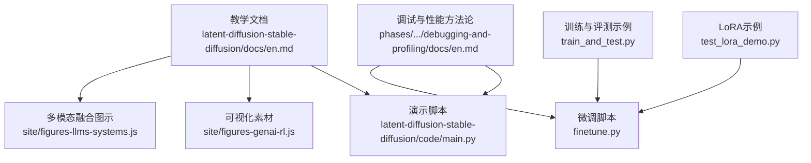
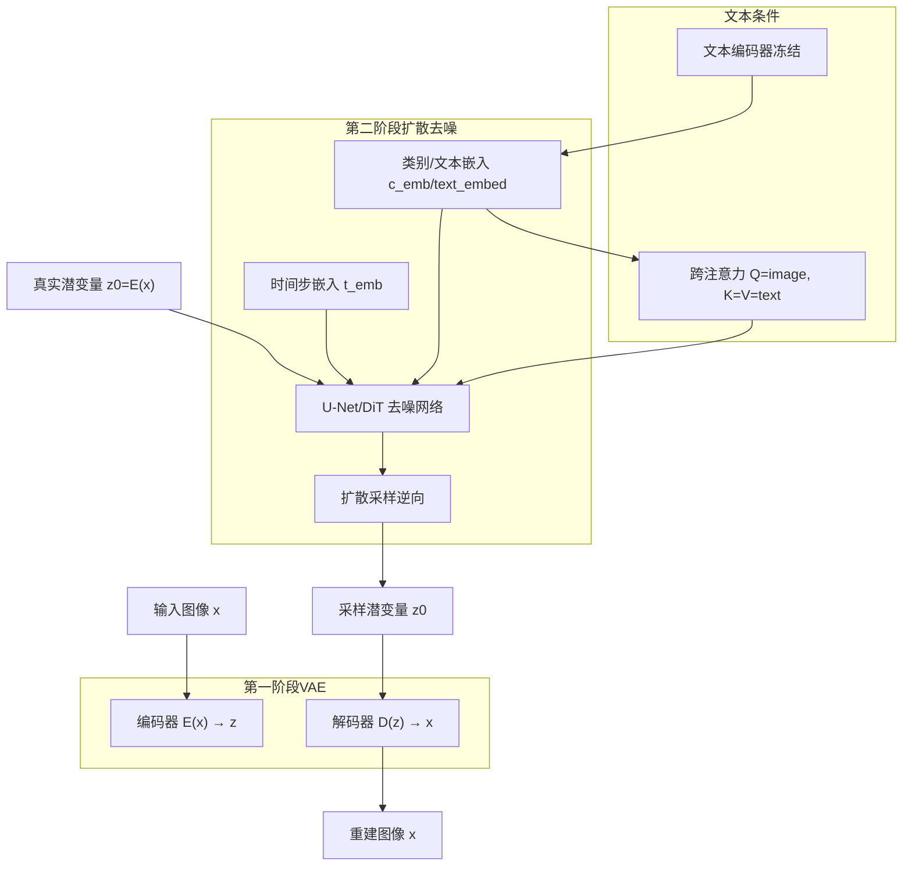
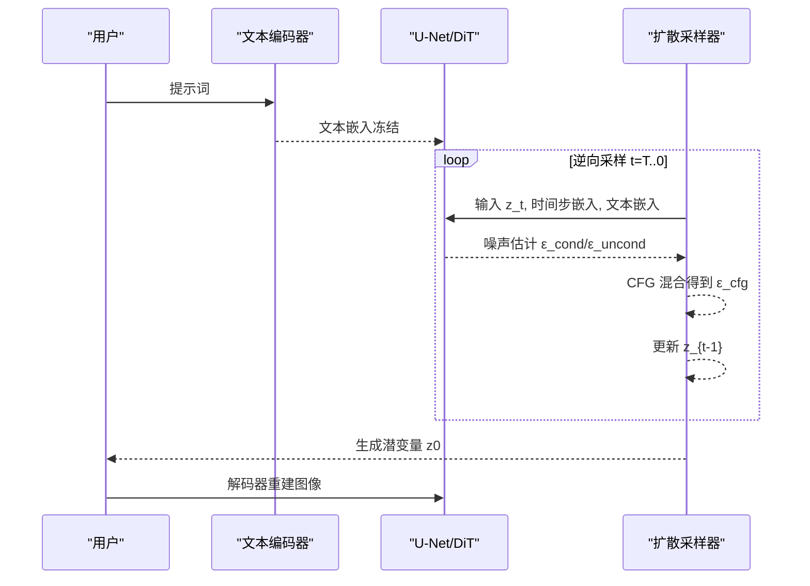
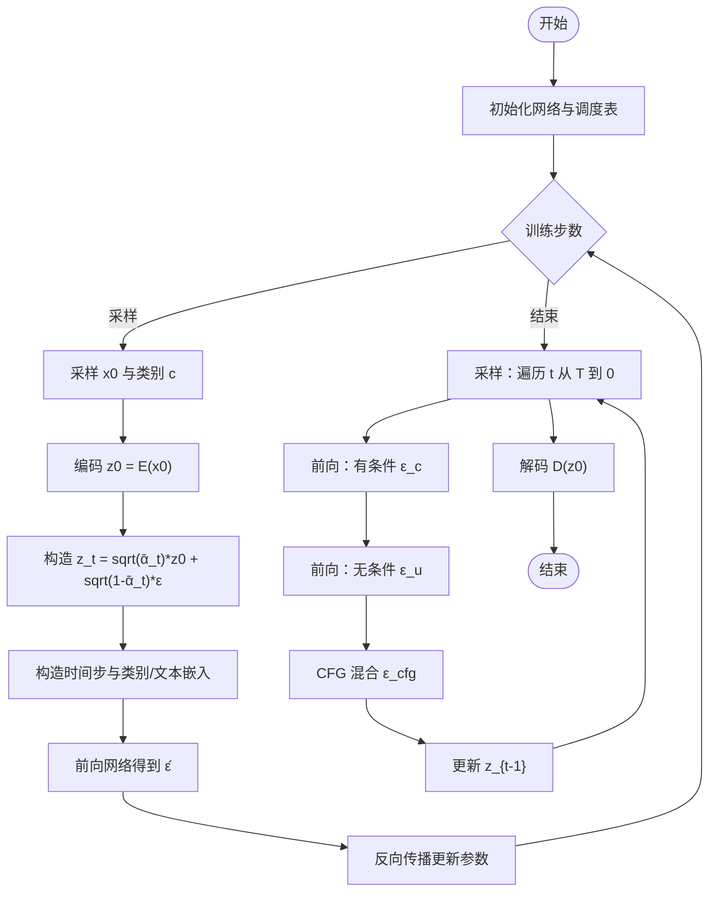
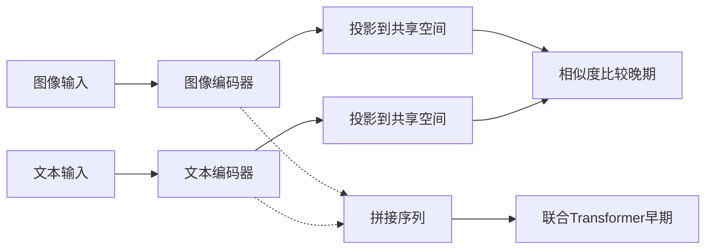
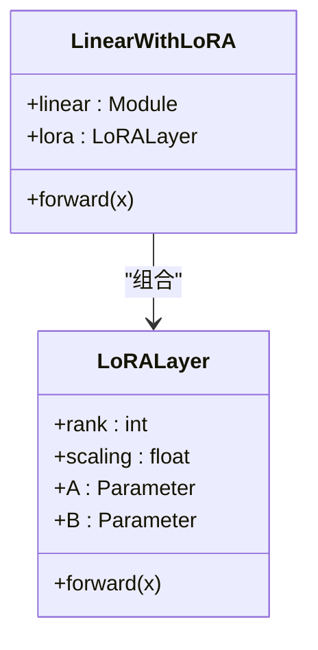
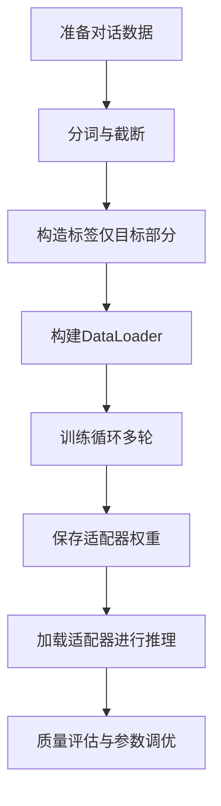
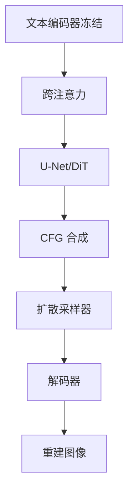

# 潜空间扩散与Stable Diffusion

<cite>
**本文引用的文件**
- [phases/08-generative-ai/07-latent-diffusion-stable-diffusion/docs/en.md](file://phases/08-generative-ai/07-latent-diffusion-stable-diffusion/docs/en.md)
- [phases/08-generative-ai/07-latent-diffusion-stable-diffusion/code/main.py](file://phases/08-generative-ai/07-latent-diffusion-stable-diffusion/code/main.py)
- [site/figures-genai-rl.js](file://site/figures-genai-rl.js)
- [site/figures-llms-systems.js](file://site/figures-llms-systems.js)
- [test_lora_demo.py](file://test_lora_demo.py)
- [finetune.py](file://finetune.py)
- [train_and_test.py](file://train_and_test.py)
- [phases/00-setup-and-tooling/12-debugging-and-profiling/docs/en.md](file://phases/00-setup-and-tooling/12-debugging-and-profiling/docs/en.md)
</cite>

## 目录
1. [引言](#引言)
2. [项目结构](#项目结构)
3. [核心组件](#核心组件)
4. [架构总览](#架构总览)
5. [组件详解](#组件详解)
6. [依赖关系分析](#依赖关系分析)
7. [性能考量](#性能考量)
8. [故障排查指南](#故障排查指南)
9. [结论](#结论)
10. [附录](#附录)

## 引言
本技术文档围绕潜空间扩散（Latent Diffusion, LDM）与Stable Diffusion展开，系统阐述其相较像素级扩散在计算效率与内存占用方面的显著优势，并深入解析Stable Diffusion的核心架构：VAE编码器将图像压缩至潜空间、U-Net在潜空间中执行去噪、CLIP文本编码器提供语义条件。文档还解释跨注意力机制如何实现从文本到图像的条件生成，覆盖模型权重配置、推理参数调优、生成质量控制、训练数据准备、预训练模型加载与自定义模型微调的完整流程，并给出性能优化建议与常见问题解决方案。

## 项目结构
本仓库与“潜空间扩散与Stable Diffusion”主题直接相关的知识与示例主要集中在以下位置：
- 教学文档与构建说明：phases/08-generative-ai/07-latent-diffusion-stable-diffusion/docs/en.md
- 可运行的最小化演示脚本：phases/08-generative-ai/07-latent-diffusion-stable-diffusion/code/main.py
- 动画与可视化素材：site/figures-genai-rl.js（扩散去噪过程）、site/figures-llms-systems.js（多模态融合）
- LoRA微调与适配器示例：test_lora_demo.py、finetune.py
- 训练与评估实践：train_and_test.py
- 调试与性能分析方法论：phases/00-setup-and-tooling/12-debugging-and-profiling/docs/en.md

**图表来源**
- [phases/08-generative-ai/07-latent-diffusion-stable-diffusion/docs/en.md](file://phases/08-generative-ai/07-latent-diffusion-stable-diffusion/docs/en.md)
- [phases/08-generative-ai/07-latent-diffusion-stable-diffusion/code/main.py](file://phases/08-generative-ai/07-latent-diffusion-stable-diffusion/code/main.py)
- [site/figures-genai-rl.js](file://site/figures-genai-rl.js)
- [site/figures-llms-systems.js](file://site/figures-llms-systems.js)
- [test_lora_demo.py](file://test_lora_demo.py)
- [finetune.py](file://finetune.py)
- [train_and_test.py](file://train_and_test.py)
- [phases/00-setup-and-tooling/12-debugging-and-profiling/docs/en.md](file://phases/00-setup-and-tooling/12-debugging-and-profiling/docs/en.md)

**章节来源**
- [phases/08-generative-ai/07-latent-diffusion-stable-diffusion/docs/en.md](file://phases/08-generative-ai/07-latent-diffusion-stable-diffusion/docs/en.md)
- [phases/08-generative-ai/07-latent-diffusion-stable-diffusion/code/main.py](file://phases/08-generative-ai/07-latent-diffusion-stable-diffusion/code/main.py)

## 核心组件
- 潜空间扩散（LDM）与Stable Diffusion两大阶段
  - 第一阶段（VAE）：编码器将像素空间压缩到低维潜空间；解码器将潜变量重建回像素空间。目标是将高分辨率的像素级扩散转换为低分辨率潜空间中的扩散，从而大幅降低计算与内存开销。
  - 第二阶段（扩散去噪）：在潜空间上训练U-Net（或DiT）对加噪潜变量进行去噪，采样得到的潜变量经解码器重建为最终图像。
- 文本条件生成
  - 冻结的文本编码器（如CLIP-L、OpenCLIP-H、T5-XXL等）将提示词映射为语义向量。
  - 通过跨注意力机制，文本嵌入作为K/V注入到U-Net的每一层，使图像特征能够关注文本语义，实现从文本到图像的条件生成。
- 分类/文本引导（Classifier-Free Guidance, CFG）
  - 训练时以一定概率丢弃类别标签（或文本），形成无条件样本；推理时同时前向有条件与无条件预测，按公式组合得到最终噪声估计，以调节条件强度。

**章节来源**
- [phases/08-generative-ai/07-latent-diffusion-stable-diffusion/docs/en.md](file://phases/08-generative-ai/07-latent-diffusion-stable-diffusion/docs/en.md)

## 架构总览
下图展示了Stable Diffusion两阶段与跨注意力条件注入的关键路径，以及扩散去噪的时序过程。

**图表来源**
- [phases/08-generative-ai/07-latent-diffusion-stable-diffusion/docs/en.md](file://phases/08-generative-ai/07-latent-diffusion-stable-diffusion/docs/en.md)
- [site/figures-genai-rl.js](file://site/figures-genai-rl.js)

## 组件详解

### 潜空间扩散与Stable Diffusion：两阶段与跨注意力
- 两阶段分离训练
  - VAE阶段：压缩比约为1/16（空间降采样8倍，通道调整），损失包含重建与感知一致性项，可选对抗项提升锐利度。
  - 扩散阶段：在潜空间上训练U-Net或DiT，损失与DDPM一致，仅数据域切换。
- 文本条件注入
  - 使用冻结文本编码器（如CLIP-L、OpenCLIP-H、T5-XXL）输出文本嵌入，通过跨注意力将文本信息注入到U-Net各层，Q来自图像特征，K/V来自文本嵌入。
- 分类/文本引导（CFG）
  - 训练时以固定概率丢弃标签；推理时分别计算有条件与无条件噪声估计，按比例混合，w越大条件越强但可能牺牲多样性。

**图表来源**
- [phases/08-generative-ai/07-latent-diffusion-stable-diffusion/docs/en.md](file://phases/08-generative-ai/07-latent-diffusion-stable-diffusion/docs/en.md)

**章节来源**
- [phases/08-generative-ai/07-latent-diffusion-stable-diffusion/docs/en.md](file://phases/08-generative-ai/07-latent-diffusion-stable-diffusion/docs/en.md)

### 最小化演示：潜空间扩散与CFG
该脚本演示了在1D“伪VAE”（线性映射）上的DDPM训练与采样，验证相同扩散损失在潜空间同样有效，并展示CFG如何在不重训的情况下调节条件强度。

**图表来源**
- [phases/08-generative-ai/07-latent-diffusion-stable-diffusion/code/main.py](file://phases/08-generative-ai/07-latent-diffusion-stable-diffusion/code/main.py)

**章节来源**
- [phases/08-generative-ai/07-latent-diffusion-stable-diffusion/code/main.py](file://phases/08-generative-ai/07-latent-diffusion-stable-diffusion/code/main.py)

### 多模态融合与跨注意力：文本到图像的桥梁
多模态融合图示清晰展示了两种主流融合方式：
- 晚期融合（Late Fusion）：图像与文本分别编码到共享空间，最后比较相似度（如CLIP对比学习）。
- 早期融合（Early Fusion）：将图像与文本token拼接为一个序列，由Transformer联合建模，允许两模态自始至终相互关注。

**图表来源**
- [site/figures-llms-systems.js](file://site/figures-llms-systems.js)

**章节来源**
- [site/figures-llms-systems.js](file://site/figures-llms-systems.js)

### LoRA微调与适配器：高效定制化
LoRA通过在全连接层上添加低秩分解矩阵实现参数高效微调，冻结主权重，仅训练低秩矩阵，显著降低显存与计算开销。示例脚本展示了LoRA模块的定义与应用方式。

**图表来源**
- [test_lora_demo.py](file://test_lora_demo.py)

**章节来源**
- [test_lora_demo.py](file://test_lora_demo.py)

### 微调与评测：从数据准备到推理
- 数据准备与标签策略：示例脚本展示了如何对对话数据进行分词、构造标签（仅对目标部分计算损失），并使用DataLoader进行批处理训练。
- 微调流程：使用预训练模型与AdamW优化器，在数据集上进行多轮训练，保存适配器权重以便后续推理复用。
- 推理与质量控制：通过CFG、采样步数、分辨率、负向提示词等参数组合，结合可视化与指标评估生成质量。

**图表来源**
- [train_and_test.py](file://train_and_test.py)
- [finetune.py](file://finetune.py)

**章节来源**
- [train_and_test.py](file://train_and_test.py)
- [finetune.py](file://finetune.py)

## 依赖关系分析
- 组件耦合与职责
  - VAE与扩散模型在概念上分离训练，VAE负责压缩与重建，扩散模型专注于去噪；二者通过潜变量接口耦合。
  - 文本编码器与U-Net通过跨注意力耦合，文本嵌入仅作为条件注入，不参与U-Net主干的梯度更新（冻结）。
  - CFG在推理阶段对U-Net两次前向进行组合，不改变模型结构，仅影响采样路径。
- 外部依赖与集成点
  - 文本编码器（CLIP、OpenCLIP、T5）版本与维度需与所选模型匹配，否则会导致提示词对齐质量下降。
  - 不同Stable Diffusion变体（SDXL、SD3、Flux）使用不同的VAE潜空间，LoRA等权重不可混用。
- 潜在环路与注意事项
  - 文本条件注入不应引入额外可训练参数（冻结文本编码器），避免训练不稳定。
  - CFG超参过高会导致图像过饱和与细节丢失，应在合理范围内（如3~7）选择。

**图表来源**
- [phases/08-generative-ai/07-latent-diffusion-stable-diffusion/docs/en.md](file://phases/08-generative-ai/07-latent-diffusion-stable-diffusion/docs/en.md)

**章节来源**
- [phases/08-generative-ai/07-latent-diffusion-stable-diffusion/docs/en.md](file://phases/08-generative-ai/07-latent-diffusion-stable-diffusion/docs/en.md)

## 性能考量
- 计算效率与内存占用
  - 将扩散从像素空间迁移到潜空间（如从512×512降到64×64）可将计算量降至约1/16，显著降低每步FLOPs与显存占用。
  - 对于大参数模型（如Flux.1-dev 12B），可通过分阶段加载、4位量化与CPU卸载等手段在消费级GPU上运行。
- 采样步数与CFG
  - 更少的采样步数可显著加速推理，但可能牺牲细节；CFG用于平衡提示词遵循度与多样性。
- 数据与训练
  - 使用高质量数据集与合理的标签策略（如仅对目标部分计算损失）有助于提升收敛稳定性与生成质量。
  - LoRA等高效微调方法可在有限资源下快速定制模型。

[本节为通用性能讨论，无需列出具体文件来源]

## 故障排查指南
- 常见问题与对策
  - VAE尺度不匹配：忘记缩放因子会导致潜变量方差异常，需确保使用正确的缩放常数。
  - 文本编码器配置错误：SD3需启用T5-XXL并保证足够token长度，否则提示词对齐质量会明显下降。
  - 潜空间混用：不同模型（SDXL、SD3、Flux）使用不同VAE，LoRA权重不可混用。
  - CFG设置不当：过高的CFG会导致图像过饱和与细节丢失，建议在3~7之间选择。
  - 负向提示泄漏：空负向提示默认为null token，与实际的ε_uncond并不相同，需明确配置。
- 调试与性能分析
  - 训练前检查形状与范围，前几步记录损失、输出与梯度，确认无NaN且数值合理。
  - 使用TensorBoard可视化损失与学习率，定位过拟合或欠拟合。
  - 使用性能剖析工具识别数据加载、前向与反向耗时，必要时进行内存追踪。

**章节来源**
- [phases/08-generative-ai/07-latent-diffusion-stable-diffusion/docs/en.md](file://phases/08-generative-ai/07-latent-diffusion-stable-diffusion/docs/en.md)
- [phases/00-setup-and-tooling/12-debugging-and-profiling/docs/en.md](file://phases/00-setup-and-tooling/12-debugging-and-profiling/docs/en.md)

## 结论
潜空间扩散通过将扩散过程迁移至低维潜空间，实现了计算效率与内存占用的显著提升；Stable Diffusion在此基础上引入冻结文本编码器与跨注意力机制，使文本成为可控的语义条件。通过CFG、LoRA微调与合理的数据准备策略，可以在保持高质量的同时实现高效的定制与部署。实践中应重视文本编码器配置、潜空间一致性与CFG参数选择，配合系统化的调试与性能分析方法，获得稳定可靠的生成效果。

[本节为总结性内容，无需列出具体文件来源]

## 附录
- 关键术语速查
  - 第一阶段：VAE编码器/解码器，负责将高分辨率像素压缩到低维潜空间。
  - 第二阶段：U-Net/DiT在潜空间中进行扩散去噪。
  - CFG：分类/文本引导，通过有条件与无条件噪声估计的混合调节条件强度。
  - 跨注意力：文本嵌入作为K/V注入U-Net，使图像特征关注语义信息。
  - DiT/MMDiT：将U-Net替换为基于补丁的Transformer，具备更好的扩展性。
  - VAE缩放因子：将潜变量归一化至单位方差，确保扩散训练稳定。

**章节来源**
- [phases/08-generative-ai/07-latent-diffusion-stable-diffusion/docs/en.md](file://phases/08-generative-ai/07-latent-diffusion-stable-diffusion/docs/en.md)