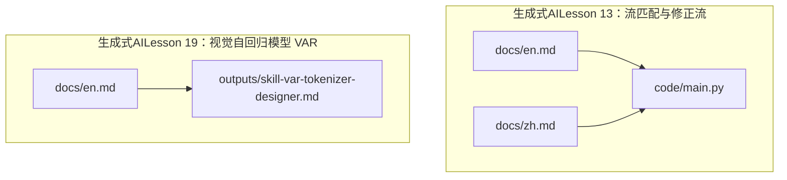
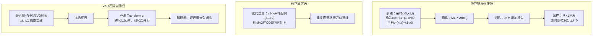
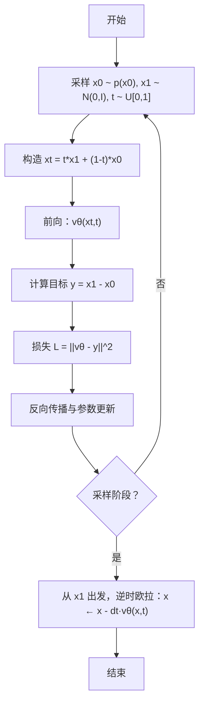
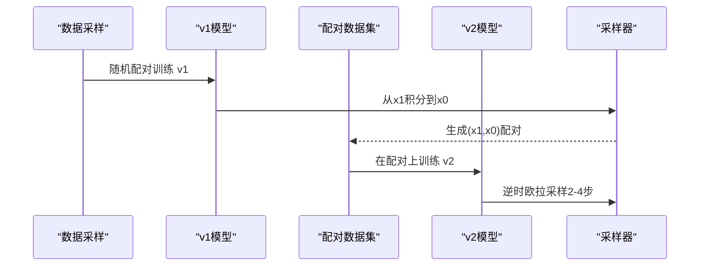
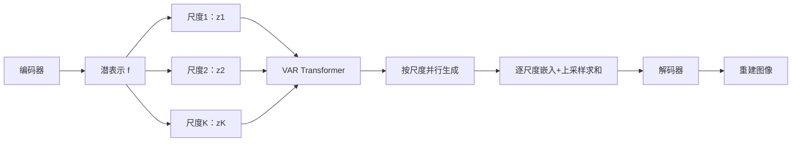
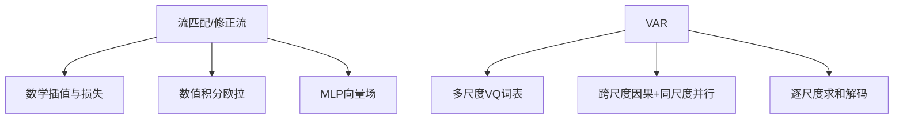

# 新兴生成技术

<cite>
**本文引用的文件**
- [phases/08-generative-ai/13-flow-matching-rectified-flows/docs/en.md](file://phases/08-generative-ai/13-flow-matching-rectified-flows/docs/en.md)
- [phases/08-generative-ai/13-flow-matching-rectified-flows/docs/zh.md](file://phases/08-generative-ai/13-flow-matching-rectified-flows/docs/zh.md)
- [phases/08-generative-ai/13-flow-matching-rectified-flows/code/main.py](file://phases/08-generative-ai/13-flow-matching-rectified-flows/code/main.py)
- [phases/08-generative-ai/19-visual-autoregressive-var/docs/en.md](file://phases/08-generative-ai/19-visual-autoregressive-var/docs/en.md)
- [phases/08-generative-ai/19-visual-autoregressive-var/outputs/skill-var-tokenizer-designer.md](file://phases/08-generative-ai/19-visual-autoregressive-var/outputs/skill-var-tokenizer-designer.md)
</cite>

## 目录
1. [引言](#引言)
2. [项目结构](#项目结构)
3. [核心组件](#核心组件)
4. [架构总览](#架构总览)
5. [详细组件分析](#详细组件分析)
6. [依赖关系分析](#依赖关系分析)
7. [性能考量](#性能考量)
8. [故障排查指南](#故障排查指南)
9. [结论](#结论)
10. [附录](#附录)

## 引言
本文件系统性梳理三类前沿生成技术：流匹配（Flow Matching）、修正流（Rectified Flow）与视觉自回归模型（Visual Autoregressive Models, VAR）。我们将从数学原理、算法实现、训练与采样流程、对比优势与工程实践等维度展开，并结合仓库中的教学文档与最小实现代码，帮助读者快速掌握这些技术的核心思想与落地方式。

## 项目结构
本仓库围绕“生成式AI”主题组织内容，相关章节位于“phases/08-generative-ai”。本次文档聚焦两类前沿技术：
- 流匹配与修正流：位于 lesson 13，包含英文/中文文档与最小实现脚本。
- 视觉自回归模型（VAR）：位于 lesson 19，包含英文文档与“多尺度词表设计”技能输出。

图示来源
- [phases/08-generative-ai/13-flow-matching-rectified-flows/docs/en.md:1-177](file://phases/08-generative-ai/13-flow-matching-rectified-flows/docs/en.md#L1-L177)
- [phases/08-generative-ai/13-flow-matching-rectified-flows/docs/zh.md:1-177](file://phases/08-generative-ai/13-flow-matching-rectified-flows/docs/zh.md#L1-L177)
- [phases/08-generative-ai/13-flow-matching-rectified-flows/code/main.py:1-149](file://phases/08-generative-ai/13-flow-matching-rectified-flows/code/main.py#L1-L149)
- [phases/08-generative-ai/19-visual-autoregressive-var/docs/en.md:1-139](file://phases/08-generative-ai/19-visual-autoregressive-var/docs/en.md#L1-L139)
- [phases/08-generative-ai/19-visual-autoregressive-var/outputs/skill-var-tokenizer-designer.md:1-28](file://phases/08-generative-ai/19-visual-autoregressive-var/outputs/skill-var-tokenizer-designer.md#L1-L28)

章节来源
- [phases/08-generative-ai/13-flow-matching-rectified-flows/docs/en.md:1-177](file://phases/08-generative-ai/13-flow-matching-rectified-flows/docs/en.md#L1-L177)
- [phases/08-generative-ai/13-flow-matching-rectified-flows/docs/zh.md:1-177](file://phases/08-generative-ai/13-flow-matching-rectified-flows/docs/zh.md#L1-L177)
- [phases/08-generative-ai/13-flow-matching-rectified-flows/code/main.py:1-149](file://phases/08-generative-ai/13-flow-matching-rectified-flows/code/main.py#L1-L149)
- [phases/08-generative-ai/19-visual-autoregressive-var/docs/en.md:1-139](file://phases/08-generative-ai/19-visual-autoregressive-var/docs/en.md#L1-L139)
- [phases/08-generative-ai/19-visual-autoregressive-var/outputs/skill-var-tokenizer-designer.md:1-28](file://phases/08-generative-ai/19-visual-autoregressive-var/outputs/skill-var-tokenizer-designer.md#L1-L28)

## 核心组件
- 流匹配与修正流（Lesson 13）
  - 数学目标：在直线插值路径上拟合速度场 v_θ(x,t)，训练无需解ODE，推理仅需少量欧拉步。
  - 实现要点：MLP向量场、直线插值目标 (x1 - x0)、欧拉采样器、可选重流（reflow）迭代。
  - 工程产出：最小一维流匹配实现，支持1/2/4/8/20步采样对比。
- 视觉自回归模型（VAR，Lesson 19）
  - 多尺度离散词表：逐分辨率重建残差，训练一次冻结，生成时按尺度自回归预测。
  - 生成机制：按尺度顺序并行生成，因果注意力仅跨尺度，不引入空间内自回归偏差。
  - 技能输出：多尺度词表设计指南（规模数量、码本大小、残差共享、解码器、位置嵌入）。

章节来源
- [phases/08-generative-ai/13-flow-matching-rectified-flows/docs/en.md:18-111](file://phases/08-generative-ai/13-flow-matching-rectified-flows/docs/en.md#L18-L111)
- [phases/08-generative-ai/13-flow-matching-rectified-flows/code/main.py:25-107](file://phases/08-generative-ai/13-flow-matching-rectified-flows/code/main.py#L25-L107)
- [phases/08-generative-ai/19-visual-autoregressive-var/docs/en.md:22-98](file://phases/08-generative-ai/19-visual-autoregressive-var/docs/en.md#L22-L98)
- [phases/08-generative-ai/19-visual-autoregressive-var/outputs/skill-var-tokenizer-designer.md:10-27](file://phases/08-generative-ai/19-visual-autoregressive-var/outputs/skill-var-tokenizer-designer.md#L10-L27)

## 架构总览
下图给出两类技术的高层流程：流匹配/修正流的训练与采样，以及VAR的多尺度词表与生成流程。

图示来源
- [phases/08-generative-ai/13-flow-matching-rectified-flows/docs/en.md:22-71](file://phases/08-generative-ai/13-flow-matching-rectified-flows/docs/en.md#L22-L71)
- [phases/08-generative-ai/13-flow-matching-rectified-flows/code/main.py:88-107](file://phases/08-generative-ai/13-flow-matching-rectified-flows/code/main.py#L88-L107)
- [phases/08-generative-ai/19-visual-autoregressive-var/docs/en.md:22-69](file://phases/08-generative-ai/19-visual-autoregressive-var/docs/en.md#L22-L69)

## 详细组件分析

### 流匹配与修正流（Score-based Flow Matching 与 Noise Conditional Flow Matching）
- 数学基础
  - 直线插值：x_t = t·x_1 + (1−t)·x_0，导数 dx_t/dt = x_1 − x_0。
  - 条件流匹配损失：期望均方误差 L = E ||v_θ(x_t,t) − (x_1 − x_0)||^2。
  - 推理：从 x_1 出发，逆时欧拉步 v_θ(x,t) 下降到 t=0。
- 修正流（Rectified Flow）
  - 通过重流迭代：先用 v_1 采样配对 (x_1,x_0)，再在这些配对上训练 v_2，使直线插值更平滑，最终可用2-4步达到高质量。
- 实现与训练
  - 网络：输入 [x, t, t^2, sin(2πt), cos(2πt)] 的小型MLP，输出标量速度场。
  - 训练：随机采样 (x0,x1,t)，构造 x_t，目标为 x1−x0，反向传播更新。
  - 采样：固定步数的逆时欧拉积分，对比1/2/4/8/20步质量。
- 与扩散模型的关系
  - 高斯条件插值下的流匹配与扩散在代数上等价，但流匹配目标更清晰、损失几何更好、可探索非高斯插值。

图示来源
- [phases/08-generative-ai/13-flow-matching-rectified-flows/docs/en.md:36-52](file://phases/08-generative-ai/13-flow-matching-rectified-flows/docs/en.md#L36-L52)
- [phases/08-generative-ai/13-flow-matching-rectified-flows/code/main.py:88-107](file://phases/08-generative-ai/13-flow-matching-rectified-flows/code/main.py#L88-L107)

章节来源
- [phases/08-generative-ai/13-flow-matching-rectified-flows/docs/en.md:10-71](file://phases/08-generative-ai/13-flow-matching-rectified-flows/docs/en.md#L10-L71)
- [phases/08-generative-ai/13-flow-matching-rectified-flows/docs/zh.md:10-71](file://phases/08-generative-ai/13-flow-matching-rectified-flows/docs/zh.md#L10-L71)
- [phases/08-generative-ai/13-flow-matching-rectified-flows/code/main.py:25-107](file://phases/08-generative-ai/13-flow-matching-rectified-flows/code/main.py#L25-L107)

### Rectified Flows（修正流）的训练与采样
- 迭代重流流程
  - 第一轮：随机配对训练 v1。
  - 第二轮：对每条轨迹从 x1 到 x0 积分采样配对 (x1,x0)，在这些配对上训练 v2。
  - 可重复多次，直到路径足够直线，采样步数降至2-4步。
- 采样序列（以两轮重流为例）

图示来源
- [phases/08-generative-ai/13-flow-matching-rectified-flows/docs/en.md:54-63](file://phases/08-generative-ai/13-flow-matching-rectified-flows/docs/en.md#L54-L63)

章节来源
- [phases/08-generative-ai/13-flow-matching-rectified-flows/docs/en.md:54-63](file://phases/08-generative-ai/13-flow-matching-rectified-flows/docs/en.md#L54-L63)

### Visual Autoregressive Models（VAR）：自回归生成机制
- 多尺度离散词表
  - 输入图像经编码器得到潜表示 f，逐尺度（1×1, 2×2, …, H/p×W/p）进行VQ量化，得到 token 网格序列。
  - 残差VQ：逐尺度捕获低尺度未覆盖的细节，解码器为所有尺度嵌入求和并重建图像。
- 生成流程
  - 训练：在每个尺度 k，基于前尺度上下文预测 z_k，交叉熵损失。
  - 推理：按尺度顺序并行生成，最后逐尺度上采样并求和解码。
- 注意力与因果
  - 跨尺度因果：位置 (k,i,j) 可以看到所有 1..k 尺度的内容。
  - 同尺度并行：同一尺度内的所有位置在同一前向中被预测，避免空间内自回归。

图示来源
- [phases/08-generative-ai/19-visual-autoregressive-var/docs/en.md:22-69](file://phases/08-generative-ai/19-visual-autoregressive-var/docs/en.md#L22-L69)

章节来源
- [phases/08-generative-ai/19-visual-autoregressive-var/docs/en.md:22-98](file://phases/08-generative-ai/19-visual-autoregressive-var/docs/en.md#L22-L98)

### VAR 的 Tokenizer-free 变体与应用前景
- Tokenizer-free 方向
  - VAR 的核心是“按尺度自回归”，而非“按像素/子词自回归”。因此，理论上可将连续像素或特征直接作为“尺度内”的预测对象，从而跳过离散VQ词表，实现“tokenizer-free”的VAR。
  - 该思路与“连续空间的自回归”思想一致：将像素值或特征视为“尺度内”的序列化预测目标，注意力仍遵循跨尺度因果与同尺度并行。
- 应用价值
  - 更高的分辨率与更细粒度的细节建模。
  - 降低离散化误差与码本容量需求。
  - 与现代视觉Transformer的融合潜力更大（例如将像素/特征投影到统一空间后进行尺度内并行预测）。

章节来源
- [phases/08-generative-ai/19-visual-autoregressive-var/docs/en.md:16-20](file://phases/08-generative-ai/19-visual-autoregressive-var/docs/en.md#L16-L20)
- [phases/08-generative-ai/19-visual-autoregressive-var/docs/en.md:69-76](file://phases/08-generative-ai/19-visual-autoregressive-var/docs/en.md#L69-L76)

## 依赖关系分析
- 流匹配/修正流
  - 依赖：随机数生成、数值积分（欧拉法）、MLP前向与反向。
  - 与扩散模型的等价性：在高斯插值下，二者代数等价，但流匹配损失更清晰、几何更优。
- VAR
  - 依赖：多尺度VQ词表（训练一次并冻结）、Transformer注意力掩码（跨尺度因果、同尺度并行）、解码器求和重建。

图示来源
- [phases/08-generative-ai/13-flow-matching-rectified-flows/docs/en.md:73-77](file://phases/08-generative-ai/13-flow-matching-rectified-flows/docs/en.md#L73-L77)
- [phases/08-generative-ai/19-visual-autoregressive-var/docs/en.md:44-69](file://phases/08-generative-ai/19-visual-autoregressive-var/docs/en.md#L44-L69)

章节来源
- [phases/08-generative-ai/13-flow-matching-rectified-flows/docs/en.md:73-77](file://phases/08-generative-ai/13-flow-matching-rectified-flows/docs/en.md#L73-L77)
- [phases/08-generative-ai/19-visual-autoregressive-var/docs/en.md:44-69](file://phases/08-generative-ai/19-visual-autoregressive-var/docs/en.md#L44-L69)

## 性能考量
- 流匹配/修正流
  - 训练：无需解ODE，实现简单；损失几何更稳定；推理可用极少数步数达到高质量。
  - 修正流：通过重流迭代进一步降低采样步数，适合实时场景。
- VAR
  - 生成长度为 log-scale（按尺度计），远小于按像素/token线性增长；同尺度内并行显著提升吞吐。
  - 多尺度残差重建在较低步数内即可逼近高质量，适合高分辨率合成。

章节来源
- [phases/08-generative-ai/13-flow-matching-rectified-flows/docs/en.md:65-71](file://phases/08-generative-ai/13-flow-matching-rectified-flows/docs/en.md#L65-L71)
- [phases/08-generative-ai/19-visual-autoregressive-var/docs/en.md:71-76](file://phases/08-generative-ai/19-visual-autoregressive-var/docs/en.md#L71-L76)

## 故障排查指南
- 时间参数化
  - 流匹配使用 t∈[0,1]，t=0对应数据、t=1对应噪声；与扩散模型的 t∈[0,T] 不同，注意方向与尺度差异。
- 调度与采样分布
  - 直线插值是标准“流匹配调度”，也可采用余弦或logit-normal t采样以改善尺度覆盖。
- 重流成本
  - 重流需要为每个样本进行完整推理生成配对，仅在确需1-2步推理时启用。
- 无分类器引导（CFG）
  - 在流匹配中使用 v_CFG = (1+w)v_cond − w v_uncond，替换 ε 为 v 即可。

章节来源
- [phases/08-generative-ai/13-flow-matching-rectified-flows/docs/en.md:112-117](file://phases/08-generative-ai/13-flow-matching-rectified-flows/docs/en.md#L112-L117)

## 结论
- 流匹配与修正流通过“直线插值 + 速度场拟合”将扩散的弯曲路径转为直路，显著减少采样步数与计算开销，已在2024年主流模型中落地。
- VAR以“按尺度自回归”替代传统像素/词表自回归，实现跨尺度因果与同尺度并行，具备更优的扩展性与推理效率。
- 两种技术共同代表了生成模型从“曲线路径”到“直线路径”、从“线性序列”到“尺度金字塔”的范式演进，是面向高分辨率、低延迟与高可扩展性的关键技术方向。

## 附录
- 实现与训练要点（来自仓库代码）
  - 流匹配：MLP网络、输入扩展项（含周期项）、欧拉采样、多步质量对比。
  - VAR：多尺度残差VQ、跨尺度因果注意力、同尺度并行生成、解码器求和重建。

章节来源
- [phases/08-generative-ai/13-flow-matching-rectified-flows/code/main.py:25-107](file://phases/08-generative-ai/13-flow-matching-rectified-flows/code/main.py#L25-L107)
- [phases/08-generative-ai/19-visual-autoregressive-var/docs/en.md:22-69](file://phases/08-generative-ai/19-visual-autoregressive-var/docs/en.md#L22-L69)