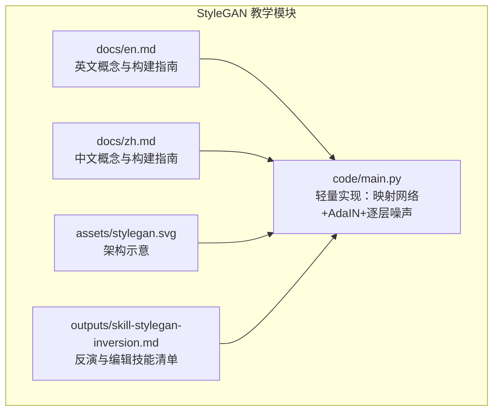
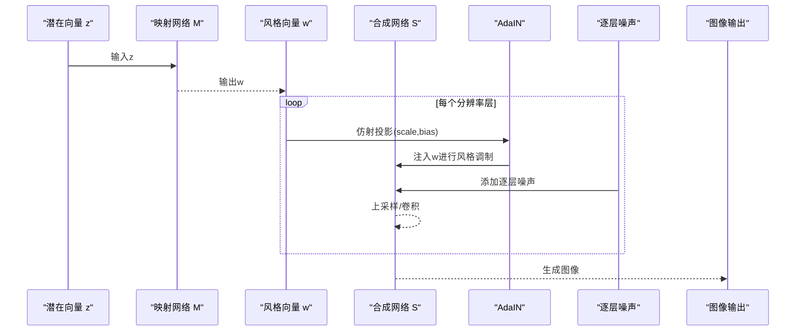
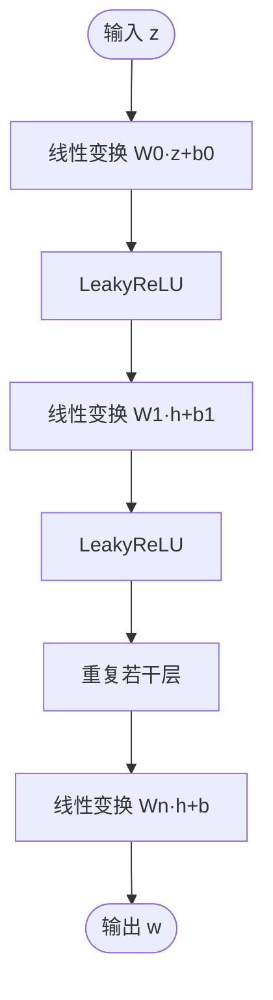
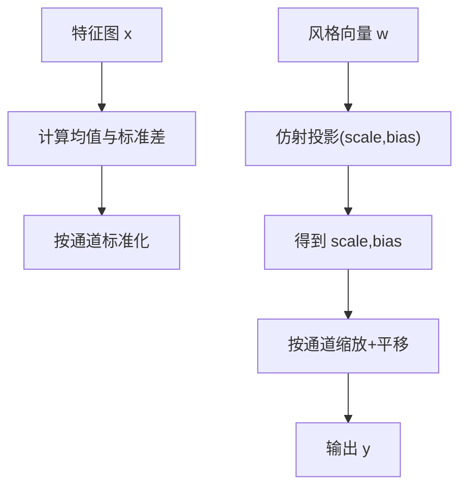
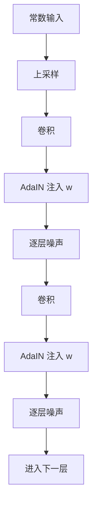
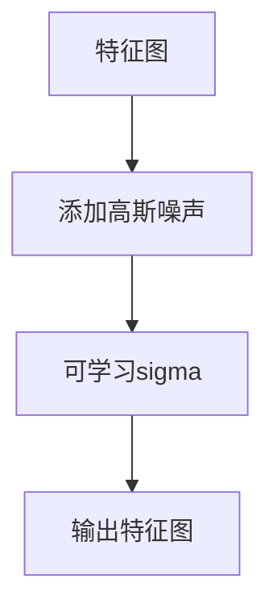
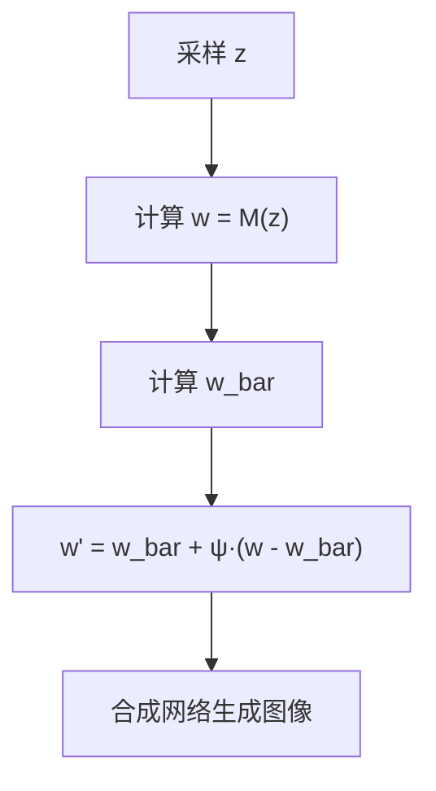
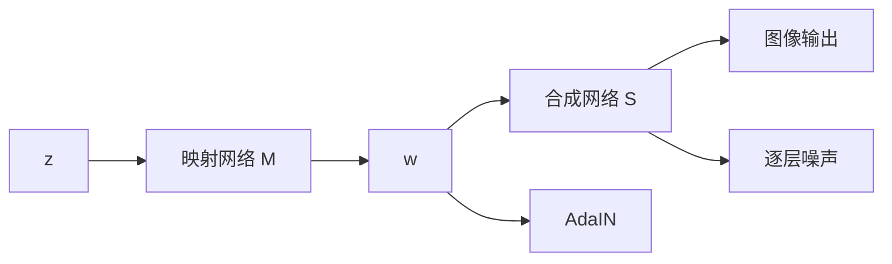

# StyleGAN架构与技术

<cite>
**本文引用的文件**
- [main.py](file://phases/08-generative-ai/05-stylegan/code/main.py)
- [StyleGAN英文文档](file://phases/08-generative-ai/05-stylegan/docs/en.md)
- [StyleGAN中文文档](file://phases/08-generative-ai/05-stylegan/docs/zh.md)
- [StyleGAN反演技能](file://phases/08-generative-ai/05-stylegan/outputs/skill-stylegan-inversion.md)
- [StyleGAN示意图](file://phases/08-generative-ai/05-stylegan/assets/stylegan.svg)
</cite>

## 目录
1. [引言](#引言)
2. [项目结构](#项目结构)
3. [核心组件](#核心组件)
4. [架构总览](#架构总览)
5. [详细组件分析](#详细组件分析)
6. [依赖关系分析](#依赖关系分析)
7. [性能考量](#性能考量)
8. [故障排查指南](#故障排查指南)
9. [结论](#结论)
10. [附录](#附录)

## 引言
本文件围绕StyleGAN的革命性架构创新展开，系统梳理其三大关键要素：样式向量引入（z→w映射）、风格混合机制（AdaIN）与路径长度正则化，并结合渐进式增长训练策略，解释如何从低分辨率逐步提升到高分辨率生成。同时，文档给出完整实现代码的结构化解读、训练流程与生成质量优化建议，深入阐述风格空间（W/W+/StyleSpace）的操作方法（连续性、解耦性、交互性），并覆盖StyleGAN在人脸生成、图像编辑与风格控制等领域的应用，最后讨论其局限性与后续版本发展趋势。

## 项目结构
StyleGAN教学仓库采用“文档+代码+示意图+技能输出”的组织方式，便于学习者从概念到实践逐步掌握。

图表来源
- [StyleGAN英文文档](file://phases/08-generative-ai/05-stylegan/docs/en.md)
- [StyleGAN中文文档](file://phases/08-generative-ai/05-stylegan/docs/zh.md)
- [main.py](file://phases/08-generative-ai/05-stylegan/code/main.py)
- [StyleGAN示意图](file://phases/08-generative-ai/05-stylegan/assets/stylegan.svg)
- [StyleGAN反演技能](file://phases/08-generative-ai/05-stylegan/outputs/skill-stylegan-inversion.md)

章节来源
- [StyleGAN英文文档](file://phases/08-generative-ai/05-stylegan/docs/en.md)
- [StyleGAN中文文档](file://phases/08-generative-ai/05-stylegan/docs/zh.md)
- [main.py](file://phases/08-generative-ai/05-stylegan/code/main.py)

## 核心组件
- 映射网络（Mapping Network）
  - 将来自先验分布的潜在向量z映射到W空间，形成风格向量w。该网络通常为深层MLP，将z的几何结构与数据统计解耦，使W空间具备粗粒度风格（如姿态、身份）与细粒度风格（如光照、颜色）的大致正交性。
- 合成网络（Synthesis Network）
  - 从常数输入开始，按分辨率逐步上采样与卷积，每层通过AdaIN注入w，再叠加逐层噪声，最终生成目标分辨率的图像。
- AdaIN（自适应实例归一化）
  - 对特征图进行按通道归一化，随后由w的仿射投影得到尺度与偏置，实现风格调制。该机制将全局风格与局部细节分离，显著提升编辑能力与视觉质量。
- 逐层噪声（Per-layer Noise）
  - 在每层特征图上添加独立的高斯噪声，控制随机细节（如皮肤纹理、发丝），避免影响整体结构。
- 截断技巧（Truncation Trick）
  - 在推理阶段，通过对w进行压缩（ψ<1）提升生成质量，牺牲一定多样性。该技巧是生产环境中的关键安全旋钮。

章节来源
- [StyleGAN英文文档](file://phases/08-generative-ai/05-stylegan/docs/en.md)
- [StyleGAN中文文档](file://phases/08-generative-ai/05-stylegan/docs/zh.md)
- [main.py](file://phases/08-generative-ai/05-stylegan/code/main.py)

## 架构总览
StyleGAN的总体流程如下：先由映射网络将z转换为w，再在合成网络的每一层通过AdaIN注入w并叠加噪声，最终生成图像。该流程实现了“全局风格由w主导、细节由噪声控制”的解耦。

图表来源
- [StyleGAN英文文档](file://phases/08-generative-ai/05-stylegan/docs/en.md)
- [StyleGAN中文文档](file://phases/08-generative-ai/05-stylegan/docs/zh.md)
- [main.py](file://phases/08-generative-ai/05-stylegan/code/main.py)

## 详细组件分析

### 映射网络（Mapping Network）
- 结构要点
  - 多层全连接网络（MLP），输入维度z_dim，输出维度w_dim，层数通常为8层左右。
  - 激活函数采用带负斜率的LeakyReLU，确保梯度稳定传播。
- 数据流
  - 输入z经逐层矩阵乘法与偏置加法，随后非线性变换，最终得到w。
- 初始化
  - 权重矩阵按高斯分布初始化，偏置初始化为0，保证初始状态稳定。

图表来源
- [main.py](file://phases/08-generative-ai/05-stylegan/code/main.py)

章节来源
- [main.py](file://phases/08-generative-ai/05-stylegan/code/main.py)

### AdaIN（自适应实例归一化）
- 原理
  - 对特征图按通道计算均值与标准差，进行标准化；随后由w的仿射投影得到scale与bias，对标准化后的特征进行缩放与平移。
- 作用
  - 将风格信息（一阶与二阶统计）注入到特征图，实现“风格调制”，使w在不同分辨率层对图像风格产生可控影响。
- 数学表达
  - AdaIN(x, y_scale, y_bias) = y_scale · (x - mean(x)) / std(x) + y_bias，其中y_scale、y_bias由w线性投影而来。

图表来源
- [StyleGAN英文文档](file://phases/08-generative-ai/05-stylegan/docs/en.md)
- [StyleGAN中文文档](file://phases/08-generative-ai/05-stylegan/docs/zh.md)
- [main.py](file://phases/08-generative-ai/05-stylegan/code/main.py)

章节来源
- [StyleGAN英文文档](file://phases/08-generative-ai/05-stylegan/docs/en.md)
- [StyleGAN中文文档](file://phases/08-generative-ai/05-stylegan/docs/zh.md)
- [main.py](file://phases/08-generative-ai/05-stylegan/code/main.py)

### 合成网络（Synthesis Network）
- 结构要点
  - 从常数向量开始，按分辨率逐步上采样与卷积，每层包含两次卷积，中间穿插AdaIN与逐层噪声。
  - 分辨率序列：4、8、16、32、64、128、256、512、1024（具体取决于模型规模）。
- 数据流
  - 每层先进行上采样，再卷积，随后AdaIN注入w，再添加噪声，再次卷积与AdaIN，最后输出到下一层。
- 参数初始化
  - 合成网络的权重矩阵按高斯分布初始化，scale与bias按高斯分布初始化，确保风格调制的灵活性。

图表来源
- [StyleGAN英文文档](file://phases/08-generative-ai/05-stylegan/docs/en.md)
- [StyleGAN中文文档](file://phases/08-generative-ai/05-stylegan/docs/zh.md)
- [main.py](file://phases/08-generative-ai/05-stylegan/code/main.py)

章节来源
- [StyleGAN英文文档](file://phases/08-generative-ai/05-stylegan/docs/en.md)
- [StyleGAN中文文档](file://phases/08-generative-ai/05-stylegan/docs/zh.md)
- [main.py](file://phases/08-generative-ai/05-stylegan/code/main.py)

### 逐层噪声（Per-layer Noise）
- 作用
  - 控制随机细节（如皮肤纹理、发丝），不影响整体结构，提升生成多样性与自然度。
- 实现
  - 在每层特征图上添加独立的高斯噪声，噪声幅度由可学习的sigma控制。

图表来源
- [StyleGAN英文文档](file://phases/08-generative-ai/05-stylegan/docs/en.md)
- [StyleGAN中文文档](file://phases/08-generative-ai/05-stylegan/docs/zh.md)
- [main.py](file://phases/08-generative-ai/05-stylegan/code/main.py)

章节来源
- [StyleGAN英文文档](file://phases/08-generative-ai/05-stylegan/docs/en.md)
- [StyleGAN中文文档](file://phases/08-generative-ai/05-stylegan/docs/zh.md)
- [main.py](file://phases/08-generative-ai/05-stylegan/code/main.py)

### 截断技巧（Truncation Trick）
- 机制
  - 在推理阶段，对w进行压缩：w' = w_bar + ψ·(w - w_bar)，其中w_bar为大量样本的均值，ψ<1。
- 作用
  - 提升生成质量，牺牲多样性；是生产环境中的关键安全旋钮。

图表来源
- [StyleGAN英文文档](file://phases/08-generative-ai/05-stylegan/docs/en.md)
- [StyleGAN中文文档](file://phases/08-generative-ai/05-stylegan/docs/zh.md)
- [main.py](file://phases/08-generative-ai/05-stylegan/code/main.py)

章节来源
- [StyleGAN英文文档](file://phases/08-generative-ai/05-stylegan/docs/en.md)
- [StyleGAN中文文档](file://phases/08-generative-ai/05-stylegan/docs/zh.md)
- [main.py](file://phases/08-generative-ai/05-stylegan/code/main.py)

### 渐进式增长训练策略
- 思路
  - 从低分辨率（如4×4）开始训练，逐步增加分辨率，同时在过渡阶段融合新加入层与旧层，保持训练稳定性。
- 优势
  - 有效缓解训练不稳定与模式崩溃，提升生成质量与收敛速度。
- 与本实现的关系
  - 本仓库的轻量实现聚焦于核心思想验证（映射网络、AdaIN、逐层噪声），未包含完整的渐进式增长训练逻辑，但其合成网络的分层结构体现了渐进式增长的“按层扩展”思想。

章节来源
- [StyleGAN英文文档](file://phases/08-generative-ai/05-stylegan/docs/en.md)
- [StyleGAN中文文档](file://phases/08-generative-ai/05-stylegan/docs/zh.md)

### 路径长度正则化（PL Reg）
- 目标
  - 惩罚w的小幅变化导致图像的大幅变化，使W空间更平滑，提升生成稳定性与编辑可控性。
- 实现思路
  - 计算路径长度损失（如L2范数），在训练中作为正则项加入总损失。
- 与本实现的关系
  - 本仓库未直接展示PL正则化代码，但其在风格空间的平滑性与编辑稳定性方面与AdaIN和逐层噪声共同作用，形成稳定的生成流程。

章节来源
- [StyleGAN英文文档](file://phases/08-generative-ai/05-stylegan/docs/en.md)
- [StyleGAN中文文档](file://phases/08-generative-ai/05-stylegan/docs/zh.md)

### 完整实现代码结构与训练流程
- 文件定位
  - [main.py](file://phases/08-generative-ai/05-stylegan/code/main.py) 提供了映射网络、AdaIN、逐层噪声与合成网络的轻量实现，并包含对比实验（有无AdaIN）与截断技巧演示。
- 训练流程概览
  - 数据准备：准备真实图像数据集（如FFHQ）。
  - 生成器：映射网络将z映射为w，合成网络按分辨率逐步生成图像。
  - 判别器：对真实图像与生成图像进行判别。
  - 损失：最小化对抗损失，可选加入路径长度正则化。
  - 优化：使用Adam等优化器更新生成器与判别器参数。
  - 评估：使用LPIPS、ID相似度等指标评估生成质量与身份保持程度。
- 生成质量优化建议
  - 使用截断技巧（ψ≈0.7）在质量与多样性间取得平衡。
  - 在合成网络中合理设置逐层噪声强度，避免过度噪声导致细节丢失。
  - 在风格空间中进行编辑时，限制编辑幅度（如不超过1.5σ），防止身份漂移。

章节来源
- [main.py](file://phases/08-generative-ai/05-stylegan/code/main.py)
- [StyleGAN英文文档](file://phases/08-generative-ai/05-stylegan/docs/en.md)
- [StyleGAN中文文档](file://phases/08-generative-ai/05-stylegan/docs/zh.md)

## 依赖关系分析
- 组件耦合
  - 映射网络与合成网络通过w耦合，AdaIN与逐层噪声贯穿合成网络各层，形成“风格注入+细节控制”的闭环。
- 外部依赖
  - 本实现为纯Python实现，依赖标准库（math、random）与自定义矩阵运算函数，便于理解与移植。
- 循环依赖
  - 代码结构清晰，不存在循环导入或依赖环。

图表来源
- [main.py](file://phases/08-generative-ai/05-stylegan/code/main.py)

章节来源
- [main.py](file://phases/08-generative-ai/05-stylegan/code/main.py)

## 性能考量
- 推理延迟
  - StyleGAN3在高端GPU上可实现亚10ms的单次前向推理，远快于扩散模型的多步解码流程。
- 批处理与调度
  - 由于单请求FLOPs固定，无需复杂调度与批处理，静态批处理即可达到最优吞吐。
- 资源占用
  - 适合窄域产品（头像服务、证件照生成、库存人脸生成），在同等质量下具备显著的成本优势。

章节来源
- [StyleGAN英文文档](file://phases/08-generative-ai/05-stylegan/docs/en.md)
- [StyleGAN中文文档](file://phases/08-generative-ai/05-stylegan/docs/zh.md)

## 故障排查指南
- 水滴伪影
  - 症状：特征图出现不自然的水滴状伪影。
  - 原因：AdaIN将均值归零导致。
  - 解决：采用权重解调（StyleGAN2改进）或调整AdaIN实现，避免零均值影响。
- 纹理贴附
  - 症状：纹理与像素网格对齐，插值时可见条纹。
  - 原因：卷积核与像素坐标耦合。
  - 解决：使用无混叠卷积（StyleGAN3改进）。
- 模式覆盖不足
  - 症状：截断ψ过小导致样本集中在狭窄锥体内。
  - 解决：在需要多样性的场景提高ψ值。
- 反演有损
  - 症状：将真实照片反演到W空间时，迭代后结果漂移。
  - 解决：使用e4e、ReStyle、HyperStyle等编码器或优化方法，并设定合理的损失阈值与回滚策略。

章节来源
- [StyleGAN英文文档](file://phases/08-generative-ai/05-stylegan/docs/en.md)
- [StyleGAN中文文档](file://phases/08-generative-ai/05-stylegan/docs/zh.md)

## 结论
StyleGAN通过引入样式向量（z→w映射）、AdaIN风格注入与逐层噪声控制，实现了潜在空间的解耦与生成质量的显著提升。渐进式增长训练策略进一步增强了训练稳定性。在人脸生成、图像编辑与风格控制等领域，StyleGAN凭借极低的推理延迟与优秀的视觉质量，仍是窄域产品的首选方案。尽管存在一些局限性（如模式覆盖、纹理贴附等），后续版本（StyleGAN2/3、StyleGAN-XL、R3GAN）持续改进，不断缩小与扩散模型的差距并在特定场景中保持优势。

## 附录

### 风格空间操作方法
- 连续性
  - 在W空间内沿某方向平滑插值，可观察到属性连续变化（如年龄、表情、姿态）。
- 解耦性
  - W空间大致将高层风格（姿态、身份）与细粒度风格（光照、颜色）解耦，便于定向编辑。
- 交互性
  - 多个方向可叠加编辑，但需注意相互影响与身份漂移风险。

章节来源
- [StyleGAN英文文档](file://phases/08-generative-ai/05-stylegan/docs/en.md)
- [StyleGAN中文文档](file://phases/08-generative-ai/05-stylegan/docs/zh.md)

### 应用场景
- 照片级真实人脸（动漫、产品、窄域）
  - 使用StyleGAN3 FFHQ或定制微调。
- 从照片进行人脸编辑
  - e4e反演 + StyleSpace/InterFaceGAN方向。
- 人脸交换/重演
  - StyleGAN + 编码器 + 混合。
- 头像流水线
  - StyleGAN3 + ADA用于低数据微调。
- 少样本领域适应
  - 冻结映射网络，微调合成网络。
- 文本条件生成
  - 不推荐使用StyleGAN，应采用扩散模型。

章节来源
- [StyleGAN英文文档](file://phases/08-generative-ai/05-stylegan/docs/en.md)
- [StyleGAN中文文档](file://phases/08-generative-ai/05-stylegan/docs/zh.md)

### 后续版本与发展趋势
- StyleGAN1 → 2 → 3
  - 2019：映射网络 + AdaIN + 噪声 + 渐进式增长。
  - 2020：权重解调替代AdaIN（修复水滴伪影）；跳连/残差；路径长度正则化。
  - 2021：无混叠卷积 + 等变核；消除纹理贴附。
  - 2022：StyleGAN-XL，类条件，1024²，ImageNet。
  - 2024：R3GAN，以更强正则化重新定义，缩小与扩散的差距。
- 发展趋势
  - 在窄域高帧率与低延迟场景中，StyleGAN仍具不可替代的优势；在开放域文本到图像任务中，扩散模型仍是主流。

章节来源
- [StyleGAN英文文档](file://phases/08-generative-ai/05-stylegan/docs/en.md)
- [StyleGAN中文文档](file://phases/08-generative-ai/05-stylegan/docs/zh.md)