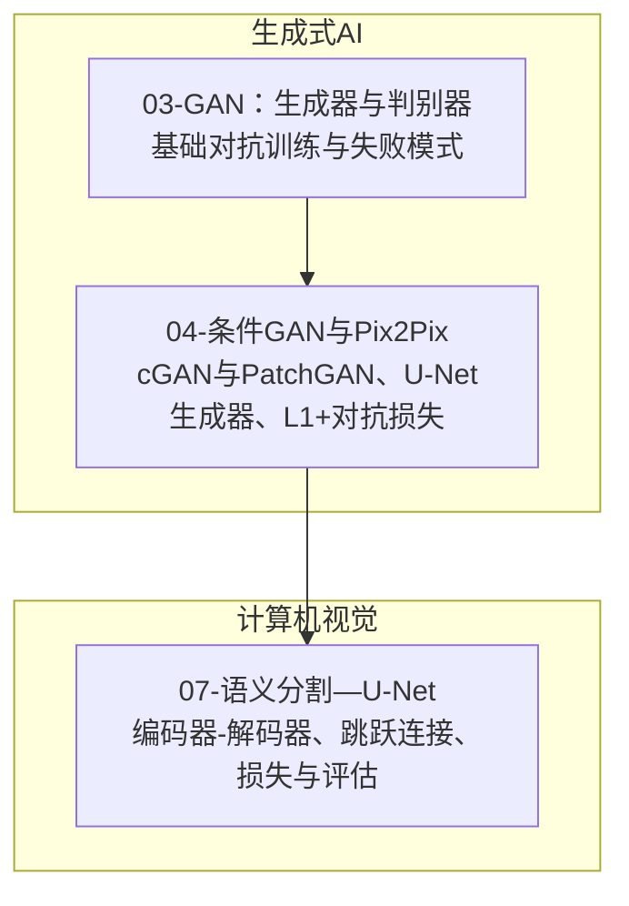
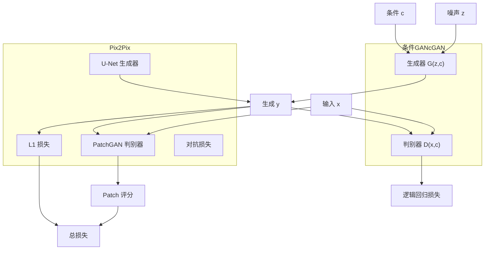
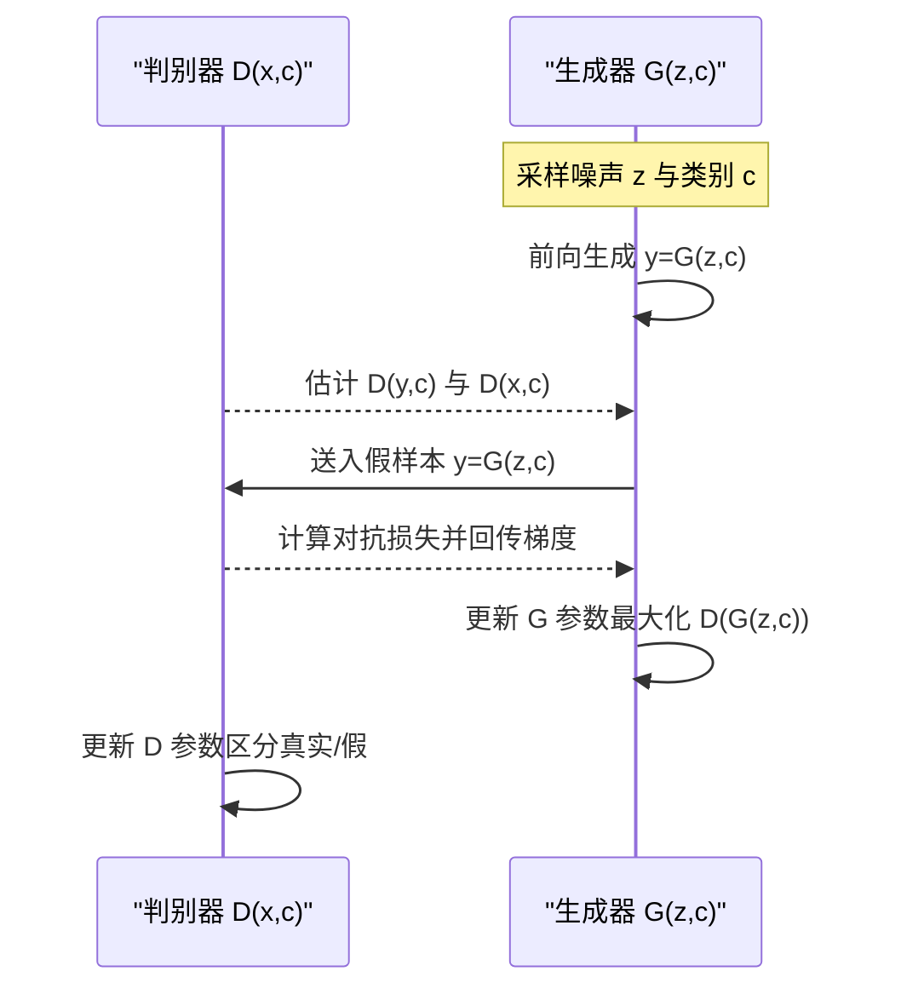
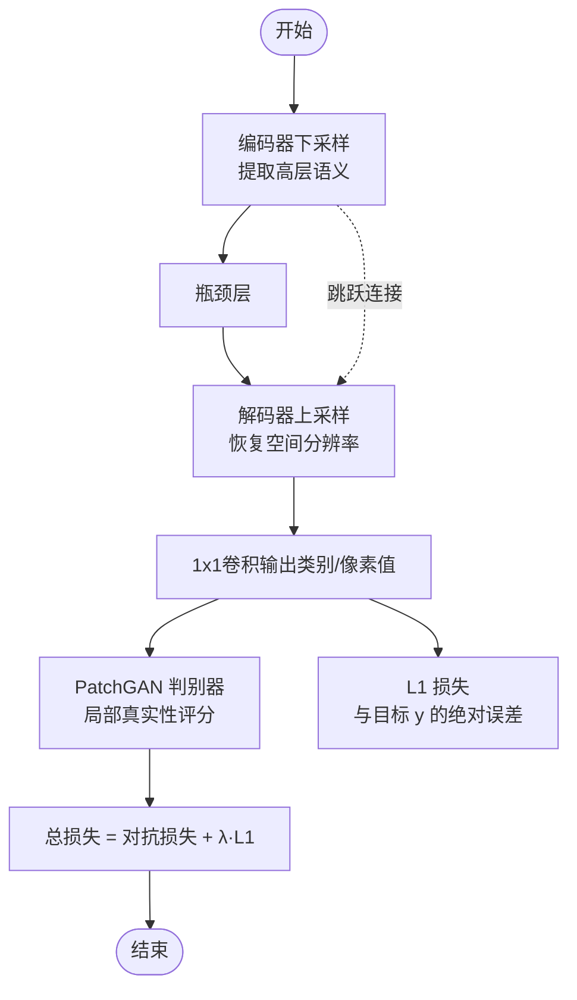
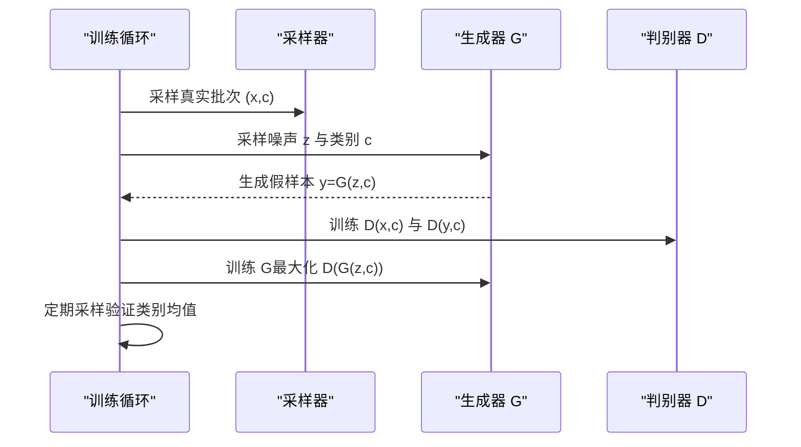
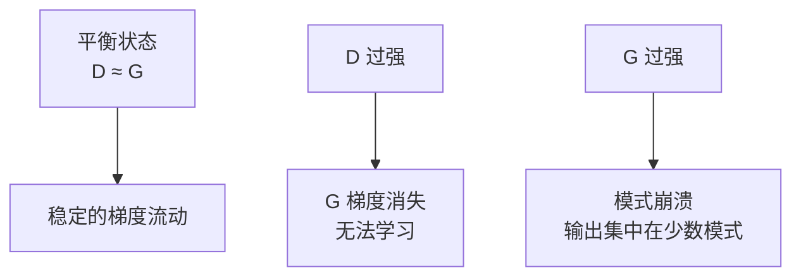
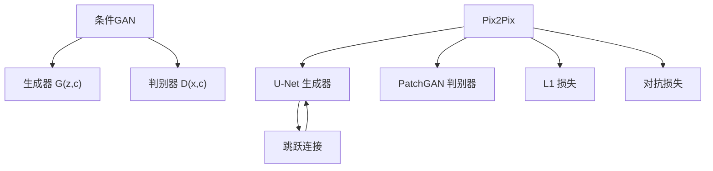

# 条件GAN与图像转换

<cite>
**本文引用的文件**
- [条件GAN与Pix2Pix（中文）](file://phases/08-generative-ai/04-conditional-gans-pix2pix/docs/zh.md)
- [条件GAN与Pix2Pix（代码）](file://phases/08-generative-ai/04-conditional-gans-pix2pix/code/main.py)
- [GAN：生成器与判别器（中文）](file://phases/08-generative-ai/03-gans-generator-discriminator/docs/zh.md)
- [语义分割—U-Net（中文）](file://phases/04-computer-vision/07-semantic-segmentation-unet/docs/zh.md)
- [GAN极小极大博弈可视化脚本](file://site/figures-genai-rl.js)
</cite>

## 目录
1. [引言](#引言)
2. [项目结构](#项目结构)
3. [核心组件](#核心组件)
4. [架构总览](#架构总览)
5. [详细组件分析](#详细组件分析)
6. [依赖分析](#依赖分析)
7. [性能考虑](#性能考虑)
8. [故障排查指南](#故障排查指南)
9. [结论](#结论)
10. [附录](#附录)

## 引言
本文件围绕条件对抗学习（Conditional GAN, cGAN）与图像到图像转换（Image-to-Image Translation）展开，重点覆盖以下主题：
- 条件GAN的理论基础：条件信息如何影响生成过程与判别器的条件判断机制
- Pix2Pix图像到图像转换：编码器-解码器架构、跳跃连接设计、对抗损失与L1损失的结合
- 提供完整的Pix2Pix实现代码路径与训练流程说明
- 讨论条件GAN在语义分割、风格迁移、超分辨率等任务中的应用现状与对比
- 训练策略、损失函数设计与性能优化技巧
- 实际应用案例与效果评估方法

## 项目结构
本仓库中与条件GAN和Pix2Pix直接相关的资料集中在“生成式AI”与“计算机视觉”两大模块：
- 生成式AI·条件GAN与Pix2Pix：包含概念讲解、构建步骤与练习
- 生成式AI·GAN：基础对抗训练与失败模式
- 计算机视觉·语义分割—U-Net：编码器-解码器与跳跃连接的实现与评估

**章节来源**
- [条件GAN与Pix2Pix（中文）:1-148](file://phases/08-generative-ai/04-conditional-gans-pix2pix/docs/zh.md#L1-L148)
- [GAN：生成器与判别器（中文）:1-168](file://phases/08-generative-ai/03-gans-generator-discriminator/docs/zh.md#L1-L168)
- [语义分割—U-Net（中文）:1-400](file://phases/04-computer-vision/07-semantic-segmentation-unet/docs/zh.md#L1-L400)

## 核心组件
- 条件GAN（cGAN）：生成器与判别器均以条件c作为输入，学习在给定条件下匹配真实分布
- Pix2Pix：以U-Net为生成器、PatchGAN为判别器、L1损失稳定训练，对抗损失提升真实性
- U-Net：编码器-解码器结构+跳跃连接，保留高频细节
- PatchGAN：判别器输出NxN网格，每个位置判断局部真实性，加速训练与提升锐利度

**章节来源**
- [条件GAN与Pix2Pix（中文）:16-36](file://phases/08-generative-ai/04-conditional-gans-pix2pix/docs/zh.md#L16-L36)
- [语义分割—U-Net（中文）:46-78](file://phases/04-computer-vision/07-semantic-segmentation-unet/docs/zh.md#L46-L78)

## 架构总览
下图展示了条件GAN与Pix2Pix的关键组成及其交互关系。

**图表来源**
- [条件GAN与Pix2Pix（中文）:18-36](file://phases/08-generative-ai/04-conditional-gans-pix2pix/docs/zh.md#L18-L36)
- [GAN：生成器与判别器（中文）:16-42](file://phases/08-generative-ai/03-gans-generator-discriminator/docs/zh.md#L16-L42)

**章节来源**
- [条件GAN与Pix2Pix（中文）:18-36](file://phases/08-generative-ai/04-conditional-gans-pix2pix/docs/zh.md#L18-L36)
- [GAN：生成器与判别器（中文）:16-42](file://phases/08-generative-ai/03-gans-generator-discriminator/docs/zh.md#L16-L42)

## 详细组件分析

### 条件GAN（cGAN）理论与训练
- 条件信息c同时进入G与D，G学习在给定c下的真实分布，D在(x,y)与(x,c)的联合空间判断一致性
- 训练采用交替更新：先用真实样本与假样本更新D，再用新假样本更新G
- 关键要点：条件信号不可被忽略；D需在早期层就充分使用条件；对抗损失采用非饱和形式避免梯度消失

**图表来源**
- [条件GAN与Pix2Pix（中文）:59-78](file://phases/08-generative-ai/04-conditional-gans-pix2pix/docs/zh.md#L59-L78)
- [GAN：生成器与判别器（中文）:64-86](file://phases/08-generative-ai/03-gans-generator-discriminator/docs/zh.md#L64-L86)

**章节来源**
- [条件GAN与Pix2Pix（中文）:47-78](file://phases/08-generative-ai/04-conditional-gans-pix2pix/docs/zh.md#L47-L78)
- [GAN：生成器与判别器（中文）:60-86](file://phases/08-generative-ai/03-gans-generator-discriminator/docs/zh.md#L60-L86)

### Pix2Pix：U-Net生成器与PatchGAN判别器
- U-Net生成器：编码器-解码器对称结构，跳跃连接保留高频细节，适合输入与输出共享底层结构的任务
- PatchGAN判别器：输出NxN网格，每个位置判断局部真实性，参数更少、训练更快、输出更锐利
- 损失函数：对抗损失 + L1损失，L1稳定训练并推动G贴近目标；默认λ≈100

**图表来源**
- [条件GAN与Pix2Pix（中文）:24-36](file://phases/08-generative-ai/04-conditional-gans-pix2pix/docs/zh.md#L24-L36)
- [语义分割—U-Net（中文）:48-78](file://phases/04-computer-vision/07-semantic-segmentation-unet/docs/zh.md#L48-L78)

**章节来源**
- [条件GAN与Pix2Pix（中文）:24-36](file://phases/08-generative-ai/04-conditional-gans-pix2pix/docs/zh.md#L24-L36)
- [语义分割—U-Net（中文）:46-78](file://phases/04-computer-vision/07-semantic-segmentation-unet/docs/zh.md#L46-L78)

### Pix2Pix完整实现代码路径与训练流程
- 代码实现位于：phases/08-generative-ai/04-conditional-gans-pix2pix/code/main.py
- 主要函数与职责：
  - 激活函数与矩阵运算：sigmoid、leaky、matmul、add、one_hot、randn_matrix
  - 生成器前向：g_forward（将z与独热编码c拼接后经MLP）
  - 判别器前向：d_forward（将x与独热编码c拼接后经MLP输出logits并Sigmoid）
  - 数据采样：sample_real_conditional（按类别采样高斯分布）
  - 梯度累积与更新：update_d、update_g（分别更新D与G）
  - 训练循环：交替采样真实/假样本，更新D与G，定期采样验证类别均值
- 训练策略要点：
  - 生成器与判别器交替更新
  - 对抗损失采用非饱和形式
  - 可选加入L1损失（通过targets与l1_w参数控制）

**图表来源**
- [条件GAN与Pix2Pix（代码）:156-196](file://phases/08-generative-ai/04-conditional-gans-pix2pix/code/main.py#L156-L196)

**章节来源**
- [条件GAN与Pix2Pix（代码）:1-200](file://phases/08-generative-ai/04-conditional-gans-pix2pix/code/main.py#L1-L200)

### 训练稳定性与失败模式
- GAN极小极大博弈的平衡状态：当判别器过强（D远领先）会导致G梯度消失；当G过强（G远领先）可能导致模式崩溃
- 可视化脚本展示了平衡状态对损失与梯度的影响，帮助理解训练动态

**图表来源**
- [GAN极小极大博弈可视化脚本:138-177](file://site/figures-genai-rl.js#L138-L177)

**章节来源**
- [GAN：生成器与判别器（中文）:103-109](file://phases/08-generative-ai/03-gans-generator-discriminator/docs/zh.md#L103-L109)
- [GAN极小极大博弈可视化脚本:138-177](file://site/figures-genai-rl.js#L138-L177)

## 依赖分析
- 条件GAN依赖：
  - G与D共享条件c，确保判别器能检查y与x的一致性
  - 非饱和对抗损失避免梯度消失
  - L1损失稳定训练并约束输出接近目标
- Pix2Pix依赖：
  - U-Net编码器-解码器+跳跃连接保证高频细节
  - PatchGAN局部判别提升锐利度与训练效率
  - 成对数据（x,y）提供精确监督信号

**图表来源**
- [条件GAN与Pix2Pix（中文）:24-36](file://phases/08-generative-ai/04-conditional-gans-pix2pix/docs/zh.md#L24-L36)
- [语义分割—U-Net（中文）:75-78](file://phases/04-computer-vision/07-semantic-segmentation-unet/docs/zh.md#L75-L78)

**章节来源**
- [条件GAN与Pix2Pix（中文）:24-36](file://phases/08-generative-ai/04-conditional-gans-pix2pix/docs/zh.md#L24-L36)
- [语义分割—U-Net（中文）:75-78](file://phases/04-computer-vision/07-semantic-segmentation-unet/docs/zh.md#L75-L78)

## 性能考虑
- 推理延迟：Pix2Pix单次前向推理在静态批处理中显著优于扩散模型（例如在512²与单张L4上，Pix2Pix约30ms，扩散约数百毫秒至数秒）
- 训练效率：PatchGAN局部判别减少参数与计算，L1损失稳定收敛
- 适用场景：成对数据、狭窄任务（草图→渲染、语义图→照片、昼夜变化）优先选择Pix2Pix；开放域与通用任务倾向扩散模型

**章节来源**
- [条件GAN与Pix2Pix（中文）:127-138](file://phases/08-generative-ai/04-conditional-gans-pix2pix/docs/zh.md#L127-L138)

## 故障排查指南
常见陷阱与修复建议：
- 条件被忽略：在D的早期层强制使用条件，或采用投影判别器
- L1权重不当：过低导致G漂移至模糊真实感输出；过高导致模糊，应在稳定后逐步降低
- 真值泄漏：判别器输入应包含(x,y)而非仅y，否则无法检查一致性
- 类别模式崩溃：针对每个类别进行多样性检查与调试

**章节来源**
- [条件GAN与Pix2Pix（中文）:80-87](file://phases/08-generative-ai/04-conditional-gans-pix2pix/docs/zh.md#L80-L87)

## 结论
条件GAN与Pix2Pix在图像到图像转换领域提供了高效、可控的解决方案。通过将条件信息注入生成与判别过程、采用U-Net与PatchGAN的架构组合，以及对抗损失与L1损失的协同，Pix2Pix在成对数据与狭窄任务上具备快速推理与高质量输出的优势。对于开放域与通用任务，扩散模型仍是主流；但在特定场景下，Pix2Pix仍具不可替代的价值。

## 附录

### 应用场景与方法对照
- 草图→照片（同领域成对）：Pix2Pix/Pix2PixHD
- 草图→照片（非成对）：Scribble条件模型的ControlNet
- 语义分割→照片：SPADE/GauGAN2或SD+ControlNet-Seg
- 风格迁移：扩散模型（IP-Adapter/LoRA）；GAN方法已过时
- 深度图→照片：ControlNet-Depth（Stable Diffusion）
- 超分辨率：Real-ESRGAN（GAN）、ESRGAN-Plus或SD-Upscale（扩散）
- 上色：ColTran、扩散上色器或Pix2Pix-color
- 白天→夜晚、季节、天气：CycleGAN或ControlNet变体

**章节来源**
- [条件GAN与Pix2Pix（中文）:88-103](file://phases/08-generative-ai/04-conditional-gans-pix2pix/docs/zh.md#L88-L103)

### 代码与训练实践清单
- 代码路径：phases/08-generative-ai/04-conditional-gans-pix2pix/code/main.py
- 关键实现点：
  - 条件拼接：one_hot(c)与输入拼接
  - 生成器前向：g_forward
  - 判别器前向：d_forward
  - 训练循环：交替更新D与G，定期采样验证类别均值
  - 可选L1损失：update_g中对targets与l1_w的处理

**章节来源**
- [条件GAN与Pix2Pix（代码）:48-129](file://phases/08-generative-ai/04-conditional-gans-pix2pix/code/main.py#L48-L129)