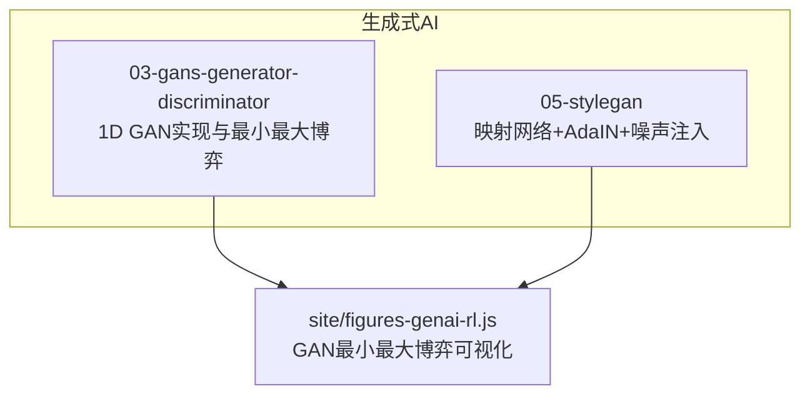
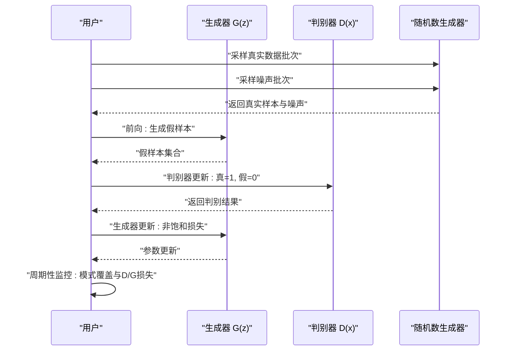
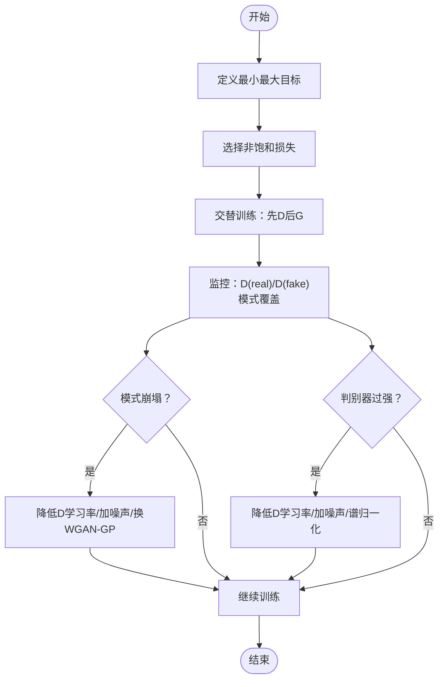
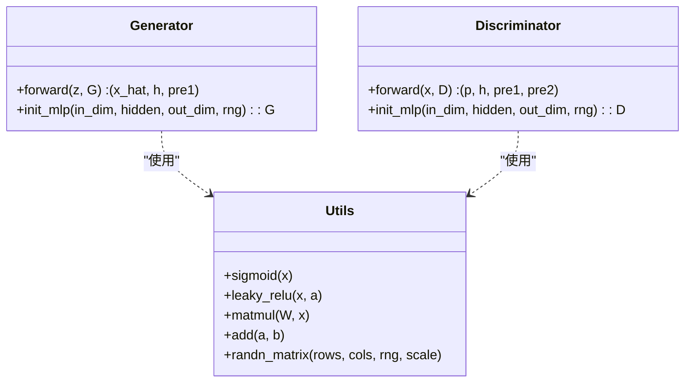
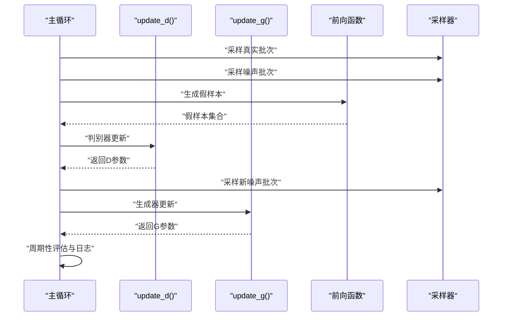
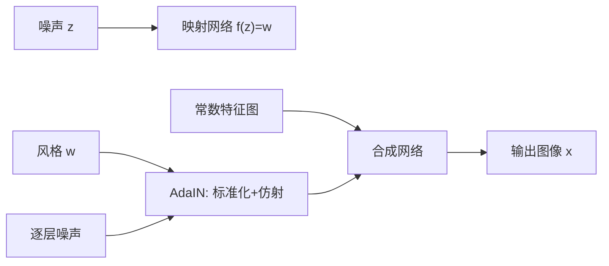
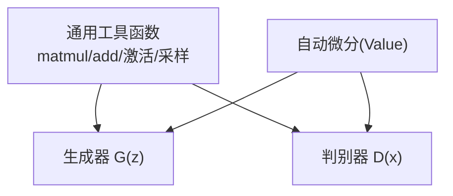

# 标准GAN原理与实现

<cite>
**本文引用的文件**
- [main.py](file://phases/08-generative-ai/03-gans-generator-discriminator/code/main.py)
- [en.md](file://phases/08-generative-ai/03-gans-generator-discriminator/docs/en.md)
- [gan_minimax.js](file://site/figures-genai-rl.js)
- [main.py](file://phases/08-generative-ai/05-stylegan/code/main.py)
- [en.md](file://phases/08-generative-ai/05-stylegan/docs/en.md)
- [autodiff.py](file://phases/01-math-foundations/05-chain-rule-and-autodiff/code/autodiff.py)
</cite>

## 目录
1. [引言](#引言)
2. [项目结构](#项目结构)
3. [核心组件](#核心组件)
4. [架构总览](#架构总览)
5. [详细组件分析](#详细组件分析)
6. [依赖关系分析](#依赖关系分析)
7. [性能考量](#性能考量)
8. [故障排查指南](#故障排查指南)
9. [结论](#结论)
10. [附录](#附录)

## 引言
本文件围绕标准GAN（生成对抗网络）从数学原理、网络架构、训练流程到常见问题与解决方案进行系统化梳理，并结合仓库中“生成器 vs 判别器”与“StyleGAN”的实现示例，帮助读者在理解最小最大博弈、纳什均衡与损失函数设计的基础上，完成可运行的GAN实现与调试。

## 项目结构
本仓库中与GAN直接相关的内容主要集中在“生成式AI”阶段下的两个子模块：
- “生成器 vs 判别器”：以1维高斯混合数据为例，手写MLP结构与反向传播，演示GAN最小最大博弈与典型失败模式（模式崩塌、梯度消失）。
- “StyleGAN”：展示风格解耦思路（映射网络+AdaIN+噪声注入），体现GAN在高保真图像生成中的关键改进。

图示来源
- [main.py:157-192](file://phases/08-generative-ai/03-gans-generator-discriminator/code/main.py#L157-L192)
- [main.py:75-130](file://phases/08-generative-ai/05-stylegan/code/main.py#L75-L130)
- [gan_minimax.js:138-177](file://site/figures-genai-rl.js#L138-L177)

章节来源
- [main.py:157-192](file://phases/08-generative-ai/03-gans-generator-discriminator/code/main.py#L157-L192)
- [en.md:1-168](file://phases/08-generative-ai/03-gans-generator-discriminator/docs/en.md#L1-L168)
- [main.py:75-130](file://phases/08-generative-ai/05-stylegan/code/main.py#L75-L130)
- [en.md:1-145](file://phases/08-generative-ai/05-stylegan/docs/en.md#L1-L145)
- [gan_minimax.js:138-177](file://site/figures-genai-rl.js#L138-L177)

## 核心组件
- 生成器 G(z)：将噪声向量映射为样本，采用单隐藏层MLP结构，激活使用LeakyReLU，输出层无激活。
- 判别器 D(x)：对样本打分（概率），采用单隐藏层MLP结构，隐藏层LeakyReLU，输出层Sigmoid。
- 最小最大目标：min_G max_D E[log D(x)] + E[log(1 − D(G(z)))].
- 训练策略：交替更新，先D后G；G采用非饱和损失 −log D(G(z))，避免梯度饱和。
- 数据采样：真实样本来自双峰高斯混合，噪声来自标准正态分布。

章节来源
- [main.py:42-54](file://phases/08-generative-ai/03-gans-generator-discriminator/code/main.py#L42-L54)
- [main.py:70-106](file://phases/08-generative-ai/03-gans-generator-discriminator/code/main.py#L70-L106)
- [main.py:108-151](file://phases/08-generative-ai/03-gans-generator-discriminator/code/main.py#L108-L151)
- [en.md:16-42](file://phases/08-generative-ai/03-gans-generator-discriminator/docs/en.md#L16-L42)

## 架构总览
标准GAN由两部分组成：生成器与判别器，二者通过对抗训练共同达到纳什均衡。训练时序为“先判别器一步，再生成器一步”，并以非饱和损失驱动生成器学习。

图示来源
- [main.py:165-182](file://phases/08-generative-ai/03-gans-generator-discriminator/code/main.py#L165-L182)
- [main.py:70-106](file://phases/08-generative-ai/03-gans-generator-discriminator/code/main.py#L70-L106)
- [main.py:108-151](file://phases/08-generative-ai/03-gans-generator-discriminator/code/main.py#L108-L151)

章节来源
- [main.py:157-192](file://phases/08-generative-ai/03-gans-generator-discriminator/code/main.py#L157-L192)
- [en.md:32-42](file://phases/08-generative-ai/03-gans-generator-discriminator/docs/en.md#L32-L42)

## 详细组件分析

### 数学基础与最小最大博弈
- 目标函数：min_G max_D E[log D(x)] + E[log(1 − D(G(z)))].
- 纳什均衡：当G匹配真实分布时，D无法区分真假，输出0.5，G不再获得梯度。
- 非饱和损失：采用 −log D(G(z)) 替代 log(1 − D(G(z)))，避免D自信时G梯度饱和。
- 可视化：通过平衡度指标衡量D过强或G过强导致的失败模式。

图示来源
- [en.md:16-42](file://phases/08-generative-ai/03-gans-generator-discriminator/docs/en.md#L16-L42)
- [gan_minimax.js:138-177](file://site/figures-genai-rl.js#L138-L177)

章节来源
- [en.md:16-42](file://phases/08-generative-ai/03-gans-generator-discriminator/docs/en.md#L16-L42)
- [gan_minimax.js:138-177](file://site/figures-genai-rl.js#L138-L177)

### 生成器与判别器网络结构
- 生成器 G(z)：输入维度 z_dim，隐藏层维度 hidden，输出维度 1；激活 LeakyReLU；输出无激活。
- 判别器 D(x)：输入维度 1，隐藏层维度 hidden，输出维度 1；隐藏层 LeakyReLU；输出层 Sigmoid。
- 初始化：权重使用高斯初始化，偏置置零；批大小、学习率在主程序中设定。

图示来源
- [main.py:5-19](file://phases/08-generative-ai/03-gans-generator-discriminator/code/main.py#L5-L19)
- [main.py:33-54](file://phases/08-generative-ai/03-gans-generator-discriminator/code/main.py#L33-L54)

章节来源
- [main.py:33-54](file://phases/08-generative-ai/03-gans-generator-discriminator/code/main.py#L33-L54)
- [main.py:42-54](file://phases/08-generative-ai/03-gans-generator-discriminator/code/main.py#L42-L54)

### 训练过程与损失函数
- 判别器更新：最大化 log D(x) + log(1 − D(G(z)))，即最小化 −[log D(x) + log(1 − D(G(z)))]. 实现中对每类样本分别累积梯度，最后按批次平均并反向更新。
- 生成器更新：最大化 −log D(G(z))，即最小化 log D(G(z))。通过链式法则从D回传梯度至G的参数。
- 学习率：G与D分别设置学习率；若D过强会导致G梯度消失，需降低D学习率或引入噪声/谱归一化等稳定手段。

图示来源
- [main.py:165-182](file://phases/08-generative-ai/03-gans-generator-discriminator/code/main.py#L165-L182)
- [main.py:70-106](file://phases/08-generative-ai/03-gans-generator-discriminator/code/main.py#L70-L106)
- [main.py:108-151](file://phases/08-generative-ai/03-gans-generator-discriminator/code/main.py#L108-L151)

章节来源
- [main.py:70-106](file://phases/08-generative-ai/03-gans-generator-discriminator/code/main.py#L70-L106)
- [main.py:108-151](file://phases/08-generative-ai/03-gans-generator-discriminator/code/main.py#L108-L151)
- [main.py:157-192](file://phases/08-generative-ai/03-gans-generator-discriminator/code/main.py#L157-L192)

### 关键问题与解决方案
- 模式崩塌：生成器仅覆盖一个真实模式，可通过增加输入噪声、使用谱归一化、切换Wasserstein损失等方式缓解。
- 梯度消失：判别器过于自信导致G梯度接近零，应降低D学习率、加入噪声、使用WGAN-GP或谱归一化。
- 收敛困难：学习率、批大小、网络深度与归一化方式均会影响稳定性，建议从较低学习率起步，逐步调整。

章节来源
- [en.md:103-110](file://phases/08-generative-ai/03-gans-generator-discriminator/docs/en.md#L103-L110)

### StyleGAN 的风格解耦与扩展
- 映射网络 f: Z → W 将噪声映射到风格空间，使潜在空间更解耦。
- AdaIN：按通道对特征图做标准化后，由W的仿射投影控制尺度与偏置，实现风格注入。
- 噪声注入：逐层添加单通道噪声，控制细节的随机性。
- 截断技巧：在推理时对W进行截断，提升样本质量与多样性折中。

图示来源
- [main.py:32-62](file://phases/08-generative-ai/05-stylegan/code/main.py#L32-L62)
- [en.md:18-37](file://phases/08-generative-ai/05-stylegan/docs/en.md#L18-L37)

章节来源
- [main.py:32-62](file://phases/08-generative-ai/05-stylegan/code/main.py#L32-L62)
- [en.md:18-37](file://phases/08-generative-ai/05-stylegan/docs/en.md#L18-L37)

### 可视化与评估
- GAN最小最大博弈可视化：通过平衡度指标直观显示D过强或G过强时的损失与梯度状态。
- 评估指标：FID、CLIP分数等用于质量评估，但需注意其局限性与样本规模要求。

章节来源
- [gan_minimax.js:138-177](file://site/figures-genai-rl.js#L138-L177)
- [en.md:108-109](file://phases/08-generative-ai/03-gans-generator-discriminator/docs/en.md#L108-L109)

## 依赖关系分析
- 代码内部依赖：生成器与判别器共享矩阵乘法、加法、激活函数等通用工具函数。
- 数学支撑：自动微分框架（Value类）展示了链式法则的实现思想，有助于理解GAN反向传播。

图示来源
- [main.py:25-31](file://phases/08-generative-ai/03-gans-generator-discriminator/code/main.py#L25-L31)
- [main.py:5-19](file://phases/08-generative-ai/03-gans-generator-discriminator/code/main.py#L5-L19)
- [autodiff.py:4-82](file://phases/01-math-foundations/05-chain-rule-and-autodiff/code/autodiff.py#L4-L82)

章节来源
- [main.py:25-31](file://phases/08-generative-ai/03-gans-generator-discriminator/code/main.py#L25-L31)
- [main.py:5-19](file://phases/08-generative-ai/03-gans-generator-discriminator/code/main.py#L5-L19)
- [autodiff.py:4-82](file://phases/01-math-foundations/05-chain-rule-and-autodiff/code/autodiff.py#L4-L82)

## 性能考量
- 推理成本：GAN在生产中具有极低TTFT与KV缓存压力，适合实时生成场景。
- 批处理：由于每个请求固定FLOPs，静态批量通常最优，无需复杂调度。
- 训练稳定性：合理的学习率、归一化与损失形式是关键；必要时引入谱归一化或Wasserstein距离。

章节来源
- [en.md:149-157](file://phases/08-generative-ai/03-gans-generator-discriminator/docs/en.md#L149-L157)
- [en.md:105-109](file://phases/08-generative-ai/03-gans-generator-discriminator/docs/en.md#L105-L109)

## 故障排查指南
- 模式崩塌检测：定期采样生成样本，统计落入不同真实模式的数量，若某一模式数量过少则提示崩塌。
- 梯度消失预警：若D对假样本准确率过高（例如>95%），G将难以学习，应降低D学习率或引入噪声。
- 超参数建议：从较低学习率起步，逐步提高；确保G每次使用“新鲜”假样本；关注D/G损失比值与平衡度。

章节来源
- [main.py:174-182](file://phases/08-generative-ai/03-gans-generator-discriminator/code/main.py#L174-L182)
- [en.md:105-109](file://phases/08-generative-ai/03-gans-generator-discriminator/docs/en.md#L105-L109)

## 结论
标准GAN通过生成器与判别器的对抗训练，实现了在无需显式建模密度的情况下学习数据分布。仓库中的1D实现清晰展示了最小最大博弈、非饱和损失与典型失败模式；而StyleGAN进一步通过映射网络与AdaIN提升了风格解耦与生成质量。实践中应重视训练稳定性与评估指标的正确使用，并结合谱归一化、Wasserstein损失等技术应对模式崩塌与梯度消失等挑战。

## 附录
- 参考资料与进一步阅读见各文档末尾的参考文献列表。
- 可视化资源：GAN最小最大博弈交互图可用于教学与调试辅助。