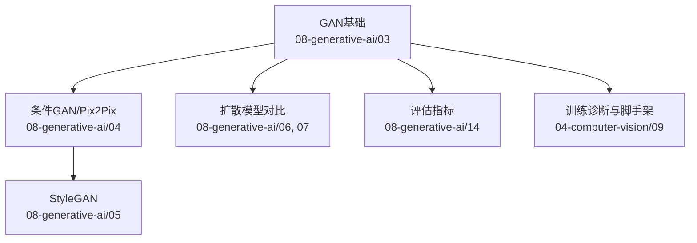
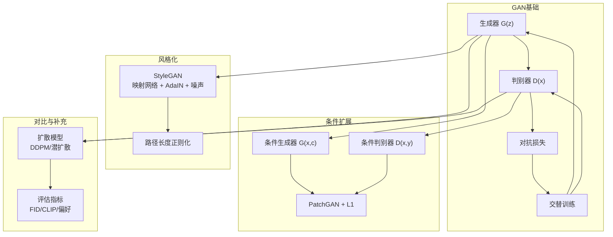
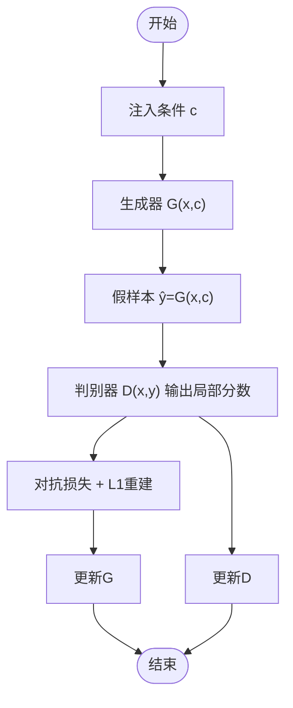
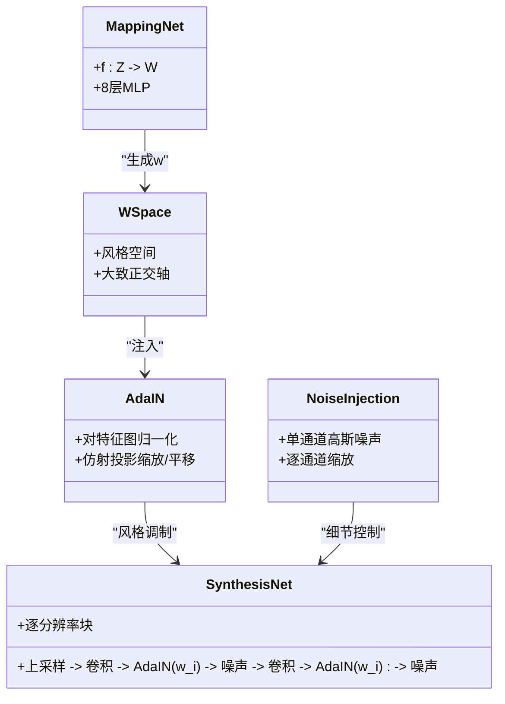
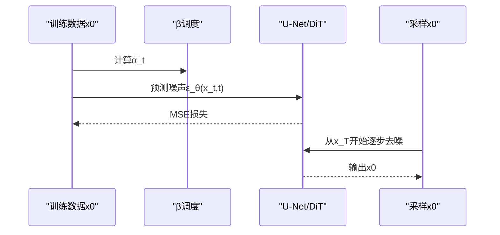
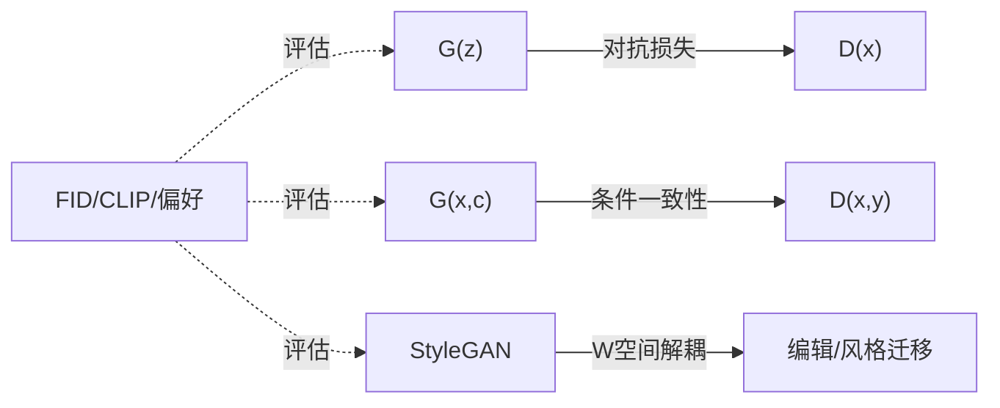

# 生成对抗网络(GAN)

<cite>
**本文档引用的文件**   
- [GAN：生成器与判别器（中文）](file://phases/08-generative-ai/03-gans-generator-discriminator/docs/zh.md)
- [条件GAN与Pix2Pix（中文）](file://phases/08-generative-ai/04-conditional-gans-pix2pix/docs/zh.md)
- [StyleGAN（中文）](file://phases/08-generative-ai/05-stylegan/docs/zh.md)
- [扩散模型——从零实现DDPM（中文）](file://phases/08-generative-ai/06-diffusion-ddpm-from-scratch/docs/zh.md)
- [潜在扩散与Stable Diffusion（中文）](file://phases/08-generative-ai/07-latent-diffusion-stable-diffusion/docs/zh.md)
- [评估——FID、CLIP分数与人类偏好（中文）](file://phases/08-generative-ai/14-evaluation-fid-clip-score/docs/zh.md)
- [GAN训练三板斧诊断脚本（中文）](file://phases/04-computer-vision/09-image-generation-gans/outputs/prompt-gan-training-triage.md)
- [DCGAN脚手架模板（中文）](file://phases/04-computer-vision/09-image-generation-gans/outputs/skill-dcgan-scaffold.md)
- [GAN极小极大博弈可视化（前端脚本）](file://site/figures-genai-rl.js)
- [生成式AI课程总览（中文）](file://ROADMAP.md)
- [GAN：生成器与判别器（代码）](file://phases/08-generative-ai/03-gans-generator-discriminator/code/main.py)
- [条件GAN：Pix2Pix（代码）](file://phases/08-generative-ai/04-conditional-gans-pix2pix/code/main.py)
</cite>

## 目录
1. [引言](#引言)
2. [项目结构](#项目结构)
3. [核心组件](#核心组件)
4. [架构总览](#架构总览)
5. [详细组件分析](#详细组件分析)
6. [依赖分析](#依赖分析)
7. [性能考量](#性能考量)
8. [故障排查指南](#故障排查指南)
9. [结论](#结论)
10. [附录](#附录)

## 引言
本文件系统化梳理生成对抗网络（GAN）的原理、实现与工程实践，覆盖标准GAN的对抗训练、收敛与模式崩塌问题，条件GAN（cGAN）与Pix2Pix图像到图像转换，StyleGAN的风格混合与路径长度正则化，以及面向人脸生成、图像编辑与风格迁移的应用现状。同时提供训练策略、可视化技巧与常见问题的调试方法，帮助读者从理论到工程落地。

## 项目结构
本仓库围绕“生成式AI”形成完整学习路径，其中与GAN密切相关的模块包括：
- 标准GAN与对抗训练：08-generative-ai/03
- 条件GAN与Pix2Pix：08-generative-ai/04
- StyleGAN：08-generative-ai/05
- 扩散模型（对比与补充）：08-generative-ai/06、07
- 评估指标（FID、CLIP、人类偏好）：08-generative-ai/14
- 计算机视觉专题中的GAN训练诊断与脚手架：04-computer-vision/09



**章节来源**
- [生成式AI课程总览（中文）:206-224](file://ROADMAP.md#L206-L224)

## 核心组件
- 生成器 G(z)：将噪声 z 映射为样本 x̂，可为MLP或转置卷积网络。
- 判别器 D(x)：输出真实/虚假的概率或分数，真实→1，虚假→0。
- 对抗损失：生成器采用非饱和损失 -log D(G(z))，判别器采用二元交叉熵。
- 训练循环：交替更新 D 与 G，G 需要新鲜假样本以避免梯度过时。
- 失败模式：模式崩溃、梯度消失、震荡不收敛、纳什均衡（正常）。

**章节来源**
- [GAN：生成器与判别器（中文）:10-58](file://phases/08-generative-ai/03-gans-generator-discriminator/docs/zh.md#L10-L58)
- [GAN：生成器与判别器（代码）:157-192](file://phases/08-generative-ai/03-gans-generator-discriminator/code/main.py#L157-L192)

## 架构总览
下图展示GAN的极小极大博弈与训练流程，以及与后续技术（如StyleGAN、扩散模型）的关系。



**图表来源**
- [GAN：生成器与判别器（中文）:16-58](file://phases/08-generative-ai/03-gans-generator-discriminator/docs/zh.md#L16-L58)
- [条件GAN与Pix2Pix（中文）:16-36](file://phases/08-generative-ai/04-conditional-gans-pix2pix/docs/zh.md#L16-L36)
- [StyleGAN（中文）:18-48](file://phases/08-generative-ai/05-stylegan/docs/zh.md#L18-L48)
- [扩散模型——从零实现DDPM（中文）:16-62](file://phases/08-generative-ai/06-diffusion-ddpm-from-scratch/docs/zh.md#L16-L62)
- [潜在扩散与Stable Diffusion（中文）:18-53](file://phases/08-generative-ai/07-latent-diffusion-stable-diffusion/docs/zh.md#L18-L53)

## 详细组件分析

### 标准GAN：对抗训练与失败模式
- 极小极大目标与非饱和损失：通过 -log D(G(z)) 避免梯度饱和，使 G 在 D 确信时仍能获得强信号。
- 训练稳定性要点：判别器学习率不宜过高；BN统计量泄漏可通过谱归一化或实例归一化缓解；观察模式崩溃（某一模式被饿死）与震荡。
- 可视化：前端脚本提供“GAN极小极大”交互图，直观显示 D 与 G 的平衡状态与失败模式。

```mermaid
sequenceDiagram
participant Z as "噪声z"
participant G as "生成器G"
participant D as "判别器D"
participant Opt as "优化器"
Z->>G : 噪声z
G-->>D : 假样本x̂=G(z)
D-->>Opt : 计算loss_D并更新D
Opt-->>D : D参数更新
D-->>G : 计算loss_G并反传
Opt-->>G : G参数更新
```

**图表来源**
- [GAN：生成器与判别器（代码）:70-151](file://phases/08-generative-ai/03-gans-generator-discriminator/code/main.py#L70-L151)

**章节来源**
- [GAN：生成器与判别器（中文）:16-58](file://phases/08-generative-ai/03-gans-generator-discriminator/docs/zh.md#L16-L58)
- [GAN：生成器与判别器（代码）:157-192](file://phases/08-generative-ai/03-gans-generator-discriminator/code/main.py#L157-L192)
- [GAN极小极大博弈可视化（前端脚本）:138-177](file://site/figures-genai-rl.js#L138-L177)

### 条件GAN与Pix2Pix：图像到图像转换
- 条件GAN：在 G 与 D 中同时注入条件 c，实现类别/图像级条件生成。
- Pix2Pix：U-Net生成器 + PatchGAN判别器 + L1重建损失，强调局部真实性与边缘锐利度。
- 训练策略：将 (x, y) 拼接作为 D 输入，确保一致性；L1权重 λ≈100；类别条件下的多样性检查。



**图表来源**
- [条件GAN与Pix2Pix（中文）:28-36](file://phases/08-generative-ai/04-conditional-gans-pix2pix/docs/zh.md#L28-L36)

**章节来源**
- [条件GAN与Pix2Pix（中文）:16-103](file://phases/08-generative-ai/04-conditional-gans-pix2pix/docs/zh.md#L16-L103)
- [条件GAN：Pix2Pix（代码）:156-200](file://phases/08-generative-ai/04-conditional-gans-pix2pix/code/main.py#L156-L200)

### StyleGAN：风格混合与路径长度正则化
- 映射网络 f: Z→W，AdaIN在每分辨率注入 w，逐层噪声控制细节；渐进式增长提升分辨率。
- StyleGAN2引入权重解调、跳跃连接与路径长度正则化；StyleGAN3采用无混叠卷积消除纹理贴附。
- 截断技巧 ψ 控制多样性和质量权衡；反演（e4e/ReStyle/HyperStyle）将真实照片映射到W空间以进行编辑。



**图表来源**
- [StyleGAN（中文）:18-48](file://phases/08-generative-ai/05-stylegan/docs/zh.md#L18-L48)

**章节来源**
- [StyleGAN（中文）:10-145](file://phases/08-generative-ai/05-stylegan/docs/zh.md#L10-L145)

### 扩散模型对比：训练稳定性与质量
- DDPM：前向加噪 + 反向去噪，训练损失为噪声预测MSE；采样从 x_T 开始逐步去噪。
- 潜扩散（SD）：VAE压缩 + 潜在空间扩散，显著降低计算；文本条件通过交叉注意力注入。
- 与GAN对比：扩散模型无极小极大博弈，训练更稳定；GAN在推理成本与风格化细节上仍有优势。



**图表来源**
- [扩散模型——从零实现DDPM（中文）:36-111](file://phases/08-generative-ai/06-diffusion-ddpm-from-scratch/docs/zh.md#L36-L111)
- [潜在扩散与Stable Diffusion（中文）:22-85](file://phases/08-generative-ai/07-latent-diffusion-stable-diffusion/docs/zh.md#L22-L85)

**章节来源**
- [扩散模型——从零实现DDPM（中文）:10-186](file://phases/08-generative-ai/06-diffusion-ddpm-from-scratch/docs/zh.md#L10-L186)
- [潜在扩散与Stable Diffusion（中文）:10-150](file://phases/08-generative-ai/07-latent-diffusion-stable-diffusion/docs/zh.md#L10-L150)

## 依赖分析
- 模块耦合：
  - G与D通过对抗损失耦合；D的判别能力直接影响G的梯度信号。
  - 条件扩展将 c 注入 G/D 输入，提升任务可控性。
  - StyleGAN将潜在空间解耦（W空间），提升编辑与风格迁移能力。
- 外部依赖：
  - 评估指标（FID、CLIP、人类偏好）用于客观与主观评价。
  - 扩散模型作为GAN的对比与补充，尤其在稳定性与通用性上。



**图表来源**
- [GAN：生成器与判别器（中文）:16-58](file://phases/08-generative-ai/03-gans-generator-discriminator/docs/zh.md#L16-L58)
- [条件GAN与Pix2Pix（中文）:16-36](file://phases/08-generative-ai/04-conditional-gans-pix2pix/docs/zh.md#L16-L36)
- [StyleGAN（中文）:18-48](file://phases/08-generative-ai/05-stylegan/docs/zh.md#L18-L48)
- [评估——FID、CLIP分数与人类偏好（中文）:20-81](file://phases/08-generative-ai/14-evaluation-fid-clip-score/docs/zh.md#L20-L81)

**章节来源**
- [评估——FID、CLIP分数与人类偏好（中文）:10-184](file://phases/08-generative-ai/14-evaluation-fid-clip-score/docs/zh.md#L10-L184)

## 性能考量
- 训练稳定性：判别器过强会导致G梯度消失；模式崩溃源于D对少数模式过拟合；震荡多因学习率/批大小不当。
- 推理效率：GAN单次前向即可完成（TTFT≈总延迟），适合低延迟场景；扩散模型质量更高但需多步采样。
- 数据与条件：成对数据（如Pix2Pix）在狭窄任务上仍具性价比；开放域生成推荐扩散模型。

[本节为通用指导，无需具体文件引用]

## 故障排查指南
- D完全获胜：d_loss趋近0且下降、g_loss上升或很大、样本随机/卡住。修复：将BN替换为谱归一化，或降低D学习率。
- 模式崩溃：d_loss中等振荡、g_loss低但波动、样本数量少。修复：引入小批量判别、增大batch size或添加标签条件。
- 震荡/不收敛：两损失大幅波动、样本在不同失败模式间闪烁。修复：TTUR（D学习率设为G的4倍）或切换WGAN-GP。
- 纳什均衡（正常）：d_loss≈log(4)、g_loss≈log(2)，样本合理。继续训练或评估FID。
- 生成器梯度消失：d_loss极小、g_loss极大、样本无意义。修复：使用非饱和生成器损失（-log D(G(z))）。

**章节来源**
- [GAN训练三板斧诊断脚本（中文）:16-73](file://phases/04-computer-vision/09-image-generation-gans/outputs/prompt-gan-training-triage.md#L16-L73)

## 结论
GAN以对抗训练实现高质量样本生成，具备低推理延迟的优势；但训练易受模式崩溃、梯度消失与震荡影响。条件化（cGAN/Pix2Pix）与风格化（StyleGAN）进一步提升了可控性与细节质量；在开放域与通用生成上，扩散模型仍是主流，GAN常作为蒸馏与感知损失的组成部分。结合稳健的训练策略、评估指标与工程化脚手架，可高效落地各类生成任务。

[本节为总结，无需具体文件引用]

## 附录

### 实现与训练要点速查
- 标准GAN
  - 非饱和损失：使用 -log D(G(z)) 训练G
  - 交替更新：每步更新D，随后更新G
  - 观察模式崩溃：定期采样并统计模式数量
- 条件GAN/Pix2Pix
  - 条件注入：在G/D输入拼接独热或嵌入
  - PatchGAN判别器：输出局部分数网格
  - L1重建：λ≈100稳定训练
- StyleGAN
  - 映射网络 + AdaIN + 逐层噪声
  - 路径长度正则化 + 截断技巧
- 评估
  - FID≥10k样本、CLIP分数、人类偏好三支柱
- 工程脚手架
  - DCGAN脚手架：指定分辨率、通道数、谱归一化开关

**章节来源**
- [DCGAN脚手架模板（中文）:14-82](file://phases/04-computer-vision/09-image-generation-gans/outputs/skill-dcgan-scaffold.md#L14-L82)
- [评估——FID、CLIP分数与人类偏好（中文）:71-142](file://phases/08-generative-ai/14-evaluation-fid-clip-score/docs/zh.md#L71-L142)