# 生成式AI

<cite>
**本文引用的文件**
- [phases/08-generative-ai/README.md](file://phases/08-generative-ai/README.md)
- [phases/08-generative-ai/01-generative-models-taxonomy-history/docs/en.md](file://phases/08-generative-ai/01-generative-models-taxonomy-history/docs/en.md)
- [phases/08-generative-ai/02-autoencoders-vae/docs/en.md](file://phases/08-generative-ai/02-autoencoders-vae/docs/en.md)
- [phases/08-generative-ai/03-gans-generator-discriminator/docs/en.md](file://phases/08-generative-ai/03-gans-generator-discriminator/docs/en.md)
- [phases/08-generative-ai/06-diffusion-ddpm-from-scratch/docs/en.md](file://phases/08-generative-ai/06-diffusion-ddpm-from-scratch/docs/en.md)
- [phases/08-generative-ai/07-latent-diffusion-stable-diffusion/docs/en.md](file://phases/08-generative-ai/07-latent-diffusion-stable-diffusion/docs/en.md)
- [phases/08-generative-ai/08-controlnet-lora-conditioning/docs/en.md](file://phases/08-generative-ai/08-controlnet-lora-conditioning/docs/en.md)
- [phases/08-generative-ai/09-inpainting-outpainting-editing/docs/en.md](file://phases/08-generative-ai/09-inpainting-outpainting-editing/docs/en.md)
- [phases/08-generative-ai/10-video-generation/docs/en.md](file://phases/08-generative-ai/10-video-generation/docs/en.md)
- [phases/08-generative-ai/11-audio-generation/docs/en.md](file://phases/08-generative-ai/11-audio-generation/docs/en.md)
- [phases/08-generative-ai/12-3d-generation/docs/en.md](file://phases/08-generative-ai/12-3d-generation/docs/en.md)
- [phases/08-generative-ai/13-flow-matching-rectified-flows/docs/en.md](file://phases/08-generative-ai/13-flow-matching-rectified-flows/docs/en.md)
- [phases/08-generative-ai/14-evaluation-fid-clip-score/docs/en.md](file://phases/08-generative-ai/14-evaluation-fid-clip-score/docs/en.md)
</cite>

## 目录
1. [引言](#引言)
2. [项目结构](#项目结构)
3. [核心组件](#核心组件)
4. [架构总览](#架构总览)
5. [详细组件分析](#详细组件分析)
6. [依赖关系分析](#依赖关系分析)
7. [性能考量](#性能考量)
8. [故障排查指南](#故障排查指南)
9. [结论](#结论)
10. [附录](#附录)

## 引言
本课程围绕“生成式AI”展开，系统梳理生成模型的分类与历史演进，从传统生成对抗网络（GAN）到现代扩散模型（Diffusion），再到最新的流匹配（Flow Matching）、修正流（Rectified Flow）等高效采样范式；同时覆盖变分自编码器（VAE）、扩散模型（DDPM）的原理与实现，并以Stable Diffusion为代表的工业级模型讲解架构、微调与控制技术。课程还包含图像编辑、视频生成、音频生成、3D生成等高级应用，以及FID、CLIP Score等评估指标的计算与分析方法。

## 项目结构
该课程位于“阶段08：生成式AI”，共14个主题单元，每个单元配套文档、可运行示例代码、图示与技能输出，形成“学习-实践-产出”的闭环。课程内容按“模型家族—原理—实现—应用—评估”的主线组织，既适合初学者建立知识框架，也便于有经验工程师快速定位实践要点。

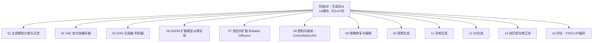

图表来源
- [phases/08-generative-ai/README.md](file://phases/08-generative-ai/README.md)

章节来源
- [phases/08-generative-ai/README.md](file://phases/08-generative-ai/README.md)

## 核心组件
本课程的核心由以下五大模块构成：
- 模型家族与历史：明确五大家族（显式密度、隐式密度、基于分数/连续时间、自回归离散令牌、流匹配/修正流）及其适用任务与推理成本差异。
- 编码与潜空间：VAE作为压缩与先验约束的关键，是所有潜空间扩散与流匹配的基础。
- 对抗与扩散：GAN的对抗训练与稳定性问题；DDPM的噪声破坏-去噪反演流程与稳定训练目标。
- 条件与控制：文本条件（CLIP）、空间结构控制（ControlNet）、参数高效微调（LoRA）、参考图像风格注入（IP-Adapter）。
- 多模态生成：视频（DiT时空补丁）、音频（神经编解码+令牌自回归或潜空间扩散/流匹配）、3D（多视角扩散+高斯点阵/NeRF重建）。
- 新兴范式：流匹配与修正流以直线路线替代曲线路径，显著降低采样步数与延迟。
- 评估体系：FID、CLIP Score、人类偏好三轴互补，避免单一指标被绕过。

章节来源
- [phases/08-generative-ai/01-generative-models-taxonomy-history/docs/en.md](file://phases/08-generative-ai/01-generative-models-taxonomy-history/docs/en.md)
- [phases/08-generative-ai/02-autoencoders-vae/docs/en.md](file://phases/08-generative-ai/02-autoencoders-vae/docs/en.md)
- [phases/08-generative-ai/03-gans-generator-discriminator/docs/en.md](file://phases/08-generative-ai/03-gans-generator-discriminator/docs/en.md)
- [phases/08-generative-ai/06-diffusion-ddpm-from-scratch/docs/en.md](file://phases/08-generative-ai/06-diffusion-ddpm-from-scratch/docs/en.md)
- [phases/08-generative-ai/07-latent-diffusion-stable-diffusion/docs/en.md](file://phases/08-generative-ai/07-latent-diffusion-stable-diffusion/docs/en.md)
- [phases/08-generative-ai/08-controlnet-lora-conditioning/docs/en.md](file://phases/08-generative-ai/08-controlnet-lora-conditioning/docs/en.md)
- [phases/08-generative-ai/09-inpainting-outpainting-editing/docs/en.md](file://phases/08-generative-ai/09-inpainting-outpainting-editing/docs/en.md)
- [phases/08-generative-ai/10-video-generation/docs/en.md](file://phases/08-generative-ai/10-video-generation/docs/en.md)
- [phases/08-generative-ai/11-audio-generation/docs/en.md](file://phases/08-generative-ai/11-audio-generation/docs/en.md)
- [phases/08-generative-ai/12-3d-generation/docs/en.md](file://phases/08-generative-ai/12-3d-generation/docs/en.md)
- [phases/08-generative-ai/13-flow-matching-rectified-flows/docs/en.md](file://phases/08-generative-ai/13-flow-matching-rectified-flows/docs/en.md)
- [phases/08-generative-ai/14-evaluation-fid-clip-score/docs/en.md](file://phases/08-generative-ai/14-evaluation-fid-clip-score/docs/en.md)

## 架构总览
下图展示了从数据分布到样本生成的整体流程，以及不同模型家族在其中的位置与分工。VAE负责编码-解码与先验正则化；GAN通过对抗学习直接建模数据分布；扩散模型以噪声破坏-去噪的马尔可夫链训练神经网络，采样时逆向执行；流匹配/修正流以直线路线替代曲线路径，显著减少采样步数；多模态生成在上述基础上扩展至视频、音频与3D。

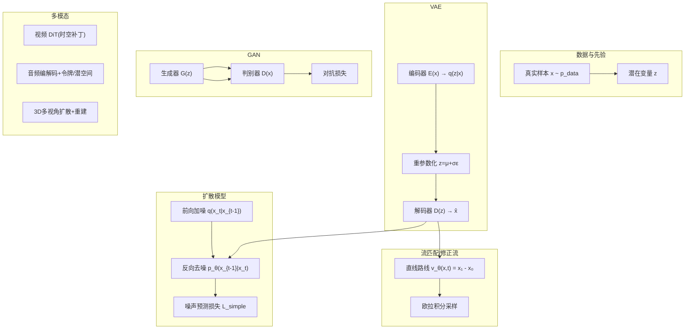

图表来源
- [phases/08-generative-ai/01-generative-models-taxonomy-history/docs/en.md](file://phases/08-generative-ai/01-generative-models-taxonomy-history/docs/en.md)
- [phases/08-generative-ai/02-autoencoders-vae/docs/en.md](file://phases/08-generative-ai/02-autoencoders-vae/docs/en.md)
- [phases/08-generative-ai/03-gans-generator-discriminator/docs/en.md](file://phases/08-generative-ai/03-gans-generator-discriminator/docs/en.md)
- [phases/08-generative-ai/06-diffusion-ddpm-from-scratch/docs/en.md](file://phases/08-generative-ai/06-diffusion-ddpm-from-scratch/docs/en.md)
- [phases/08-generative-ai/10-video-generation/docs/en.md](file://phases/08-generative-ai/10-video-generation/docs/en.md)
- [phases/08-generative-ai/11-audio-generation/docs/en.md](file://phases/08-generative-ai/11-audio-generation/docs/en.md)
- [phases/08-generative-ai/12-3d-generation/docs/en.md](file://phases/08-generative-ai/12-3d-generation/docs/en.md)

## 详细组件分析

### 组件A：VAE（变分自编码器）
- 核心思想：通过ELBO将重构误差与KL正则结合，强制潜在空间接近先验（通常为标准高斯），从而获得可采样的潜在分布。
- 关键机制：重参数化技巧使采样可微；两段式编码器输出均值与对数方差；解码器输出重建。
- 实践要点：β-VAE调节先验强度与重构权衡；潜在维度需随分辨率增长；后验坍缩与模糊样本是常见陷阱。
- 在管线中的角色：作为所有潜空间扩散/流匹配的编码器与先验约束，决定后续生成质量与稳定性。

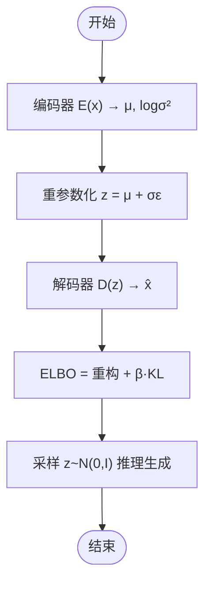

图表来源
- [phases/08-generative-ai/02-autoencoders-vae/docs/en.md](file://phases/08-generative-ai/02-autoencoders-vae/docs/en.md)

章节来源
- [phases/08-generative-ai/02-autoencoders-vae/docs/en.md](file://phases/08-generative-ai/02-autoencoders-vae/docs/en.md)

### 组件B：GAN（生成对抗网络）
- 核心思想：生成器与判别器的极小极大博弈，生成器试图欺骗判别器，判别器区分真假，最终达到均衡。
- 训练策略：交替更新；非饱和损失缓解梯度消失；谱归一化、Wasserstein距离与梯度惩罚提升稳定性。
- 实践要点：判别器过强会杀死生成器；BN统计泄漏需规避；模式崩溃与梯度不稳定是主要风险。
- 工业价值：对抗蒸馏用于快速采样（如SDXL-Turbo、SD3-Turbo），判别器作为感知损失参与扩散训练。

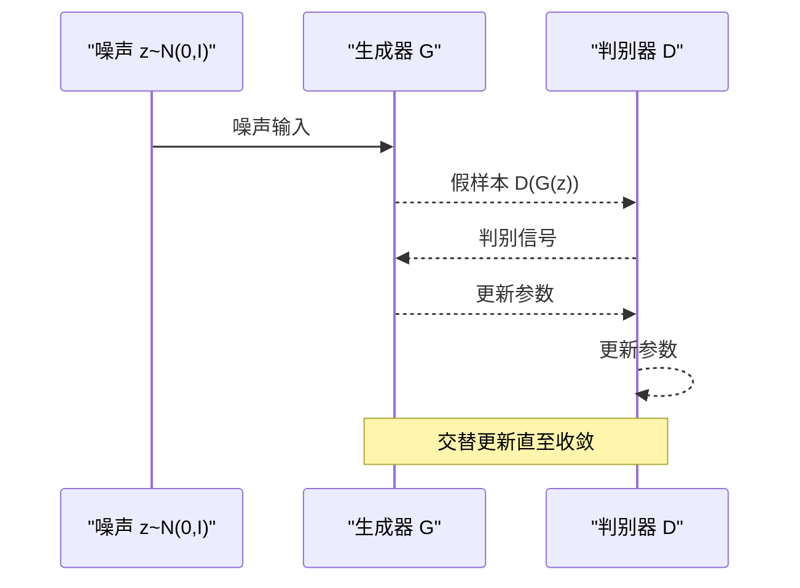

图表来源
- [phases/08-generative-ai/03-gans-generator-discriminator/docs/en.md](file://phases/08-generative-ai/03-gans-generator-discriminator/docs/en.md)

章节来源
- [phases/08-generative-ai/03-gans-generator-discriminator/docs/en.md](file://phases/08-generative-ai/03-gans-generator-discriminator/docs/en.md)

### 组件C：DDPM（扩散模型从零实现）
- 核心思想：定义前向高斯噪声过程 q，训练反向去噪神经网络 ε_θ(x_t,t)，采样时从噪声逐步去噪。
- 关键公式：前向闭式解、简单MSE损失、反向一步递推；时间步嵌入（正弦/FiLM）与预测目标（ε/v/x）选择。
- 实践要点：β调度影响质量；时间步嵌入需正确设计；v预测在窄区间更稳定；CFG增强条件强度。
- 生产注意：1000步采样昂贵，需用DDIM、DPM-Solver或蒸馏加速。

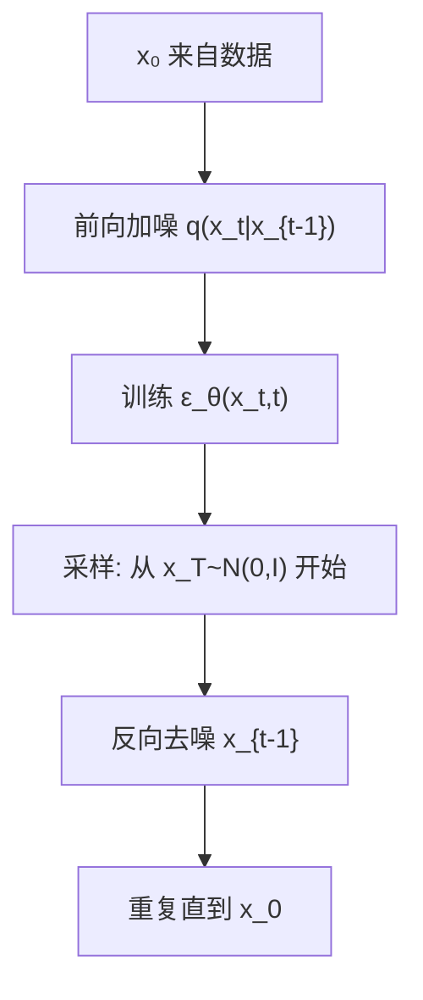

图表来源
- [phases/08-generative-ai/06-diffusion-ddpm-from-scratch/docs/en.md](file://phases/08-generative-ai/06-diffusion-ddpm-from-scratch/docs/en.md)

章节来源
- [phases/08-generative-ai/06-diffusion-ddpm-from-scratch/docs/en.md](file://phases/08-generative-ai/06-diffusion-ddpm-from-scratch/docs/en.md)

### 组件D：潜空间扩散与Stable Diffusion
- 核心思想：在VAE潜空间中进行扩散，大幅降低计算与内存开销；文本通过冻结CLIP编码并通过交叉注意力注入。
- 架构演进：SD1.5/U-Net → SDXL/U-Net+Refiner → SD3/MMDiT（多模态DiT）→ Flux.1（更大DiT）。
- 关键技术：CFG（分类器自由引导）、文本嵌入跨注意力、VAE缩放因子、负提示处理。
- 生产部署：量化（4-bit）、CPU卸载、交错加载以适配消费级GPU。

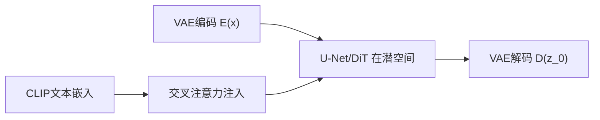

图表来源
- [phases/08-generative-ai/07-latent-diffusion-stable-diffusion/docs/en.md](file://phases/08-generative-ai/07-latent-diffusion-stable-diffusion/docs/en.md)

章节来源
- [phases/08-generative-ai/07-latent-diffusion-stable-diffusion/docs/en.md](file://phases/08-generative-ai/07-latent-diffusion-stable-diffusion/docs/en.md)

### 组件E：控制与微调（ControlNet/LoRA）
- ControlNet：克隆U-Net编码器分支，以零卷积连接到原解码器，读取深度/边缘/姿态等条件，实现空间结构可控。
- LoRA：在注意力层引入低秩增量 ΔW=B@A，参数量远小于全量微调，支持在线切换与权重合并。
- IP-Adapter：以图像参考作为条件，将图像tokens注入交叉注意力，无需LoRA即可风格迁移。
- 生产要点：热交换LoRA、ControlNet并行通道、量化LoRA以支持多租户服务。

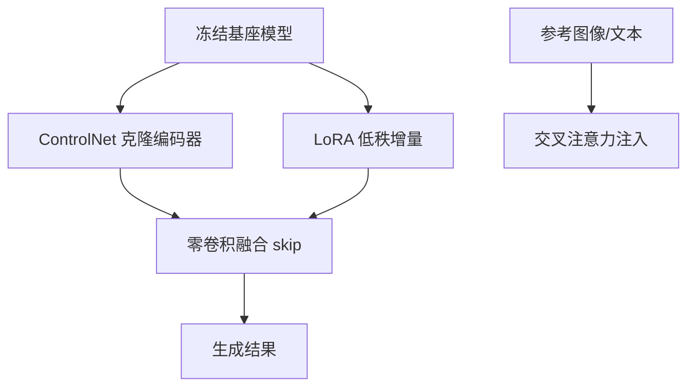

图表来源
- [phases/08-generative-ai/08-controlnet-lora-conditioning/docs/en.md](file://phases/08-generative-ai/08-controlnet-lora-conditioning/docs/en.md)

章节来源
- [phases/08-generative-ai/08-controlnet-lora-conditioning/docs/en.md](file://phases/08-generative-ai/08-controlnet-lora-conditioning/docs/en.md)

### 组件F：图像修复与编辑（Inpainting/Outpainting/SDEdit）
- 9通道U-Net：将“噪声潜像+编码源+掩码”拼接为输入，训练仅去噪掩码区域。
- SDEdit：从中间时间步加噪再反演，平衡保真与创意；起始t越高保真越低、创意越高。
- Outpainting：掩码反转，扩展画布；RePaint：周期性回噪减少边界伪影。
- 生产注意：掩码膨胀、CFG与掩码大小交互、SAM掩码生成延迟。

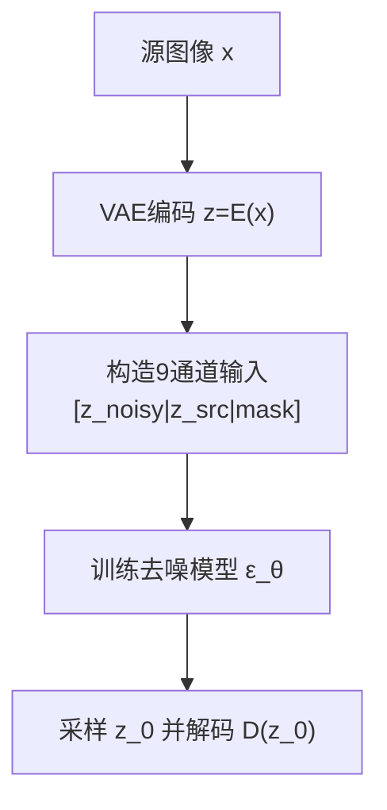

图表来源
- [phases/08-generative-ai/09-inpainting-outpainting-editing/docs/en.md](file://phases/08-generative-ai/09-inpainting-outpainting-editing/docs/en.md)

章节来源
- [phases/08-generative-ai/09-inpainting-outpainting-editing/docs/en.md](file://phases/08-generative-ai/09-inpainting-outpainting-editing/docs/en.md)

### 组件G：视频生成
- 思路：3D VAE将视频压缩为时空补丁序列，DiT在时空位置嵌入上进行注意力，文本通过T5等编码器条件化。
- 关注点：时空注意力分解（空间+时间）以避免全3D注意力爆炸；首帧条件、关键帧锚定、caption细节决定质量。
- 生产注意：显存带宽瓶颈；TP并行、连续批处理、首帧预填充缓存。

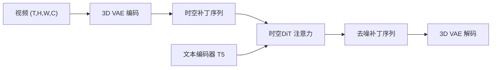

图表来源
- [phases/08-generative-ai/10-video-generation/docs/en.md](file://phases/08-generative-ai/10-video-generation/docs/en.md)

章节来源
- [phases/08-generative-ai/10-video-generation/docs/en.md](file://phases/08-generative-ai/10-video-generation/docs/en.md)

### 组件H：音频生成
- 思路：神经编解码（如Encodec）将波形压缩为离散令牌（50-75Hz），随后用自回归Transformer或潜空间扩散/流匹配生成令牌。
- 现状：音乐偏向流匹配（更快采样），语音仍以自回归为主（因果性强、易流式）。
- 关注点：编解码质量上限、RVQ误差累积、长序列结构、边界伪影与版权问题。

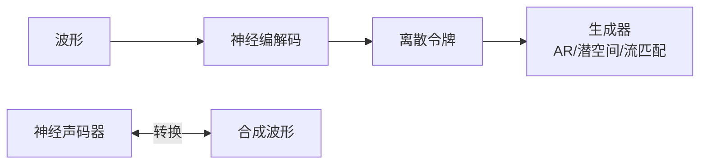

图表来源
- [phases/08-generative-ai/11-audio-generation/docs/en.md](file://phases/08-generative-ai/11-audio-generation/docs/en.md)

章节来源
- [phases/08-generative-ai/11-audio-generation/docs/en.md](file://phases/08-generative-ai/11-audio-generation/docs/en.md)

### 组件I：3D生成
- 思路：多视角扩散生成一致视图，随后拟合3D表示（高斯点阵/NeRF/三角网格）。
- 表示法：3DGS（59参数/高斯，可微合成渲染）、NeRF（MLP体积渲染）、Triplane（特征平面）。
- 关注点：视角一致性、背侧幻觉、高斯爆炸与拓扑问题、训练数据许可。

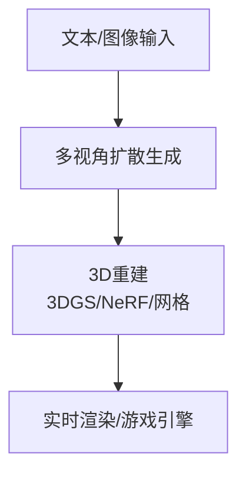

图表来源
- [phases/08-generative-ai/12-3d-generation/docs/en.md](file://phases/08-generative-ai/12-3d-generation/docs/en.md)

章节来源
- [phases/08-generative-ai/12-3d-generation/docs/en.md](file://phases/08-generative-ai/12-3d-generation/docs/en.md)

### 组件J：流匹配与修正流
- 核心思想：以直线路线 x_t=(1−t)x₀+t x₁ 定义目标速度 v_θ(x,t)=x₁−x₀，训练向量场并在推理时欧拉积分。
- 优势：训练无须解ODE、更好损失几何、更快推理（2-4步，甚至1步一致性蒸馏）。
- 与扩散的关系：在高斯路径下等价于扩散的Stratonovich重表述；可结合CFG（v-CFG）。

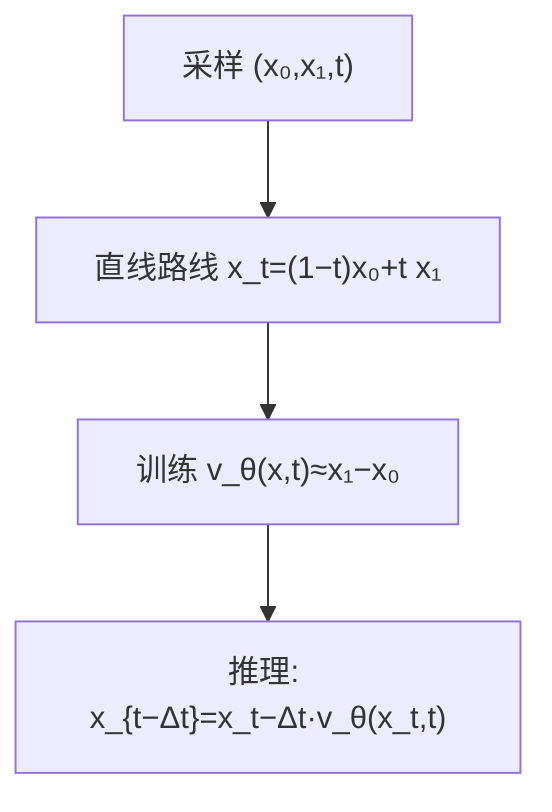

图表来源
- [phases/08-generative-ai/13-flow-matching-rectified-flows/docs/en.md](file://phases/08-generative-ai/13-flow-matching-rectified-flows/docs/en.md)

章节来源
- [phases/08-generative-ai/13-flow-matching-rectified-flows/docs/en.md](file://phases/08-generative-ai/13-flow-matching-rectified-flows/docs/en.md)

### 组件K：评估指标（FID/CLIP/人类偏好）
- FID：Inception特征空间双高斯的Fréchet距离，样本质量指标；需大N、领域匹配、避免对Inception先验过拟合。
- CLIP Score：图像CLIP特征与文本特征余弦相似度，衡量提示遵循；易被提示膨胀与短提示偏置。
- 人类偏好：盲测胜率（Elo/Bradley-Terry），结合自动代理（HPSv2、ImageReward、PickScore）。
- 生产注意：离线批量评估、缓存真实特征、CI回归门禁。

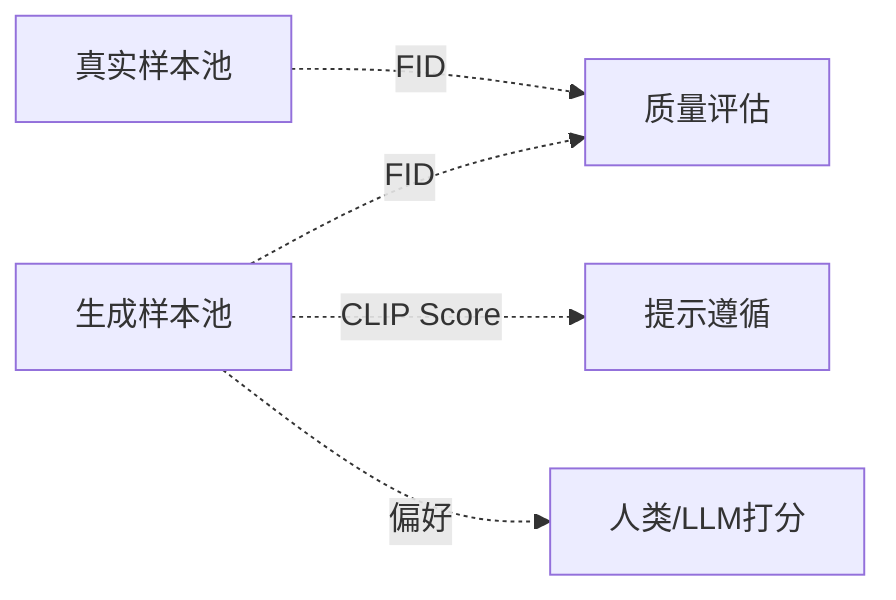

图表来源
- [phases/08-generative-ai/14-evaluation-fid-clip-score/docs/en.md](file://phases/08-generative-ai/14-evaluation-fid-clip-score/docs/en.md)

章节来源
- [phases/08-generative-ai/14-evaluation-fid-clip-score/docs/en.md](file://phases/08-generative-ai/14-evaluation-fid-clip-score/docs/en.md)

## 依赖关系分析
- 模型家族依赖：VAE是扩散/流匹配的前置；GAN可作为蒸馏教师或感知损失来源；流匹配/修正流在相同训练目标下替代扩散采样路径。
- 技术耦合：ControlNet/LoRA/文本条件在潜空间扩散中组合使用；视频/音频/3D均复用扩散损失与DiT/编解码范式。
- 生产耦合：量化、CPU卸载、TP并行、KV缓存式预填充等通用优化在各模态中复用。

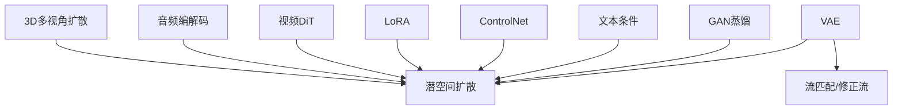

图表来源
- [phases/08-generative-ai/02-autoencoders-vae/docs/en.md](file://phases/08-generative-ai/02-autoencoders-vae/docs/en.md)
- [phases/08-generative-ai/07-latent-diffusion-stable-diffusion/docs/en.md](file://phases/08-generative-ai/07-latent-diffusion-stable-diffusion/docs/en.md)
- [phases/08-generative-ai/08-controlnet-lora-conditioning/docs/en.md](file://phases/08-generative-ai/08-controlnet-lora-conditioning/docs/en.md)
- [phases/08-generative-ai/10-video-generation/docs/en.md](file://phases/08-generative-ai/10-video-generation/docs/en.md)
- [phases/08-generative-ai/11-audio-generation/docs/en.md](file://phases/08-generative-ai/11-audio-generation/docs/en.md)
- [phases/08-generative-ai/12-3d-generation/docs/en.md](file://phases/08-generative-ai/12-3d-generation/docs/en.md)

章节来源
- [phases/08-generative-ai/01-generative-models-taxonomy-history/docs/en.md](file://phases/08-generative-ai/01-generative-models-taxonomy-history/docs/en.md)
- [phases/08-generative-ai/07-latent-diffusion-stable-diffusion/docs/en.md](file://phases/08-generative-ai/07-latent-diffusion-stable-diffusion/docs/en.md)

## 性能考量
- 推理成本拆分：自回归/令牌AR类（LLM式prefill+decode）、VAE/扩散/流匹配类（num_steps×单步成本）、GAN类（一次前向TTFT≈总时延）。
- 采样步数优化：DDIM/DPM-Solver/UniPC降步数；蒸馏/一致性模型进一步降至1-4步；流匹配/修正流以直线路线显著提速。
- 生产优化：bf16/fp8/int4量化、CPU卸载、TP并行、连续批处理、KV缓存式预填充、静态批量化。
- 多模态瓶颈：视频以带宽为主（HBM移动量大）；音频以TPOT（每输出token时延）为主；3D多阶段（扩散+重建）需分离GPU与离线优化。

## 故障排查指南
- VAE相关：后验坍缩（β退火/自由位/活跃维KL）、模糊样本（离散解码器/VQ-VAE）、潜维过小。
- GAN相关：判别器过强（降低学习率/加噪声）、模式崩溃（BN替换/最小批次判别）、训练不稳定（学习率/批大小调整）。
- 扩散相关：β调度不当（线性→余弦）、时间步嵌入脆弱（正弦/FiLM）、预测目标选择（ε/v）、CFG过高导致过锐化。
- 流匹配相关：时间参数化混淆（t∈[0,1]方向一致）、重排迭代成本（仅在需要1-2步时做）、v-CFG与ε-CFG等价但变量不同。
- 评估相关：小N偏差（FID≥10k）、领域不匹配（Inception→FD-DINO）、提示偏置（短提示/提示膨胀）、LLM判别器奖励黑客（三角验证）。

章节来源
- [phases/08-generative-ai/02-autoencoders-vae/docs/en.md](file://phases/08-generative-ai/02-autoencoders-vae/docs/en.md)
- [phases/08-generative-ai/03-gans-generator-discriminator/docs/en.md](file://phases/08-generative-ai/03-gans-generator-discriminator/docs/en.md)
- [phases/08-generative-ai/06-diffusion-ddpm-from-scratch/docs/en.md](file://phases/08-generative-ai/06-diffusion-ddpm-from-scratch/docs/en.md)
- [phases/08-generative-ai/13-flow-matching-rectified-flows/docs/en.md](file://phases/08-generative-ai/13-flow-matching-rectified-flows/docs/en.md)
- [phases/08-generative-ai/14-evaluation-fid-clip-score/docs/en.md](file://phases/08-generative-ai/14-evaluation-fid-clip-score/docs/en.md)

## 结论
本课程以“从零实现DDPM”为锚点，贯通VAE、GAN、扩散、流匹配/修正流、多模态生成与评估体系，帮助学习者建立完整的生成式AI知识框架与工程能力。随着流匹配范式的普及与蒸馏技术的发展，生成效率与质量同步提升；在创意产业与科研探索中，生成式AI正成为从原型设计到世界模拟的重要工具。

## 附录
- 术语速查：显式/隐式密度、ELBO、Score、Manifold假设、Autoregressive、Latent、Flow Matching、Rectified Flow、FID、CLIP Score、人类偏好。
- 进一步阅读：各单元末尾列出的经典论文与生产资料链接，便于深入学习与工程落地。