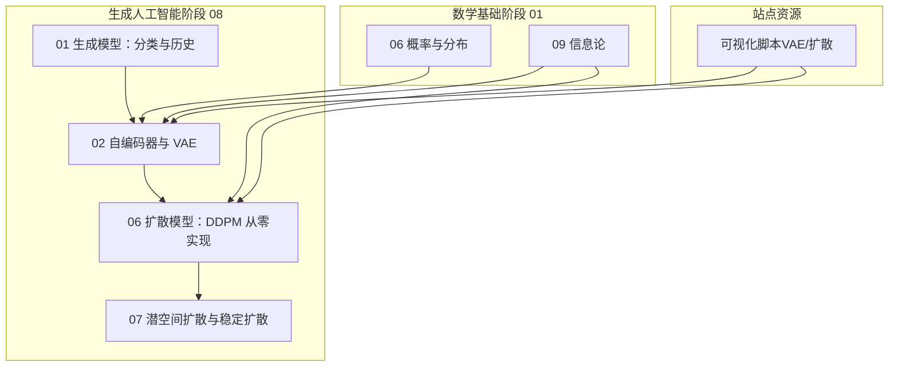
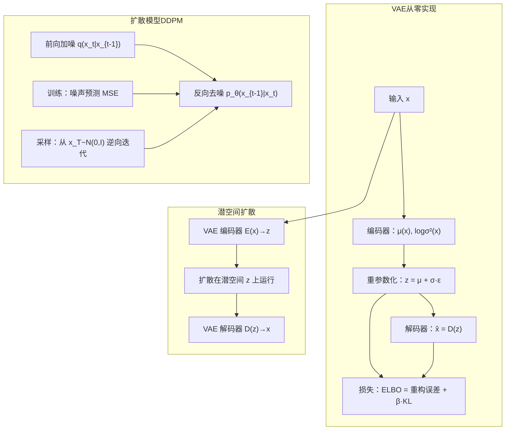
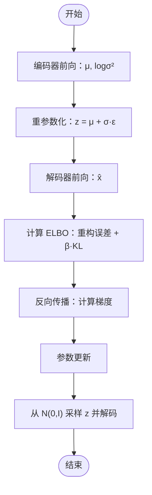
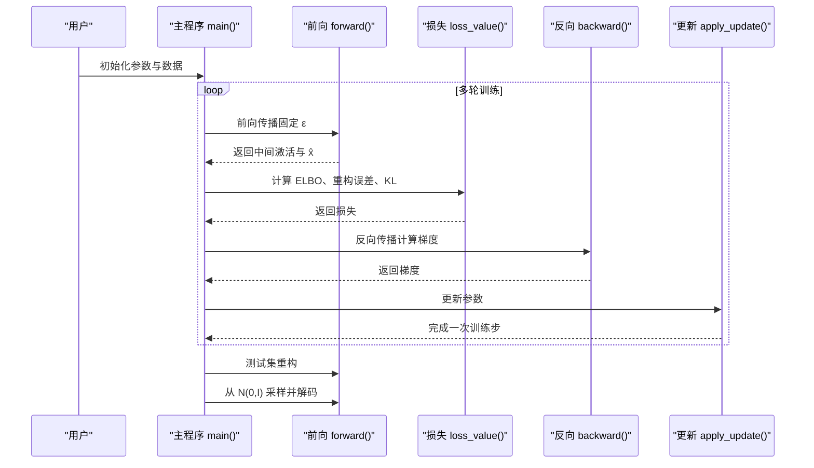
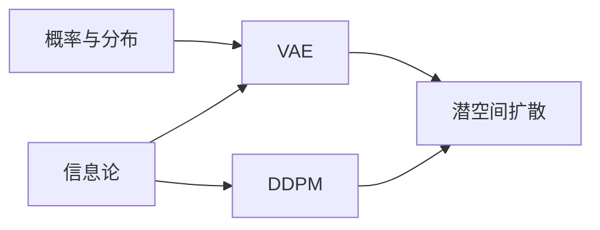

# 生成模型基础理论

<cite>
**本文档引用的文件**
- [生成模型：分类与历史（英文）](file://phases/08-generative-ai/01-generative-models-taxonomy-history/docs/en.md)
- [生成模型：分类与历史（中文）](file://phases/08-generative-ai/01-generative-models-taxonomy-history/docs/zh.md)
- [VAE：自编码器与变分自编码器（英文）](file://phases/08-generative-ai/02-autoencoders-vae/docs/en.md)
- [VAE：自编码器与变分自编码器（中文）](file://phases/08-generative-ai/02-autoencoders-vae/docs/zh.md)
- [VAE：从零实现（主程序）](file://phases/08-generative-ai/02-autoencoders-vae/code/main.py)
- [VAE：技能模板（训练师）](file://phases/08-generative-ai/02-autoencoders-vae/outputs/skill-vae-trainer.md)
- [扩散模型：DDPM 从零实现（英文）](file://phases/08-generative-ai/06-diffusion-ddpm-from-scratch/docs/en.md)
- [潜空间扩散与稳定扩散（英文）](file://phases/08-generative-ai/07-latent-diffusion-stable-diffusion/docs/en.md)
- [概率与分布（英文）](file://phases/01-math-foundations/06-probability-and-distributions/docs/en.md)
- [信息论（英文）](file://phases/01-math-foundations/09-information-theory/docs/en.md)
- [信息论（练习与答案）](file://phases/01-math-foundations/09-information-theory/outputs/skill-information-theory.md)
- [术语表（英文）](file://glossary/terms.md)
- [术语表（中文）](file://glossary/terms.zh.md)
- [站点数据（可视化脚本）](file://site/figures-genai-rl.js)
- [路线图（阶段 8）](file://ROADMAP.md)
</cite>

## 目录
1. [引言](#引言)
2. [项目结构](#项目结构)
3. [核心组件](#核心组件)
4. [架构总览](#架构总览)
5. [详细组件分析](#详细组件分析)
6. [依赖关系分析](#依赖关系分析)
7. [性能考量](#性能考量)
8. [故障排查指南](#故障排查指南)
9. [结论](#结论)
10. [附录](#附录)

## 引言
本文件系统性梳理生成模型的基础理论与实践路径，覆盖从传统概率图模型到现代深度生成模型的发展脉络，并深入讲解变分自编码器（VAE）的数学原理、架构设计与实现细节。文档同时提供从零实现 VAE 的完整流程、损失函数与训练策略说明、重构质量评估方法，以及 VAE 在图像生成、特征学习与数据压缩中的应用范式。目标是帮助读者建立坚实的理论基础，为后续学习扩散模型、流匹配等高级生成模型做好铺垫。

## 项目结构
本仓库围绕“生成人工智能”主题构建了完整的进阶课程体系，其中与本主题直接相关的内容主要分布在以下模块：
- 阶段 08 生成人工智能：包含生成模型分类与历史、VAE 实现、扩散模型、潜空间扩散与稳定扩散、评估指标等
- 阶段 01 数学基础：概率论与信息论为 VAE、扩散模型等提供理论支撑
- 站点资源：包含可视化脚本，直观展示 VAE 潜空间与扩散过程

**图表来源**
- [生成模型：分类与历史（英文）:1-135](file://phases/08-generative-ai/01-generative-models-taxonomy-history/docs/en.md#L1-L135)
- [VAE：自编码器与变分自编码器（英文）:1-157](file://phases/08-generative-ai/02-autoencoders-vae/docs/en.md#L1-L157)
- [扩散模型：DDPM 从零实现（英文）:1-186](file://phases/08-generative-ai/06-diffusion-ddpm-from-scratch/docs/en.md#L1-L186)
- [潜空间扩散与稳定扩散（英文）:1-150](file://phases/08-generative-ai/07-latent-diffusion-stable-diffusion/docs/en.md#L1-L150)
- [概率与分布（英文）:1-459](file://phases/01-math-foundations/06-probability-and-distributions/docs/en.md#L1-L459)
- [信息论（英文）:1-472](file://phases/01-math-foundations/09-information-theory/docs/en.md#L1-L472)
- [站点数据（可视化脚本）:112-136](file://site/figures-genai-rl.js#L112-L136)

**章节来源**
- [路线图（阶段 8）:206-224](file://ROADMAP.md#L206-L224)

## 核心组件
- 生成模型分类与历史：明确五大家族（显式密度可求、显式密度近似、隐式密度、基于得分/连续时间、离散标记自回归）及其权衡，奠定选型与工程决策基础。
- VAE：以重参数化技巧为核心，将采样节点变为可微计算图的一部分，通过 ELBO 优化实现编码器输出分布向先验的正则化，形成可采样的平滑潜空间。
- 扩散模型（DDPM）：通过前向加噪与反向去噪的马尔可夫链定义训练目标，以噪声预测损失实现稳定的单步训练；潜空间扩散将计算瓶颈迁移到 VAE 压缩后的低维潜空间。
- 数学基础：概率论（贝叶斯、期望、方差、正态分布）、信息论（熵、交叉熵、KL 散度、困惑度）为 VAE 与扩散模型提供统一的语言与工具。

**章节来源**
- [生成模型：分类与历史（英文）:18-61](file://phases/08-generative-ai/01-generative-models-taxonomy-history/docs/en.md#L18-L61)
- [VAE：自编码器与变分自编码器（英文）:10-44](file://phases/08-generative-ai/02-autoencoders-vae/docs/en.md#L10-L44)
- [扩散模型：DDPM 从零实现（英文）:10-62](file://phases/08-generative-ai/06-diffusion-ddpm-from-scratch/docs/en.md#L10-L62)
- [潜空间扩散与稳定扩散（英文）:10-31](file://phases/08-generative-ai/07-latent-diffusion-stable-diffusion/docs/en.md#L10-L31)
- [概率与分布（英文）:17-45](file://phases/01-math-foundations/06-probability-and-distributions/docs/en.md#L17-L45)
- [信息论（英文）:25-96](file://phases/01-math-foundations/09-information-theory/docs/en.md#L25-L96)

## 架构总览
下图展示了从零实现 VAE 的端到端流程，以及其与扩散模型的关系：VAE 负责将高维数据压缩到平滑潜空间，扩散模型在潜空间内进行高效生成，最终由 VAE 解码器重建像素或更高分辨率表示。

**图表来源**
- [VAE：自编码器与变分自编码器（英文）:20-44](file://phases/08-generative-ai/02-autoencoders-vae/docs/en.md#L20-L44)
- [扩散模型：DDPM 从零实现（英文）:16-45](file://phases/08-generative-ai/06-diffusion-ddpm-from-scratch/docs/en.md#L16-L45)
- [潜空间扩散与稳定扩散（英文）:18-31](file://phases/08-generative-ai/07-latent-diffusion-stable-diffusion/docs/en.md#L18-L31)

## 详细组件分析

### VAE：理论基础与实现要点
- 编码器-解码器架构
  - 编码器输出参数化的后验分布 q(z|x)，通常为对角高斯（μ(x), logσ²(x)），并通过重参数化技巧将采样变为可微路径。
  - 解码器将潜变量 z 映射回观测空间 x，常用高斯似然（均方误差）或伯努利似然（二值化数据）。
- 重参数化技巧
  - 将 z = μ + σ·ε 重写为确定性函数加上纯噪声 ε，使梯度可通过 μ 与 σ 流动，从而用标准反向传播训练。
- KL 散度正则化
  - 通过 ELBO 中的 KL[q(z|x) || p(z)] 将后验拉向先验 p(z)=N(0,I)，促使潜空间平滑且可采样。
- 损失函数与训练策略
  - 总损失 = 重构误差 + β·KL。β 控制重构保真与先验正则之间的权衡；β 过大易模糊，过小易崩溃。
  - 可采用 β-退火（从较小值逐步增大）缓解后验坍塌；根据数据维度选择合适的潜维数。
- 从零实现 VAE 的关键步骤
  - 编码前向：隐藏层 → μ 与 logσ² 输出
  - 重参数化：从 N(0,I) 采样 ε，计算 z
  - 解码前向：隐藏层 → x̂
  - ELBO 计算：重构误差 + β·KL
  - 反向传播与参数更新
  - 采样：从 N(0,I) 采样 z，经解码器生成样本

**图表来源**
- [VAE：自编码器与变分自编码器（英文）:49-93](file://phases/08-generative-ai/02-autoencoders-vae/docs/en.md#L49-L93)
- [VAE：从零实现（主程序）:48-125](file://phases/08-generative-ai/02-autoencoders-vae/code/main.py#L48-L125)

**章节来源**
- [VAE：自编码器与变分自编码器（英文）:10-93](file://phases/08-generative-ai/02-autoencoders-vae/docs/en.md#L10-L93)
- [VAE：从零实现（主程序）:1-202](file://phases/08-generative-ai/02-autoencoders-vae/code/main.py#L1-L202)

### VAE 的数学原理与信息论联系
- ELBO 的推导与意义
  - 对任意 q(z|x)，有 log p(x) ≥ E_q[log p(x,z)/p(z|q)] = E_q[log p(x|z) + log p(z) - log q(z|x)]。当 q=p(z|x) 时等号成立，此时下界紧致。
- KL 散度的角色
  - KL[q(z|x) || p(z)] 衡量后验偏离先验的程度；在 VAE 中作为正则项，约束编码器输出分布，避免后验坍塌。
- 交叉熵与负对数似然
  - 分类/二值化任务中，交叉熵损失等价于最大化对数似然；在 VAE 中，重构误差常采用 MSE 或伯努利交叉熵。
- 困惑度（Perplexity）
  - 语言模型常用困惑度衡量平均不确定性；在 VAE 评估中可类比为对重构不确定性的度量。

**章节来源**
- [信息论（英文）:66-96](file://phases/01-math-foundations/09-information-theory/docs/en.md#L66-L96)
- [信息论（英文）:233-250](file://phases/01-math-foundations/09-information-theory/docs/en.md#L233-L250)
- [概率与分布（英文）:177-194](file://phases/01-math-foundations/06-probability-and-distributions/docs/en.md#L177-L194)

### VAE 的应用范式
- 图像生成与特征学习
  - 通过平滑潜空间，VAE 可用于插值、语义编辑与无监督特征提取；在高分辨率场景常作为潜空间扩散的编码器。
- 数据压缩
  - VAE 的编码器将高维数据映射到低维潜变量，实现有损压缩；解码器负责重建。
- 与扩散模型的组合
  - 潜空间扩散将扩散训练与推理迁移到压缩后的低维潜空间，显著降低计算成本；文本条件通过跨注意力注入。

**章节来源**
- [潜空间扩散与稳定扩散（英文）:10-31](file://phases/08-generative-ai/07-latent-diffusion-stable-diffusion/docs/en.md#L10-L31)
- [生成模型：分类与历史（英文）:24-30](file://phases/08-generative-ai/01-generative-models-taxonomy-history/docs/en.md#L24-L30)

### 从零实现 VAE 的完整流程（代码级）
- 数据与网络初始化
  - 输入维度、隐藏维度、潜变量维度设置；随机初始化编码器与解码器参数。
- 前向传播
  - 编码器：tanh 隐藏层 → 线性层得到 μ 与 logσ²；裁剪 logσ² 防止数值不稳定；重参数化得到 z；解码器：tanh 隐藏层 → 线性层得到 x̂。
- 损失计算
  - 重构误差（MSE）与 KL 散度（高斯解析形式）之和；返回总损失、重构误差与 KL。
- 反向传播
  - 手写反向传播：对解码器与编码器分别计算梯度；注意重参数化对 μ 与 logσ² 的梯度贡献。
- 参数更新
  - 使用学习率进行梯度下降更新。
- 评估与采样
  - 在测试集上计算重构 MSE；从 N(0,I) 采样若干 z，观察解码结果是否保留数据簇结构。

**图表来源**
- [VAE：从零实现（主程序）:48-125](file://phases/08-generative-ai/02-autoencoders-vae/code/main.py#L48-L125)
- [VAE：从零实现（主程序）:156-198](file://phases/08-generative-ai/02-autoencoders-vae/code/main.py#L156-L198)

**章节来源**
- [VAE：从零实现（主程序）:1-202](file://phases/08-generative-ai/02-autoencoders-vae/code/main.py#L1-L202)

### VAE 训练策略与评估指标（技能模板）
- 架构选择：根据模态与下游用途选择普通 VAE、β-VAE、VQ-VAE、RVQ 或 NVAE，并给出参考权重与拓扑建议。
- 潜空间设计：给出空间分辨率、通道数、总比特与压缩比；强调 β 调度（预热、最终值、自由位）与评估计划（重构 MSE/SSIM/PSNR、KL 每维、活跃维度、后验坍塌预警、Frobenius 距离）。
- 工程约束：禁止起始 β>0.5；禁止将纯高斯 VAE 作为图像最终生成器（需配合扩散/流匹配）；若 VQ-VAE 使用率低于阈值，需检查码本重置策略。

**章节来源**
- [VAE：技能模板（训练师）:10-19](file://phases/08-generative-ai/02-autoencoders-vae/outputs/skill-vae-trainer.md#L10-L19)

### 扩散模型（DDPM）与潜空间扩散
- DDPM 核心
  - 前向过程 q：在 T 步内将数据逐步加噪声，闭式解保证累积噪声仍为高斯；反向过程 pθ：预测噪声并逐步去噪；训练损失为噪声预测的 MSE。
- 潜空间扩散
  - 先用 VAE 编码器将像素空间压缩到低维潜空间，扩散在潜空间进行，再用 VAE 解码器重建；显著降低计算与内存开销。
- 生产推理
  - 推理步数（如 DDIM/DPM-Solver/蒸馏）与精度（bf16/fp8/int4）是关键调优点；VAE 解码阶段常为激活峰值所在。

**章节来源**
- [扩散模型：DDPM 从零实现（英文）:10-62](file://phases/08-generative-ai/06-diffusion-ddpm-from-scratch/docs/en.md#L10-L62)
- [潜空间扩散与稳定扩散（英文）:10-31](file://phases/08-generative-ai/07-latent-diffusion-stable-diffusion/docs/en.md#L10-L31)

## 依赖关系分析
- 理论依赖
  - VAE 依赖概率论与信息论：贝叶斯公式、KL 散度、交叉熵、熵与困惑度。
  - 扩散模型依赖马尔可夫链与变分推导：前向/反向过程、ELBO 简化为噪声预测 MSE。
- 实践依赖
  - VAE 与扩散模型共享相同的训练目标思想（ELBO 下界）与优化范式（单步损失、可微采样）。
  - 潜空间扩散将 VAE 作为第一阶段压缩器，扩散作为第二阶段生成器，形成两级流水线。

**图表来源**
- [概率与分布（英文）:17-45](file://phases/01-math-foundations/06-probability-and-distributions/docs/en.md#L17-L45)
- [信息论（英文）:25-96](file://phases/01-math-foundations/09-information-theory/docs/en.md#L25-L96)
- [VAE：自编码器与变分自编码器（英文）:10-44](file://phases/08-generative-ai/02-autoencoders-vae/docs/en.md#L10-L44)
- [扩散模型：DDPM 从零实现（英文）:16-45](file://phases/08-generative-ai/06-diffusion-ddpm-from-scratch/docs/en.md#L16-L45)
- [潜空间扩散与稳定扩散（英文）:18-31](file://phases/08-generative-ai/07-latent-diffusion-stable-diffusion/docs/en.md#L18-L31)

**章节来源**
- [信息论（英文）:233-250](file://phases/01-math-foundations/09-information-theory/docs/en.md#L233-L250)
- [扩散模型：DDPM 从零实现（英文）:36-62](file://phases/08-generative-ai/06-diffusion-ddpm-from-scratch/docs/en.md#L36-L62)

## 性能考量
- VAE
  - 解码阶段内存峰值高，尤其在高分辨率时；生产中可启用切片与平铺（slicing/tiling）降低显存占用；注意 bf16/fp32 数值稳定性。
- 扩散模型
  - 推理步数是主要性能瓶颈；可采用更快采样器（DDIM/DPM-Solver）、蒸馏或编译加速；跨注意力与高分辨率带来显著算力消耗。
- 组合系统
  - VAE + 潜空间扩散的两阶段管线在推理时需平衡两阶段延迟与吞吐；优先优化解码器与扩散 U-Net 的混合精度与缓存策略。

**章节来源**
- [VAE：自编码器与变分自编码器（英文）:142-148](file://phases/08-generative-ai/02-autoencoders-vae/docs/en.md#L142-L148)
- [潜空间扩散与稳定扩散（英文）:131-140](file://phases/08-generative-ai/07-latent-diffusion-stable-diffusion/docs/en.md#L131-L140)
- [扩散模型：DDPM 从零实现（英文）:167-176](file://phases/08-generative-ai/06-diffusion-ddpm-from-scratch/docs/en.md#L167-L176)

## 故障排查指南
- 后验坍塌（Posterior Collapse）
  - 症状：KL 项主导导致编码器忽略输入，仅输出先验；解码器被迫“凭空生成”。
  - 处理：采用 β-退火（从 0 渐增至目标值）、引入自由位（free bits）或按维度屏蔽 KL。
- 样本模糊
  - 症状：高斯解码似然下的 MSE 导致平均化模糊。
  - 处理：改用离散解码（VQ-VAE/NVAE）或将 VAE 仅作为编码器，叠加扩散/流匹配在潜空间。
- 潜空间维度不足
  - 症状：重构误差大、语义表达受限。
  - 处理：根据数据规模与分辨率提升潜维数（如 ImageNet 512² 需更大潜维）。
- VAE 作为图像生成器的限制
  - 禁止将纯高斯 VAE 作为最终图像生成器；应将其作为潜空间编码器，配合扩散/流匹配生成器。

**章节来源**
- [VAE：自编码器与变分自编码器（英文）:95-101](file://phases/08-generative-ai/02-autoencoders-vae/docs/en.md#L95-L101)
- [VAE：技能模板（训练师）:18-19](file://phases/08-generative-ai/02-autoencoders-vae/outputs/skill-vae-trainer.md#L18-L19)

## 结论
本文件从理论与实践双视角系统阐述了生成模型的发展脉络与 VAE 的核心机制。通过对重参数化、ELBO、KL 正则与从零实现 VAE 的深入剖析，读者可掌握从数据压缩到可采样潜空间的关键技术路径，并理解 VAE 与扩散模型在现代生成系统中的协同作用。建议在实践中结合 β-退火、潜维规划与评估指标，持续迭代以获得高质量的重构与生成效果。

## 附录
- 关键术语速查
  - 生成模型、显式密度、隐式密度、ELBO、重参数化、先验、后验坍塌、β-VAE、VQ-VAE、扩散模型、DDPM、潜空间扩散、困惑度（Perplexity）

**章节来源**
- [术语表（英文）:364-366](file://glossary/terms.md#L364-L366)
- [术语表（中文）:364-366](file://glossary/terms.zh.md#L364-L366)
- [信息论（英文）:452-466](file://phases/01-math-foundations/09-information-theory/docs/en.md#L452-L466)