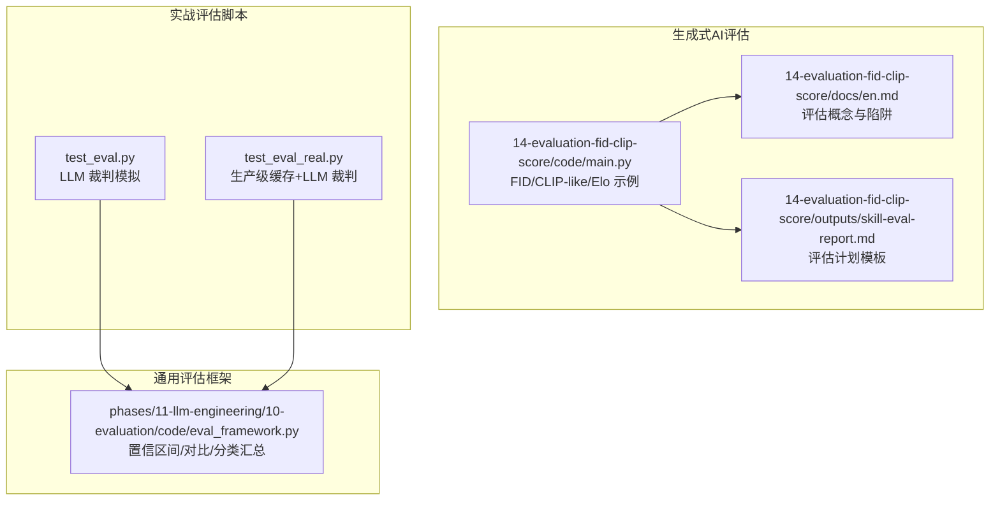
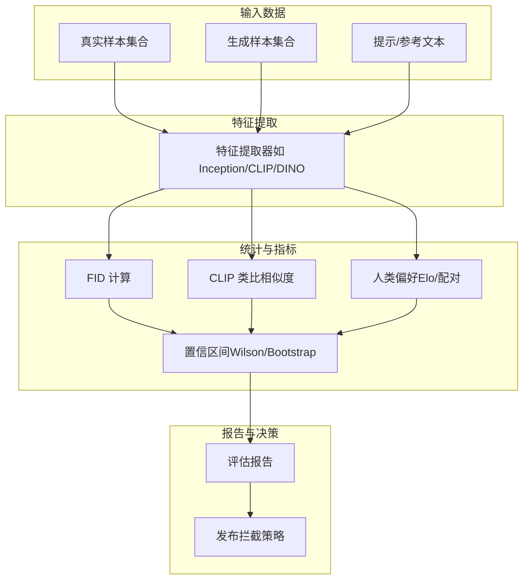
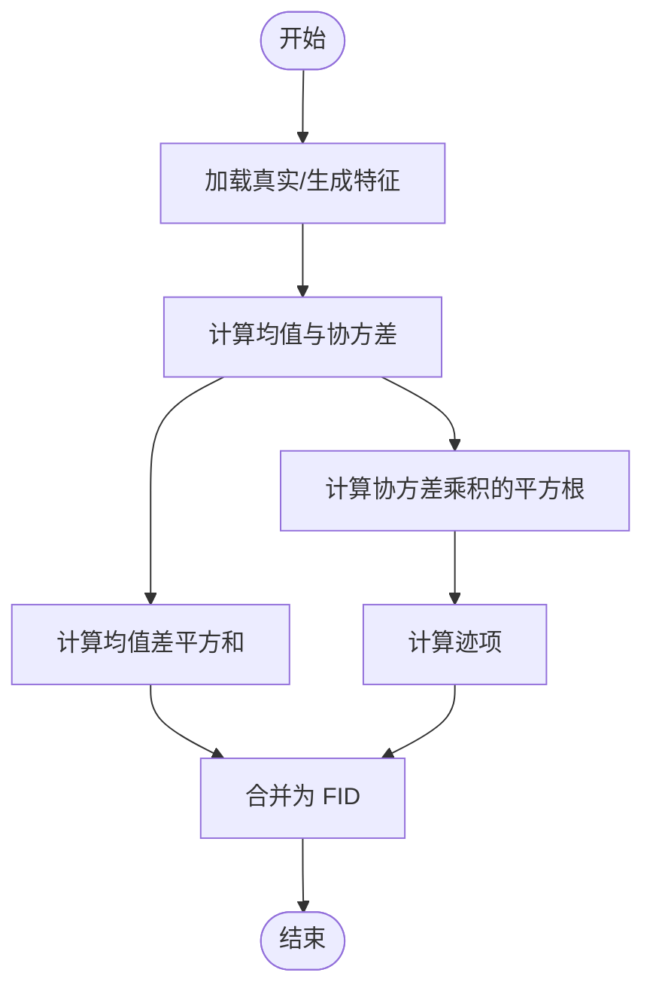
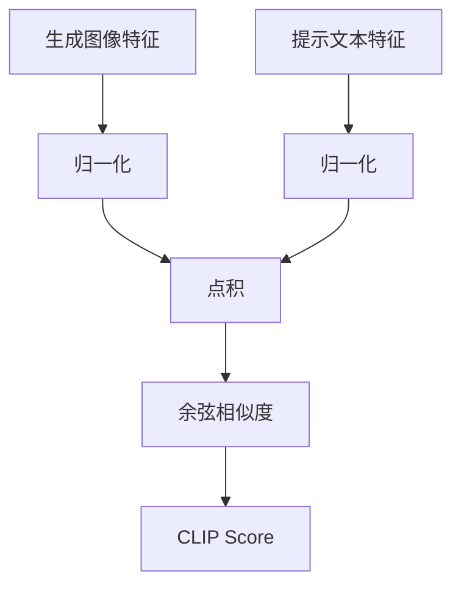
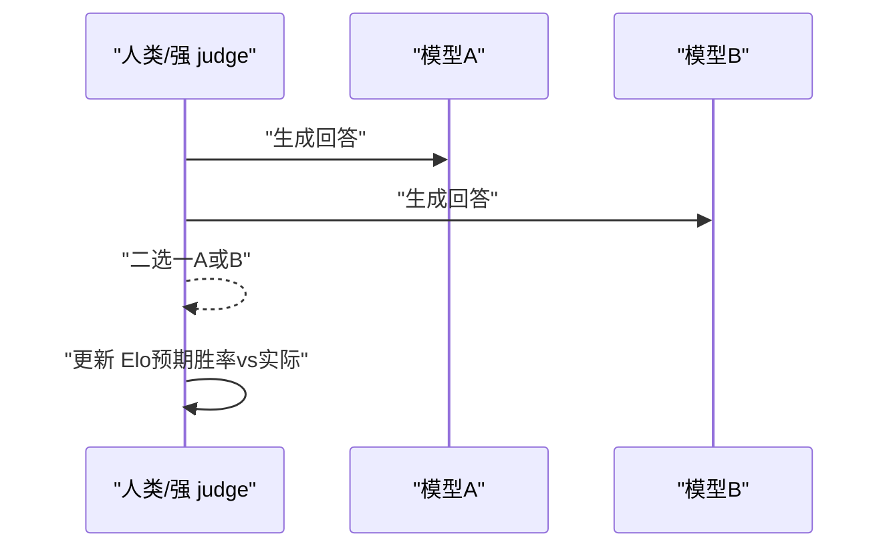
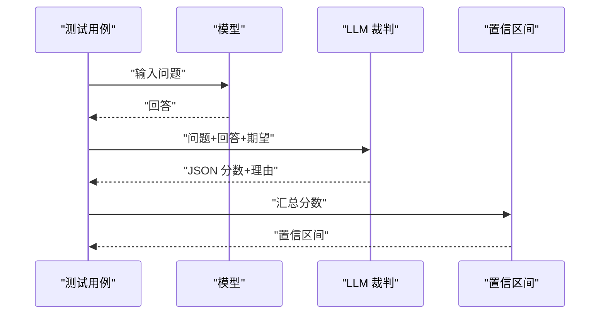
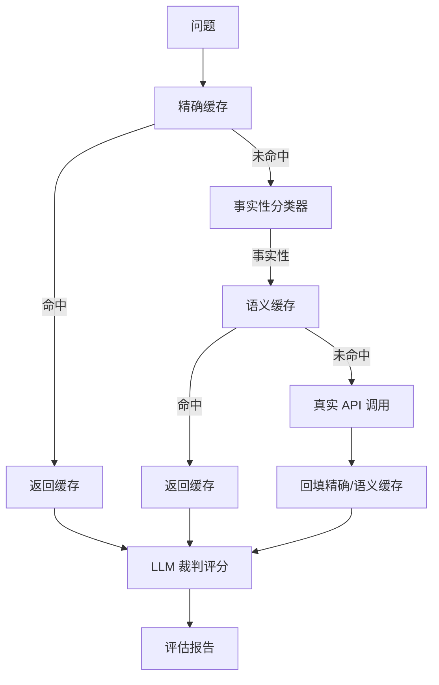
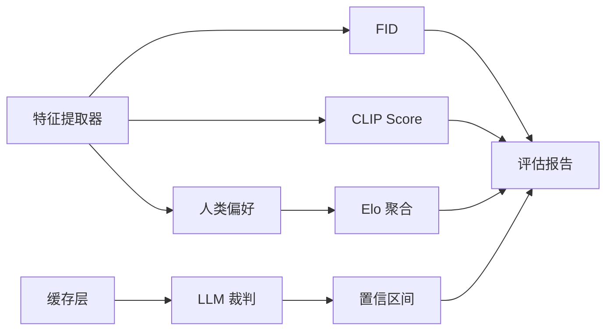

# 生成模型评估

<cite>
**本文档引用的文件**
- [phases/08-generative-ai/14-evaluation-fid-clip-score/code/main.py](file://phases/08-generative-ai/14-evaluation-fid-clip-score/code/main.py)
- [phases/08-generative-ai/14-evaluation-fid-clip-score/docs/en.md](file://phases/08-generative-ai/14-evaluation-fid-clip-score/docs/en.md)
- [phases/08-generative-ai/14-evaluation-fid-clip-score/outputs/skill-eval-report.md](file://phases/08-generative-ai/14-evaluation-fid-clip-score/outputs/skill-eval-report.md)
- [test_eval.py](file://test_eval.py)
- [test_eval_real.py](file://test_eval_real.py)
- [phases/11-llm-engineering/10-evaluation/code/eval_framework.py](file://phases/11-llm-engineering/10-evaluation/code/eval_framework.py)
</cite>

## 目录
1. [引言](#引言)
2. [项目结构](#项目结构)
3. [核心组件](#核心组件)
4. [架构总览](#架构总览)
5. [详细组件分析](#详细组件分析)
6. [依赖分析](#依赖分析)
7. [性能考量](#性能考量)
8. [故障排查指南](#故障排查指南)
9. [结论](#结论)
10. [附录](#附录)

## 引言
本文件面向生成模型评估，系统梳理样本质量与条件遵循两大关键维度，并围绕 Fréchet Inception Distance（FID）、CLIP Score、人类偏好（Elo）等主流指标，结合仓库中的教学实现与实战脚本，给出可复用的评估工作流、报告模板与最佳实践。目标是帮助开发者在模型迭代、超参数调优与故障诊断中，基于稳健的量化指标与定性审计做出可靠决策。

## 项目结构
与生成模型评估直接相关的代码与文档主要分布在以下位置：
- 教学实现：生成式AI阶段“评估-FID-CLIP分数”章节，包含 FID、CLIP 类比相似度与 Elo 聚合的最小实现与示例。
- 实战脚本：两类评估脚本，分别演示 LLM 裁判与生产级缓存的综合评估流程。
- 评估框架：LLM 工程阶段的通用评估框架，提供置信区间、对比分析与分类汇总能力。
- 产出文档：技能型评估计划模板，定义四支柱评估的最小与推荐配置。

图示来源
- [phases/08-generative-ai/14-evaluation-fid-clip-score/code/main.py:1-147](file://phases/08-generative-ai/14-evaluation-fid-clip-score/code/main.py#L1-L147)
- [phases/08-generative-ai/14-evaluation-fid-clip-score/docs/en.md:1-184](file://phases/08-generative-ai/14-evaluation-fid-clip-score/docs/en.md#L1-L184)
- [phases/08-generative-ai/14-evaluation-fid-clip-score/outputs/skill-eval-report.md:1-20](file://phases/08-generative-ai/14-evaluation-fid-clip-score/outputs/skill-eval-report.md#L1-L20)
- [test_eval.py:1-249](file://test_eval.py#L1-L249)
- [test_eval_real.py:1-447](file://test_eval_real.py#L1-L447)
- [phases/11-llm-engineering/10-evaluation/code/eval_framework.py:1-476](file://phases/11-llm-engineering/10-evaluation/code/eval_framework.py#L1-L476)

章节来源
- [phases/08-generative-ai/14-evaluation-fid-clip-score/code/main.py:1-147](file://phases/08-generative-ai/14-evaluation-fid-clip-score/code/main.py#L1-L147)
- [phases/08-generative-ai/14-evaluation-fid-clip-score/docs/en.md:1-184](file://phases/08-generative-ai/14-evaluation-fid-clip-score/docs/en.md#L1-L184)
- [phases/08-generative-ai/14-evaluation-fid-clip-score/outputs/skill-eval-report.md:1-20](file://phases/08-generative-ai/14-evaluation-fid-clip-score/outputs/skill-eval-report.md#L1-L20)
- [test_eval.py:1-249](file://test_eval.py#L1-L249)
- [test_eval_real.py:1-447](file://test_eval_real.py#L1-L447)
- [phases/11-llm-engineering/10-evaluation/code/eval_framework.py:1-476](file://phases/11-llm-engineering/10-evaluation/code/eval_framework.py#L1-L476)

## 核心组件
- FID 计算器：在合成特征空间中拟合真实与生成分布的均值与协方差，计算 Fréchet 距离；展示小样本偏差与域适配的重要性。
- CLIP 类比相似度：将图像与文本特征归一化后计算余弦相似度，作为提示遵循度的代理指标。
- Elo 聚合：基于 Bradley-Terry 的配对胜率聚合，用于人类偏好或强 judge 的二元比较。
- LLM 裁判（模拟/真实）：对回答进行相关性、正确性、有用性、安全性四个维度打分，并输出理由与置信区间。
- 生产级缓存：精确缓存、语义缓存与事实性分类器，降低 API 调用成本并提升评估吞吐。
- 评估框架：提供置信区间估计、Bootstrap/Wilson 方法、跨版本对比与分类汇总，支持发布拦截策略。

章节来源
- [phases/08-generative-ai/14-evaluation-fid-clip-score/code/main.py:73-96](file://phases/08-generative-ai/14-evaluation-fid-clip-score/code/main.py#L73-L96)
- [phases/08-generative-ai/14-evaluation-fid-clip-score/docs/en.md:24-70](file://phases/08-generative-ai/14-evaluation-fid-clip-score/docs/en.md#L24-L70)
- [test_eval.py:84-141](file://test_eval.py#L84-L141)
- [test_eval_real.py:318-376](file://test_eval_real.py#L318-L376)
- [phases/11-llm-engineering/10-evaluation/code/eval_framework.py:183-214](file://phases/11-llm-engineering/10-evaluation/code/eval_framework.py#L183-L214)

## 架构总览
下图展示了从数据到指标再到报告的整体评估流水线，覆盖特征提取、统计量计算、显著性检验与可视化汇总。

图示来源
- [phases/08-generative-ai/14-evaluation-fid-clip-score/docs/en.md:71-80](file://phases/08-generative-ai/14-evaluation-fid-clip-score/docs/en.md#L71-L80)
- [phases/08-generative-ai/14-evaluation-fid-clip-score/code/main.py:73-96](file://phases/08-generative-ai/14-evaluation-fid-clip-score/code/main.py#L73-L96)
- [phases/11-llm-engineering/10-evaluation/code/eval_framework.py:183-214](file://phases/11-llm-engineering/10-evaluation/code/eval_framework.py#L183-L214)

## 详细组件分析

### FID：样本质量距离
- 计算原理：在特征空间中对真实与生成样本分别拟合多元高斯，计算它们之间的 Fréchet 距离。该距离越小，表示两分布越接近。
- 实现要点：均值向量、协方差矩阵、矩阵平方根（雅可比迭代法）与迹运算。
- 失败模式与对策：
  - 小样本偏差：N 过小导致协方差低估，应使用至少数千到数万样本。
  - 域漂移：Inception 特征偏向 ImageNet，对人脸、艺术、文本图像意义有限，需领域特定特征提取器。
  - 游戏化规避：过度拟合 Inception 先验会导致低 FID 但视觉质量不升反降，可用 CMMD 等替代指标。

图示来源
- [phases/08-generative-ai/14-evaluation-fid-clip-score/code/main.py:73-81](file://phases/08-generative-ai/14-evaluation-fid-clip-score/code/main.py#L73-L81)

章节来源
- [phases/08-generative-ai/14-evaluation-fid-clip-score/docs/en.md:24-38](file://phases/08-generative-ai/14-evaluation-fid-clip-score/docs/en.md#L24-L38)
- [phases/08-generative-ai/14-evaluation-fid-clip-score/code/main.py:73-81](file://phases/08-generative-ai/14-evaluation-fid-clip-score/code/main.py#L73-L81)

### CLIP Score：提示遵循度
- 评估机制：将生成图像与提示文本映射到同一嵌入空间，计算余弦相似度。该值越高，表示图像与提示的语义绑定越强。
- 失败模式与对策：
  - 组合推理盲点：对复杂场景（如“红色立方体在蓝色球体上”）表现不佳。
  - 短提示偏向：短提示在词表中更容易被匹配，导致机械性高分。
  - 提示游戏化：加入“高质量、4K、杰作”等词汇会提高 CLIP 分数但不一定改善绑定。

图示来源
- [phases/08-generative-ai/14-evaluation-fid-clip-score/code/main.py:84-88](file://phases/08-generative-ai/14-evaluation-fid-clip-score/code/main.py#L84-L88)

章节来源
- [phases/08-generative-ai/14-evaluation-fid-clip-score/docs/en.md:39-54](file://phases/08-generative-ai/14-evaluation-fid-clip-score/docs/en.md#L39-L54)
- [phases/08-generative-ai/14-evaluation-fid-clip-score/code/main.py:84-88](file://phases/08-generative-ai/14-evaluation-fid-clip-score/code/main.py#L84-L88)

### 人类偏好与 Elo 聚合
- 评估机制：在相同提示下生成 A/B 对比，由人类或强 judge 二选一，采用 Elo（Bradley-Terry）规则聚合胜率，形成相对等级。
- 失败模式与对策：
  - 判官方差：非专家与专家偏好不同，应双轨并行。
  - 提示分布：若双方在训练中见过同一组提示，Elo 无效，需使用保留集。
  - LLM 判官风险：强 judge 可能被“漂亮但错误”的输出误导，需与人类交叉验证。

图示来源
- [phases/08-generative-ai/14-evaluation-fid-clip-score/docs/en.md:56-70](file://phases/08-generative-ai/14-evaluation-fid-clip-score/docs/en.md#L56-L70)
- [phases/08-generative-ai/14-evaluation-fid-clip-score/code/main.py:91-95](file://phases/08-generative-ai/14-evaluation-fid-clip-score/code/main.py#L91-L95)

章节来源
- [phases/08-generative-ai/14-evaluation-fid-clip-score/docs/en.md:56-70](file://phases/08-generative-ai/14-evaluation-fid-clip-score/docs/en.md#L56-L70)
- [phases/08-generative-ai/14-evaluation-fid-clip-score/code/main.py:91-95](file://phases/08-generative-ai/14-evaluation-fid-clip-score/code/main.py#L91-L95)

### LLM 裁判（模拟与真实）
- 模拟裁判：基于关键词重叠、动作词、长度阈值等启发式规则，快速估算相关性、正确性、有用性与安全性。
- 真实裁判：通过外部 LLM 的严格评分系统，输出 JSON 化分数与简短理由，并进行解析与容错处理。
- 置信区间：提供 Wilson 与 Bootstrap 置信区间，辅助判断差异是否显著。

图示来源
- [test_eval.py:84-97](file://test_eval.py#L84-L97)
- [test_eval_real.py:318-361](file://test_eval_real.py#L318-L361)
- [phases/11-llm-engineering/10-evaluation/code/eval_framework.py:183-214](file://phases/11-llm-engineering/10-evaluation/code/eval_framework.py#L183-L214)

章节来源
- [test_eval.py:84-141](file://test_eval.py#L84-L141)
- [test_eval_real.py:318-376](file://test_eval_real.py#L318-L376)
- [phases/11-llm-engineering/10-evaluation/code/eval_framework.py:183-214](file://phases/11-llm-engineering/10-evaluation/code/eval_framework.py#L183-L214)

### 生产级缓存与评估流水线
- 缓存策略：精确缓存（相同输入直返）、语义缓存（向量相似检索）、事实性分类器（区分创意与事实问题）。
- 评估流水线：先查缓存，未命中再调用真实 API 并回填缓存；随后由 LLM 裁判评分并汇总报告，输出缓存统计与节省调用次数。

图示来源
- [test_eval_real.py:220-255](file://test_eval_real.py#L220-L255)
- [test_eval_real.py:387-401](file://test_eval_real.py#L387-L401)

章节来源
- [test_eval_real.py:60-117](file://test_eval_real.py#L60-L117)
- [test_eval_real.py:119-218](file://test_eval_real.py#L119-L218)
- [test_eval_real.py:220-255](file://test_eval_real.py#L220-L255)
- [test_eval_real.py:387-401](file://test_eval_real.py#L387-L401)

### 评估计划模板（四支柱）
- 样本质量：FID/FD-DINO/CMMD，建议 10k-30k 样本，匹配分辨率，报告 3 种子均值与标准差。
- 提示遵循：CLIP/CMMD，结合 HPSv2、ImageReward、PickScore 等自动判别器。
- 偏好：盲测配对 200-2000 组，人类+LLM+基准集覆盖。
- 失败分析：手标 50 例，扩展至 500 例并引入自动化安全分类器。

章节来源
- [phases/08-generative-ai/14-evaluation-fid-clip-score/outputs/skill-eval-report.md:10-19](file://phases/08-generative-ai/14-evaluation-fid-clip-score/outputs/skill-eval-report.md#L10-L19)

## 依赖分析
- 组件耦合：
  - FID/CLIP/Elo 与特征提取器强耦合，需保证特征空间一致性与稳定性。
  - LLM 裁判依赖外部 API，存在延迟与解析容错需求。
  - 缓存层与事实性分类器相互配合，提升吞吐并控制成本。
- 外部依赖：
  - 特征提取器（Inception/CLIP/DINO）与 LLM API（Anthropic 等）。
  - 评估框架依赖统计模块（statistics、math、numpy、torch）。

图示来源
- [phases/08-generative-ai/14-evaluation-fid-clip-score/code/main.py:73-96](file://phases/08-generative-ai/14-evaluation-fid-clip-score/code/main.py#L73-L96)
- [test_eval_real.py:220-255](file://test_eval_real.py#L220-L255)
- [phases/11-llm-engineering/10-evaluation/code/eval_framework.py:183-214](file://phases/11-llm-engineering/10-evaluation/code/eval_framework.py#L183-L214)

章节来源
- [phases/08-generative-ai/14-evaluation-fid-clip-score/code/main.py:1-147](file://phases/08-generative-ai/14-evaluation-fid-clip-score/code/main.py#L1-L147)
- [test_eval_real.py:1-447](file://test_eval_real.py#L1-L447)
- [phases/11-llm-engineering/10-evaluation/code/eval_framework.py:1-476](file://phases/11-llm-engineering/10-evaluation/code/eval_framework.py#L1-L476)

## 性能考量
- 推理吞吐：离线评估场景优先静态批处理，最大化吞吐，忽略首 token 时延。
- 缓存复用：真实样本特征（如 Inception/CLIP）仅需一次性提取并持久化，避免重复计算。
- CI/回归门禁：PR 阶段在 500 样本子集上运行 FID+CLIP；夜间全量运行 10k FID+HPSv2+Elo。
- 采样规模：FID 至少 5k（推荐 10k-30k），避免小样本偏差；不同分辨率需严格匹配。

章节来源
- [phases/08-generative-ai/14-evaluation-fid-clip-score/docs/en.md:166-173](file://phases/08-generative-ai/14-evaluation-fid-clip-score/docs/en.md#L166-L173)

## 故障排查指南
- FID 小样本偏差：若论文仅报低 N 的 FID，需警惕“游戏化”风险，要求更大样本与多种子统计。
- 域适配问题：对人脸/艺术/文本图像，Inception 特征不可靠，应改用领域自监督特征（如 FD-DINO）。
- CLIP 提示游戏化：检查提示中是否存在“高质量、4K、杰作”等泛滥词汇，必要时去除或约束。
- Elo 偏差：若训练集与评测集共享提示，Elo 无效；务必使用保留集。
- LLM 裁判解析失败：当 JSON 解析异常时，回退到默认中间值并记录原因，确保评估可继续。
- 缓存命中率低：检查 TTL、阈值与事实性分类器设置，必要时扩大缓存容量或放宽相似度阈值。

章节来源
- [phases/08-generative-ai/14-evaluation-fid-clip-score/docs/en.md:121-129](file://phases/08-generative-ai/14-evaluation-fid-clip-score/docs/en.md#L121-L129)
- [test_eval_real.py:343-360](file://test_eval_real.py#L343-L360)
- [test_eval_real.py:220-255](file://test_eval_real.py#L220-L255)

## 结论
生成模型评估必须坚持“三轴协同 + 定性审计”的原则：以 FID 衡量样本质量、以 CLIP/CMMD 衡量提示遵循、以人类偏好（Elo）作为地面真值，并辅以失败模式分析与缓存优化。仅凭单一指标易被“游戏化”，而四支柱报告才能构成可信的 CLAIM。

## 附录

### 生成质量评估工作流程（端到端）
- 数据集准备：准备真实样本与生成样本，确保分辨率与类别平衡；准备提示/参考文本集合。
- 模型加载：加载生成模型与特征提取器（Inception/CLIP/DINO）。
- 特征提取：对真实与生成样本提取特征，保存为持久化格式（如 .npz）。
- 统计分析：计算 FID、CLIP 类比相似度、人类偏好（Elo）与置信区间。
- 报告生成：汇总各维度得分、分类表现、失败案例与缓存统计，输出发布决策。
- 结果解读：关注差异是否显著（置信区间）、是否存在类别退化、是否满足拦截阈值。

章节来源
- [phases/08-generative-ai/14-evaluation-fid-clip-score/docs/en.md:71-80](file://phases/08-generative-ai/14-evaluation-fid-clip-score/docs/en.md#L71-L80)
- [phases/08-generative-ai/14-evaluation-fid-clip-score/outputs/skill-eval-report.md:10-19](file://phases/08-generative-ai/14-evaluation-fid-clip-score/outputs/skill-eval-report.md#L10-L19)
- [test_eval_real.py:387-426](file://test_eval_real.py#L387-L426)

### 指标在模型选择与调优中的应用
- 模型选择：以四支柱评估为依据，优先选择全局与关键类别均优者；对特定任务（如文本渲染、人物数量）进行分类对比。
- 超参数调优：固定评估规模与置信区间，对比不同学习率、批次大小、提示策略对 FID、CLIP 与偏好分数的影响。
- 故障诊断：结合失败案例与自动化安全检测，定位视觉伪影、语义漂移与安全风险，指导针对性修复。

章节来源
- [phases/08-generative-ai/14-evaluation-fid-clip-score/docs/en.md:130-141](file://phases/08-generative-ai/14-evaluation-fid-clip-score/docs/en.md#L130-L141)
- [phases/11-llm-engineering/10-evaluation/code/eval_framework.py:300-368](file://phases/11-llm-engineering/10-evaluation/code/eval_framework.py#L300-L368)