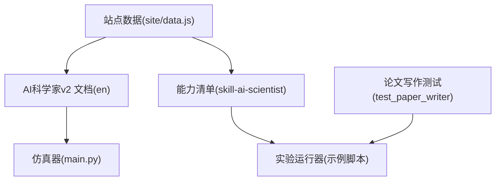
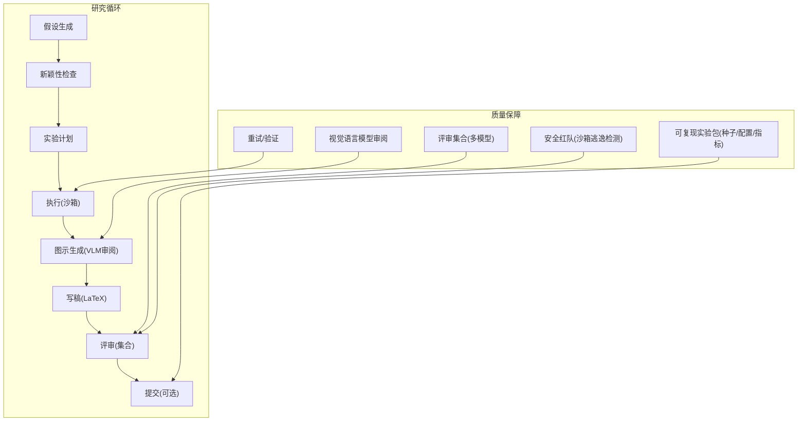
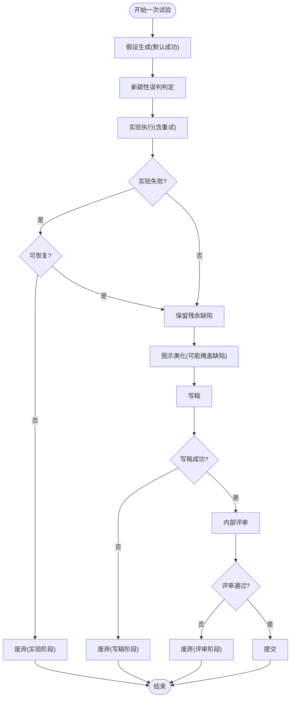
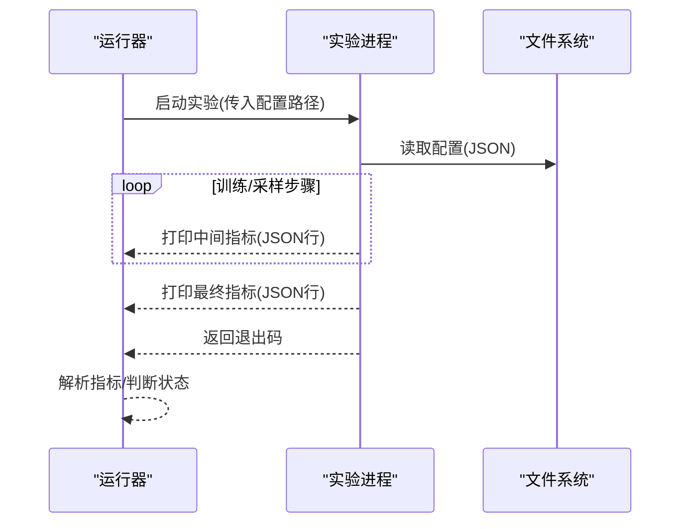
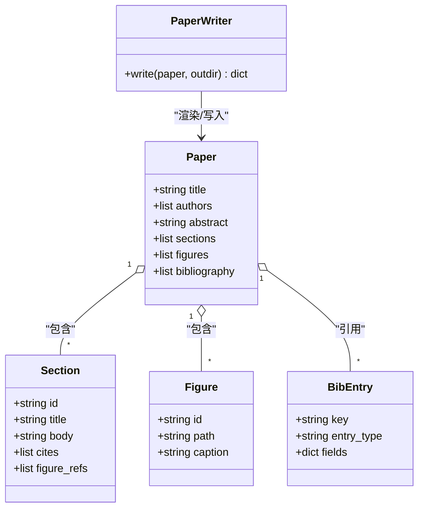
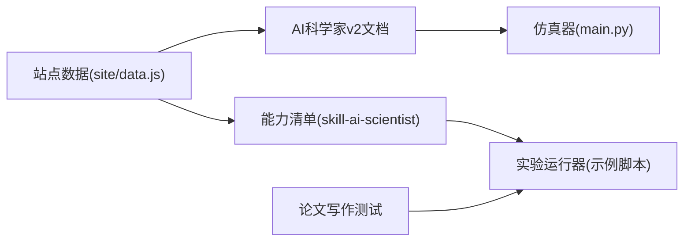

# AI科学家v2

<cite>
**本文引用的文件**
- [phases/15-autonomous-systems/05-ai-scientist-v2/code/main.py](file://phases/15-autonomous-systems/05-ai-scientist-v2/code/main.py)
- [phases/15-autonomous-systems/05-ai-scientist-v2/docs/en.md](file://phases/15-autonomous-systems/05-ai-scientist-v2/docs/en.md)
- [phases/15-autonomous-systems/05-ai-scientist-v2/outputs/skill-ai-scientist-sandbox-review.md](file://phases/15-autonomous-systems/05-ai-scientist-v2/outputs/skill-ai-scientist-sandbox-review.md)
- [phases/19-capstone-projects/05-autonomous-research-agent/outputs/skill-ai-scientist.md](file://phases/19-capstone-projects/05-autonomous-research-agent/outputs/skill-ai-scientist.md)
- [site/data.js](file://site/data.js)
- [phases/19-capstone-projects/52-experiment-runner/code/experiments/crashing_experiment.py](file://phases/19-capstone-projects/52-experiment-runner/code/experiments/crashing_experiment.py)
- [phases/19-capstone-projects/52-experiment-runner/code/experiments/sparsity_experiment.py](file://phases/19-capstone-projects/52-experiment-runner/code/experiments/sparsity_experiment.py)
- [phases/19-capstone-projects/54-paper-writer/code/tests/test_paper_writer.py](file://phases/19-capstone-projects/54-paper-writer/code/tests/test_paper_writer.py)
</cite>

## 目录
1. [引言](#引言)
2. [项目结构](#项目结构)
3. [核心组件](#核心组件)
4. [架构总览](#架构总览)
5. [详细组件分析](#详细组件分析)
6. [依赖关系分析](#依赖关系分析)
7. [性能考量](#性能考量)
8. [故障排查指南](#故障排查指南)
9. [结论](#结论)
10. [附录](#附录)

## 引言
本文件面向“AI科学家v2”自动化研究系统，系统化梳理其设计架构、核心流程与关键质量保障机制，并结合仓库中的仿真器、实验运行器与论文写作组件，给出可操作的实践建议与可视化说明。目标是帮助读者快速理解从“假设生成—实验执行—结果分析—论文撰写—评审提交”的闭环如何在工程上落地，以及在机器学习、计算机科学等领域中如何安全、可控地推进自主研究。

## 项目结构
本项目围绕“AI科学家v2”主题，提供了三类资源：
- 概念与仿真：以状态机模拟研究循环，评估不同失败率下的产出分布（含“美化但有缺陷”的论文类别）。
- 能力与规范：端到端能力清单与评分标准，明确安全、可复现与可评审的关键约束。
- 工程化组件：实验运行器与论文写作测试用例，体现对实验度量、论文骨架渲染与验证门禁的工程实践。

图表来源
- [phases/15-autonomous-systems/05-ai-scientist-v2/docs/en.md:1-109](file://phases/15-autonomous-systems/05-ai-scientist-v2/docs/en.md#L1-L109)
- [phases/15-autonomous-systems/05-ai-scientist-v2/code/main.py:1-203](file://phases/15-autonomous-systems/05-ai-scientist-v2/code/main.py#L1-L203)
- [phases/19-capstone-projects/05-autonomous-research-agent/outputs/skill-ai-scientist.md:1-47](file://phases/19-capstone-projects/05-autonomous-research-agent/outputs/skill-ai-scientist.md#L1-L47)
- [site/data.js:4365-4390](file://site/data.js#L4365-L4390)

章节来源
- [phases/15-autonomous-systems/05-ai-scientist-v2/docs/en.md:1-109](file://phases/15-autonomous-systems/05-ai-scientist-v2/docs/en.md#L1-L109)
- [site/data.js:4365-4390](file://site/data.js#L4365-L4390)

## 核心组件
- 研究循环仿真器（状态机）
  - 将研究循环抽象为若干阶段，每个阶段具有可配置失败概率；通过多次试验统计“可提交论文”“被废弃阶段”“清洁论文”“美化但有缺陷论文”等分布。
  - 关键输入：新颖性误判率、实验失败率、重试恢复率、美化掩盖弱项概率、写稿成功率、内部评审接受率。
  - 关键输出：提交数量、废弃原因分布、质量分布统计。
- 安全与评审规范
  - 提供两道关卡的审查清单，用于在论文离开沙箱前进行人工复核。
- 端到端能力清单
  - 明确从文献检索、树搜索、沙箱执行、验证、写作、评审、红队、可复现实验包等环节的工程边界与验收标准。
- 实验运行器与论文写作组件
  - 提供实验脚本示例（崩溃与正常运行），演示度量输出格式与错误处理。
  - 提供论文写作测试用例，覆盖LaTeX骨架渲染、图注入、引用校验、清单导出等。

章节来源
- [phases/15-autonomous-systems/05-ai-scientist-v2/code/main.py:1-203](file://phases/15-autonomous-systems/05-ai-scientist-v2/code/main.py#L1-L203)
- [phases/15-autonomous-systems/05-ai-scientist-v2/outputs/skill-ai-scientist-sandbox-review.md](file://phases/15-autonomous-systems/05-ai-scientist-v2/outputs/skill-ai-scientist-sandbox-review.md)
- [phases/19-capstone-projects/05-autonomous-research-agent/outputs/skill-ai-scientist.md:1-47](file://phases/19-capstone-projects/05-autonomous-research-agent/outputs/skill-ai-scientist.md#L1-L47)
- [phases/19-capstone-projects/52-experiment-runner/code/experiments/sparsity_experiment.py:1-77](file://phases/19-capstone-projects/52-experiment-runner/code/experiments/sparsity_experiment.py#L1-L77)
- [phases/19-capstone-projects/52-experiment-runner/code/experiments/crashing_experiment.py:1-20](file://phases/19-capstone-projects/52-experiment-runner/code/experiments/crashing_experiment.py#L1-L20)
- [phases/19-capstone-projects/54-paper-writer/code/tests/test_paper_writer.py:1-189](file://phases/19-capstone-projects/54-paper-writer/code/tests/test_paper_writer.py#L1-L189)

## 架构总览
下图展示了AI科学家v2的端到端研究循环与关键质量保障点。该循环由“假设生成—新颖性检查—实验计划—执行—图示生成—写稿—评审—提交”构成；同时在执行与写稿阶段引入“重试/验证/视觉语言模型审阅/评审集合”等质量门控，最终形成“可提交论文”的产出。

图表来源
- [phases/15-autonomous-systems/05-ai-scientist-v2/docs/en.md:18-64](file://phases/15-autonomous-systems/05-ai-scientist-v2/docs/en.md#L18-L64)
- [phases/19-capstone-projects/05-autonomous-research-agent/outputs/skill-ai-scientist.md:10-21](file://phases/19-capstone-projects/05-autonomous-research-agent/outputs/skill-ai-scientist.md#L10-L21)

## 详细组件分析

### 组件A：研究循环仿真器（状态机）
- 设计要点
  - 使用数据类封装循环配置参数，便于在不同场景（基准/乐观/悲观）下切换。
  - 每次试验按顺序推进：假设生成（默认成功）、新颖性误判、实验执行（含重试恢复）、图示美化（可能掩盖实验缺陷）、写稿、内部评审。
  - 结果对象记录是否提交、是否存在新颖性/实验缺陷、是否“美化但有缺陷”、废弃阶段等。
- 关键流程
  - 实验失败时，若不可恢复则直接废弃；若可恢复，则保留残余缺陷并进入后续阶段。
  - 写稿或评审任一失败即废弃；只有两者均通过且无缺陷才视为“清洁论文”。

图表来源
- [phases/15-autonomous-systems/05-ai-scientist-v2/code/main.py:48-114](file://phases/15-autonomous-systems/05-ai-scientist-v2/code/main.py#L48-L114)

章节来源
- [phases/15-autonomous-systems/05-ai-scientist-v2/code/main.py:1-203](file://phases/15-autonomous-systems/05-ai-scientist-v2/code/main.py#L1-L203)

### 组件B：实验运行器（示例脚本）
- 设计要点
  - 正常实验：读取配置、打印中间与最终指标JSON、返回退出码。
  - 崩溃实验：打印失败信息并返回非零退出码，用于验证“崩溃终端标签”。
- 数据契约
  - 中间/最终指标以JSON行输出，便于解析与可视化。
  - 配置参数包含随机种子、步数、睡眠时间、内存占用等，便于测试超时与资源监控。

图表来源
- [phases/19-capstone-projects/52-experiment-runner/code/experiments/sparsity_experiment.py:23-72](file://phases/19-capstone-projects/52-experiment-runner/code/experiments/sparsity_experiment.py#L23-L72)
- [phases/19-capstone-projects/52-experiment-runner/code/experiments/crashing_experiment.py:12-15](file://phases/19-capstone-projects/52-experiment-runner/code/experiments/crashing_experiment.py#L12-L15)

章节来源
- [phases/19-capstone-projects/52-experiment-runner/code/experiments/sparsity_experiment.py:1-77](file://phases/19-capstone-projects/52-experiment-runner/code/experiments/sparsity_experiment.py#L1-L77)
- [phases/19-capstone-projects/52-experiment-runner/code/experiments/crashing_experiment.py:1-20](file://phases/19-capstone-projects/52-experiment-runner/code/experiments/crashing_experiment.py#L1-L20)

### 组件C：论文写作与评审（测试用例）
- 设计要点
  - LaTeX骨架渲染：最小模板包含标题、摘要、段落与参考文献。
  - 图注入：根据实验清单生成唯一图ID、包含路径与说明。
  - 验证门禁：空标题/摘要、重复图ID、未知引用/图引用等均触发异常。
  - 清单导出：生成paper.tex、references.bib与manifest.json，确保可复现。
- 评审集合
  - 多模型评分（如Claude Opus、GPT、Gemini、DeepSeek、Qwen），采用NeurIPS量表，平均分低于阈值需回写。

图表来源
- [phases/19-capstone-projects/54-paper-writer/code/tests/test_paper_writer.py:14-24](file://phases/19-capstone-projects/54-paper-writer/code/tests/test_paper_writer.py#L14-L24)

章节来源
- [phases/19-capstone-projects/54-paper-writer/code/tests/test_paper_writer.py:1-189](file://phases/19-capstone-projects/54-paper-writer/code/tests/test_paper_writer.py#L1-L189)

### 组件D：安全与评审规范
- 两道关卡的审查清单：在论文离开沙箱前进行人工复核，确保安全与质量。
- 端到端能力清单：明确从文献检索、树搜索、沙箱策略、验证、写作、评审、红队、可复现实验包等环节的验收标准与拒绝条件。

章节来源
- [phases/15-autonomous-systems/05-ai-scientist-v2/outputs/skill-ai-scientist-sandbox-review.md](file://phases/15-autonomous-systems/05-ai-scientist-v2/outputs/skill-ai-scientist-sandbox-review.md)
- [phases/19-capstone-projects/05-autonomous-research-agent/outputs/skill-ai-scientist.md:23-46](file://phases/19-capstone-projects/05-autonomous-research-agent/outputs/skill-ai-scientist.md#L23-L46)

## 依赖关系分析
- 文档与仿真器
  - 文档对v2的研究循环、独立评估发现与安全风险进行了系统阐述；仿真器基于Beel等人的实证数据设定失败率，二者共同支撑对“提交量与质量”的量化评估。
- 能力清单与工程组件
  - 能力清单定义了从文献检索、树搜索、沙箱执行、验证、写作、评审、红队到可复现实验包的全链路目标；实验运行器与论文写作测试用例分别对应“执行—度量”和“写作—验证”两个关键环节。
- 站点数据映射
  - 站点数据中列举了“假设生成”“文献检索”“实验运行器”“结果评估”“论文写作”“评审循环”等端到端能力，与本项目的课程与项目模块一一对应。

图表来源
- [phases/15-autonomous-systems/05-ai-scientist-v2/docs/en.md:1-109](file://phases/15-autonomous-systems/05-ai-scientist-v2/docs/en.md#L1-L109)
- [phases/15-autonomous-systems/05-ai-scientist-v2/code/main.py:1-203](file://phases/15-autonomous-systems/05-ai-scientist-v2/code/main.py#L1-L203)
- [phases/19-capstone-projects/05-autonomous-research-agent/outputs/skill-ai-scientist.md:1-47](file://phases/19-capstone-projects/05-autonomous-research-agent/outputs/skill-ai-scientist.md#L1-L47)
- [site/data.js:4365-4390](file://site/data.js#L4365-L4390)

章节来源
- [site/data.js:4365-4390](file://site/data.js#L4365-L4390)

## 性能考量
- 循环仿真规模
  - 通过增大试验次数可提升统计稳定性；注意失败率参数对“可提交论文”与“美化但有缺陷论文”的比例影响显著。
- 实验执行效率
  - 在实验脚本中合理设置步数、噪声与资源上限，有助于在有限时间内获得稳定度量；同时利用中间指标进行早停与调试。
- 写作与评审吞吐
  - LaTeX编译与多模型评审会带来额外开销；建议在CI中缓存编译产物与评审结果，减少重复计算。

## 故障排查指南
- 实验崩溃
  - 使用崩溃示例脚本验证运行器对非零退出码的识别与标注；确保日志中包含可追踪的失败信息。
- 度量缺失
  - 确认实验脚本在失败前已输出中间/最终指标JSON行；检查配置路径与权限。
- 论文渲染失败
  - 按测试用例逐项排查：空标题/摘要、重复图ID、未知引用/图引用；修正后重新渲染。
- 安全与评审
  - 运行红队任务，确认网络访问、文件系统逃逸与恶意进程被阻断；记录尝试与结果以便审计。

章节来源
- [phases/19-capstone-projects/52-experiment-runner/code/experiments/crashing_experiment.py:1-20](file://phases/19-capstone-projects/52-experiment-runner/code/experiments/crashing_experiment.py#L1-L20)
- [phases/19-capstone-projects/54-paper-writer/code/tests/test_paper_writer.py:70-99](file://phases/19-capstone-projects/54-paper-writer/code/tests/test_paper_writer.py#L70-L99)
- [phases/19-capstone-projects/05-autonomous-research-agent/outputs/skill-ai-scientist.md:20-21](file://phases/19-capstone-projects/05-autonomous-research-agent/outputs/skill-ai-scientist.md#L20-L21)

## 结论
AI科学家v2通过“假设生成—实验执行—图示美化—写稿—评审—提交”的闭环，将开放式的科研任务纳入可工程化的流水线。仓库中的仿真器、实验运行器与论文写作测试用例，为理解与实现该闭环提供了清晰的范式：以失败率为依据的统计评估、以JSON度量为核心的实验契约、以LaTeX与多模型评审为质量保障、以两道关卡与可复现实验包为安全边界。在此基础上，系统可在机器学习、计算机科学等领域加速科学发现，同时通过严格的工程化与安全治理降低“美化但有缺陷”的风险。

## 附录
- 参考资料与进一步阅读
  - [AI科学家v2论文](https://arxiv.org/abs/2504.08066)
  - [独立评估报告](https://arxiv.org/abs/2502.14297)
  - [Sakana AI Scientist v1论文](https://arxiv.org/abs/2408.06292)
  - [Anthropic 关于代理自治性的测量](https://www.anthropic.com/research/measuring-agent-autonomy)