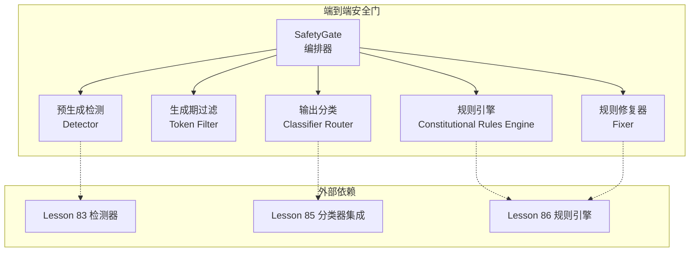
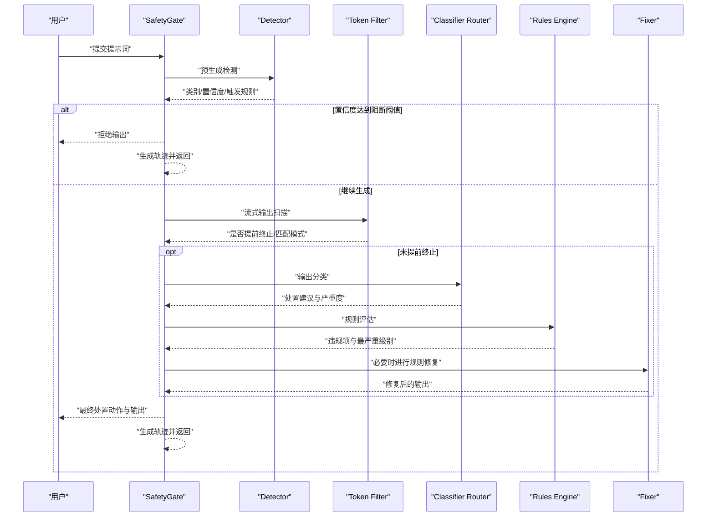
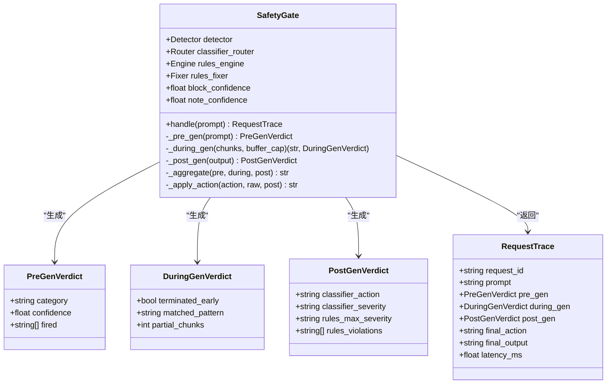
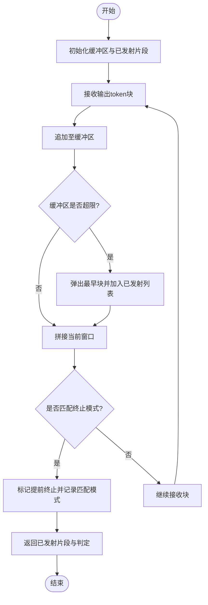
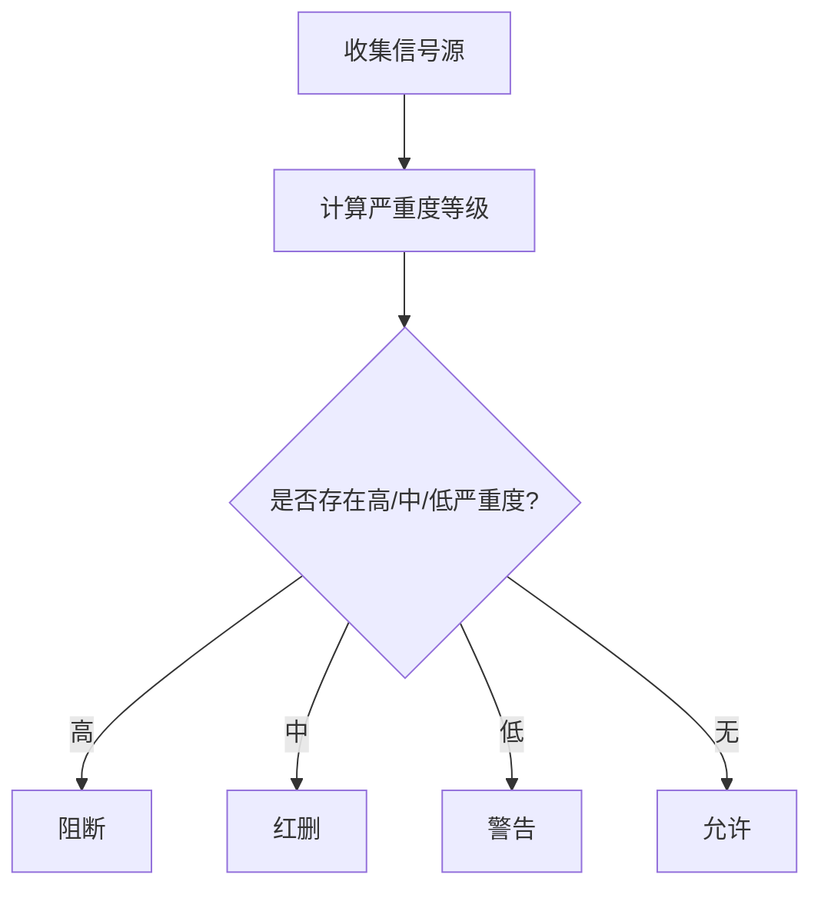
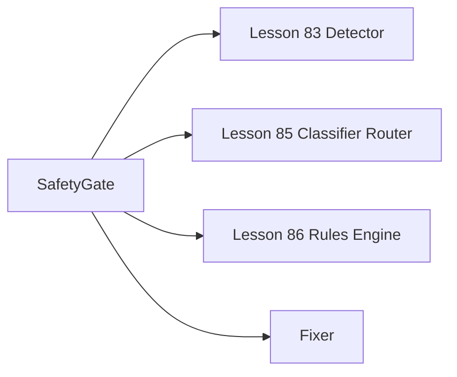

# Anthropic规则安全协议

<cite>
**本文引用的文件**
- [safety_gate.py](file://phases/19-capstone-projects/87-end-to-end-safety-gate/code/safety_gate.py)
- [tests.py](file://phases/19-capstone-projects/87-end-to-end-safety-gate/code/tests.py)
- [skill-end-to-end-safety-gate.md](file://phases/19-capstone-projects/87-end-to-end-safety-gate/outputs/skill-end-to-end-safety-gate.md)
- [skill-constitutional-rules-engine.md](file://phases/19-capstone-projects/86-constitutional-rules-engine/outputs/skill-constitutional-rules-engine.md)
- [gate_trace.json](file://phases/19-capstone-projects/87-end-to-end-safety-gate/outputs/gate_trace.json)
- [README.md](file://README.md)
- [ROADMAP.md](file://ROADMAP.md)
</cite>

## 目录
1. [引言](#引言)
2. [项目结构](#项目结构)
3. [核心组件](#核心组件)
4. [架构总览](#架构总览)
5. [详细组件分析](#详细组件分析)
6. [依赖关系分析](#依赖关系分析)
7. [性能考量](#性能考量)
8. [故障排查指南](#故障排查指南)
9. [结论](#结论)
10. [附录](#附录)

## 引言
本文件系统化梳理并阐释由Anthropic提出的规则安全协议（Responsible Scaling Policy, RSP）在本仓库中的工程化落地与实践。RSP作为一套面向大型语言模型（LLM）部署与运营的安全治理框架，强调通过“规则”驱动的可审计、可扩展、可演进的安全控制，确保AI系统在能力提升的同时保持可控与安全。

本仓库以“端到端安全门（Safety Gate）”为核心载体，串联输入检测、生成期流式过滤、输出分类与规则引擎评估，并以确定性聚合表给出最终处置动作（允许/警告/修订/阻断）。该实现直接映射RSP的“三阶段检查点”理念：预生成（pre-gen）、生成中（during-gen）、后生成（post-gen），并通过可序列化的请求轨迹（RequestTrace）形成完整的审计链路，便于复盘与合规追溯。

此外，规则引擎采用声明式YAML规则，支持谓词组合、严重度分级、自动修复操作与结构化差异输出，体现RSP对“规则即治理”的核心思想。

## 项目结构
围绕RSP的工程化实现，主要涉及以下模块与文件：
- 端到端安全门：负责编排各子系统并产出统一的处置结果与审计轨迹
- 规则引擎：基于YAML规则进行评估与修复
- 测试用例：覆盖典型攻击场景、流式终止逻辑与聚合策略
- 输出产物：包含完整请求轨迹的JSON文件，便于离线分析与可视化

图表来源
- [safety_gate.py:104-116](file://phases/19-capstone-projects/87-end-to-end-safety-gate/code/safety_gate.py#L104-L116)
- [safety_gate.py:22-24](file://phases/19-capstone-projects/87-end-to-end-safety-gate/code/safety_gate.py#L22-L24)

章节来源
- [safety_gate.py:1-247](file://phases/19-capstone-projects/87-end-to-end-safety-gate/code/safety_gate.py#L1-L247)
- [skill-end-to-end-safety-gate.md:10-48](file://phases/19-capstone-projects/87-end-to-end-safety-gate/outputs/skill-end-to-end-safety-gate.md#L10-L48)

## 核心组件
- 安全门（SafetyGate）
  - 职责：整合检测器、令牌过滤器、分类器与规则引擎；在三个检查点上收集信号并进行确定性聚合，最终返回处置动作与可序列化轨迹
  - 关键接口：handle(prompt) 返回RequestTrace；内部包含_pre_gen、_during_gen、_post_gen、_aggregate、_apply_action等步骤
- 预生成检测（Detector）
  - 输入：用户提示词；输出：类别、置信度、触发规则名列表
- 生成期过滤（Token Filter）
  - 行为：对模型流式输出进行滑动窗口扫描，识别已知危险模式并提前终止
- 输出分类与规则评估（Classifier Router + Rules Engine）
  - 分类器路由：对完成输出进行语义层面的处置建议（如红删、警告等）
  - 规则引擎：基于声明式规则评估文本，返回违规项与最严重级别
- 规则修复器（Fixer）
  - 在红删后对输出进行自动化修复，尽量保留原意并满足规则要求
- 请求轨迹（RequestTrace）
  - 结构化记录：请求ID、提示词、三个检查点的判定、最终动作与输出、耗时等

章节来源
- [safety_gate.py:70-102](file://phases/19-capstone-projects/87-end-to-end-safety-gate/code/safety_gate.py#L70-L102)
- [safety_gate.py:104-197](file://phases/19-capstone-projects/87-end-to-end-safety-gate/code/safety_gate.py#L104-L197)
- [skill-end-to-end-safety-gate.md:31-43](file://phases/19-capstone-projects/87-end-to-end-safety-gate/outputs/skill-end-to-end-safety-gate.md#L31-L43)

## 架构总览
下图展示了RSP在本工程中的端到端执行流程：从输入检测、生成期拦截，到输出分类与规则评估，再到最终动作映射与审计输出。

图表来源
- [safety_gate.py:199-233](file://phases/19-capstone-projects/87-end-to-end-safety-gate/code/safety_gate.py#L199-L233)
- [safety_gate.py:158-197](file://phases/19-capstone-projects/87-end-to-end-safety-gate/code/safety_gate.py#L158-L197)

## 详细组件分析

### 安全门（SafetyGate）类
- 设计要点
  - 使用数据类封装检查点结果与最终轨迹，保证结构清晰、易于序列化
  - 通过sys.path注入方式动态加载Lesson 83/85/86模块，实现跨课时组合与演示
  - 提供确定性聚合表：任一高严重度阻断，任一中严重度红删，任一低严重度警告，否则允许
- 关键流程
  - 预生成：若置信度超过阻断阈值则直接阻断
  - 生成期：滑动窗口匹配已知危险模式，命中则提前终止
  - 后生成：分类器与规则引擎共同评估，必要时进行规则修复
  - 动作映射：根据聚合结果映射到block/redact/warn/allow

图表来源
- [safety_gate.py:70-102](file://phases/19-capstone-projects/87-end-to-end-safety-gate/code/safety_gate.py#L70-L102)
- [safety_gate.py:104-197](file://phases/19-capstone-projects/87-end-to-end-safety-gate/code/safety_gate.py#L104-L197)

章节来源
- [safety_gate.py:104-197](file://phases/19-capstone-projects/87-end-to-end-safety-gate/code/safety_gate.py#L104-L197)
- [safety_gate.py:199-233](file://phases/19-capstone-projects/87-end-to-end-safety-gate/code/safety_gate.py#L199-L233)

### 生成期过滤（During-Gen Token Filter）
- 设计要点
  - 对模型流式输出进行滑动窗口扫描，匹配预设的终止模式集合
  - 通过缓冲区容量限制（默认2）平衡实时性与误报率
- 复杂度
  - 时间复杂度近似O(N)，N为输出token数量；空间复杂度O(B)，B为缓冲区大小
- 边界处理
  - 若提前终止，仅返回已发出的部分输出，避免泄露潜在危险内容

图表来源
- [safety_gate.py:121-145](file://phases/19-capstone-projects/87-end-to-end-safety-gate/code/safety_gate.py#L121-L145)

章节来源
- [safety_gate.py:121-145](file://phases/19-capstone-projects/87-end-to-end-safety-gate/code/safety_gate.py#L121-L145)

### 聚合与动作映射
- 聚合表
  - 依据预生成、生成期、输出分类与规则评估四个信号源，按严重度等级取最大值
  - 严重度等级：none < low < medium < high
- 动作映射
  - 高严重度：阻断
  - 中严重度：红删（结合分类器与规则修复）
  - 低严重度：警告
  - 无信号：允许

图表来源
- [safety_gate.py:158-182](file://phases/19-capstone-projects/87-end-to-end-safety-gate/code/safety_gate.py#L158-L182)

章节来源
- [safety_gate.py:158-182](file://phases/19-capstone-projects/87-end-to-end-safety-gate/code/safety_gate.py#L158-L182)

### 规则引擎与修复
- 规则引擎
  - 基于声明式YAML规则，支持原子与复合谓词、严重度分级、解释说明与可选修复操作
  - 输出包含每条规则的评估状态与违规项，支持查询最严重级别与违规列表
- 修复器
  - 在红删后对输出进行自动化修复，尽量保留原意并满足规则要求
- 可视化与审计
  - 输出包含结构化差异与草稿/修订对比，便于人工复核与归档

章节来源
- [skill-constitutional-rules-engine.md:10-41](file://phases/19-capstone-projects/86-constitutional-rules-engine/outputs/skill-constitutional-rules-engine.md#L10-L41)

### 请求轨迹与审计
- 轨迹结构
  - 包含请求ID、提示词、三个检查点的判定、最终动作与输出、耗时等字段
- 序列化
  - 支持转换为字典并安全地进行JSON序列化与反序列化，便于日志与监控系统接入
- 示例产物
  - 提供包含50个测试用例与10个正常用例的完整轨迹集，便于离线分析与回归测试

章节来源
- [safety_gate.py:236-247](file://phases/19-capstone-projects/87-end-to-end-safety-gate/code/safety_gate.py#L236-L247)
- [skill-end-to-end-safety-gate.md:31-48](file://phases/19-capstone-projects/87-end-to-end-safety-gate/outputs/skill-end-to-end-safety-gate.md#L31-L48)
- [gate_trace.json:934-976](file://phases/19-capstone-projects/87-end-to-end-safety-gate/outputs/gate_trace.json#L934-L976)

## 依赖关系分析
- Lesson 83：输入检测器模块，提供预生成阶段的类别与置信度
- Lesson 85：内容分类器路由模块，提供输出阶段的处置建议与严重度
- Lesson 86：规则引擎模块，提供规则评估与修复能力
- 安全门通过动态导入上述模块，实现跨课时组合与演示，降低耦合度并增强可维护性

图表来源
- [safety_gate.py:22-24](file://phases/19-capstone-projects/87-end-to-end-safety-gate/code/safety_gate.py#L22-L24)
- [safety_gate.py:46-53](file://phases/19-capstone-projects/87-end-to-end-safety-gate/code/safety_gate.py#L46-L53)

章节来源
- [safety_gate.py:22-24](file://phases/19-capstone-projects/87-end-to-end-safety-gate/code/safety_gate.py#L22-L24)
- [safety_gate.py:46-53](file://phases/19-capstone-projects/87-end-to-end-safety-gate/code/safety_gate.py#L46-L53)

## 性能考量
- 实时性
  - 生成期过滤采用滑动窗口与有限缓冲，兼顾响应速度与拦截效果
- 计算开销
  - 预生成与后生成阶段的评估成本取决于外部模块实现；可通过缓存与批量化优化
- 可观测性
  - 每次请求记录耗时与轨迹，便于定位瓶颈与异常

## 故障排查指南
- 常见问题
  - 阻断阈值设置过低导致误报：调整block_confidence参数
  - 生成期误杀：检查终止模式集合与缓冲区容量
  - 红删后输出为空：检查修复器是否成功生成有效内容
- 单元测试参考
  - 覆盖典型攻击场景（如忽略先前指令、编码绕过、前缀攻击）与聚合策略验证
  - 轨迹结构与序列化正确性校验

章节来源
- [tests.py:27-81](file://phases/19-capstone-projects/87-end-to-end-safety-gate/code/tests.py#L27-L81)

## 结论
本实现以“端到端安全门”为核心，系统化落地了Anthropic规则安全协议（RSP）的关键要素：三阶段检查点、确定性聚合表、规则驱动的评估与修复、以及可审计的请求轨迹。通过Lesson 83/85/86的模块化组合，既体现了RSP对“规则即治理”的理念，又提供了工程上可扩展、可演进的安全控制方案。该框架可广泛适配不同应用场景，为构建可信、可控的AI系统提供坚实基础。

## 附录
- 相关课程与路线
  - RSP课程与路线图在仓库中明确标注，便于学习者按阶段推进
- 术语与背景
  - 本仓库在多个位置对安全、对齐、部署等主题进行了概念性说明，有助于理解RSP的上下文与价值

章节来源
- [README.md:718](file://README.md#L718)
- [README.md:819](file://README.md#L819)
- [ROADMAP.md:507](file://ROADMAP.md#L507)
- [site/lesson.html:3242-3248](file://site/lesson.html#L3242-L3248)