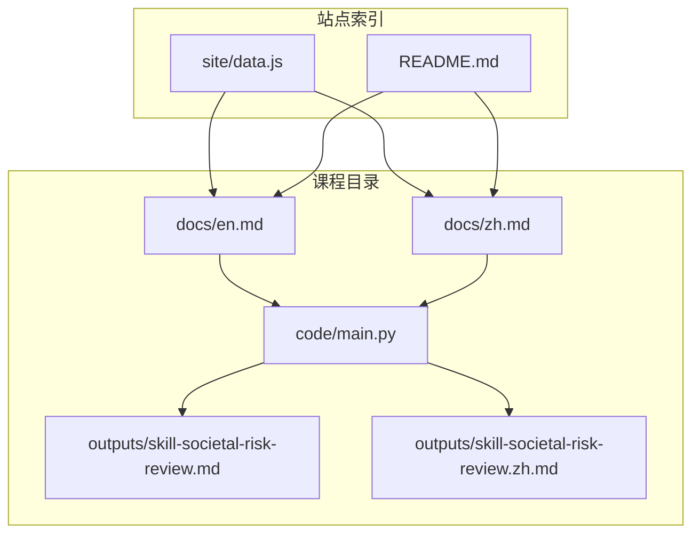
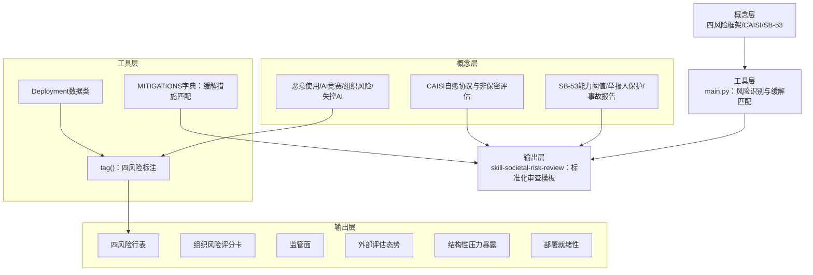
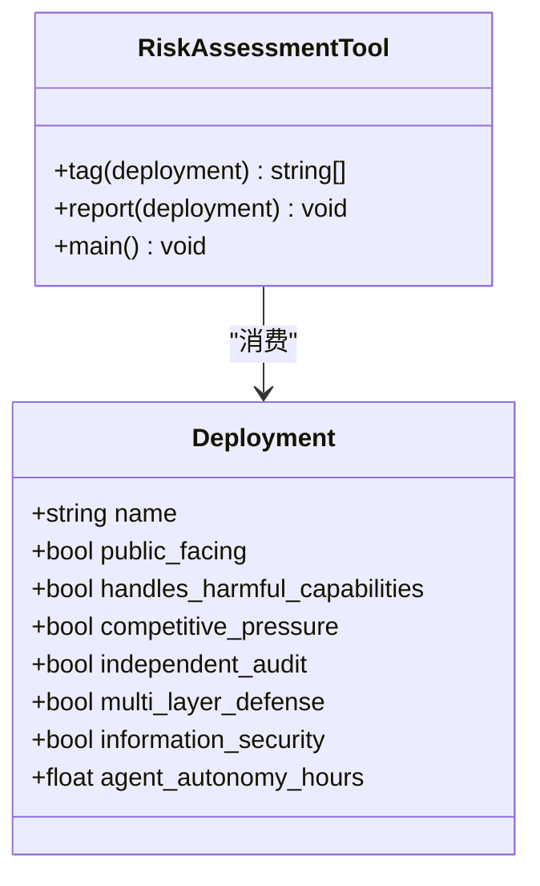
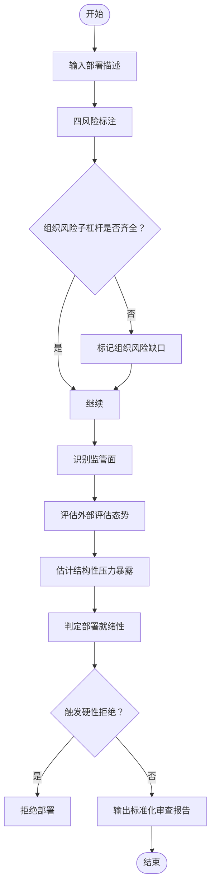
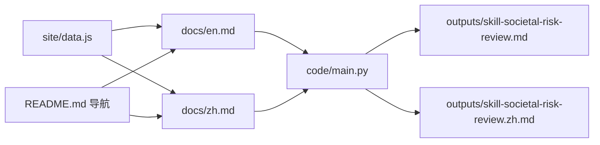

# CAIS与CAISI社会风险研究

<cite>
**本文档引用的文件**
- [phases/15-autonomous-systems/22-cais-caisi-societal-risk/docs/en.md](file://phases/15-autonomous-systems/22-cais-caisi-societal-risk/docs/en.md)
- [phases/15-autonomous-systems/22-cais-caisi-societal-risk/docs/zh.md](file://phases/15-autonomous-systems/22-cais-caisi-societal-risk/docs/zh.md)
- [phases/15-autonomous-systems/22-cais-caisi-societal-risk/code/main.py](file://phases/15-autonomous-systems/22-cais-caisi-societal-risk/code/main.py)
- [phases/15-autonomous-systems/22-cais-caisi-societal-risk/outputs/skill-societal-risk-review.md](file://phases/15-autonomous-systems/22-cais-caisi-societal-risk/outputs/skill-societal-risk-review.md)
- [phases/15-autonomous-systems/22-cais-caisi-societal-risk/outputs/skill-societal-risk-review.zh.md](file://phases/15-autonomous-systems/22-cais-caisi-societal-risk/outputs/skill-societal-risk-review.zh.md)
- [site/data.js](file://site/data.js)
- [README.md](file://README.md)
</cite>

## 目录
1. [引言](#引言)
2. [项目结构](#项目结构)
3. [核心组件](#核心组件)
4. [架构总览](#架构总览)
5. [详细组件分析](#详细组件分析)
6. [依赖关系分析](#依赖关系分析)
7. [性能考虑](#性能考虑)
8. [故障排查指南](#故障排查指南)
9. [结论](#结论)
10. [附录](#附录)

## 引言
本文件围绕“CAIS与CAISI社会风险研究”主题，系统梳理并阐释两大研究与治理主体在AI社会影响与风险评估领域的前沿工作。CAIS（AI安全中心）发布四风险框架（恶意使用、AI竞赛、组织风险、失控AI），并持续发布关于生存风险与前沿模型评估的成果；CAISI（NIST人工智能标准与创新中心）聚焦美国政府场景，开展自愿协议与非保密能力评估，覆盖网络、生物与化学武器相关风险。本仓库将这两类视角整合进“长期自治系统”阶段，形成从实验室内部纵深防御到社会与政府治理的完整视图。

本研究旨在：
- 解释社会风险识别、影响评估与治理策略的理论框架；
- 提供可复用的风险评估模型与分析工具；
- 展示AI技术的社会经济影响、伦理考量与政策建议；
- 覆盖风险监测、预警机制与应对策略；
- 强调负责任发展的指导价值。

## 项目结构
本专题位于“长期自治系统”阶段第22课，配套文档、脚本与技能输出如下：
- 文档（英文/中文）：概念阐述、术语表、进一步阅读与练习
- 代码：四风险清单与缓解措施匹配器（main.py）
- 输出：社会风险审查技能模板（skill-societal-risk-review）

**图表来源**
- [phases/15-autonomous-systems/22-cais-caisi-societal-risk/docs/en.md:1-120](file://phases/15-autonomous-systems/22-cais-caisi-societal-risk/docs/en.md#L1-L120)
- [phases/15-autonomous-systems/22-cais-caisi-societal-risk/docs/zh.md:1-120](file://phases/15-autonomous-systems/22-cais-caisi-societal-risk/docs/zh.md#L1-L120)
- [phases/15-autonomous-systems/22-cais-caisi-societal-risk/code/main.py:1-147](file://phases/15-autonomous-systems/22-cais-caisi-societal-risk/code/main.py#L1-L147)
- [phases/15-autonomous-systems/22-cais-caisi-societal-risk/outputs/skill-societal-risk-review.md:1-41](file://phases/15-autonomous-systems/22-cais-caisi-societal-risk/outputs/skill-societal-risk-review.md#L1-L41)
- [phases/15-autonomous-systems/22-cais-caisi-societal-risk/outputs/skill-societal-risk-review.zh.md:1-41](file://phases/15-autonomous-systems/22-cais-caisi-societal-risk/outputs/skill-societal-risk-review.zh.md#L1-L41)
- [site/data.js:3137-3142](file://site/data.js#L3137-L3142)
- [README.md:695-721](file://README.md#L695-L721)

**章节来源**
- [phases/15-autonomous-systems/22-cais-caisi-societal-risk/docs/en.md:1-120](file://phases/15-autonomous-systems/22-cais-caisi-societal-risk/docs/en.md#L1-L120)
- [phases/15-autonomous-systems/22-cais-caisi-societal-risk/docs/zh.md:1-120](file://phases/15-autonomous-systems/22-cais-caisi-societal-risk/docs/zh.md#L1-L120)
- [site/data.js:3137-3142](file://site/data.js#L3137-L3142)
- [README.md:695-721](file://README.md#L695-L721)

## 核心组件
- 四风险框架与组织风险杠杆
  - 恶意使用：坏人利用AI造成伤害（生化武器合成、虚假信息、网络攻击）
  - AI竞赛：实验室/公司/国家间竞争压力使部署越过安全边界
  - 组织风险：安全文化、独立审计、多层防御、信息安全四项内部杠杆
  - 失控AI：足够强的AI追求与人类福祉冲突的目标
- CAISI与SB-53
  - CAISI：NIST下属自愿协议与非保密能力评估（重点覆盖网络、生物、化学武器风险）
  - SB-53（加州）：如签署，将成为美国首个州级灾难性风险法规，包含能力阈值、举报人保护与事故报告要求
- 风险评估工具
  - main.py：基于数据类的部署特征，自动标注四风险类别并输出缓解措施清单
- 社会风险审查技能
  - outputs/skill-societal-risk-review：提供标准化输出格式，覆盖四风险表、组织风险评分卡、监管面、外部评估态势、结构性压力暴露与部署就绪性

**章节来源**
- [phases/15-autonomous-systems/22-cais-caisi-societal-risk/docs/en.md:27-78](file://phases/15-autonomous-systems/22-cais-caisi-societal-risk/docs/en.md#L27-L78)
- [phases/15-autonomous-systems/22-cais-caisi-societal-risk/docs/zh.md:27-78](file://phases/15-autonomous-systems/22-cais-caisi-societal-risk/docs/zh.md#L27-L78)
- [phases/15-autonomous-systems/22-cais-caisi-societal-risk/code/main.py:14-49](file://phases/15-autonomous-systems/22-cais-caisi-societal-risk/code/main.py#L14-L49)
- [phases/15-autonomous-systems/22-cais-caisi-societal-risk/outputs/skill-societal-risk-review.md:10-41](file://phases/15-autonomous-systems/22-cais-caisi-societal-risk/outputs/skill-societal-risk-review.md#L10-L41)
- [phases/15-autonomous-systems/22-cais-caisi-societal-risk/outputs/skill-societal-risk-review.zh.md:10-41](file://phases/15-autonomous-systems/22-cais-caisi-societal-risk/outputs/skill-societal-risk-review.zh.md#L10-L41)

## 架构总览
本专题采用“概念—工具—输出”的分层架构：
- 概念层：四风险框架、CAISI与SB-53定位与职责
- 工具层：main.py实现风险识别与缓解措施匹配
- 输出层：标准化社会风险审查技能模板

**图表来源**
- [phases/15-autonomous-systems/22-cais-caisi-societal-risk/docs/en.md:27-78](file://phases/15-autonomous-systems/22-cais-caisi-societal-risk/docs/en.md#L27-L78)
- [phases/15-autonomous-systems/22-cais-caisi-societal-risk/code/main.py:14-49](file://phases/15-autonomous-systems/22-cais-caisi-societal-risk/code/main.py#L14-L49)
- [phases/15-autonomous-systems/22-cais-caisi-societal-risk/outputs/skill-societal-risk-review.md:32-41](file://phases/15-autonomous-systems/22-cais-caisi-societal-risk/outputs/skill-societal-risk-review.md#L32-L41)

## 详细组件分析

### 组件A：四风险识别与缓解匹配器（main.py）
- 数据结构
  - Deployment数据类：封装部署关键属性（是否面向公众、是否处理有害能力、是否存在竞争压力、是否具备独立审计、是否具备多层防御、信息安全状况、代理自主性时长）
- 标注逻辑
  - 恶意使用：当部署面向公众且处理有害能力时触发
  - AI竞赛：当存在竞争压力时触发
  - 组织风险：只要独立审计、多层防御、信息安全任一缺失即触发
  - 失控AI：当代理自主性时长达到阈值时触发
- 缓解措施匹配
  - 每个风险类别映射至一系列缓解措施（来自课程各课要点），用于指导改进

**图表来源**
- [phases/15-autonomous-systems/22-cais-caisi-societal-risk/code/main.py:14-49](file://phases/15-autonomous-systems/22-cais-caisi-societal-risk/code/main.py#L14-L49)
- [phases/15-autonomous-systems/22-cais-caisi-societal-risk/code/main.py:52-92](file://phases/15-autonomous-systems/22-cais-caisi-societal-risk/code/main.py#L52-L92)

**章节来源**
- [phases/15-autonomous-systems/22-cais-caisi-societal-risk/code/main.py:1-147](file://phases/15-autonomous-systems/22-cais-caisi-societal-risk/code/main.py#L1-L147)

### 组件B：社会风险审查技能模板（outputs/skill-societal-risk-review）
- 输出要素
  - 四风险行表：类别、是否涉及、性质
  - 组织风险评分卡：安全文化、审计严谨性、多层防御、信息安全
  - 监管面：适用框架与合规状态（如欧盟AI法案、加州SB-53、CAISI自愿协议）
  - 外部评估态势：评估者、范围、频率
  - 结构性压力暴露：低/中/高及其理由
  - 部署就绪性：生产/暂存/仅研究
- 硬性拒绝与拒绝规则
  - 触及有害能力类别但无硬编码禁止层
  - 处于竞赛压力且无独立审计
  - 长时程自主部署无外部能力评估
  - 欧盟部署无第14条人机协作要求
  - 加州部署在签署SB-53后无事故报告流程

**图表来源**
- [phases/15-autonomous-systems/22-cais-caisi-societal-risk/outputs/skill-societal-risk-review.md:14-41](file://phases/15-autonomous-systems/22-cais-caisi-societal-risk/outputs/skill-societal-risk-review.md#L14-L41)
- [phases/15-autonomous-systems/22-cais-caisi-societal-risk/outputs/skill-societal-risk-review.zh.md:14-41](file://phases/15-autonomous-systems/22-cais-caisi-societal-risk/outputs/skill-societal-risk-review.zh.md#L14-L41)

**章节来源**
- [phases/15-autonomous-systems/22-cais-caisi-societal-risk/outputs/skill-societal-risk-review.md:1-41](file://phases/15-autonomous-systems/22-cais-caisi-societal-risk/outputs/skill-societal-risk-review.md#L1-L41)
- [phases/15-autonomous-systems/22-cais-caisi-societal-risk/outputs/skill-societal-risk-review.zh.md:1-41](file://phases/15-autonomous-systems/22-cais-caisi-societal-risk/outputs/skill-societal-risk-review.zh.md#L1-L41)

### 组件C：概念与政策背景（docs/en.md / docs/zh.md）
- CAIS：非营利研究组织，发布四风险框架与生存风险声明；2026年计划包括AI仪表盘、远程劳动力指数、超级智能战略论文等
- CAISI：NIST下属，运行自愿协议与非保密评估，聚焦网络、生物、化学武器风险；与METR的私密评估形成互补
- SB-53（加州）：若签署，将成为美国首个州级灾难性风险法规，包含能力阈值、举报人保护与事故报告要求
- 社会层面风险是多层生态问题，需实验室、外部评估者、公民社会、政府与从业者共同参与

**章节来源**
- [phases/15-autonomous-systems/22-cais-caisi-societal-risk/docs/en.md:1-120](file://phases/15-autonomous-systems/22-cais-caisi-societal-risk/docs/en.md#L1-L120)
- [phases/15-autonomous-systems/22-cais-caisi-societal-risk/docs/zh.md:1-120](file://phases/15-autonomous-systems/22-cais-caisi-societal-risk/docs/zh.md#L1-L120)

## 依赖关系分析
- 文档与代码的耦合
  - docs/en.md与docs/zh.md定义了四风险框架与组织风险杠杆，code/main.py据此实现标注与匹配
- 输出与工具的依赖
  - outputs/skill-societal-risk-review作为标准化模板，依赖main.py的标注结果与缓解措施匹配
- 站点索引与课程导航
  - site/data.js与README.md将本课纳入“长期自治系统”阶段，便于学习路径导航

**图表来源**
- [phases/15-autonomous-systems/22-cais-caisi-societal-risk/docs/en.md:1-120](file://phases/15-autonomous-systems/22-cais-caisi-societal-risk/docs/en.md#L1-L120)
- [phases/15-autonomous-systems/22-cais-caisi-societal-risk/docs/zh.md:1-120](file://phases/15-autonomous-systems/22-cais-caisi-societal-risk/docs/zh.md#L1-L120)
- [phases/15-autonomous-systems/22-cais-caisi-societal-risk/code/main.py:1-147](file://phases/15-autonomous-systems/22-cais-caisi-societal-risk/code/main.py#L1-L147)
- [phases/15-autonomous-systems/22-cais-caisi-societal-risk/outputs/skill-societal-risk-review.md:1-41](file://phases/15-autonomous-systems/22-cais-caisi-societal-risk/outputs/skill-societal-risk-review.md#L1-L41)
- [phases/15-autonomous-systems/22-cais-caisi-societal-risk/outputs/skill-societal-risk-review.zh.md:1-41](file://phases/15-autonomous-systems/22-cais-caisi-societal-risk/outputs/skill-societal-risk-review.zh.md#L1-L41)
- [site/data.js:3137-3142](file://site/data.js#L3137-L3142)
- [README.md:695-721](file://README.md#L695-L721)

**章节来源**
- [site/data.js:3137-3142](file://site/data.js#L3137-L3142)
- [README.md:695-721](file://README.md#L695-L721)

## 性能考虑
- 计算复杂度
  - 标注过程为O(1)，仅基于布尔条件判断，适合快速批量评估
- 可扩展性
  - 可通过扩展Deployment字段与MITIGATIONS映射，支持更细粒度的缓解措施与风险类别
- 可维护性
  - 将“概念—工具—输出”解耦，便于更新框架与模板而不影响底层逻辑

## 故障排查指南
- 常见问题
  - 仅自我评估不足以满足独立审计要求，需引入第三方评估
  - “我们有扩展政策”不能替代具体监管表面映射
  - 在竞赛压力下无审计将触发硬性拒绝
- 排查步骤
  - 明确部署是否面向公众、是否处理有害能力
  - 核实独立审计、多层防御与信息安全是否到位
  - 识别适用监管框架（如欧盟AI法案、加州SB-53、CAISI自愿协议）
  - 确认外部评估（METR、CAISI等）与评估范围、频率
  - 评估结构性压力暴露与部署就绪性

**章节来源**
- [phases/15-autonomous-systems/22-cais-caisi-societal-risk/outputs/skill-societal-risk-review.md:20-31](file://phases/15-autonomous-systems/22-cais-caisi-societal-risk/outputs/skill-societal-risk-review.md#L20-L31)
- [phases/15-autonomous-systems/22-cais-caisi-societal-risk/outputs/skill-societal-risk-review.zh.md:20-31](file://phases/15-autonomous-systems/22-cais-caisi-societal-risk/outputs/skill-societal-risk-review.zh.md#L20-L31)

## 结论
本专题将CAIS的四风险框架与CAISI的政府治理视角整合，辅以main.py的快速风险识别工具与标准化社会风险审查模板，形成从实验室内部纵深防御到社会与政府治理的闭环。通过明确组织风险杠杆、监管面与外部评估态势，有助于在负责任的前提下推进AI长期自治系统的研发与部署。

## 附录
- 练习建议
  - 运行main.py，对三种不同规模的合成部署进行标注，检验标签合理性
  - 阅读CAIS四风险论文，针对某一类别展望2026年发展
  - 阅读加州SB-53草案，辨析强化与弱化条款
  - 对一个已知生产部署进行组织风险子杠杆评分，识别最薄弱环节与改进成本
  - 草拟2028版四风险框架，结合新增能力与部署经验进行调整

**章节来源**
- [phases/15-autonomous-systems/22-cais-caisi-societal-risk/docs/en.md:88-99](file://phases/15-autonomous-systems/22-cais-caisi-societal-risk/docs/en.md#L88-L99)
- [phases/15-autonomous-systems/22-cais-caisi-societal-risk/docs/zh.md:88-99](file://phases/15-autonomous-systems/22-cais-caisi-societal-risk/docs/zh.md#L88-L99)