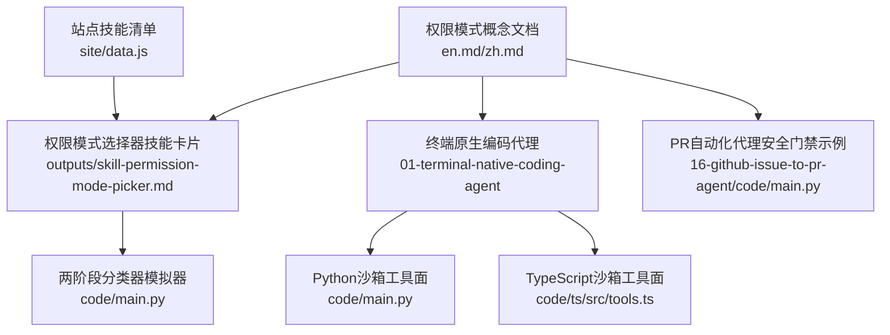
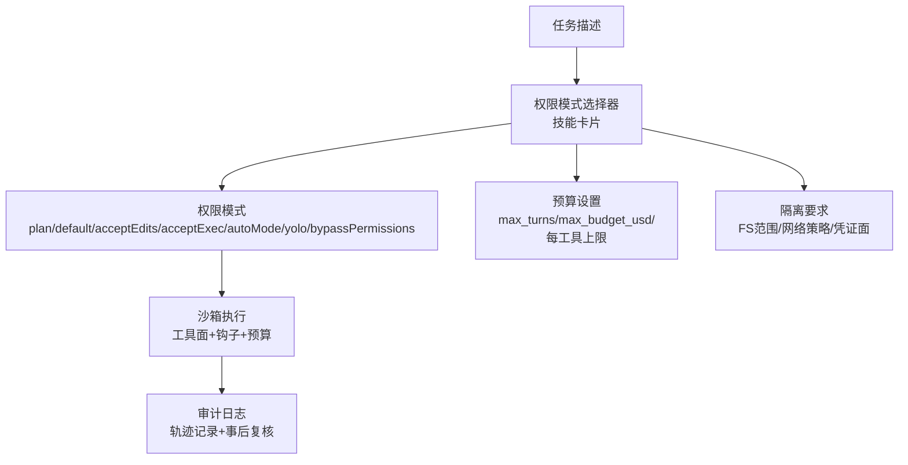
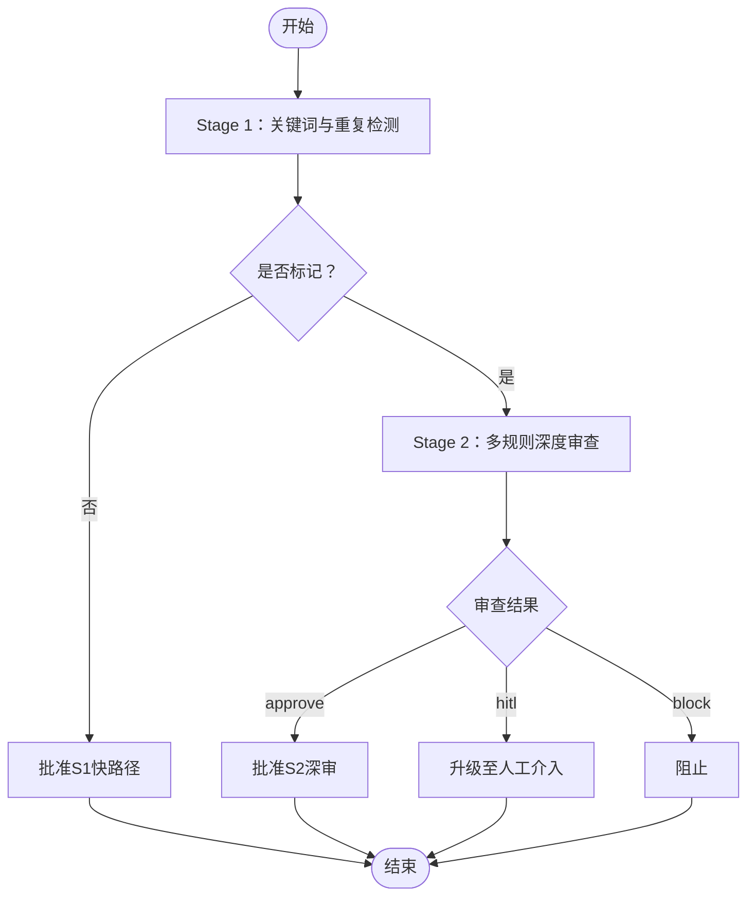
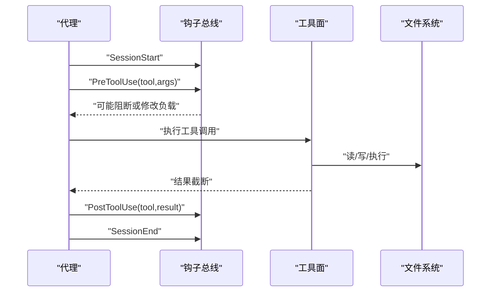
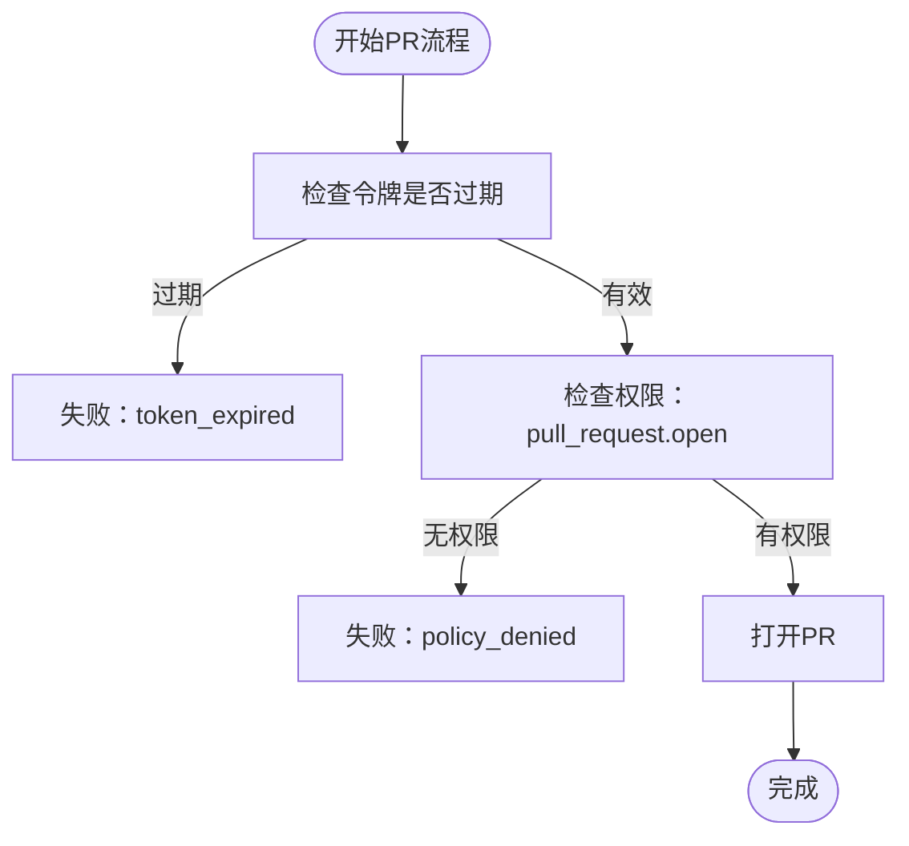
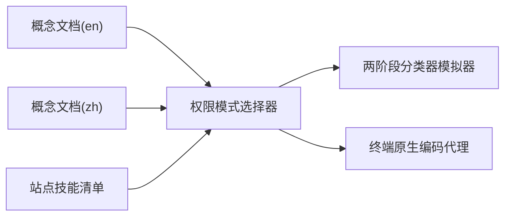

# Claude代码权限模式

<cite>
**本文档引用的文件**
- [phases/15-autonomous-systems/10-claude-code-permission-modes/docs/en.md](file://phases/15-autonomous-systems/10-claude-code-permission-modes/docs/en.md)
- [phases/15-autonomous-systems/10-claude-code-permission-modes/docs/zh.md](file://phases/15-autonomous-systems/10-claude-code-permission-modes/docs/zh.md)
- [phases/15-autonomous-systems/10-claude-code-permission-modes/outputs/skill-permission-mode-picker.md](file://phases/15-autonomous-systems/10-claude-code-permission-modes/outputs/skill-permission-mode-picker.md)
- [phases/15-autonomous-systems/10-claude-code-permission-modes/outputs/skill-permission-mode-picker.zh.md](file://phases/15-autonomous-systems/10-claude-code-permission-modes/outputs/skill-permission-mode-picker.zh.md)
- [phases/15-autonomous-systems/10-claude-code-permission-modes/code/main.py](file://phases/15-autonomous-systems/10-claude-code-permission-modes/code/main.py)
- [phases/19-capstone-projects/01-terminal-native-coding-agent/code/main.py](file://phases/19-capstone-projects/01-terminal-native-coding-agent/code/main.py)
- [phases/19-capstone-projects/01-terminal-native-coding-agent/code/ts/src/tools.ts](file://phases/19-capstone-projects/01-terminal-native-coding-agent/code/ts/src/tools.ts)
- [phases/19-capstone-projects/16-github-issue-to-pr-agent/code/main.py](file://phases/19-capstone-projects/16-github-issue-to-pr-agent/code/main.py)
- [site/data.js](file://site/data.js)
</cite>

## 目录
1. [简介](#简介)
2. [项目结构](#项目结构)
3. [核心组件](#核心组件)
4. [架构总览](#架构总览)
5. [详细组件分析](#详细组件分析)
6. [依赖关系分析](#依赖关系分析)
7. [性能考量](#性能考量)
8. [故障排查指南](#故障排查指南)
9. [结论](#结论)
10. [附录](#附录)

## 简介
本文件系统化阐述Claude代码权限模式的设计理念、实现机制与工程实践，覆盖七种权限模式的特性与适用场景、Auto Mode两阶段安全分类器的模拟实现、预算与隔离策略、以及与沙箱、钩子回调、审计日志等安全机制的协同。文档旨在帮助读者在保障代码执行安全的前提下，选择合适的权限模式与治理策略。

## 项目结构
围绕Claude代码权限模式的核心资料分布在以下位置：
- 英文与中文概念文档：系统性介绍七种权限模式、Auto Mode两阶段分类器、预算与隔离策略
- 输出技能卡片：提供任务到模式、预算与隔离的匹配模板
- 代码示例：两阶段分类器模拟器，演示分类器在不同动作轨迹上的决策过程
- 终端原生编码代理：展示沙箱工具面、路径逃逸防护、钩子回调与预算控制
- GitHub Issue到PR代理：展示运行期策略检查与安全门禁
- 站点数据：技能清单中“权限模式选择器”的元信息

**图表来源**
- [phases/15-autonomous-systems/10-claude-code-permission-modes/docs/en.md:1-114](file://phases/15-autonomous-systems/10-claude-code-permission-modes/docs/en.md#L1-L114)
- [phases/15-autonomous-systems/10-claude-code-permission-modes/outputs/skill-permission-mode-picker.md:1-41](file://phases/15-autonomous-systems/10-claude-code-permission-modes/outputs/skill-permission-mode-picker.md#L1-L41)
- [phases/15-autonomous-systems/10-claude-code-permission-modes/code/main.py:1-179](file://phases/15-autonomous-systems/10-claude-code-permission-modes/code/main.py#L1-L179)
- [phases/19-capstone-projects/01-terminal-native-coding-agent/code/main.py:1-244](file://phases/19-capstone-projects/01-terminal-native-coding-agent/code/main.py#L1-L244)
- [phases/19-capstone-projects/01-terminal-native-coding-agent/code/ts/src/tools.ts:1-44](file://phases/19-capstone-projects/01-terminal-native-coding-agent/code/ts/src/tools.ts#L1-L44)
- [phases/19-capstone-projects/16-github-issue-to-pr-agent/code/main.py:151-189](file://phases/19-capstone-projects/16-github-issue-to-pr-agent/code/main.py#L151-L189)
- [site/data.js:15546-15571](file://site/data.js#L15546-L15571)

**章节来源**
- [phases/15-autonomous-systems/10-claude-code-permission-modes/docs/en.md:1-114](file://phases/15-autonomous-systems/10-claude-code-permission-modes/docs/en.md#L1-L114)
- [phases/15-autonomous-systems/10-claude-code-permission-modes/docs/zh.md:1-114](file://phases/15-autonomous-systems/10-claude-code-permission-modes/docs/zh.md#L1-L114)
- [phases/15-autonomous-systems/10-claude-code-permission-modes/outputs/skill-permission-mode-picker.md:1-41](file://phases/15-autonomous-systems/10-claude-code-permission-modes/outputs/skill-permission-mode-picker.md#L1-L41)
- [phases/15-autonomous-systems/10-claude-code-permission-modes/outputs/skill-permission-mode-picker.zh.md:1-41](file://phases/15-autonomous-systems/10-claude-code-permission-modes/outputs/skill-permission-mode-picker.zh.md#L1-L41)
- [phases/15-autonomous-systems/10-claude-code-permission-modes/code/main.py:1-179](file://phases/15-autonomous-systems/10-claude-code-permission-modes/code/main.py#L1-L179)
- [phases/19-capstone-projects/01-terminal-native-coding-agent/code/main.py:1-244](file://phases/19-capstone-projects/01-terminal-native-coding-agent/code/main.py#L1-L244)
- [phases/19-capstone-projects/01-terminal-native-coding-agent/code/ts/src/tools.ts:1-44](file://phases/19-capstone-projects/01-terminal-native-coding-agent/code/ts/src/tools.ts#L1-L44)
- [phases/19-capstone-projects/16-github-issue-to-pr-agent/code/main.py:151-189](file://phases/19-capstone-projects/16-github-issue-to-pr-agent/code/main.py#L151-L189)
- [site/data.js:15546-15571](file://site/data.js#L15546-L15571)

## 核心组件
- 权限模式体系：七种模式构成能力阶梯，覆盖从“逐动作审批”到“自动批准+深度审查”的不同自治程度与审查强度
- Auto Mode两阶段分类器：第一阶段单token快速检查并行运行，第二阶段对被标记动作进行链式思考式审查
- 预算与隔离：max_turns、max_budget_usd、每工具动作上限，以及文件系统范围、网络策略、凭证面的隔离要求
- 沙箱与工具面：受控的工具集合（如读文件、运行shell），并内置路径逃逸检测与输出截断
- 钩子与审计：在关键生命周期事件（会话开始/结束、工具使用前后）注入钩子，记录轨迹，支撑事后审计
- 安全门禁：运行期策略检查（如令牌有效期、权限许可），避免危险操作

**章节来源**
- [phases/15-autonomous-systems/10-claude-code-permission-modes/docs/en.md:19-46](file://phases/15-autonomous-systems/10-claude-code-permission-modes/docs/en.md#L19-L46)
- [phases/15-autonomous-systems/10-claude-code-permission-modes/docs/zh.md:19-46](file://phases/15-autonomous-systems/10-claude-code-permission-modes/docs/zh.md#L19-L46)
- [phases/15-autonomous-systems/10-claude-code-permission-modes/code/main.py:34-103](file://phases/15-autonomous-systems/10-claude-code-permission-modes/code/main.py#L34-L103)
- [phases/19-capstone-projects/01-terminal-native-coding-agent/code/main.py:49-75](file://phases/19-capstone-projects/01-terminal-native-coding-agent/code/main.py#L49-L75)
- [phases/19-capstone-projects/01-terminal-native-coding-agent/code/main.py:100-125](file://phases/19-capstone-projects/01-terminal-native-coding-agent/code/main.py#L100-L125)
- [phases/19-capstone-projects/01-terminal-native-coding-agent/code/main.py:164-170](file://phases/19-capstone-projects/01-terminal-native-coding-agent/code/main.py#L164-L170)
- [phases/19-capstone-projects/16-github-issue-to-pr-agent/code/main.py:172-184](file://phases/19-capstone-projects/16-github-issue-to-pr-agent/code/main.py#L172-L184)

## 架构总览
下图展示了从任务描述到权限模式选择、预算与隔离配置，再到沙箱执行与审计复盘的整体流程。

**图表来源**
- [phases/15-autonomous-systems/10-claude-code-permission-modes/outputs/skill-permission-mode-picker.md:10-18](file://phases/15-autonomous-systems/10-claude-code-permission-modes/outputs/skill-permission-mode-picker.md#L10-L18)
- [phases/15-autonomous-systems/10-claude-code-permission-modes/docs/en.md:34-46](file://phases/15-autonomous-systems/10-claude-code-permission-modes/docs/en.md#L34-L46)
- [phases/19-capstone-projects/01-terminal-native-coding-agent/code/main.py:160-224](file://phases/19-capstone-projects/01-terminal-native-coding-agent/code/main.py#L160-L224)

## 详细组件分析

### 七种权限模式与适用场景
- plan：整体计划审批，适合不熟悉任务、生产相关或首次使用
- default：仅对高风险动作（shell、破坏性操作、网络调用）提示用户
- acceptEdits：文件写入自动批准，shell执行仍需确认
- acceptExec：在允许列表内的shell命令与写入自动批准
- autoMode：两阶段分类器；被标记动作进入深度审查
- yolo：跳过多数提示，仍执行工具允许/拒绝列表
- bypassPermissions：全部批准，仅限可丢弃的临时容器

这些模式在速度与审查强度之间权衡，Auto Mode将逐动作审批委托给模型，同时保留人工介入通道。

**章节来源**
- [phases/15-autonomous-systems/10-claude-code-permission-modes/docs/en.md:20-32](file://phases/15-autonomous-systems/10-claude-code-permission-modes/docs/en.md#L20-L32)
- [phases/15-autonomous-systems/10-claude-code-permission-modes/docs/zh.md:20-32](file://phases/15-autonomous-systems/10-claude-code-permission-modes/docs/zh.md#L20-L32)

### Auto Mode两阶段分类器
- 第一阶段（Stage 1）：单token等价的廉价关键词规则，对每个提议动作并行检查；同时检测连续相同动作的重复循环
- 第二阶段（Stage 2）：对被标记动作进行更深入的多规则审查，包括允许列表主机的curl豁免、外泄URL形状、根目录破坏性操作、特权提升等；若不自信则升级至人工介入

模拟器通过合成轨迹演示分类器的捕获与遗漏边界，强调分类器是“一层防护，非万能”。

**图表来源**
- [phases/15-autonomous-systems/10-claude-code-permission-modes/code/main.py:34-103](file://phases/15-autonomous-systems/10-claude-code-permission-modes/code/main.py#L34-L103)

**章节来源**
- [phases/15-autonomous-systems/10-claude-code-permission-modes/code/main.py:1-179](file://phases/15-autonomous-systems/10-claude-code-permission-modes/code/main.py#L1-L179)
- [phases/15-autonomous-systems/10-claude-code-permission-modes/docs/en.md:34-61](file://phases/15-autonomous-systems/10-claude-code-permission-modes/docs/en.md#L34-L61)
- [phases/15-autonomous-systems/10-claude-code-permission-modes/docs/zh.md:34-61](file://phases/15-autonomous-systems/10-claude-code-permission-modes/docs/zh.md#L34-L61)

### 权限模式选择器（技能卡片）
该技能卡片提供从任务描述到权限模式、预算与隔离的标准化输出模板，包含：
- 任务概况与最坏情况爆炸半径
- 模式推荐及理由
- 预算参数（max_turns、max_budget_usd、每工具上限）
- 隔离要求（文件系统范围、网络策略、凭证面）
- 轨迹审计计划（尤其针对autoMode、yolo与超30分钟任务）

并给出硬性拒绝与拒绝规则，确保安全基线不被突破。

**章节来源**
- [phases/15-autonomous-systems/10-claude-code-permission-modes/outputs/skill-permission-mode-picker.md:10-41](file://phases/15-autonomous-systems/10-claude-code-permission-modes/outputs/skill-permission-mode-picker.md#L10-L41)
- [phases/15-autonomous-systems/10-claude-code-permission-modes/outputs/skill-permission-mode-picker.zh.md:10-41](file://phases/15-autonomous-systems/10-claude-code-permission-modes/outputs/skill-permission-mode-picker.zh.md#L10-L41)

### 沙箱与工具面（路径逃逸防护与输出截断）
终端原生编码代理展示了：
- 受控工具面：读文件、运行shell等
- 路径逃逸防护：通过真实路径解析与前缀校验，确保访问限定在沙箱范围内
- 输出截断：限制每次工具调用的返回长度，降低内存与泄露风险
- 预算控制：回合数、token与美元上限
- 钩子回调：在会话开始/结束、工具使用前后注入处理逻辑，支持破坏性命令拦截与轨迹记录

**图表来源**
- [phases/19-capstone-projects/01-terminal-native-coding-agent/code/main.py:84-98](file://phases/19-capstone-projects/01-terminal-native-coding-agent/code/main.py#L84-L98)
- [phases/19-capstone-projects/01-terminal-native-coding-agent/code/main.py:107-125](file://phases/19-capstone-projects/01-terminal-native-coding-agent/code/main.py#L107-L125)
- [phases/19-capstone-projects/01-terminal-native-coding-agent/code/main.py:172-224](file://phases/19-capstone-projects/01-terminal-native-coding-agent/code/main.py#L172-L224)

**章节来源**
- [phases/19-capstone-projects/01-terminal-native-coding-agent/code/main.py:107-125](file://phases/19-capstone-projects/01-terminal-native-coding-agent/code/main.py#L107-L125)
- [phases/19-capstone-projects/01-terminal-native-coding-agent/code/main.py:164-170](file://phases/19-capstone-projects/01-terminal-native-coding-agent/code/main.py#L164-L170)
- [phases/19-capstone-projects/01-terminal-native-coding-agent/code/main.py:49-75](file://phases/19-capstone-projects/01-terminal-native-coding-agent/code/main.py#L49-L75)
- [phases/19-capstone-projects/01-terminal-native-coding-agent/code/ts/src/tools.ts:11-28](file://phases/19-capstone-projects/01-terminal-native-coding-agent/code/ts/src/tools.ts#L11-L28)

### 运行期安全门禁（以PR为例）
在无人值守的PR自动化流程中，运行期检查至关重要：
- 令牌过期检测：若已过期则拒绝
- 权限许可检查：若不具备pull_request.open权限则拒绝
- 明确的失败原因与状态转换，避免使用可被优化掉的断言作为安全门

**图表来源**
- [phases/19-capstone-projects/16-github-issue-to-pr-agent/code/main.py:172-184](file://phases/19-capstone-projects/16-github-issue-to-pr-agent/code/main.py#L172-L184)

**章节来源**
- [phases/19-capstone-projects/16-github-issue-to-pr-agent/code/main.py:172-184](file://phases/19-capstone-projects/16-github-issue-to-pr-agent/code/main.py#L172-L184)

## 依赖关系分析
- 权限模式选择器依赖于概念文档中的模式定义与Auto Mode说明
- 两阶段分类器模拟器独立运行，但与概念文档中的规则说明耦合
- 终端原生编码代理将权限模式思想落地为可观察的沙箱执行与钩子回调
- 站点数据中的技能清单将“权限模式选择器”作为可发现的技能项

**图表来源**
- [phases/15-autonomous-systems/10-claude-code-permission-modes/docs/en.md:1-114](file://phases/15-autonomous-systems/10-claude-code-permission-modes/docs/en.md#L1-L114)
- [phases/15-autonomous-systems/10-claude-code-permission-modes/docs/zh.md:1-114](file://phases/15-autonomous-systems/10-claude-code-permission-modes/docs/zh.md#L1-L114)
- [phases/15-autonomous-systems/10-claude-code-permission-modes/outputs/skill-permission-mode-picker.md:1-41](file://phases/15-autonomous-systems/10-claude-code-permission-modes/outputs/skill-permission-mode-picker.md#L1-L41)
- [phases/15-autonomous-systems/10-claude-code-permission-modes/code/main.py:1-179](file://phases/15-autonomous-systems/10-claude-code-permission-modes/code/main.py#L1-L179)
- [phases/19-capstone-projects/01-terminal-native-coding-agent/code/main.py:1-244](file://phases/19-capstone-projects/01-terminal-native-coding-agent/code/main.py#L1-L244)
- [site/data.js:15546-15571](file://site/data.js#L15546-L15571)

**章节来源**
- [site/data.js:15546-15571](file://site/data.js#L15546-L15571)

## 性能考量
- 并行化：第一阶段单token检查并行运行，避免阻塞主代理循环
- 成本控制：通过max_budget_usd与每工具上限限制潜在的资源消耗
- I/O与内存：工具输出截断减少内存占用与泄露面
- 重复检测：在第一阶段识别连续相同动作，避免冗余开销

[本节为通用指导，无需特定文件分析]

## 故障排查指南
- 分类器误判
  - 现象：允许列表主机的curl被误标，或重复循环未被识别
  - 处理：扩展第一阶段关键词规则，完善第二阶段允许列表与规则权重
- 轨迹遗漏
  - 现象：组合式外泄（分步均安全）未被捕获
  - 处理：强化轨迹审计与事后复核，结合预算与隔离策略
- 沙箱逃逸
  - 现象：路径解析异常导致越界访问
  - 处理：严格realpath校验与前缀匹配，确保所有访问限定在沙箱根下
- 运行期策略违规
  - 现象：令牌过期或权限不足导致操作失败
  - 处理：在PreToolUse阶段加入显式检查，避免使用可被优化掉的断言

**章节来源**
- [phases/15-autonomous-systems/10-claude-code-permission-modes/code/main.py:34-103](file://phases/15-autonomous-systems/10-claude-code-permission-modes/code/main.py#L34-L103)
- [phases/19-capstone-projects/01-terminal-native-coding-agent/code/main.py:107-125](file://phases/19-capstone-projects/01-terminal-native-coding-agent/code/main.py#L107-L125)
- [phases/19-capstone-projects/16-github-issue-to-pr-agent/code/main.py:172-184](file://phases/19-capstone-projects/16-github-issue-to-pr-agent/code/main.py#L172-L184)

## 结论
Claude代码权限模式通过七种模式与Auto Mode两阶段分类器，提供了从“逐动作审批”到“自动批准+深度审查”的渐进式自治路径。配合预算、隔离与沙箱工具面，以及钩子与审计日志，形成“可观察、可治理、可复盘”的安全闭环。实际应用中应依据任务的爆炸半径与风险等级，选择合适模式与预算，并严格执行隔离与审计策略。

[本节为总结，无需特定文件分析]

## 附录
- 术语表
  - 权限模式：控制逐动作批准的七种命名策略
  - autoMode：两阶段安全分类器；标记动作升级审查
  - Stage 1分类器：单token规则，快速并行检查
  - Stage 2分类器：链式思考式审查，必要时升级人工介入
  - 研究预览：Anthropic对尚未完全成熟功能的框架

**章节来源**
- [phases/15-autonomous-systems/10-claude-code-permission-modes/docs/en.md:94-106](file://phases/15-autonomous-systems/10-claude-code-permission-modes/docs/en.md#L94-L106)
- [phases/15-autonomous-systems/10-claude-code-permission-modes/docs/zh.md:94-106](file://phases/15-autonomous-systems/10-claude-code-permission-modes/docs/zh.md#L94-L106)