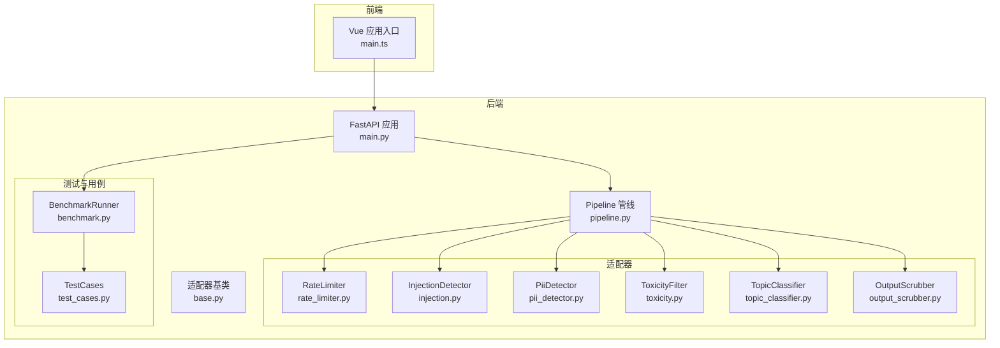
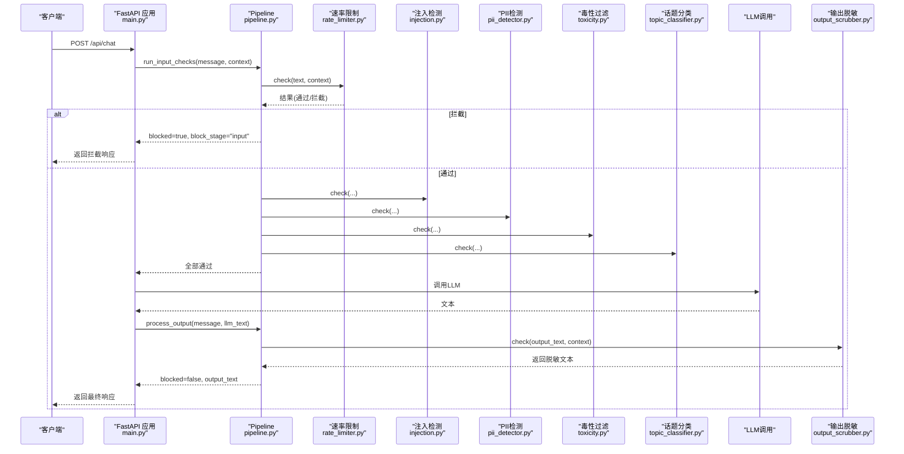
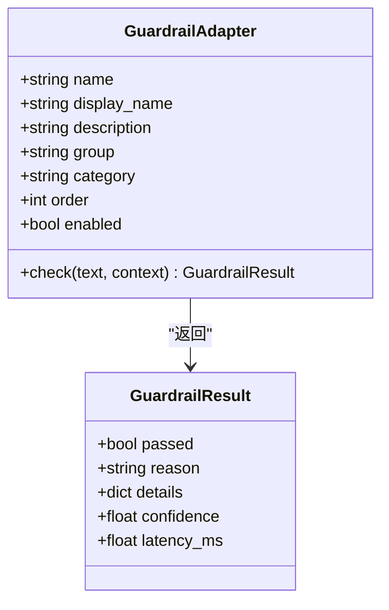
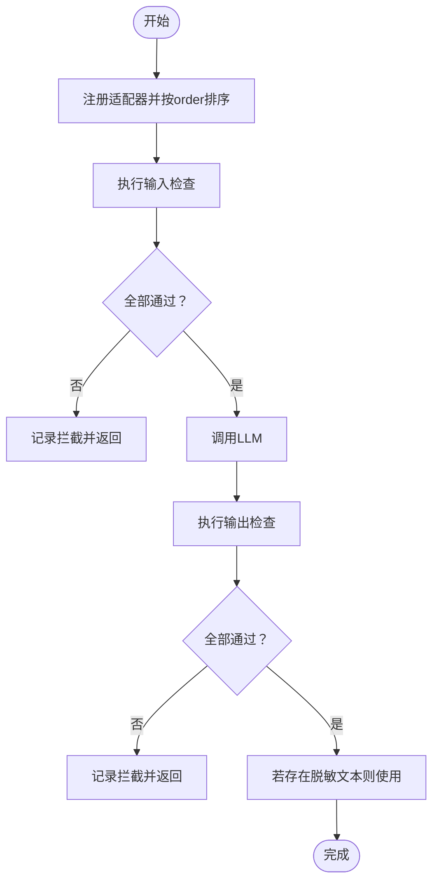
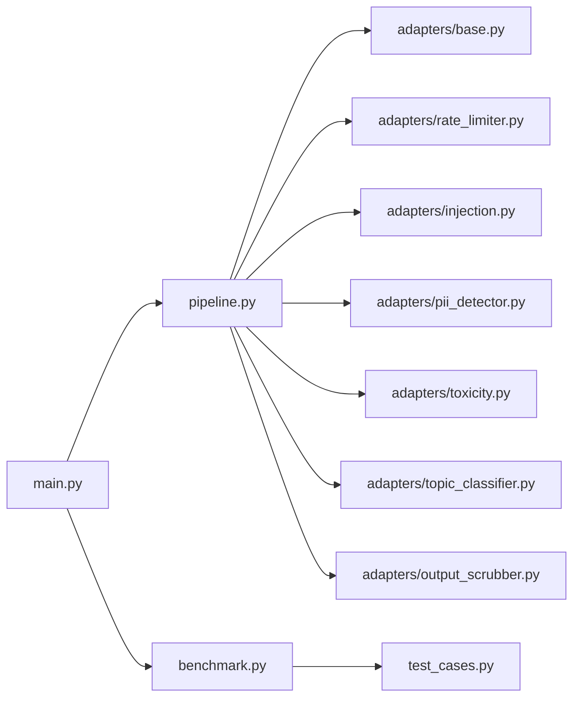

# Llama Guard安全防护

<cite>
**本文引用的文件**
- [main.py](file://guardrails-sandbox/backend/main.py)
- [pipeline.py](file://guardrails-sandbox/backend/pipeline.py)
- [base.py](file://guardrails-sandbox/backend/adapters/base.py)
- [injection.py](file://guardrails-sandbox/backend/adapters/injection.py)
- [toxicity.py](file://guardrails-sandbox/backend/adapters/toxicity.py)
- [pii_detector.py](file://guardrails-sandbox/backend/adapters/pii_detector.py)
- [topic_classifier.py](file://guardrails-sandbox/backend/adapters/topic_classifier.py)
- [output_scrubber.py](file://guardrails-sandbox/backend/adapters/output_scrubber.py)
- [rate_limiter.py](file://guardrails-sandbox/backend/adapters/rate_limiter.py)
- [benchmark.py](file://guardrails-sandbox/backend/benchmark.py)
- [test_cases.py](file://guardrails-sandbox/backend/test_cases.py)
- [main.ts](file://guardrails-sandbox/frontend/src/main.ts)
</cite>

## 目录
1. [简介](#简介)
2. [项目结构](#项目结构)
3. [核心组件](#核心组件)
4. [架构总览](#架构总览)
5. [详细组件分析](#详细组件分析)
6. [依赖分析](#依赖分析)
7. [性能考虑](#性能考虑)
8. [故障排查指南](#故障排查指南)
9. [结论](#结论)
10. [附录](#附录)

## 简介
本文件面向“Llama Guard安全防护”系统，围绕Guardrails沙箱后端实现，系统化阐述输入/输出双层安全检测、威胁识别与防护策略、误报控制与漏检预防、性能优化与集成方式。文档以代码级分析为基础，辅以可视化图示，帮助读者快速理解并高效部署与扩展。

## 项目结构
后端采用“适配器模式 + 管线编排”的分层设计：
- 适配器层：定义统一接口，具体实现各类安全能力（速率限制、注入检测、PII检测、毒性过滤、话题分类、输出脱敏等）
- 管线层：负责注册、排序、短路执行、统计与拦截历史记录
- 服务层：FastAPI对外提供聊天、对比模式、基准测试、MCP工具调用等接口
- 前端层：Vue应用入口，提供可视化调试界面

图表来源
- [main.py:1-421](file://guardrails-sandbox/backend/main.py#L1-L421)
- [pipeline.py:1-285](file://guardrails-sandbox/backend/pipeline.py#L1-L285)
- [base.py:1-34](file://guardrails-sandbox/backend/adapters/base.py#L1-L34)
- [rate_limiter.py:1-56](file://guardrails-sandbox/backend/adapters/rate_limiter.py#L1-L56)
- [injection.py:1-88](file://guardrails-sandbox/backend/adapters/injection.py#L1-L88)
- [pii_detector.py:1-54](file://guardrails-sandbox/backend/adapters/pii_detector.py#L1-L54)
- [toxicity.py:1-64](file://guardrails-sandbox/backend/adapters/toxicity.py#L1-L64)
- [topic_classifier.py:1-54](file://guardrails-sandbox/backend/adapters/topic_classifier.py#L1-L54)
- [output_scrubber.py:1-56](file://guardrails-sandbox/backend/adapters/output_scrubber.py#L1-L56)
- [benchmark.py:1-169](file://guardrails-sandbox/backend/benchmark.py#L1-L169)
- [test_cases.py:1-155](file://guardrails-sandbox/backend/test_cases.py#L1-L155)
- [main.ts:1-5](file://guardrails-sandbox/frontend/src/main.ts#L1-L5)

章节来源
- [main.py:1-421](file://guardrails-sandbox/backend/main.py#L1-L421)
- [pipeline.py:1-285](file://guardrails-sandbox/backend/pipeline.py#L1-L285)
- [main.ts:1-5](file://guardrails-sandbox/frontend/src/main.ts#L1-L5)

## 核心组件
- 适配器基类与结果封装
  - GuardrailResult：统一承载“是否通过、原因、置信度、耗时、细节”
  - GuardrailAdapter：定义name/display_name/description/group/category/order/enabled等元信息与check接口
- 管线编排Pipeline
  - 注册适配器并按order排序；分别执行input/output检查；短路拦截；统计与拦截历史
- 适配器实现
  - 输入层：速率限制、注入检测、PII检测、毒性过滤、话题分类
  - 输出层：输出脱敏（PII替换为占位符）
- 测试与评估
  - 基准测试Runner聚合TPR/FPR/精确率/F1等指标，并支持按类别统计

章节来源
- [base.py:1-34](file://guardrails-sandbox/backend/adapters/base.py#L1-L34)
- [pipeline.py:1-285](file://guardrails-sandbox/backend/pipeline.py#L1-L285)
- [benchmark.py:1-169](file://guardrails-sandbox/backend/benchmark.py#L1-L169)

## 架构总览
下图展示了从客户端请求到LLM调用再到输出处理的完整流程，以及各适配器在输入/输出阶段的执行顺序与短路逻辑。

图表来源
- [main.py:155-221](file://guardrails-sandbox/backend/main.py#L155-L221)
- [pipeline.py:31-160](file://guardrails-sandbox/backend/pipeline.py#L31-L160)
- [rate_limiter.py:22-55](file://guardrails-sandbox/backend/adapters/rate_limiter.py#L22-L55)
- [injection.py:53-87](file://guardrails-sandbox/backend/adapters/injection.py#L53-L87)
- [pii_detector.py:28-53](file://guardrails-sandbox/backend/adapters/pii_detector.py#L28-L53)
- [toxicity.py:31-63](file://guardrails-sandbox/backend/adapters/toxicity.py#L31-L63)
- [topic_classifier.py:29-53](file://guardrails-sandbox/backend/adapters/topic_classifier.py#L29-L53)
- [output_scrubber.py:25-55](file://guardrails-sandbox/backend/adapters/output_scrubber.py#L25-L55)

## 详细组件分析

### 适配器基类与结果封装
- 设计要点
  - 统一的GuardrailResult字段便于统计与日志输出
  - Adapter元信息决定树形展示与执行顺序
  - check(text, context)抽象接口，子类仅需实现判定逻辑
- 性能与可观测性
  - 每个适配器记录latency_ms，便于定位瓶颈
  - details中携带匹配/置信度等诊断信息

图表来源
- [base.py:5-34](file://guardrails-sandbox/backend/adapters/base.py#L5-L34)

章节来源
- [base.py:1-34](file://guardrails-sandbox/backend/adapters/base.py#L1-L34)

### 管线编排Pipeline
- 能力
  - 注册与排序：按order升序执行，同层按name稳定排序
  - 输入/输出检查：逐个执行，遇阻即短路
  - 统计与历史：累计总数/拦截数/按层统计；记录最近50条拦截历史
  - 开关控制：动态启用/禁用某适配器
- 关键流程
  - run_input_checks：收集日志，首个失败即返回
  - run_output_checks：支持脱敏上下文传递，优先使用脱敏文本
  - process/process_output：对外暴露的高层接口

图表来源
- [pipeline.py:18-160](file://guardrails-sandbox/backend/pipeline.py#L18-L160)

章节来源
- [pipeline.py:1-285](file://guardrails-sandbox/backend/pipeline.py#L1-L285)

### 速率限制（RateLimiter）
- 策略
  - 基于滑动窗口的RPM限制，按用户等级（free/pro/enterprise）设置不同上限
  - 每60秒清理过期时间戳，当前窗口长度超过阈值则拦截
- 误报控制
  - 严格拦截，置信度1.0，避免误伤
- 性能
  - O(n)窗口清理，n为当前用户窗口长度；内存队列操作均摊O(1)

章节来源
- [rate_limiter.py:1-56](file://guardrails-sandbox/backend/adapters/rate_limiter.py#L1-L56)

### 提示注入检测（InjectionDetector）
- 技术
  - 正则匹配已知攻击模式（英文/中文），包含编码绕过检测
  - 对每个匹配项记录类型与置信度，取最大置信度作为整体评分
- 阈值
  - 当前实现以阈值0.75进行拦截判定
- 误报控制
  - 编码绕过模式单独标注，降低误判概率
- 性能
  - 多正则扫描，复杂度与模式数量成正比；建议在高频场景下缓存或预编译

章节来源
- [injection.py:1-88](file://guardrails-sandbox/backend/adapters/injection.py#L1-L88)

### PII检测（PiiDetector）
- 技术
  - 使用正则识别手机号、邮箱、身份证、信用卡、IP地址
  - IP地址仅警告不拦截，减少误报
- 误报控制
  - 对IP地址采用“警告优先”策略
- 性能
  - 多正则扫描；建议合并模式或使用更高效的字符串匹配库

章节来源
- [pii_detector.py:1-54](file://guardrails-sandbox/backend/adapters/pii_detector.py#L1-L54)

### 毒性过滤（ToxicityFilter）
- 技术
  - 针对暴力、违法、自残、仇恨、色情等敏感主题建立正则
  - 安全上下文前缀豁免（如“如何预防/帮助...”），避免误判
- 误报控制
  - 敏感话题的正当讨论场景通过前缀豁免
- 性能
  - 小规模正则集合，性能开销低

章节来源
- [toxicity.py:1-64](file://guardrails-sandbox/backend/adapters/toxicity.py#L1-L64)

### 话题分类（TopicClassifier）
- 技术
  - 明确禁止关键词优先拦截；其余输入默认放行
- 误报控制
  - “黑名单优先 + 白名单宽松”的组合策略
- 性能
  - 关键字匹配，常数时间检查

章节来源
- [topic_classifier.py:1-54](file://guardrails-sandbox/backend/adapters/topic_classifier.py#L1-L54)

### 输出脱敏（OutputScrubber）
- 技术
  - 在输出层对邮箱、SSN、信用卡、手机号、身份证进行替换
  - 通过context传递脱敏后的文本，后续适配器可读取
- 误报控制
  - 仅替换不拦截，置信度用于记录脱敏程度
- 性能
  - 多正则替换，建议批量处理或使用更高效的替换策略

章节来源
- [output_scrubber.py:1-56](file://guardrails-sandbox/backend/adapters/output_scrubber.py#L1-L56)

### 基准测试与评估（BenchmarkRunner/TestCases）
- 用例库
  - 正常查询、注入攻击、语义变种、PII、毒性内容、边界情况等
- 评估指标
  - 准确率、拦截率（TPR）、误拦率（FPR）、精确率、F1分数
  - 按类别与按拦截层统计
- 误报/漏检预防
  - 通过大量边界用例验证，指导阈值与规则调整

章节来源
- [benchmark.py:1-169](file://guardrails-sandbox/backend/benchmark.py#L1-L169)
- [test_cases.py:1-155](file://guardrails-sandbox/backend/test_cases.py#L1-L155)

## 依赖分析
- 组件耦合
  - Pipeline集中管理适配器生命周期与执行顺序，低耦合高内聚
  - 适配器之间无直接依赖，通过Pipeline统一调度
- 外部依赖
  - FastAPI提供HTTP接口
  - 基准测试依赖测试用例集合
- 循环依赖
  - 无循环导入；适配器仅依赖base.py

图表来源
- [main.py:16-58](file://guardrails-sandbox/backend/main.py#L16-L58)
- [pipeline.py:12-24](file://guardrails-sandbox/backend/pipeline.py#L12-L24)
- [base.py:14-34](file://guardrails-sandbox/backend/adapters/base.py#L14-L34)

章节来源
- [main.py:1-421](file://guardrails-sandbox/backend/main.py#L1-L421)
- [pipeline.py:1-285](file://guardrails-sandbox/backend/pipeline.py#L1-L285)

## 性能考虑
- 适配器执行顺序
  - 将轻量且高命中率的适配器前置（如速率限制、注入检测），尽早短路
- 正则优化
  - 合并相似模式、预编译正则、避免回溯陷阱
- 上下文传递
  - 输出脱敏通过context传递，避免重复扫描
- 模型预热
  - 启动时预加载sentence-transformers模型，避免异步环境连接问题
- 并发与限流
  - 速率限制器结合用户等级，防止突发流量导致系统过载

章节来源
- [main.py:62-76](file://guardrails-sandbox/backend/main.py#L62-L76)
- [rate_limiter.py:16-28](file://guardrails-sandbox/backend/adapters/rate_limiter.py#L16-L28)

## 故障排查指南
- 常见问题
  - 请求被拦截：检查拦截历史与对应适配器日志，定位触发原因
  - 误拦截：调整阈值或规则；必要时增加安全上下文豁免
  - 漏拦截：补充测试用例与正则模式；提升置信度阈值
  - 性能瓶颈：分析各适配器latency_ms，优化正则或引入缓存
- 排查步骤
  - 查看拦截历史：/api/guardrails/block-history
  - 切换适配器开关：/api/guardrails/toggle
  - 对比模式：/api/chat/compare，对比开启/关闭Guardrails的效果
  - 基准测试：/api/benchmark，生成TPR/FPR等指标报告

章节来源
- [main.py:121-153](file://guardrails-sandbox/backend/main.py#L121-L153)
- [main.py:223-256](file://guardrails-sandbox/backend/main.py#L223-L256)
- [main.py:272-280](file://guardrails-sandbox/backend/main.py#L272-L280)
- [pipeline.py:264-285](file://guardrails-sandbox/backend/pipeline.py#L264-L285)

## 结论
Llama Guard安全防护系统通过“适配器 + 管线”的模块化设计，实现了输入/输出双层安全检测与高效编排。系统具备完善的误报控制、漏检预防与性能优化策略，并提供可视化调试与基准测试能力，适合在生产环境中持续演进与落地。

## 附录

### API一览（节选）
- 获取适配器树与统计
  - GET /api/guardrails
  - GET /api/adapters/tree
  - GET /api/guardrails/block-history
- 控制与运维
  - POST /api/guardrails/toggle
  - POST /api/guardrails/clear-history
  - POST /api/chat/reset-stats
- 聊天接口
  - POST /api/chat
  - POST /api/chat/compare
- 基准测试
  - POST /api/benchmark

章节来源
- [main.py:121-280](file://guardrails-sandbox/backend/main.py#L121-L280)