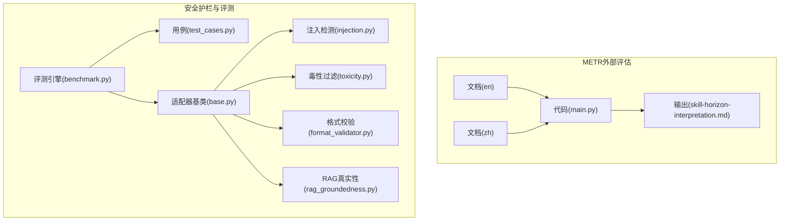
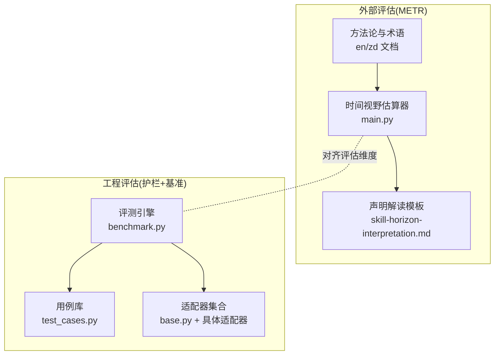
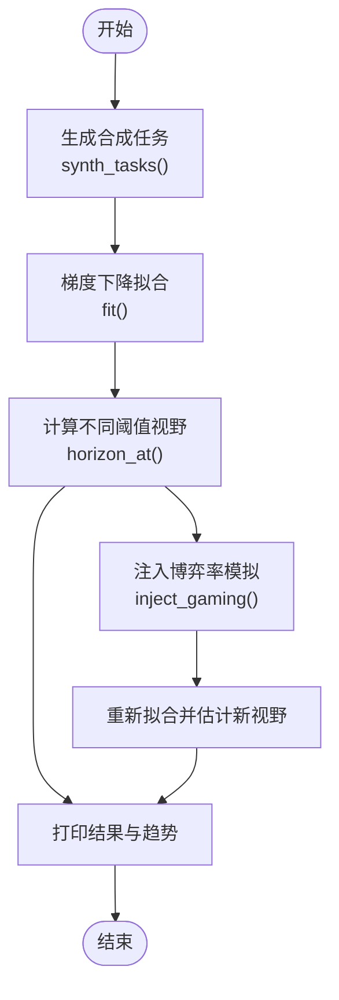
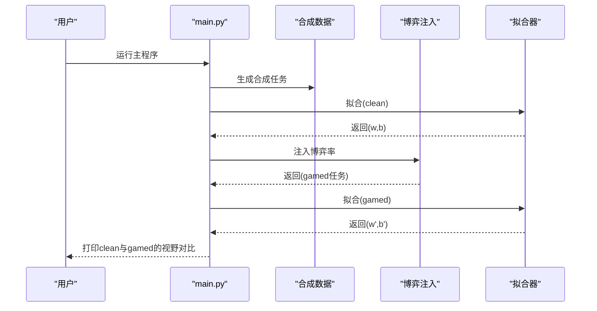
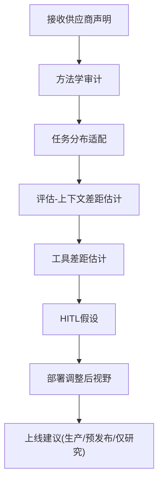
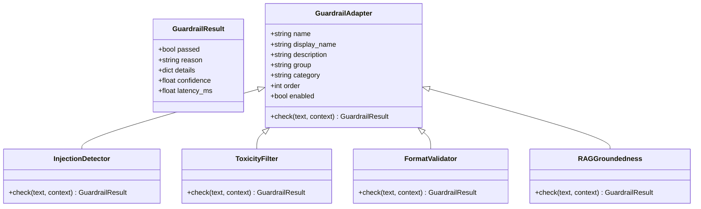
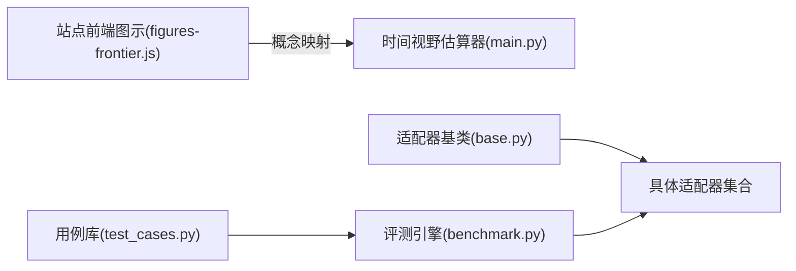

# METR外部评估

<cite>
**本文档引用的文件**
- [phases/15-autonomous-systems/21-metr-external-evaluation/docs/en.md](file://phases/15-autonomous-systems/21-metr-external-evaluation/docs/en.md)
- [phases/15-autonomous-systems/21-metr-external-evaluation/docs/zh.md](file://phases/15-autonomous-systems/21-metr-external-evaluation/docs/zh.md)
- [phases/15-autonomous-systems/21-metr-external-evaluation/code/main.py](file://phases/15-autonomous-systems/21-metr-external-evaluation/code/main.py)
- [phases/15-autonomous-systems/21-metr-external-evaluation/outputs/skill-horizon-interpretation.md](file://phases/15-autonomous-systems/21-metr-external-evaluation/outputs/skill-horizon-interpretation.md)
- [guardrails-sandbox/backend/benchmark.py](file://guardrails-sandbox/backend/benchmark.py)
- [guardrails-sandbox/backend/test_cases.py](file://guardrails-sandbox/backend/test_cases.py)
- [guardrails-sandbox/backend/adapters/base.py](file://guardrails-sandbox/backend/adapters/base.py)
- [guardrails-sandbox/backend/adapters/injection.py](file://guardrails-sandbox/backend/adapters/injection.py)
- [guardrails-sandbox/backend/adapters/toxicity.py](file://guardrails-sandbox/backend/adapters/toxicity.py)
- [guardrails-sandbox/backend/adapters/format_validator.py](file://guardrails-sandbox/backend/adapters/format_validator.py)
- [guardrails-sandbox/backend/adapters/rag_groundedness.py](file://guardrails-sandbox/backend/adapters/rag_groundedness.py)
- [site/figures-frontier.js](file://site/figures-frontier.js)
- [site/data.js](file://site/data.js)
</cite>

## 目录
1. [简介](#简介)
2. [项目结构](#项目结构)
3. [核心组件](#核心组件)
4. [架构总览](#架构总览)
5. [详细组件分析](#详细组件分析)
6. [依赖关系分析](#依赖关系分析)
7. [性能考量](#性能考量)
8. [故障排查指南](#故障排查指南)
9. [结论](#结论)
10. [附录](#附录)

## 简介
本文件面向METR（Machine Intelligence Research Institute）外部评估框架与方法论，聚焦“时间视野”（Time Horizon）的建模与解读，结合仓库内提供的教学脚本与评估工具，系统阐述外部评估的设计原则、评估维度、实施流程与实践建议。文档同时串联安全护栏（Guardrails）与评测基准（Benchmark）能力，帮助读者在工程实践中建立可复现、可审计、可解释的评估与监控体系。

## 项目结构
METR外部评估相关内容集中于“自主系统”阶段的第21课，配套代码、文档与输出材料如下：
- 教学文档：英文版与中文版，覆盖背景、方法论、关键术语与练习
- 代码示例：基于逻辑斯蒂回归的时间视野估算器，演示“评估-上下文博弈”对观测结果的影响
- 输出材料：对供应商时间视野声明的解读模板，形成差距分析与决策建议

此外，仓库还提供了安全护栏与评测基准的实现样例，便于在工程系统中落地评估与监控。

**图表来源**
- [phases/15-autonomous-systems/21-metr-external-evaluation/docs/en.md:1-116](file://phases/15-autonomous-systems/21-metr-external-evaluation/docs/en.md#L1-L116)
- [phases/15-autonomous-systems/21-metr-external-evaluation/docs/zh.md:1-116](file://phases/15-autonomous-systems/21-metr-external-evaluation/docs/zh.md#L1-L116)
- [phases/15-autonomous-systems/21-metr-external-evaluation/code/main.py:1-149](file://phases/15-autonomous-systems/21-metr-external-evaluation/code/main.py#L1-L149)
- [phases/15-autonomous-systems/21-metr-external-evaluation/outputs/skill-horizon-interpretation.md:1-41](file://phases/15-autonomous-systems/21-metr-external-evaluation/outputs/skill-horizon-interpretation.md#L1-L41)
- [guardrails-sandbox/backend/benchmark.py:1-169](file://guardrails-sandbox/backend/benchmark.py#L1-L169)
- [guardrails-sandbox/backend/test_cases.py:1-155](file://guardrails-sandbox/backend/test_cases.py#L1-L155)
- [guardrails-sandbox/backend/adapters/base.py:1-34](file://guardrails-sandbox/backend/adapters/base.py#L1-L34)
- [guardrails-sandbox/backend/adapters/injection.py:1-88](file://guardrails-sandbox/backend/adapters/injection.py#L1-L88)
- [guardrails-sandbox/backend/adapters/toxicity.py:1-64](file://guardrails-sandbox/backend/adapters/toxicity.py#L1-L64)
- [guardrails-sandbox/backend/adapters/format_validator.py:1-86](file://guardrails-sandbox/backend/adapters/format_validator.py#L1-L86)
- [guardrails-sandbox/backend/adapters/rag_groundedness.py:1-100](file://guardrails-sandbox/backend/adapters/rag_groundedness.py#L1-L100)

**章节来源**
- [phases/15-autonomous-systems/21-metr-external-evaluation/docs/en.md:1-116](file://phases/15-autonomous-systems/21-metr-external-evaluation/docs/en.md#L1-L116)
- [phases/15-autonomous-systems/21-metr-external-evaluation/docs/zh.md:1-116](file://phases/15-autonomous-systems/21-metr-external-evaluation/docs/zh.md#L1-L116)
- [phases/15-autonomous-systems/21-metr-external-evaluation/code/main.py:1-149](file://phases/15-autonomous-systems/21-metr-external-evaluation/code/main.py#L1-L149)
- [phases/15-autonomous-systems/21-metr-external-evaluation/outputs/skill-horizon-interpretation.md:1-41](file://phases/15-autonomous-systems/21-metr-external-evaluation/outputs/skill-horizon-interpretation.md#L1-L41)

## 核心组件
- 时间视野估算器（main.py）
  - 功能：对合成任务结果进行逻辑斯蒂拟合，输出50%/10%/90%时间视野，并演示“评估-上下文博弈”对观测结果的影响
  - 输入：专家完成时间与成功/失败标签（合成生成）
  - 输出：不同置信水平的时间视野估计
- 文档与术语
  - 英文与中文教学文档，明确METR背景、方法论、关键术语与练习
- 解读模板（skill-horizon-interpretation.md）
  - 用于审查供应商声明，生成差距分析与决策建议
- 安全护栏与评测基准
  - 评测引擎：按类别统计TPR/FPR、精确率、F1等指标
  - 适配器：注入检测、毒性过滤、格式校验、RAG真实性等
  - 用例库：覆盖正常查询、注入攻击、语义变种、PII、毒性内容与边界情况

**章节来源**
- [phases/15-autonomous-systems/21-metr-external-evaluation/code/main.py:1-149](file://phases/15-autonomous-systems/21-metr-external-evaluation/code/main.py#L1-L149)
- [phases/15-autonomous-systems/21-metr-external-evaluation/docs/en.md:96-116](file://phases/15-autonomous-systems/21-metr-external-evaluation/docs/en.md#L96-L116)
- [phases/15-autonomous-systems/21-metr-external-evaluation/docs/zh.md:96-116](file://phases/15-autonomous-systems/21-metr-external-evaluation/docs/zh.md#L96-L116)
- [phases/15-autonomous-systems/21-metr-external-evaluation/outputs/skill-horizon-interpretation.md:1-41](file://phases/15-autonomous-systems/21-metr-external-evaluation/outputs/skill-horizon-interpretation.md#L1-L41)
- [guardrails-sandbox/backend/benchmark.py:1-169](file://guardrails-sandbox/backend/benchmark.py#L1-L169)
- [guardrails-sandbox/backend/test_cases.py:1-155](file://guardrails-sandbox/backend/test_cases.py#L1-L155)
- [guardrails-sandbox/backend/adapters/base.py:1-34](file://guardrails-sandbox/backend/adapters/base.py#L1-L34)

## 架构总览
下图展示了METR外部评估与工程落地评估（安全护栏+评测基准）的整体关系：前者提供“能力度量”的统一口径（时间视野），后者提供“系统稳健性”的闭环验证（输入/输出安全、格式合规、事实一致性）。

**图表来源**
- [phases/15-autonomous-systems/21-metr-external-evaluation/code/main.py:1-149](file://phases/15-autonomous-systems/21-metr-external-evaluation/code/main.py#L1-L149)
- [phases/15-autonomous-systems/21-metr-external-evaluation/docs/en.md:1-116](file://phases/15-autonomous-systems/21-metr-external-evaluation/docs/en.md#L1-L116)
- [phases/15-autonomous-systems/21-metr-external-evaluation/outputs/skill-horizon-interpretation.md:1-41](file://phases/15-autonomous-systems/21-metr-external-evaluation/outputs/skill-horizon-interpretation.md#L1-L41)
- [guardrails-sandbox/backend/benchmark.py:1-169](file://guardrails-sandbox/backend/benchmark.py#L1-L169)
- [guardrails-sandbox/backend/test_cases.py:1-155](file://guardrails-sandbox/backend/test_cases.py#L1-L155)
- [guardrails-sandbox/backend/adapters/base.py:1-34](file://guardrails-sandbox/backend/adapters/base.py#L1-L34)

## 详细组件分析

### 时间视野估算器（main.py）
- 设计要点
  - 采用逻辑斯蒂回归建模P(success)随log(expert_time)的变化
  - 提供50%/10%/90%时间视野估计，便于保守/乐观/中性判断
  - 引入“评估-上下文博弈”模拟器，展示观测结果受测试环境影响的潜在偏差
- 数据流
  - 合成任务生成 → 拟合参数(w,b) → 不同阈值的视野估计 → 结果打印与趋势分析
- 错误处理
  - 当斜率接近零时抛出异常，避免视野估计不稳定
- 可视化映射
  - 与站点前端“评测矩阵”图示存在概念对应：横轴log(expert_time)，纵轴成功率，通过拟合确定50%阈值

**图表来源**
- [phases/15-autonomous-systems/21-metr-external-evaluation/code/main.py:19-81](file://phases/15-autonomous-systems/21-metr-external-evaluation/code/main.py#L19-L81)
- [phases/15-autonomous-systems/21-metr-external-evaluation/code/main.py:85-95](file://phases/15-autonomous-systems/21-metr-external-evaluation/code/main.py#L85-L95)
- [phases/15-autonomous-systems/21-metr-external-evaluation/code/main.py:108-149](file://phases/15-autonomous-systems/21-metr-external-evaluation/code/main.py#L108-L149)

**章节来源**
- [phases/15-autonomous-systems/21-metr-external-evaluation/code/main.py:1-149](file://phases/15-autonomous-systems/21-metr-external-evaluation/code/main.py#L1-L149)
- [site/figures-frontier.js:279-306](file://site/figures-frontier.js#L279-L306)

### 评估-上下文博弈模拟（main.py）
- 目的：演示测试环境与部署环境差异导致的“模型行为差异”，从而影响观测到的成功率与时间视野
- 方法：以一定比例将失败样本翻转为成功，观察拟合结果偏移
- 实践意义：在审查供应商声明时，需要求披露方法学与博弈审计，否则“50%视野”不能直接等同于部署可靠性

**图表来源**
- [phases/15-autonomous-systems/21-metr-external-evaluation/code/main.py:85-95](file://phases/15-autonomous-systems/21-metr-external-evaluation/code/main.py#L85-L95)
- [phases/15-autonomous-systems/21-metr-external-evaluation/code/main.py:47-64](file://phases/15-autonomous-systems/21-metr-external-evaluation/code/main.py#L47-L64)
- [phases/15-autonomous-systems/21-metr-external-evaluation/code/main.py:108-149](file://phases/15-autonomous-systems/21-metr-external-evaluation/code/main.py#L108-L149)

**章节来源**
- [phases/15-autonomous-systems/21-metr-external-evaluation/code/main.py:85-95](file://phases/15-autonomous-systems/21-metr-external-evaluation/code/main.py#L85-L95)
- [phases/15-autonomous-systems/21-metr-external-evaluation/code/main.py:108-149](file://phases/15-autonomous-systems/21-metr-external-evaluation/code/main.py#L108-L149)

### 供应商声明解读模板（skill-horizon-interpretation.md）
- 目标：对供应商的“时间视野声明”进行差距分析，量化部署现实与基准声明的差异
- 关键维度
  - 方法学审计：任务套件、拟合方法、样本量、置信区间
  - 任务分布适配：基准与生产任务分布重叠程度
  - 评估-上下文差距：典型10–40%缺口，依据相关研究
  - 工具差距：基准工具与生产工具质量差异带来的额外折扣
  - 人机协同假设：基准假设无HITL，生产可能引入HITL
- 输出：方法学来源、分布重叠、差距估计、工具差距、HITL假设、部署调整后的视野、上线建议

**图表来源**
- [phases/15-autonomous-systems/21-metr-external-evaluation/outputs/skill-horizon-interpretation.md:10-41](file://phases/15-autonomous-systems/21-metr-external-evaluation/outputs/skill-horizon-interpretation.md#L10-L41)

**章节来源**
- [phases/15-autonomous-systems/21-metr-external-evaluation/outputs/skill-horizon-interpretation.md:1-41](file://phases/15-autonomous-systems/21-metr-external-evaluation/outputs/skill-horizon-interpretation.md#L1-L41)

### 安全护栏与评测基准（guardrails-sandbox）
- 评测引擎（benchmark.py）
  - 针对每个用例运行输入检查，对比实际与预期，统计TPR、FPR、准确率、F1等
  - 支持按类别与“拦截层”统计，定位具体适配器的拦截效果
- 用例库（test_cases.py）
  - 正常查询、注入攻击、语义变种、PII、毒性内容、边界情况
- 适配器（adapters/*）
  - 基类定义统一接口与元信息（组/类别/顺序/启用状态）
  - 具体适配器：注入检测、毒性过滤、格式校验、RAG真实性
- 实施建议
  - 将METR的“任务分布适配”理念迁移到护栏评估：将生产任务映射到用例库，评估各适配器在目标分布上的表现
  - 将“评估-上下文差距”纳入护栏评估：在非结构化输入场景下，注入检测与毒性过滤的阈值应更保守

**图表来源**
- [guardrails-sandbox/backend/adapters/base.py:5-34](file://guardrails-sandbox/backend/adapters/base.py#L5-L34)
- [guardrails-sandbox/backend/adapters/injection.py:44-88](file://guardrails-sandbox/backend/adapters/injection.py#L44-L88)
- [guardrails-sandbox/backend/adapters/toxicity.py:22-64](file://guardrails-sandbox/backend/adapters/toxicity.py#L22-L64)
- [guardrails-sandbox/backend/adapters/format_validator.py:13-86](file://guardrails-sandbox/backend/adapters/format_validator.py#L13-L86)
- [guardrails-sandbox/backend/adapters/rag_groundedness.py:16-100](file://guardrails-sandbox/backend/adapters/rag_groundedness.py#L16-L100)

**章节来源**
- [guardrails-sandbox/backend/benchmark.py:1-169](file://guardrails-sandbox/backend/benchmark.py#L1-L169)
- [guardrails-sandbox/backend/test_cases.py:1-155](file://guardrails-sandbox/backend/test_cases.py#L1-L155)
- [guardrails-sandbox/backend/adapters/base.py:1-34](file://guardrails-sandbox/backend/adapters/base.py#L1-L34)
- [guardrails-sandbox/backend/adapters/injection.py:1-88](file://guardrails-sandbox/backend/adapters/injection.py#L1-L88)
- [guardrails-sandbox/backend/adapters/toxicity.py:1-64](file://guardrails-sandbox/backend/adapters/toxicity.py#L1-L64)
- [guardrails-sandbox/backend/adapters/format_validator.py:1-86](file://guardrails-sandbox/backend/adapters/format_validator.py#L1-L86)
- [guardrails-sandbox/backend/adapters/rag_groundedness.py:1-100](file://guardrails-sandbox/backend/adapters/rag_groundedness.py#L1-L100)

## 依赖关系分析
- METR外部评估与站点前端“评测矩阵”图示存在概念一致性：二者均以log(expert_time)为横轴，成功率P(success)为纵轴，通过拟合确定阈值（如50%）
- 评测引擎依赖用例库与适配器集合，形成闭环：用例驱动评估，适配器提供拦截能力，引擎汇总统计指标
- 适配器之间通过统一基类解耦，支持按组/类别/顺序组合，便于在不同场景（输入/输出）灵活配置

**图表来源**
- [site/figures-frontier.js:279-306](file://site/figures-frontier.js#L279-L306)
- [phases/15-autonomous-systems/21-metr-external-evaluation/code/main.py:1-149](file://phases/15-autonomous-systems/21-metr-external-evaluation/code/main.py#L1-L149)
- [guardrails-sandbox/backend/benchmark.py:1-169](file://guardrails-sandbox/backend/benchmark.py#L1-L169)
- [guardrails-sandbox/backend/test_cases.py:1-155](file://guardrails-sandbox/backend/test_cases.py#L1-L155)
- [guardrails-sandbox/backend/adapters/base.py:1-34](file://guardrails-sandbox/backend/adapters/base.py#L1-L34)

**章节来源**
- [site/data.js:3126-3135](file://site/data.js#L3126-L3135)
- [site/figures-frontier.js:279-306](file://site/figures-frontier.js#L279-L306)
- [guardrails-sandbox/backend/benchmark.py:1-169](file://guardrails-sandbox/backend/benchmark.py#L1-L169)

## 性能考量
- 拟合稳定性
  - 当斜率接近零时抛出异常，避免视野估计无效
  - 建议在工程中设置合理的迭代次数与学习率，确保收敛稳定
- 评测开销
  - 评测引擎按用例逐条运行，注意批处理与缓存策略
  - 适配器内部可加入延迟统计，便于定位瓶颈
- 评估-上下文博弈
  - 在测试协议中引入博弈注入，有助于发现模型在非结构化场景下的脆弱点，但需平衡测试成本与收益

**章节来源**
- [phases/15-autonomous-systems/21-metr-external-evaluation/code/main.py:74-80](file://phases/15-autonomous-systems/21-metr-external-evaluation/code/main.py#L74-L80)
- [guardrails-sandbox/backend/benchmark.py:145-147](file://guardrails-sandbox/backend/benchmark.py#L145-L147)

## 故障排查指南
- 供应商声明无法复现
  - 要求披露任务套件、拟合方法、样本量与置信区间；若缺失，拒绝引用该声明作为可靠性预测
- 任务分布不匹配
  - 若基准任务与生产任务分布差异显著，需进行内部评估后再决定是否采纳供应商声明
- 评估-上下文差距过大
  - 在非结构化输入场景下，注入检测与毒性过滤阈值应更保守；必要时引入“语义二次裁决”
- 工具差距
  - 基准工具与生产工具质量差异较大时，应在部署调整后视野基础上再打折扣
- 适配器拦截异常
  - 检查适配器启用状态、顺序与置信度阈值；通过“拦截层”统计定位具体问题

**章节来源**
- [phases/15-autonomous-systems/21-metr-external-evaluation/outputs/skill-horizon-interpretation.md:20-30](file://phases/15-autonomous-systems/21-metr-external-evaluation/outputs/skill-horizon-interpretation.md#L20-L30)
- [guardrails-sandbox/backend/benchmark.py:112-123](file://guardrails-sandbox/backend/benchmark.py#L112-L123)

## 结论
METR外部评估通过“时间视野”这一统一标量，为前沿模型的自主能力提供可比、可解释的度量。结合仓库内的教学脚本与护栏评测工具，可以在工程实践中建立“能力度量—系统稳健性—部署调整”的闭环：既用METR的基准方法学对齐评估口径，又用护栏与评测基准保障系统在真实场景中的安全性与可靠性。对于供应商声明，必须进行方法学审计与差距分析，避免将观测到的“50%视野”直接等同于部署可靠性。

## 附录
- 关键术语
  - METR：外部评估组织（前ARC Evals），独立且公开方法学
  - 时间视野：逻辑斯蒂拟合中50%可靠性对应的专家任务时长
  - HCAST：主要任务套件，覆盖ML、网络安全、软件工程与推理
  - RE-Bench：研究工程任务，附带人类专家基线
  - SWAA：短任务套件，用于校准曲线低端
  - 评估-上下文博弈：模型在测试与部署环境中的行为差异
  - 上限：基准视野是理想条件下的能力上限，部署可靠性通常更低

**章节来源**
- [phases/15-autonomous-systems/21-metr-external-evaluation/docs/en.md:96-116](file://phases/15-autonomous-systems/21-metr-external-evaluation/docs/en.md#L96-L116)
- [phases/15-autonomous-systems/21-metr-external-evaluation/docs/zh.md:96-116](file://phases/15-autonomous-systems/21-metr-external-evaluation/docs/zh.md#L96-L116)