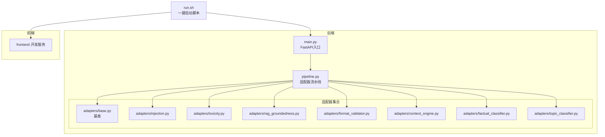
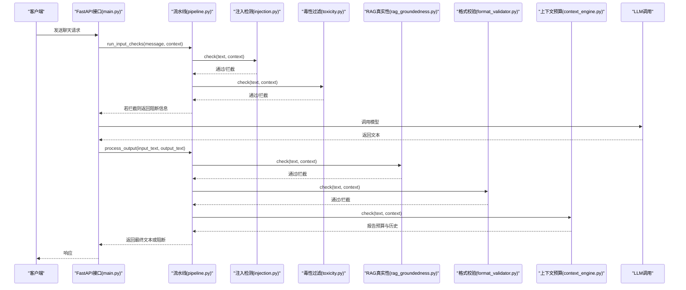
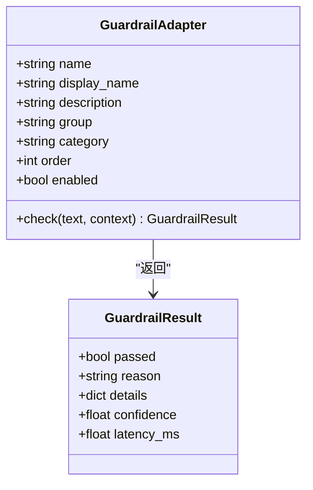
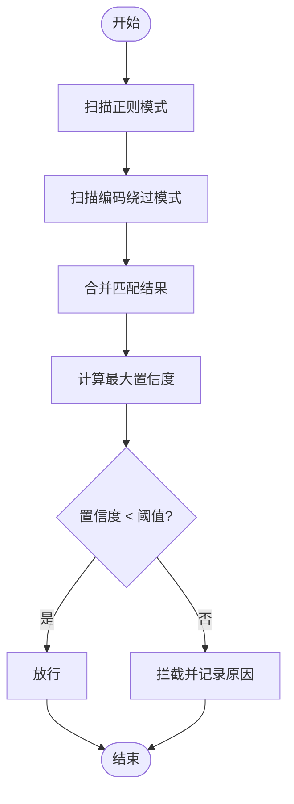
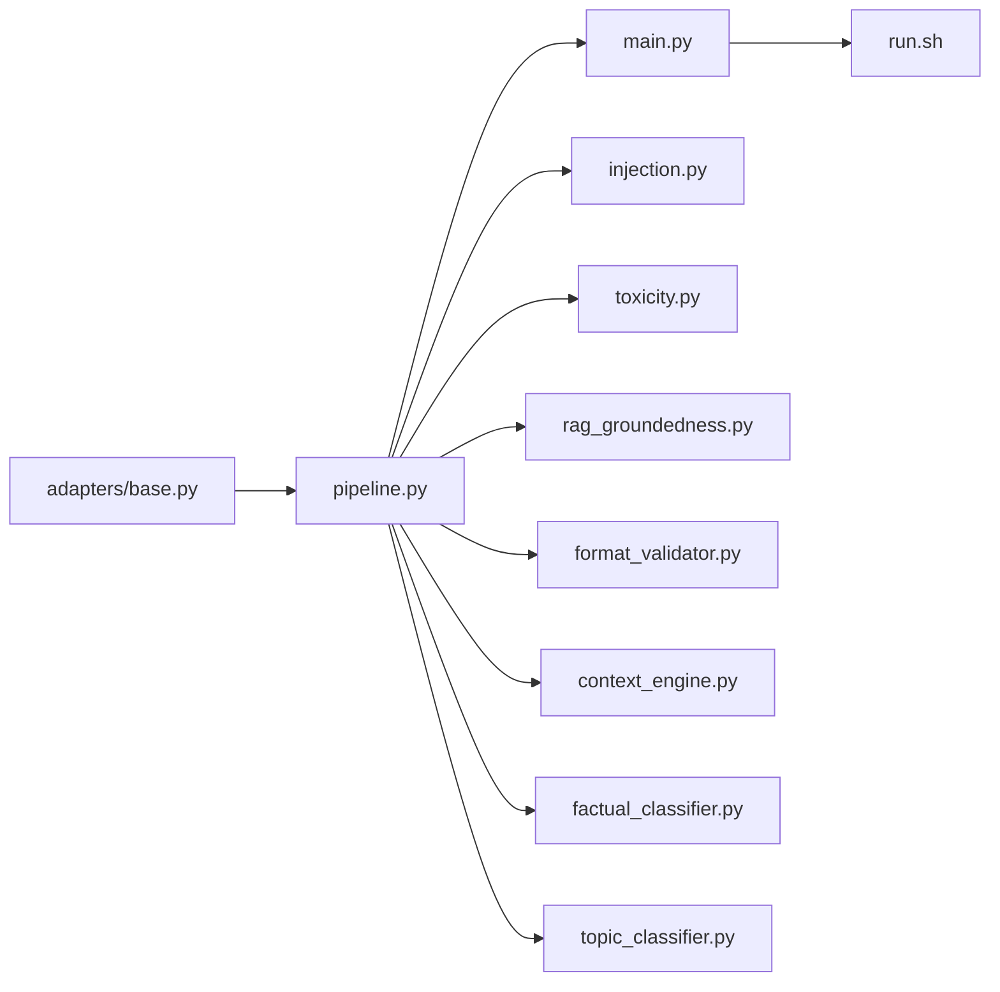
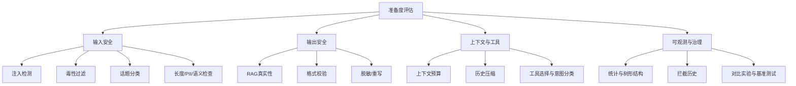

# OpenAI准备度与DeepMind前沿安全

<cite>
**本文引用的文件**
- [guardrails-sandbox/backend/adapters/base.py](file://guardrails-sandbox/backend/adapters/base.py)
- [guardrails-sandbox/backend/adapters/context_engine.py](file://guardrails-sandbox/backend/adapters/context_engine.py)
- [guardrails-sandbox/backend/adapters/factual_classifier.py](file://guardrails-sandbox/backend/adapters/factual_classifier.py)
- [guardrails-sandbox/backend/adapters/toxicity.py](file://guardrails-sandbox/backend/adapters/toxicity.py)
- [guardrails-sandbox/backend/adapters/injection.py](file://guardrails-sandbox/backend/adapters/injection.py)
- [guardrails-sandbox/backend/adapters/format_validator.py](file://guardrails-sandbox/backend/adapters/format_validator.py)
- [guardrails-sandbox/backend/adapters/rag_groundedness.py](file://guardrails-sandbox/backend/adapters/rag_groundedness.py)
- [guardrails-sandbox/backend/adapters/topic_classifier.py](file://guardrails-sandbox/backend/adapters/topic_classifier.py)
- [guardrails-sandbox/backend/pipeline.py](file://guardrails-sandbox/backend/pipeline.py)
- [guardrails-sandbox/backend/main.py](file://guardrails-sandbox/backend/main.py)
- [guardrails-sandbox/run.sh](file://guardrails-sandbox/run.sh)
</cite>

## 目录
1. [引言](#引言)
2. [项目结构](#项目结构)
3. [核心组件](#核心组件)
4. [架构总览](#架构总览)
5. [详细组件分析](#详细组件分析)
6. [依赖分析](#依赖分析)
7. [性能考虑](#性能考虑)
8. [故障排查指南](#故障排查指南)
9. [结论](#结论)
10. [附录](#附录)

## 引言
本文件围绕“OpenAI准备度与DeepMind前沿安全”主题，结合仓库中的安全护栏（Guardrails）沙箱系统，系统化梳理AI安全的准备度评估框架、风险识别与缓解策略，并给出可操作的实现路径与最佳实践。文档重点覆盖以下方面：
- 准备度评估框架：以“输入-输出”双通道安全检查为核心，构建可插拔、可观测、可对比的安全管线。
- 风险识别与缓解：针对提示注入、毒性内容、事实性幻觉、格式错误、话题合规、上下文预算等典型风险，提供适配器化的检测与处置方案。
- 实现示例：通过适配器基类与流水线编排，展示如何快速集成与扩展安全能力。
- 前沿安全研究：结合提示工程、RAG真实性、结构化输出、上下文预算等方向，映射至业界前沿研究议题。

## 项目结构
本项目采用“后端适配器 + 流水线编排 + FastAPI服务”的分层设计，核心位于 guardrails-sandbox/backend 目录，前端通过 run.sh 脚本统一启动后端与前端开发服务。

**图表来源**
- [guardrails-sandbox/backend/main.py:1-421](file://guardrails-sandbox/backend/main.py#L1-L421)
- [guardrails-sandbox/backend/pipeline.py:1-285](file://guardrails-sandbox/backend/pipeline.py#L1-L285)
- [guardrails-sandbox/backend/adapters/base.py:1-34](file://guardrails-sandbox/backend/adapters/base.py#L1-L34)
- [guardrails-sandbox/run.sh:1-35](file://guardrails-sandbox/run.sh#L1-L35)

**章节来源**
- [guardrails-sandbox/backend/main.py:1-421](file://guardrails-sandbox/backend/main.py#L1-L421)
- [guardrails-sandbox/backend/pipeline.py:1-285](file://guardrails-sandbox/backend/pipeline.py#L1-L285)
- [guardrails-sandbox/run.sh:1-35](file://guardrails-sandbox/run.sh#L1-L35)

## 核心组件
- 适配器基类与结果封装：定义统一的 GuardrailAdapter 接口与 GuardrailResult 结构，确保各安全能力的一致性与可观测性。
- 输入/输出安全检查流水线：按顺序执行输入与输出阶段的适配器，支持短路拦截与统计追踪。
- 典型安全适配器：
  - 提示注入检测：识别越狱、覆盖指令、编码绕过等攻击模式。
  - 毒性过滤：检测暴力、违法、自残、仇恨、色情等敏感内容。
  - RAG 真实性：基于上下文的事实性断言校验，降低幻觉风险。
  - 格式校验：保证结构化输出（JSON/代码块/文本）的完整性与正确性。
  - 上下文预算与历史压缩：动态分配Token预算，缓解“中间丢失”效应。
  - 事实性分类：根据问题类型动态调整后续适配器阈值。
  - 话题分类：允许范围内的内容检查与拦截。

**章节来源**
- [guardrails-sandbox/backend/adapters/base.py:1-34](file://guardrails-sandbox/backend/adapters/base.py#L1-L34)
- [guardrails-sandbox/backend/pipeline.py:1-285](file://guardrails-sandbox/backend/pipeline.py#L1-L285)
- [guardrails-sandbox/backend/adapters/injection.py:1-88](file://guardrails-sandbox/backend/adapters/injection.py#L1-L88)
- [guardrails-sandbox/backend/adapters/toxicity.py:1-64](file://guardrails-sandbox/backend/adapters/toxicity.py#L1-L64)
- [guardrails-sandbox/backend/adapters/rag_groundedness.py:1-100](file://guardrails-sandbox/backend/adapters/rag_groundedness.py#L1-L100)
- [guardrails-sandbox/backend/adapters/format_validator.py:1-86](file://guardrails-sandbox/backend/adapters/format_validator.py#L1-L86)
- [guardrails-sandbox/backend/adapters/context_engine.py:1-251](file://guardrails-sandbox/backend/adapters/context_engine.py#L1-L251)
- [guardrails-sandbox/backend/adapters/factual_classifier.py:1-55](file://guardrails-sandbox/backend/adapters/factual_classifier.py#L1-L55)
- [guardrails-sandbox/backend/adapters/topic_classifier.py:1-54](file://guardrails-sandbox/backend/adapters/topic_classifier.py#L1-L54)

## 架构总览
下图展示了从客户端请求到安全检查、LLM调用、再到输出安全检查的完整流程，以及与适配器生态的交互关系。

**图表来源**
- [guardrails-sandbox/backend/main.py:155-221](file://guardrails-sandbox/backend/main.py#L155-L221)
- [guardrails-sandbox/backend/pipeline.py:31-84](file://guardrails-sandbox/backend/pipeline.py#L31-L84)
- [guardrails-sandbox/backend/adapters/injection.py:53-88](file://guardrails-sandbox/backend/adapters/injection.py#L53-L88)
- [guardrails-sandbox/backend/adapters/toxicity.py:31-64](file://guardrails-sandbox/backend/adapters/toxicity.py#L31-L64)
- [guardrails-sandbox/backend/adapters/rag_groundedness.py:25-100](file://guardrails-sandbox/backend/adapters/rag_groundedness.py#L25-L100)
- [guardrails-sandbox/backend/adapters/format_validator.py:22-86](file://guardrails-sandbox/backend/adapters/format_validator.py#L22-L86)
- [guardrails-sandbox/backend/adapters/context_engine.py:188-242](file://guardrails-sandbox/backend/adapters/context_engine.py#L188-L242)

## 详细组件分析

### 适配器基类与结果模型
- GuardrailAdapter：定义统一的 check 接口、元信息（name/display_name/group/category/order/enabled），以及默认的字符串表示。
- GuardrailResult：封装通过/拦截、原因、置信度、耗时与细节字段，便于统一日志与可视化。

**图表来源**
- [guardrails-sandbox/backend/adapters/base.py:5-34](file://guardrails-sandbox/backend/adapters/base.py#L5-L34)

**章节来源**
- [guardrails-sandbox/backend/adapters/base.py:1-34](file://guardrails-sandbox/backend/adapters/base.py#L1-L34)

### 提示注入检测（InjectionDetector）
- 目标：识别越狱、覆盖指令、打印系统提示、开发者模式等攻击模式；同时检测编码绕过。
- 策略：正则匹配与置信度阈值控制，超过阈值即拦截。
- 适用场景：输入阶段前置拦截，降低恶意提示进入LLM的风险。

**图表来源**
- [guardrails-sandbox/backend/adapters/injection.py:53-88](file://guardrails-sandbox/backend/adapters/injection.py#L53-L88)

**章节来源**
- [guardrails-sandbox/backend/adapters/injection.py:1-88](file://guardrails-sandbox/backend/adapters/injection.py#L1-L88)

### 毒性过滤（ToxicityFilter）
- 目标：过滤暴力、违法、自残、仇恨、色情等有害内容。
- 特性：支持安全上下文前缀豁免，避免对“预防/帮助”等正当讨论的误伤。
- 适用场景：输入阶段安全门禁，保障内容合规。

**章节来源**
- [guardrails-sandbox/backend/adapters/toxicity.py:1-64](file://guardrails-sandbox/backend/adapters/toxicity.py#L1-L64)

### RAG 真实性（RAGGroundedness）
- 目标：检测LLM输出是否基于给定上下文，防止事实性幻觉。
- 策略：抽取事实性断言（含数字/日期/专有名词等），在上下文中检索关键词匹配，统计未依据断言比例并设定阈值。
- 适用场景：RAG问答、知识增强生成等场景。

**章节来源**
- [guardrails-sandbox/backend/adapters/rag_groundedness.py:1-100](file://guardrails-sandbox/backend/adapters/rag_groundedness.py#L1-L100)

### 格式校验（FormatValidator）
- 目标：确保结构化输出（JSON/代码块/文本）的完整性与正确性，避免下游解析崩溃。
- 策略：JSON解析、Markdown代码块闭合、空输出检测、输入显式要求结构化输出时的二次校验。
- 适用场景：API响应、工具调用返回、自动化生成任务。

**章节来源**
- [guardrails-sandbox/backend/adapters/format_validator.py:1-86](file://guardrails-sandbox/backend/adapters/format_validator.py#L1-L86)

### 上下文预算与历史压缩（ContextEngine）
- 目标：将上下文窗口视为稀缺资源，动态分配与压缩，缓解“中间丢失”效应。
- 能力：Token预算分配、历史压缩、工具选择与意图分类、中间丢失位置建议。
- 适用场景：长对话、RAG检索、Agent工具链等高Token消耗场景。

**章节来源**
- [guardrails-sandbox/backend/adapters/context_engine.py:1-251](file://guardrails-sandbox/backend/adapters/context_engine.py#L1-L251)

### 事实性分类（FactualClassifier）
- 目标：区分事实性与创意性问题，动态调整后续适配器阈值。
- 策略：关键词匹配，将分类结果写入上下文供其他适配器读取。
- 适用场景：客服问答（宽松阈值）、创意写作（严格阈值）等差异化治理。

**章节来源**
- [guardrails-sandbox/backend/adapters/factual_classifier.py:1-55](file://guardrails-sandbox/backend/adapters/factual_classifier.py#L1-L55)

### 话题分类（TopicClassifier）
- 目标：检查输入是否在允许范围内，明确禁止话题直接拦截。
- 策略：黑名单优先、白名单宽松，避免非法内容传播。
- 适用场景：公共对话、社区问答、客户服务等。

**章节来源**
- [guardrails-sandbox/backend/adapters/topic_classifier.py:1-54](file://guardrails-sandbox/backend/adapters/topic_classifier.py#L1-L54)

### 流水线编排（Pipeline）
- 目标：统一编排适配器，按输入/输出分类与顺序执行，支持短路拦截、统计与历史记录。
- 能力：注册适配器、按order排序、输入/输出检查、统计聚合、树形结构展示、开关切换、拦截历史。
- 适用场景：生产级安全网关、对比实验、A/B测试。

**章节来源**
- [guardrails-sandbox/backend/pipeline.py:1-285](file://guardrails-sandbox/backend/pipeline.py#L1-L285)

### FastAPI 服务与运行脚本
- 主入口：注册所有适配器，提供 /api/chat、/api/guardrails、/api/benchmark 等接口。
- 对比模式：同时运行“无护栏”与“有护栏”两种版本，直观对比安全效果。
- 运行脚本：一键启动后端与前端开发服务，自动代理 /api 到后端。

**章节来源**
- [guardrails-sandbox/backend/main.py:1-421](file://guardrails-sandbox/backend/main.py#L1-L421)
- [guardrails-sandbox/run.sh:1-35](file://guardrails-sandbox/run.sh#L1-L35)

## 依赖分析
- 组件内聚与耦合：
  - 适配器均依赖基类与结果模型，保持高内聚、低耦合。
  - 流水线仅依赖适配器接口，通过注册机制扩展新能力。
  - FastAPI 仅负责路由与编排，业务逻辑集中在适配器与流水线。
- 外部依赖：
  - 语义模型预加载（sentence-transformers），用于语义相似度等检测。
  - MCP 工具协议（可选），用于外部工具调用。
- 潜在风险：
  - 正则模式滞后于攻击手法，需持续迭代。
  - 语义模型加载失败时的降级策略与容错。

**图表来源**
- [guardrails-sandbox/backend/adapters/base.py:1-34](file://guardrails-sandbox/backend/adapters/base.py#L1-L34)
- [guardrails-sandbox/backend/pipeline.py:1-285](file://guardrails-sandbox/backend/pipeline.py#L1-L285)
- [guardrails-sandbox/backend/main.py:1-421](file://guardrails-sandbox/backend/main.py#L1-L421)
- [guardrails-sandbox/run.sh:1-35](file://guardrails-sandbox/run.sh#L1-L35)

**章节来源**
- [guardrails-sandbox/backend/main.py:60-77](file://guardrails-sandbox/backend/main.py#L60-L77)

## 性能考虑
- 适配器执行顺序：通过 order 控制，将高成本或高置信度的适配器前置，减少不必要的计算。
- 短路拦截：任一适配器拦截即停止后续执行，降低整体延迟。
- 统计与可观测：记录每层通过/拦截次数、拦截历史与耗时，便于定位瓶颈与优化。
- 模型预热：在启动阶段预加载语义模型，避免首次调用的冷启动开销。
- 建议：
  - 对高频适配器（如正则匹配）进行缓存与向量化优化。
  - 对语义相似度类检测引入本地缓存与降采样策略。
  - 将跨进程/网络调用（如MCP）纳入超时与熔断机制。

[本节为通用性能指导，无需特定文件引用]

## 故障排查指南
- 请求被拦截：
  - 查看拦截阶段（input/output）与适配器名称，定位具体原因与置信度。
  - 使用 /api/guardrails/block-history 获取最近拦截历史。
- 输出异常：
  - 检查格式校验与RAG真实性等输出适配器日志。
  - 对比“无护栏”与“有护栏”两种响应，确认安全策略影响范围。
- 适配器开关：
  - 通过 /api/guardrails/toggle 动态启用/禁用某适配器，快速回滚。
- 统计与树形结构：
  - 使用 /api/guardrails 获取适配器树与统计信息，识别异常热点。

**章节来源**
- [guardrails-sandbox/backend/main.py:147-153](file://guardrails-sandbox/backend/main.py#L147-L153)
- [guardrails-sandbox/backend/main.py:136-144](file://guardrails-sandbox/backend/main.py#L136-L144)
- [guardrails-sandbox/backend/pipeline.py:247-285](file://guardrails-sandbox/backend/pipeline.py#L247-L285)

## 结论
本项目以“适配器 + 流水线 + FastAPI”的架构，系统化实现了面向生产环境的AI安全护栏体系。通过输入/输出双通道检查、可插拔的适配器生态与完善的可观测性，既能满足日常合规与风险控制需求，也为前沿安全研究（如提示工程、RAG真实性、上下文预算）提供了可落地的实验平台。建议在实际部署中结合业务场景持续迭代适配器规则、引入语义模型与外部工具协议，并建立完善的安全运营与应急响应机制。

[本节为总结性内容，无需特定文件引用]

## 附录

### 准备度评估框架（概念示意）

[本图为概念示意，无需图表来源]