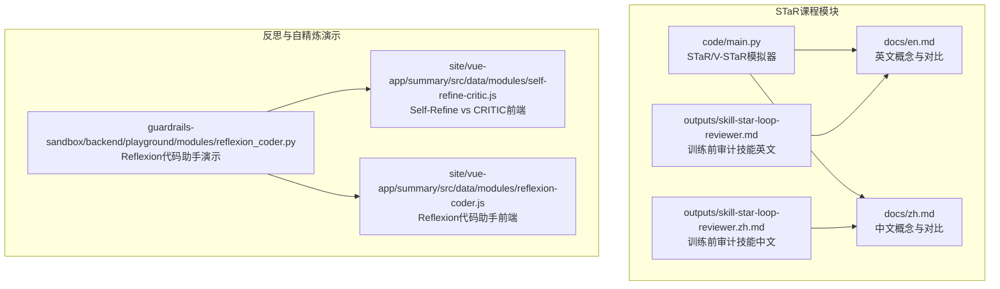
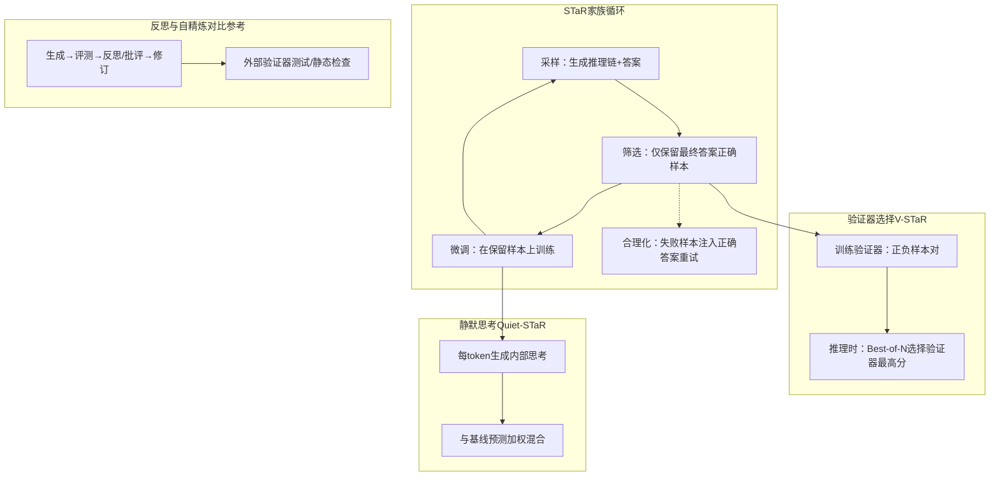
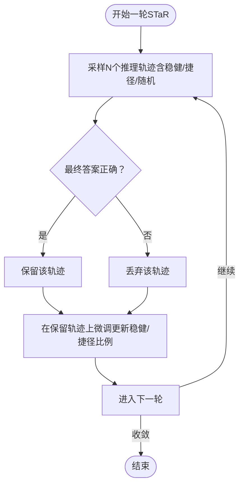
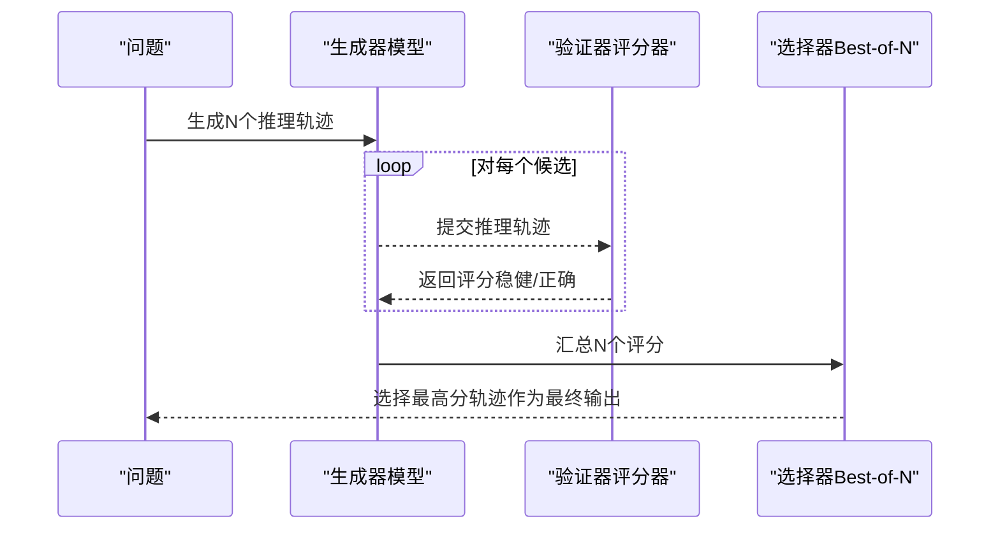
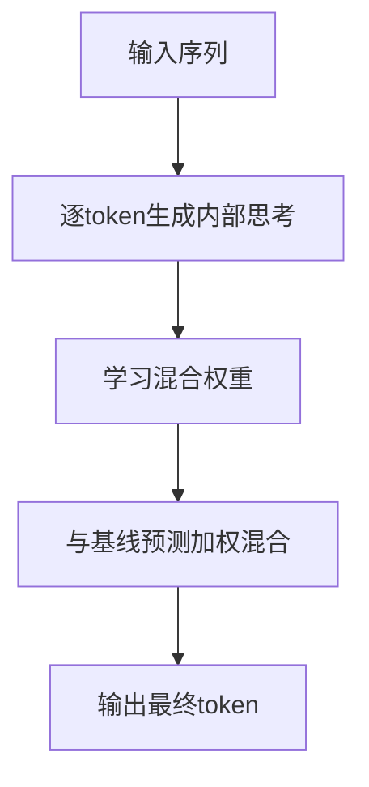
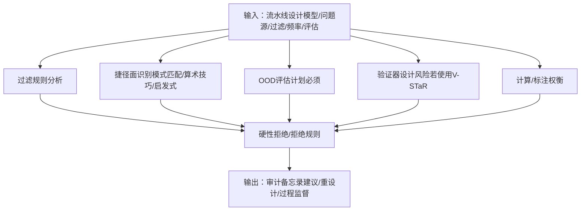
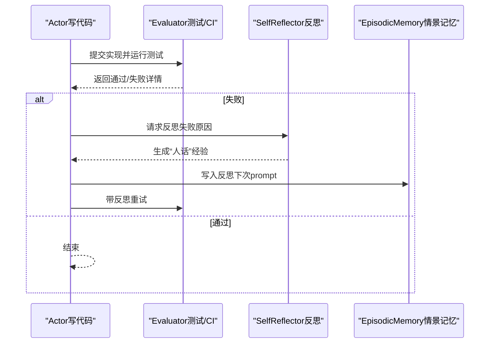
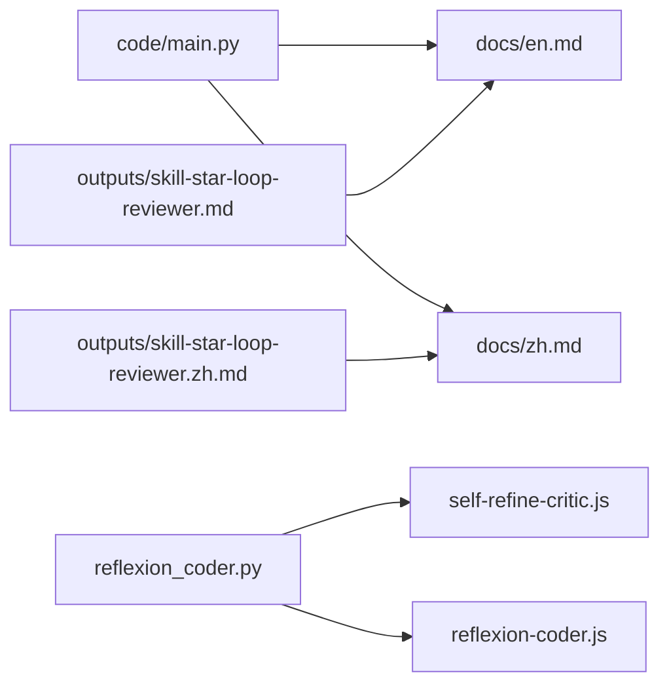

# STaR推理框架

<cite>
**本文引用的文件**
- [phases/15-autonomous-systems/02-star-family-reasoning/docs/en.md](file://phases/15-autonomous-systems/02-star-family-reasoning/docs/en.md)
- [phases/15-autonomous-systems/02-star-family-reasoning/docs/zh.md](file://phases/15-autonomous-systems/02-star-family-reasoning/docs/zh.md)
- [phases/15-autonomous-systems/02-star-family-reasoning/code/main.py](file://phases/15-autonomous-systems/02-star-family-reasoning/code/main.py)
- [phases/15-autonomous-systems/02-star-family-reasoning/outputs/skill-star-loop-reviewer.md](file://phases/15-autonomous-systems/02-star-family-reasoning/outputs/skill-star-loop-reviewer.md)
- [phases/15-autonomous-systems/02-star-family-reasoning/outputs/skill-star-loop-reviewer.zh.md](file://phases/15-autonomous-systems/02-star-family-reasoning/outputs/skill-star-loop-reviewer.zh.md)
- [guardrails-sandbox/backend/playground/modules/reflexion_coder.py](file://guardrails-sandbox/backend/playground/modules/reflexion_coder.py)
- [site/vue-app/summary/src/data/modules/self-refine-critic.js](file://site/vue-app/summary/src/data/modules/self-refine-critic.js)
- [site/vue-app/summary/src/data/modules/reflexion-coder.js](file://site/vue-app/summary/src/data/modules/reflexion-coder.js)
</cite>

## 目录
1. [引言](#引言)
2. [项目结构](#项目结构)
3. [核心组件](#核心组件)
4. [架构总览](#架构总览)
5. [详细组件分析](#详细组件分析)
6. [依赖关系分析](#依赖关系分析)
7. [性能考量](#性能考量)
8. [故障排查指南](#故障排查指南)
9. [结论](#结论)
10. [附录](#附录)

## 引言
本文件围绕STaR（Self-Ask with Refinement，自问自精炼）推理框架及其家族方法（STaR、V-STaR、Quiet-STaR）展开，系统阐述其设计理念、实现原理与实践路径。文档重点解释自指明推理过程的关键步骤：问题分解、逐步细化、验证修正，并结合模拟器与配套模块，展示如何构建具备反思能力的推理系统。同时，给出在复杂问题求解中的应用案例、性能表现与评估方法，强调在提高AI系统推理能力与可信度方面的价值。

## 项目结构
本仓库中与STaR相关的内容主要集中在“自主系统”阶段的“STaR家族推理”课程模块，以及“守卫护栏沙盒”中的反思与自精炼相关演示模块。下图展示了与STaR推理框架直接相关的文件与模块：

**图表来源**
- [phases/15-autonomous-systems/02-star-family-reasoning/docs/en.md:1-113](file://phases/15-autonomous-systems/02-star-family-reasoning/docs/en.md#L1-L113)
- [phases/15-autonomous-systems/02-star-family-reasoning/docs/zh.md:1-113](file://phases/15-autonomous-systems/02-star-family-reasoning/docs/zh.md#L1-L113)
- [phases/15-autonomous-systems/02-star-family-reasoning/code/main.py:1-180](file://phases/15-autonomous-systems/02-star-family-reasoning/code/main.py#L1-L180)
- [phases/15-autonomous-systems/02-star-family-reasoning/outputs/skill-star-loop-reviewer.md:1-39](file://phases/15-autonomous-systems/02-star-family-reasoning/outputs/skill-star-loop-reviewer.md#L1-L39)
- [phases/15-autonomous-systems/02-star-family-reasoning/outputs/skill-star-loop-reviewer.zh.md:1-39](file://phases/15-autonomous-systems/02-star-family-reasoning/outputs/skill-star-loop-reviewer.zh.md#L1-L39)
- [guardrails-sandbox/backend/playground/modules/reflexion_coder.py:1-185](file://guardrails-sandbox/backend/playground/modules/reflexion_coder.py#L1-L185)
- [site/vue-app/summary/src/data/modules/self-refine-critic.js:1-127](file://site/vue-app/summary/src/data/modules/self-refine-critic.js#L1-L127)
- [site/vue-app/summary/src/data/modules/reflexion-coder.js:116-140](file://site/vue-app/summary/src/data/modules/reflexion-coder.js#L116-L140)

**章节来源**
- [phases/15-autonomous-systems/02-star-family-reasoning/docs/en.md:1-113](file://phases/15-autonomous-systems/02-star-family-reasoning/docs/en.md#L1-L113)
- [phases/15-autonomous-systems/02-star-family-reasoning/docs/zh.md:1-113](file://phases/15-autonomous-systems/02-star-family-reasoning/docs/zh.md#L1-L113)
- [phases/15-autonomous-systems/02-star-family-reasoning/code/main.py:1-180](file://phases/15-autonomous-systems/02-star-family-reasoning/code/main.py#L1-L180)
- [phases/15-autonomous-systems/02-star-family-reasoning/outputs/skill-star-loop-reviewer.md:1-39](file://phases/15-autonomous-systems/02-star-family-reasoning/outputs/skill-star-loop-reviewer.md#L1-L39)
- [phases/15-autonomous-systems/02-star-family-reasoning/outputs/skill-star-loop-reviewer.zh.md:1-39](file://phases/15-autonomous-systems/02-star-family-reasoning/outputs/skill-star-loop-reviewer.zh.md#L1-L39)
- [guardrails-sandbox/backend/playground/modules/reflexion_coder.py:1-185](file://guardrails-sandbox/backend/playground/modules/reflexion_coder.py#L1-L185)
- [site/vue-app/summary/src/data/modules/self-refine-critic.js:1-127](file://site/vue-app/summary/src/data/modules/self-refine-critic.js#L1-L127)
- [site/vue-app/summary/src/data/modules/reflexion-coder.js:116-140](file://site/vue-app/summary/src/data/modules/reflexion-coder.js#L116-L140)

## 核心组件
- STaR（自教推理）：在模型生成的“推理链+答案”中，仅保留最终答案正确的样本进行微调；对失败样本采用“合理化”（注入正确答案并重试）以增强训练数据。
- V-STaR（验证器-STaR）：在正确与错误推理样本上训练验证器，推理时从N个候选中挑选验证器评分最高的，以提升推理时选择质量。
- Quiet-STaR（静默-STaR）：在每个token位置生成隐式的内部推理，通过可学习权重将“带思考”的预测与基线预测混合，实现“何时思考”的自适应。
- 训练前审计技能：在投入训练计算前，对拟议的STaR流水线进行预审计，识别过滤规则、捷径面、分布外（OOD）评估、验证器设计风险与计算/标注权衡，提出硬性拒绝与建议。

**章节来源**
- [phases/15-autonomous-systems/02-star-family-reasoning/docs/en.md:14-64](file://phases/15-autonomous-systems/02-star-family-reasoning/docs/en.md#L14-L64)
- [phases/15-autonomous-systems/02-star-family-reasoning/docs/zh.md:14-64](file://phases/15-autonomous-systems/02-star-family-reasoning/docs/zh.md#L14-L64)
- [phases/15-autonomous-systems/02-star-family-reasoning/outputs/skill-star-loop-reviewer.md:10-39](file://phases/15-autonomous-systems/02-star-family-reasoning/outputs/skill-star-loop-reviewer.md#L10-L39)
- [phases/15-autonomous-systems/02-star-family-reasoning/outputs/skill-star-loop-reviewer.zh.md:10-39](file://phases/15-autonomous-systems/02-star-family-reasoning/outputs/skill-star-loop-reviewer.zh.md#L10-L39)

## 架构总览
下图展示了STaR家族推理的最小可行自改进循环，以及与反思/自精炼类方法的关系映射。STaR以“最终答案”为信号，V-STaR在推理时引入验证器选择，Quiet-STaR在token层面引入内部思考；反思与自精炼则强调单次输出内的迭代打磨与外部验证。

**图表来源**
- [phases/15-autonomous-systems/02-star-family-reasoning/docs/en.md:14-64](file://phases/15-autonomous-systems/02-star-family-reasoning/docs/en.md#L14-L64)
- [phases/15-autonomous-systems/02-star-family-reasoning/docs/zh.md:14-64](file://phases/15-autonomous-systems/02-star-family-reasoning/docs/zh.md#L14-L64)
- [guardrails-sandbox/backend/playground/modules/reflexion_coder.py:1-185](file://guardrails-sandbox/backend/playground/modules/reflexion_coder.py#L1-L185)
- [site/vue-app/summary/src/data/modules/self-refine-critic.js:1-127](file://site/vue-app/summary/src/data/modules/self-refine-critic.js#L1-L127)

## 详细组件分析

### STaR模拟器与训练循环
STaR模拟器通过三个策略生成推理轨迹：稳健推理（总是正确）、懒惰捷径（分布内命中较高、分布外几乎为零）、随机猜测。每轮训练仅保留最终答案正确的样本，并更新模型中稳健推理与捷径的比例，体现“答案条件化梯度”的特性。模拟器还演示了V-STaR风格的推理时选择：从多个候选中挑选验证器评分最高的样本，以缓解分布外退化。

**图表来源**
- [phases/15-autonomous-systems/02-star-family-reasoning/code/main.py:62-98](file://phases/15-autonomous-systems/02-star-family-reasoning/code/main.py#L62-L98)

**章节来源**
- [phases/15-autonomous-systems/02-star-family-reasoning/code/main.py:1-180](file://phases/15-autonomous-systems/02-star-family-reasoning/code/main.py#L1-L180)

### V-STaR推理时选择流程
V-STaR在推理时从N个候选中挑选验证器评分最高的样本。模拟器中的验证器理想化地以“稳健推理”与“正确答案”为评分依据，体现验证器在分布外场景中对“自信错误”的偏好风险。该流程强调“推理时选择优于额外微调”。

**图表来源**
- [phases/15-autonomous-systems/02-star-family-reasoning/code/main.py:101-126](file://phases/15-autonomous-systems/02-star-family-reasoning/code/main.py#L101-L126)

**章节来源**
- [phases/15-autonomous-systems/02-star-family-reasoning/code/main.py:101-126](file://phases/15-autonomous-systems/02-star-family-reasoning/code/main.py#L101-L126)

### Quiet-STaR内部思考与混合
Quiet-STaR在每个token位置生成隐式内部思考，并通过可学习权重将“带思考”的预测与基线预测混合。该方法在不改变推理成本显著增加的前提下，实现“何时思考”的自适应，从而在零样本任务上取得明显收益。

**图表来源**
- [phases/15-autonomous-systems/02-star-family-reasoning/docs/en.md:39-44](file://phases/15-autonomous-systems/02-star-family-reasoning/docs/en.md#L39-L44)
- [phases/15-autonomous-systems/02-star-family-reasoning/docs/zh.md:39-44](file://phases/15-autonomous-systems/02-star-family-reasoning/docs/zh.md#L39-L44)

**章节来源**
- [phases/15-autonomous-systems/02-star-family-reasoning/docs/en.md:39-44](file://phases/15-autonomous-systems/02-star-family-reasoning/docs/en.md#L39-L44)
- [phases/15-autonomous-systems/02-star-family-reasoning/docs/zh.md:39-44](file://phases/15-autonomous-systems/02-star-family-reasoning/docs/zh.md#L39-L44)

### 训练前审计技能（Pre-training Reviewer）
该技能在投入训练计算前，对拟议的STaR流水线进行系统性审计，包括：
- 过滤规则分析：明确“保留”规则评分维度与遗漏项
- 捷径面识别：列举三类常见捷径及其占比
- 分布外评估：要求保留独立的OOD集合
- 验证器设计：若使用V-STaR，需避免与生成器同分布训练导致“强化自信错误”
- 计算与标注权衡：比较自举成本与过程监督标注成本

**图表来源**
- [phases/15-autonomous-systems/02-star-family-reasoning/outputs/skill-star-loop-reviewer.md:10-39](file://phases/15-autonomous-systems/02-star-family-reasoning/outputs/skill-star-loop-reviewer.md#L10-L39)
- [phases/15-autonomous-systems/02-star-family-reasoning/outputs/skill-star-loop-reviewer.zh.md:10-39](file://phases/15-autonomous-systems/02-star-family-reasoning/outputs/skill-star-loop-reviewer.zh.md#L10-L39)

**章节来源**
- [phases/15-autonomous-systems/02-star-family-reasoning/outputs/skill-star-loop-reviewer.md:10-39](file://phases/15-autonomous-systems/02-star-family-reasoning/outputs/skill-star-loop-reviewer.md#L10-L39)
- [phases/15-autonomous-systems/02-star-family-reasoning/outputs/skill-star-loop-reviewer.zh.md:10-39](file://phases/15-autonomous-systems/02-star-family-reasoning/outputs/skill-star-loop-reviewer.zh.md#L10-L39)

### 反思与自精炼（对比参考）
- Reflexion（反思）：任务失败后，LLM以“人话”总结失败原因，写入情景记忆，下次写代码前将反思作为上下文提示，从而避免重复犯错。强调“即时可读的口头强化学习”。
- Self-Refine vs CRITIC：Self-Refine由模型自我批评，存在“自信幻觉”盲区；CRITIC将“反馈”替换为外部工具验证（测试/静态检查），能捕获崩溃型bug等自我批评无法发现的问题。

**图表来源**
- [guardrails-sandbox/backend/playground/modules/reflexion_coder.py:1-185](file://guardrails-sandbox/backend/playground/modules/reflexion_coder.py#L1-L185)
- [site/vue-app/summary/src/data/modules/reflexion-coder.js:116-140](file://site/vue-app/summary/src/data/modules/reflexion-coder.js#L116-L140)

**章节来源**
- [guardrails-sandbox/backend/playground/modules/reflexion_coder.py:1-185](file://guardrails-sandbox/backend/playground/modules/reflexion_coder.py#L1-L185)
- [site/vue-app/summary/src/data/modules/self-refine-critic.js:1-127](file://site/vue-app/summary/src/data/modules/self-refine-critic.js#L1-L127)
- [site/vue-app/summary/src/data/modules/reflexion-coder.js:116-140](file://site/vue-app/summary/src/data/modules/reflexion-coder.js#L116-L140)

## 依赖关系分析
- STaR模拟器依赖Python标准库（随机、数据类），通过统计保留样本中稳健推理与捷径的比例，更新模型概率分布，体现自举循环的收敛行为。
- V-STaR推理时选择依赖验证器评分逻辑，评分受“稳健推理”与“正确答案”影响，体现验证器在OOD场景中的偏好风险。
- 训练前审计技能作为独立的“技能”模块，面向流水线设计者，提供结构化审计清单与建议。
- 反思与自精炼模块提供与STaR家族互补的单次输出内迭代范式，强调外部验证与情景记忆的作用。

**图表来源**
- [phases/15-autonomous-systems/02-star-family-reasoning/code/main.py:1-180](file://phases/15-autonomous-systems/02-star-family-reasoning/code/main.py#L1-L180)
- [phases/15-autonomous-systems/02-star-family-reasoning/docs/en.md:1-113](file://phases/15-autonomous-systems/02-star-family-reasoning/docs/en.md#L1-L113)
- [phases/15-autonomous-systems/02-star-family-reasoning/docs/zh.md:1-113](file://phases/15-autonomous-systems/02-star-family-reasoning/docs/zh.md#L1-L113)
- [phases/15-autonomous-systems/02-star-family-reasoning/outputs/skill-star-loop-reviewer.md:1-39](file://phases/15-autonomous-systems/02-star-family-reasoning/outputs/skill-star-loop-reviewer.md#L1-L39)
- [phases/15-autonomous-systems/02-star-family-reasoning/outputs/skill-star-loop-reviewer.zh.md:1-39](file://phases/15-autonomous-systems/02-star-family-reasoning/outputs/skill-star-loop-reviewer.zh.md#L1-L39)
- [guardrails-sandbox/backend/playground/modules/reflexion_coder.py:1-185](file://guardrails-sandbox/backend/playground/modules/reflexion_coder.py#L1-L185)
- [site/vue-app/summary/src/data/modules/self-refine-critic.js:1-127](file://site/vue-app/summary/src/data/modules/self-refine-critic.js#L1-L127)
- [site/vue-app/summary/src/data/modules/reflexion-coder.js:116-140](file://site/vue-app/summary/src/data/modules/reflexion-coder.js#L116-L140)

**章节来源**
- [phases/15-autonomous-systems/02-star-family-reasoning/code/main.py:1-180](file://phases/15-autonomous-systems/02-star-family-reasoning/code/main.py#L1-L180)
- [phases/15-autonomous-systems/02-star-family-reasoning/docs/en.md:1-113](file://phases/15-autonomous-systems/02-star-family-reasoning/docs/en.md#L1-L113)
- [phases/15-autonomous-systems/02-star-family-reasoning/docs/zh.md:1-113](file://phases/15-autonomous-systems/02-star-family-reasoning/docs/zh.md#L1-L113)
- [phases/15-autonomous-systems/02-star-family-reasoning/outputs/skill-star-loop-reviewer.md:1-39](file://phases/15-autonomous-systems/02-star-family-reasoning/outputs/skill-star-loop-reviewer.md#L1-L39)
- [phases/15-autonomous-systems/02-star-family-reasoning/outputs/skill-star-loop-reviewer.zh.md:1-39](file://phases/15-autonomous-systems/02-star-family-reasoning/outputs/skill-star-loop-reviewer.zh.md#L1-L39)
- [guardrails-sandbox/backend/playground/modules/reflexion_coder.py:1-185](file://guardrails-sandbox/backend/playground/modules/reflexion_coder.py#L1-L185)
- [site/vue-app/summary/src/data/modules/self-refine-critic.js:1-127](file://site/vue-app/summary/src/data/modules/self-refine-critic.js#L1-L127)
- [site/vue-app/summary/src/data/modules/reflexion-coder.js:116-140](file://site/vue-app/summary/src/data/modules/reflexion-coder.js#L116-L140)

## 性能考量
- 训练信号与数据浪费：STaR仅保留正确答案样本，可能导致错误推理被丢弃；V-STaR通过验证器减少数据浪费，但验证器自身训练分布需谨慎设计，避免强化“自信错误”。
- 推理成本：V-STaR在推理时需要Best-of-N采样与验证器评分，成本随N增长；Quiet-STaR在token层面引入思考，推理成本略增但收益显著。
- 分布外泛化：STaR在分布内表现良好，但在分布外易受捷径误导；需结合OOD评估与过程监督奖励模型，以突破“答案条件化梯度”的局限。
- 收敛与预算：自举循环需设定停止条件，避免超过峰值后的轮次对质量产生反噬；同时注意每轮的延迟与token消耗。

[本节为通用指导，不直接分析具体文件]

## 故障排查指南
- 快速定位问题
  - 若模型在分布内高准确但在分布外骤降，优先检查是否存在“懒惰捷径”策略；可通过模拟器调整捷径频率并观察分布外差距。
  - 若推理时选择效果不佳，考虑引入V-STaR的验证器评分，或在OOD场景中降低验证器偏好“自信错误”的倾向。
- 反思与自精炼对照
  - Self-Refine存在“自信幻觉”盲区，建议切换为CRITIC外部验证器（测试/静态检查），以捕获崩溃型bug。
  - Reflexion强调将失败经验写入情景记忆，避免重复错误；注意反思需具体可执行，避免空话。
- 审计前置
  - 使用训练前审计技能，确保流水线包含OOD评估、验证器设计风险控制与合理的计算/标注权衡。

**章节来源**
- [phases/15-autonomous-systems/02-star-family-reasoning/code/main.py:151-176](file://phases/15-autonomous-systems/02-star-family-reasoning/code/main.py#L151-L176)
- [site/vue-app/summary/src/data/modules/self-refine-critic.js:87-104](file://site/vue-app/summary/src/data/modules/self-refine-critic.js#L87-L104)
- [guardrails-sandbox/backend/playground/modules/reflexion_coder.py:153-177](file://guardrails-sandbox/backend/playground/modules/reflexion_coder.py#L153-L177)
- [phases/15-autonomous-systems/02-star-family-reasoning/outputs/skill-star-loop-reviewer.md:20-28](file://phases/15-autonomous-systems/02-star-family-reasoning/outputs/skill-star-loop-reviewer.md#L20-L28)

## 结论
STaR家族推理以“答案条件化梯度”为核心，通过自举循环实现模型推理能力的持续改进。STaR在无人工标注的前提下取得显著收益；V-STaR在推理时引入验证器选择，缓解分布外退化；Quiet-STaR在token层面引入内部思考，实现“何时思考”的自适应。结合训练前审计、OOD评估与过程监督奖励模型，可有效规避“右答案、错推理”的捷径陷阱，提升推理系统的可靠性与可信度。

[本节为总结性内容，不直接分析具体文件]

## 附录
- 关键术语
  - STaR：在模型生成的推理链+答案上微调，重复自举
  - 合理化：对失败样本注入正确答案并重试
  - V-STaR：在正确与错误样本上训练验证器，推理时Best-of-N选择
  - Quiet-STaR：每token生成内部思考，与基线预测混合
  - 答案条件化梯度：以最终答案为信号的训练方式
  - 过程奖励模型：以中间步骤正确性为信号的奖励模型
  - 捷径推理：通过非泛化模式到达正确答案的推理

**章节来源**
- [phases/15-autonomous-systems/02-star-family-reasoning/docs/en.md:94-104](file://phases/15-autonomous-systems/02-star-family-reasoning/docs/en.md#L94-L104)
- [phases/15-autonomous-systems/02-star-family-reasoning/docs/zh.md:94-104](file://phases/15-autonomous-systems/02-star-family-reasoning/docs/zh.md#L94-L104)