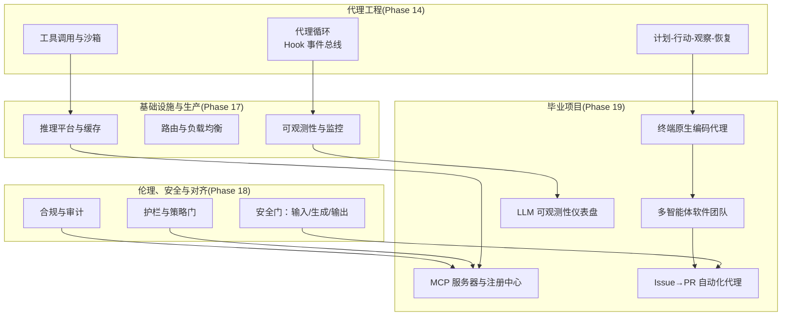
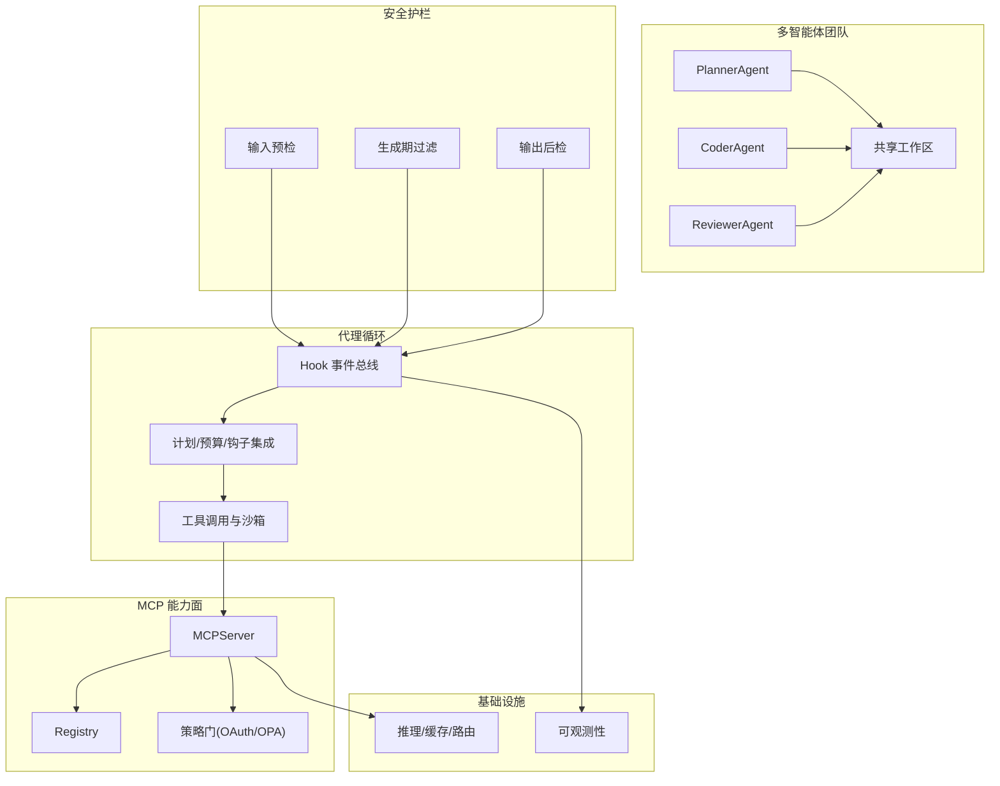
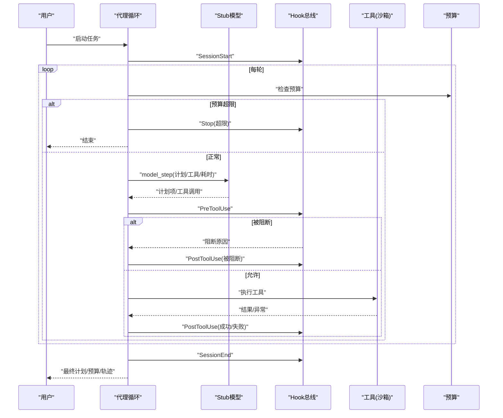
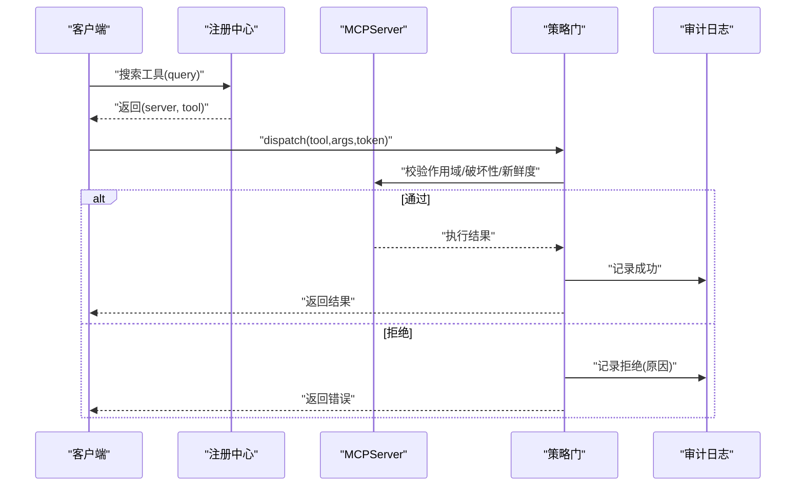
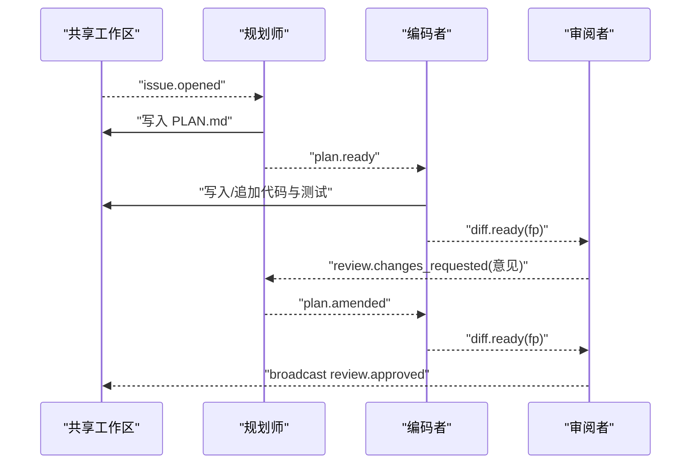
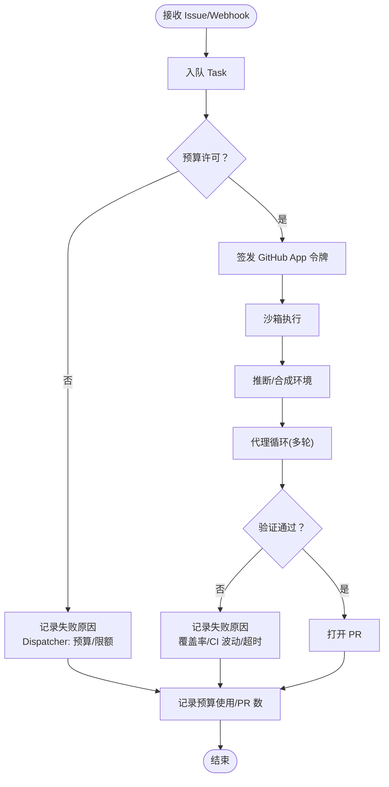
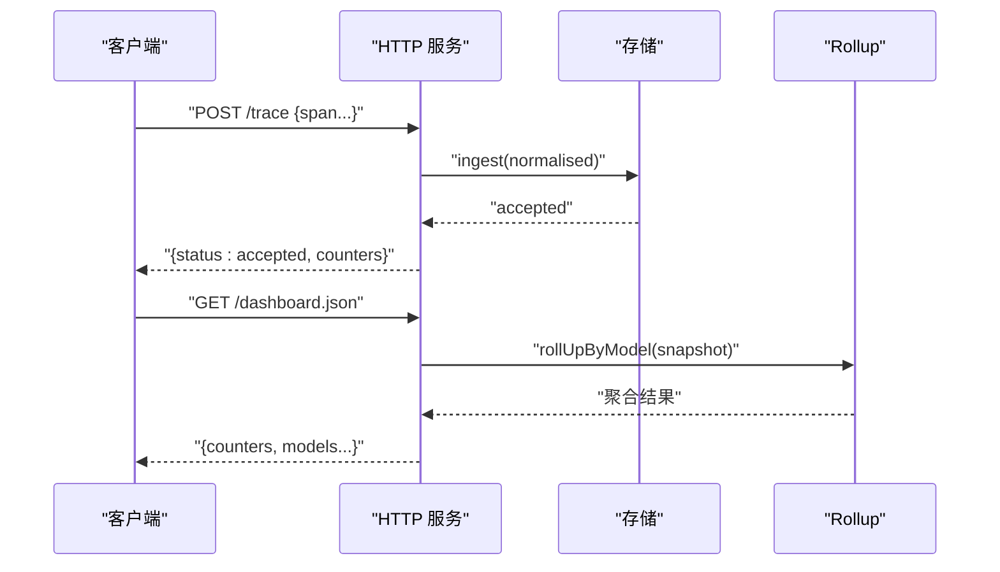
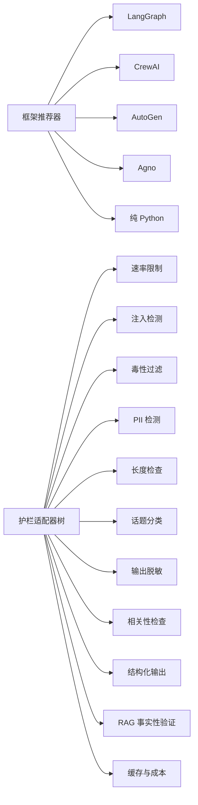

# 代码代理生态

<cite>
**本文引用的文件**   
- [AGENTS.md](file://AGENTS.md)
- [phases/14-agent-engineering/README.md](file://phases/14-agent-engineering/README.md)
- [phases/17-infrastructure-and-production/README.md](file://phases/17-infrastructure-and-production/README.md)
- [phases/18-ethics-safety-alignment/README.md](file://phases/18-ethics-safety-alignment/README.md)
- [phases/19-capstone-projects/01-terminal-native-coding-agent/code/main.py](file://phases/19-capstone-projects/01-terminal-native-coding-agent/code/main.py)
- [phases/19-capstone-projects/01-terminal-native-coding-agent/code/ts/src/index.ts](file://phases/19-capstone-projects/01-terminal-native-coding-agent/code/ts/src/index.ts)
- [phases/19-capstone-projects/01-terminal-native-coding-agent/code/ts/src/repl.ts](file://phases/19-capstone-projects/01-terminal-native-coding-agent/code/ts/src/repl.ts)
- [phases/19-capstone-projects/10-multi-agent-software-team/code/ts/src/agent.ts](file://phases/19-capstone-projects/10-multi-agent-software-team/code/ts/src/agent.ts)
- [phases/19-capstone-projects/13-mcp-server-with-registry/code/main.py](file://phases/19-capstone-projects/13-mcp-server-with-registry/code/main.py)
- [phases/19-capstone-projects/16-github-issue-to-pr-agent/code/main.py](file://phases/19-capstone-projects/16-github-issue-to-pr-agent/code/main.py)
- [phases/19-capstone-projects/11-llm-observability-dashboard/code/ts/src/server.ts](file://phases/19-capstone-projects/11-llm-observability-dashboard/code/ts/src/server.ts)
- [guardrails-sandbox/backend/playground/modules/framework_picker.py](file://guardrails-sandbox/backend/playground/modules/framework_picker.py)
- [guardrails-sandbox/frontend/src/components/AdapterTree.vue](file://guardrails-sandbox/frontend/src/components/AdapterTree.vue)
- [site/figures-agents-alignment.js](file://site/figures-agents-alignment.js)
- [site/vue-app/summary/src/data/content.js](file://site/vue-app/summary/src/data/content.js)
- [site/vue-app/summary/src/data/modules/function-call-simulator.js](file://site/vue-app/summary/src/data/modules/function-call-simulator.js)
- [site/vue-app/summary/src/data/modules/memgpt-virtual-context.js](file://site/vue-app/summary/src/data/modules/memgpt-virtual-context.js)
- [test_eval.py](file://test_eval.py)
- [test_eval_real.py](file://test_eval_real.py)
</cite>

## 目录
1. [引言](#引言)
2. [项目结构](#项目结构)
3. [核心组件](#核心组件)
4. [架构总览](#架构总览)
5. [详细组件分析](#详细组件分析)
6. [依赖分析](#依赖分析)
7. [性能考虑](#性能考虑)
8. [故障排查指南](#故障排查指南)
9. [结论](#结论)
10. [附录](#附录)

## 引言
本文件面向“代码代理生态”的系统化文档，围绕当前代码代理技术的发展现状与未来趋势，梳理不同类型的代码代理及其适用场景，总结设计模式与架构选择，并结合仓库中的实战示例，给出实现路径、评估标准、性能指标与质量保障方法。目标是帮助读者在理解代码代理底层原理的基础上，构建可扩展、可观测、可治理的代理系统。

## 项目结构
本仓库以“阶段化课程 + 实战工坊”的方式组织内容，其中与代码代理生态密切相关的内容主要分布在以下区域：
- 阶段 14：Agent Engineering（代理工程）——代理循环、工具调用、状态管理、工作空间等基础能力
- 阶段 17：Infrastructure & Production（基础设施与生产）——推理平台、缓存、路由、可观测性等生产要素
- 阶段 18：Ethics, Safety & Alignment（伦理、安全与对齐）——护栏、策略门、安全门、合规与风险控制
- 阶段 19：Capstone Projects（毕业项目）——终端原生编码代理、MCP 服务器与注册中心、多智能体软件团队、从 Issue 到 PR 的自动化代理、可观测性仪表盘等综合实战

章节来源
- [phases/14-agent-engineering/README.md:1-6](file://phases/14-agent-engineering/README.md#L1-L6)
- [phases/17-infrastructure-and-production/README.md:1-6](file://phases/17-infrastructure-and-production/README.md#L1-L6)
- [phases/18-ethics-safety-alignment/README.md:1-6](file://phases/18-ethics-safety-alignment/README.md#L1-L6)

## 核心组件
- 代理循环与生命周期钩子：以“思考-行动-观察”为核心，配合会话开始/结束、工具使用前后、通知、停止等事件，形成可观测、可扩展的生命周期。
- 工具与沙箱：对文件读取、Shell 执行等操作进行沙箱化封装，统一截断输出、异常捕获与审计。
- MCP（模型上下文协议）：以 Tools/Resources/Prompts 三类能力暴露，支持本地 stdio 或远程 SSE/Streamable-HTTP 传输，配套注册中心与策略门。
- 多智能体软件团队：基于角色分工（规划师、编码者、审阅者）的消息传递与共享工作区，实现端到端交付闭环。
- 安全护栏与策略门：输入预检、生成期流式过滤、输出后检，以及基于策略的访问控制与审计。
- 可观测性：埋点、聚合、可视化与健康检查，支撑生产级监控与告警。

章节来源
- [phases/19-capstone-projects/01-terminal-native-coding-agent/code/main.py:160-244](file://phases/19-capstone-projects/01-terminal-native-coding-agent/code/main.py#L160-L244)
- [phases/19-capstone-projects/13-mcp-server-with-registry/code/main.py:122-144](file://phases/19-capstone-projects/13-mcp-server-with-registry/code/main.py#L122-L144)
- [phases/19-capstone-projects/10-multi-agent-software-team/code/ts/src/agent.ts:1-124](file://phases/19-capstone-projects/10-multi-agent-software-team/code/ts/src/agent.ts#L1-L124)
- [site/figures-agents-alignment.js:27-55](file://site/figures-agents-alignment.js#L27-L55)

## 架构总览
下图展示了代码代理生态的关键构件与交互关系：代理循环作为中枢，连接工具与沙箱；MCP 提供标准化的能力面；多智能体团队通过消息与共享工作区协同；安全护栏贯穿输入、生成与输出；基础设施负责推理、缓存与可观测性。

图表来源
- [phases/19-capstone-projects/01-terminal-native-coding-agent/code/main.py:160-244](file://phases/19-capstone-projects/01-terminal-native-coding-agent/code/main.py#L160-L244)
- [phases/19-capstone-projects/13-mcp-server-with-registry/code/main.py:122-144](file://phases/19-capstone-projects/13-mcp-server-with-registry/code/main.py#L122-L144)
- [phases/19-capstone-projects/10-multi-agent-software-team/code/ts/src/agent.ts:1-124](file://phases/19-capstone-projects/10-multi-agent-software-team/code/ts/src/agent.ts#L1-L124)
- [site/figures-agents-alignment.js:366-391](file://site/figures-agents-alignment.js#L366-L391)

## 详细组件分析

### 组件A：终端原生编码代理（Plan-Act-Observe 循环）
- 设计要点
  - 结构化计划状态：每轮重写计划项，支持待办/进行中/完成/失败标记
  - 预算控制：轮次、Token、美元三道硬上限
  - 生命周期钩子：PreToolUse/PostToolUse/SessionStart/SessionEnd/Stop 等八事件
  - 沙箱工具：文件读取、Shell 执行，统一截断与异常处理
  - Stub 模型：确定性脚本驱动计划迭代，便于离线验证
- 关键流程
  - 会话开始 → 模型决策（计划重写/工具调用）→ 预工具钩子 → 执行工具 → 后工具钩子 → 预算检查 → 循环或终止
- 适用场景
  - 代码诊断、修复建议、文件浏览、命令执行等终端内原生代理

图表来源
- [phases/19-capstone-projects/01-terminal-native-coding-agent/code/main.py:160-244](file://phases/19-capstone-projects/01-terminal-native-coding-agent/code/main.py#L160-L244)

章节来源
- [phases/19-capstone-projects/01-terminal-native-coding-agent/code/main.py:1-244](file://phases/19-capstone-projects/01-terminal-native-coding-agent/code/main.py#L1-L244)
- [phases/19-capstone-projects/01-terminal-native-coding-agent/code/ts/src/index.ts:1-55](file://phases/19-capstone-projects/01-terminal-native-coding-agent/code/ts/src/index.ts#L1-L55)
- [phases/19-capstone-projects/01-terminal-native-coding-agent/code/ts/src/repl.ts:33-68](file://phases/19-capstone-projects/01-terminal-native-coding-agent/code/ts/src/repl.ts#L33-L68)

### 组件B：MCP 服务器与注册中心（能力暴露与策略门）
- 设计要点
  - 工具 Schema：名称、所需作用域、是否破坏性、输入模式
  - OAuth 风格作用域集合：用户、作用域集合、人类批准新鲜度
  - OPA 风格策略：工具存在性、作用域校验、破坏性工具的人类批准、载荷大小限制
  - 审计日志：结构化 JSONL，PII 脱敏
  - 注册中心：抓取 .well-known/mcp-capabilities 并检索可用工具
- 关键流程
  - 查询注册中心 → 获取工具清单 → 策略决策 → 分发执行 → 审计记录

图表来源
- [phases/19-capstone-projects/13-mcp-server-with-registry/code/main.py:122-144](file://phases/19-capstone-projects/13-mcp-server-with-registry/code/main.py#L122-L144)
- [phases/19-capstone-projects/13-mcp-server-with-registry/code/main.py:146-165](file://phases/19-capstone-projects/13-mcp-server-with-registry/code/main.py#L146-L165)

章节来源
- [phases/19-capstone-projects/13-mcp-server-with-registry/code/main.py:1-238](file://phases/19-capstone-projects/13-mcp-server-with-registry/code/main.py#L1-L238)
- [site/vue-app/summary/src/data/content.js:867-895](file://site/vue-app/summary/src/data/content.js#L867-L895)

### 组件C：多智能体软件团队（角色与消息）
- 设计要点
  - 角色分工：规划师（生成/修订计划）、编码者（落地变更）、审阅者（质量把关）
  - 共享工作区：文件读写、指纹、广播消息
  - 消息驱动：issue 打开、计划就绪/修订、diff 就绪、审阅意见、批准
- 关键流程
  - 触发 → 规划师生成/修订计划 → 编码者落地方案并补充测试 → 审阅者评审并提出修改 → 批准后进入下一阶段

图表来源
- [phases/19-capstone-projects/10-multi-agent-software-team/code/ts/src/agent.ts:1-124](file://phases/19-capstone-projects/10-multi-agent-software-team/code/ts/src/agent.ts#L1-L124)

章节来源
- [phases/19-capstone-projects/10-multi-agent-software-team/code/ts/src/agent.ts:1-124](file://phases/19-capstone-projects/10-multi-agent-software-team/code/ts/src/agent.ts#L1-L124)

### 组件D：从 Issue 到 PR 的自动化代理（预算与安全门）
- 设计要点
  - 任务队列：Webhook 触发的任务入队
  - 预算账本：按仓库每日美元与 PR 数上限，预留最坏情况以避免超限
  - GitHub App 身份：短期安装令牌、范围权限、禁止强制推送与写主分支
  - 沙箱状态机：克隆 → 推断 → 代理 → 验证 → PR
  - 安全门：随机验证、覆盖率回归、CI 波动、令牌过期与策略拒绝
- 关键流程
  - 入队 → 预算许可 → 领取令牌 → 沙箱执行 → 验证 → PR 开启/失败记录

图表来源
- [phases/19-capstone-projects/16-github-issue-to-pr-agent/code/main.py:187-213](file://phases/19-capstone-projects/16-github-issue-to-pr-agent/code/main.py#L187-L213)
- [phases/19-capstone-projects/16-github-issue-to-pr-agent/code/main.py:33-64](file://phases/19-capstone-projects/16-github-issue-to-pr-agent/code/main.py#L33-L64)
- [phases/19-capstone-projects/16-github-issue-to-pr-agent/code/main.py:66-90](file://phases/19-capstone-projects/16-github-issue-to-pr-agent/code/main.py#L66-L90)

章节来源
- [phases/19-capstone-projects/16-github-issue-to-pr-agent/code/main.py:1-258](file://phases/19-capstone-projects/16-github-issue-to-pr-agent/code/main.py#L1-L258)

### 组件E：LLM 可观测性仪表盘（埋点与聚合）
- 设计要点
  - HTTP 接收：/trace 接受结构化遥测，/dashboard.json 聚合模型维度指标
  - 存储：环形缓冲区保留最近快照，规范化 Span
  - 健康检查：/healthz 返回状态与计数器
- 关键流程
  - 客户端上报 → 规范化 → 存储 → 聚合 → 响应

图表来源
- [phases/19-capstone-projects/11-llm-observability-dashboard/code/ts/src/server.ts:14-42](file://phases/19-capstone-projects/11-llm-observability-dashboard/code/ts/src/server.ts#L14-L42)

章节来源
- [phases/19-capstone-projects/11-llm-observability-dashboard/code/ts/src/server.ts:1-42](file://phases/19-capstone-projects/11-llm-observability-dashboard/code/ts/src/server.ts#L1-L42)

### 组件F：工具调用模拟器（函数调用协议）
- 设计要点
  - 关键词路由：根据用户请求选择工具，生成 tool_call 结构
  - 本地执行：计算器、天气查询等工具在前端本地运行，不调 LLM
  - 输出回填：将工具执行结果回填给模型侧的 tool_call 结果块
- 关键流程
  - 输入请求 → 路由 → 生成 tool_call → 本地执行 → 返回结果块

章节来源
- [site/vue-app/summary/src/data/modules/function-call-simulator.js:1-116](file://site/vue-app/summary/src/data/modules/function-call-simulator.js#L1-L116)

### 组件G：MemGPT 虚拟上下文（代码助手）
- 设计要点
  - 主上下文容量有限，外部归档无限，按标签/词重叠检索
  - 页面置换：超容量时最旧片段换出，需要时检索换入
- 关键流程
  - 打开文件 → 主上下文灌满 → 换出最旧到外部 → 检索换入回答

章节来源
- [site/vue-app/summary/src/data/modules/memgpt-virtual-context.js:1-105](file://site/vue-app/summary/src/data/modules/memgpt-virtual-context.js#L1-L105)

## 依赖分析
- 代理框架推荐器：基于问题形状（对话/角色驱动/类型化状态/会话记忆）的决策树，推荐 LangGraph/CrewAI/AutoGen/Agno/纯 Python
- 安全护栏适配器树：覆盖输入到输出全链路安全防护，包括速率限制、注入检测、毒性过滤、PII 检测、长度检查、话题分类、输出脱敏、相关性检查、结构化输出格式校验、RAG 基于上下文的事实性验证、缓存与成本策略等

图表来源
- [guardrails-sandbox/backend/playground/modules/framework_picker.py:1-152](file://guardrails-sandbox/backend/playground/modules/framework_picker.py#L1-L152)
- [guardrails-sandbox/frontend/src/components/AdapterTree.vue:88-98](file://guardrails-sandbox/frontend/src/components/AdapterTree.vue#L88-L98)

章节来源
- [guardrails-sandbox/backend/playground/modules/framework_picker.py:1-152](file://guardrails-sandbox/backend/playground/modules/framework_picker.py#L1-L152)
- [guardrails-sandbox/frontend/src/components/AdapterTree.vue:88-98](file://guardrails-sandbox/frontend/src/components/AdapterTree.vue#L88-L98)

## 性能考虑
- 代理循环
  - 预算维度：轮次、Token、美元三重上限，避免无界消耗
  - 钩子开销：尽量保持轻量，避免在 PreToolUse 中引入重型 IO
- MCP
  - 作用域与策略门：在分发前快速拒绝，减少无效执行
  - 审计日志：批量/异步写入，避免阻塞主路径
- 多智能体
  - 消息幂等与去重：避免重复处理相同事件
  - 工作区一致性：读写锁或版本号机制，防止竞态
- 可观测性
  - 环形缓冲区：固定容量，确保内存可控
  - 聚合粒度：按模型/时间窗口滚动，避免热点数据膨胀

## 故障排查指南
- 代理循环
  - 若出现“被阻断”，检查 PreToolUse 钩子策略与工具参数
  - 若预算提前耗尽，核对每轮 Token/美元估算与实际使用
- MCP
  - 若策略拒绝，确认作用域集合、破坏性工具的新鲜批准、载荷大小
  - 审计日志缺失，检查异常捕获与序列化
- 多智能体
  - 若消息未到达，检查广播/定向发送与工作区写入
  - 若评审卡住，确认审阅者对计划/代码的依赖条件
- 安全护栏
  - 输入预检：关键词/正则规则是否过于宽泛或严苛
  - 生成期过滤：缓冲区大小与超时阈值
  - 输出后检：分类器阈值与误报率
- 可观测性
  - 健康检查失败：检查存储与网络连通性
  - 指标异常：核对 Rollup 聚合逻辑与时间窗口

章节来源
- [phases/19-capstone-projects/01-terminal-native-coding-agent/code/main.py:164-170](file://phases/19-capstone-projects/01-terminal-native-coding-agent/code/main.py#L164-L170)
- [phases/19-capstone-projects/13-mcp-server-with-registry/code/main.py:85-98](file://phases/19-capstone-projects/13-mcp-server-with-registry/code/main.py#L85-L98)
- [site/figures-agents-alignment.js:366-391](file://site/figures-agents-alignment.js#L366-L391)
- [phases/19-capstone-projects/11-llm-observability-dashboard/code/ts/src/server.ts:37-42](file://phases/19-capstone-projects/11-llm-observability-dashboard/code/ts/src/server.ts#L37-L42)

## 结论
代码代理生态以“代理循环 + 工具调用 + MCP 能力面 + 多智能体 + 安全护栏 + 生产可观测性”为骨架，既能在教学与实验环境中保持简洁透明，又可在生产环境中实现强约束与高可靠。通过预算与策略门控制成本与风险，通过可观测性保障稳定性与可维护性，通过框架推荐器与护栏适配器树指导架构选型与安全落地，最终形成可持续演进的健康生态。

## 附录
- 评估与质量保证
  - 评测维度：相关性、正确性、有用性、安全性
  - 对比方法：基线 vs 新模型，关注各维度均值差与稳定性
  - 低分用例：定位与复盘，持续改进
- 最佳实践
  - 以最小可行代理起步，逐步引入钩子、预算与安全门
  - 使用 MCP 标准化能力暴露，配合注册中心与策略门
  - 在多智能体团队中明确角色边界与消息契约
  - 建立端到端可观测性，覆盖请求到响应的全链路

章节来源
- [test_eval.py:175-248](file://test_eval.py#L175-L248)
- [test_eval_real.py:422-446](file://test_eval_real.py#L422-L446)