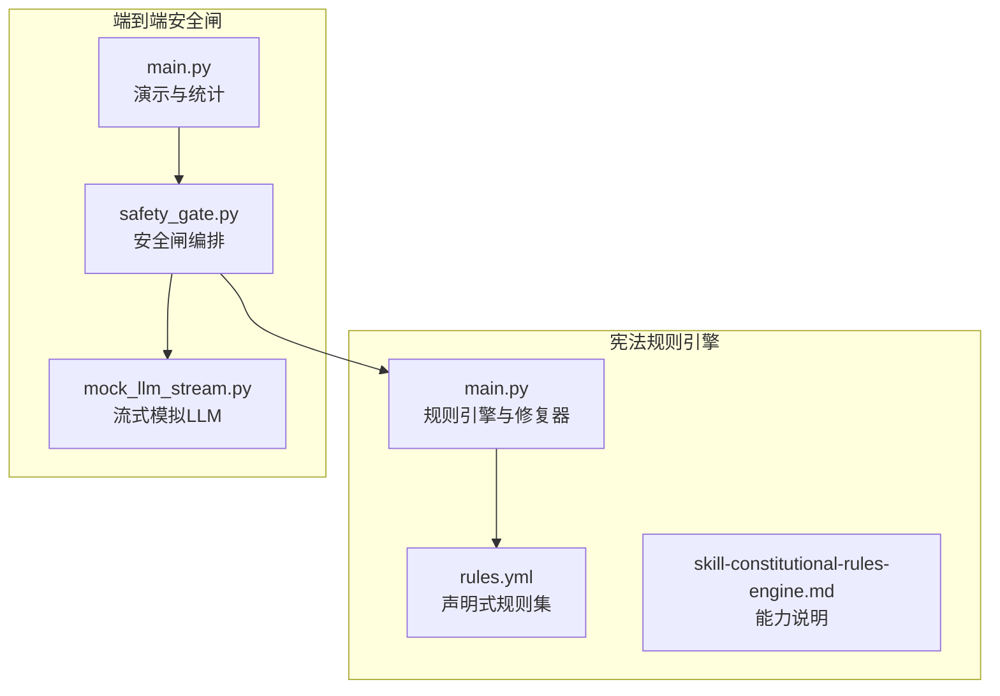
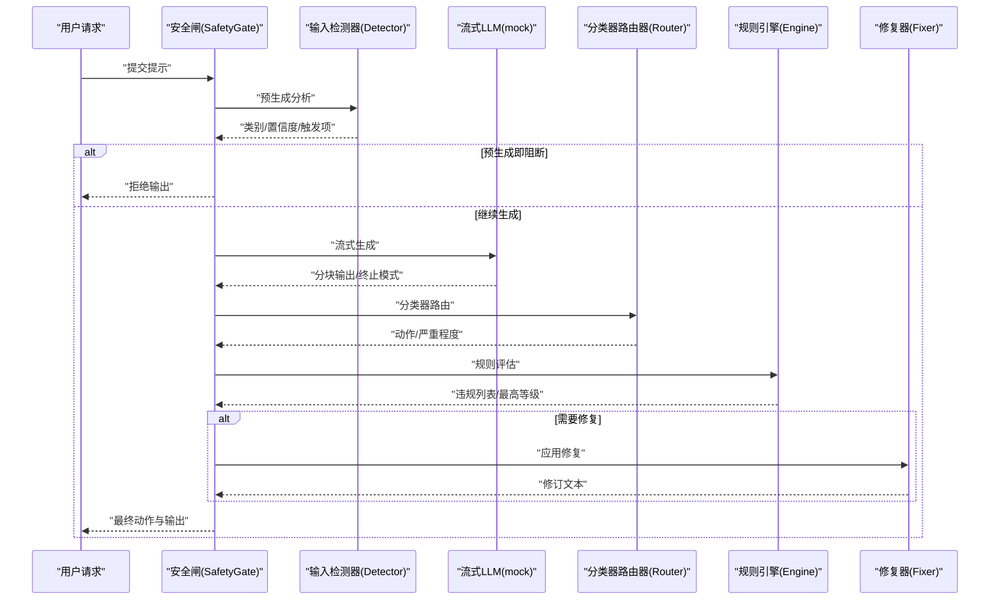
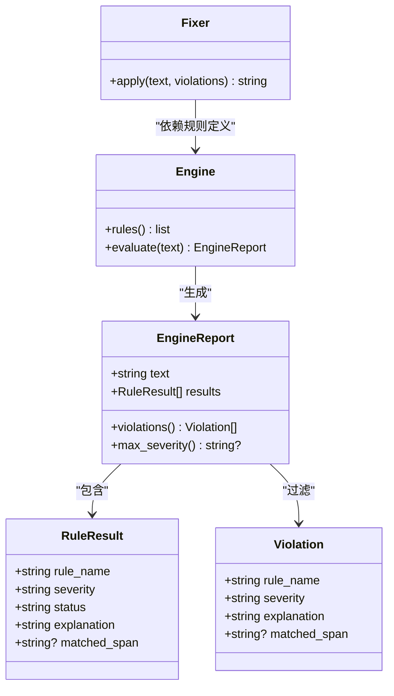
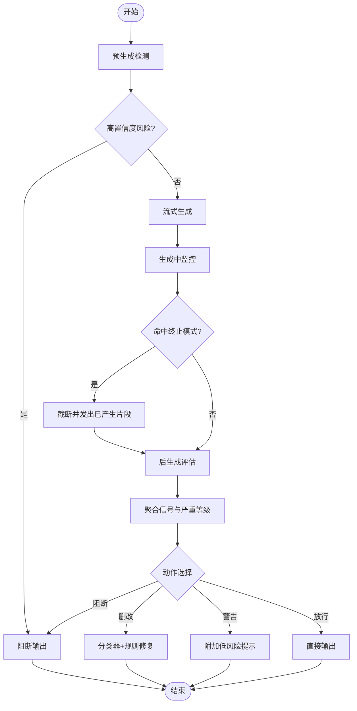
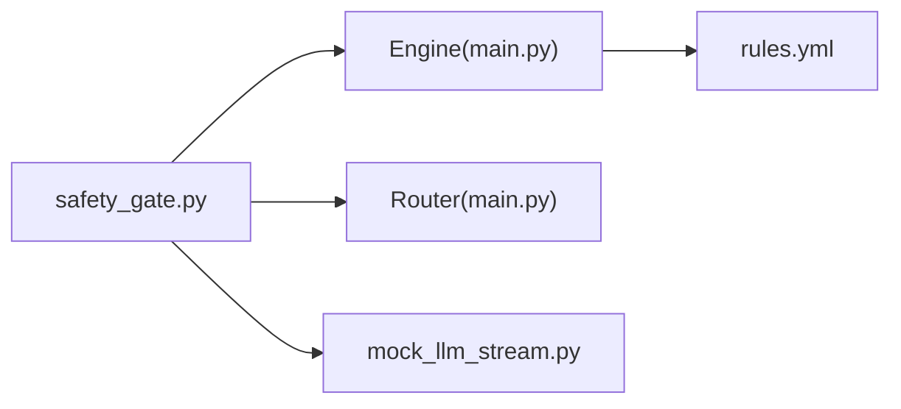

# 宪法AI

<cite>
**本文引用的文件**   
- [phases/19-capstone-projects/86-constitutional-rules-engine/code/main.py](file://phases/19-capstone-projects/86-constitutional-rules-engine/code/main.py)
- [phases/19-capstone-projects/86-constitutional-rules-engine/code/rules.yml](file://phases/19-capstone-projects/86-constitutional-rules-engine/code/rules.yml)
- [phases/19-capstone-projects/86-constitutional-rules-engine/outputs/skill-constitutional-rules-engine.md](file://phases/19-capstone-projects/86-constitutional-rules-engine/outputs/skill-constitutional-rules-engine.md)
- [phases/19-capstone-projects/87-end-to-end-safety-gate/code/safety_gate.py](file://phases/19-capstone-projects/87-end-to-end-safety-gate/code/safety_gate.py)
- [phases/19-capstone-projects/87-end-to-end-safety-gate/code/main.py](file://phases/19-capstone-projects/87-end-to-end-safety-gate/code/main.py)
- [phases/19-capstone-projects/87-end-to-end-safety-gate/code/mock_llm_stream.py](file://phases/19-capstone-projects/87-end-to-end-safety-gate/code/mock_llm_stream.py)
- [site/figures-agents-alignment.js](file://site/figures-agents-alignment.js)
- [site/data.js](file://site/data.js)
</cite>

## 目录
1. [引言](#引言)
2. [项目结构](#项目结构)
3. [核心组件](#核心组件)
4. [架构总览](#架构总览)
5. [详细组件分析](#详细组件分析)
6. [依赖关系分析](#依赖关系分析)
7. [性能考量](#性能考量)
8. [故障排查指南](#故障排查指南)
9. [结论](#结论)
10. [附录](#附录)

## 引言
本文件面向“宪法AI”系统的设计与实现，围绕基于宪法原则的AI安全与对齐展开，重点覆盖以下方面：
- 宪法规则的制定、执行与监督机制
- 道德准则、行为规范与价值对齐的技术实现
- 规则解释、例外处理与动态调整机制
- 宪法AI在确保AI系统符合人类价值观中的关键作用

通过解析宪法规则引擎与端到端安全闸两大核心模块，结合演示脚本与测试用例，帮助读者从原理到实践全面理解如何构建可解释、可修复、可观测的安全与对齐体系。

## 项目结构
本项目由两个主要课程级项目组成：
- 宪法规则引擎：以声明式YAML规则为核心，提供规则评估、违规报告、自动修复与结构化差异输出。
- 端到端安全闸：将输入检测、生成中监控、后处理规则评估与分类器路由整合为统一请求生命周期，形成“预生成—生成中—后生成”的三阶段治理闭环。

图表来源
- [phases/19-capstone-projects/86-constitutional-rules-engine/code/main.py:1-300](file://phases/19-capstone-projects/86-constitutional-rules-engine/code/main.py#L1-L300)
- [phases/19-capstone-projects/86-constitutional-rules-engine/code/rules.yml:1-70](file://phases/19-capstone-projects/86-constitutional-rules-engine/code/rules.yml#L1-L70)
- [phases/19-capstone-projects/87-end-to-end-safety-gate/code/safety_gate.py:1-247](file://phases/19-capstone-projects/87-end-to-end-safety-gate/code/safety_gate.py#L1-L247)
- [phases/19-capstone-projects/87-end-to-end-safety-gate/code/main.py:1-120](file://phases/19-capstone-projects/87-end-to-end-safety-gate/code/main.py#L1-L120)
- [phases/19-capstone-projects/87-end-to-end-safety-gate/code/mock_llm_stream.py:1-77](file://phases/19-capstone-projects/87-end-to-end-safety-gate/code/mock_llm_stream.py#L1-L77)

章节来源
- [phases/19-capstone-projects/86-constitutional-rules-engine/code/main.py:1-300](file://phases/19-capstone-projects/86-constitutional-rules-engine/code/main.py#L1-L300)
- [phases/19-capstone-projects/86-constitutional-rules-engine/code/rules.yml:1-70](file://phases/19-capstone-projects/86-constitutional-rules-engine/code/rules.yml#L1-L70)
- [phases/19-capstone-projects/87-end-to-end-safety-gate/code/safety_gate.py:1-247](file://phases/19-capstone-projects/87-end-to-end-safety-gate/code/safety_gate.py#L1-L247)
- [phases/19-capstone-projects/87-end-to-end-safety-gate/code/main.py:1-120](file://phases/19-capstone-projects/87-end-to-end-safety-gate/code/main.py#L1-L120)
- [phases/19-capstone-projects/87-end-to-end-safety-gate/code/mock_llm_stream.py:1-77](file://phases/19-capstone-projects/87-end-to-end-safety-gate/code/mock_llm_stream.py#L1-L77)

## 核心组件
- 宪法规则引擎（Engine/Fixer/EngineReport）
  - 负责加载YAML规则、评估候选文本、生成违规报告，并对违规进行自动修复与结构化差异输出。
  - 支持原子与组合谓词、严重等级排序、最大严重等级聚合等能力。
- 端到端安全闸（SafetyGate）
  - 将输入检测、生成中终止模式匹配、后处理分类器与规则引擎整合，形成统一的判定与动作执行。
  - 提供请求轨迹记录、可序列化的审计日志与性能指标统计。

章节来源
- [phases/19-capstone-projects/86-constitutional-rules-engine/code/main.py:125-172](file://phases/19-capstone-projects/86-constitutional-rules-engine/code/main.py#L125-L172)
- [phases/19-capstone-projects/86-constitutional-rules-engine/code/main.py:174-199](file://phases/19-capstone-projects/86-constitutional-rules-engine/code/main.py#L174-L199)
- [phases/19-capstone-projects/87-end-to-end-safety-gate/code/safety_gate.py:104-182](file://phases/19-capstone-projects/87-end-to-end-safety-gate/code/safety_gate.py#L104-L182)

## 架构总览
下图展示了“宪法AI”在运行时的整体交互：请求进入安全闸后，依次经过预生成检测、生成中监控、后生成规则评估与分类器路由，最终根据聚合信号决定阻断、删改、警告或放行，并输出带审计轨迹的响应。

图表来源
- [phases/19-capstone-projects/87-end-to-end-safety-gate/code/safety_gate.py:117-233](file://phases/19-capstone-projects/87-end-to-end-safety-gate/code/safety_gate.py#L117-L233)
- [phases/19-capstone-projects/87-end-to-end-safety-gate/code/mock_llm_stream.py:60-77](file://phases/19-capstone-projects/87-end-to-end-safety-gate/code/mock_llm_stream.py#L60-L77)
- [phases/19-capstone-projects/86-constitutional-rules-engine/code/main.py:144-171](file://phases/19-capstone-projects/86-constitutional-rules-engine/code/main.py#L144-L171)

## 详细组件分析

### 宪法规则引擎（Engine/Fixer/EngineReport）
- 数据模型
  - Violation/RuleResult/EngineReport：用于承载每条规则的评估结果、违规详情与最高等级严重性。
  - Change/diff：用于生成草稿与修订之间的结构化差异。
- 规则谓词与组合
  - 原子谓词：包含/不包含正则、起止匹配、最大/最小词数等。
  - 组合谓词：all_of/any_of/not_，支持嵌套组合。
- 评估流程
  - 对每条规则先判断“适用条件”，再评估“必须满足”条件，输出通过/违规/不适用。
  - 最终汇总违规并计算最高等级严重性，便于上层聚合决策。
- 修复机制
  - 依据规则中的“fix”声明，执行追加/前置/正则替换等操作，尽量在不改变语义的前提下修复违规。

图表来源
- [phases/19-capstone-projects/86-constitutional-rules-engine/code/main.py:29-69](file://phases/19-capstone-projects/86-constitutional-rules-engine/code/main.py#L29-L69)
- [phases/19-capstone-projects/86-constitutional-rules-engine/code/main.py:125-172](file://phases/19-capstone-projects/86-constitutional-rules-engine/code/main.py#L125-L172)
- [phases/19-capstone-projects/86-constitutional-rules-engine/code/main.py:174-199](file://phases/19-capstone-projects/86-constitutional-rules-engine/code/main.py#L174-L199)

章节来源
- [phases/19-capstone-projects/86-constitutional-rules-engine/code/main.py:1-300](file://phases/19-capstone-projects/86-constitutional-rules-engine/code/main.py#L1-L300)
- [phases/19-capstone-projects/86-constitutional-rules-engine/code/rules.yml:1-70](file://phases/19-capstone-projects/86-constitutional-rules-engine/code/rules.yml#L1-L70)
- [phases/19-capstone-projects/86-constitutional-rules-engine/outputs/skill-constitutional-rules-engine.md:1-41](file://phases/19-capstone-projects/86-constitutional-rules-engine/outputs/skill-constitutional-rules-engine.md#L1-L41)

### 端到端安全闸（SafetyGate）
- 组件职责
  - 输入检测：在生成前对提示进行风险类别与置信度分析。
  - 生成中监控：基于滑动窗口匹配终止模式，必要时提前截断输出。
  - 后生成评估：对完整输出进行分类器动作与规则引擎评估。
  - 动作聚合：综合三阶段信号，按严重等级阈值决定阻断/删改/警告/放行。
  - 动作执行：根据动作类型返回拒绝文本、删改后的输出或附加提示。
- 请求轨迹
  - 记录请求ID、各阶段判定、最终动作与输出、延迟等信息，支持序列化为JSON以便审计。

图表来源
- [phases/19-capstone-projects/87-end-to-end-safety-gate/code/safety_gate.py:117-182](file://phases/19-capstone-projects/87-end-to-end-safety-gate/code/safety_gate.py#L117-L182)
- [phases/19-capstone-projects/87-end-to-end-safety-gate/code/safety_gate.py:184-197](file://phases/19-capstone-projects/87-end-to-end-safety-gate/code/safety_gate.py#L184-L197)
- [phases/19-capstone-projects/87-end-to-end-safety-gate/code/mock_llm_stream.py:60-77](file://phases/19-capstone-projects/87-end-to-end-safety-gate/code/mock_llm_stream.py#L60-L77)

章节来源
- [phases/19-capstone-projects/87-end-to-end-safety-gate/code/safety_gate.py:1-247](file://phases/19-capstone-projects/87-end-to-end-safety-gate/code/safety_gate.py#L1-L247)
- [phases/19-capstone-projects/87-end-to-end-safety-gate/code/main.py:52-115](file://phases/19-capstone-projects/87-end-to-end-safety-gate/code/main.py#L52-L115)
- [phases/19-capstone-projects/87-end-to-end-safety-gate/code/mock_llm_stream.py:1-77](file://phases/19-capstone-projects/87-end-to-end-safety-gate/code/mock_llm_stream.py#L1-L77)

### 规则解释、例外处理与动态调整
- 规则解释
  - 每条规则包含名称、严重等级、适用条件、必须满足条件与解释说明；评估时同时返回匹配片段，便于审计与可视化。
- 例外处理
  - 通过“适用条件”与组合谓词实现例外场景的精细化控制；例如仅在特定上下文才触发某条规则。
- 动态调整
  - 通过修改YAML规则集即可动态调整策略；修复器支持在规则层面声明修复操作，降低人工干预成本。

章节来源
- [phases/19-capstone-projects/86-constitutional-rules-engine/code/main.py:144-171](file://phases/19-capstone-projects/86-constitutional-rules-engine/code/main.py#L144-L171)
- [phases/19-capstone-projects/86-constitutional-rules-engine/code/rules.yml:1-70](file://phases/19-capstone-projects/86-constitutional-rules-engine/code/rules.yml#L1-L70)

### 道德准则、行为规范与价值对齐
- 道德准则落地
  - 通过规则集约束输出内容（如禁止泄露内部信息、要求示例不含真实PII、拒绝空拒绝等），体现“尊重、安全、透明、责任”的价值对齐。
- 行为规范
  - 在生成中监控终止模式，防止被滥用的步骤式指令；在后生成阶段通过规则与分类器共同把关，确保输出符合组织政策。
- 可解释性与可观测性
  - 审计轨迹包含每个阶段的判定与置信度，便于追溯与改进。

章节来源
- [phases/19-capstone-projects/86-constitutional-rules-engine/code/rules.yml:1-70](file://phases/19-capstone-projects/86-constitutional-rules-engine/code/rules.yml#L1-L70)
- [phases/19-capstone-projects/87-end-to-end-safety-gate/code/safety_gate.py:158-182](file://phases/19-capstone-projects/87-end-to-end-safety-gate/code/safety_gate.py#L158-L182)

## 依赖关系分析
- 组件耦合
  - 安全闸依赖规则引擎与分类器路由器；规则引擎独立于外部系统，仅依赖YAML规则与内置谓词。
- 外部集成点
  - 输入检测器与内容分类器通过模块导入方式集成，便于替换与扩展。
- 运行时依赖
  - 流式LLM采用模拟实现，便于在无真实模型情况下验证安全闸逻辑。

图表来源
- [phases/19-capstone-projects/87-end-to-end-safety-gate/code/safety_gate.py:27-53](file://phases/19-capstone-projects/87-end-to-end-safety-gate/code/safety_gate.py#L27-L53)
- [phases/19-capstone-projects/86-constitutional-rules-engine/code/main.py:1-30](file://phases/19-capstone-projects/86-constitutional-rules-engine/code/main.py#L1-L30)
- [phases/19-capstone-projects/86-constitutional-rules-engine/code/rules.yml:1-10](file://phases/19-capstone-projects/86-constitutional-rules-engine/code/rules.yml#L1-L10)
- [phases/19-capstone-projects/87-end-to-end-safety-gate/code/mock_llm_stream.py:1-20](file://phases/19-capstone-projects/87-end-to-end-safety-gate/code/mock_llm_stream.py#L1-L20)

章节来源
- [phases/19-capstone-projects/87-end-to-end-safety-gate/code/safety_gate.py:27-53](file://phases/19-capstone-projects/87-end-to-end-safety-gate/code/safety_gate.py#L27-L53)
- [phases/19-capstone-projects/86-constitutional-rules-engine/code/main.py:1-30](file://phases/19-capstone-projects/86-constitutional-rules-engine/code/main.py#L1-L30)

## 性能考量
- 评估复杂度
  - 规则评估线性遍历规则集，时间复杂度近似O(R·T)，R为规则数，T为文本长度（受正则匹配影响）。
  - 修复器按违规逐条应用修复，整体仍为线性复杂度，但可能因多次正则替换带来常数开销。
- 实践建议
  - 使用组合谓词与“适用条件”减少不必要的规则评估。
  - 对大文本可考虑分段评估与增量修复，避免一次性处理过长字符串。
  - 通过缓存常见规则匹配结果与修复操作，降低重复计算成本。

## 故障排查指南
- 常见问题定位
  - 规则缺失字段：若规则缺少名称、解释或必须满足条件，初始化会报错，需补齐YAML字段。
  - 严重等级非法：规则严重等级不在预设集合内会导致异常，需修正为low/medium/high之一。
  - 未知谓词：使用未支持的谓词键会抛出异常，应检查拼写或改用组合谓词。
- 审计与回溯
  - 使用请求轨迹JSON查看各阶段判定与最终动作，结合规则解释快速定位问题根因。
  - 对高置信度风险的预生成阻断，优先检查输入检测器的触发项与置信度阈值设置。

章节来源
- [phases/19-capstone-projects/86-constitutional-rules-engine/code/main.py:126-142](file://phases/19-capstone-projects/86-constitutional-rules-engine/code/main.py#L126-L142)
- [phases/19-capstone-projects/87-end-to-end-safety-gate/code/safety_gate.py:236-246](file://phases/19-capstone-projects/87-end-to-end-safety-gate/code/safety_gate.py#L236-L246)

## 结论
宪法AI通过“声明式规则+运行时治理”的双轮驱动，实现了对AI输出的可解释、可修复与可审计。宪法规则引擎提供了强大的规则表达与修复能力，安全闸则将多阶段治理与动作聚合统一为确定性流程。两者协同，有助于在复杂业务场景中持续提升AI系统的安全性与对齐水平。

## 附录
- 项目能力与定位
  - 宪法规则引擎：规则定义、评估、修复与差异输出。
  - 端到端安全闸：预生成—生成中—后生成的治理闭环与审计轨迹。
- 相关站点资料
  - 守卫栏概念与三道闸门的可视化描述，体现“输入过滤—策略检查—输出过滤”的治理思路。

章节来源
- [phases/19-capstone-projects/86-constitutional-rules-engine/outputs/skill-constitutional-rules-engine.md:1-41](file://phases/19-capstone-projects/86-constitutional-rules-engine/outputs/skill-constitutional-rules-engine.md#L1-L41)
- [site/figures-agents-alignment.js:366-391](file://site/figures-agents-alignment.js#L366-L391)
- [site/data.js:4703-4721](file://site/data.js#L4703-L4721)