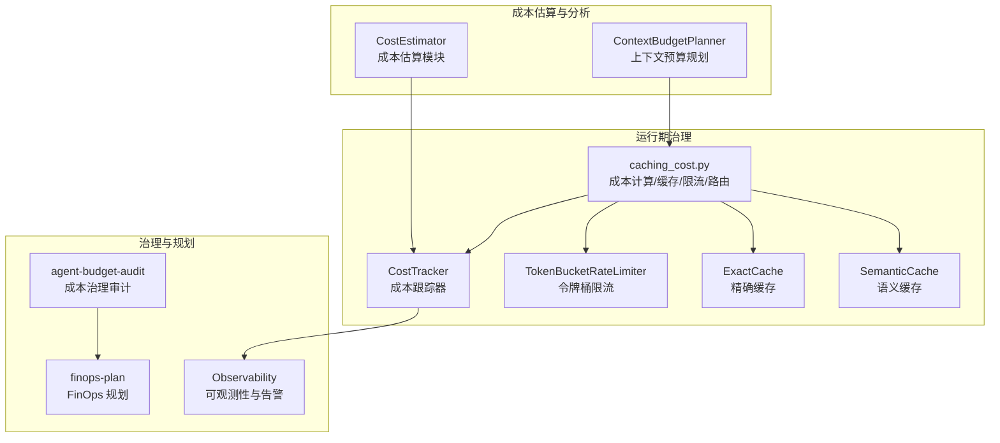
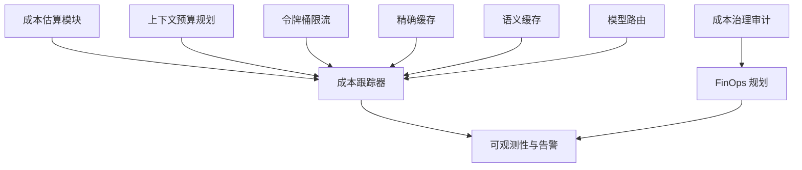
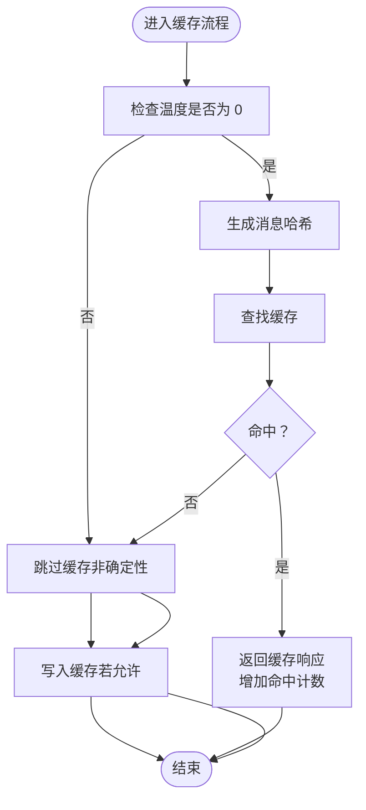
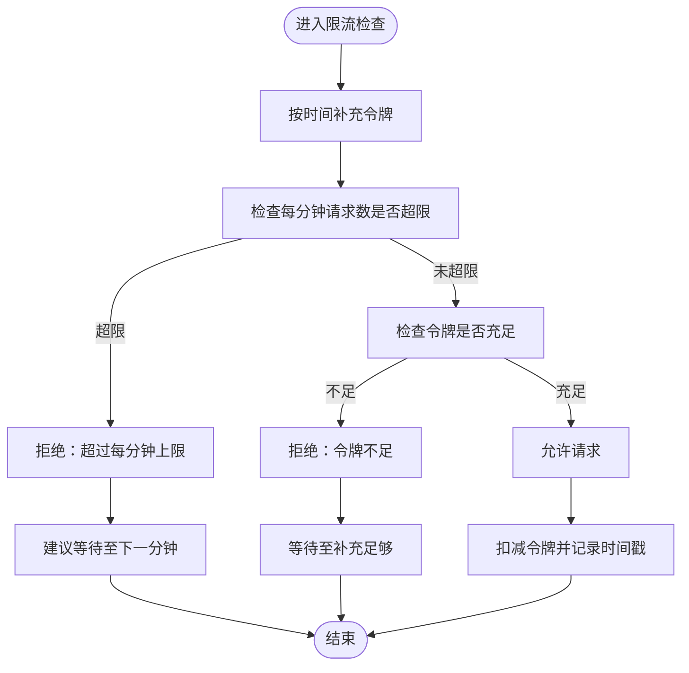
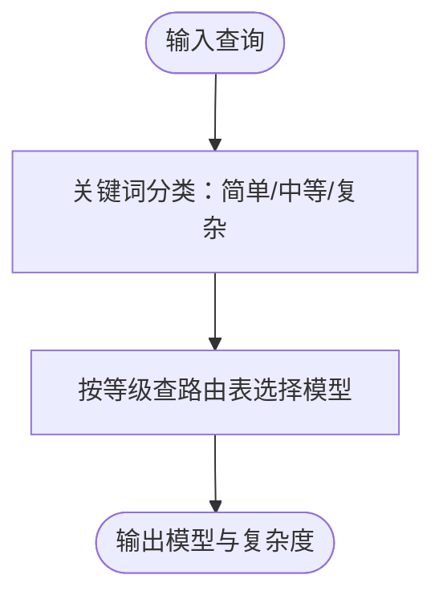
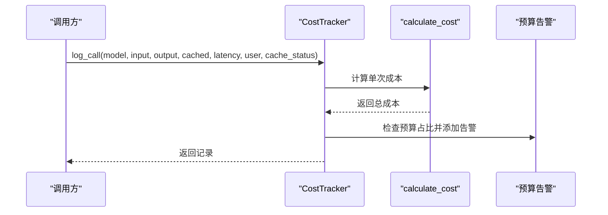
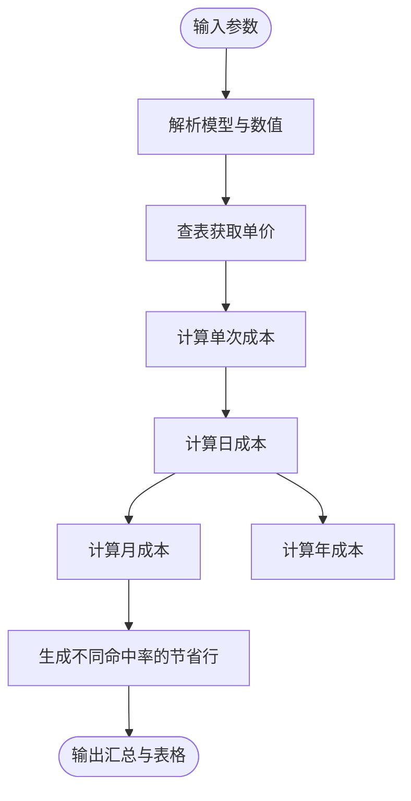
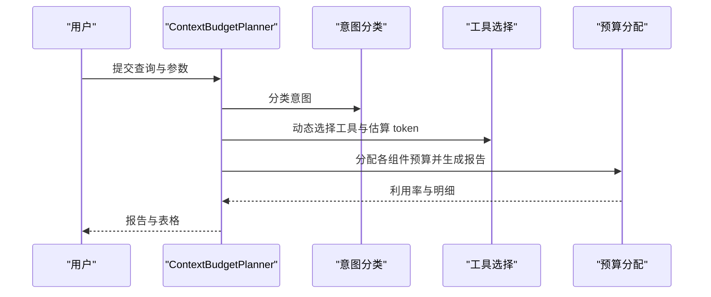
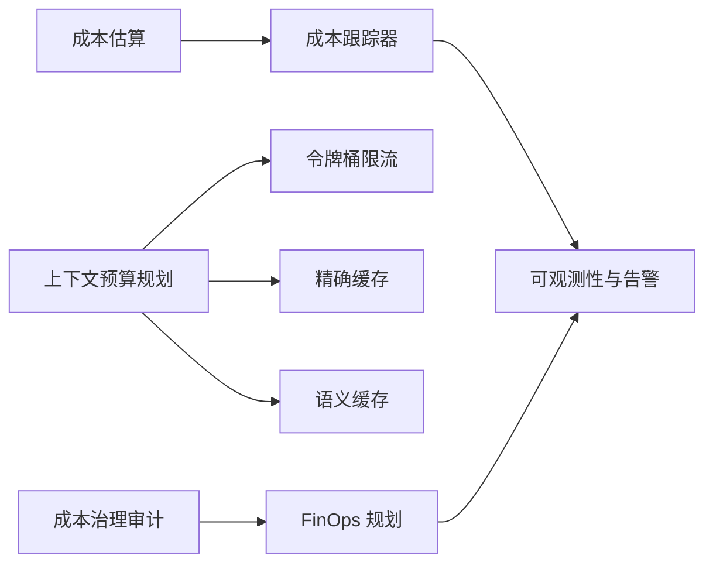

# 成本治理

<cite>
**本文引用的文件**
- [caching_cost.py](file://phases/11-llm-engineering/11-caching-cost/code/caching_cost.py)
- [cost_estimator.py](file://guardrails-sandbox/backend/playground/modules/cost_estimator.py)
- [context_budget_planner.py](file://guardrails-sandbox/backend/playground/modules/context_budget_planner.py)
- [skill-agent-budget-audit.md](file://phases/15-autonomous-systems/13-cost-governors/outputs/skill-agent-budget-audit.md)
- [skill-finops-plan.md](file://phases/17-infrastructure-and-production/27-finops-llms/outputs/skill-finops-plan.md)
- [main.py](file://phases/19-capstone-projects/11-llm-observability-dashboard/code/main.py)
- [index-CrTox38F.js](file://site/summary/assets/index-CrTox38F.js)
</cite>

## 目录
1. [引言](#引言)
2. [项目结构](#项目结构)
3. [核心组件](#核心组件)
4. [架构总览](#架构总览)
5. [详细组件分析](#详细组件分析)
6. [依赖关系分析](#依赖关系分析)
7. [性能考量](#性能考量)
8. [故障排查指南](#故障排查指南)
9. [结论](#结论)
10. [附录](#附录)

## 引言
本文件面向“成本治理系统”的设计与落地，围绕如何有效控制与管理智能体运行成本展开，覆盖成本监控、预算控制、费用优化、资源使用分析、能耗控制与效率优化、成本预测、异常检测与自动调节等主题。文档结合仓库中的具体实现与最佳实践，提供可操作的策略、技术方案与参考路径，帮助在保证 AI 系统可持续运营的同时，实现可控、可观测、可优化的成本闭环。

## 项目结构
成本治理相关内容主要分布在以下模块：
- 缓存与成本计算：LLM 请求成本计算、精确缓存与语义缓存、速率限制与模型路由
- 成本估算与可视化：按模型、token 与请求频率进行成本估算与缓存节省对比
- 上下文预算规划：基于意图与工具选择的上下文窗口预算分配
- 自动驾驶系统成本治理：十二层成本治理审计清单与拒绝规则
- FinOps 规划：多租户成本归属、执行阶梯与仪表盘
- 可观测性与告警：基于存储与告警器的成本与性能指标输出
- 前端演示与摘要：成本跟踪器的预算告警与汇总统计

图表来源
- [cost_estimator.py:1-86](file://guardrails-sandbox/backend/playground/modules/cost_estimator.py#L1-L86)
- [context_budget_planner.py:1-96](file://guardrails-sandbox/backend/playground/modules/context_budget_planner.py#L1-L96)
- [caching_cost.py:25-44](file://phases/11-llm-engineering/11-caching-cost/code/caching_cost.py#L25-L44)
- [caching_cost.py:165-227](file://phases/11-llm-engineering/11-caching-cost/code/caching_cost.py#L165-L227)
- [caching_cost.py:46-93](file://phases/11-llm-engineering/11-caching-cost/code/caching_cost.py#L46-L93)
- [caching_cost.py:115-162](file://phases/11-llm-engineering/11-caching-cost/code/caching_cost.py#L115-L162)
- [index-CrTox38F.js:1037-1111](file://site/summary/assets/index-CrTox38F.js#L1037-L1111)
- [main.py:238-257](file://phases/19-capstone-projects/11-llm-observability-dashboard/code/main.py#L238-L257)

章节来源
- [cost_estimator.py:1-86](file://guardrails-sandbox/backend/playground/modules/cost_estimator.py#L1-L86)
- [context_budget_planner.py:1-96](file://guardrails-sandbox/backend/playground/modules/context_budget_planner.py#L1-L96)
- [caching_cost.py:1-511](file://phases/11-llm-engineering/11-caching-cost/code/caching_cost.py#L1-L511)
- [index-CrTox38F.js:1023-1317](file://site/summary/assets/index-CrTox38F.js#L1023-L1317)
- [main.py:238-257](file://phases/19-capstone-projects/11-llm-observability-dashboard/code/main.py#L238-L257)

## 核心组件
- 成本计算与缓存
  - 计算函数：根据模型与输入/输出/缓存输入 token 数计算单次成本
  - 精确缓存：基于消息哈希的确定性响应缓存
  - 语义缓存：基于查询嵌入相似度的近似匹配缓存
- 速率限制
  - 令牌桶限流：按用户与等级的容量、补充速率与每分钟最大请求数控制
- 模型路由
  - 基于查询复杂度与用户等级的模型选择策略
- 成本跟踪器
  - 日志记录、预算告警、按模型聚合、缓存节省统计、汇总报表
- 成本估算模块
  - 输入模型、token 与请求频率，输出日/月/年成本与不同缓存命中率下的节省对比
- 上下文预算规划
  - 意图分类、工具选择与上下文窗口预算分配
- 治理与规划
  - 自动驾驶系统成本治理审计清单与拒绝规则
  - FinOps 规划：归属、单位指标、执行阶梯、仪表盘与复盘节奏
- 可观测性与告警
  - 存储与告警器输出、PSI 异常检测

章节来源
- [caching_cost.py:25-44](file://phases/11-llm-engineering/11-caching-cost/code/caching_cost.py#L25-L44)
- [caching_cost.py:46-93](file://phases/11-llm-engineering/11-caching-cost/code/caching_cost.py#L46-L93)
- [caching_cost.py:115-162](file://phases/11-llm-engineering/11-caching-cost/code/caching_cost.py#L115-L162)
- [caching_cost.py:165-227](file://phases/11-llm-engineering/11-caching-cost/code/caching_cost.py#L165-L227)
- [caching_cost.py:320-328](file://phases/11-llm-engineering/11-caching-cost/code/caching_cost.py#L320-L328)
- [caching_cost.py:230-304](file://phases/11-llm-engineering/11-caching-cost/code/caching_cost.py#L230-L304)
- [cost_estimator.py:38-85](file://guardrails-sandbox/backend/playground/modules/cost_estimator.py#L38-L85)
- [context_budget_planner.py:40-95](file://guardrails-sandbox/backend/playground/modules/context_budget_planner.py#L40-L95)
- [skill-agent-budget-audit.md:10-41](file://phases/15-autonomous-systems/13-cost-governors/outputs/skill-agent-budget-audit.md#L10-L41)
- [skill-finops-plan.md:10-32](file://phases/17-infrastructure-and-production/27-finops-llms/outputs/skill-finops-plan.md#L10-L32)
- [main.py:238-257](file://phases/19-capstone-projects/11-llm-observability-dashboard/code/main.py#L238-L257)

## 架构总览
成本治理系统由“估算—规划—执行—观测—治理”五条主线构成，形成闭环：
- 估算：通过成本估算模块快速评估不同模型与缓存策略的成本影响
- 规划：上下文预算规划与 FinOps 规划明确归属、指标与执行阶梯
- 执行：运行期通过缓存、限流、路由与成本跟踪器进行实时治理
- 观测：可观测性模块输出成本与性能指标，配合告警器与 PSI 检测异常
- 治理：自动驾驶系统成本治理审计与拒绝规则保障安全上线

图表来源
- [cost_estimator.py:38-85](file://guardrails-sandbox/backend/playground/modules/cost_estimator.py#L38-L85)
- [context_budget_planner.py:40-95](file://guardrails-sandbox/backend/playground/modules/context_budget_planner.py#L40-L95)
- [caching_cost.py:165-227](file://phases/11-llm-engineering/11-caching-cost/code/caching_cost.py#L165-L227)
- [caching_cost.py:46-93](file://phases/11-llm-engineering/11-caching-cost/code/caching_cost.py#L46-L93)
- [caching_cost.py:115-162](file://phases/11-llm-engineering/11-caching-cost/code/caching_cost.py#L115-L162)
- [caching_cost.py:320-328](file://phases/11-llm-engineering/11-caching-cost/code/caching_cost.py#L320-L328)
- [index-CrTox38F.js:1037-1111](file://site/summary/assets/index-CrTox38F.js#L1037-L1111)
- [skill-agent-budget-audit.md:10-41](file://phases/15-autonomous-systems/13-cost-governors/outputs/skill-agent-budget-audit.md#L10-L41)
- [skill-finops-plan.md:10-32](file://phases/17-infrastructure-and-production/27-finops-llms/outputs/skill-finops-plan.md#L10-L32)

## 详细组件分析

### 成本计算与缓存
- 成本计算
  - 输入：模型名、输入/输出/缓存输入 token 数
  - 输出：单项成本分项与总成本
  - 关键点：区分非缓存输入与缓存输入计费方式
- 精确缓存
  - 条件：温度为 0 的确定性请求
  - 行为：命中返回缓存响应；未命中则写入缓存
  - 统计：命中/未命中次数与命中率
- 语义缓存
  - 方法：对查询进行词频向量化，计算余弦相似度
  - 行为：相似度超过阈值则命中
  - 统计：命中/未命中次数与命中率

图表来源
- [caching_cost.py:54-84](file://phases/11-llm-engineering/11-caching-cost/code/caching_cost.py#L54-L84)
- [caching_cost.py:124-141](file://phases/11-llm-engineering/11-caching-cost/code/caching_cost.py#L124-L141)

章节来源
- [caching_cost.py:25-44](file://phases/11-llm-engineering/11-caching-cost/code/caching_cost.py#L25-L44)
- [caching_cost.py:46-93](file://phases/11-llm-engineering/11-caching-cost/code/caching_cost.py#L46-L93)
- [caching_cost.py:115-162](file://phases/11-llm-engineering/11-caching-cost/code/caching_cost.py#L115-L162)

### 速率限制（令牌桶）
- 配置：按用户与等级设置容量、补充速率与每分钟最大请求数
- 控制：检查阶段判断是否超速或令牌不足；消费阶段扣减令牌并记录时间戳
- 使用：用于防止突发流量导致成本飙升

图表来源
- [caching_cost.py:189-208](file://phases/11-llm-engineering/11-caching-cost/code/caching_cost.py#L189-L208)
- [caching_cost.py:210-214](file://phases/11-llm-engineering/11-caching-cost/code/caching_cost.py#L210-L214)

章节来源
- [caching_cost.py:165-227](file://phases/11-llm-engineering/11-caching-cost/code/caching_cost.py#L165-L227)

### 模型路由
- 复杂度分类：简单/中等/复杂
- 路由表：依据复杂度与用户等级选择合适模型
- 目标：在满足质量的前提下降低单次成本

图表来源
- [caching_cost.py:311-328](file://phases/11-llm-engineering/11-caching-cost/code/caching_cost.py#L311-L328)

章节来源
- [caching_cost.py:320-328](file://phases/11-llm-engineering/11-caching-cost/code/caching_cost.py#L320-L328)

### 成本跟踪器
- 功能：记录每次调用的成本、延迟、缓存状态；累计总成本与按模型聚合；计算缓存节省；触发预算告警；生成汇总报表
- 预算告警：按总成本占月预算的比例分级（预警/限流/停止）

图表来源
- [index-CrTox38F.js:1043-1057](file://site/summary/assets/index-CrTox38F.js#L1043-L1057)
- [index-CrTox38F.js:1060-1068](file://site/summary/assets/index-CrTox38F.js#L1060-L1068)
- [index-CrTox38F.js:1095-1111](file://site/summary/assets/index-CrTox38F.js#L1095-L1111)

章节来源
- [index-CrTox38F.js:1037-1111](file://site/summary/assets/index-CrTox38F.js#L1037-L1111)

### 成本估算模块
- 输入：模型、输入/输出 token、每日请求数、每月天数
- 输出：单次/日/月/年成本，以及不同缓存命中率下的节省对比
- 应用：快速评估不同模型与缓存策略的成本影响

图表来源
- [cost_estimator.py:38-85](file://guardrails-sandbox/backend/playground/modules/cost_estimator.py#L38-L85)

章节来源
- [cost_estimator.py:1-86](file://guardrails-sandbox/backend/playground/modules/cost_estimator.py#L1-L86)

### 上下文预算规划
- 输入：用户查询、上下文窗口大小、系统提示
- 输出：意图识别、工具选择、预算分配明细与利用率
- 应用：在不调用大模型的情况下，提前规划上下文占用，避免超窗与浪费

图表来源
- [context_budget_planner.py:40-95](file://guardrails-sandbox/backend/playground/modules/context_budget_planner.py#L40-L95)

章节来源
- [context_budget_planner.py:1-96](file://guardrails-sandbox/backend/playground/modules/context_budget_planner.py#L1-L96)

### 自动驾驶系统成本治理审计
- 审计范围：12 层成本治理能力（请求/任务/工具/迭代/滚动限额/速度限制/分级路由/提示缓存/上下文窗口/人机协作检查点/停机开关）
- 失败模式映射：针对失控循环、缓慢泄漏、错误发布、合法激增等场景给出捕获层与时序
- 硬性拒绝：无任务美元预算、无人工介入长时运行、新工具无工具级限额、停机开关可被代理修改、仅月限额等
- 输出：层表、失败模式覆盖、工具级限额、告警阈值、停机开关路径与就绪状态

章节来源
- [skill-agent-budget-audit.md:10-41](file://phases/15-autonomous-systems/13-cost-governors/outputs/skill-agent-budget-audit.md#L10-L41)

### FinOps 规划
- 归属：在调用点标注 user_id/task_id/route/tenant_id，并分解四层 token（提示/工具/内存/响应）
- 单位指标：如“每解决工单成本”“每会话成本”，并与计费模型绑定
- 执行阶梯：按峰值 2–3 倍设置速率限制，按合同 1.5–3 倍设置日限额，z-score>4 触发停机开关
- 仪表盘：租户当日花费、任务成本-产出、用户分布、缓存命中率影响、模型路由拆分
- 复盘节奏：周看前十大花费与异常，月看租户单位经济，季重分工作负载为交互/半批/批处理
- 硬性拒绝：无调用点归属、单一账单桶、停机开关无 z-score 基础

章节来源
- [skill-finops-plan.md:10-32](file://phases/17-infrastructure-and-production/27-finops-llms/outputs/skill-finops-plan.md#L10-L32)

### 可观测性与告警
- 存储与告警：将成本与性能指标写入存储，输出预算告警与漂移检测（PSI）
- 异常检测：当 PSI 超过阈值（如 0.2）发出漂移告警
- 输出：成本按用户统计、模型分布、告警列表与 PSI 值

章节来源
- [main.py:238-257](file://phases/19-capstone-projects/11-llm-observability-dashboard/code/main.py#L238-L257)

## 依赖关系分析
- 组件耦合
  - 成本估算模块与成本跟踪器：估算用于预估，跟踪器用于实测
  - 上下文预算规划与运行期缓存/限流：规划指导实际资源分配，运行期治理保障不越界
  - 成本治理审计与 FinOps 规划：前者提供上线前检查，后者提供组织级执行框架
- 外部依赖
  - 模型定价表：来自成本估算与成本计算模块
  - 告警器与存储：来自可观测性模块

图表来源
- [cost_estimator.py:38-85](file://guardrails-sandbox/backend/playground/modules/cost_estimator.py#L38-L85)
- [context_budget_planner.py:40-95](file://guardrails-sandbox/backend/playground/modules/context_budget_planner.py#L40-L95)
- [caching_cost.py:165-227](file://phases/11-llm-engineering/11-caching-cost/code/caching_cost.py#L165-L227)
- [caching_cost.py:46-93](file://phases/11-llm-engineering/11-caching-cost/code/caching_cost.py#L46-L93)
- [caching_cost.py:115-162](file://phases/11-llm-engineering/11-caching-cost/code/caching_cost.py#L115-L162)
- [index-CrTox38F.js:1037-1111](file://site/summary/assets/index-CrTox38F.js#L1037-L1111)
- [skill-agent-budget-audit.md:10-41](file://phases/15-autonomous-systems/13-cost-governors/outputs/skill-agent-budget-audit.md#L10-L41)
- [skill-finops-plan.md:10-32](file://phases/17-infrastructure-and-production/27-finops-llms/outputs/skill-finops-plan.md#L10-L32)

## 性能考量
- 缓存命中率提升
  - 精确缓存适用于确定性查询；语义缓存适用于近似查询
  - 通过命中率对比，量化缓存节省，指导缓存策略优化
- 速率限制与排队
  - 合理设置补充速率与容量，避免频繁等待与丢弃
- 模型路由
  - 将简单问题路由到低成本模型，复杂问题再路由到高成本模型
- 上下文预算
  - 在规划阶段严格控制各组件 token 占比，减少无效上下文

## 故障排查指南
- 预算告警
  - 当总成本接近月预算的 70%/85%/95% 时，系统会分别发出预警/限流/停止告警
  - 排查要点：确认是否存在异常高峰、模型切换、缓存未命中增多
- 限流阻断
  - 若出现“超过每分钟上限”或“令牌不足”，检查速率限制配置与突发流量
- 缓存未命中
  - 检查温度是否大于 0（非确定性）、相似度阈值是否过高、缓存 TTL 是否过短
- 上下文超窗
  - 检查预算分配明细，调整系统提示、工具描述与查询长度
- 异常检测
  - PSI 超过阈值（如 0.2）时，检查数据分布变化与外部因素

章节来源
- [index-CrTox38F.js:1060-1068](file://site/summary/assets/index-CrTox38F.js#L1060-L1068)
- [caching_cost.py:189-208](file://phases/11-llm-engineering/11-caching-cost/code/caching_cost.py#L189-L208)
- [caching_cost.py:124-141](file://phases/11-llm-engineering/11-caching-cost/code/caching_cost.py#L124-L141)
- [context_budget_planner.py:65-92](file://guardrails-sandbox/backend/playground/modules/context_budget_planner.py#L65-L92)
- [main.py:250-254](file://phases/19-capstone-projects/11-llm-observability-dashboard/code/main.py#L250-L254)

## 结论
成本治理系统通过“估算—规划—执行—观测—治理”的闭环，将成本控制从事后核算转变为事前预防与实时治理。借助缓存、限流、路由与预算告警等手段，可在保证性能与体验的前提下显著降低成本；通过 FinOps 规划与可观测性建设，实现组织级的成本归属、指标与执行阶梯，最终支撑 AI 系统的可持续运营。

## 附录
- 快速上手建议
  - 先用成本估算模块评估不同策略的成本差异
  - 用上下文预算规划在设计阶段控制上下文占用
  - 在生产环境启用精确/语义缓存与令牌桶限流
  - 建立预算告警与 PSI 异常检测，定期复盘
  - 对新上线的代理与工具，先进行成本治理审计，再决定是否无人值守