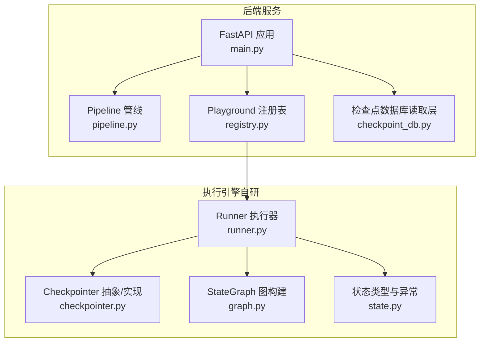
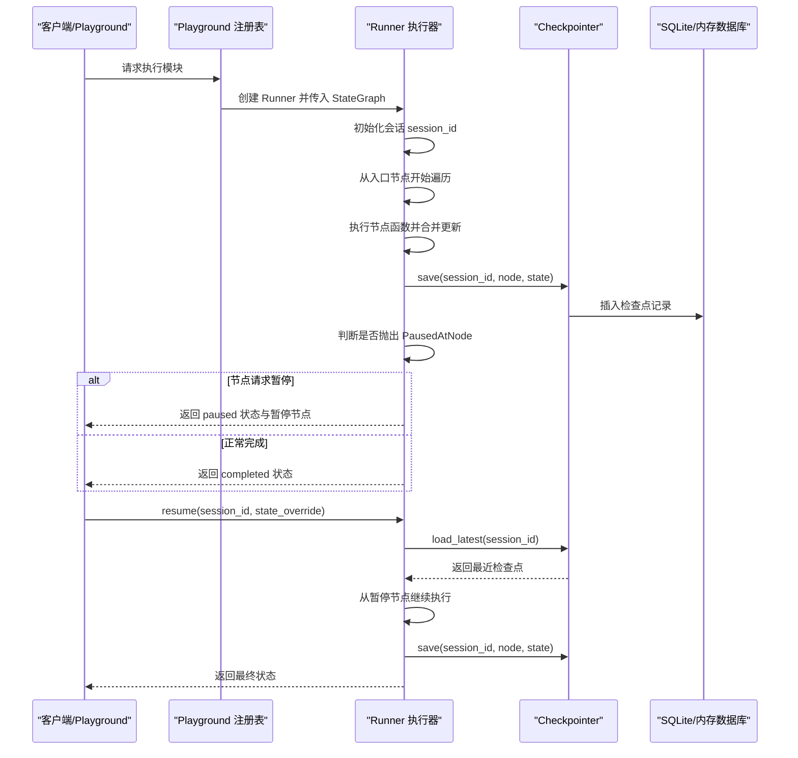
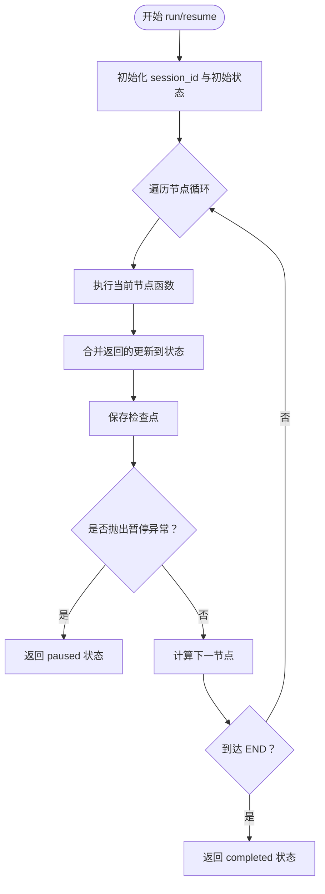
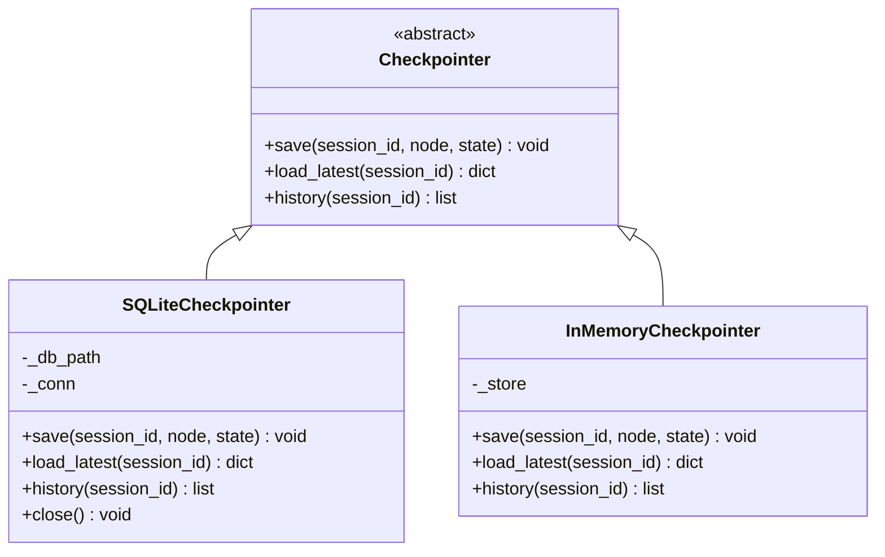
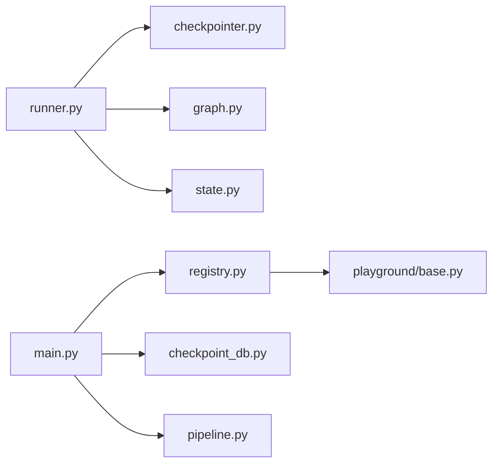

# 持久化执行

<cite>
**本文引用的文件**
- [guardrails-sandbox/backend/playground/checkpoint_db.py](file://guardrails-sandbox/backend/playground/checkpoint_db.py)
- [guardrails-sandbox/backend/playground/base.py](file://guardrails-sandbox/backend/playground/base.py)
- [guardrails-sandbox/backend/playground/registry.py](file://guardrails-sandbox/backend/playground/registry.py)
- [guardrails-sandbox/backend/main.py](file://guardrails-sandbox/backend/main.py)
- [guardrails-sandbox/backend/pipeline.py](file://guardrails-sandbox/backend/pipeline.py)
- [phases/14-agent-engineering/13-langgraph-stateful-graphs/outputs/skill-demo/checkpointer.py](file://phases/14-agent-engineering/13-langgraph-stateful-graphs/outputs/skill-demo/checkpointer.py)
- [phases/14-agent-engineering/13-langgraph-stateful-graphs/outputs/skill-demo/runner.py](file://phases/14-agent-engineering/13-langgraph-stateful-graphs/outputs/skill-demo/runner.py)
- [phases/14-agent-engineering/13-langgraph-stateful-graphs/outputs/skill-demo/state.py](file://phases/14-agent-engineering/13-langgraph-stateful-graphs/outputs/skill-demo/state.py)
- [phases/14-agent-engineering/13-langgraph-stateful-graphs/outputs/skill-demo/graph.py](file://phases/14-agent-engineering/13-langgraph-stateful-graphs/outputs/skill-demo/graph.py)
- [guardrails-sandbox/backend/adapters/rate_limiter.py](file://guardrails-sandbox/backend/adapters/rate_limiter.py)
- [guardrails-sandbox/backend/playground/modules/reflexion_coder.py](file://guardrails-sandbox/backend/playground/modules/reflexion_coder.py)
- [phases/19-capstone-projects/09-code-migration-agent/code/main.py](file://phases/19-capstone-projects/09-code-migration-agent/code/main.py)
- [phases/19-capstone-projects/06-devops-troubleshooting-agent/code/main.py](file://phases/19-capstone-projects/06-devops-troubleshooting-agent/code/main.py)
- [site/figures-infra.js](file://site/figures-infra.js)
</cite>

## 目录
1. [引言](#引言)
2. [项目结构](#项目结构)
3. [核心组件](#核心组件)
4. [架构总览](#架构总览)
5. [详细组件分析](#详细组件分析)
6. [依赖分析](#依赖分析)
7. [性能考虑](#性能考虑)
8. [故障排查指南](#故障排查指南)
9. [结论](#结论)
10. [附录](#附录)

## 引言
本文件围绕“持久化执行”主题，系统梳理仓库中与“状态保存、断点续传、错误恢复、分布式与容错、性能优化”相关的实现与设计。重点覆盖以下方面：
- 基于状态机的有向图执行与检查点持久化
- 会话级状态恢复与人工干预暂停/恢复
- 安全只读检查点数据库读取层
- 容错与重试策略在真实任务中的应用
- 速率限制与资源治理在生产环境中的作用
- 性能优化与分布式推理的可视化说明

## 项目结构
本项目包含两类与持久化执行密切相关的实现：
- 交互式实验台（Playground）与检查点数据库读取层：提供只读访问、结构化解码与前端展示支持
- 自研有状态图执行引擎：提供完整的状态保存、断点续传与恢复能力

图表来源
- [guardrails-sandbox/backend/main.py:1-421](file://guardrails-sandbox/backend/main.py#L1-L421)
- [guardrails-sandbox/backend/pipeline.py:1-285](file://guardrails-sandbox/backend/pipeline.py#L1-L285)
- [guardrails-sandbox/backend/playground/registry.py:1-118](file://guardrails-sandbox/backend/playground/registry.py#L1-L118)
- [guardrails-sandbox/backend/playground/checkpoint_db.py:1-148](file://guardrails-sandbox/backend/playground/checkpoint_db.py#L1-L148)
- [phases/14-agent-engineering/13-langgraph-stateful-graphs/outputs/skill-demo/runner.py:1-203](file://phases/14-agent-engineering/13-langgraph-stateful-graphs/outputs/skill-demo/runner.py#L1-L203)
- [phases/14-agent-engineering/13-langgraph-stateful-graphs/outputs/skill-demo/checkpointer.py:1-153](file://phases/14-agent-engineering/13-langgraph-stateful-graphs/outputs/skill-demo/checkpointer.py#L1-L153)
- [phases/14-agent-engineering/13-langgraph-stateful-graphs/outputs/skill-demo/graph.py:1-337](file://phases/14-agent-engineering/13-langgraph-stateful-graphs/outputs/skill-demo/graph.py#L1-L337)
- [phases/14-agent-engineering/13-langgraph-stateful-graphs/outputs/skill-demo/state.py:1-93](file://phases/14-agent-engineering/13-langgraph-stateful-graphs/outputs/skill-demo/state.py#L1-L93)

章节来源
- [guardrails-sandbox/backend/main.py:1-421](file://guardrails-sandbox/backend/main.py#L1-L421)
- [guardrails-sandbox/backend/playground/checkpoint_db.py:1-148](file://guardrails-sandbox/backend/playground/checkpoint_db.py#L1-L148)
- [phases/14-agent-engineering/13-langgraph-stateful-graphs/outputs/skill-demo/runner.py:1-203](file://phases/14-agent-engineering/13-langgraph-stateful-graphs/outputs/skill-demo/runner.py#L1-L203)

## 核心组件
- Runner 执行器：负责遍历状态图、保存检查点、捕获暂停异常并支持恢复执行
- Checkpointer 抽象与实现：提供统一接口，支持 SQLite 与内存两种后端
- StateGraph 图构建：声明式节点与边，支持固定边与条件边
- State 状态与异常：定义状态结构、节点返回更新、暂停异常
- Playground 模块与注册表：提供实验模块的输入 schema 与渲染块，支撑演示与教学
- 检查点数据库读取层：安全只读访问 LangGraph 检查点库，结构化解码消息

章节来源
- [phases/14-agent-engineering/13-langgraph-stateful-graphs/outputs/skill-demo/runner.py:1-203](file://phases/14-agent-engineering/13-langgraph-stateful-graphs/outputs/skill-demo/runner.py#L1-L203)
- [phases/14-agent-engineering/13-langgraph-stateful-graphs/outputs/skill-demo/checkpointer.py:1-153](file://phases/14-agent-engineering/13-langgraph-stateful-graphs/outputs/skill-demo/checkpointer.py#L1-L153)
- [phases/14-agent-engineering/13-langgraph-stateful-graphs/outputs/skill-demo/graph.py:1-337](file://phases/14-agent-engineering/13-langgraph-stateful-graphs/outputs/skill-demo/graph.py#L1-L337)
- [phases/14-agent-engineering/13-langgraph-stateful-graphs/outputs/skill-demo/state.py:1-93](file://phases/14-agent-engineering/13-langgraph-stateful-graphs/outputs/skill-demo/state.py#L1-L93)
- [guardrails-sandbox/backend/playground/base.py:1-129](file://guardrails-sandbox/backend/playground/base.py#L1-L129)
- [guardrails-sandbox/backend/playground/registry.py:1-118](file://guardrails-sandbox/backend/playground/registry.py#L1-L118)
- [guardrails-sandbox/backend/playground/checkpoint_db.py:1-148](file://guardrails-sandbox/backend/playground/checkpoint_db.py#L1-L148)

## 架构总览
持久化执行的核心在于“状态即代码”的思想：每个节点执行后将完整状态序列化并持久化，一旦发生异常或需要人工干预，系统可从最近检查点恢复，继续执行。

图表来源
- [phases/14-agent-engineering/13-langgraph-stateful-graphs/outputs/skill-demo/runner.py:36-121](file://phases/14-agent-engineering/13-langgraph-stateful-graphs/outputs/skill-demo/runner.py#L36-L121)
- [phases/14-agent-engineering/13-langgraph-stateful-graphs/outputs/skill-demo/checkpointer.py:77-118](file://phases/14-agent-engineering/13-langgraph-stateful-graphs/outputs/skill-demo/checkpointer.py#L77-L118)

## 详细组件分析

### 组件A：Runner 执行器与断点续传
- 设计要点
  - 从入口节点开始遍历，逐节点执行
  - 每次节点执行后保存完整状态作为检查点
  - 捕获节点抛出的暂停异常，保存检查点并返回 paused 状态
  - 支持 resume 从最近检查点恢复，并可注入 state_override 以人工决策
- 关键流程
  - run：生成 session_id，深拷贝初始状态，从入口节点执行
  - _execute_from：循环执行节点，保存检查点，决定下一节点
  - resume：加载最近检查点，注入人工决策，从暂停节点继续

图表来源
- [phases/14-agent-engineering/13-langgraph-stateful-graphs/outputs/skill-demo/runner.py:36-121](file://phases/14-agent-engineering/13-langgraph-stateful-graphs/outputs/skill-demo/runner.py#L36-L121)

章节来源
- [phases/14-agent-engineering/13-langgraph-stateful-graphs/outputs/skill-demo/runner.py:1-203](file://phases/14-agent-engineering/13-langgraph-stateful-graphs/outputs/skill-demo/runner.py#L1-L203)

### 组件B：Checkpointer 抽象与实现
- 设计要点
  - 抽象接口：save/load_latest/history
  - SQLite 实现：WAL 模式、索引、JSON 序列化
  - InMemory 实现：进程内存储，适合测试
- 使用建议
  - 生产环境使用文件路径或外部数据库适配
  - 保持每次 save 追加历史记录，便于审计与回溯

图表来源
- [phases/14-agent-engineering/13-langgraph-stateful-graphs/outputs/skill-demo/checkpointer.py:20-153](file://phases/14-agent-engineering/13-langgraph-stateful-graphs/outputs/skill-demo/checkpointer.py#L20-L153)

章节来源
- [phases/14-agent-engineering/13-langgraph-stateful-graphs/outputs/skill-demo/checkpointer.py:1-153](file://phases/14-agent-engineering/13-langgraph-stateful-graphs/outputs/skill-demo/checkpointer.py#L1-L153)

### 组件C：StateGraph 图构建与路由
- 设计要点
  - add_node/add_edge/add_conditional_edges/set_entry
  - next_node：优先条件边，其次固定边，否则 END
  - 提供多种拓扑辅助：监督者、群集、层次化
- 适用场景
  - 条件分支、人工审批、多阶段审批、跨团队协作

章节来源
- [phases/14-agent-engineering/13-langgraph-stateful-graphs/outputs/skill-demo/graph.py:1-337](file://phases/14-agent-engineering/13-langgraph-stateful-graphs/outputs/skill-demo/graph.py#L1-L337)

### 组件D：状态类型与暂停异常
- 设计要点
  - State/Update 使用 TypedDict 定义，节点函数返回部分更新
  - PausedAtNode 异常用于请求暂停（如人工审批）
  - START/END 哨兵常量定义图的入口与出口

章节来源
- [phases/14-agent-engineering/13-langgraph-stateful-graphs/outputs/skill-demo/state.py:1-93](file://phases/14-agent-engineering/13-langgraph-stateful-graphs/outputs/skill-demo/state.py#L1-L93)

### 组件E：Playground 模块与注册表
- 设计要点
  - PlaygroundModule 抽象：name/display_name/description/phase/lesson/order/input_schema/run
  - Registry：集中注册、按 phase 分组、执行模块
  - 提供通用渲染块（text/json/table/keyvalue/list/score）

章节来源
- [guardrails-sandbox/backend/playground/base.py:1-129](file://guardrails-sandbox/backend/playground/base.py#L1-L129)
- [guardrails-sandbox/backend/playground/registry.py:1-118](file://guardrails-sandbox/backend/playground/registry.py#L1-L118)

### 组件F：检查点数据库读取层（只读）
- 设计要点
  - 仅支持只读访问（mode=ro），防止目录穿越
  - 解码 LangGraph 检查点库，提取 checkpoints 表
  - 返回结构化数据：threads、steps、full_conversation

章节来源
- [guardrails-sandbox/backend/playground/checkpoint_db.py:1-148](file://guardrails-sandbox/backend/playground/checkpoint_db.py#L1-L148)

## 依赖分析
- Runner 依赖 Checkpointer 以持久化状态
- Runner 依赖 StateGraph 以决定节点执行顺序
- Runner 依赖 State/异常以支持暂停与恢复
- Playground 注册表依赖各模块的 input_schema 与 run
- 主应用将 Playground 与检查点数据库 API 暴露为 HTTP 接口

图表来源
- [phases/14-agent-engineering/13-langgraph-stateful-graphs/outputs/skill-demo/runner.py:1-203](file://phases/14-agent-engineering/13-langgraph-stateful-graphs/outputs/skill-demo/runner.py#L1-L203)
- [phases/14-agent-engineering/13-langgraph-stateful-graphs/outputs/skill-demo/checkpointer.py:1-153](file://phases/14-agent-engineering/13-langgraph-stateful-graphs/outputs/skill-demo/checkpointer.py#L1-L153)
- [phases/14-agent-engineering/13-langgraph-stateful-graphs/outputs/skill-demo/graph.py:1-337](file://phases/14-agent-engineering/13-langgraph-stateful-graphs/outputs/skill-demo/graph.py#L1-L337)
- [phases/14-agent-engineering/13-langgraph-stateful-graphs/outputs/skill-demo/state.py:1-93](file://phases/14-agent-engineering/13-langgraph-stateful-graphs/outputs/skill-demo/state.py#L1-L93)
- [guardrails-sandbox/backend/playground/registry.py:1-118](file://guardrails-sandbox/backend/playground/registry.py#L1-L118)
- [guardrails-sandbox/backend/playground/base.py:1-129](file://guardrails-sandbox/backend/playground/base.py#L1-L129)
- [guardrails-sandbox/backend/main.py:1-421](file://guardrails-sandbox/backend/main.py#L1-L421)
- [guardrails-sandbox/backend/playground/checkpoint_db.py:1-148](file://guardrails-sandbox/backend/playground/checkpoint_db.py#L1-L148)
- [guardrails-sandbox/backend/pipeline.py:1-285](file://guardrails-sandbox/backend/pipeline.py#L1-L285)

章节来源
- [guardrails-sandbox/backend/main.py:1-421](file://guardrails-sandbox/backend/main.py#L1-L421)
- [guardrails-sandbox/backend/playground/registry.py:1-118](file://guardrails-sandbox/backend/playground/registry.py#L1-L118)

## 性能考虑
- 检查点频率与吞吐权衡：频繁保存检查点会增加写入开销，应结合业务容忍度调整
- SQLite WAL 模式：提升并发写入性能，适合高并发场景
- 索引优化：按 session_id/id 建立复合索引，加速查询与恢复
- 仅保存完整状态：避免增量快照带来的复杂性，简化恢复逻辑
- 前端只读检查点库：避免写操作干扰，保障数据一致性

章节来源
- [phases/14-agent-engineering/13-langgraph-stateful-graphs/outputs/skill-demo/checkpointer.py:55-75](file://phases/14-agent-engineering/13-langgraph-stateful-graphs/outputs/skill-demo/checkpointer.py#L55-L75)
- [guardrails-sandbox/backend/playground/checkpoint_db.py:37-47](file://guardrails-sandbox/backend/playground/checkpoint_db.py#L37-L47)

## 故障排查指南
- 会话无检查点记录
  - 现象：resume 抛出“无检查点记录”
  - 处理：确认 session_id 是否正确，检查 save 是否执行
- 暂停节点与原因
  - 现象：返回 paused 状态并携带 node 与 reason
  - 处理：根据暂停原因（如人工审批）进行决策，再调用 resume 注入 state_override
- 速率限制触发
  - 现象：RateLimiter 返回拦截
  - 处理：降低请求频率或升级用户等级
- 拦截历史与统计
  - 现象：Pipeline 记录拦截历史与统计
  - 处理：通过 API 获取 block_history 与 stats，定位高频拦截项

章节来源
- [phases/14-agent-engineering/13-langgraph-stateful-graphs/outputs/skill-demo/runner.py:98-121](file://phases/14-agent-engineering/13-langgraph-stateful-graphs/outputs/skill-demo/runner.py#L98-L121)
- [guardrails-sandbox/backend/adapters/rate_limiter.py:33-55](file://guardrails-sandbox/backend/adapters/rate_limiter.py#L33-L55)
- [guardrails-sandbox/backend/pipeline.py:264-285](file://guardrails-sandbox/backend/pipeline.py#L264-L285)

## 结论
本项目通过“状态即代码”的执行模型，实现了可靠的持久化执行：每个节点执行后保存完整状态，支持断点暂停与恢复，满足异常情况下的可恢复性与可审计性。配合只读检查点数据库读取层与实验台模块体系，既可用于教学演示，也可作为生产级执行框架的基础。在分布式与容错方面，结合速率限制、重试与预算控制等策略，可进一步提升系统的鲁棒性与稳定性。

## 附录
- 代码示例路径（不直接展示代码内容）
  - Runner 执行与恢复：[phases/14-agent-engineering/13-langgraph-stateful-graphs/outputs/skill-demo/runner.py:77-121](file://phases/14-agent-engineering/13-langgraph-stateful-graphs/outputs/skill-demo/runner.py#L77-L121)
  - Checkpointer 接口与实现：[phases/14-agent-engineering/13-langgraph-stateful-graphs/outputs/skill-demo/checkpointer.py:20-153](file://phases/14-agent-engineering/13-langgraph-stateful-graphs/outputs/skill-demo/checkpointer.py#L20-L153)
  - StateGraph 构建与路由：[phases/14-agent-engineering/13-langgraph-stateful-graphs/outputs/skill-demo/graph.py:17-102](file://phases/14-agent-engineering/13-langgraph-stateful-graphs/outputs/skill-demo/graph.py#L17-L102)
  - 检查点数据库只读读取：[guardrails-sandbox/backend/playground/checkpoint_db.py:86-147](file://guardrails-sandbox/backend/playground/checkpoint_db.py#L86-L147)
  - Playground 模块注册与执行：[guardrails-sandbox/backend/playground/registry.py:58-84](file://guardrails-sandbox/backend/playground/registry.py#L58-L84)
  - 主应用 API 暴露：[guardrails-sandbox/backend/main.py:368-404](file://guardrails-sandbox/backend/main.py#L368-L404)
  - 速率限制适配器：[guardrails-sandbox/backend/adapters/rate_limiter.py:33-55](file://guardrails-sandbox/backend/adapters/rate_limiter.py#L33-L55)
  - 反思式编码模块（试验与重试）：[guardrails-sandbox/backend/playground/modules/reflexion_coder.py:92-123](file://guardrails-sandbox/backend/playground/modules/reflexion_coder.py#L92-L123)
  - 代码迁移代理（确定性配方+预算控制）：[phases/19-capstone-projects/09-code-migration-agent/code/main.py:135-157](file://phases/19-capstone-projects/09-code-migration-agent/code/main.py#L135-L157)
  - DevOps 故障排查代理（只读遥测+审批）：[phases/19-capstone-projects/06-devops-troubleshooting-agent/code/main.py:190-229](file://phases/19-capstone-projects/06-devops-troubleshooting-agent/code/main.py#L190-L229)
  - 分布式推理与性能可视化（站点脚本）：[site/figures-infra.js:117-142](file://site/figures-infra.js#L117-L142)