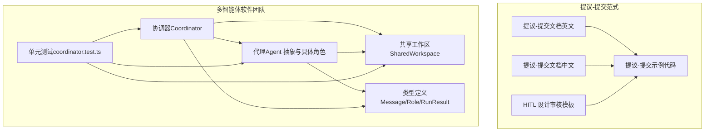
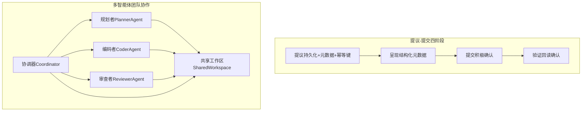
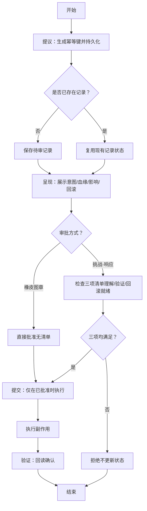
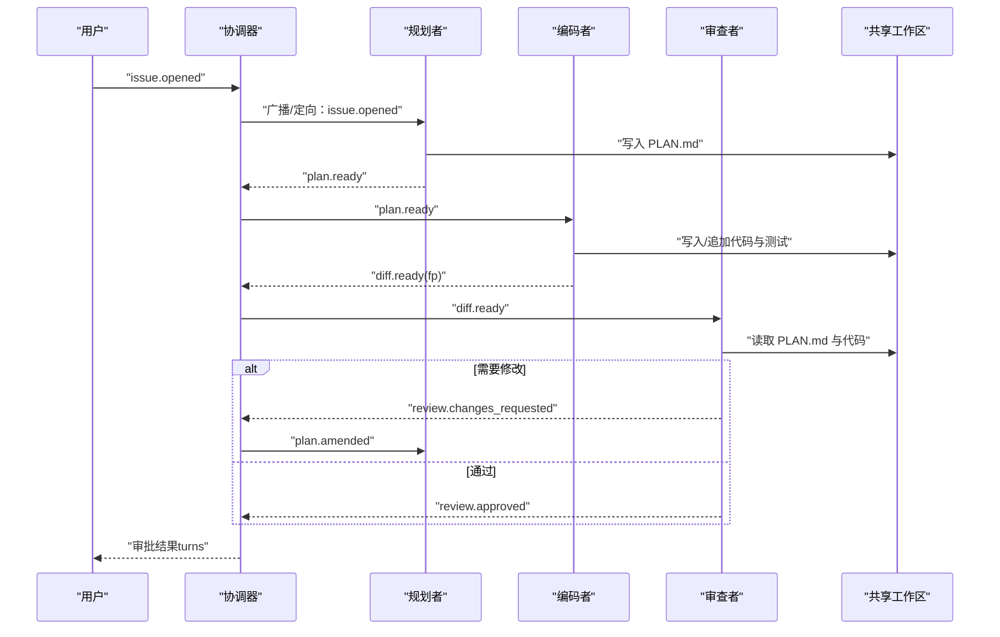
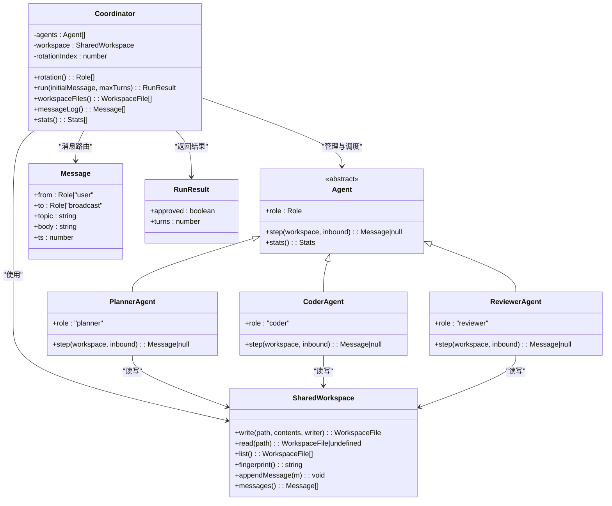
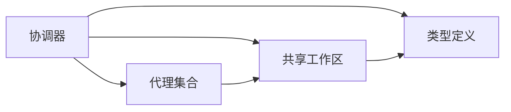

# 提议-承诺协议

<cite>
**本文引用的文件**
- [提议-提交文档（英文）](file://phases/15-autonomous-systems/15-propose-then-commit/docs/en.md)
- [提议-提交文档（中文）](file://phases/15-autonomous-systems/15-propose-then-commit/docs/zh.md)
- [提议-提交示例代码](file://phases/15-autonomous-systems/15-propose-then-commit/code/main.py)
- [HITL 设计审核模板](file://phases/15-autonomous-systems/15-propose-then-commit/outputs/skill-hitl-design.md)
- [多智能体软件团队协调器（TS）](file://phases/19-capstone-projects/10-multi-agent-software-team/code/ts/src/coordinator.ts)
- [多智能体软件团队代理（TS）](file://phases/19-capstone-projects/10-multi-agent-software-team/code/ts/src/agent.ts)
- [多智能体软件团队类型定义（TS）](file://phases/19-capstone-projects/10-multi-agent-software-team/code/ts/src/types.ts)
- [多智能体软件团队共享工作区（TS）](file://phases/19-capstone-projects/10-multi-agent-software-team/code/ts/src/workspace.ts)
- [多智能体软件团队测试（TS）](file://phases/19-capstone-projects/10-multi-agent-software-team/code/ts/tests/coordinator.test.ts)
</cite>

## 目录
1. [引言](#引言)
2. [项目结构](#项目结构)
3. [核心组件](#核心组件)
4. [架构总览](#架构总览)
5. [详细组件分析](#详细组件分析)
6. [依赖关系分析](#依赖关系分析)
7. [性能考量](#性能考量)
8. [故障排查指南](#故障排查指南)
9. [结论](#结论)
10. [附录](#附录)

## 引言
本文件围绕“提议-承诺协议”在多智能体系统中的协调与治理价值展开，结合仓库内“人在回路：提议-提交”范式与多智能体软件团队的协作实践，系统阐述提议阶段与承诺阶段的流程、规则与实现要点，并给出在任务分配、资源协调与冲突解决中的应用建议。文档同时覆盖公平性、效率与稳定性的分析维度，强调通过持久化、幂等键、结构化元数据与验证闭环提升系统可靠性与合规性。

## 项目结构
本主题相关代码与文档主要分布在以下位置：
- 自动驾驶与人在回路：提议-提交范式与实现样例
- 多智能体软件团队：角色分工、消息传递与工作区共享

图表来源
- [提议-提交文档（英文）:1-109](file://phases/15-autonomous-systems/15-propose-then-commit/docs/en.md#L1-L109)
- [提议-提交文档（中文）:1-109](file://phases/15-autonomous-systems/15-propose-then-commit/docs/zh.md#L1-L109)
- [提议-提交示例代码:1-227](file://phases/15-autonomous-systems/15-propose-then-commit/code/main.py#L1-L227)
- [HITL 设计审核模板:1-41](file://phases/15-autonomous-systems/15-propose-then-commit/outputs/skill-hitl-design.md#L1-L41)
- [多智能体软件团队协调器（TS）:1-68](file://phases/19-capstone-projects/10-multi-agent-software-team/code/ts/src/coordinator.ts#L1-L68)
- [多智能体软件团队代理（TS）:1-124](file://phases/19-capstone-projects/10-multi-agent-software-team/code/ts/src/agent.ts#L1-L124)
- [多智能体软件团队类型定义（TS）:1-31](file://phases/19-capstone-projects/10-multi-agent-software-team/code/ts/src/types.ts#L1-L31)
- [多智能体软件团队共享工作区（TS）:1-46](file://phases/19-capstone-projects/10-multi-agent-software-team/code/ts/src/workspace.ts#L1-L46)
- [多智能体软件团队测试（TS）:1-106](file://phases/19-capstone-projects/10-multi-agent-software-team/code/ts/tests/coordinator.test.ts#L1-L106)

章节来源
- [提议-提交文档（英文）:1-109](file://phases/15-autonomous-systems/15-propose-then-commit/docs/en.md#L1-L109)
- [提议-提交文档（中文）:1-109](file://phases/15-autonomous-systems/15-propose-then-commit/docs/zh.md#L1-L109)
- [提议-提交示例代码:1-227](file://phases/15-autonomous-systems/15-propose-then-commit/code/main.py#L1-L227)
- [HITL 设计审核模板:1-41](file://phases/15-autonomous-systems/15-propose-then-commit/outputs/skill-hitl-design.md#L1-L41)
- [多智能体软件团队协调器（TS）:1-68](file://phases/19-capstone-projects/10-multi-agent-software-team/code/ts/src/coordinator.ts#L1-L68)
- [多智能体软件团队代理（TS）:1-124](file://phases/19-capstone-projects/10-multi-agent-software-team/code/ts/src/agent.ts#L1-L124)
- [多智能体软件团队类型定义（TS）:1-31](file://phases/19-capstone-projects/10-multi-agent-software-team/code/ts/src/types.ts#L1-L31)
- [多智能体软件团队共享工作区（TS）:1-46](file://phases/19-capstone-projects/10-multi-agent-software-team/code/ts/src/workspace.ts#L1-L46)
- [多智能体软件团队测试（TS）:1-106](file://phases/19-capstone-projects/10-multi-agent-software-team/code/ts/tests/coordinator.test.ts#L1-L106)

## 核心组件
- 提议-提交状态机（Python 示例）
  - 提议：持久化提案，附带意图、数据血缘、权限范围、影响范围、回滚计划与幂等键
  - 呈现：向审查者展示结构化元数据
  - 提交：积极确认后执行，幂等处理
  - 验证：执行后回读确认副作用
- 多智能体软件团队协调器与代理
  - 协调器：轮转调度、消息路由、回合制推进、审批结果统计
  - 角色代理：规划者、编码者、审查者，基于消息流转完成任务闭环
  - 共享工作区：文件与消息的持久化日志，支持指纹校验与版本修订

章节来源
- [提议-提交示例代码:24-144](file://phases/15-autonomous-systems/15-propose-then-commit/code/main.py#L24-L144)
- [多智能体软件团队协调器（TS）:5-67](file://phases/19-capstone-projects/10-multi-agent-software-team/code/ts/src/coordinator.ts#L5-L67)
- [多智能体软件团队代理（TS）:4-123](file://phases/19-capstone-projects/10-multi-agent-software-team/code/ts/src/agent.ts#L4-L123)
- [多智能体软件团队共享工作区（TS）:4-45](file://phases/19-capstone-projects/10-multi-agent-software-team/code/ts/src/workspace.ts#L4-L45)

## 架构总览
下图展示了提议-提交范式在系统中的四个阶段与关键约束，以及与多智能体团队协作的消息流映射。

图表来源
- [提议-提交示例代码:78-144](file://phases/15-autonomous-systems/15-propose-then-commit/code/main.py#L78-L144)
- [多智能体软件团队协调器（TS）:32-54](file://phases/19-capstone-projects/10-multi-agent-software-team/code/ts/src/coordinator.ts#L32-L54)
- [多智能体软件团队代理（TS）:42-122](file://phases/19-capstone-projects/10-multi-agent-software-team/code/ts/src/agent.ts#L42-L122)
- [多智能体软件团队共享工作区（TS）:8-44](file://phases/19-capstone-projects/10-multi-agent-software-team/code/ts/src/workspace.ts#L8-L44)

## 详细组件分析

### 提议-提交状态机（Python）
- 数据模型与幂等键
  - 提案对象包含线程标识、动作签名、载荷、意图、数据血缘、影响范围、回滚计划
  - 幂等键由线程与动作签名派生，避免重试导致的重复执行
- 流程控制
  - 提议阶段：若已有记录则复用状态，否则写入待审
  - 呈现阶段：打印结构化元数据供审查
  - 提交阶段：仅在“已批准”状态下执行，执行后更新为“已提交”，并触发验证
  - 验证阶段：回读副作用是否存在，失败则进入告警态
- 演示场景
  - 清洁审批流：挑战-响应清单通过后提交并验证
  - 重试幂等：批准后重试不应重复执行
  - 橡皮图章 vs 挑战-响应：对比默认 UI 与强制清单的效果

图表来源
- [提议-提交示例代码:78-144](file://phases/15-autonomous-systems/15-propose-then-commit/code/main.py#L78-L144)

章节来源
- [提议-提交示例代码:24-144](file://phases/15-autonomous-systems/15-propose-then-commit/code/main.py#L24-L144)

### 多智能体软件团队（TS）
- 角色与职责
  - 规划者：接收“问题开启”消息，生成计划并写入工作区，向编码者发出“计划就绪”
  - 编码者：接收“计划就绪/修订”消息，修改代码与新增测试，向审查者发出“差异就绪”
  - 审查者：接收“差异就绪”，校验计划与代码，必要时退回“变更请求”，最终广播“审查通过”
- 协调器与消息流
  - 协调器维护轮转索引，按消息目标路由到对应角色
  - 支持广播消息，便于最终审批通知
  - 最终以“审查通过”消息作为审批达成信号
- 共享工作区
  - 文件写入记录修订次数与最后作者
  - 计算工作区指纹，用于差异比对
  - 消息日志用于审计与回放

图表来源
- [多智能体软件团队协调器（TS）:32-54](file://phases/19-capstone-projects/10-multi-agent-software-team/code/ts/src/coordinator.ts#L32-L54)
- [多智能体软件团队代理（TS）:42-122](file://phases/19-capstone-projects/10-multi-agent-software-team/code/ts/src/agent.ts#L42-L122)
- [多智能体软件团队共享工作区（TS）:8-44](file://phases/19-capstone-projects/10-multi-agent-software-team/code/ts/src/workspace.ts#L8-L44)

章节来源
- [多智能体软件团队协调器（TS）:1-68](file://phases/19-capstone-projects/10-multi-agent-software-team/code/ts/src/coordinator.ts#L1-L68)
- [多智能体软件团队代理（TS）:1-124](file://phases/19-capstone-projects/10-multi-agent-software-team/code/ts/src/agent.ts#L1-L124)
- [多智能体软件团队共享工作区（TS）:1-46](file://phases/19-capstone-projects/10-multi-agent-software-team/code/ts/src/workspace.ts#L1-L46)
- [多智能体软件团队测试（TS）:1-106](file://phases/19-capstone-projects/10-multi-agent-software-team/code/ts/tests/coordinator.test.ts#L1-L106)

### 类与接口关系（TS）

图表来源
- [多智能体软件团队代理（TS）:4-123](file://phases/19-capstone-projects/10-multi-agent-software-team/code/ts/src/agent.ts#L4-L123)
- [多智能体软件团队协调器（TS）:5-67](file://phases/19-capstone-projects/10-multi-agent-software-team/code/ts/src/coordinator.ts#L5-L67)
- [多智能体软件团队共享工作区（TS）:4-45](file://phases/19-capstone-projects/10-multi-agent-software-team/code/ts/src/workspace.ts#L4-L45)
- [多智能体软件团队类型定义（TS）:3-18](file://phases/19-capstone-projects/10-multi-agent-software-team/code/ts/src/types.ts#L3-L18)

章节来源
- [多智能体软件团队代理（TS）:1-124](file://phases/19-capstone-projects/10-multi-agent-software-team/code/ts/src/agent.ts#L1-L124)
- [多智能体软件团队协调器（TS）:1-68](file://phases/19-capstone-projects/10-multi-agent-software-team/code/ts/src/coordinator.ts#L1-L68)
- [多智能体软件团队共享工作区（TS）:1-46](file://phases/19-capstone-projects/10-multi-agent-software-team/code/ts/src/workspace.ts#L1-L46)
- [多智能体软件团队类型定义（TS）:1-31](file://phases/19-capstone-projects/10-multi-agent-software-team/code/ts/src/types.ts#L1-L31)

## 依赖关系分析
- 内聚与耦合
  - 协调器集中管理角色与消息路由，降低代理间直接耦合
  - 共享工作区承担跨角色的数据与审计职责，形成高内聚低耦合的数据面
- 外部依赖与集成点
  - 提议-提交范式依赖持久化存储（示例中为 JSON 文件），需确保幂等键与并发安全
  - 多智能体团队通过消息与文件实现解耦，便于扩展新角色与工作流
- 循环依赖
  - 当前结构未见循环导入；协调器仅依赖抽象类型与工作区接口

图表来源
- [多智能体软件团队协调器（TS）:1-20](file://phases/19-capstone-projects/10-multi-agent-software-team/code/ts/src/coordinator.ts#L1-L20)
- [多智能体软件团队代理（TS）:1-3](file://phases/19-capstone-projects/10-multi-agent-software-team/code/ts/src/agent.ts#L1-L3)
- [多智能体软件团队类型定义（TS）:1-9](file://phases/19-capstone-projects/10-multi-agent-software-team/code/ts/src/types.ts#L1-L9)
- [多智能体软件团队共享工作区（TS）:1-6](file://phases/19-capstone-projects/10-multi-agent-software-team/code/ts/src/workspace.ts#L1-L6)

章节来源
- [多智能体软件团队协调器（TS）:1-68](file://phases/19-capstone-projects/10-multi-agent-software-team/code/ts/src/coordinator.ts#L1-L68)
- [多智能体软件团队代理（TS）:1-124](file://phases/19-capstone-projects/10-multi-agent-software-team/code/ts/src/agent.ts#L1-L124)
- [多智能体软件团队类型定义（TS）:1-31](file://phases/19-capstone-projects/10-multi-agent-software-team/code/ts/src/types.ts#L1-L31)
- [多智能体软件团队共享工作区（TS）:1-46](file://phases/19-capstone-projects/10-multi-agent-software-team/code/ts/src/workspace.ts#L1-L46)

## 性能考量
- 幂等键与重试
  - 幂等键避免重试导致的重复执行，减少无效开销与副作用
- 消息路由与轮转
  - 协调器按轮转索引顺序尝试角色，避免不必要的广播风暴
- 工作区指纹
  - 通过文件内容排序与哈希计算指纹，便于增量比较与差异定位
- 可观测性
  - 统计每个角色的收发次数，辅助评估负载均衡与瓶颈

章节来源
- [提议-提交示例代码:34-37](file://phases/15-autonomous-systems/15-propose-then-commit/code/main.py#L34-L37)
- [多智能体软件团队协调器（TS）:26-46](file://phases/19-capstone-projects/10-multi-agent-software-team/code/ts/src/coordinator.ts#L26-L46)
- [多智能体软件团队共享工作区（TS）:28-36](file://phases/19-capstone-projects/10-multi-agent-software-team/code/ts/src/workspace.ts#L28-L36)
- [多智能体软件团队代理（TS）:33-35](file://phases/19-capstone-projects/10-multi-agent-software-team/code/ts/src/agent.ts#L33-L35)

## 故障排查指南
- 提议-提交常见问题
  - 幂等键设计不当：包含时间戳等非幂等因素，导致重试误判
  - 审批 UI 为橡皮图章：未启用挑战-响应清单，应改为强制三问
  - 未执行验证：仅凭工具返回码判定，应回读目标资源确认
- 多智能体团队常见问题
  - 审查者缺失输入：PLAN.md 或代码文件未就绪，应回退到“变更请求”
  - 审查者二次审查不足：应要求更严格的回归测试覆盖
  - 协调器超时：提高最大回合数或优化角色内部逻辑
- 测试验证
  - 协调器轮转与审批回合数：通过单元测试验证
  - 工作区文件与消息日志：确保输出包含计划与代码文件

章节来源
- [HITL 设计审核模板:14-25](file://phases/15-autonomous-systems/15-propose-then-commit/outputs/skill-hitl-design.md#L14-L25)
- [多智能体软件团队测试（TS）:7-100](file://phases/19-capstone-projects/10-multi-agent-software-team/code/ts/tests/coordinator.test.ts#L7-L100)
- [多智能体软件团队共享工作区（TS）:8-44](file://phases/19-capstone-projects/10-multi-agent-software-team/code/ts/src/workspace.ts#L8-L44)

## 结论
提议-承诺协议通过“持久化提议、结构化呈现、积极提交、执行验证”的闭环，显著提升了多智能体系统在关键操作上的安全性与可追溯性。结合多智能体团队的角色分工与消息编排，可在任务分配、资源协调与冲突解决中实现高效、稳定与合规的协同。建议在生产环境中强化挑战-响应清单、完善回滚计划与验证机制，并持续通过可观测性与测试保障协议的正确落地。

## 附录
- 应用场景建议
  - 任务分配：规划者提出方案，审查者基于影响范围与回滚计划进行决策
  - 资源协调：对涉及权限与数据血缘的操作采用提议-提交，确保可审计
  - 冲突解决：通过工作区指纹与消息日志回溯争议，配合审查者二次把关
- 合规与伦理
  - 参考 EU AI Act Article 14 对人类监督的要求，避免橡皮图章式审批
  - 将挑战-响应清单纳入审批 UI，确保审查质量

章节来源
- [提议-提交文档（英文）:65-67](file://phases/15-autonomous-systems/15-propose-then-commit/docs/en.md#L65-L67)
- [提议-提交文档（中文）:65-67](file://phases/15-autonomous-systems/15-propose-then-commit/docs/zh.md#L65-L67)
- [HITL 设计审核模板:14-25](file://phases/15-autonomous-systems/15-propose-then-commit/outputs/skill-hitl-design.md#L14-L25)