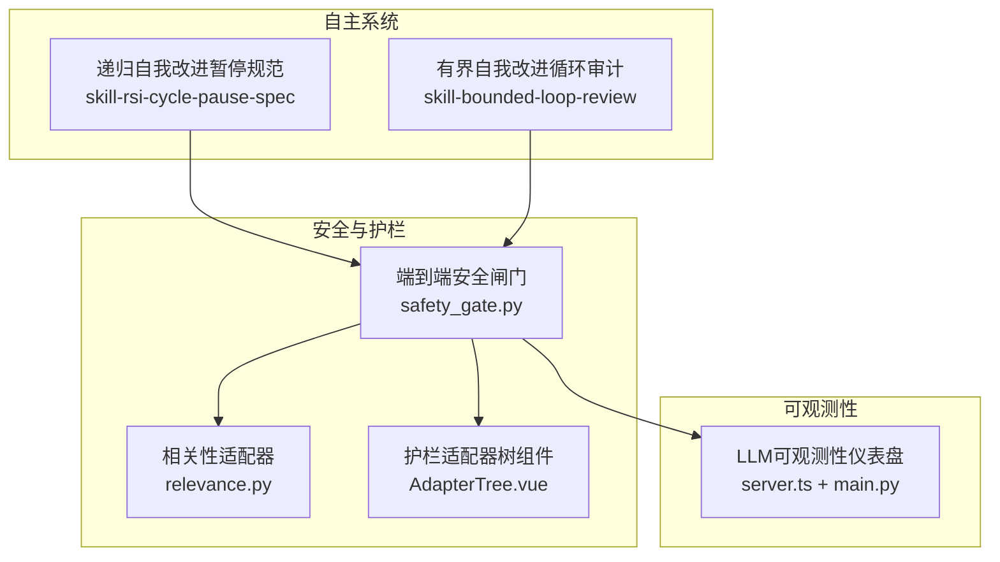
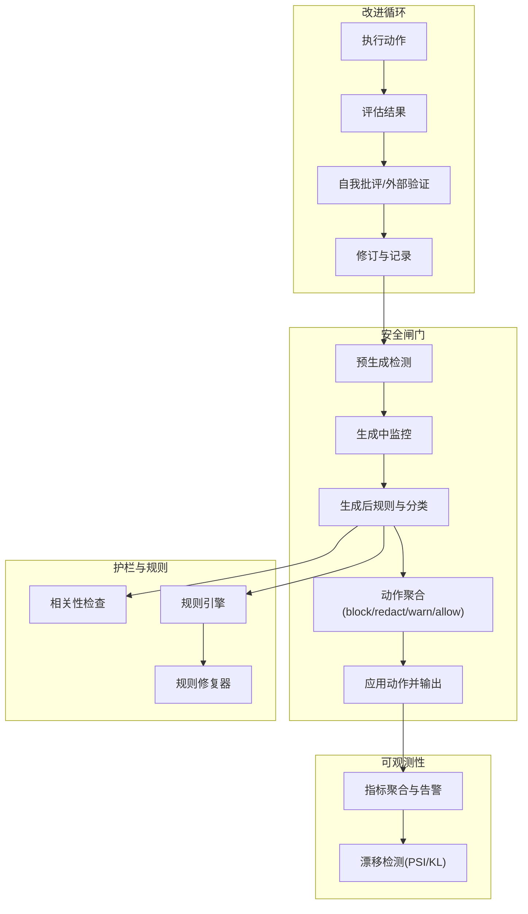
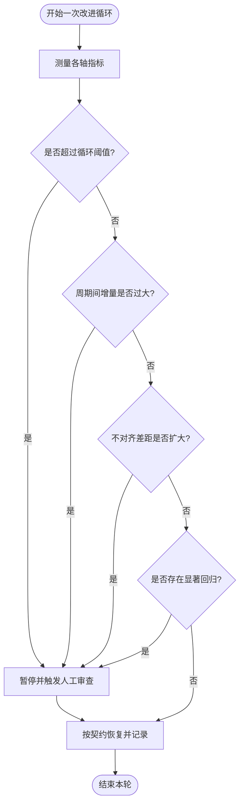
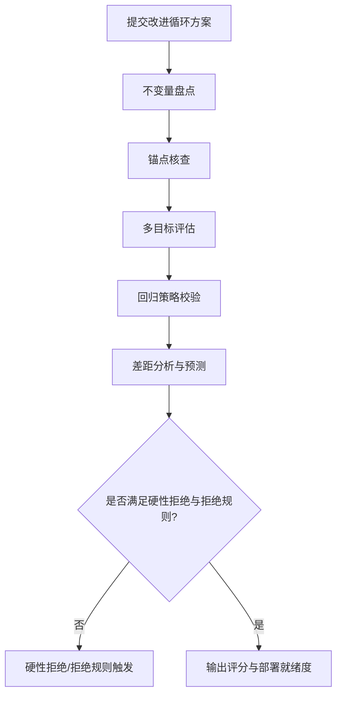
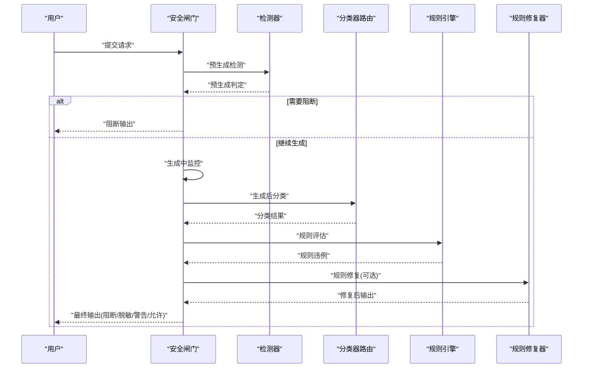
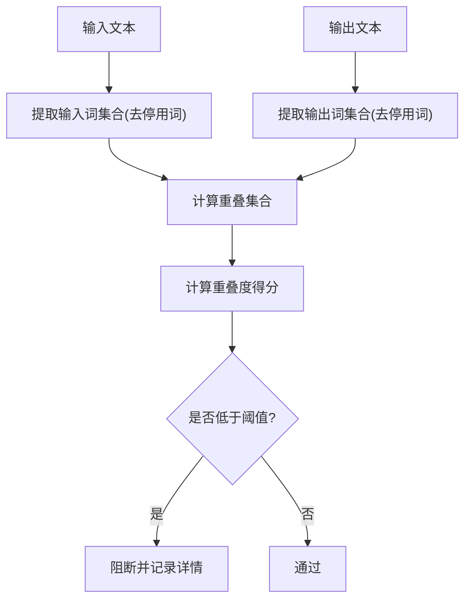
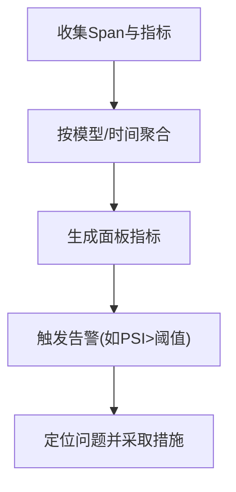
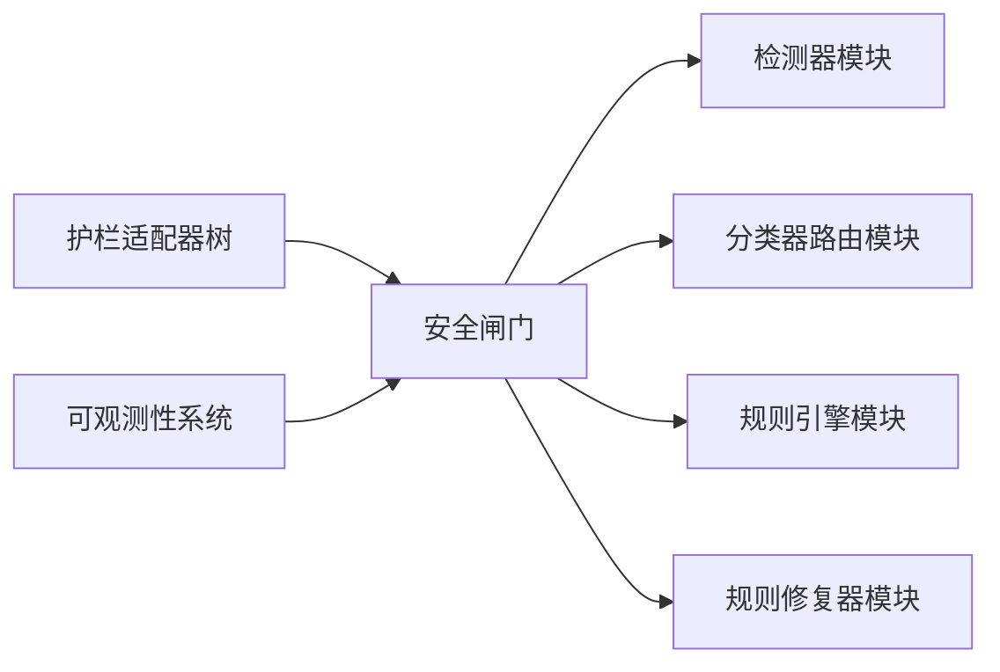

# 有界自我改进

<cite>
**本文档引用的文件**
- [skill-bounded-loop-review.md](file://phases/15-autonomous-systems/08-bounded-self-improvement/outputs/skill-bounded-loop-review.md)
- [skill-bounded-loop-review.zh.md](file://phases/15-autonomous-systems/08-bounded-self-improvement/outputs/skill-bounded-loop-review.zh.md)
- [skill-rsi-cycle-pause-spec.md](file://phases/15-autonomous-systems/07-recursive-self-improvement/outputs/skill-rsi-cycle-pause-spec.md)
- [skill-rsi-cycle-pause-spec.zh.md](file://phases/15-autonomous-systems/07-recursive-self-improvement/outputs/skill-rsi-cycle-pause-spec.zh.md)
- [safety_gate.py](file://phases/19-capstone-projects/87-end-to-end-safety-gate/code/safety_gate.py)
- [relevance.py](file://guardrails-sandbox/backend/adapters/relevance.py)
- [AdapterTree.vue](file://guardrails-sandbox/frontend/src/components/AdapterTree.vue)
- [data.js](file://site/data.js)
- [figures-frontier.js](file://site/figures-frontier.js)
- [figures-agents-alignment.js](file://site/figures-agents-alignment.js)
- [server.ts](file://phases/19-capstone-projects/11-llm-observability-dashboard/code/ts/src/server.ts)
- [main.py](file://phases/19-capstone-projects/11-llm-observability-dashboard/code/main.py)
</cite>

## 目录
1. [引言](#引言)
2. [项目结构](#项目结构)
3. [核心组件](#核心组件)
4. [架构总览](#架构总览)
5. [详细组件分析](#详细组件分析)
6. [依赖关系分析](#依赖关系分析)
7. [性能考量](#性能考量)
8. [故障排查指南](#故障排查指南)
9. [结论](#结论)
10. [附录](#附录)

## 引言
本文件围绕“有界自我改进”系统，系统化阐述在确保安全的前提下实现智能体自我改进的方法与策略。文档以仓库中已有的“有界自我改进”和“递归自我改进”的技能规范为基础，结合安全闸门、规则引擎、相关性适配器、可观测性仪表盘等组件，给出理论与实践的双重支撑：包括改进范围限制、安全边界、质量保证、监控审计与干预机制，并强调在能力提升与安全控制之间取得平衡的重要性。

## 项目结构
本项目在多个阶段与实战项目中提供了与“有界自我改进”相关的材料与实现：
- 自主系统阶段：提供“递归自我改进暂停规范”和“有界自我改进循环审计”的技能规范文档，明确改进循环的边界原语与暂停触发条件。
- 安全与护栏阶段：提供端到端安全闸门，覆盖预生成、生成中、生成后的三层防护与动作聚合。
- 护栏沙箱：提供多种适配器（如相关性检查）与前端可视化组件，帮助理解护栏层次与作用。
- 可观测性：提供LLM可观测性仪表盘与告警逻辑，支持漂移检测与回归预警。

**图表来源**
- [skill-rsi-cycle-pause-spec.md:1-40](file://phases/15-autonomous-systems/07-recursive-self-improvement/outputs/skill-rsi-cycle-pause-spec.md#L1-L40)
- [skill-bounded-loop-review.md:1-40](file://phases/15-autonomous-systems/08-bounded-self-improvement/outputs/skill-bounded-loop-review.md#L1-L40)
- [safety_gate.py:1-247](file://phases/19-capstone-projects/87-end-to-end-safety-gate/code/safety_gate.py#L1-L247)
- [relevance.py:35-69](file://guardrails-sandbox/backend/adapters/relevance.py#L35-L69)
- [AdapterTree.vue:88-98](file://guardrails-sandbox/frontend/src/components/AdapterTree.vue#L88-L98)
- [server.ts:44-73](file://phases/19-capstone-projects/11-llm-observability-dashboard/code/ts/src/server.ts#L44-L73)
- [main.py:238-257](file://phases/19-capstone-projects/11-llm-observability-dashboard/code/main.py#L238-L257)

**章节来源**
- [data.js:1800-1808](file://site/data.js#L1800-L1808)
- [data.js:4703-4718](file://site/data.js#L4703-L4718)

## 核心组件
- 递归自我改进暂停规范：定义循环级阈值、周期间增量限制、不对齐差距、回归监控与人类恢复契约，确保在关键节点暂停并接受人工审查。
- 有界自我改进循环审计：以四个边界原语（不变量、锚点、多目标、回归检测）对改进循环进行评分与差距分析，提出硬性拒绝与拒绝规则。
- 端到端安全闸门：在预生成、生成中、生成后三个阶段分别进行检测与聚合，决定阻断、脱敏或警告等动作，并保留完整的请求轨迹。
- 相关性适配器：衡量输出与输入的相关性，作为护栏的一部分，避免无关或漂移输出。
- 护栏适配器树：对护栏各层级的作用与覆盖范围进行说明，帮助理解从输入到输出的全链路安全防护。
- LLM可观测性仪表盘：提供吞吐、成本、延迟、错误率等指标的聚合视图，并内置漂移检测与告警逻辑。

**章节来源**
- [skill-rsi-cycle-pause-spec.md:10-39](file://phases/15-autonomous-systems/07-recursive-self-improvement/outputs/skill-rsi-cycle-pause-spec.md#L10-L39)
- [skill-bounded-loop-review.md:10-39](file://phases/15-autonomous-systems/08-bounded-self-improvement/outputs/skill-bounded-loop-review.md#L10-L39)
- [safety_gate.py:104-233](file://phases/19-capstone-projects/87-end-to-end-safety-gate/code/safety_gate.py#L104-L233)
- [relevance.py:35-69](file://guardrails-sandbox/backend/adapters/relevance.py#L35-L69)
- [AdapterTree.vue:88-98](file://guardrails-sandbox/frontend/src/components/AdapterTree.vue#L88-L98)
- [server.ts:44-73](file://phases/19-capstone-projects/11-llm-observability-dashboard/code/ts/src/server.ts#L44-L73)
- [main.py:238-257](file://phases/19-capstone-projects/11-llm-observability-dashboard/code/main.py#L238-L257)

## 架构总览
下图展示了“有界自我改进”系统的关键交互：改进循环在每次迭代前后通过安全闸门进行审核，同时借助护栏适配器与可观测性系统进行质量与安全保障。

**图表来源**
- [safety_gate.py:117-233](file://phases/19-capstone-projects/87-end-to-end-safety-gate/code/safety_gate.py#L117-L233)
- [relevance.py:35-69](file://guardrails-sandbox/backend/adapters/relevance.py#L35-L69)
- [server.ts:44-73](file://phases/19-capstone-projects/11-llm-observability-dashboard/code/ts/src/server.ts#L44-L73)
- [main.py:238-257](file://phases/19-capstone-projects/11-llm-observability-dashboard/code/main.py#L238-L257)

## 详细组件分析

### 递归自我改进暂停规范
该规范为RSI流水线提供明确的暂停条件与阈值，确保在能力突增、不对齐扩大或回归风险出现时及时暂停并进行人工审查。关键点包括：
- 循环级阈值：针对能力、对齐、预算、轨迹长度、资源使用等轴设定阈值。
- 周期间增量限制：限制单次循环的剧烈变化，防范评估器博弈。
- 不对齐差距：能力减去对齐的差距扩大即触发暂停。
- 回归监控：任一轴在单次循环中显著下降即暂停。
- 人类恢复契约：暂停后需经指定人员审查并记录决策。

**图表来源**
- [skill-rsi-cycle-pause-spec.md:14-18](file://phases/15-autonomous-systems/07-recursive-self-improvement/outputs/skill-rsi-cycle-pause-spec.md#L14-L18)

**章节来源**
- [skill-rsi-cycle-pause-spec.md:10-39](file://phases/15-autonomous-systems/07-recursive-self-improvement/outputs/skill-rsi-cycle-pause-spec.md#L10-L39)
- [skill-rsi-cycle-pause-spec.zh.md:10-39](file://phases/15-autonomous-systems/07-recursive-self-improvement/outputs/skill-rsi-cycle-pause-spec.zh.md#L10-L39)

### 有界自我改进循环审计
该审计以四个边界原语为核心，对改进循环进行评分与差距分析：
- 不变量清单：明确检查对象、检查位置与违规处置方式。
- 锚点识别：对齐锚点应位于编辑面之外，且不可被循环修改。
- 多目标维度：安全、公平、鲁棒性与性能并重。
- 回归策略：使用外部比较集而非仅内部历史，设定历史窗口与容差。

**图表来源**
- [skill-bounded-loop-review.md:14-18](file://phases/15-autonomous-systems/08-bounded-self-improvement/outputs/skill-bounded-loop-review.md#L14-L18)

**章节来源**
- [skill-bounded-loop-review.md:10-39](file://phases/15-autonomous-systems/08-bounded-self-improvement/outputs/skill-bounded-loop-review.md#L10-L39)
- [skill-bounded-loop-review.zh.md:10-39](file://phases/15-autonomous-systems/08-bounded-self-improvement/outputs/skill-bounded-loop-review.zh.md#L10-L39)

### 端到端安全闸门
安全闸门在请求生命周期内分三个阶段进行检测与动作聚合：
- 预生成：检测恶意或越权提示，必要时直接阻断。
- 生成中：监控早期终止模式，避免危险指令被完整生成。
- 生成后：分类器与规则引擎共同评估输出，必要时进行脱敏或警告。
- 动作聚合：根据信号严重等级确定最终动作（阻断/脱敏/警告/允许）。
- 请求轨迹：保留完整的审计轨迹，便于回溯与复盘。

**图表来源**
- [safety_gate.py:117-233](file://phases/19-capstone-projects/87-end-to-end-safety-gate/code/safety_gate.py#L117-L233)

**章节来源**
- [safety_gate.py:1-247](file://phases/19-capstone-projects/87-end-to-end-safety-gate/code/safety_gate.py#L1-L247)

### 相关性适配器与护栏可视化
- 相关性适配器：通过输入与输出的词汇重叠度计算得分，低于阈值则视为不相关并阻断，同时记录细节与置信度。
- 护栏适配器树：对护栏基础层、提示工程、少样本与思维链、结构化输出、RAG、缓存与成本等组别进行说明，帮助理解全链路安全覆盖。

**图表来源**
- [relevance.py:35-69](file://guardrails-sandbox/backend/adapters/relevance.py#L35-L69)

**章节来源**
- [relevance.py:35-69](file://guardrails-sandbox/backend/adapters/relevance.py#L35-L69)
- [AdapterTree.vue:88-98](file://guardrails-sandbox/frontend/src/components/AdapterTree.vue#L88-L98)

### 可观测性与漂移检测
- 指标聚合：统计吞吐、错误、Token用量、成本、延迟等关键指标，形成仪表盘视图。
- 告警与漂移：通过PSI等指标监测分布漂移，及时发现性能退化或回归风险。

**图表来源**
- [server.ts:44-73](file://phases/19-capstone-projects/11-llm-observability-dashboard/code/ts/src/server.ts#L44-L73)
- [main.py:238-257](file://phases/19-capstone-projects/11-llm-observability-dashboard/code/main.py#L238-L257)

**章节来源**
- [server.ts:44-73](file://phases/19-capstone-projects/11-llm-observability-dashboard/code/ts/src/server.ts#L44-L73)
- [main.py:238-257](file://phases/19-capstone-projects/11-llm-observability-dashboard/code/main.py#L238-L257)

## 依赖关系分析
- 安全闸门模块依赖检测器、分类器路由、规则引擎与修复器模块，通过导入子课程目录实现端到端演示。
- 护栏适配器树组件提供护栏分层说明，辅助理解各适配器职责。
- 可观测性系统独立运行，但与安全闸门输出的轨迹与指标形成闭环，支撑持续监控与回归检测。

**图表来源**
- [safety_gate.py:27-53](file://phases/19-capstone-projects/87-end-to-end-safety-gate/code/safety_gate.py#L27-L53)
- [AdapterTree.vue:88-98](file://guardrails-sandbox/frontend/src/components/AdapterTree.vue#L88-L98)
- [server.ts:44-73](file://phases/19-capstone-projects/11-llm-observability-dashboard/code/ts/src/server.ts#L44-L73)

**章节来源**
- [safety_gate.py:27-53](file://phases/19-capstone-projects/87-end-to-end-safety-gate/code/safety_gate.py#L27-L53)

## 性能考量
- 通过护栏分层与相关性检查减少无效生成，降低Token与延迟成本。
- 使用外部比较集进行回归检测，避免内部历史偏差导致的误判。
- 采用PSI等指标进行漂移检测，及早发现性能退化。
- 在改进循环中设置阈值与增量限制，避免过度探索带来的不稳定。

[本节为通用指导，不直接分析具体文件]

## 故障排查指南
- 阻断误判：检查预生成检测的置信度阈值与触发信号，必要时提高阈值以降低误杀。
- 生成中异常：关注早期终止模式匹配，若频繁误触可调整缓冲窗口与正则模式。
- 生成后违规：优先检查分类器与规则引擎的严重等级映射，确保动作聚合逻辑一致。
- 回归与漂移：通过可观测性仪表盘查看PSI与趋势，结合告警快速定位问题根因。
- 审计与复盘：利用请求轨迹中的各阶段判定与最终动作，进行回溯与改进。

**章节来源**
- [safety_gate.py:158-182](file://phases/19-capstone-projects/87-end-to-end-safety-gate/code/safety_gate.py#L158-L182)
- [main.py:242-251](file://phases/19-capstone-projects/11-llm-observability-dashboard/code/main.py#L242-L251)

## 结论
“有界自我改进”系统通过明确的边界原语与暂停规范，在能力提升与安全控制之间建立稳定平衡。结合安全闸门、护栏适配器与可观测性体系，可在生产环境中实现可控、可审计、可干预的自我改进闭环。建议在部署前完成四原语审计与暂停规范制定，并在上线后持续监控与迭代。

[本节为总结性内容，不直接分析具体文件]

## 附录
- 相关概念与可视化参考：
  - 自我反思循环与收益递减：通过可视化展示反思循环的收益曲线与停止时机。
  - 代理循环与步骤预算：强调循环的阶段性与预算控制。
  - 护栏闸门序列：输入过滤、策略检查、输出过滤的有序防护。

**章节来源**
- [figures-frontier.js:103-117](file://site/figures-frontier.js#L103-L117)
- [figures-agents-alignment.js:53-69](file://site/figures-agents-alignment.js#L53-L69)
- [figures-agents-alignment.js:366-391](file://site/figures-agents-alignment.js#L366-L391)