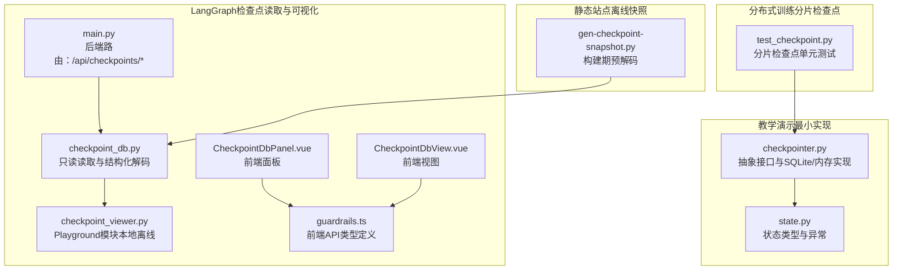
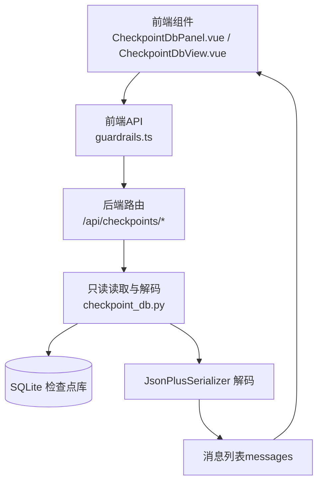
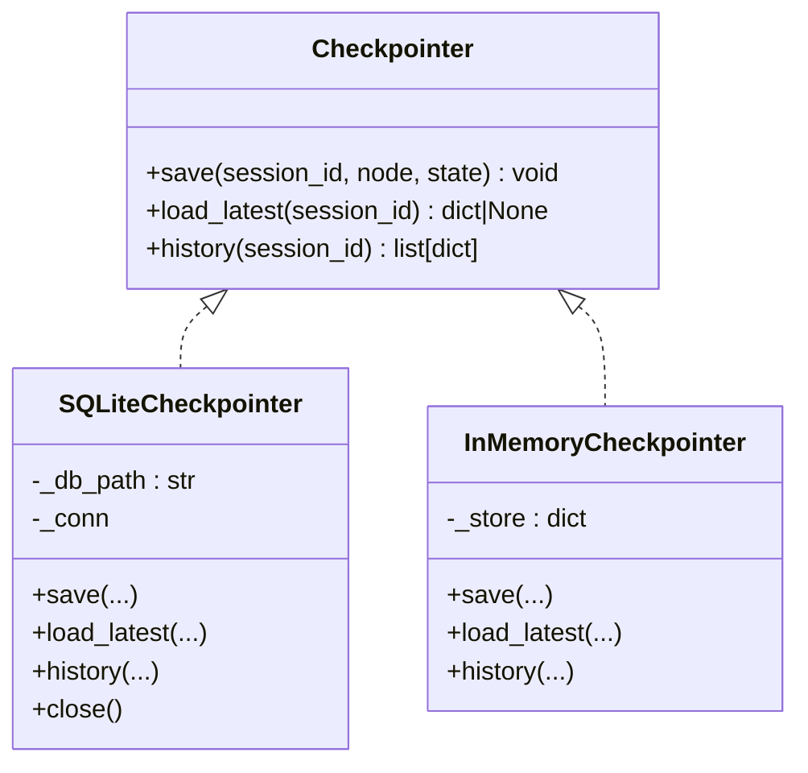
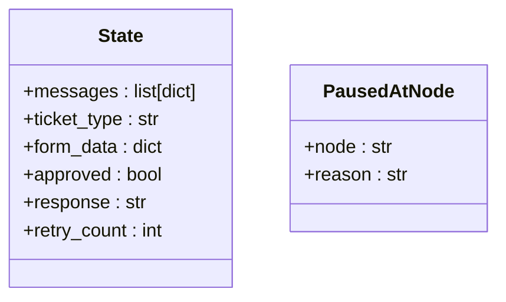
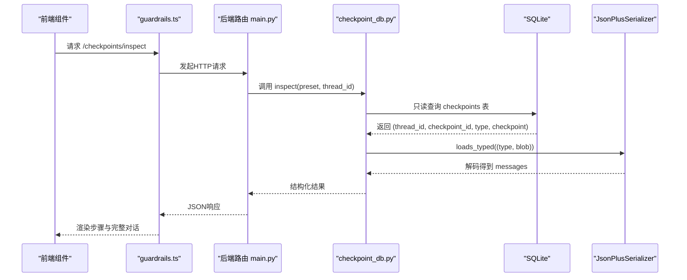
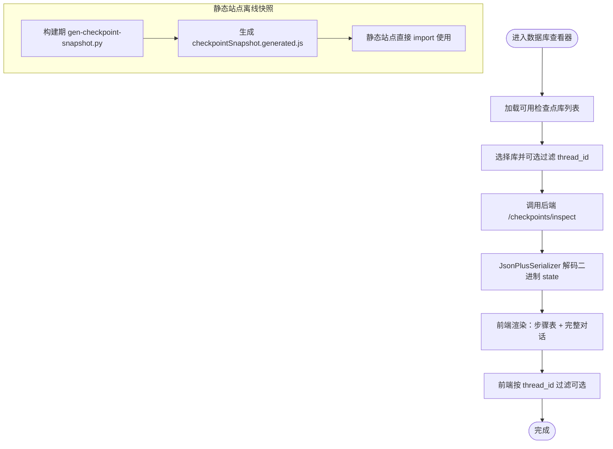
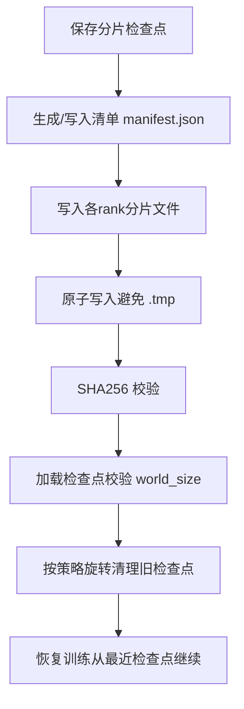
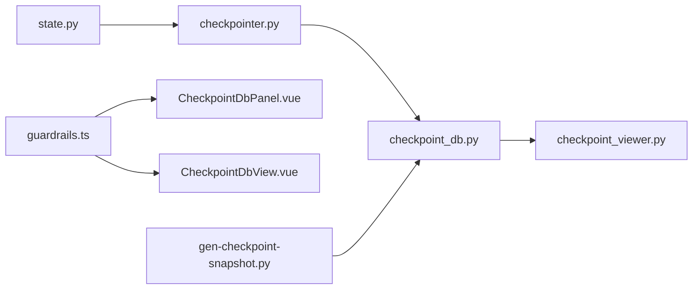

# 检查点与回滚

<cite>
**本文引用的文件**
- [checkpointer.py](file://phases/14-agent-engineering/13-langgraph-stateful-graphs/outputs/skill-demo/checkpointer.py)
- [state.py](file://phases/14-agent-engineering/13-langgraph-stateful-graphs/outputs/skill-demo/state.py)
- [checkpoint_db.py](file://guardrails-sandbox/backend/playground/checkpoint_db.py)
- [checkpoint_viewer.py](file://guardrails-sandbox/backend/playground/modules/checkpoint_viewer.py)
- [main.py](file://guardrails-sandbox/backend/main.py)
- [guardrails.ts](file://guardrails-sandbox/frontend/src/api/guardrails.ts)
- [CheckpointDbPanel.vue](file://guardrails-sandbox/frontend/src/components/CheckpointDbPanel.vue)
- [CheckpointDbView.vue](file://site/vue-app/summary/src/components/CheckpointDbView.vue)
- [gen-checkpoint-snapshot.py](file://site/vue-app/summary/scripts/gen-checkpoint-snapshot.py)
- [test_checkpoint.py](file://phases/19-capstone-projects/80-checkpoint-sharded-resume/tests/test_checkpoint.py)
</cite>

## 目录
1. [引言](#引言)
2. [项目结构](#项目结构)
3. [核心组件](#核心组件)
4. [架构总览](#架构总览)
5. [详细组件分析](#详细组件分析)
6. [依赖分析](#依赖分析)
7. [性能考虑](#性能考虑)
8. [故障排查指南](#故障排查指南)
9. [结论](#结论)
10. [附录](#附录)

## 引言
本文件围绕“检查点与回滚”主题，系统梳理并阐述智能体系统中状态保存与错误恢复的关键机制。内容覆盖：
- 检查点设计与状态快照
- 回滚策略与恢复流程
- 状态一致性保障、并发控制与性能优化
- 灾难恢复、调试支持与版本管理
- 在LangGraph生态中的落地实践（SQLite后端、JsonPlusSerializer解码、前后端可视化）

目标是帮助读者在理解抽象概念的同时，掌握可直接迁移至实际工程的实现要点与最佳实践。

## 项目结构
本仓库中与“检查点与回滚”直接相关的核心位置包括：
- 教学演示与最小实现：phases/14-agent-engineering/13-langgraph-stateful-graphs/outputs/skill-demo
- LangGraph检查点数据库读取与可视化：guardrails-sandbox/backend/playground
- 前端API与UI组件：guardrails-sandbox/frontend
- 静态站点的离线快照脚本：site/vue-app/summary/scripts
- 分布式训练场景下的分片检查点与恢复：phases/19-capstone-projects/80-checkpoint-sharded-resume

**图表来源**
- [checkpointer.py:1-153](file://phases/14-agent-engineering/13-langgraph-stateful-graphs/outputs/skill-demo/checkpointer.py#L1-L153)
- [state.py:1-93](file://phases/14-agent-engineering/13-langgraph-stateful-graphs/outputs/skill-demo/state.py#L1-L93)
- [checkpoint_db.py:1-148](file://guardrails-sandbox/backend/playground/checkpoint_db.py#L1-L148)
- [checkpoint_viewer.py:1-206](file://guardrails-sandbox/backend/playground/modules/checkpoint_viewer.py#L1-L206)
- [main.py:380-404](file://guardrails-sandbox/backend/main.py#L380-L404)
- [guardrails.ts:120-167](file://guardrails-sandbox/frontend/src/api/guardrails.ts#L120-L167)
- [CheckpointDbPanel.vue:1-52](file://guardrails-sandbox/frontend/src/components/CheckpointDbPanel.vue#L1-L52)
- [CheckpointDbView.vue:28-74](file://site/vue-app/summary/src/components/CheckpointDbView.vue#L28-L74)
- [gen-checkpoint-snapshot.py:1-58](file://site/vue-app/summary/scripts/gen-checkpoint-snapshot.py#L1-L58)
- [test_checkpoint.py:1-90](file://phases/19-capstone-projects/80-checkpoint-sharded-resume/tests/test_checkpoint.py#L1-L90)

**章节来源**
- [checkpointer.py:1-153](file://phases/14-agent-engineering/13-langgraph-stateful-graphs/outputs/skill-demo/checkpointer.py#L1-L153)
- [checkpoint_db.py:1-148](file://guardrails-sandbox/backend/playground/checkpoint_db.py#L1-L148)
- [checkpoint_viewer.py:1-206](file://guardrails-sandbox/backend/playground/modules/checkpoint_viewer.py#L1-L206)
- [main.py:380-404](file://guardrails-sandbox/backend/main.py#L380-L404)
- [guardrails.ts:120-167](file://guardrails-sandbox/frontend/src/api/guardrails.ts#L120-L167)
- [CheckpointDbPanel.vue:1-52](file://guardrails-sandbox/frontend/src/components/CheckpointDbPanel.vue#L1-L52)
- [CheckpointDbView.vue:28-74](file://site/vue-app/summary/src/components/CheckpointDbView.vue#L28-L74)
- [gen-checkpoint-snapshot.py:1-58](file://site/vue-app/summary/scripts/gen-checkpoint-snapshot.py#L1-L58)
- [test_checkpoint.py:1-90](file://phases/19-capstone-projects/80-checkpoint-sharded-resume/tests/test_checkpoint.py#L1-L90)

## 核心组件
- 检查点抽象与实现
  - 抽象接口：统一save/load_latest/history规范，要求完整序列化状态并追加历史。
  - SQLite实现：WAL模式、索引、事务提交，支持生产与测试。
  - 内存实现：仅用于单元测试与快速实验。
- 状态模型
  - 使用TypedDict定义状态字段，明确messages、ticket_type、form_data、approved、response、retry_count等。
  - 异常PausedAtNode用于节点暂停并触发保存检查点。
- LangGraph检查点读取与可视化
  - 后端只读打开数据库，校验表结构，使用JsonPlusSerializer解码二进制state为消息列表。
  - 前端提供API类型、面板与视图组件，支持按thread过滤与离线快照。

**章节来源**
- [checkpointer.py:20-153](file://phases/14-agent-engineering/13-langgraph-stateful-graphs/outputs/skill-demo/checkpointer.py#L20-L153)
- [state.py:15-93](file://phases/14-agent-engineering/13-langgraph-stateful-graphs/outputs/skill-demo/state.py#L15-L93)
- [checkpoint_db.py:86-148](file://guardrails-sandbox/backend/playground/checkpoint_db.py#L86-L148)
- [checkpoint_viewer.py:82-206](file://guardrails-sandbox/backend/playground/modules/checkpoint_viewer.py#L82-L206)
- [guardrails.ts:120-167](file://guardrails-sandbox/frontend/src/api/guardrails.ts#L120-L167)

## 架构总览
整体架构分为三层：
- 数据层：SQLite（教学演示）或LangGraph SqliteSaver（真实落库）。
- 服务层：后端路由负责只读读取与解码，返回结构化结果。
- 展示层：前端组件渲染检查点步骤、完整对话与thread过滤；静态站点通过构建期脚本生成离线快照。

**图表来源**
- [main.py:389-403](file://guardrails-sandbox/backend/main.py#L389-L403)
- [checkpoint_db.py:86-148](file://guardrails-sandbox/backend/playground/checkpoint_db.py#L86-L148)
- [guardrails.ts:155-167](file://guardrails-sandbox/frontend/src/api/guardrails.ts#L155-L167)
- [CheckpointDbPanel.vue:35-52](file://guardrails-sandbox/frontend/src/components/CheckpointDbPanel.vue#L35-L52)
- [CheckpointDbView.vue:28-74](file://site/vue-app/summary/src/components/CheckpointDbView.vue#L28-L74)

## 详细组件分析

### 组件A：检查点抽象与实现（SQLite/内存）
- 设计要点
  - 接口契约：save追加历史、load_latest返回最新、history返回有序历史。
  - SQLite实现采用WAL模式提升并发写入稳定性；建立复合索引加速查询。
  - 内存实现便于单元测试，不保证持久性。
- 关键流程
  - 保存：序列化状态为JSON，插入记录并提交事务。
  - 加载：按session_id降序取第一条，或返回全部历史。
  - 关闭：释放连接资源。

**图表来源**
- [checkpointer.py:20-153](file://phases/14-agent-engineering/13-langgraph-stateful-graphs/outputs/skill-demo/checkpointer.py#L20-L153)

**章节来源**
- [checkpointer.py:47-118](file://phases/14-agent-engineering/13-langgraph-stateful-graphs/outputs/skill-demo/checkpointer.py#L47-L118)
- [checkpointer.py:125-153](file://phases/14-agent-engineering/13-langgraph-stateful-graphs/outputs/skill-demo/checkpointer.py#L125-L153)

### 组件B：状态模型与异常
- 状态字段
  - messages：对话历史，每条包含role/content等。
  - ticket_type：工单类型分类。
  - form_data：业务表单数据。
  - approved：人工审批标记。
  - response：最终回复内容。
  - retry_count：重试计数，用于限流与防环。
- 异常PausedAtNode
  - 节点暂停时抛出，触发保存检查点并停止执行，后续可通过resume携带state_override恢复。

**图表来源**
- [state.py:15-93](file://phases/14-agent-engineering/13-langgraph-stateful-graphs/outputs/skill-demo/state.py#L15-L93)

**章节来源**
- [state.py:15-54](file://phases/14-agent-engineering/13-langgraph-stateful-graphs/outputs/skill-demo/state.py#L15-L54)
- [state.py:82-93](file://phases/14-agent-engineering/13-langgraph-stateful-graphs/outputs/skill-demo/state.py#L82-L93)

### 组件C：LangGraph检查点读取与可视化（后端）
- 安全与合规
  - 只读打开（mode=ro），限制在DATA_DIR内，避免目录穿越。
  - 校验表结构（checkpoints表），缺失则报错。
- 解码流程
  - 使用JsonPlusSerializer对二进制state进行typed loads，提取messages通道。
  - 支持按thread_id过滤，按checkpoint_id排序。
- 结果组织
  - 返回每步的thread_id、checkpoint_id、消息数量、最后消息摘要、完整对话等。

**图表来源**
- [main.py:395-403](file://guardrails-sandbox/backend/main.py#L395-L403)
- [checkpoint_db.py:86-148](file://guardrails-sandbox/backend/playground/checkpoint_db.py#L86-L148)
- [guardrails.ts:159-167](file://guardrails-sandbox/frontend/src/api/guardrails.ts#L159-L167)

**章节来源**
- [checkpoint_db.py:86-148](file://guardrails-sandbox/backend/playground/checkpoint_db.py#L86-L148)
- [checkpoint_viewer.py:82-206](file://guardrails-sandbox/backend/playground/modules/checkpoint_viewer.py#L82-L206)
- [main.py:389-403](file://guardrails-sandbox/backend/main.py#L389-L403)

### 组件D：前端交互与离线快照
- 前端组件
  - CheckpointDbPanel.vue：加载数据库列表、发起检查点查看请求、处理错误与loading。
  - CheckpointDbView.vue：在前端对thread进行过滤，计算完整对话，渲染表格与消息。
- 离线快照
  - gen-checkpoint-snapshot.py在构建期读取demo库，使用JsonPlusSerializer解码并导出静态JS模块，供静态站点直接导入使用，无需后端。

**图表来源**
- [CheckpointDbPanel.vue:35-52](file://guardrails-sandbox/frontend/src/components/CheckpointDbPanel.vue#L35-L52)
- [CheckpointDbView.vue:28-74](file://site/vue-app/summary/src/components/CheckpointDbView.vue#L28-L74)
- [gen-checkpoint-snapshot.py:27-58](file://site/vue-app/summary/scripts/gen-checkpoint-snapshot.py#L27-L58)

**章节来源**
- [CheckpointDbPanel.vue:1-52](file://guardrails-sandbox/frontend/src/components/CheckpointDbPanel.vue#L1-L52)
- [CheckpointDbView.vue:28-74](file://site/vue-app/summary/src/components/CheckpointDbView.vue#L28-L74)
- [gen-checkpoint-snapshot.py:1-58](file://site/vue-app/summary/scripts/gen-checkpoint-snapshot.py#L1-L58)

### 组件E：分布式训练场景下的分片检查点与恢复
- 测试覆盖
  - 保存/加载往返一致性校验（张量相等）。
  - world_size不匹配拒绝加载。
  - SHA256校验篡改检测。
  - 原子写入不产生临时文件。
  - Manifest JSON往返序列化。
  - 旋转清理保留最近K个检查点。
- 实践启示
  - 分片检查点需要严格的清单（manifest）与完整性校验。
  - 原子写入与失败模式防御是高可用训练的关键。

**图表来源**
- [test_checkpoint.py:27-90](file://phases/19-capstone-projects/80-checkpoint-sharded-resume/tests/test_checkpoint.py#L27-L90)

**章节来源**
- [test_checkpoint.py:1-90](file://phases/19-capstone-projects/80-checkpoint-sharded-resume/tests/test_checkpoint.py#L1-L90)

## 依赖分析
- 组件耦合
  - checkpointer.py与state.py低耦合：前者仅依赖后者提供的状态类型，便于替换实现。
  - 后端checkpoint_db.py与Playground模块相互配合，共同完成只读读取与解码。
  - 前端guardrails.ts与UI组件形成清晰的接口契约，便于扩展其他检查点库。
- 外部依赖
  - LangGraph的JsonPlusSerializer用于解码二进制state。
  - SQLite WAL模式与索引提升并发与查询效率。
- 循环依赖
  - 未发现循环依赖；模块职责清晰，接口边界明确。

**图表来源**
- [checkpointer.py:1-153](file://phases/14-agent-engineering/13-langgraph-stateful-graphs/outputs/skill-demo/checkpointer.py#L1-L153)
- [state.py:1-93](file://phases/14-agent-engineering/13-langgraph-stateful-graphs/outputs/skill-demo/state.py#L1-L93)
- [checkpoint_db.py:1-148](file://guardrails-sandbox/backend/playground/checkpoint_db.py#L1-L148)
- [checkpoint_viewer.py:1-206](file://guardrails-sandbox/backend/playground/modules/checkpoint_viewer.py#L1-L206)
- [guardrails.ts:120-167](file://guardrails-sandbox/frontend/src/api/guardrails.ts#L120-L167)
- [CheckpointDbPanel.vue:1-52](file://guardrails-sandbox/frontend/src/components/CheckpointDbPanel.vue#L1-L52)
- [CheckpointDbView.vue:28-74](file://site/vue-app/summary/src/components/CheckpointDbView.vue#L28-L74)
- [gen-checkpoint-snapshot.py:1-58](file://site/vue-app/summary/scripts/gen-checkpoint-snapshot.py#L1-L58)

**章节来源**
- [checkpointer.py:1-153](file://phases/14-agent-engineering/13-langgraph-stateful-graphs/outputs/skill-demo/checkpointer.py#L1-L153)
- [checkpoint_db.py:1-148](file://guardrails-sandbox/backend/playground/checkpoint_db.py#L1-L148)
- [checkpoint_viewer.py:1-206](file://guardrails-sandbox/backend/playground/modules/checkpoint_viewer.py#L1-L206)
- [guardrails.ts:120-167](file://guardrails-sandbox/frontend/src/api/guardrails.ts#L120-L167)

## 性能考虑
- 存储与并发
  - SQLite采用WAL模式，减少写入阻塞，提升并发写入吞吐。
  - 为session_id+id建立索引，加速按会话查询与排序。
- 序列化与I/O
  - 状态以JSON字符串存储，简单可靠；对于大对象建议分表或外部化存储。
  - LangGraph场景使用JsonPlusSerializer解码二进制state，避免重复序列化开销。
- 前端渲染
  - 静态站点通过构建期快照减少运行时I/O与解码压力。
  - 前端thread过滤在内存完成，降低后端负载。
- 分布式训练
  - 分片检查点按rank写入，避免单点瓶颈；原子写入与清单校验确保一致性。

[本节为通用指导，无需特定文件引用]

## 故障排查指南
- 常见问题与定位
  - 无法打开数据库：确认只读模式与路径合法性，检查DATA_DIR限制。
  - 缺少checkpoints表：确认是否为LangGraph SQLite库，或是否正确初始化。
  - 解码失败：检查JsonPlusSerializer可用性与二进制格式兼容性。
  - thread_id过滤无结果：确认是否存在该thread或输入是否正确。
- 错误处理
  - 后端路由捕获ValueError/FileNotFoundError并返回结构化错误信息。
  - 前端组件捕获异常并展示错误提示，支持重试与日志上报。
- 分片检查点
  - world_size不匹配：检查分布式配置与清单一致。
  - SHA256不一致：排查文件被篡改或传输损坏。
  - 临时文件残留：检查原子写入逻辑与权限。

**章节来源**
- [checkpoint_db.py:86-148](file://guardrails-sandbox/backend/playground/checkpoint_db.py#L86-L148)
- [main.py:395-403](file://guardrails-sandbox/backend/main.py#L395-L403)
- [CheckpointDbPanel.vue:35-52](file://guardrails-sandbox/frontend/src/components/CheckpointDbPanel.vue#L35-L52)
- [test_checkpoint.py:43-57](file://phases/19-capstone-projects/80-checkpoint-sharded-resume/tests/test_checkpoint.py#L43-L57)

## 结论
检查点与回滚是保障智能体系统可靠性与可运维性的关键手段。通过抽象化的检查点接口、严谨的序列化与只读解码、完善的前端可视化与离线快照，以及分片检查点与原子写入等工程实践，能够在复杂场景下实现：
- 快速恢复与持续运行
- 可追溯的调试与审计
- 高并发与高性能的数据访问
- 面向生产的灾难恢复与版本演进

建议在实际项目中结合自身数据规模与一致性需求，选择合适的后端（SQLite/Postgres/Redis）与序列化方案，并配套完善的安全与监控机制。

[本节为总结性内容，无需特定文件引用]

## 附录
- 关键实现路径参考
  - 检查点接口与实现：[checkpointer.py:20-153](file://phases/14-agent-engineering/13-langgraph-stateful-graphs/outputs/skill-demo/checkpointer.py#L20-L153)
  - 状态模型与异常：[state.py:15-93](file://phases/14-agent-engineering/13-langgraph-stateful-graphs/outputs/skill-demo/state.py#L15-L93)
  - LangGraph检查点读取与解码：[checkpoint_db.py:86-148](file://guardrails-sandbox/backend/playground/checkpoint_db.py#L86-L148)
  - Playground模块（本地离线）：[checkpoint_viewer.py:82-206](file://guardrails-sandbox/backend/playground/modules/checkpoint_viewer.py#L82-L206)
  - 后端路由与API：[main.py:389-403](file://guardrails-sandbox/backend/main.py#L389-L403)、[guardrails.ts:155-167](file://guardrails-sandbox/frontend/src/api/guardrails.ts#L155-L167)
  - 前端组件与离线快照：[CheckpointDbPanel.vue:35-52](file://guardrails-sandbox/frontend/src/components/CheckpointDbPanel.vue#L35-L52)、[CheckpointDbView.vue:28-74](file://site/vue-app/summary/src/components/CheckpointDbView.vue#L28-L74)、[gen-checkpoint-snapshot.py:27-58](file://site/vue-app/summary/scripts/gen-checkpoint-snapshot.py#L27-L58)
  - 分片检查点测试：[test_checkpoint.py:1-90](file://phases/19-capstone-projects/80-checkpoint-sharded-resume/tests/test_checkpoint.py#L1-L90)