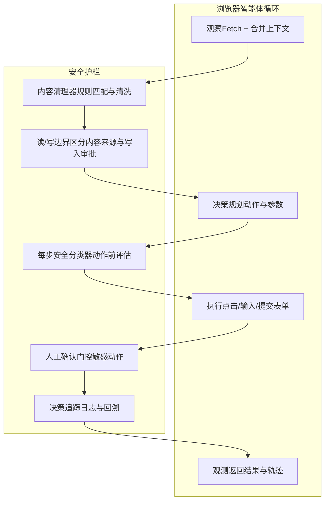
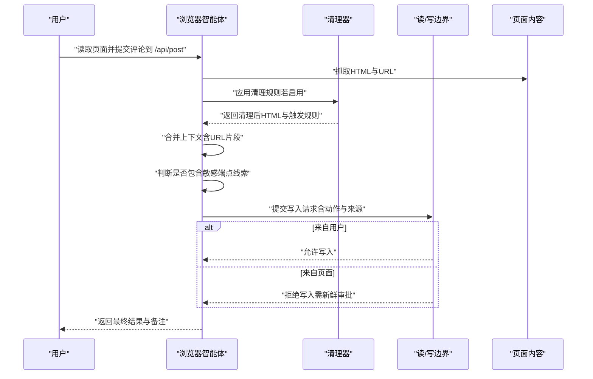
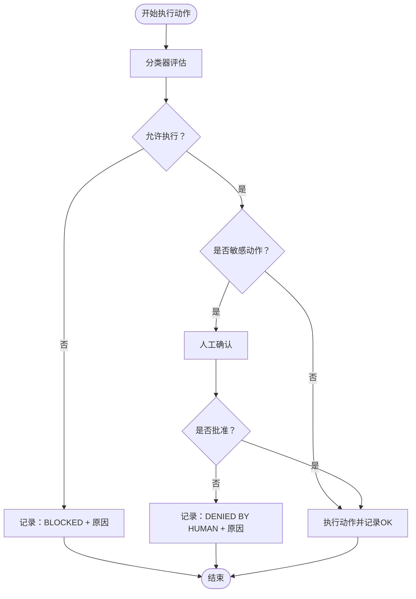
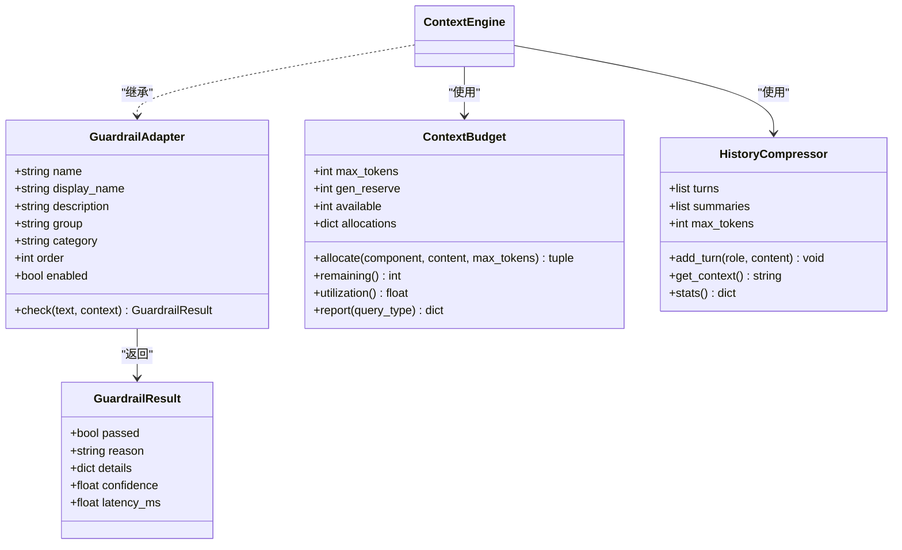
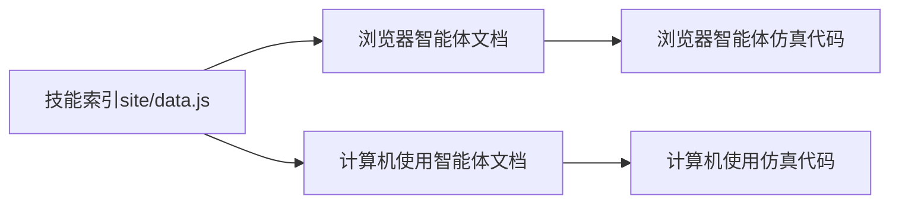

# 浏览器智能体

<cite>
**本文档引用的文件**
- [phases/15-autonomous-systems/11-browser-agents/docs/zh.md](file://phases/15-autonomous-systems/11-browser-agents/docs/zh.md)
- [phases/15-autonomous-systems/11-browser-agents/outputs/skill-browser-agent-trust-boundary.md](file://phases/15-autonomous-systems/11-browser-agents/outputs/skill-browser-agent-trust-boundary.md)
- [phases/15-autonomous-systems/11-browser-agents/code/main.py](file://phases/15-autonomous-systems/11-browser-agents/code/main.py)
- [phases/14-agent-engineering/21-computer-use-agents/docs/zh.md](file://phases/14-agent-engineering/21-computer-use-agents/docs/zh.md)
- [phases/14-agent-engineering/21-computer-use-agents/outputs/skill-computer-use-safety.md](file://phases/14-agent-engineering/21-computer-use-agents/outputs/skill-computer-use-safety.md)
- [phases/14-agent-engineering/21-computer-use-agents/code/main.py](file://phases/14-agent-engineering/21-computer-use-agents/code/main.py)
- [site/data.js](file://site/data.js)
- [guardrails-sandbox/backend/adapters/base.py](file://guardrails-sandbox/backend/adapters/base.py)
- [guardrails-sandbox/backend/adapters/context_engine.py](file://guardrails-sandbox/backend/adapters/context_engine.py)
</cite>

## 目录
1. [引言](#引言)
2. [项目结构](#项目结构)
3. [核心组件](#核心组件)
4. [架构总览](#架构总览)
5. [详细组件分析](#详细组件分析)
6. [依赖关系分析](#依赖关系分析)
7. [性能考量](#性能考量)
8. [故障排查指南](#故障排查指南)
9. [结论](#结论)
10. [附录](#附录)

## 引言
本文件围绕“浏览器智能体”主题，系统化梳理能够在网页环境中自主执行任务的智能体系统设计与实现要点。文档结合仓库中的实战代码与教学材料，重点覆盖以下方面：
- 浏览器智能体的攻击面与安全边界建模
- 读/写边界、内容清理器、每步安全分类器、人工确认门控等防御机制
- 在网页浏览、信息提取、表单填写、点击操作等典型任务中的应用
- 浏览器兼容性、反爬虫与用户体验优化策略
- 自动化任务与信息获取的实用价值与落地建议

## 项目结构
本仓库中与浏览器智能体直接相关的内容主要分布在以下路径：
- 浏览器智能体学习与实践
  - 教学文档与作业产出：phases/15-autonomous-systems/11-browser-agents
  - 实战代码：phases/15-autonomous-systems/11-browser-agents/code/main.py
- 计算机使用智能体（视觉+键盘/鼠标）的安全框架
  - 教学文档与作业产出：phases/14-agent-engineering/21-computer-use-agents
  - 实战代码：phases/14-agent-engineering/21-computer-use-agents/code/main.py
- 安全护栏（Guardrails）基础组件
  - 基类与通用接口：guardrails-sandbox/backend/adapters/base.py
  - 上下文预算与中间丢失分析：guardrails-sandbox/backend/adapters/context_engine.py
- 课程与技能索引
  - site/data.js 中包含浏览器智能体相关技能标签与课程路径

```mermaid
graph TB
subgraph "浏览器智能体教学与实践"
BA_Doc["浏览器智能体文档<br/>phases/15-autonomous-systems/11-browser-agents/docs/zh.md"]
BA_Code["浏览器智能体仿真代码<br/>phases/15-autonomous-systems/11-browser-agents/code/main.py"]
BA_Skill["信任边界作业产出<br/>phases/15-autonomous-systems/11-browser-agents/outputs/skill-browser-agent-trust-boundary.md"]
end
subgraph "计算机使用智能体视觉+安全"
CU_Doc["计算机使用智能体文档<br/>phases/14-agent-engineering/21-computer-use-agents/docs/zh.md"]
CU_Code["计算机使用仿真代码<br/>phases/14-agent-engineering/21-computer-use-agents/code/main.py"]
CU_Skill["安全框架作业产出<br/>phases/14-agent-engineering/21-computer-use-agents/outputs/skill-computer-use-safety.md"]
end
subgraph "安全护栏基础"
GA_Base["Guardrail 基类<br/>guardrails-sandbox/backend/adapters/base.py"]
GA_Ctx["上下文预算与中间丢失分析<br/>guardrails-sandbox/backend/adapters/context_engine.py"]
end
BA_Doc --> BA_Code
BA_Code --> BA_Skill
CU_Doc --> CU_Code
CU_Code --> CU_Skill
GA_Base --> GA_Ctx
```

**图表来源**
- [phases/15-autonomous-systems/11-browser-agents/docs/zh.md](file://phases/15-autonomous-systems/11-browser-agents/docs/zh.md)
- [phases/15-autonomous-systems/11-browser-agents/code/main.py](file://phases/15-autonomous-systems/11-browser-agents/code/main.py)
- [phases/15-autonomous-systems/11-browser-agents/outputs/skill-browser-agent-trust-boundary.md](file://phases/15-autonomous-systems/11-browser-agents/outputs/skill-browser-agent-trust-boundary.md)
- [phases/14-agent-engineering/21-computer-use-agents/docs/zh.md](file://phases/14-agent-engineering/21-computer-use-agents/docs/zh.md)
- [phases/14-agent-engineering/21-computer-use-agents/code/main.py](file://phases/14-agent-engineering/21-computer-use-agents/code/main.py)
- [phases/14-agent-engineering/21-computer-use-agents/outputs/skill-computer-use-safety.md](file://phases/14-agent-engineering/21-computer-use-agents/outputs/skill-computer-use-safety.md)
- [guardrails-sandbox/backend/adapters/base.py](file://guardrails-sandbox/backend/adapters/base.py)
- [guardrails-sandbox/backend/adapters/context_engine.py](file://guardrails-sandbox/backend/adapters/context_engine.py)

**章节来源**
- [phases/15-autonomous-systems/11-browser-agents/docs/zh.md:1-105](file://phases/15-autonomous-systems/11-browser-agents/docs/zh.md#L1-L105)
- [phases/14-agent-engineering/21-computer-use-agents/docs/zh.md:1-131](file://phases/14-agent-engineering/21-computer-use-agents/docs/zh.md#L1-L131)
- [site/data.js:15566-15607](file://site/data.js#L15566-L15607)

## 核心组件
- 信任边界与作业产出
  - 信任边界作业产出明确了“读表面、写表面、必需防御、基准-分布匹配、已知攻击清单、部署结论”的结构化模板，便于在首次运行前进行最小防御栈配置与风险评估。
- 间接提示注入仿真器
  - 通过三个合成页面（良性、可见文本注入、URL片段注入）与四种防御配置（朴素、仅清理器、仅读写边界、二者组合）对比，直观展示攻击面与防御效果差异。
- 每步安全分类器与确认门控
  - 面向视觉智能体的每步安全分类器，对DOM文本、元素标签、输入文本进行注入标记过滤；对敏感动作实施人工确认门控；并提供可追溯的决策日志。
- 安全护栏基类与上下文预算
  - Guardrail 基类定义统一的检查接口与结果结构；上下文预算组件提供Token分配、历史压缩与“中间丢失”重排序分析，支撑安全护栏在上下文层面的治理。

**章节来源**
- [phases/15-autonomous-systems/11-browser-agents/outputs/skill-browser-agent-trust-boundary.md:1-41](file://phases/15-autonomous-systems/11-browser-agents/outputs/skill-browser-agent-trust-boundary.md#L1-L41)
- [phases/15-autonomous-systems/11-browser-agents/code/main.py:1-168](file://phases/15-autonomous-systems/11-browser-agents/code/main.py#L1-L168)
- [phases/14-agent-engineering/21-computer-use-agents/outputs/skill-computer-use-safety.md:1-34](file://phases/14-agent-engineering/21-computer-use-agents/outputs/skill-computer-use-safety.md#L1-L34)
- [phases/14-agent-engineering/21-computer-use-agents/code/main.py:1-194](file://phases/14-agent-engineering/21-computer-use-agents/code/main.py#L1-L194)
- [guardrails-sandbox/backend/adapters/base.py:1-34](file://guardrails-sandbox/backend/adapters/base.py#L1-L34)
- [guardrails-sandbox/backend/adapters/context_engine.py:1-251](file://guardrails-sandbox/backend/adapters/context_engine.py#L1-L251)

## 架构总览
浏览器智能体的整体架构围绕“观察-决策-执行-观测”的循环展开，同时在执行前引入多层安全护栏，确保对不可信输入（页面HTML、URL片段、DOM文本、工具输出等）保持警惕。

**图表来源**
- [phases/15-autonomous-systems/11-browser-agents/code/main.py:58-124](file://phases/15-autonomous-systems/11-browser-agents/code/main.py#L58-L124)
- [phases/14-agent-engineering/21-computer-use-agents/code/main.py:50-112](file://phases/14-agent-engineering/21-computer-use-agents/code/main.py#L50-L112)
- [guardrails-sandbox/backend/adapters/context_engine.py:80-242](file://guardrails-sandbox/backend/adapters/context_engine.py#L80-L242)

## 详细组件分析

### 组件A：浏览器智能体信任边界与仿真器
- 信任边界作业产出
  - 明确列出“读表面”（首方/第三方来源）与“写表面”（可导致后果的动作及影响范围），并给出最小防御栈要求（清理器、读/写边界、工具许可清单、会话隔离、持久化内存金丝雀、对不可逆动作的人工介入）。
- 间接提示注入仿真器
  - 三种合成页面分别代表可见文本注入与URL片段注入场景；四种防御配置用于对比：朴素（无防御）、仅清理器、仅读/写边界、二者组合。
  - 仿真器在“决定POST目标”时，若上下文包含敏感端点线索，则将内容来源标记为页面，从而触发读/写边界拦截；清理器仅能处理可见关键字规则，对不可见URL片段无效。

**图表来源**
- [phases/15-autonomous-systems/11-browser-agents/code/main.py:86-124](file://phases/15-autonomous-systems/11-browser-agents/code/main.py#L86-L124)

**章节来源**
- [phases/15-autonomous-systems/11-browser-agents/outputs/skill-browser-agent-trust-boundary.md:10-41](file://phases/15-autonomous-systems/11-browser-agents/outputs/skill-browser-agent-trust-boundary.md#L10-L41)
- [phases/15-autonomous-systems/11-browser-agents/code/main.py:1-168](file://phases/15-autonomous-systems/11-browser-agents/code/main.py#L1-L168)

### 组件B：计算机使用智能体的安全框架
- 每步安全分类器
  - 对DOM文本进行注入标记检测；对点击动作校验元素标签是否在允许列表；对输入文本进行注入标记过滤；对敏感元素点击返回“需要人工确认”。
- 人工确认门控
  - 对敏感动作（登录、购买、删除、发布等）强制人工确认回调，未获批准则拒绝执行。
- 决策追踪
  - 记录每一步动作的评估结果与原因，便于审计与回溯。

**图表来源**
- [phases/14-agent-engineering/21-computer-use-agents/code/main.py:50-112](file://phases/14-agent-engineering/21-computer-use-agents/code/main.py#L50-L112)

**章节来源**
- [phases/14-agent-engineering/21-computer-use-agents/outputs/skill-computer-use-safety.md:10-34](file://phases/14-agent-engineering/21-computer-use-agents/outputs/skill-computer-use-safety.md#L10-L34)
- [phases/14-agent-engineering/21-computer-use-agents/code/main.py:115-194](file://phases/14-agent-engineering/21-computer-use-agents/code/main.py#L115-L194)

### 组件C：安全护栏基类与上下文预算
- Guardrail 基类
  - 统一的检查接口与结果结构，便于扩展不同类型的护栏适配器（输入/输出/检索等）。
- 上下文预算与中间丢失分析
  - 将系统提示、历史、工具、生成等组件纳入Token预算管理；提供“中间丢失重排序”建议，将高优先级信息置于上下文前后段，降低注意力衰减带来的风险。

**图表来源**
- [guardrails-sandbox/backend/adapters/base.py:5-34](file://guardrails-sandbox/backend/adapters/base.py#L5-L34)
- [guardrails-sandbox/backend/adapters/context_engine.py:80-242](file://guardrails-sandbox/backend/adapters/context_engine.py#L80-L242)

**章节来源**
- [guardrails-sandbox/backend/adapters/base.py:1-34](file://guardrails-sandbox/backend/adapters/base.py#L1-L34)
- [guardrails-sandbox/backend/adapters/context_engine.py:1-251](file://guardrails-sandbox/backend/adapters/context_engine.py#L1-L251)

## 依赖关系分析
- 文档与代码的耦合
  - 浏览器智能体文档与仿真代码共同构成“概念—实践”的闭环；计算机使用智能体文档与仿真代码同样形成“概念—实践”闭环。
- 技能索引与课程路径
  - site/data.js 中包含浏览器智能体相关技能标签与课程路径，便于在学习体系中定位相关内容。

**图表来源**
- [site/data.js:15566-15607](file://site/data.js#L15566-L15607)
- [phases/15-autonomous-systems/11-browser-agents/docs/zh.md](file://phases/15-autonomous-systems/11-browser-agents/docs/zh.md)
- [phases/14-agent-engineering/21-computer-use-agents/docs/zh.md](file://phases/14-agent-engineering/21-computer-use-agents/docs/zh.md)

**章节来源**
- [site/data.js:15566-15607](file://site/data.js#L15566-L15607)

## 性能考量
- 清理器规则匹配
  - 关键字规则匹配的时间复杂度与HTML长度线性相关；建议对规则集合进行去重与大小写归一化，避免重复扫描。
- 读/写边界判定
  - 通过内容来源属性快速判定是否需要人工审批；建议在代理层维护来源映射缓存，降低重复计算。
- 每步安全分类器
  - DOM文本与输入文本的注入标记检测应采用预编译正则表达式；元素标签允许列表应使用集合以降低查找开销。
- 决策追踪
  - 日志记录应异步化，避免阻塞主执行路径；对高频动作可采用采样记录策略。
- 上下文预算
  - Token估算与截断逻辑应尽量批量处理；历史压缩采用滚动摘要可显著降低上下文长度。

[本节为通用指导，无需具体文件分析]

## 故障排查指南
- 仿真器运行结果异常
  - 若清理器未能捕获URL片段注入，请确认上下文是否正确合并URL片段；若读/写边界未生效，请检查内容来源属性是否被篡改。
- 计算机使用智能体动作被拒绝
  - 检查DOM文本是否包含注入标记；确认元素标签是否在允许列表；对敏感动作请确保人工确认回调返回批准。
- 安全护栏未生效
  - 确认适配器的启用状态与执行顺序；检查GuardrailResult的passed与reason字段；核对上下文预算分配是否超限。
- 课程与技能定位困难
  - 通过site/data.js中的标签与课程路径快速定位相关教学内容与作业产出。

**章节来源**
- [phases/15-autonomous-systems/11-browser-agents/code/main.py:137-168](file://phases/15-autonomous-systems/11-browser-agents/code/main.py#L137-L168)
- [phases/14-agent-engineering/21-computer-use-agents/code/main.py:92-112](file://phases/14-agent-engineering/21-computer-use-agents/code/main.py#L92-L112)
- [guardrails-sandbox/backend/adapters/base.py:29-34](file://guardrails-sandbox/backend/adapters/base.py#L29-L34)

## 结论
浏览器智能体在自动化任务与信息获取方面具备巨大潜力，但其攻击面与不可信输入治理至关重要。通过“信任边界+清理器+每步安全分类器+人工确认门控+决策追踪”的防御组合，可在生产环境中有效降低间接提示注入、URL片段注入、记忆绑定、CSRF与一次点击劫持等风险。结合上下文预算与中间丢失分析，可进一步提升系统的稳定性与可运维性。

[本节为总结性内容，无需具体文件分析]

## 附录
- 术语速查
  - 间接提示注入：页面内容中包含可被执行的指令
  - Tainted Memories：将指令写入持久记忆并在后续会话触发
  - HashJack：隐藏在URL片段/查询字符串中的载荷
  - 一次点击劫持：可见按钮附带后续载荷
  - 读/写边界：读取不产生后果；来自信任外的写入需新鲜审批
- 推荐阅读
  - 浏览器智能体文档与作业产出
  - 计算机使用智能体文档与安全框架
  - 安全护栏基类与上下文预算组件

**章节来源**
- [phases/15-autonomous-systems/11-browser-agents/docs/zh.md:85-105](file://phases/15-autonomous-systems/11-browser-agents/docs/zh.md#L85-L105)
- [phases/14-agent-engineering/21-computer-use-agents/docs/zh.md:113-131](file://phases/14-agent-engineering/21-computer-use-agents/docs/zh.md#L113-L131)