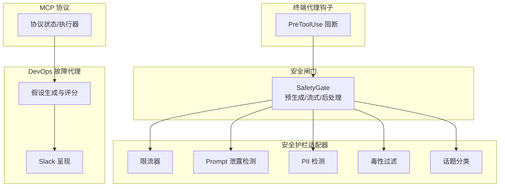
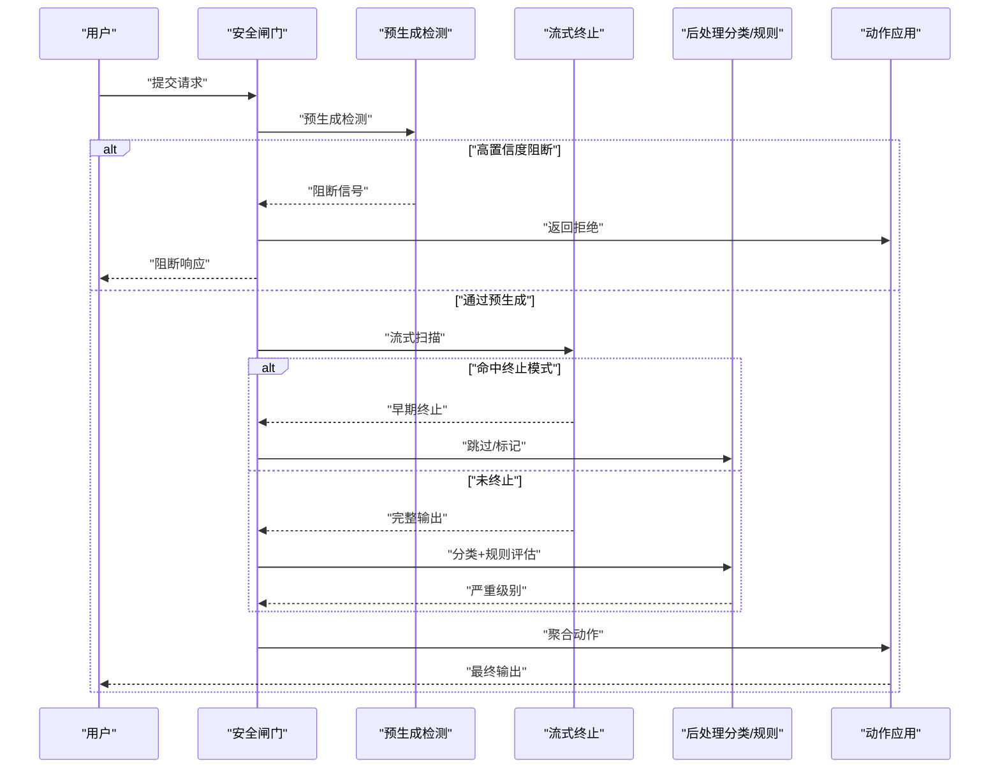
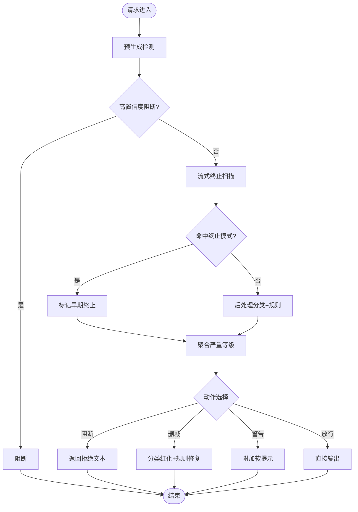
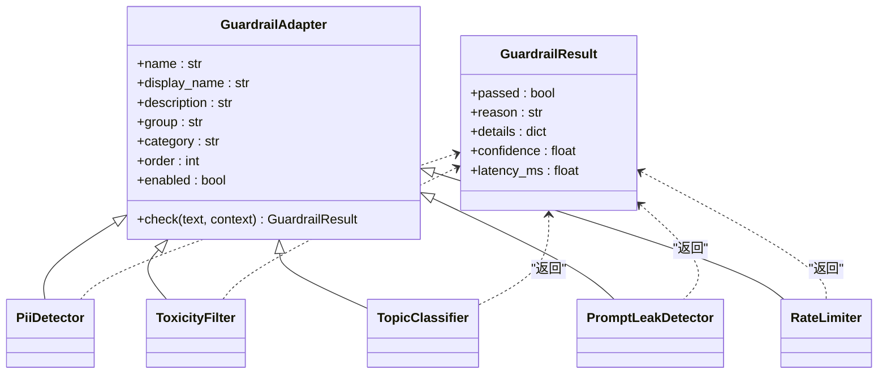
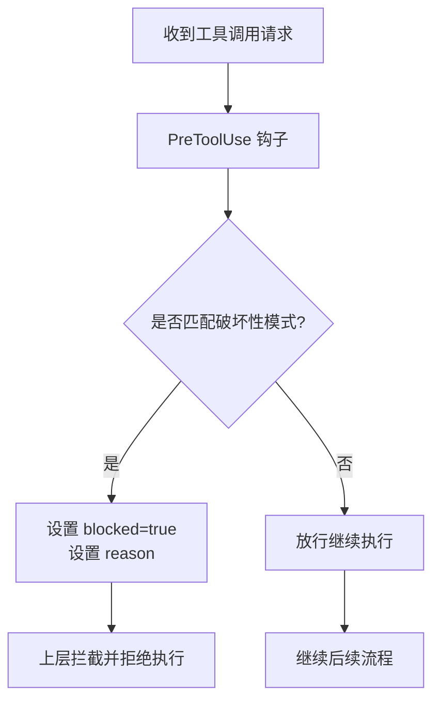
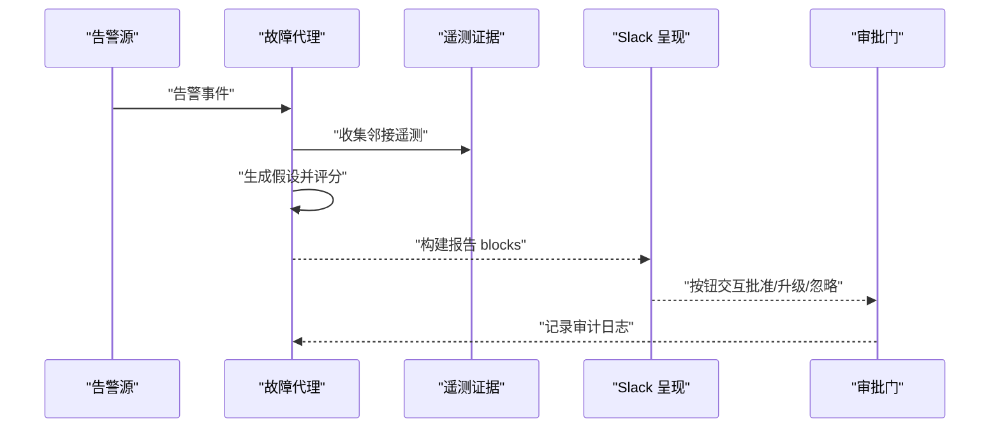
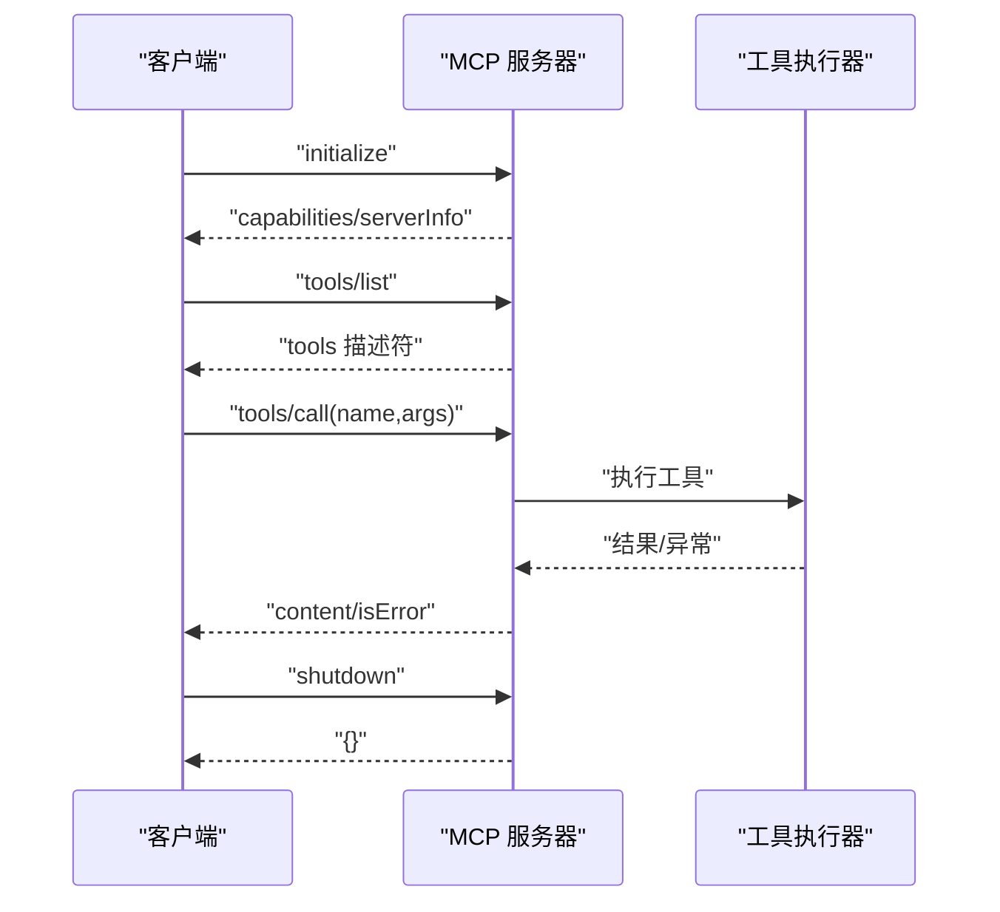
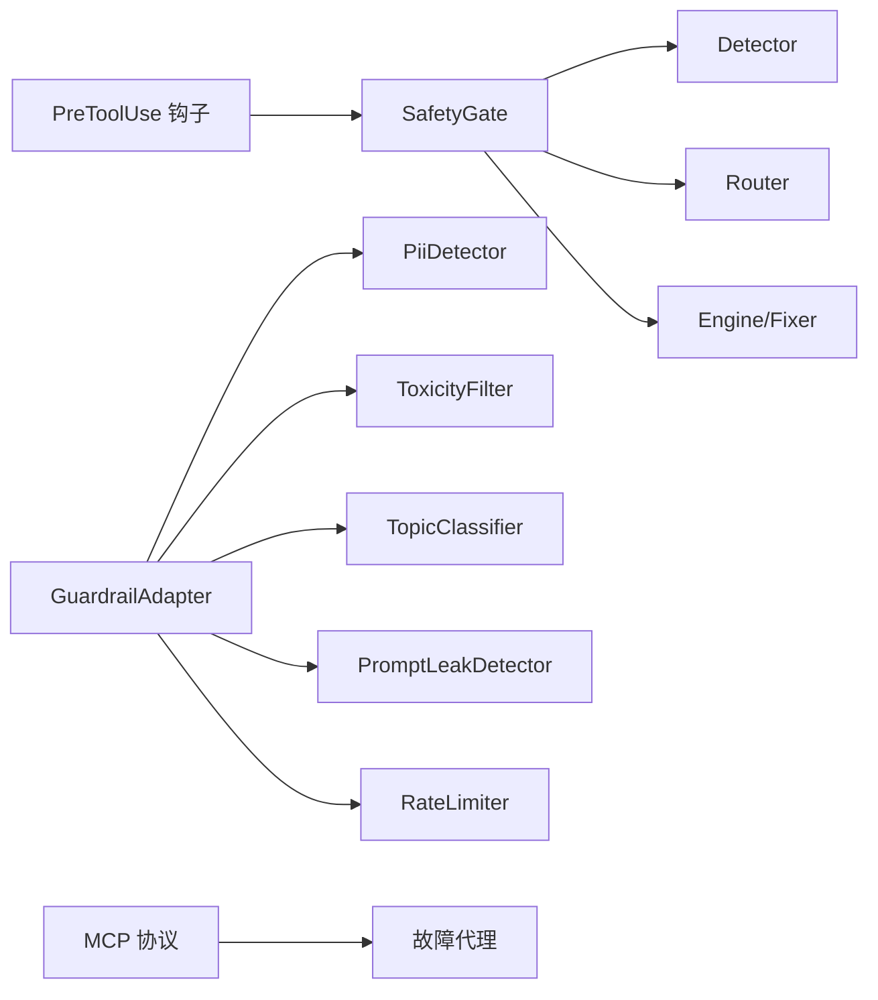

# 紧急停止与哨兵机制

<cite>
**本文引用的文件**
- [safety_gate.py](file://phases/19-capstone-projects/87-end-to-end-safety-gate/code/safety_gate.py)
- [en.md](file://phases/19-capstone-projects/87-end-to-end-safety-gate/docs/en.md)
- [base.py](file://guardrails-sandbox/backend/adapters/base.py)
- [rate_limiter.py](file://guardrails-sandbox/backend/adapters/rate_limiter.py)
- [prompt_leak.py](file://guardrails-sandbox/backend/adapters/prompt_leak.py)
- [pii_detector.py](file://guardrails-sandbox/backend/adapters/pii_detector.py)
- [toxicity.py](file://guardrails-sandbox/backend/adapters/toxicity.py)
- [topic_classifier.py](file://guardrails-sandbox/backend/adapters/topic_classifier.py)
- [hooks.ts](file://phases/19-capstone-projects/01-terminal-native-coding-agent/code/ts/src/hooks.ts)
- [blocks.ts](file://phases/19-capstone-projects/06-devops-troubleshooting-agent/code/ts/src/blocks.ts)
- [agent.ts](file://phases/19-capstone-projects/06-devops-troubleshooting-agent/code/ts/src/agent.ts)
- [index.ts](file://phases/19-capstone-projects/13-mcp-server-with-registry/code/ts/src/index.ts)
- [protocol.ts](file://phases/19-capstone-projects/13-mcp-server-with-registry/code/ts/src/protocol.ts)
</cite>

## 目录
1. [引言](#引言)
2. [项目结构](#项目结构)
3. [核心组件](#核心组件)
4. [架构总览](#架构总览)
5. [详细组件分析](#详细组件分析)
6. [依赖分析](#依赖分析)
7. [性能考虑](#性能考虑)
8. [故障排查指南](#故障排查指南)
9. [结论](#结论)
10. [附录](#附录)

## 引言
本文件围绕“紧急停止与哨兵机制”展开，系统性阐述智能体系统的安全控制与应急响应设计。内容涵盖：
- 紧急停止开关的设计原理与触发条件
- 哨兵监控体系的实现路径（异常检测、风险预警、自动干预）
- 系统健康监控、故障诊断与快速响应策略
- 在保障AI系统安全可控方面的关键作用与最佳实践

## 项目结构
本仓库包含多条主线能力，与安全护栏、紧急停止、哨兵监控密切相关的内容主要分布在以下模块：
- 安全闸门（Safety Gate）：端到端三阶段安全检查与决策聚合
- 安全护栏适配器（Guardrails Adapters）：输入/输出层面的多层检测与阻断
- 终端原生编码代理钩子（Hooks）：工具调用前的破坏性命令拦截
- DevOps 故障排查代理：基于证据的假设生成与处置建议
- MCP 服务器协议：受控工具调用与安全边界

**图表来源**
- [safety_gate.py:104-116](file://phases/19-capstone-projects/87-end-to-end-safety-gate/code/safety_gate.py#L104-L116)
- [rate_limiter.py:33-55](file://guardrails-sandbox/backend/adapters/rate_limiter.py#L33-L55)
- [prompt_leak.py:14-94](file://guardrails-sandbox/backend/adapters/prompt_leak.py#L14-L94)
- [pii_detector.py:19-54](file://guardrails-sandbox/backend/adapters/pii_detector.py#L19-L54)
- [toxicity.py:22-64](file://guardrails-sandbox/backend/adapters/toxicity.py#L22-L64)
- [topic_classifier.py:20-54](file://guardrails-sandbox/backend/adapters/topic_classifier.py#L20-L54)
- [hooks.ts:34-51](file://phases/19-capstone-projects/01-terminal-native-coding-agent/code/ts/src/hooks.ts#L34-L51)
- [agent.ts:5-59](file://phases/19-capstone-projects/06-devops-troubleshooting-agent/code/ts/src/agent.ts#L5-L59)
- [blocks.ts:3-48](file://phases/19-capstone-projects/06-devops-troubleshooting-agent/code/ts/src/blocks.ts#L3-L48)
- [protocol.ts:18-54](file://phases/19-capstone-projects/13-mcp-server-with-registry/code/ts/src/protocol.ts#L18-L54)

**章节来源**
- [safety_gate.py:1-247](file://phases/19-capstone-projects/87-end-to-end-safety-gate/code/safety_gate.py#L1-L247)
- [base.py:5-34](file://guardrails-sandbox/backend/adapters/base.py#L5-L34)

## 核心组件
- 安全闸门（SafetyGate）：将“预生成检测、流式终止、后处理分类与规则引擎”三阶段组合，采用确定性聚合表进行最终动作判定（阻断/删减/警告/放行）。
- 安全护栏适配器（GuardrailAdapter）：统一的适配器基类，定义检查接口与通用结果结构；具体适配器包括限流、PII、毒性、话题分类、Prompt 泄露等。
- 终端代理钩子（HookBus + destructiveGuard）：在工具调用前拦截破坏性命令，作为“紧急停止”的前置哨兵。
- DevOps 故障代理：基于图谱与遥测证据生成假设并评分，支持审批门与审计日志，体现“异常检测—风险预警—自动干预”的闭环。
- MCP 协议：受控工具调用通道，提供初始化、工具列表、调用与关闭等能力，作为“安全边界”。

**章节来源**
- [safety_gate.py:104-116](file://phases/19-capstone-projects/87-end-to-end-safety-gate/code/safety_gate.py#L104-L116)
- [base.py:14-34](file://guardrails-sandbox/backend/adapters/base.py#L14-L34)
- [hooks.ts:3-32](file://phases/19-capstone-projects/01-terminal-native-coding-agent/code/ts/src/hooks.ts#L3-L32)
- [agent.ts:5-59](file://phases/19-capstone-projects/06-devops-troubleshooting-agent/code/ts/src/agent.ts#L5-L59)
- [protocol.ts:18-54](file://phases/19-capstone-projects/13-mcp-server-with-registry/code/ts/src/protocol.ts#L18-L54)

## 架构总览
下图展示了从请求进入系统到最终动作输出的端到端流程，以及关键的紧急停止与哨兵触发点。

**图表来源**
- [safety_gate.py:117-233](file://phases/19-capstone-projects/87-end-to-end-safety-gate/code/safety_gate.py#L117-L233)
- [en.md:22-44](file://phases/19-capstone-projects/87-end-to-end-safety-gate/docs/en.md#L22-L44)

## 详细组件分析

### 安全闸门（SafetyGate）与紧急停止开关
- 设计原理
  - 三阶段流水线：预生成（输入检测）、流式终止（生成过程中的即时终止）、后处理（输出分类与规则）。
  - 确定性聚合表：综合各阶段信号，按严重等级映射到阻断/删减/警告/放行。
  - 紧急停止开关：在预生成阶段若置信度达到阈值即直接阻断，无需进入生成与后处理，形成“快速失败”的安全边界。
- 触发条件
  - 预生成阶段：检测器置信度≥阈值且类别非“良性”。
  - 流式终止阶段：命中预设的终止模式（如特定续写片段），触发早期终止并标记为中等严重。
  - 后处理阶段：分类器最高严重或规则引擎最高严重达到高等级。
- 关键实现要点
  - 预生成检测：调用 Detector.analyze 返回类别与置信度。
  - 流式终止：缓冲最多N个块，拼接窗口内正则扫描，命中即终止并返回部分输出。
  - 聚合与动作：按严重等级映射动作；阻断返回固定拒绝文本；删减先经分类器红化，再由规则修复器进一步修正；警告附加软提示；放行直接输出。
  - 请求追踪：记录每个阶段的判定与最终动作、耗时，便于审计与回溯。

**图表来源**
- [safety_gate.py:117-183](file://phases/19-capstone-projects/87-end-to-end-safety-gate/code/safety_gate.py#L117-L183)
- [en.md:34-44](file://phases/19-capstone-projects/87-end-to-end-safety-gate/docs/en.md#L34-L44)

**章节来源**
- [safety_gate.py:104-233](file://phases/19-capstone-projects/87-end-to-end-safety-gate/code/safety_gate.py#L104-L233)
- [en.md:18-44](file://phases/19-capstone-projects/87-end-to-end-safety-gate/docs/en.md#L18-L44)

### 哨兵监控系统：异常检测、风险预警与自动干预
- 异常检测
  - 输入侧：PII 检测、毒性过滤、话题分类、Prompt 泄露检测。
  - 输出侧：内容分类器路由、规则引擎评估。
  - 速率限制：按用户层级与分钟级窗口统计，超限即阻断。
- 风险预警
  - 安全闸门的聚合表将信号转化为严重等级，形成“低/中/高/阻断”的分级预警。
  - DevOps 故障代理基于图谱与遥测证据生成假设，给出评分与建议，支持“审批门”与审计日志。
- 自动干预
  - 预生成阶段的紧急停止：一旦达到阻断阈值立即拒绝。
  - 流式终止：命中终止模式时提前结束生成，减少潜在风险暴露。
  - 后处理自动修正：对需要删减的内容先进行分类红化，再由规则修复器进一步修正。
  - 终端代理钩子：在工具调用前拦截破坏性命令，避免对宿主造成不可逆影响。

**图表来源**
- [base.py:14-34](file://guardrails-sandbox/backend/adapters/base.py#L14-L34)
- [pii_detector.py:19-54](file://guardrails-sandbox/backend/adapters/pii_detector.py#L19-L54)
- [toxicity.py:22-64](file://guardrails-sandbox/backend/adapters/toxicity.py#L22-L64)
- [topic_classifier.py:20-54](file://guardrails-sandbox/backend/adapters/topic_classifier.py#L20-L54)
- [prompt_leak.py:14-94](file://guardrails-sandbox/backend/adapters/prompt_leak.py#L14-L94)
- [rate_limiter.py:33-55](file://guardrails-sandbox/backend/adapters/rate_limiter.py#L33-L55)

**章节来源**
- [base.py:5-34](file://guardrails-sandbox/backend/adapters/base.py#L5-L34)
- [pii_detector.py:28-54](file://guardrails-sandbox/backend/adapters/pii_detector.py#L28-L54)
- [toxicity.py:31-64](file://guardrails-sandbox/backend/adapters/toxicity.py#L31-L64)
- [topic_classifier.py:29-54](file://guardrails-sandbox/backend/adapters/topic_classifier.py#L29-L54)
- [prompt_leak.py:44-94](file://guardrails-sandbox/backend/adapters/prompt_leak.py#L44-L94)
- [rate_limiter.py:33-55](file://guardrails-sandbox/backend/adapters/rate_limiter.py#L33-L55)

### 终端代理钩子：工具调用前的紧急停止
- 设计目标：在工具执行前拦截破坏性命令，避免对宿主系统造成不可逆影响。
- 实现方式：PreToolUse 钩子对工具参数中的命令进行模式匹配，命中即设置阻断标记并返回原因。
- 触发条件：命令字符串中包含破坏性模式（如删除根目录、关机等）。

**图表来源**
- [hooks.ts:34-51](file://phases/19-capstone-projects/01-terminal-native-coding-agent/code/ts/src/hooks.ts#L34-L51)

**章节来源**
- [hooks.ts:3-32](file://phases/19-capstone-projects/01-terminal-native-coding-agent/code/ts/src/hooks.ts#L3-L32)
- [hooks.ts:34-51](file://phases/19-capstone-projects/01-terminal-native-coding-agent/code/ts/src/hooks.ts#L34-L51)

### DevOps 故障代理：异常检测—风险预警—自动干预
- 异常检测：基于图谱与遥测证据收集，识别告警源节点及其邻接关系。
- 风险预警：为告警生成候选假设，按时效性、特异性、引用数量与路径长度进行评分。
- 自动干预：通过审批门与审计日志，支持批准、升级或忽略三种处置动作，并在 Slack 中呈现。

**图表来源**
- [agent.ts:5-59](file://phases/19-capstone-projects/06-devops-troubleshooting-agent/code/ts/src/agent.ts#L5-L59)
- [blocks.ts:3-48](file://phases/19-capstone-projects/06-devops-troubleshooting-agent/code/ts/src/blocks.ts#L3-L48)

**章节来源**
- [agent.ts:5-59](file://phases/19-capstone-projects/06-devops-troubleshooting-agent/code/ts/src/agent.ts#L5-L59)
- [blocks.ts:3-48](file://phases/19-capstone-projects/06-devops-troubleshooting-agent/code/ts/src/blocks.ts#L3-L48)

### MCP 协议：受控工具调用与安全边界
- 协议能力：初始化、列出工具、调用工具、关闭服务。
- 安全边界：通过描述符与执行器管理工具清单，调用失败时返回错误内容，避免越权访问。
- 应用场景：在审批门之后，仅允许已授权工具在受控通道内执行。

**图表来源**
- [protocol.ts:25-54](file://phases/19-capstone-projects/13-mcp-server-with-registry/code/ts/src/protocol.ts#L25-L54)
- [index.ts:14-58](file://phases/19-capstone-projects/13-mcp-server-with-registry/code/ts/src/index.ts#L14-L58)

**章节来源**
- [protocol.ts:18-54](file://phases/19-capstone-projects/13-mcp-server-with-registry/code/ts/src/protocol.ts#L18-L54)
- [index.ts:14-58](file://phases/19-capstone-projects/13-mcp-server-with-registry/code/ts/src/index.ts#L14-L58)

## 依赖分析
- 安全闸门依赖多个适配器模块（检测器、分类器、规则引擎），并通过确定性聚合表驱动最终动作。
- 适配器均继承自 GuardrailAdapter，统一返回 GuardrailResult，便于聚合与审计。
- 终端代理钩子与 MCP 协议分别在“工具调用前阻断”和“受控工具调用”两个层面提供安全边界。
- DevOps 故障代理独立于上述模块，但可与审批门结合形成完整的应急响应闭环。

**图表来源**
- [safety_gate.py:46-53](file://phases/19-capstone-projects/87-end-to-end-safety-gate/code/safety_gate.py#L46-L53)
- [base.py:14-34](file://guardrails-sandbox/backend/adapters/base.py#L14-L34)
- [pii_detector.py:19-54](file://guardrails-sandbox/backend/adapters/pii_detector.py#L19-L54)
- [toxicity.py:22-64](file://guardrails-sandbox/backend/adapters/toxicity.py#L22-L64)
- [topic_classifier.py:20-54](file://guardrails-sandbox/backend/adapters/topic_classifier.py#L20-L54)
- [prompt_leak.py:14-94](file://guardrails-sandbox/backend/adapters/prompt_leak.py#L14-L94)
- [rate_limiter.py:33-55](file://guardrails-sandbox/backend/adapters/rate_limiter.py#L33-L55)
- [hooks.ts:34-51](file://phases/19-capstone-projects/01-terminal-native-coding-agent/code/ts/src/hooks.ts#L34-L51)
- [protocol.ts:18-54](file://phases/19-capstone-projects/13-mcp-server-with-registry/code/ts/src/protocol.ts#L18-L54)

**章节来源**
- [safety_gate.py:46-53](file://phases/19-capstone-projects/87-end-to-end-safety-gate/code/safety_gate.py#L46-L53)
- [base.py:14-34](file://guardrails-sandbox/backend/adapters/base.py#L14-L34)

## 性能考虑
- 流式终止的缓冲大小与扫描窗口直接影响延迟与阻断效果，需在吞吐与安全性之间平衡。
- 多适配器串行检查会增加端到端延迟，可通过缓存与并行化优化（在适配器层面已有缓存示例）。
- 预生成阶段的快速阻断可显著降低无效计算，建议将高成本检查置于流式终止之后。
- 速率限制与规则修复器的调用应尽量轻量化，避免成为瓶颈。

## 故障排查指南
- 审计与追踪
  - 安全闸门输出 RequestTrace，包含每个阶段的判定与最终动作、耗时，便于回溯。
  - DevOps 故障代理输出唯一 incidentId 与 topHypotheses，支持审批门审计日志。
- 常见问题定位
  - 预生成阻断频繁：检查检测器置信度阈值与触发规则，确认是否存在误报。
  - 流式终止误触：调整终止模式正则或增大缓冲窗口，减少误伤。
  - 后处理删减过度：检查分类器路由与规则修复器配置，确保在安全与可用性间取得平衡。
  - 终端钩子误拦截：核对破坏性模式集合，避免误伤合法命令。
- 快速恢复
  - 临时降低阻断阈值或禁用部分适配器进行隔离排查。
  - 使用 MCP 协议的关闭能力进行服务降级或重启。

**章节来源**
- [safety_gate.py:236-247](file://phases/19-capstone-projects/87-end-to-end-safety-gate/code/safety_gate.py#L236-L247)
- [agent.ts:5-59](file://phases/19-capstone-projects/06-devops-troubleshooting-agent/code/ts/src/agent.ts#L5-L59)
- [blocks.ts:3-48](file://phases/19-capstone-projects/06-devops-troubleshooting-agent/code/ts/src/blocks.ts#L3-L48)
- [hooks.ts:34-51](file://phases/19-capstone-projects/01-terminal-native-coding-agent/code/ts/src/hooks.ts#L34-L51)

## 结论
紧急停止与哨兵机制通过“预生成阻断、流式终止、后处理修正”三层防线，结合“异常检测—风险预警—自动干预”的闭环，有效提升了AI系统的安全可控性。在实际部署中，应重视阈值设定、误报控制与性能权衡，并配合审计日志与审批门，形成可追溯、可干预、可恢复的应急响应体系。

## 附录
- 关键实现参考路径
  - 安全闸门：[safety_gate.py:117-233](file://phases/19-capstone-projects/87-end-to-end-safety-gate/code/safety_gate.py#L117-L233)
  - 适配器基类：[base.py:14-34](file://guardrails-sandbox/backend/adapters/base.py#L14-L34)
  - PII 检测：[pii_detector.py:28-54](file://guardrails-sandbox/backend/adapters/pii_detector.py#L28-L54)
  - 毒性过滤：[toxicity.py:31-64](file://guardrails-sandbox/backend/adapters/toxicity.py#L31-L64)
  - 话题分类：[topic_classifier.py:29-54](file://guardrails-sandbox/backend/adapters/topic_classifier.py#L29-L54)
  - Prompt 泄露检测：[prompt_leak.py:44-94](file://guardrails-sandbox/backend/adapters/prompt_leak.py#L44-L94)
  - 速率限制：[rate_limiter.py:33-55](file://guardrails-sandbox/backend/adapters/rate_limiter.py#L33-L55)
  - 终端钩子：[hooks.ts:34-51](file://phases/19-capstone-projects/01-terminal-native-coding-agent/code/ts/src/hooks.ts#L34-L51)
  - DevOps 故障代理：[agent.ts:5-59](file://phases/19-capstone-projects/06-devops-troubleshooting-agent/code/ts/src/agent.ts#L5-L59)
  - Slack 呈现：[blocks.ts:3-48](file://phases/19-capstone-projects/06-devops-troubleshooting-agent/code/ts/src/blocks.ts#L3-L48)
  - MCP 协议：[protocol.ts:25-54](file://phases/19-capstone-projects/13-mcp-server-with-registry/code/ts/src/protocol.ts#L25-L54)