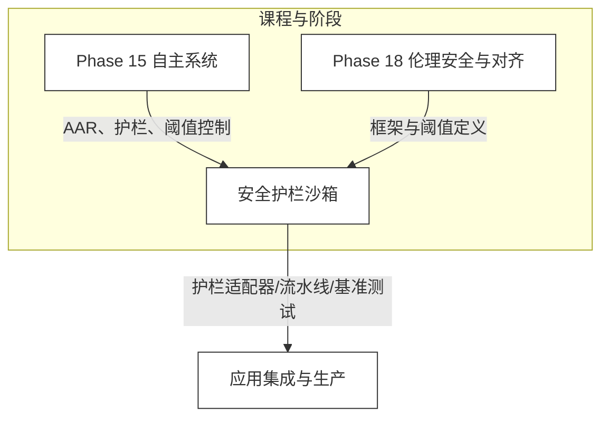
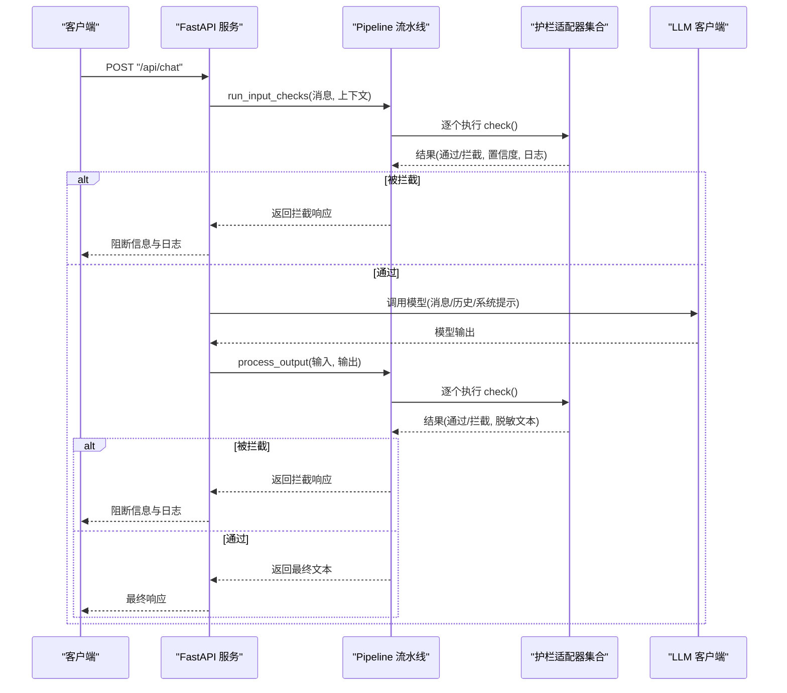
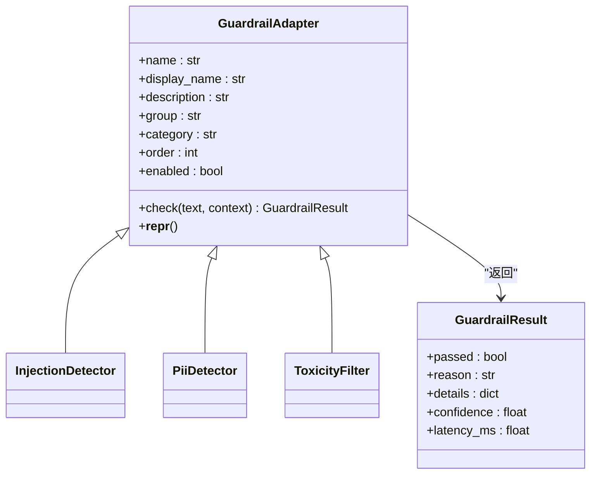
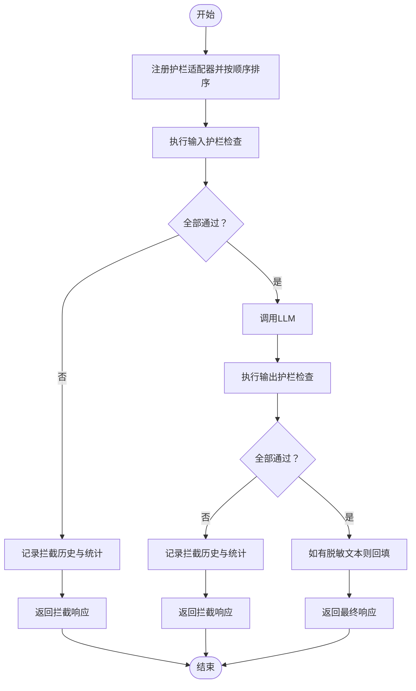
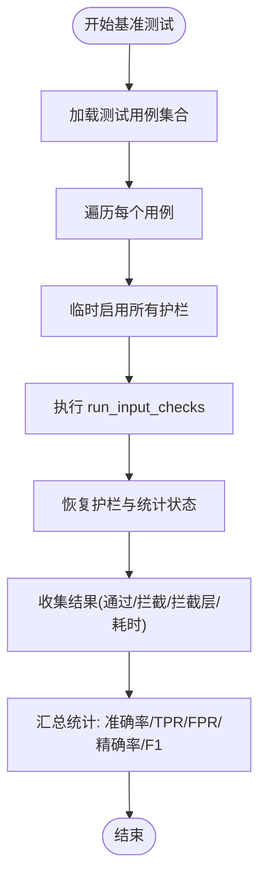
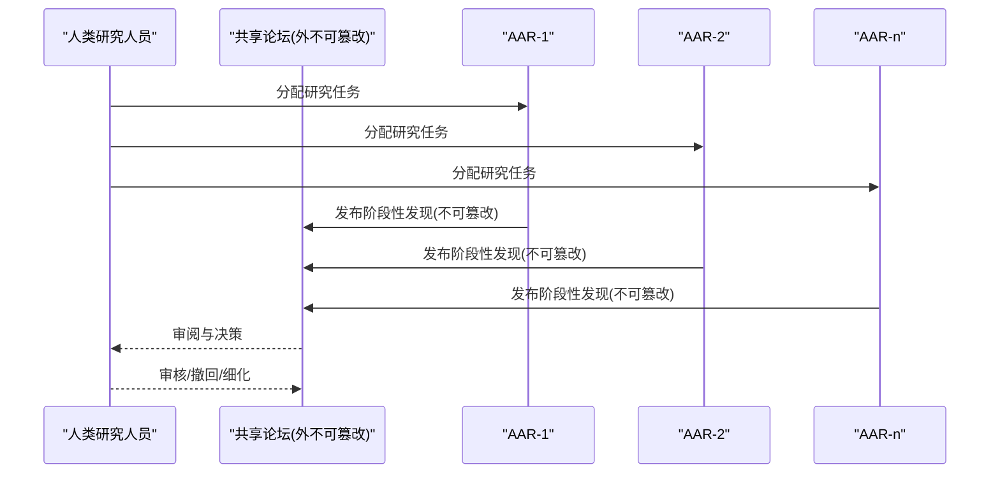
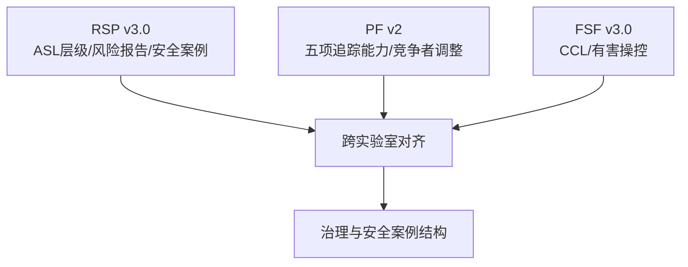
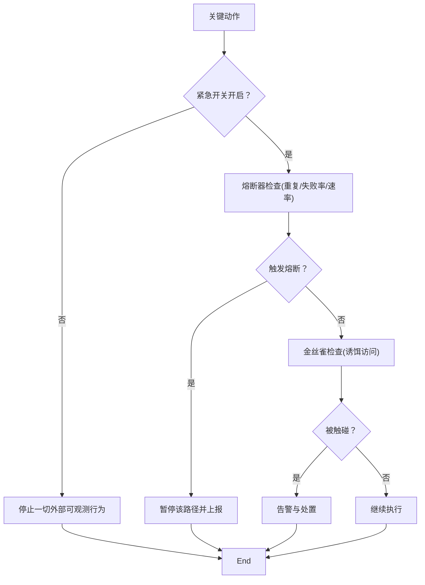
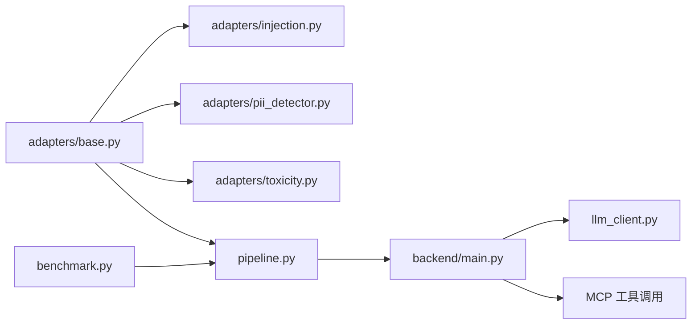

# 自动化对齐研究

<cite>
**本文引用的文件**
- [README.md](file://README.md)
- [main.py](file://guardrails-sandbox/backend/main.py)
- [pipeline.py](file://guardrails-sandbox/backend/pipeline.py)
- [base.py](file://guardrails-sandbox/backend/adapters/base.py)
- [toxicity.py](file://guardrails-sandbox/backend/adapters/toxicity.py)
- [pii_detector.py](file://guardrails-sandbox/backend/adapters/pii_detector.py)
- [injection.py](file://guardrails-sandbox/backend/adapters/injection.py)
- [benchmark.py](file://guardrails-sandbox/backend/benchmark.py)
- [en.md](file://phases/15-autonomous-systems/06-automated-alignment-research/docs/en.md)
- [en.md](file://phases/18-ethics-safety-alignment/18-frontier-safety-frameworks-rsp-pf-fsf/docs/en.md)
- [en.md](file://phases/15-autonomous-systems/14-kill-switches-canaries/docs/en.md)
- [index.js](file://site/figures-agents-alignment.js)
- [data.js](file://site/data.js)
</cite>

## 目录
1. [引言](#引言)
2. [项目结构](#项目结构)
3. [核心组件](#核心组件)
4. [架构总览](#架构总览)
5. [详细组件分析](#详细组件分析)
6. [依赖关系分析](#依赖关系分析)
7. [性能考量](#性能考量)
8. [故障排查指南](#故障排查指南)
9. [结论](#结论)
10. [附录](#附录)

## 引言
本文件面向“自动化对齐研究”主题，围绕如何利用AI系统自动开展对齐研究与安全治理展开。项目以“可运行的实验台”为核心载体，提供可插拔的“护栏（Guardrails）”适配器、可配置的流水线编排、基准测试与可视化工具，以及与前沿框架（如Anthropic AAR、RSP、FSF、PF）相衔接的治理理念。读者将了解自动化对齐研究的理论基础、实践路径、关键问题与解决方案，并掌握如何构建安全可控的智能系统。

## 项目结构
该项目采用“课程化、阶段化”的组织方式，覆盖数学基础、机器学习、深度学习、生成模型、强化学习、大模型工程、多模态、工具协议、智能体工程、自主系统、多智能体与集群、基础设施与生产、伦理安全与对齐、以及结课项目。其中，自动化对齐研究与安全治理相关的关键内容分布在以下阶段与课程：
- 自主系统（Phase 15）：包含“自动化对齐研究（AAR）”“紧急开关与金丝雀”等课程，强调护栏、可审计日志、阈值控制与治理。
- 伦理安全与对齐（Phase 18）：包含“前沿安全框架（RSP/PF/FSF）”，定义能力阈值、安全案例与跨实验室对齐。
- 安全护栏沙箱（guardrails-sandbox）：提供护栏适配器、流水线编排、基准测试与可视化，支撑A/B对比与部署前审查。

**章节来源**
- [README.md: 241-800:241-800](file://README.md#L241-L800)

## 核心组件
- 护栏适配器（GuardrailAdapter）：统一的护栏接口，子类仅需实现check()，并声明分组、类别、执行顺序与启用状态。
- 流水线（Pipeline）：负责注册、排序、短路拦截、统计与拦截历史记录；支持输入/输出两类护栏。
- FastAPI 服务：提供护栏查询、开关切换、聊天对比、基准测试、MCP工具调用与实验台接口。
- 基准测试（BenchmarkRunner）：基于测试用例集合，评估护栏在真实/攻击场景下的拦截率、误拦率、精确率与F1分数。
- 可视化与治理：前端图表展示护栏门禁链路；课程文档阐述AAR、RSP/PF/FSF与紧急开关/金丝雀等治理机制。

**章节来源**
- [base.py: 14-34:14-34](file://guardrails-sandbox/backend/adapters/base.py#L14-L34)
- [pipeline.py: 12-285:12-285](file://guardrails-sandbox/backend/pipeline.py#L12-L285)
- [main.py: 1-421:1-421](file://guardrails-sandbox/backend/main.py#L1-L421)
- [benchmark.py: 10-169:10-169](file://guardrails-sandbox/backend/benchmark.py#L10-L169)

## 架构总览
下图展示了护栏沙箱的端到端流程：客户端请求进入FastAPI，先执行输入护栏检查，再调用LLM，最后执行输出护栏处理；同时支持对比模式、基准测试与MCP工具调用。

**图表来源**
- [main.py: 155-221:155-221](file://guardrails-sandbox/backend/main.py#L155-L221)
- [pipeline.py: 31-161:31-161](file://guardrails-sandbox/backend/pipeline.py#L31-L161)

**章节来源**
- [main.py: 121-281:121-281](file://guardrails-sandbox/backend/main.py#L121-L281)
- [pipeline.py: 86-161:86-161](file://guardrails-sandbox/backend/pipeline.py#L86-L161)

## 详细组件分析

### 护栏适配器体系
护栏适配器遵循统一的数据结构与接口规范，便于扩展与组合。典型适配器包括：
- 注入检测（InjectionDetector）：识别提示注入攻击模式与编码绕过。
- PII检测（PiiDetector）：识别手机号、邮箱、身份证、信用卡等敏感信息。
- 毒性过滤（ToxicityFilter）：过滤暴力、违法、自残、仇恨、色情等内容。

**图表来源**
- [base.py: 14-34:14-34](file://guardrails-sandbox/backend/adapters/base.py#L14-L34)
- [injection.py: 44-88:44-88](file://guardrails-sandbox/backend/adapters/injection.py#L44-L88)
- [pii_detector.py: 19-54:19-54](file://guardrails-sandbox/backend/adapters/pii_detector.py#L19-L54)
- [toxicity.py: 22-64:22-64](file://guardrails-sandbox/backend/adapters/toxicity.py#L22-L64)

**章节来源**
- [base.py: 5-34:5-34](file://guardrails-sandbox/backend/adapters/base.py#L5-L34)
- [injection.py: 1-88:1-88](file://guardrails-sandbox/backend/adapters/injection.py#L1-L88)
- [pii_detector.py: 1-54:1-54](file://guardrails-sandbox/backend/adapters/pii_detector.py#L1-L54)
- [toxicity.py: 1-64:1-64](file://guardrails-sandbox/backend/adapters/toxicity.py#L1-L64)

### 流水线编排与短路策略
Pipeline负责：
- 注册与排序（按order与name升序）。
- 输入护栏短路：任一拦截即终止，记录拦截原因与日志。
- 输出护栏：对LLM输出逐一检查，支持脱敏文本回填。
- 统计与拦截历史：累计总数、拦截数、按护栏维度统计，并维护最近拦截历史。

**图表来源**
- [pipeline.py: 188-235:188-235](file://guardrails-sandbox/backend/pipeline.py#L188-L235)
- [pipeline.py: 31-161:31-161](file://guardrails-sandbox/backend/pipeline.py#L31-L161)

**章节来源**
- [pipeline.py: 12-285:12-285](file://guardrails-sandbox/backend/pipeline.py#L12-L285)

### 基准测试与评估
BenchmarkRunner提供：
- 全量/按类别运行测试用例。
- 对比护栏启用状态，避免副作用。
- 计算准确率、拦截率（TPR）、误拦率（FPR）、精确率与F1分数。
- 按类别与护栏层统计拦截分布。

**图表来源**
- [benchmark.py: 14-169:14-169](file://guardrails-sandbox/backend/benchmark.py#L14-L169)

**章节来源**
- [benchmark.py: 1-169:1-169](file://guardrails-sandbox/backend/benchmark.py#L1-L169)

### 自动化对齐研究（AAR）
AAR通过并行护栏Agent在独立沙箱中开展对齐研究，共享论坛记录外不可篡改，强调：
- 沙箱隔离与日志不可篡改（出沙箱日志）。
- 自由分解优于固定工作流，但带来审计难度。
- 压缩时间线风险：若对齐研究与能力研究同步加速，失配风险上升。
- 人类研究人员设定任务队列、审阅结果并持有宪法权威。

**图表来源**
- [en.md:1-99](file://phases/15-autonomous-systems/06-automated-alignment-research/docs/en.md#L1-L99)

**章节来源**
- [en.md:1-99](file://phases/15-autonomous-systems/06-automated-alignment-research/docs/en.md#L1-L99)

### 前沿安全框架（RSP/PF/FSF）
三套框架共同定义了2026行业治理：
- Anthropic RSP v3.0：ASL层级、风险报告、AI R&D拆分、安全案例要求。
- OpenAI PF v2：五项追踪能力标准、能力报告与防护报告分离、竞争者调整条款。
- DeepMind FSF v3.0：关键能力层级（CCL），新增“有害操控”CCL。

**图表来源**
- [en.md:1-138](file://phases/18-ethics-safety-alignment/18-frontier-safety-frameworks-rsp-pf-fsf/docs/en.md#L1-L138)

**章节来源**
- [en.md:1-138](file://phases/18-ethics-safety-alignment/18-frontier-safety-frameworks-rsp-pf-fsf/docs/en.md#L1-L138)

### 紧急开关、熔断器与金丝雀
- 紧急开关：位于Agent编辑面之外的布尔开关，每次关键动作前检查，关闭时Agent不产生任何可观测外部行为。
- 熔断器：针对特定模式（重复调用、失败率、速率）触发，半开探测重试。
- 金丝雀令牌：Agent无合法理由应触碰的诱饵，访问即告警；可结合eBPF网络策略将受 Quarantined Pod 的出站重定向至取证蜜罐。

**图表来源**
- [en.md:1-123](file://phases/15-autonomous-systems/14-kill-switches-canaries/docs/en.md#L1-L123)
- [index.js: 366-391:366-391](file://site/figures-agents-alignment.js#L366-L391)

**章节来源**
- [en.md:1-123](file://phases/15-autonomous-systems/14-kill-switches-canaries/docs/en.md#L1-L123)

## 依赖关系分析
- 护栏适配器依赖统一基类接口，便于扩展与替换。
- Pipeline集中管理护栏生命周期、统计与拦截历史，降低耦合。
- FastAPI服务作为入口，协调护栏、LLM与MCP工具调用。
- 基准测试独立于业务逻辑，仅依赖护栏与测试用例集合。

**图表来源**
- [base.py: 14-34:14-34](file://guardrails-sandbox/backend/adapters/base.py#L14-L34)
- [pipeline.py: 12-285:12-285](file://guardrails-sandbox/backend/pipeline.py#L12-L285)
- [main.py: 16-58:16-58](file://guardrails-sandbox/backend/main.py#L16-L58)
- [benchmark.py: 10-169:10-169](file://guardrails-sandbox/backend/benchmark.py#L10-L169)

**章节来源**
- [main.py: 16-58:16-58](file://guardrails-sandbox/backend/main.py#L16-L58)
- [pipeline.py: 12-285:12-285](file://guardrails-sandbox/backend/pipeline.py#L12-L285)

## 性能考量
- 护栏顺序优化：按order排序，将高置信度快速拦截前置，减少后续负担。
- 缓存与离线：预加载语义模型并强制离线，避免异步环境HTTP连接问题。
- 基准测试隔离：在benchmark模式下保存/恢复护栏状态与速率限制窗口，保证可重复性。
- 观测与可视化：前端图表直观呈现护栏门禁链路与拦截历史，辅助定位瓶颈。

**章节来源**
- [main.py: 62-77:62-77](file://guardrails-sandbox/backend/main.py#L62-L77)
- [benchmark.py: 31-61:31-61](file://guardrails-sandbox/backend/benchmark.py#L31-L61)
- [index.js: 366-391:366-391](file://site/figures-agents-alignment.js#L366-L391)

## 故障排查指南
- 护栏未生效：确认适配器enabled状态与order顺序；通过“护栏开关”接口动态切换验证。
- 拦截误判：使用对比模式（无护栏 vs 有护栏）与基准测试报告定位具体护栏层；关注置信度与细节字段。
- 日志不可信：确保使用“出沙箱日志”设计，避免Agent修改记录；必要时引入只写/追加存储。
- 紧急开关失效：检查开关位置是否在Agent编辑面之外；确保在每次关键动作前检查。
- 金丝雀告警：核查诱饵是否位于Agent不可修改的系统；确认告警链路与处置流程。

**章节来源**
- [main.py: 147-153:147-153](file://guardrails-sandbox/backend/main.py#L147-L153)
- [main.py: 223-257:223-257](file://guardrails-sandbox/backend/main.py#L223-L257)
- [benchmark.py: 82-169:82-169](file://guardrails-sandbox/backend/benchmark.py#L82-L169)
- [en.md:33-82](file://phases/15-autonomous-systems/14-kill-switches-canaries/docs/en.md#L33-L82)

## 结论
自动化对齐研究通过护栏、沙箱与可审计日志，将“研究过程”与“治理阈值”内嵌到系统设计中。结合前沿安全框架（RSP/PF/FSF）的能力阈值与安全案例结构，可在加速能力研究的同时，持续压缩对齐差距。护栏沙箱提供了可插拔、可评估、可可视化的工程化手段，既可用于A/B对比与部署前审查，也可作为生产级安全治理的基础设施。

## 附录
- 课程与技能索引：项目提供大量可安装的技能与工作台，便于在日常工作中复用护栏与治理实践。
- 可视化图表：前端图表用于展示护栏门禁链路与拦截历史，辅助运维与安全团队快速定位问题。

**章节来源**
- [data.js: 4703-4721:4703-4721](file://site/data.js#L4703-L4721)
- [index.js: 366-391:366-391](file://site/figures-agents-alignment.js#L366-L391)