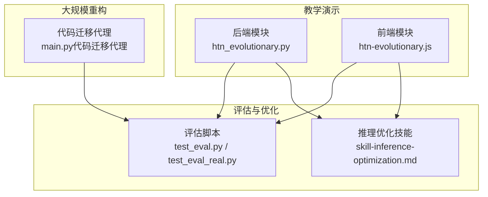
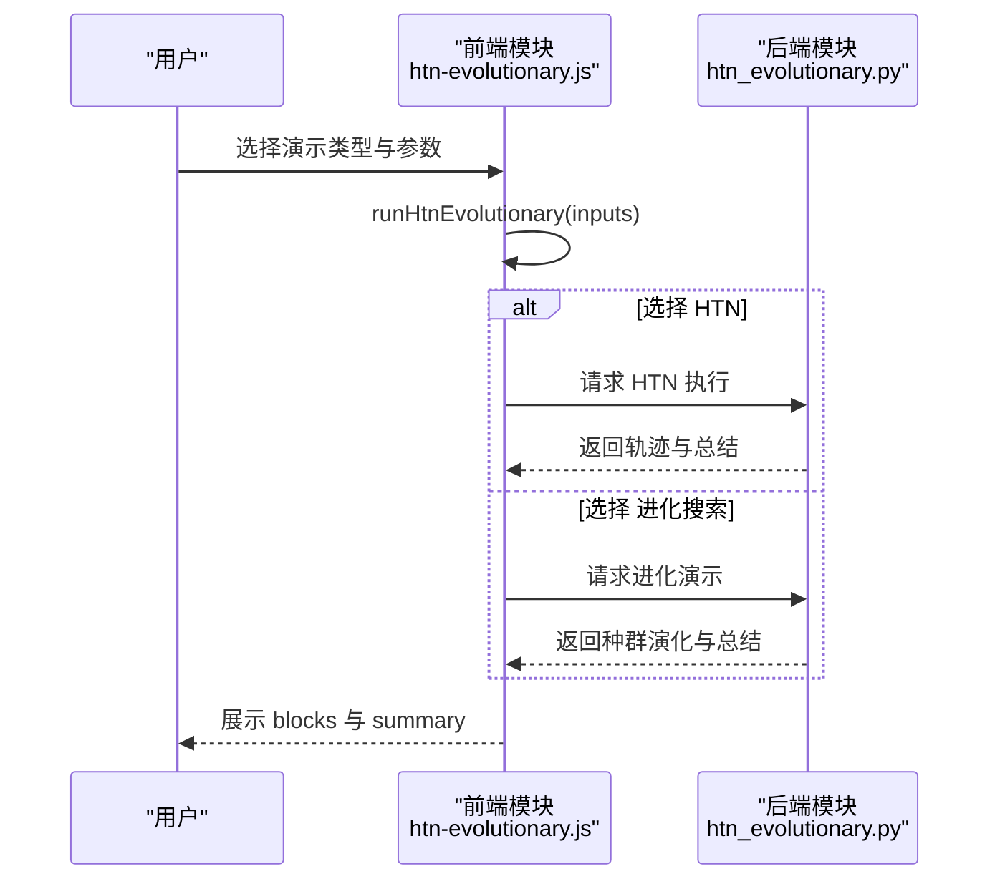
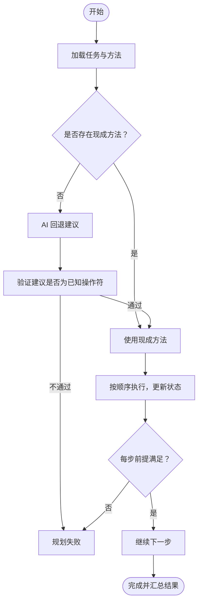
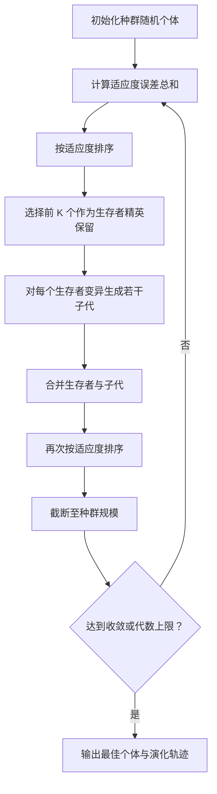
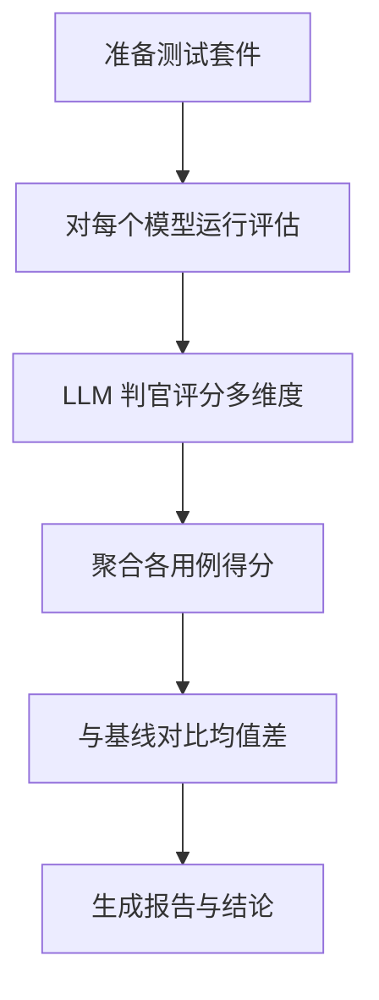
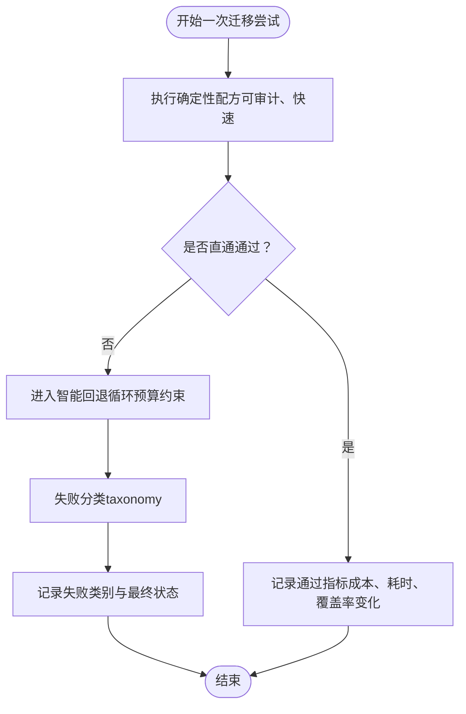
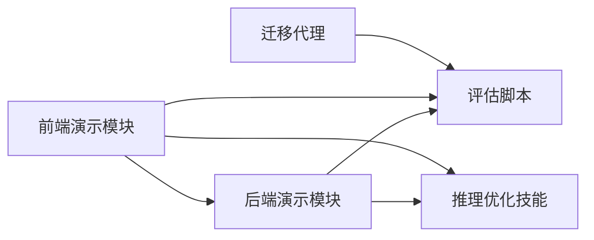

# 进化式代码生成

<cite>
**本文引用的文件**
- [htn_evolutionary.py](file://guardrails-sandbox/backend/playground/modules/htn_evolutionary.py)
- [htn-evolutionary.js](file://site/vue-app/summary/src/data/modules/htn-evolutionary.js)
- [skill-inference-optimization.md](file://phases/10-llms-from-scratch/12-inference-optimization/outputs/skill-inference-optimization.md)
- [test_eval.py](file://test_eval.py)
- [test_eval_real.py](file://test_eval_real.py)
- [main.py（代码迁移代理）](file://phases/19-capstone-projects/09-code-migration-agent/code/main.py)
- [README.md](file://README.md)
</cite>

## 目录
1. [引言](#引言)
2. [项目结构](#项目结构)
3. [核心组件](#核心组件)
4. [架构总览](#架构总览)
5. [详细组件分析](#详细组件分析)
6. [依赖关系分析](#依赖关系分析)
7. [性能考量](#性能考量)
8. [故障排查指南](#故障排查指南)
9. [结论](#结论)
10. [附录](#附录)

## 引言
本文件围绕 AlphaEvolve 进化式代码生成系统进行系统化文档化说明，聚焦以下目标：
- 解释进化算法在代码生成中的原理与实现路径：种群初始化、适应度评估、选择、交叉与变异、下一代筛选。
- 基于仓库中“HTN 规划 + 进化搜索”的教学模块，给出可复用的代码生成工作流范式。
- 提供自动化代码优化与生成系统的构建思路与实践参考。
- 给出代码质量评估标准与性能优化策略，覆盖大规模代码库的自动化重构与改进。
- 讨论进化式方法在复杂编程问题中的优势与局限。

## 项目结构
本项目是一个多阶段、多语言的工程化课程体系，其中与“进化式代码生成”直接相关的内容主要分布在以下位置：
- 教学演示模块：后端 Python 模块与前端 JavaScript 模块，共同演示 HTN 规划与进化搜索。
- 评估与优化：推理优化技能文档、测试评估脚本，用于衡量与提升生成质量与性能。
- 大规模重构案例：代码迁移代理示例，体现从确定性配方到智能回退的两层架构。

图示来源
- [htn_evolutionary.py:150-192](file://guardrails-sandbox/backend/playground/modules/htn_evolutionary.py#L150-L192)
- [htn-evolutionary.js:256-274](file://site/vue-app/summary/src/data/modules/htn-evolutionary.js#L256-L274)
- [skill-inference-optimization.md:1-90](file://phases/10-llms-from-scratch/12-inference-optimization/outputs/skill-inference-optimization.md#L1-L90)
- [test_eval.py:175-216](file://test_eval.py#L175-L216)
- [test_eval_real.py:422-446](file://test_eval_real.py#L422-L446)
- [main.py（代码迁移代理）:1-210](file://phases/19-capstone-projects/09-code-migration-agent/code/main.py#L1-L210)

章节来源
- [README.md:1-120](file://README.md#L1-L120)

## 核心组件
- HTN 规划模块：以“前提-效果”规则驱动的任务分解，确保执行顺序正确，适合合规/调度类强约束场景。
- 进化搜索模块：以“能被机器自动打分”为前提的种群迭代优化，适合可量化的目标函数（如误差最小化）。
- 评估框架：提供统一的测试用例、评分维度与对比机制，支撑生成质量的客观评价。
- 推理优化：针对 LLM 推理阶段的吞吐、延迟与成本进行系统化优化指导。
- 代码迁移代理：确定性配方优先 + 智能回退的两层架构，体现大规模重构的稳健性与可扩展性。

章节来源
- [htn_evolutionary.py:21-96](file://guardrails-sandbox/backend/playground/modules/htn_evolutionary.py#L21-L96)
- [htn_evolutionary.py:99-147](file://guardrails-sandbox/backend/playground/modules/htn_evolutionary.py#L99-L147)
- [test_eval.py:175-216](file://test_eval.py#L175-L216)
- [skill-inference-optimization.md:23-90](file://phases/10-llms-from-scratch/12-inference-optimization/outputs/skill-inference-optimization.md#L23-L90)
- [main.py（代码迁移代理）:1-172](file://phases/19-capstone-projects/09-code-migration-agent/code/main.py#L1-L172)

## 架构总览
下图展示了“HTN 规划 + 进化搜索”在教学演示中的交互流程：用户输入选择（HTN 或进化），后端/前端分别执行对应逻辑，并输出结构化结果与摘要。

图示来源
- [htn-evolutionary.js:256-274](file://site/vue-app/summary/src/data/modules/htn-evolutionary.js#L256-L274)
- [htn_evolutionary.py:150-192](file://guardrails-sandbox/backend/playground/modules/htn_evolutionary.py#L150-L192)

## 详细组件分析

### 组件A：HTN 规划引擎
HTN 将高层任务按“方法”逐步分解为可执行的“操作符”，每个操作符带有前提条件与执行效果。执行时逐条校验前提，确保顺序正确、不可跳步。

图示来源
- [htn_evolutionary.py:38-96](file://guardrails-sandbox/backend/playground/modules/htn_evolutionary.py#L38-L96)

章节来源
- [htn_evolutionary.py:21-96](file://guardrails-sandbox/backend/playground/modules/htn_evolutionary.py#L21-L96)

### 组件B：进化搜索（AlphaEvolve 式）
该组件以“能被机器自动打分”为核心前提，通过随机初始化种群、排序打分、精英保留、变异生成子代、再筛选的循环，逐步逼近最优。

图示来源
- [htn_evolutionary.py:107-147](file://guardrails-sandbox/backend/playground/modules/htn_evolutionary.py#L107-L147)
- [htn-evolutionary.js:187-233](file://site/vue-app/summary/src/data/modules/htn-evolutionary.js#L187-L233)

章节来源
- [htn_evolutionary.py:99-147](file://guardrails-sandbox/backend/playground/modules/htn_evolutionary.py#L99-L147)
- [htn-evolutionary.js:187-233](file://site/vue-app/summary/src/data/modules/htn-evolutionary.js#L187-L233)

### 组件C：评估框架与质量度量
评估脚本定义了测试用例、评分维度与对比流程，支持对不同模型/版本进行客观比较，并输出关键指标与低分样例。

图示来源
- [test_eval.py:175-216](file://test_eval.py#L175-L216)
- [test_eval_real.py:422-446](file://test_eval_real.py#L422-L446)

章节来源
- [test_eval.py:560-775](file://test_eval.py#L560-L775)
- [test_eval_real.py:422-446](file://test_eval_real.py#L422-L446)

### 组件D：大规模代码重构与迁移
代码迁移代理采用“确定性配方优先 + 智能回退”的两层架构：先用可审计、快速的配方处理，剩余失败项在预算约束下进行分类与修复尝试，形成可追踪的失败分类仪表盘。

图示来源
- [main.py（代码迁移代理）:135-172](file://phases/19-capstone-projects/09-code-migration-agent/code/main.py#L135-L172)
- [main.py（代码迁移代理）:175-210](file://phases/19-capstone-projects/09-code-migration-agent/code/main.py#L175-L210)

章节来源
- [main.py（代码迁移代理）:1-210](file://phases/19-capstone-projects/09-code-migration-agent/code/main.py#L1-L210)

## 依赖关系分析
- 演示模块依赖：前端模块与后端模块共享相同的输入/输出约定，确保前后端一致。
- 评估模块依赖：评估脚本独立于具体实现，仅依赖模型输出与评分接口。
- 优化模块依赖：推理优化技能文档为部署与运维提供决策框架与清单。
- 迁移代理依赖：失败分类与预算控制构成其核心约束，影响整体成功率与成本。

图示来源
- [htn-evolutionary.js:256-274](file://site/vue-app/summary/src/data/modules/htn-evolutionary.js#L256-L274)
- [htn_evolutionary.py:150-192](file://guardrails-sandbox/backend/playground/modules/htn_evolutionary.py#L150-L192)
- [skill-inference-optimization.md:23-90](file://phases/10-llms-from-scratch/12-inference-optimization/outputs/skill-inference-optimization.md#L23-L90)
- [test_eval.py:175-216](file://test_eval.py#L175-L216)
- [main.py（代码迁移代理）:1-210](file://phases/19-capstone-projects/09-code-migration-agent/code/main.py#L1-L210)

章节来源
- [htn_evolutionary.py:150-192](file://guardrails-sandbox/backend/playground/modules/htn_evolutionary.py#L150-L192)
- [htn-evolutionary.js:256-274](file://site/vue-app/summary/src/data/modules/htn-evolutionary.js#L256-L274)
- [skill-inference-optimization.md:1-90](file://phases/10-llms-from-scratch/12-inference-optimization/outputs/skill-inference-optimization.md#L1-L90)
- [test_eval.py:175-216](file://test_eval.py#L175-L216)
- [main.py（代码迁移代理）:1-210](file://phases/19-capstone-projects/09-code-migration-agent/code/main.py#L1-L210)

## 性能考量
- 推理优化策略：根据工作负载的“算子/字节比”识别瓶颈，优先采用 KV 缓存、连续批处理、前缀缓存、量化与推测解码等手段。
- 成本与吞吐平衡：在高内存瓶颈场景优先量化与批处理，在高计算瓶颈场景优先内核融合与张量并行。
- 监控指标：TTFT、ITL、吞吐、KV 缓存利用率、批利用率与队列深度，用于指导容量规划与调优。

章节来源
- [skill-inference-optimization.md:23-90](file://phases/10-llms-from-scratch/12-inference-optimization/outputs/skill-inference-optimization.md#L23-L90)

## 故障排查指南
- 评估与回归检测：通过对比基线与新版本的平均分与差异，判断改进是否有效；对低分用例进行归因与修复。
- 缓存与调用统计：关注精确缓存与语义缓存命中情况，以及节省的 API 调用次数，辅助定位性能瓶颈。
- 迁移代理失败分类：当预算耗尽或覆盖率回退时，利用失败分类仪表盘定位根因，调整配方或放宽预算。

章节来源
- [test_eval_real.py:422-446](file://test_eval_real.py#L422-L446)
- [main.py（代码迁移代理）:175-210](file://phases/19-capstone-projects/09-code-migration-agent/code/main.py#L175-L210)

## 结论
- 进化式方法在“可自动打分”的优化空间中具有强大的全局搜索能力，适合代码质量、性能与可读性的多目标优化。
- HTN 规划在强约束、可审计与可解释性方面更具优势，适合合规与调度类任务。
- 将评估框架与推理优化融入自动化系统，可显著提升生成质量与运行效率。
- 在大规模代码库重构中，确定性配方与智能回退相结合的两层架构，兼顾速度、安全与可扩展性。

## 附录
- 术语与概念：见课程总览与术语表，有助于理解 HTN、进化搜索、评估与优化等核心概念。
- 实践建议：结合评估脚本与推理优化技能，建立持续集成的质量门禁与性能监控闭环。

章节来源
- [README.md:241-800](file://README.md#L241-L800)