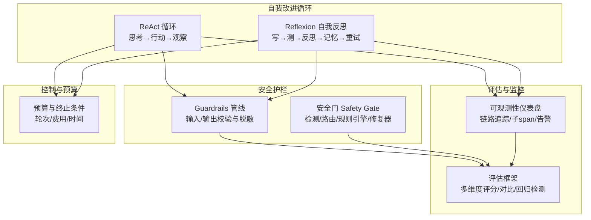
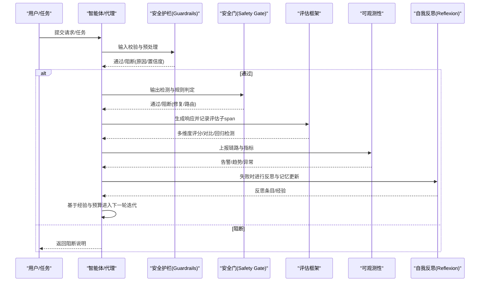
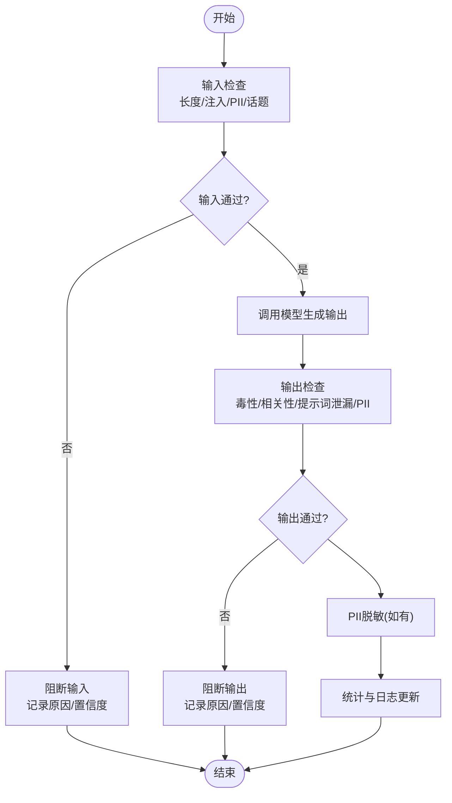
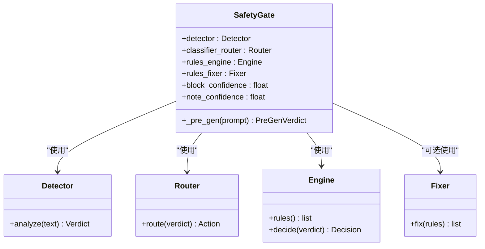
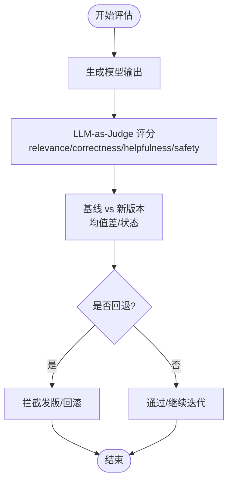
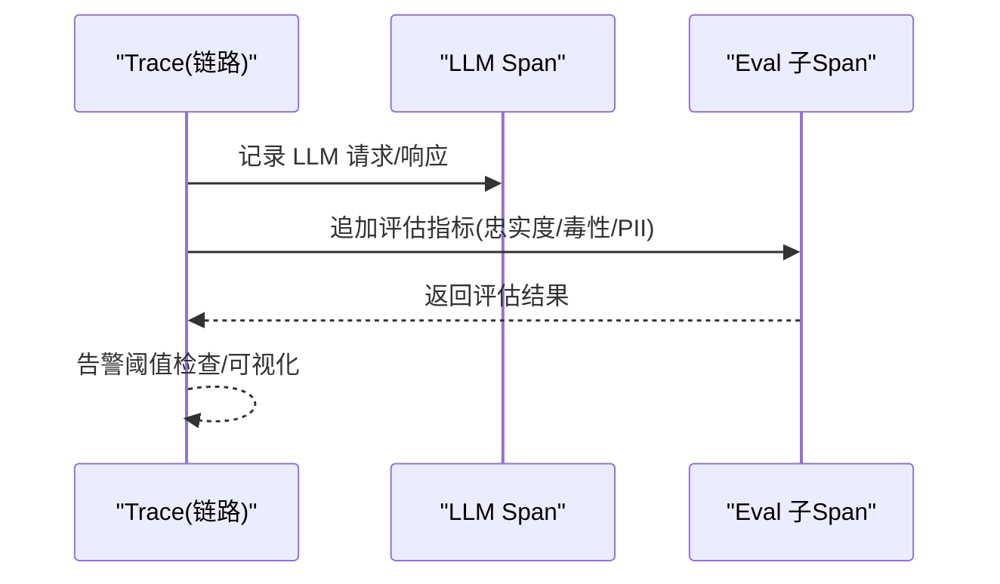
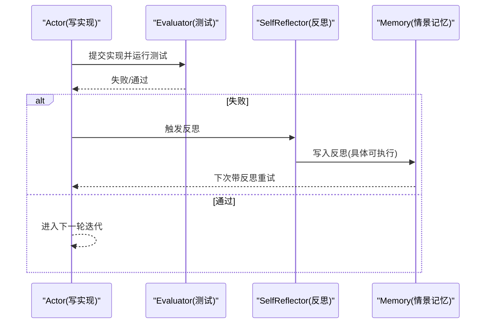
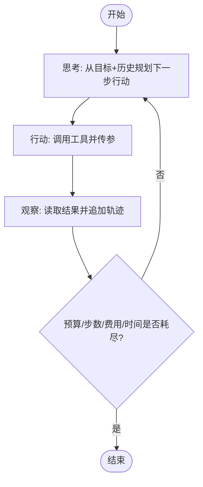
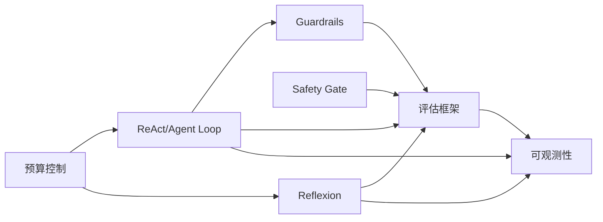

# 递归自我改进

<cite>
**本文引用的文件**
- [guardrails.py](file://phases/11-llm-engineering/12-guardrails/code/guardrails.py)
- [safety_gate.py](file://phases/19-capstone-projects/87-end-to-end-safety-gate/code/safety_gate.py)
- [relevance.py](file://guardrails-sandbox/backend/adapters/relevance.py)
- [reflexion_coder.py](file://guardrails-sandbox/backend/playground/modules/reflexion_coder.py)
- [react-loop-tracer.js](file://site/vue-app/summary/src/data/modules/react-loop-tracer.js)
- [reflexion-coder.js](file://site/vue-app/summary/src/data/modules/reflexion-coder.js)
- [test_eval.py](file://test_eval.py)
- [test_eval_real.py](file://test_eval_real.py)
- [main.py](file://phases/19-capstone-projects/16-github-issue-to-pr-agent/code/main.py)
- [main.py](file://phases/19-capstone-projects/11-llm-observability-dashboard/code/main.py)
- [data.js](file://site/data.js)
</cite>

## 目录
1. [引言](#引言)
2. [项目结构](#项目结构)
3. [核心组件](#核心组件)
4. [架构总览](#架构总览)
5. [详细组件分析](#详细组件分析)
6. [依赖关系分析](#依赖关系分析)
7. [性能考量](#性能考量)
8. [故障排查指南](#故障排查指南)
9. [结论](#结论)
10. [附录](#附录)

## 引言
本文件围绕“递归自我改进”主题，系统梳理仓库中与“智能体持续自我优化与能力提升”相关的设计与实现，包括：
- 递归改进循环的设计原理与实现路径
- 安全护栏与质量控制在自我改进中的作用
- 改进效果评估、性能监控与风险预警机制
- 在实际工程中如何构建具备自我改进能力的AI系统

目标是帮助读者理解如何在保证安全与可控的前提下，让系统通过反馈与评估实现持续演进。

## 项目结构
本仓库以“阶段-课程-实践”的方式组织知识与代码，递归自我改进涉及以下关键模块：
- 安全护栏与内容过滤：Guardrails 管线与安全门
- 评估框架与对比：多维度评分与回归检测
- 观测与告警：链路追踪与仪表盘
- 自我反思与记忆：Reflexion 循环与情景记忆
- 代理循环与预算控制：ReAct 循环与资源预算

图示来源
- [guardrails.py:286-380](file://phases/11-llm-engineering/12-guardrails/code/guardrails.py#L286-L380)
- [safety_gate.py:104-119](file://phases/19-capstone-projects/87-end-to-end-safety-gate/code/safety_gate.py#L104-L119)
- [test_eval.py:84-248](file://test_eval.py#L84-L248)
- [main.py:177-199](file://phases/19-capstone-projects/11-llm-observability-dashboard/code/main.py#L177-L199)
- [react-loop-tracer.js:171-187](file://site/vue-app/summary/src/data/modules/react-loop-tracer.js#L171-L187)
- [reflexion_coder.py:153-184](file://guardrails-sandbox/backend/playground/modules/reflexion_coder.py#L153-L184)
- [main.py:120-153](file://phases/19-capstone-projects/16-github-issue-to-pr-agent/code/main.py#L120-L153)

章节来源
- [guardrails.py:286-380](file://phases/11-llm-engineering/12-guardrails/code/guardrails.py#L286-L380)
- [safety_gate.py:104-119](file://phases/19-capstone-projects/87-end-to-end-safety-gate/code/safety_gate.py#L104-L119)
- [test_eval.py:84-248](file://test_eval.py#L84-L248)
- [main.py:177-199](file://phases/19-capstone-projects/11-llm-observability-dashboard/code/main.py#L177-L199)
- [react-loop-tracer.js:171-187](file://site/vue-app/summary/src/data/modules/react-loop-tracer.js#L171-L187)
- [reflexion_coder.py:153-184](file://guardrails-sandbox/backend/playground/modules/reflexion_coder.py#L153-L184)
- [main.py:120-153](file://phases/19-capstone-projects/16-github-issue-to-pr-agent/code/main.py#L120-L153)

## 核心组件
- 安全护栏管线（Guardrails Pipeline）
  - 输入/输出校验：长度、注入检测、PII检测、话题分类、毒性过滤、相关性检查、系统提示词泄漏检测、PII脱敏
  - 统计与日志：通过率、阻断率、延迟统计、事件日志
- 安全门（Safety Gate）
  - 检测器、分类器路由、规则引擎、规则修复器
  - 预生成阶段的前置判定与阻断信心阈值
- 评估框架（多维度评分与对比）
  - relevance/correctness/helpfulness/safety 四维评分
  - LLM-as-Judge 与自动化指标对比
  - 回归检测与拦截策略
- 观测与告警（链路追踪与仪表盘）
  - 在 LLM span 下附加评估子 span
  - 告警阈值触发与可视化
- 自我反思与记忆（Reflexion）
  - Actor 写实现 → Evaluator 测试 → 失败 → SelfReflector 反思 → 写入 Memory → 重试
  - 记忆开关与反思质量要求
- 代理循环与预算（ReAct/Agent Loop）
  - THINK → ACT → OBSERVE 循环
  - 轮次/费用/时间预算与终止条件

章节来源
- [guardrails.py:80-380](file://phases/11-llm-engineering/12-guardrails/code/guardrails.py#L80-L380)
- [safety_gate.py:104-119](file://phases/19-capstone-projects/87-end-to-end-safety-gate/code/safety_gate.py#L104-L119)
- [test_eval.py:52-248](file://test_eval.py#L52-L248)
- [main.py:177-199](file://phases/19-capstone-projects/11-llm-observability-dashboard/code/main.py#L177-L199)
- [reflexion_coder.py:116-170](file://guardrails-sandbox/backend/playground/modules/reflexion_coder.py#L116-L170)
- [react-loop-tracer.js:171-187](file://site/vue-app/summary/src/data/modules/react-loop-tracer.js#L171-L187)
- [main.py:120-153](file://phases/19-capstone-projects/16-github-issue-to-pr-agent/code/main.py#L120-L153)

## 架构总览
递归自我改进的核心在于“闭环反馈”。系统通过安全护栏确保输出安全与合规，通过评估框架衡量改进效果，通过可观测性监控性能与异常，通过自我反思与记忆沉淀经验，最终驱动下一轮迭代。

图示来源
- [guardrails.py:286-380](file://phases/11-llm-engineering/12-guardrails/code/guardrails.py#L286-L380)
- [safety_gate.py:104-119](file://phases/19-capstone-projects/87-end-to-end-safety-gate/code/safety_gate.py#L104-L119)
- [test_eval.py:84-248](file://test_eval.py#L84-L248)
- [main.py:177-199](file://phases/19-capstone-projects/11-llm-observability-dashboard/code/main.py#L177-L199)
- [reflexion_coder.py:116-170](file://guardrails-sandbox/backend/playground/modules/reflexion_coder.py#L116-L170)

## 详细组件分析

### 安全护栏管线（Guardrails Pipeline）
- 设计要点
  - 多适配器串联：输入/输出分别进行多类检查
  - 统一报告结构：包含输入/输出检查结果、阻断标记与原因、总耗时
  - 脱敏与恢复：对敏感信息进行脱敏并记录替换详情
- 关键流程
  - 输入阶段：长度、注入、PII、话题分类
  - 输出阶段：毒性、相关性、提示词泄漏、PII脱敏
  - 统计与日志：累计通过/阻断/脱敏次数，事件日志包含哈希与延迟
- 代码片段路径
  - [输入校验:292-298](file://phases/11-llm-engineering/12-guardrails/code/guardrails.py#L292-L298)
  - [输出校验与脱敏:300-307](file://phases/11-llm-engineering/12-guardrails/code/guardrails.py#L300-L307)
  - [处理主流程:309-349](file://phases/11-llm-engineering/12-guardrails/code/guardrails.py#L309-L349)
  - [统计与日志:371-379](file://phases/11-llm-engineering/12-guardrails/code/guardrails.py#L371-L379)

图示来源
- [guardrails.py:286-380](file://phases/11-llm-engineering/12-guardrails/code/guardrails.py#L286-L380)

章节来源
- [guardrails.py:286-380](file://phases/11-llm-engineering/12-guardrails/code/guardrails.py#L286-L380)

### 安全门（Safety Gate）
- 组件职责
  - 检测器：对输入进行初步分析与分类
  - 分类器路由：根据类别与置信度决定后续动作
  - 规则引擎：基于硬性规则与优先级进行判定
  - 规则修复器：在必要时对规则进行修复或建议
  - 阈值控制：阻断/提醒置信度阈值
- 关键流程
  - 预生成阶段：检测器分析输入，返回类别、置信度与触发项
  - 规则判定：结合路由与引擎进行阻断/放行
  - 修复与回退：若启用修复器，提供修复建议
- 代码片段路径
  - [安全门数据结构与初始化:104-119](file://phases/19-capstone-projects/87-end-to-end-safety-gate/code/safety_gate.py#L104-L119)
  - [预生成阶段判定:117-119](file://phases/19-capstone-projects/87-end-to-end-safety-gate/code/safety_gate.py#L117-L119)

图示来源
- [safety_gate.py:104-119](file://phases/19-capstone-projects/87-end-to-end-safety-gate/code/safety_gate.py#L104-L119)

章节来源
- [safety_gate.py:104-119](file://phases/19-capstone-projects/87-end-to-end-safety-gate/code/safety_gate.py#L104-L119)

### 评估框架（多维度评分与对比）
- 评分体系
  - relevance/correctness/helpfulness/safety 四维
  - LLM-as-Judge 与自动化指标（BLEU/ROUGE/F1/准确率等）
- 对比与回归检测
  - 基线与新版本对比，计算均值差与状态（提升/稳定/回退）
  - 回退阈值触发拦截
- 代码片段路径
  - [评分规则与打分:52-96](file://test_eval.py#L52-L96)
  - [运行评估与对比:176-199](file://test_eval.py#L176-L199)
  - [真实场景评估与结论:422-446](file://test_eval_real.py#L422-L446)

图示来源
- [test_eval.py:84-248](file://test_eval.py#L84-L248)
- [test_eval_real.py:422-446](file://test_eval_real.py#L422-L446)

章节来源
- [test_eval.py:52-248](file://test_eval.py#L52-L248)
- [test_eval_real.py:422-446](file://test_eval_real.py#L422-L446)

### 观测与告警（链路追踪与仪表盘）
- 评估子span
  - 在 LLM span 后追加评估子 span，包含忠实度、毒性、PII 泄漏等指标
- 告警与可视化
  - 基于阈值触发告警
  - 仪表盘展示吞吐、延迟、阻断率、攻击模式等
- 代码片段路径
  - [追加评估子span:177-194](file://phases/19-capstone-projects/11-llm-observability-dashboard/code/main.py#L177-L194)
  - [监控汇总与打印:197-199](file://phases/19-capstone-projects/11-llm-observability-dashboard/code/main.py#L197-L199)

图示来源
- [main.py:177-199](file://phases/19-capstone-projects/11-llm-observability-dashboard/code/main.py#L177-L199)

章节来源
- [main.py:177-199](file://phases/19-capstone-projects/11-llm-observability-dashboard/code/main.py#L177-L199)

### 自我反思与记忆（Reflexion）
- 循环机制
  - Actor 写实现 → Evaluator 测试 → 失败 → SelfReflector 反思 → 写入 Memory → 重试
  - 记忆开关：开启时反思进入情景记忆，关闭时无记忆导致死循环
- 关键要点
  - 反思需具体可执行（如“IX 这类要做减法”）
  - 记忆膨胀需控制（衰减/TTL/按相关性召回）
  - 评测器需可靠，避免噪声导致学习偏差
- 代码片段路径
  - [反思循环与记忆说明:116-170](file://guardrails-sandbox/backend/playground/modules/reflexion_coder.py#L116-L170)
  - [前端模块定义与输入:155-170](file://site/vue-app/summary/src/data/modules/reflexion-coder.js#L155-L170)

图示来源
- [reflexion_coder.py:116-170](file://guardrails-sandbox/backend/playground/modules/reflexion_coder.py#L116-L170)
- [reflexion-coder.js:155-170](file://site/vue-app/summary/src/data/modules/reflexion-coder.js#L155-L170)

章节来源
- [reflexion_coder.py:116-170](file://guardrails-sandbox/backend/playground/modules/reflexion_coder.py#L116-L170)
- [reflexion-coder.js:155-170](file://site/vue-app/summary/src/data/modules/reflexion-coder.js#L155-L170)

### 代理循环与预算（ReAct/Agent Loop）
- ReAct 循环
  - THINK → ACT → OBSERVE，循环直至目标达成或步数预算耗尽
  - 前端可视化模块支持拖拽步数查看轨迹
- 预算与终止条件
  - 轮次/费用/时间三重预算，随机概率触发验证阶段
- 代码片段路径
  - [ReAct 循环轨迹器:171-187](file://site/vue-app/summary/src/data/modules/react-loop-tracer.js#L171-L187)
  - [代理循环与预算控制:120-153](file://phases/19-capstone-projects/16-github-issue-to-pr-agent/code/main.py#L120-L153)

图示来源
- [react-loop-tracer.js:171-187](file://site/vue-app/summary/src/data/modules/react-loop-tracer.js#L171-L187)
- [main.py:120-153](file://phases/19-capstone-projects/16-github-issue-to-pr-agent/code/main.py#L120-L153)

章节来源
- [react-loop-tracer.js:171-187](file://site/vue-app/summary/src/data/modules/react-loop-tracer.js#L171-L187)
- [main.py:120-153](file://phases/19-capstone-projects/16-github-issue-to-pr-agent/code/main.py#L120-L153)

## 依赖关系分析
- 组件耦合
  - Guardrails 与 Safety Gate：前者负责基础内容过滤，后者负责规则与修复，二者可并行或串行组合
  - 评估框架与可观测性：评估结果作为可观测性的一部分，用于趋势与告警
  - 自我反思与预算：反思依赖评测结果，预算控制循环节奏
- 外部依赖
  - LLM-as-Judge 评分器
  - 规则引擎与分类器栈
  - 监控与可视化平台

图示来源
- [guardrails.py:286-380](file://phases/11-llm-engineering/12-guardrails/code/guardrails.py#L286-L380)
- [safety_gate.py:104-119](file://phases/19-capstone-projects/87-end-to-end-safety-gate/code/safety_gate.py#L104-L119)
- [test_eval.py:84-248](file://test_eval.py#L84-L248)
- [main.py:177-199](file://phases/19-capstone-projects/11-llm-observability-dashboard/code/main.py#L177-L199)
- [react-loop-tracer.js:171-187](file://site/vue-app/summary/src/data/modules/react-loop-tracer.js#L171-L187)
- [reflexion_coder.py:116-170](file://guardrails-sandbox/backend/playground/modules/reflexion_coder.py#L116-L170)
- [main.py:120-153](file://phases/19-capstone-projects/16-github-issue-to-pr-agent/code/main.py#L120-L153)

章节来源
- [guardrails.py:286-380](file://phases/11-llm-engineering/12-guardrails/code/guardrails.py#L286-L380)
- [safety_gate.py:104-119](file://phases/19-capstone-projects/87-end-to-end-safety-gate/code/safety_gate.py#L104-L119)
- [test_eval.py:84-248](file://test_eval.py#L84-L248)
- [main.py:177-199](file://phases/19-capstone-projects/11-llm-observability-dashboard/code/main.py#L177-L199)
- [react-loop-tracer.js:171-187](file://site/vue-app/summary/src/data/modules/react-loop-tracer.js#L171-L187)
- [reflexion_coder.py:116-170](file://guardrails-sandbox/backend/playground/modules/reflexion_coder.py#L116-L170)
- [main.py:120-153](file://phases/19-capstone-projects/16-github-issue-to-pr-agent/code/main.py#L120-L153)

## 性能考量
- 评估效率
  - 使用自动化指标与 LLM-as-Judge 平衡速度与精度
  - 对评测器进行稳定性与一致性校准，避免噪声放大
- 护栏与安全门
  - 多适配器并行检查可提升吞吐，但需注意总延迟与资源占用
  - 阈值设置影响阻断率与误杀率，应结合监控数据动态调整
- 观测与告警
  - 评估子span 的开销需控制，建议异步或批量上报
  - 告警阈值应具备自适应能力，避免频繁抖动
- 自我反思
  - 记忆容量与检索策略需优化，防止膨胀与检索延迟
  - 反思质量与评测器可靠性直接决定学习效率

## 故障排查指南
- 常见问题定位
  - 输入被阻断：检查注入检测、PII 检测、话题分类结果与置信度
  - 输出被阻断：检查毒性过滤、相关性、提示词泄漏与 PII 脱敏
  - 评测回退：查看对比报告与低分用例，定位薄弱维度
  - 观测异常：检查链路追踪是否正确追加评估子span，确认告警阈值
- 代码片段路径
  - [输入/输出检查与阻断逻辑:309-349](file://phases/11-llm-engineering/12-guardrails/code/guardrails.py#L309-L349)
  - [评估对比与拦截:185-199](file://test_eval.py#L185-L199)
  - [观测子span追加:177-194](file://phases/19-capstone-projects/11-llm-observability-dashboard/code/main.py#L177-L194)
  - [相关性检查细节:23-69](file://guardrails-sandbox/backend/adapters/relevance.py#L23-L69)

章节来源
- [guardrails.py:309-349](file://phases/11-llm-engineering/12-guardrails/code/guardrails.py#L309-L349)
- [test_eval.py:185-199](file://test_eval.py#L185-L199)
- [main.py:177-194](file://phases/19-capstone-projects/11-llm-observability-dashboard/code/main.py#L177-L194)
- [relevance.py:23-69](file://guardrails-sandbox/backend/adapters/relevance.py#L23-L69)

## 结论
递归自我改进的关键在于“安全护栏 + 评估框架 + 观测告警 + 自我反思 + 预算控制”的闭环协同。通过严格的边界控制与可解释的评估指标，系统能够在不牺牲安全性与可控性的前提下，持续迭代与演进。实践中应重视评测器的可靠性、记忆管理与阈值治理，并以可观测性为支撑进行风险预警与回归拦截。

## 附录
- 相关技能与课程索引
  - [data.js 中的技能与课程列表:1800-1810](file://site/data.js#L1800-L1810)
  - [data.js 中的检查点与回滚技能:3081-3090](file://site/data.js#L3081-L3090)
  - [data.js 中的宪法审查与规则覆盖:15776-15809](file://site/data.js#L15776-L15809)

章节来源
- [data.js:1800-1810](file://site/data.js#L1800-L1810)
- [data.js:3081-3090](file://site/data.js#L3081-L3090)
- [data.js:15776-15809](file://site/data.js#L15776-L15809)