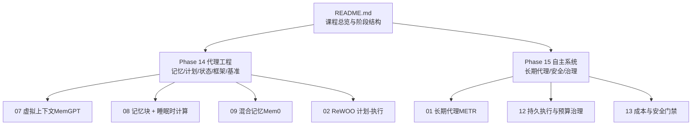
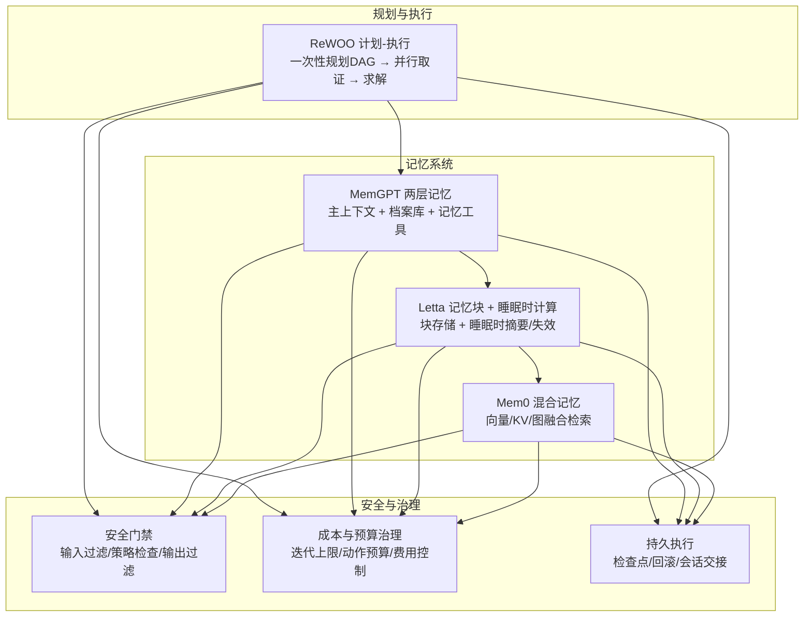
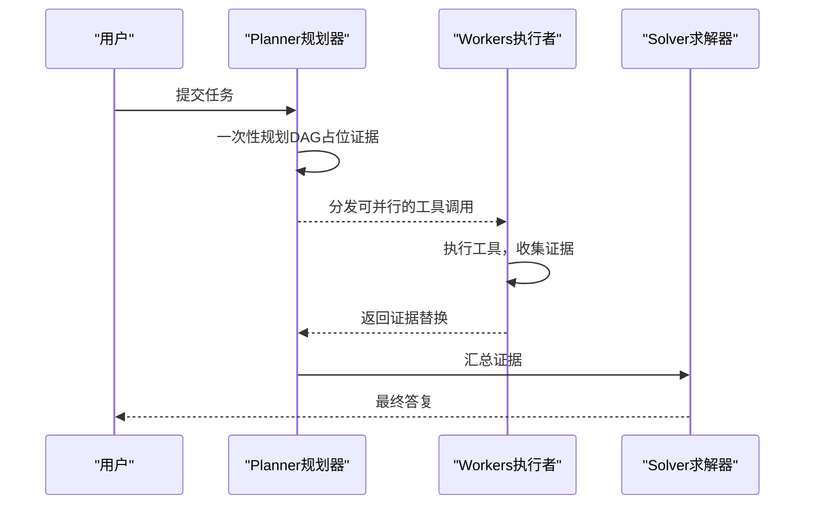
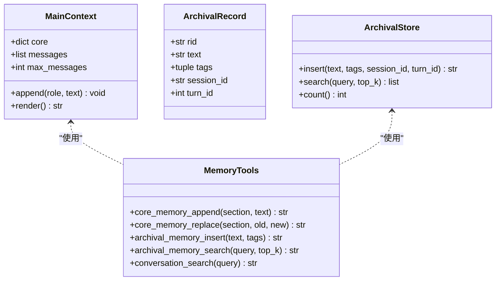
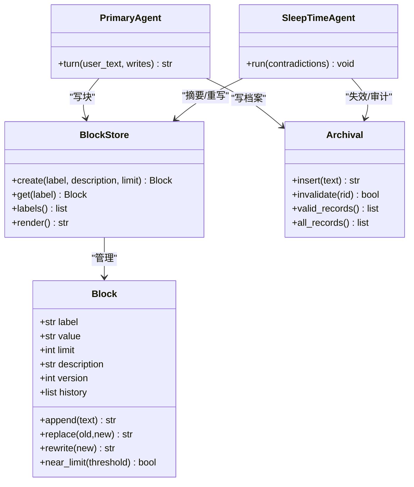
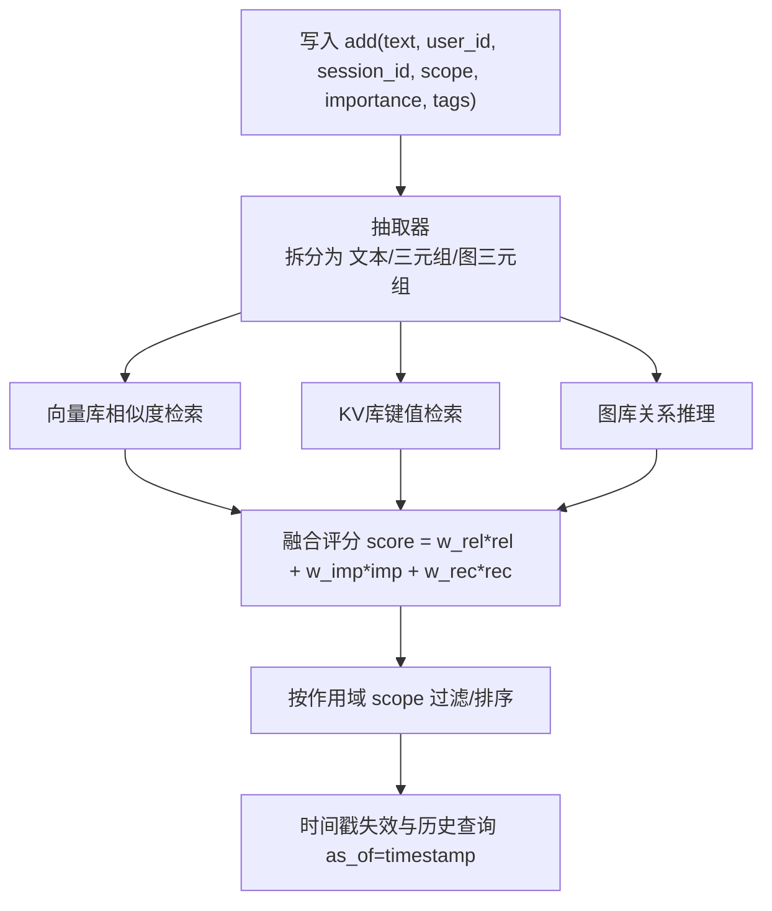
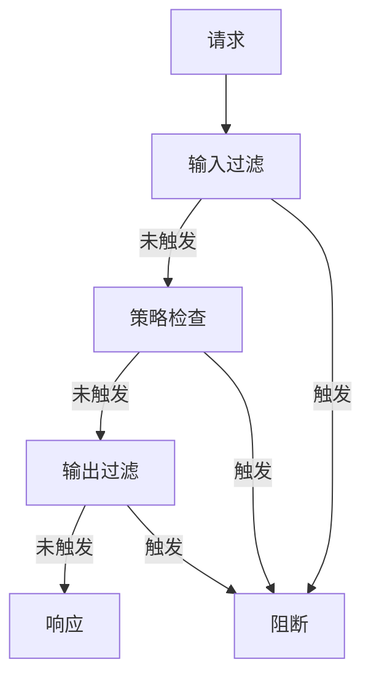
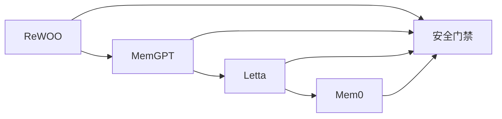

# 长期智能体

<cite>
**本文档引用的文件**
- [README.md](file://README.md)
- [AGENTS.md](file://AGENTS.md)
- [phases/14-agent-engineering/07-memory-virtual-context-memgpt/code/main.py](file://phases/14-agent-engineering/07-memory-virtual-context-memgpt/code/main.py)
- [phases/14-agent-engineering/08-memory-blocks-sleep-time-compute/code/main.py](file://phases/14-agent-engineering/08-memory-blocks-sleep-time-compute/code/main.py)
- [phases/14-agent-engineering/09-hybrid-memory-mem0/outputs/skill-hybrid-memory.md](file://phases/14-agent-engineering/09-hybrid-memory-mem0/outputs/skill-hybrid-memory.md)
- [phases/14-agent-engineering/07-memory-virtual-context-memgpt/outputs/skill-virtual-memory.md](file://phases/14-agent-engineering/07-memory-virtual-context-memgpt/outputs/skill-virtual-memory.md)
- [phases/14-agent-engineering/08-memory-blocks-sleep-time-compute/outputs/skill-memory-blocks.md](file://phases/14-agent-engineering/08-memory-blocks-sleep-time-compute/outputs/skill-memory-blocks.md)
- [guardrails-sandbox/backend/playground/modules/rewoo_planner.py](file://guardrails-sandbox/backend/playground/modules/rewoo_planner.py)
- [site/vue-app/summary/src/data/modules/rewoo-planner.js](file://site/vue-app/summary/src/data/modules/rewoo-planner.js)
- [site/vue-app/summary/src/data/content.js](file://site/vue-app/summary/src/data/content.js)
- [phases/19-capstone-projects/10-multi-agent-software-team/code/ts/src/agent.ts](file://phases/19-capstone-projects/10-multi-agent-software-team/code/ts/src/agent.ts)
- [phases/19-capstone-projects/01-terminal-native-coding-agent/code/ts/src/harness.ts](file://phases/19-capstone-projects/01-terminal-native-coding-agent/code/ts/src/harness.ts)
- [phases/19-capstone-projects/16-github-issue-to-pr-agent/code/main.py](file://phases/19-capstone-projects/16-github-issue-to-pr-agent/code/main.py)
- [site/figures-agents-alignment.js](file://site/figures-agents-alignment.js)
- [site/figures-frontier.js](file://site/figures-frontier.js)
</cite>

## 目录
1. [引言](#引言)
2. [项目结构](#项目结构)
3. [核心组件](#核心组件)
4. [架构总览](#架构总览)
5. [详细组件分析](#详细组件分析)
6. [依赖关系分析](#依赖关系分析)
7. [性能考量](#性能考量)
8. [故障排查指南](#故障排查指南)
9. [结论](#结论)
10. [附录](#附录)

## 引言
本文件面向“长期智能体”课程，系统阐述从简单聊天机器人到具备长期规划与执行能力的复杂智能体的演进路径。重点覆盖以下主题：
- 长期智能体的核心特征：记忆管理、计划制定、任务分解、进度跟踪、现实检查与安全门禁
- 从“ReWOO 计划-执行”到“记忆块 + 睡眠时计算”的渐进式能力升级
- 多级记忆体系（虚拟上下文、记忆块、混合记忆）的设计与实现
- 复杂任务中的状态管理与决策流程
- 现实检查机制与安全门禁的设计原理与落地方法
- 实际应用场景的优势与挑战

## 项目结构
本仓库是一个“从零到一”的AI工程课程体系，采用“阶段-课程-课时”的组织方式，每个课时包含“讲解文档、可运行代码、测试与产出物”。长期智能体相关内容主要分布在“代理工程（Phase 14）”与“前沿探索（Phase 15）”等阶段。

图示来源
- [README.md:57-81](file://README.md#L57-L81)
- [README.md:696-724](file://README.md#L696-L724)

章节来源
- [README.md:51-81](file://README.md#L51-L81)
- [README.md:696-724](file://README.md#L696-L724)

## 核心组件
围绕长期智能体，课程提供了三类关键能力模块：
- 记忆系统：两层（MemGPT）、三层（Letta）、混合（Mem0）
- 规划执行：ReWOO（一次性规划 + 并行取证 + 求解）
- 安全与现实检查：安全门禁、成本与预算治理、持久执行

章节来源
- [phases/14-agent-engineering/07-memory-virtual-context-memgpt/outputs/skill-virtual-memory.md:10-34](file://phases/14-agent-engineering/07-memory-virtual-context-memgpt/outputs/skill-virtual-memory.md#L10-L34)
- [phases/14-agent-engineering/08-memory-blocks-sleep-time-compute/outputs/skill-memory-blocks.md:10-34](file://phases/14-agent-engineering/08-memory-blocks-sleep-time-compute/outputs/skill-memory-blocks.md#L10-L34)
- [phases/14-agent-engineering/09-hybrid-memory-mem0/outputs/skill-hybrid-memory.md:10-33](file://phases/14-agent-engineering/09-hybrid-memory-mem0/outputs/skill-hybrid-memory.md#L10-L33)
- [guardrails-sandbox/backend/playground/modules/rewoo_planner.py:1-171](file://guardrails-sandbox/backend/playground/modules/rewoo_planner.py#L1-L171)

## 架构总览
下图展示了从“ReWOO 规划-执行”到“记忆块 + 睡眠时计算”的能力演进，以及与安全门禁的关系。

图示来源
- [guardrails-sandbox/backend/playground/modules/rewoo_planner.py:1-10](file://guardrails-sandbox/backend/playground/modules/rewoo_planner.py#L1-L10)
- [site/figures-agents-alignment.js:366-391](file://site/figures-agents-alignment.js#L366-L391)
- [site/figures-frontier.js:142-157](file://site/figures-frontier.js#L142-L157)

## 详细组件分析

### 组件A：ReWOO 计划-执行
ReWOO 将“思考”和“执行”解耦：先一次性规划整张 DAG，再按依赖顺序并行取证，最后汇总求解。相比 ReAct 的历史拼接，ReWOO 在长程任务上显著节省 token。

图示来源
- [guardrails-sandbox/backend/playground/modules/rewoo_planner.py:1-10](file://guardrails-sandbox/backend/playground/modules/rewoo_planner.py#L1-L10)
- [site/vue-app/summary/src/data/modules/rewoo-planner.js:121-165](file://site/vue-app/summary/src/data/modules/rewoo-planner.js#L121-L165)

章节来源
- [guardrails-sandbox/backend/playground/modules/rewoo_planner.py:1-171](file://guardrails-sandbox/backend/playground/modules/rewoo_planner.py#L1-L171)
- [site/vue-app/summary/src/data/modules/rewoo-planner.js:121-165](file://site/vue-app/summary/src/data/modules/rewoo-planner.js#L121-L165)
- [site/vue-app/summary/src/data/content.js:1252-1269](file://site/vue-app/summary/src/data/content.js#L1252-L1269)

### 组件B：MemGPT 两层记忆（主上下文 + 档案库）
MemGPT 形状的记忆系统包含：
- 主上下文（固定窗口，FIFO，溢出进入档案）
- 档案库（支持插入/搜索，记录带标识与时间戳）
- 记忆工具（核心记忆追加/替换、档案插入/搜索、对话检索）

图示来源
- [phases/14-agent-engineering/07-memory-virtual-context-memgpt/code/main.py:21-119](file://phases/14-agent-engineering/07-memory-virtual-context-memgpt/code/main.py#L21-L119)

章节来源
- [phases/14-agent-engineering/07-memory-virtual-context-memgpt/code/main.py:1-198](file://phases/14-agent-engineering/07-memory-virtual-context-memgpt/code/main.py#L1-L198)
- [phases/14-agent-engineering/07-memory-virtual-context-memgpt/outputs/skill-virtual-memory.md:10-34](file://phases/14-agent-engineering/07-memory-virtual-context-memgpt/outputs/skill-virtual-memory.md#L10-L34)

### 组件C：Letta 记忆块 + 睡眠时计算
Letta 的三层记忆（块/回忆/档案）与“睡眠时计算”分离关键路径，确保主回合低延迟，同时进行摘要、去重、失效处理。

图示来源
- [phases/14-agent-engineering/08-memory-blocks-sleep-time-compute/code/main.py:14-245](file://phases/14-agent-engineering/08-memory-blocks-sleep-time-compute/code/main.py#L14-L245)

章节来源
- [phases/14-agent-engineering/08-memory-blocks-sleep-time-compute/code/main.py:1-245](file://phases/14-agent-engineering/08-memory-blocks-sleep-time-compute/code/main.py#L1-L245)
- [phases/14-agent-engineering/08-memory-blocks-sleep-time-compute/outputs/skill-memory-blocks.md:10-34](file://phases/14-agent-engineering/08-memory-blocks-sleep-time-compute/outputs/skill-memory-blocks.md#L10-L34)

### 组件D：Mem0 混合记忆（向量/KV/图融合）
Mem0 的三存储融合方案，提供：
- 写入时抽取为“文本记录 + KV三元组 + 图三元组”
- 融合评分（相关性×权重 + 重要性×权重 + 时效×权重）
- 作用域隔离与时间戳失效，支持历史查询

图示来源
- [phases/14-agent-engineering/09-hybrid-memory-mem0/outputs/skill-hybrid-memory.md:10-33](file://phases/14-agent-engineering/09-hybrid-memory-mem0/outputs/skill-hybrid-memory.md#L10-L33)

章节来源
- [phases/14-agent-engineering/09-hybrid-memory-mem0/outputs/skill-hybrid-memory.md:10-33](file://phases/14-agent-engineering/09-hybrid-memory-mem0/outputs/skill-hybrid-memory.md#L10-L33)

### 组件E：现实检查与安全门禁
安全门禁由“输入过滤 → 策略检查 → 输出过滤”三级组成，任一级触发即阻断。结合成本与预算治理（迭代上限、动作预算、费用控制）与持久执行（检查点/回滚/会话交接），形成闭环。

图示来源
- [site/figures-agents-alignment.js:366-391](file://site/figures-agents-alignment.js#L366-L391)

章节来源
- [site/figures-agents-alignment.js:366-391](file://site/figures-agents-alignment.js#L366-L391)

## 依赖关系分析
- 记忆系统之间存在“渐进式增强”关系：MemGPT（两层）→ Letta（三层+睡眠）→ Mem0（融合）
- 规划执行与记忆系统相互补充：ReWOO 的一次性规划减少主上下文压力，配合记忆系统进行证据检索与沉淀
- 安全门禁贯穿所有组件，作为统一的“现实检查”机制

图示来源
- [guardrails-sandbox/backend/playground/modules/rewoo_planner.py:1-10](file://guardrails-sandbox/backend/playground/modules/rewoo_planner.py#L1-L10)
- [site/figures-agents-alignment.js:366-391](file://site/figures-agents-alignment.js#L366-L391)

章节来源
- [guardrails-sandbox/backend/playground/modules/rewoo_planner.py:1-171](file://guardrails-sandbox/backend/playground/modules/rewoo_planner.py#L1-L171)
- [site/figures-agents-alignment.js:366-391](file://site/figures-agents-alignment.js#L366-L391)

## 性能考量
- ReWOO 在长程任务中显著降低 token 消耗，适合“先规划后执行”的模式
- 记忆块 + 睡眠时计算将摘要与失效处理移出关键路径，降低主回合延迟
- Mem0 的融合评分与作用域隔离提升检索效率与隐私合规
- 成本与预算治理（迭代上限、动作预算、费用控制）保障长期运行稳定性

## 故障排查指南
- 记忆块膨胀：当块接近上限时，应通过摘要压缩避免超限
- 静默漂移：对块的修改需版本化并可追踪差异
- 投毒巩固：睡眠时计算接口需纳入安全审查，防止恶意内容被巩固
- 档案失效策略：冲突时应标记无效而非删除，保留审计线索
- 安全门禁：若出现阻断，检查三级门禁的触发条件与日志

章节来源
- [phases/14-agent-engineering/08-memory-blocks-sleep-time-compute/outputs/skill-memory-blocks.md:21-32](file://phases/14-agent-engineering/08-memory-blocks-sleep-time-compute/outputs/skill-memory-blocks.md#L21-L32)
- [phases/14-agent-engineering/09-hybrid-memory-mem0/outputs/skill-hybrid-memory.md:20-31](file://phases/14-agent-engineering/09-hybrid-memory-mem0/outputs/skill-hybrid-memory.md#L20-L31)
- [site/figures-agents-alignment.js:366-391](file://site/figures-agents-alignment.js#L366-L391)

## 结论
长期智能体的关键在于“可扩展的记忆体系 + 清晰的规划执行 + 严格的现实检查”。课程通过 MemGPT、Letta、Mem0 的渐进式设计，以及 ReWOO 的规划-执行范式，为复杂任务的状态管理与决策过程提供了工程化的实现路径。结合安全门禁与成本治理，长期智能体能够在真实场景中稳定、可控地演进。

## 附录
- 课程规范与产出要求参见 AGENTS.md，确保每个课时的“讲解文档、可运行代码、测试与可复用产物”完整交付
- 多智能体协作与状态机模式可参考 Phase 16 的相关课程与实战项目

章节来源
- [AGENTS.md:1-219](file://AGENTS.md#L1-L219)