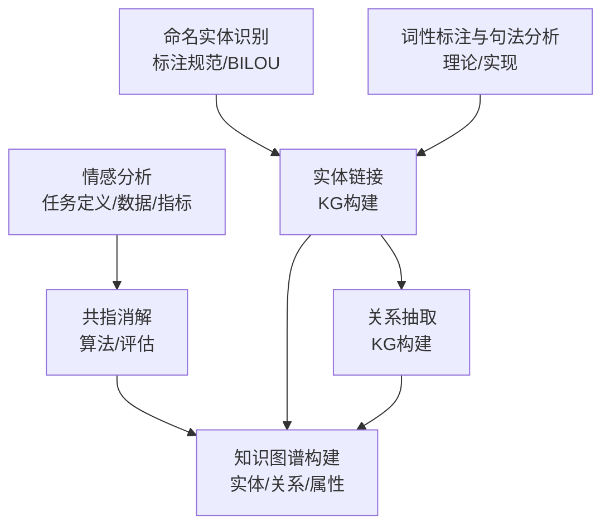
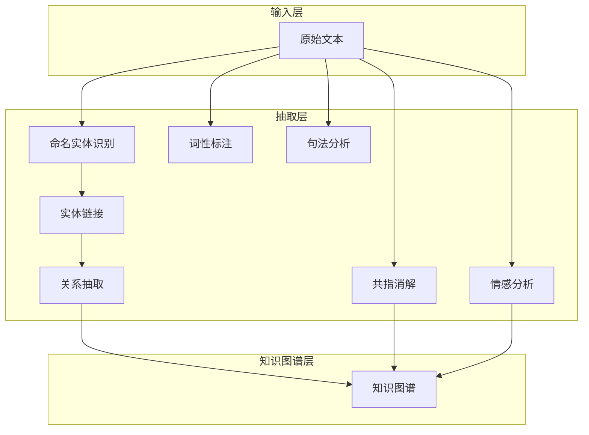
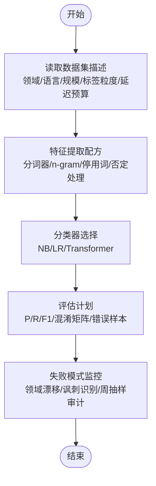
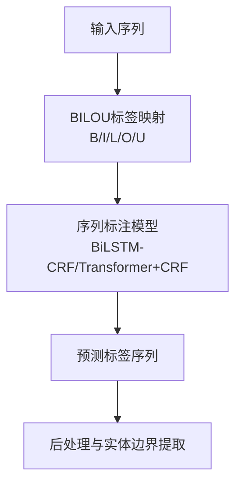
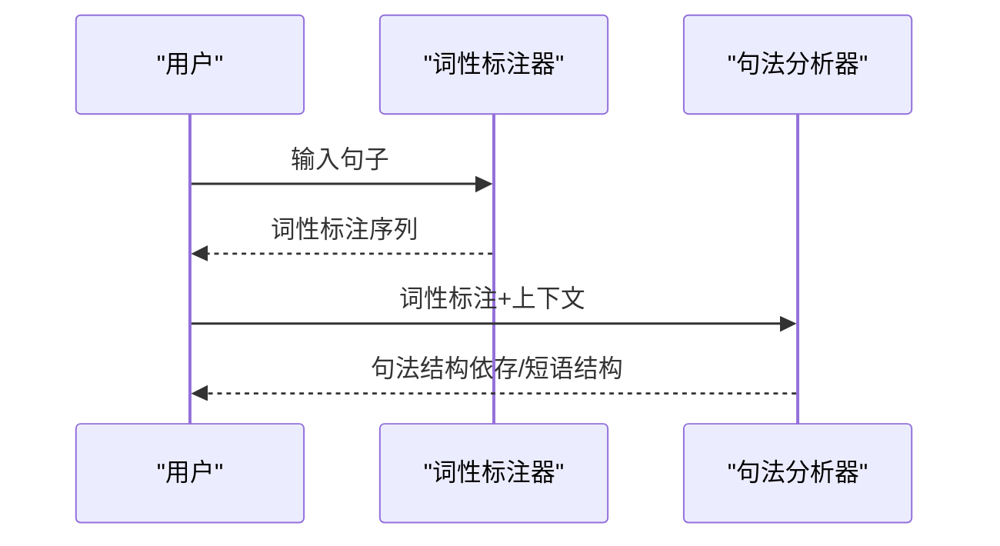
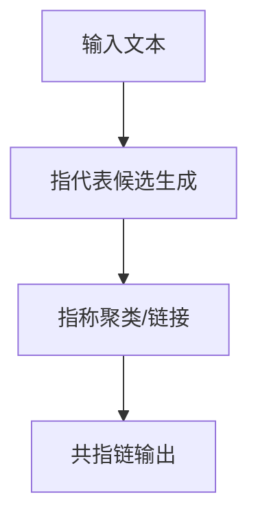
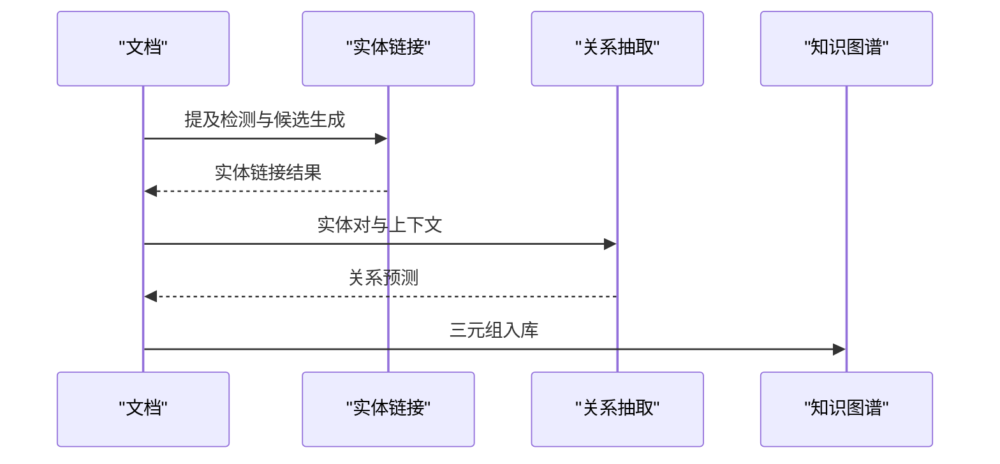
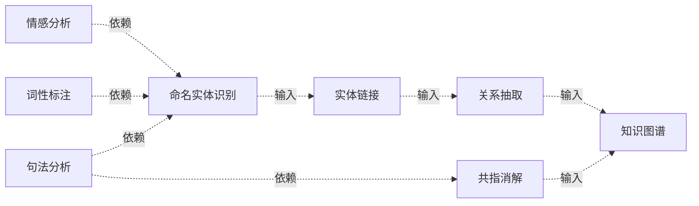

# 信息抽取与理解

<cite>
**本文引用的文件**
- [sentiment-baseline.md](file://phases/05-nlp-foundations-to-advanced/05-sentiment-analysis/outputs/prompt-sentiment-baseline.md)
- [sentiment.svg](file://phases/05-nlp-foundations-to-advanced/05-sentiment-analysis/assets/sentiment.svg)
- [pos-parse.svg](file://phases/05-nlp-foundations-to-advanced/07-pos-tagging-parsing/assets/pos-parse.svg)
- [prompt-coreference-resolution.md](file://phases/05-nlp-foundations-to-advanced/24-coreference-resolution/outputs/prompt-coreference-resolution.md)
- [prompt-entity-linking.md](file://phases/05-nlp-foundations-to-advanced/25-entity-linking/outputs/prompt-entity-linking.md)
- [prompt-relation-extraction-kg.md](file://phases/05-nlp-foundations-to-advanced/26-relation-extraction-kg/outputs/prompt-relation-extraction-kg.md)
- [README.md](file://README.md)
</cite>

## 目录
1. [引言](#引言)
2. [项目结构](#项目结构)
3. [核心组件](#核心组件)
4. [架构总览](#架构总览)
5. [详细组件分析](#详细组件分析)
6. [依赖分析](#依赖分析)
7. [性能考虑](#性能考虑)
8. [故障排查指南](#故障排查指南)
9. [结论](#结论)
10. [附录](#附录)

## 引言
本课程围绕“信息抽取与理解”展开，系统讲解文本层面的关键任务：情感分析、命名实体识别（NER）、词性标注与句法分析、共指消解、实体链接与关系抽取，并结合知识图谱构建进行端到端实践。文档以仓库中各阶段课程输出的提示模板与示意图为基础，梳理任务定义、数据与标注、模型与评估方法，并给出可复用的实现与评估流程。

## 项目结构
本仓库为“从零开始的AI工程”系列课程资料，其中与信息抽取直接相关的内容主要分布在“NLP基础到进阶”阶段的多个子模块中，包含：
- 情感分析：任务定义、特征工程、分类器选择、评估计划与失败模式监控
- 命名实体识别：标注规范与BILOU标签体系
- 词性标注与句法分析：理论基础与实现方法
- 共指消解：算法与评估方法
- 实体链接与关系抽取：在知识图谱构建中的作用
- 知识图谱构建：实体链接与关系抽取的集成

**章节来源**
- [README.md](file://README.md)

## 核心组件
本节聚焦于信息抽取与理解课程的核心任务与对应的教学材料，包括：
- 情感分析：特征提取、分类器、评估计划与失败模式
- 命名实体识别：标注规范与BILOU标签体系
- 词性标注与句法分析：理论基础与实现方法
- 共指消解：算法与评估方法
- 实体链接与关系抽取：在知识图谱构建中的作用

**章节来源**
- [sentiment-baseline.md](file://phases/05-nlp-foundations-to-advanced/05-sentiment-analysis/outputs/prompt-sentiment-baseline.md)
- [sentiment.svg](file://phases/05-nlp-foundations-to-advanced/05-sentiment-analysis/assets/sentiment.svg)
- [pos-parse.svg](file://phases/05-nlp-foundations-to-advanced/07-pos-tagging-parsing/assets/pos-parse.svg)
- [prompt-coreference-resolution.md](file://phases/05-nlp-foundations-to-advanced/24-coreference-resolution/outputs/prompt-coreference-resolution.md)
- [prompt-entity-linking.md](file://phases/05-nlp-foundations-to-advanced/25-entity-linking/outputs/prompt-entity-linking.md)
- [prompt-relation-extraction-kg.md](file://phases/05-nlp-foundations-to-advanced/26-relation-extraction-kg/outputs/prompt-relation-extraction-kg.md)

## 架构总览
下图展示信息抽取与理解课程的知识流与任务流：从文本预处理到多类抽取任务，再到知识图谱构建。

**图表来源**
- [sentiment.svg](file://phases/05-nlp-foundations-to-advanced/05-sentiment-analysis/assets/sentiment.svg)
- [pos-parse.svg](file://phases/05-nlp-foundations-to-advanced/07-pos-tagging-parsing/assets/pos-parse.svg)

## 详细组件分析

### 情感分析
- 任务定义与目标：对文本进行二元或多元情感分类，明确标签粒度（如积极/消极 vs 多情感类别），并考虑跨语言与领域适应需求。
- 数据与标注：根据数据集描述（领域、语言、规模、标签粒度、延迟预算）设计特征提取方案；强调不单独报告准确率，需报告精确率、召回率、F1与混淆矩阵。
- 特征工程：指定分词器、n-gram范围、停用词策略（通常保留）、否定处理（作用域前缀或二元组）。
- 分类器选择：基线使用朴素贝叶斯，生产环境倾向逻辑回归；仅当需要讽刺、方面级输出或跨语言覆盖时采用Transformer。
- 评估与监控：除标准指标外，建议每周抽样审计，重点关注领域漂移与讽刺识别两类失败模式；对词级子词丰富的语言（如德语、芬兰语、土耳其语）优先使用FastText或Transformer嵌入而非词级TF-IDF。

**图表来源**
- [sentiment-baseline.md](file://phases/05-nlp-foundations-to-advanced/05-sentiment-analysis/outputs/prompt-sentiment-baseline.md)

**章节来源**
- [sentiment-baseline.md](file://phases/05-nlp-foundations-to-advanced/05-sentiment-analysis/outputs/prompt-sentiment-baseline.md)
- [sentiment.svg](file://phases/05-nlp-foundations-to-advanced/05-sentiment-analysis/assets/sentiment.svg)

### 命名实体识别（NER）
- 标注规范：明确实体边界与类型，统一标注风格，确保训练与测试一致。
- BILOU标签体系：B（Begin）、I（Inside）、L（Last）、O（Outside）、U（Unit），用于清晰表达单字词、多字词首尾与内部位置，提升边界识别稳定性。
- 实现要点：结合上下文窗口与序列标注模型（如BiLSTM-CRF或Transformer+CRF），在大规模标注数据上进行训练与验证。

**章节来源**
- [pos-parse.svg](file://phases/05-nlp-foundations-to-advanced/07-pos-tagging-parsing/assets/pos-parse.svg)

### 词性标注与句法分析
- 词性标注：基于规则或统计模型（如HMM、CRF）对每个词进行词性标注，作为句法分析的基础。
- 句法分析：解析句子的语法结构（依存关系或短语结构树），为下游任务（如共指消解、关系抽取）提供句法约束。
- 实现方法：可采用基于转移系统的依存解析（如弧标准算法）或基于转换的PCFG解析；结合上下文表示（如ELMo、BERT）提升泛化能力。

**章节来源**
- [pos-parse.svg](file://phases/05-nlp-foundations-to-advanced/07-pos-tagging-parsing/assets/pos-parse.svg)

### 共指消解
- 任务定义：识别并归并文本中指向同一实体的不同表达（代词、名词短语等），形成一致的实体链。
- 算法思路：通常分为两步——指代表候选生成（anaphoric mention detection）与指称聚类（coreference clustering）。常用方法包括基于规则、特征工程的分类器，以及基于上下文表示的神经网络（如SpanBERT+Clustering）。
- 评估方法：采用Mention-F1、MUC、BCubed、CEAF等指标，关注跨句一致性与歧义消解效果。

**章节来源**
- [prompt-coreference-resolution.md](file://phases/05-nlp-foundations-to-advanced/24-coreference-resolution/outputs/prompt-coreference-resolution.md)

### 实体链接与关系抽取（知识图谱构建）
- 实体链接：将文档中的提及（mention）链接到知识库中的实体（如Wikidata/KBpedia），常通过候选实体检索、实体打分与排序、正则化与去歧义完成。
- 关系抽取：识别实体之间的语义关系（如“位于”、“继承”、“作者”），可采用基于规则、模板匹配、分类器或端到端的联合抽取方法。
- 在知识图谱构建中的作用：实体链接提供实体节点，关系抽取提供边，二者共同构成三元组（头实体-关系-尾实体），支撑KG的构建与推理。

**章节来源**
- [prompt-entity-linking.md](file://phases/05-nlp-foundations-to-advanced/25-entity-linking/outputs/prompt-entity-linking.md)
- [prompt-relation-extraction-kg.md](file://phases/05-nlp-foundations-to-advanced/26-relation-extraction-kg/outputs/prompt-relation-extraction-kg.md)

## 依赖分析
- 组件耦合：情感分析与NER相对独立；POS/句法分析为NER与共指消解提供句法约束；实体链接与关系抽取依赖NER产出的实体边界；共指消解与实体链接均可服务于知识图谱的实体一致性与结构完整性。
- 外部依赖：标注工具（如BRAT）、序列标注框架（如spaCy、Stanza、HuggingFace Transformers）、评测工具（如scikit-learn指标、自定义评估脚本）。
- 风险点：标注不一致、标签不平衡、领域漂移、讽刺与隐含语义导致的误判。

**章节来源**
- [sentiment-baseline.md](file://phases/05-nlp-foundations-to-advanced/05-sentiment-analysis/outputs/prompt-sentiment-baseline.md)
- [prompt-coreference-resolution.md](file://phases/05-nlp-foundations-to-advanced/24-coreference-resolution/outputs/prompt-coreference-resolution.md)
- [prompt-entity-linking.md](file://phases/05-nlp-foundations-to-advanced/25-entity-linking/outputs/prompt-entity-linking.md)
- [prompt-relation-extraction-kg.md](file://phases/05-nlp-foundations-to-advanced/26-relation-extraction-kg/outputs/prompt-relation-extraction-kg.md)

## 性能考虑
- 训练效率：合理划分训练/验证/测试集，避免数据泄露；针对不平衡数据采用重采样或代价敏感学习。
- 推理效率：在资源受限场景下，优先轻量模型（如Distilled-BERT）或量化部署；利用缓存与批处理优化吞吐。
- 可解释性：对关键决策（如实体链接置信度阈值、关系抽取置信度）设置可视化与日志记录，便于回溯与调优。
- 可扩展性：将各模块封装为服务接口，支持异步与流水线化处理，便于在生产环境中组合与扩展。

## 故障排查指南
- 标注问题：检查标注一致性与边界是否遵循BILOU规范；对冲突样本进行人工复核。
- 模型问题：若出现高准确但低F1，检查类别不平衡与阈值设定；对讽刺与反讽样本增加数据或引入对抗训练。
- 评估问题：确保评估指标覆盖多类别与混淆矩阵；对错误样本进行根因分析（如领域漂移、噪声标注）。
- 集成问题：在实体链接与关系抽取之间建立统一的实体标识符（如QID），避免重复与歧义。

## 结论
本课程通过一系列提示模板与示意图，系统呈现了信息抽取与理解的关键任务与实现路径。从情感分析的特征与评估，到NER的BILOU标注，再到POS/句法分析、共指消解、实体链接与关系抽取，最终落点于知识图谱构建。建议在实践中以模块化方式推进，持续迭代标注与模型，并以严格的评估与监控保障上线质量。

## 附录
- 术语与概念：可参考课程README与术语表，理解课程背景与术语定义。
- 示例流程：结合各阶段输出的提示模板，形成从数据准备到模型评估再到知识图谱落地的完整工作流。

**章节来源**
- [README.md](file://README.md)