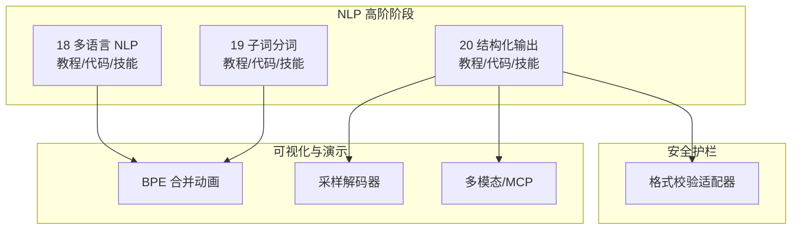
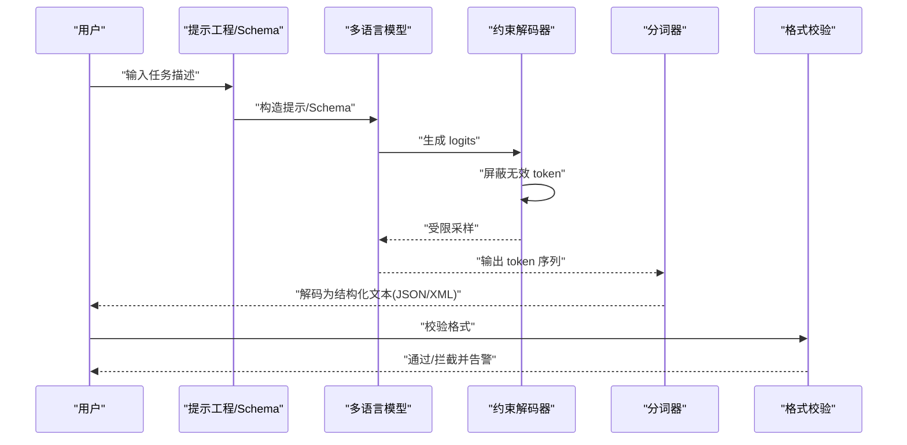
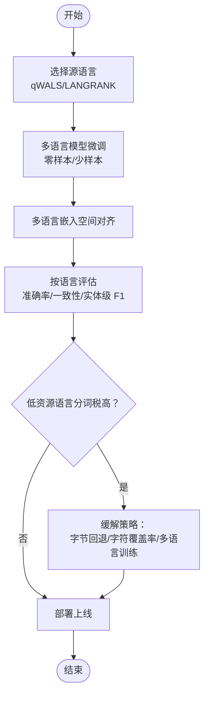
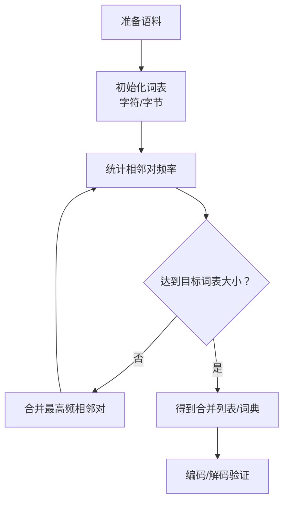
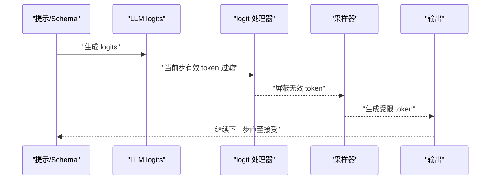
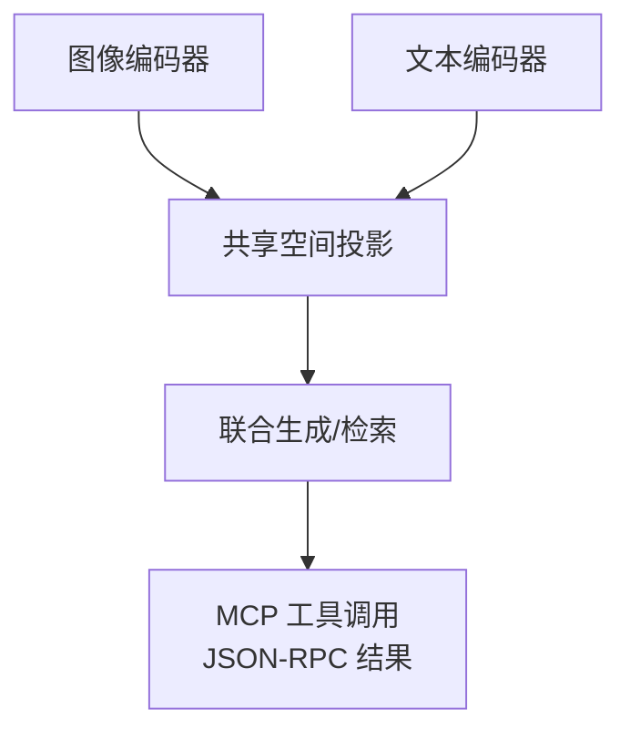
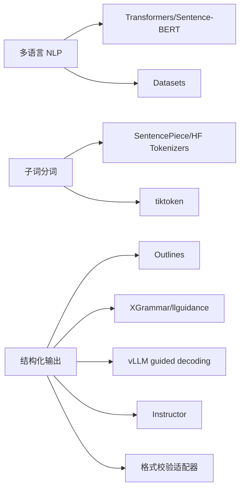

# 多语言处理与结构化输出

<cite>
**本文引用的文件**
- [多语言 NLP 教程](file://phases/05-nlp-foundations-to-advanced/18-multilingual-nlp/docs/zh.md)
- [多语言 NLP 代码](file://phases/05-nlp-foundations-to-advanced/18-multilingual-nlp/code/main.py)
- [多语言技能清单](file://phases/05-nlp-foundations-to-advanced/18-multilingual-nlp/outputs/skill-multilingual-picker.md)
- [子词分词教程](file://phases/05-nlp-foundations-to-advanced/19-subword-tokenization/docs/zh.md)
- [子词分词代码](file://phases/05-nlp-foundations-to-advanced/19-subword-tokenization/code/main.py)
- [子词分词技能清单](file://phases/05-nlp-foundations-to-advanced/19-subword-tokenization/outputs/skill-bpe-vs-wordpiece.md)
- [结构化输出教程](file://phases/05-nlp-foundations-to-advanced/20-structured-outputs-constrained-decoding/docs/zh.md)
- [结构化输出代码](file://phases/05-nlp-foundations-to-advanced/20-structured-outputs-constrained-decoding/code/main.py)
- [结构化输出技能清单](file://phases/05-nlp-foundations-to-advanced/20-structured-outputs-constrained-decoding/outputs/skill-structured-output-picker.md)
- [格式校验适配器](file://guardrails-sandbox/backend/adapters/format_validator.py)
- [站点数据索引](file://site/data.js)
- [BPE 合并动画](file://site/figures-transformers.js)
- [采样解码器](file://site/lesson-figures.js)
- [多模态融合与 MCP 工具调用](file://site/figures-llms-systems.js)
- [中文嵌入示例](file://test_embedding.py)
</cite>

## 目录
1. [引言](#引言)
2. [项目结构](#项目结构)
3. [核心组件](#核心组件)
4. [架构总览](#架构总览)
5. [详细组件分析](#详细组件分析)
6. [依赖分析](#依赖分析)
7. [性能考虑](#性能考虑)
8. [故障排查指南](#故障排查指南)
9. [结论](#结论)
10. [附录](#附录)

## 引言
本课程围绕“多语言处理与结构化输出”两大主题展开，系统讲解以下关键能力：
- 多语言 NLP 的挑战与解决方案：语言检测、跨语言迁移、多语言预训练模型、分词税与低资源语言的应对策略。
- 子词分词技术：BPE、WordPiece、Unigram、SentencePiece 的原理与实践，以及在不同部署目标下的选择策略。
- 结构化输出与约束解码：将 JSON/XML 等结构化格式直接作为模型输出，结合 Outlines、XGrammar、vLLM 等工具实现 100% 有效输出。
- 实战案例：多语言模型微调、子词分词器训练、结构化生成与格式校验。

## 项目结构
本仓库采用“阶段化课程 + 实践代码 + 可视化演示 + 安全护栏”的组织方式，多语言与结构化输出相关内容主要集中在 NLP 高阶阶段的第 18、19、20 课，配套可视化与实战代码。

图表来源
- [站点数据索引:1040-1062](file://site/data.js#L1040-L1062)
- [BPE 合并动画:230-306](file://site/figures-transformers.js#L230-L306)
- [采样解码器:341-365](file://site/lesson-figures.js#L341-L365)
- [多模态融合与 MCP 工具调用:552-564](file://site/figures-llms-systems.js#L552-L564)
- [格式校验适配器:1-86](file://guardrails-sandbox/backend/adapters/format_validator.py#L1-L86)

章节来源
- [站点数据索引:1040-1062](file://site/data.js#L1040-L1062)

## 核心组件
- 多语言 NLP：涵盖零样本/少样本迁移、共享词表与嵌入空间、源语言选择策略、低资源语言的“分词税”问题与缓解方案。
- 子词分词：从零实现 BPE、SentencePiece 实践、tiktoken 使用、Unigram/WordPiece 差异与选择。
- 结构化输出：提示工程、原生结构化输出 API、约束解码（FSM/CFG）、Instructor 重试模式、vLLM guided decoding。
- 安全护栏：格式校验适配器，拦截 JSON/代码块/空输出等格式问题。

章节来源
- [多语言 NLP 教程:1-220](file://phases/05-nlp-foundations-to-advanced/18-multilingual-nlp/docs/zh.md#L1-L220)
- [子词分词教程:1-187](file://phases/05-nlp-foundations-to-advanced/19-subword-tokenization/docs/zh.md#L1-L187)
- [结构化输出教程:1-223](file://phases/05-nlp-foundations-to-advanced/20-structured-outputs-constrained-decoding/docs/zh.md#L1-L223)
- [格式校验适配器:1-86](file://guardrails-sandbox/backend/adapters/format_validator.py#L1-L86)

## 架构总览
下图展示从“输入文本”到“结构化输出”的端到端流程，强调多语言模型、子词分词与约束解码的协同作用。

图表来源
- [结构化输出教程:24-54](file://phases/05-nlp-foundations-to-advanced/20-structured-outputs-constrained-decoding/docs/zh.md#L24-L54)
- [格式校验适配器:22-85](file://guardrails-sandbox/backend/adapters/format_validator.py#L22-L85)

## 详细组件分析

### 多语言 NLP 组件分析
- 跨语言迁移与嵌入空间：XLM-R、mBERT、NLLB 等模型在多语言嵌入空间中实现语义对齐，零样本/少样本微调显著降低长尾语言的标注成本。
- 源语言选择：qWALS/LANGRANK 等语言相似性指标表明，类型学相近的高资源语言（如印地语对马拉地语）可能优于英语作为源语言。
- 分词税与低资源语言：共享分词器导致低资源语言出现“繁殖率税/变体恢复税/容量外溢税”，需通过字节回退、字符覆盖率与多语言训练缓解。

图表来源
- [多语言 NLP 教程:44-170](file://phases/05-nlp-foundations-to-advanced/18-multilingual-nlp/docs/zh.md#L44-L170)
- [多语言 NLP 代码:23-34](file://phases/05-nlp-foundations-to-advanced/18-multilingual-nlp/code/main.py#L23-L34)

章节来源
- [多语言 NLP 教程:1-220](file://phases/05-nlp-foundations-to-advanced/18-multilingual-nlp/docs/zh.md#L1-L220)
- [多语言 NLP 代码:1-55](file://phases/05-nlp-foundations-to-advanced/18-multilingual-nlp/code/main.py#L1-L55)
- [多语言技能清单:1-18](file://phases/05-nlp-foundations-to-advanced/18-multilingual-nlp/outputs/skill-multilingual-picker.md#L1-L18)

### 子词分词组件分析
- BPE：从字符对频率统计出发，逐步合并高频相邻对，适合 GPT 系列与主流 LLM。
- Unigram/WordPiece：Unigram 基于对数似然剪枝，WordPiece 基于似然最大化合并，适合 T5/BERT 等。
- SentencePiece/tiktoken：SentencePiece 直接在原始文本上训练 BPE/Unigram；tiktoken 针对 OpenAI 词汇表的快速编码。
- 实践要点：分词器漂移、空白符歧义、多语言覆盖、表情符号处理。

图表来源
- [子词分词教程:42-122](file://phases/05-nlp-foundations-to-advanced/19-subword-tokenization/docs/zh.md#L42-L122)
- [BPE 合并动画:230-306](file://site/figures-transformers.js#L230-L306)
- [子词分词代码:40-70](file://phases/05-nlp-foundations-to-advanced/19-subword-tokenization/code/main.py#L40-L70)

章节来源
- [子词分词教程:1-187](file://phases/05-nlp-foundations-to-advanced/19-subword-tokenization/docs/zh.md#L1-L187)
- [子词分词代码:1-112](file://phases/05-nlp-foundations-to-advanced/19-subword-tokenization/code/main.py#L1-L112)
- [子词分词技能清单:1-19](file://phases/05-nlp-foundations-to-advanced/19-subword-tokenization/outputs/skill-bpe-vs-wordpiece.md#L1-L19)

### 结构化输出与约束解码组件分析
- 三层方法论：提示工程（约 80%）、原生结构化输出 API（供应商锁定）、约束解码（100% 有效，通用）。
- 技术实现：Outlines（FSM）、XGrammar/llguidance（CFG）、vLLM guided decoding、Instructor（重试 + Pydantic）。
- 关键陷阱：字段顺序（推理在前）、递归 Schema（需 CFG）、过大枚举（检索 + 约束）、过早承诺（先推理后结论）。

图表来源
- [结构化输出教程:24-54](file://phases/05-nlp-foundations-to-advanced/20-structured-outputs-constrained-decoding/docs/zh.md#L24-L54)
- [采样解码器:341-365](file://site/lesson-figures.js#L341-L365)

章节来源
- [结构化输出教程:1-223](file://phases/05-nlp-foundations-to-advanced/20-structured-outputs-constrained-decoding/docs/zh.md#L1-L223)
- [结构化输出代码:1-129](file://phases/05-nlp-foundations-to-advanced/20-structured-outputs-constrained-decoding/code/main.py#L1-L129)
- [结构化输出技能清单:1-18](file://phases/05-nlp-foundations-to-advanced/20-structured-outputs-constrained-decoding/outputs/skill-structured-output-picker.md#L1-L18)

### 多模态与工具协议中的结构化输出
- 多模态融合：图像/文本投影到共享空间，便于跨模态检索与生成。
- MCP 工具调用：客户端与服务端通过 JSON-RPC 交换结构化结果，便于将结构化输出接入下游系统。

图表来源
- [多模态融合与 MCP 工具调用:441-462](file://site/figures-llms-systems.js#L441-L462)
- [多模态融合与 MCP 工具调用:552-564](file://site/figures-llms-systems.js#L552-L564)

## 依赖分析
- 多语言 NLP 依赖：Transformers、Sentence-BERT、Datasets、Scikit-learn。
- 子词分词依赖：SentencePiece、HF Tokenizers、tiktoken。
- 结构化输出依赖：Outlines、XGrammar/llguidance、vLLM、Instructor、JSON Schema。
- 安全护栏依赖：格式校验适配器（JSON 解析、代码块闭合、空输出检测）。

图表来源
- [多语言 NLP 教程:30-42](file://phases/05-nlp-foundations-to-advanced/18-multilingual-nlp/docs/zh.md#L30-L42)
- [子词分词教程:30-36](file://phases/05-nlp-foundations-to-advanced/19-subword-tokenization/docs/zh.md#L30-L36)
- [结构化输出教程:30-35](file://phases/05-nlp-foundations-to-advanced/20-structured-outputs-constrained-decoding/docs/zh.md#L30-L35)
- [格式校验适配器:1-20](file://guardrails-sandbox/backend/adapters/format_validator.py#L1-L20)

章节来源
- [多语言 NLP 教程:30-42](file://phases/05-nlp-foundations-to-advanced/18-multilingual-nlp/docs/zh.md#L30-L42)
- [子词分词教程:30-36](file://phases/05-nlp-foundations-to-advanced/19-subword-tokenization/docs/zh.md#L30-L36)
- [结构化输出教程:30-35](file://phases/05-nlp-foundations-to-advanced/20-structured-outputs-constrained-decoding/docs/zh.md#L30-L35)
- [格式校验适配器:1-20](file://guardrails-sandbox/backend/adapters/format_validator.py#L1-L20)

## 性能考虑
- 多语言模型：XLM-R-base（~270M）在分类任务上性价比高；生成任务优先 mT5/NLLB/Aya-23。
- 子词分词：多语言场景推荐 SentencePiece（Unigram，character_coverage≈0.9995）；边缘推理可用 Unigram（较小词表）。
- 结构化输出：约束解码通常更快（搜索空间缩小 + 确定性前缀跳过）；Outlines/XGrammar 适合不同复杂度的 Schema。
- 安全护栏：格式校验开销极低，但能显著减少下游解析失败带来的系统性风险。

## 故障排查指南
- 格式校验失败
  - 现象：JSON 解析失败、Markdown 代码块未闭合、空输出。
  - 处理：启用格式校验适配器，记录错误类型与严重级别，必要时回退到重试策略。
- 分词器漂移
  - 现象：训练与部署使用不同词表，Token ID 不一致。
  - 处理：在 CI 中冻结 tokenizer.json 哈希，确保分词器一致性。
- 低资源语言异常
  - 现象：印地语/阿拉伯语等长尾语言 token 数激增、实体识别退化。
  - 处理：提高 character_coverage、启用字节回退、在目标语言上验证分词繁殖率。

章节来源
- [格式校验适配器:22-85](file://guardrails-sandbox/backend/adapters/format_validator.py#L22-L85)
- [子词分词教程:116-122](file://phases/05-nlp-foundations-to-advanced/19-subword-tokenization/docs/zh.md#L116-L122)
- [多语言 NLP 教程:159-170](file://phases/05-nlp-foundations-to-advanced/18-multilingual-nlp/docs/zh.md#L159-L170)

## 结论
- 多语言 NLP 通过共享表示与跨语言迁移，显著降低长尾语言标注成本；源语言选择与分词策略是关键。
- 子词分词平衡了词级与字符级的优势，是现代 LLM 的基础设施。
- 结构化输出通过约束解码实现 100% 有效输出，结合格式校验与重试策略，保障生产稳定性。
- 本课程提供了从原理到实践的完整路径，建议在真实项目中以“多语言模型 + 子词分词 + 约束解码 + 安全护栏”的组合方式落地。

## 附录
- 实战示例
  - 多语言模型微调：使用 XLM-R 在 NLI 数据上进行零样本分类，随后在目标语言上进行少样本微调。
  - 子词分词器训练：SentencePiece（Unigram）在多语言语料上训练，character_coverage≈0.9995。
  - 结构化生成：Outlines 处理 JSON Schema，确保输出合规；Instructor 用于跨提供商的 Pydantic 重试。
- 参考实现
  - [多语言 NLP 教程:54-136](file://phases/05-nlp-foundations-to-advanced/18-multilingual-nlp/docs/zh.md#L54-L136)
  - [子词分词教程:84-115](file://phases/05-nlp-foundations-to-advanced/19-subword-tokenization/docs/zh.md#L84-L115)
  - [结构化输出教程:84-151](file://phases/05-nlp-foundations-to-advanced/20-structured-outputs-constrained-decoding/docs/zh.md#L84-L151)
  - [中文嵌入示例:1-21](file://test_embedding.py#L1-L21)