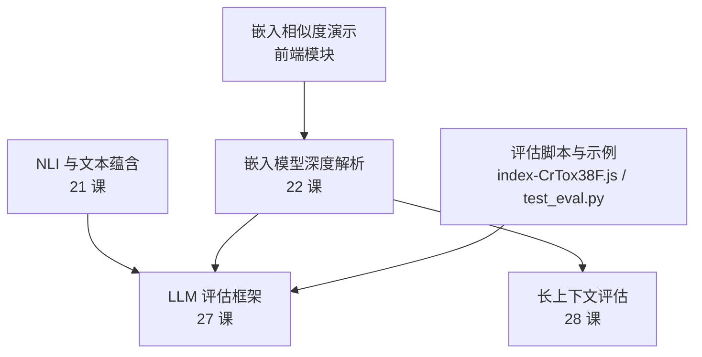
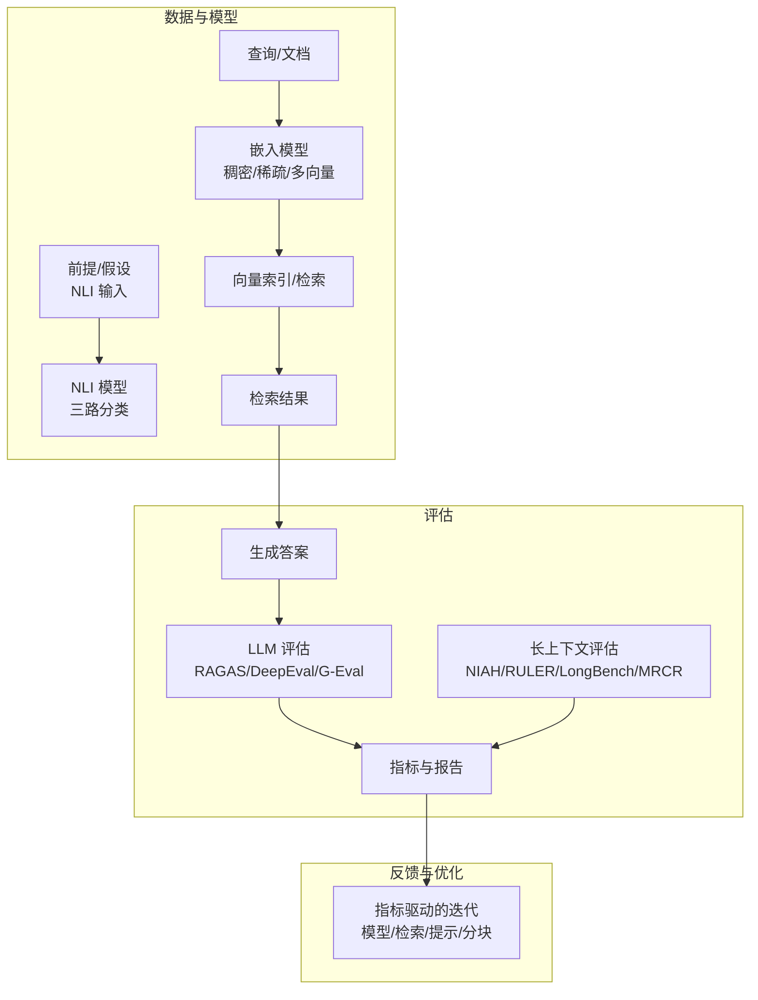
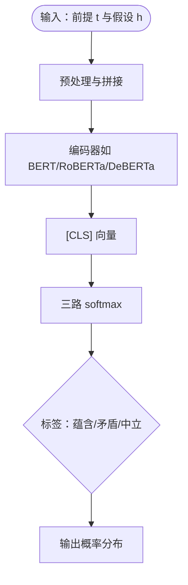
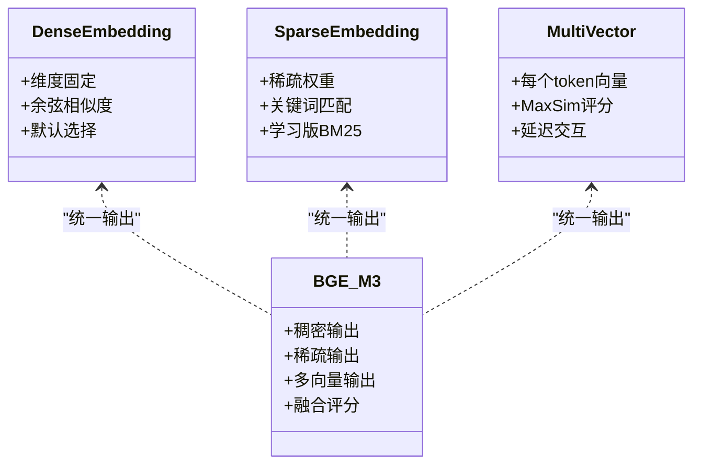
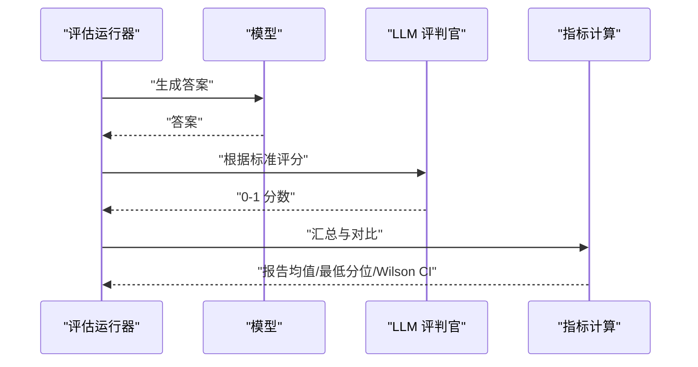
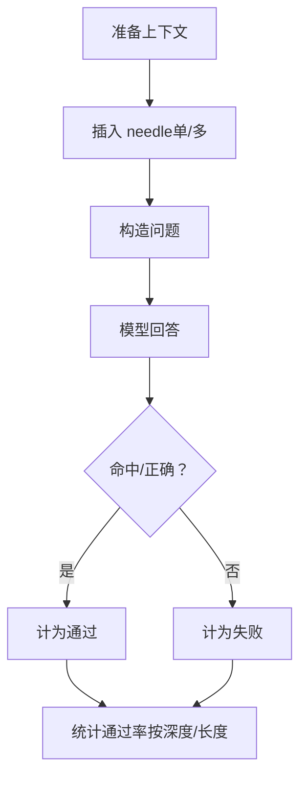
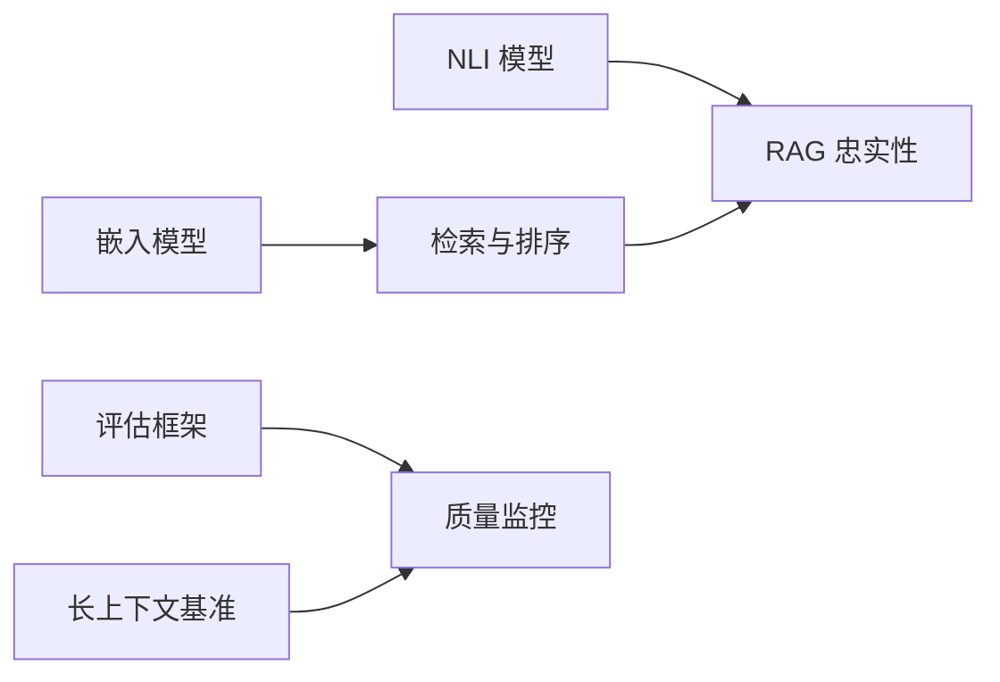

# 嵌入模型与评估

<cite>
**本文引用的文件**
- [phases/05-nlp-foundations-to-advanced/21-nli-textual-entailment/docs/zh.md](file://phases/05-nlp-foundations-to-advanced/21-nli-textual-entailment/docs/zh.md)
- [phases/05-nlp-foundations-to-advanced/22-embedding-models-deep-dive/docs/zh.md](file://phases/05-nlp-foundations-to-advanced/22-embedding-models-deep-dive/docs/zh.md)
- [phases/05-nlp-foundations-to-advanced/27-llm-evaluation-frameworks/docs/zh.md](file://phases/05-nlp-foundations-to-advanced/27-llm-evaluation-frameworks/docs/zh.md)
- [phases/05-nlp-foundations-to-advanced/28-long-context-evaluation/docs/zh.md](file://phases/05-nlp-foundations-to-advanced/28-long-context-evaluation/docs/zh.md)
- [site/vue-app/summary/src/data/modules/embedding-similarity.js](file://site/vue-app/summary/src/data/modules/embedding-similarity.js)
- [site/summary/assets/index-CrTox38F.js](file://site/summary/assets/index-CrTox38F.js)
- [test_eval.py](file://test_eval.py)
- [site/lesson.html](file://site/lesson.html)
</cite>

## 目录
1. [引言](#引言)
2. [项目结构](#项目结构)
3. [核心组件](#核心组件)
4. [架构总览](#架构总览)
5. [详细组件分析](#详细组件分析)
6. [依赖分析](#依赖分析)
7. [性能考量](#性能考量)
8. [故障排查指南](#故障排查指南)
9. [结论](#结论)
10. [附录](#附录)

## 引言
本课程围绕“嵌入模型与评估”展开，系统讲解自然语言推理（NLI）任务与数据集（MNLI、SNLI 等），深入剖析嵌入模型的评估方法（语义相似度、推理能力评估），并给出大语言模型评估框架与方法论、长上下文评估的挑战与对策、评估指标的选择与组合策略，以及完整的评估流水线与结果分析方法。课程内容来自阶段五“NLP 基础到进阶”的四门核心课件与配套实践脚本。

## 项目结构
本课程涉及的资料主要分布在以下路径：
- 阶段五·21 NLI 与文本蕴含：讲解 NLI 任务、数据集与生产应用
- 阶段五·22 嵌入模型深度解析：讲解嵌入模型类型、维度与检索模式
- 阶段五·27 LLM 评估框架：讲解 RAGAS、DeepEval、G-Eval 等评估方法
- 阶段五·28 长上下文评估：讲解 NIAH、RULER、LongBench、MRCR 等基准
- 前端可视化模块：嵌入相似度演示（余弦相似度）
- 评估脚本与示例：run_eval、compare、llm_judge 等

**图表来源**
- [phases/05-nlp-foundations-to-advanced/21-nli-textual-entailment/docs/zh.md:1-175](file://phases/05-nlp-foundations-to-advanced/21-nli-textual-entailment/docs/zh.md#L1-L175)
- [phases/05-nlp-foundations-to-advanced/22-embedding-models-deep-dive/docs/zh.md:1-209](file://phases/05-nlp-foundations-to-advanced/22-embedding-models-deep-dive/docs/zh.md#L1-L209)
- [phases/05-nlp-foundations-to-advanced/27-llm-evaluation-frameworks/docs/zh.md:1-240](file://phases/05-nlp-foundations-to-advanced/27-llm-evaluation-frameworks/docs/zh.md#L1-L240)
- [phases/05-nlp-foundations-to-advanced/28-long-context-evaluation/docs/zh.md:1-201](file://phases/05-nlp-foundations-to-advanced/28-long-context-evaluation/docs/zh.md#L1-L201)
- [site/vue-app/summary/src/data/modules/embedding-similarity.js:1-66](file://site/vue-app/summary/src/data/modules/embedding-similarity.js#L1-L66)
- [site/summary/assets/index-CrTox38F.js:734-775](file://site/summary/assets/index-CrTox38F.js#L734-L775)
- [test_eval.py:175-216](file://test_eval.py#L175-L216)

**章节来源**
- [phases/05-nlp-foundations-to-advanced/21-nli-textual-entailment/docs/zh.md:1-175](file://phases/05-nlp-foundations-to-advanced/21-nli-textual-entailment/docs/zh.md#L1-L175)
- [phases/05-nlp-foundations-to-advanced/22-embedding-models-deep-dive/docs/zh.md:1-209](file://phases/05-nlp-foundations-to-advanced/22-embedding-models-deep-dive/docs/zh.md#L1-L209)
- [phases/05-nlp-foundations-to-advanced/27-llm-evaluation-frameworks/docs/zh.md:1-240](file://phases/05-nlp-foundations-to-advanced/27-llm-evaluation-frameworks/docs/zh.md#L1-L240)
- [phases/05-nlp-foundations-to-advanced/28-long-context-evaluation/docs/zh.md:1-201](file://phases/05-nlp-foundations-to-advanced/28-long-context-evaluation/docs/zh.md#L1-L201)
- [site/vue-app/summary/src/data/modules/embedding-similarity.js:1-66](file://site/vue-app/summary/src/data/modules/embedding-similarity.js#L1-L66)
- [site/summary/assets/index-CrTox38F.js:734-775](file://site/summary/assets/index-CrTox38F.js#L734-L775)
- [test_eval.py:175-216](file://test_eval.py#L175-L216)

## 核心组件
- NLI 与文本蕴含：三路分类（蕴含/矛盾/中立），数据集（SNLI、MNLI、ANLI、DocNLI、ConTRoL），零样本分类与 RAG 忠实性检查
- 嵌入模型：稠密/稀疏/多向量，Matryoshka 截断，MTEB 排行榜与领域验证
- LLM 评估：RAGAS 四指标、DeepEval CI 关卡、G-Eval 自定义标准，校准与稳定性
- 长上下文评估：NIAH、RULER、LongBench、MRCR，有效检索/推理长度与退化曲线

**章节来源**
- [phases/05-nlp-foundations-to-advanced/21-nli-textual-entailment/docs/zh.md:38-124](file://phases/05-nlp-foundations-to-advanced/21-nli-textual-entailment/docs/zh.md#L38-L124)
- [phases/05-nlp-foundations-to-advanced/22-embedding-models-deep-dive/docs/zh.md:24-156](file://phases/05-nlp-foundations-to-advanced/22-embedding-models-deep-dive/docs/zh.md#L24-L156)
- [phases/05-nlp-foundations-to-advanced/27-llm-evaluation-frameworks/docs/zh.md:26-188](file://phases/05-nlp-foundations-to-advanced/27-llm-evaluation-frameworks/docs/zh.md#L26-L188)
- [phases/05-nlp-foundations-to-advanced/28-long-context-evaluation/docs/zh.md:22-148](file://phases/05-nlp-foundations-to-advanced/28-long-context-evaluation/docs/zh.md#L22-L148)

## 架构总览
下图展示从“数据与模型”到“评估与反馈”的整体流程，涵盖 NLI 作为基础能力、嵌入模型作为检索基础、LLM 评估作为质量保障、长上下文评估作为容量与稳定性验证。

**图表来源**
- [phases/05-nlp-foundations-to-advanced/21-nli-textual-entailment/docs/zh.md:88-124](file://phases/05-nlp-foundations-to-advanced/21-nli-textual-entailment/docs/zh.md#L88-L124)
- [phases/05-nlp-foundations-to-advanced/22-embedding-models-deep-dive/docs/zh.md:52-156](file://phases/05-nlp-foundations-to-advanced/22-embedding-models-deep-dive/docs/zh.md#L52-L156)
- [phases/05-nlp-foundations-to-advanced/27-llm-evaluation-frameworks/docs/zh.md:53-188](file://phases/05-nlp-foundations-to-advanced/27-llm-evaluation-frameworks/docs/zh.md#L53-L188)
- [phases/05-nlp-foundations-to-advanced/28-long-context-evaluation/docs/zh.md:49-148](file://phases/05-nlp-foundations-to-advanced/28-long-context-evaluation/docs/zh.md#L49-L148)

## 详细组件分析

### NLI 与文本蕴含（MNLI、SNLI 等）
- 任务定义：三路分类（蕴含/矛盾/中立），用于幻觉检测、零样本分类、RAG 忠实性检查
- 数据集与模型：
  - SNLI：图片说明前提的人工标注，领域窄
  - MNLI：多文体覆盖，2026 年主流训练语料
  - ANLI：对抗性 NLI，更具挑战
  - DocNLI、ConTRoL：文档级前提，测试长距离推理
- 架构与应用：Transformer 编码器读取拼接输入，[CLS] 向量经三路 softmax；MNLI 上训练、留出基准评估；零样本分类通过模板化假设实现
- 生产要点：仅假设捷径、词汇重叠启发式陷阱、文档长度退化、模板敏感性、领域不匹配

**图表来源**
- [phases/05-nlp-foundations-to-advanced/21-nli-textual-entailment/docs/zh.md:45-47](file://phases/05-nlp-foundations-to-advanced/21-nli-textual-entailment/docs/zh.md#L45-L47)

**章节来源**
- [phases/05-nlp-foundations-to-advanced/21-nli-textual-entailment/docs/zh.md:38-124](file://phases/05-nlp-foundations-to-advanced/21-nli-textual-entailment/docs/zh.md#L38-L124)

### 嵌入模型深度解析（语义相似度与推理能力评估）
- 类型与模式：
  - 稠密嵌入：固定维度向量，余弦相似度排序（默认选择）
  - 稀疏嵌入：学习版 BM25，关键词密集场景强
  - 多向量：每个 token 一个向量，MaxSim 评分，延迟交互
  - BGE-M3：三模式统一输出，一次推理多索引
- Matryoshka 截断：前 N 维自身即有效嵌入，显著节省存储
- 评估方法：MTEB 排行榜与领域验证结合，避免仅看总榜
- 前端演示：余弦相似度计算，展示“语义越近向量越近”

**图表来源**
- [phases/05-nlp-foundations-to-advanced/22-embedding-models-deep-dive/docs/zh.md:24-116](file://phases/05-nlp-foundations-to-advanced/22-embedding-models-deep-dive/docs/zh.md#L24-L116)
- [site/vue-app/summary/src/data/modules/embedding-similarity.js:10-51](file://site/vue-app/summary/src/data/modules/embedding-similarity.js#L10-L51)

**章节来源**
- [phases/05-nlp-foundations-to-advanced/22-embedding-models-deep-dive/docs/zh.md:24-156](file://phases/05-nlp-foundations-to-advanced/22-embedding-models-deep-dive/docs/zh.md#L24-L156)
- [site/vue-app/summary/src/data/modules/embedding-similarity.js:1-66](file://site/vue-app/summary/src/data/modules/embedding-similarity.js#L1-L66)

### LLM 评估框架（RAGAS、DeepEval、G-Eval）
- RAGAS 四指标：忠实度（NLI）、答案相关性（问题-答案一致性）、上下文精确率、上下文召回率
- DeepEval CI 关卡：pytest 集成，回归阈值与最低分位告警
- G-Eval：自定义标准 + 思维链步骤 + 0-1 评分
- 校准：与人工标注的相关性验证，避免“噪声评判官”
- 评估流水线：评测套件 → 评分 → 汇总与对比 → 报告与回归

**图表来源**
- [phases/05-nlp-foundations-to-advanced/27-llm-evaluation-frameworks/docs/zh.md:53-188](file://phases/05-nlp-foundations-to-advanced/27-llm-evaluation-frameworks/docs/zh.md#L53-L188)
- [site/summary/assets/index-CrTox38F.js:734-775](file://site/summary/assets/index-CrTox38F.js#L734-L775)
- [test_eval.py:175-216](file://test_eval.py#L175-L216)

**章节来源**
- [phases/05-nlp-foundations-to-advanced/27-llm-evaluation-frameworks/docs/zh.md:26-188](file://phases/05-nlp-foundations-to-advanced/27-llm-evaluation-frameworks/docs/zh.md#L26-L188)
- [site/summary/assets/index-CrTox38F.js:734-775](file://site/summary/assets/index-CrTox38F.js#L734-L775)
- [test_eval.py:175-216](file://test_eval.py#L175-L216)

### 长上下文评估（NIAH、RULER、LongBench、MRCR）
- NIAH：在长上下文中植入“魔法词”，评估检索能力；需遍历深度与长度网格
- RULER：多任务（检索/多跳/聚合/QA），揭示“宣称窗口≠可用窗口”
- LongBench v2：真实世界长上下文行为，多文档 QA、长对话、代码仓库等
- MRCR：多轮共指，检验注意力饱和与事实保留
- 实战建议：有效检索长度（如 90% 通过率）、有效推理长度（如 70% 通过率）、退化曲线、首 token 时间与成本

**图表来源**
- [phases/05-nlp-foundations-to-advanced/28-long-context-evaluation/docs/zh.md:51-126](file://phases/05-nlp-foundations-to-advanced/28-long-context-evaluation/docs/zh.md#L51-L126)

**章节来源**
- [phases/05-nlp-foundations-to-advanced/28-long-context-evaluation/docs/zh.md:22-148](file://phases/05-nlp-foundations-to-advanced/28-long-context-evaluation/docs/zh.md#L22-L148)

## 依赖分析
- NLI 依赖：预训练模型（如 BART/Microsoft DeBERTa）、零样本模板、阈值策略
- 嵌入模型依赖：Sentence-BERT/BGE-M3、Matryoshka 截断、MTEB 领域任务
- LLM 评估依赖：RAGAS/DeepEval/G-Eval、校准数据集、CI 集成
- 长上下文评估依赖：NIAH/RULER/LongBench 数据集、自定义 needle 构造

**图表来源**
- [phases/05-nlp-foundations-to-advanced/21-nli-textual-entailment/docs/zh.md:88-124](file://phases/05-nlp-foundations-to-advanced/21-nli-textual-entailment/docs/zh.md#L88-L124)
- [phases/05-nlp-foundations-to-advanced/22-embedding-models-deep-dive/docs/zh.md:52-156](file://phases/05-nlp-foundations-to-advanced/22-embedding-models-deep-dive/docs/zh.md#L52-L156)
- [phases/05-nlp-foundations-to-advanced/27-llm-evaluation-frameworks/docs/zh.md:53-188](file://phases/05-nlp-foundations-to-advanced/27-llm-evaluation-frameworks/docs/zh.md#L53-L188)
- [phases/05-nlp-foundations-to-advanced/28-long-context-evaluation/docs/zh.md:49-148](file://phases/05-nlp-foundations-to-advanced/28-long-context-evaluation/docs/zh.md#L49-L148)

**章节来源**
- [phases/05-nlp-foundations-to-advanced/21-nli-textual-entailment/docs/zh.md:38-124](file://phases/05-nlp-foundations-to-advanced/21-nli-textual-entailment/docs/zh.md#L38-L124)
- [phases/05-nlp-foundations-to-advanced/22-embedding-models-deep-dive/docs/zh.md:24-156](file://phases/05-nlp-foundations-to-advanced/22-embedding-models-deep-dive/docs/zh.md#L24-L156)
- [phases/05-nlp-foundations-to-advanced/27-llm-evaluation-frameworks/docs/zh.md:26-188](file://phases/05-nlp-foundations-to-advanced/27-llm-evaluation-frameworks/docs/zh.md#L26-L188)
- [phases/05-nlp-foundations-to-advanced/28-long-context-evaluation/docs/zh.md:22-148](file://phases/05-nlp-foundations-to-advanced/28-long-context-evaluation/docs/zh.md#L22-L148)

## 性能考量
- 嵌入模型
  - 存储与吞吐：Matryoshka 截断与量化（如 int8）显著降低成本
  - 上下文长度：多数模型最大长度的 60-70% 为实际有效容量
  - 查询前缀：如 bge-* 需要特定前缀以提升检索召回
- 评估成本
  - LLM 作为评判官：GPT-4o-mini/Claude Haiku/Mistral-small 可满足校准阈值的低成本方案
  - CI 关卡：阈值与最低分位告警，避免均值掩盖灾难性失败
- 长上下文
  - 宣称窗口与可用窗口差异巨大；需在目标长度上独立验证
  - 首 token 时间与每次查询成本需纳入评估

**章节来源**
- [phases/05-nlp-foundations-to-advanced/22-embedding-models-deep-dive/docs/zh.md:134-156](file://phases/05-nlp-foundations-to-advanced/22-embedding-models-deep-dive/docs/zh.md#L134-L156)
- [phases/05-nlp-foundations-to-advanced/27-llm-evaluation-frameworks/docs/zh.md:166-188](file://phases/05-nlp-foundations-to-advanced/27-llm-evaluation-frameworks/docs/zh.md#L166-L188)
- [phases/05-nlp-foundations-to-advanced/28-long-context-evaluation/docs/zh.md:127-148](file://phases/05-nlp-foundations-to-advanced/28-long-context-evaluation/docs/zh.md#L127-L148)

## 故障排查指南
- NLI
  - 仅假设捷径导致标签泄漏；使用对抗性基准（如 ANLI/HANS）验证
  - 模板敏感性：零样本模板变化可致准确度波动 10+ 个百分点
  - 领域不匹配：通用模型在法律/医学需专用模型（如 SciNLI、MedNLI）
- 嵌入
  - 查询与文档非对称编码：注意模型卡片说明
  - 上下文截断：多数模型静默截断，长文档需分块
  - Matryoshka 过度截断：1536→64 不安全，需在评估集上验证
- 评估
  - 未校准的评判官：与人工标注相关性低即为噪声
  - 自我评估：同一模型生成+评判会虚高 10-20%
  - 原始均值掩盖失败：检查最低分位与灾难性失败比例
- 长上下文
  - 仅 NIAH 评估：无法反映多跳能力
  - 填充词重叠：易导致“检索微不足道”，采用 NoLiMa 风格
  - 厂商自报分数：需在自有用例上独立复测

**章节来源**
- [phases/05-nlp-foundations-to-advanced/21-nli-textual-entailment/docs/zh.md:103-110](file://phases/05-nlp-foundations-to-advanced/21-nli-textual-entailment/docs/zh.md#L103-L110)
- [phases/05-nlp-foundations-to-advanced/22-embedding-models-deep-dive/docs/zh.md:134-141](file://phases/05-nlp-foundations-to-advanced/22-embedding-models-deep-dive/docs/zh.md#L134-L141)
- [phases/05-nlp-foundations-to-advanced/27-llm-evaluation-frameworks/docs/zh.md:166-174](file://phases/05-nlp-foundations-to-advanced/27-llm-evaluation-frameworks/docs/zh.md#L166-L174)
- [phases/05-nlp-foundations-to-advanced/28-long-context-evaluation/docs/zh.md:127-134](file://phases/05-nlp-foundations-to-advanced/28-long-context-evaluation/docs/zh.md#L127-L134)

## 结论
本课程将 NLI、嵌入模型、LLM 评估与长上下文评估系统化整合：以 NLI 为语义理解基石，以嵌入模型为检索基础，以 LLM 评估为质量保障，以长上下文评估为容量与稳定性验证。通过明确的评估指标选择与组合策略、完善的评估流水线与结果分析方法，帮助在真实生产中做出稳健的工程决策。

## 附录
- 术语速览
  - NLI：自然语言推理，三路分类
  - 零样本分类：将标签表述为假设，选择最大蕴含值
  - 忠实度：答案主张被检索上下文蕴涵的比例
  - 上下文精确率/召回率：检索块相关性与完整性
  - Matryoshka：前 N 维即有效嵌入
  - 有效检索/推理长度：在阈值下的实际可用长度
- 相关链接
  - [NLI 与文本蕴含（中文）:1-175](file://phases/05-nlp-foundations-to-advanced/21-nli-textual-entailment/docs/zh.md#L1-L175)
  - [嵌入模型深度解析（中文）:1-209](file://phases/05-nlp-foundations-to-advanced/22-embedding-models-deep-dive/docs/zh.md#L1-L209)
  - [LLM 评估框架（中文）:1-240](file://phases/05-nlp-foundations-to-advanced/27-llm-evaluation-frameworks/docs/zh.md#L1-L240)
  - [长上下文评估（中文）:1-201](file://phases/05-nlp-foundations-to-advanced/28-long-context-evaluation/docs/zh.md#L1-L201)
  - [嵌入相似度演示（前端模块）:1-66](file://site/vue-app/summary/src/data/modules/embedding-similarity.js#L1-L66)
  - [评估脚本与示例（index-CrTox38F.js）:734-775](file://site/summary/assets/index-CrTox38F.js#L734-L775)
  - [评估脚本与示例（test_eval.py）:175-216](file://test_eval.py#L175-L216)
  - [课程目录（README）:387-417](file://README.md#L387-L417)