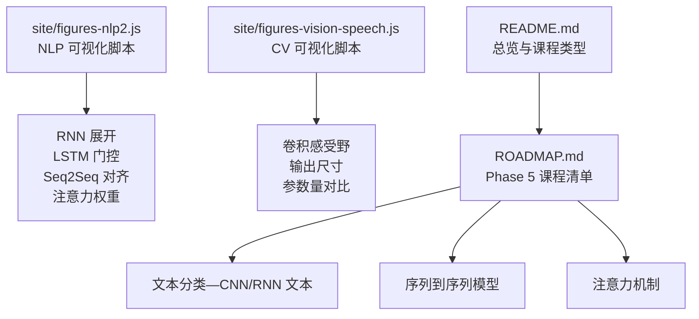
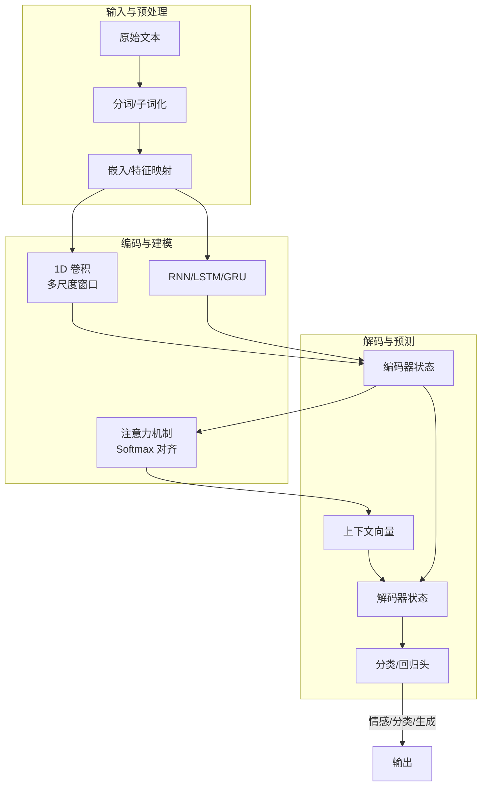
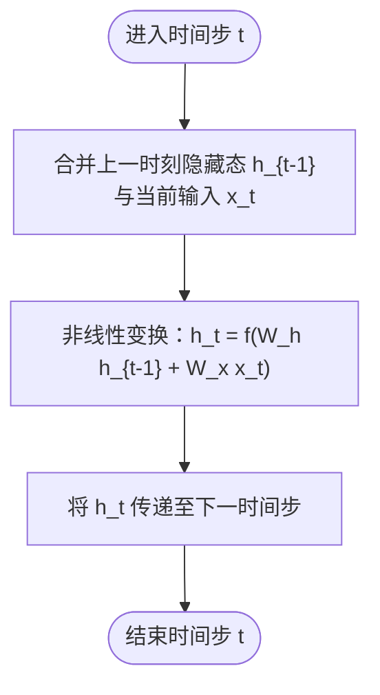
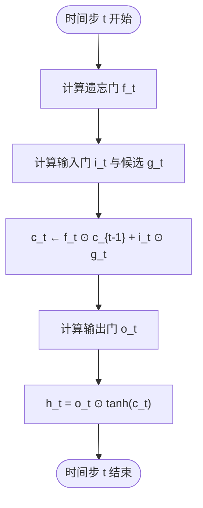
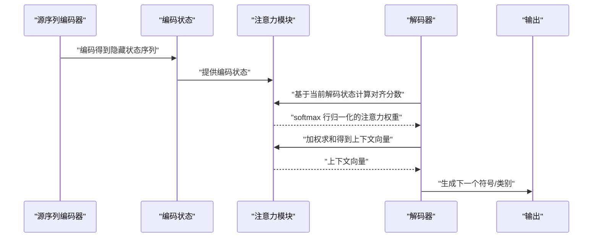
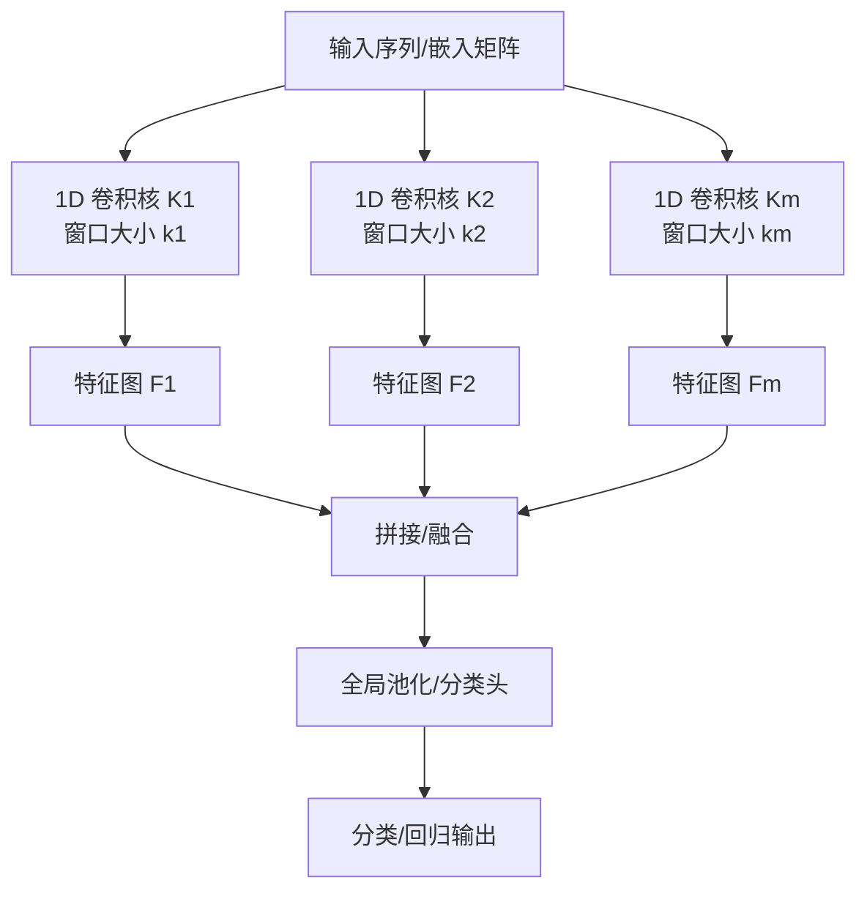
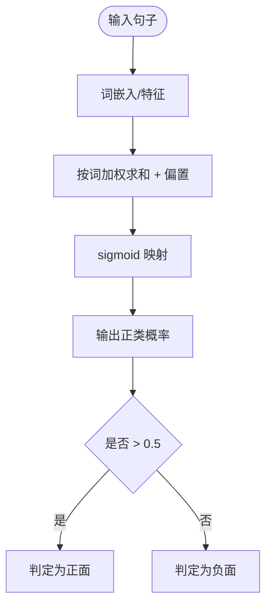
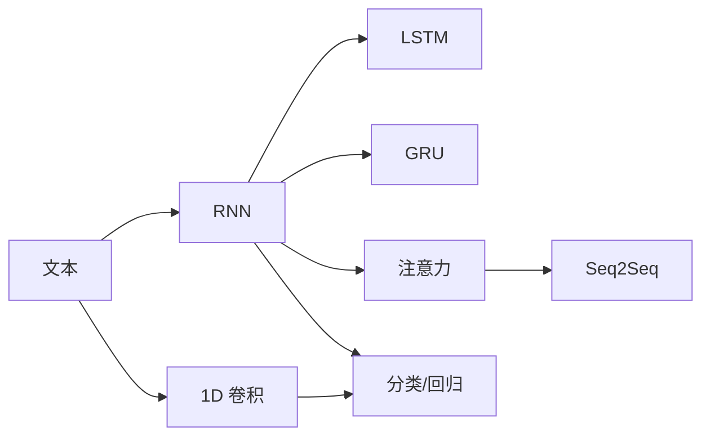
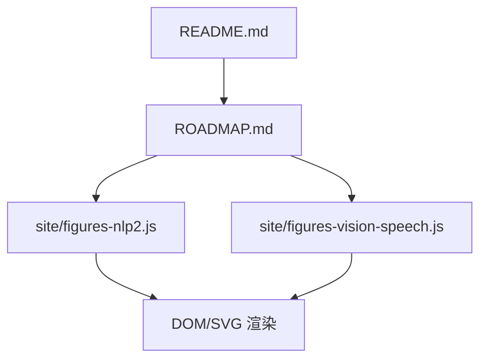

# 序列模型与RNN

<cite>
**本文引用的文件**   
- [site/figures-nlp2.js](file://site/figures-nlp2.js)
- [site/figures-vision-speech.js](file://site/figures-vision-speech.js)
- [ROADMAP.md](file://ROADMAP.md)
- [README.md](file://README.md)
</cite>

## 目录
1. [引言](#引言)
2. [项目结构](#项目结构)
3. [核心组件](#核心组件)
4. [架构总览](#架构总览)
5. [详细组件分析](#详细组件分析)
6. [依赖关系分析](#依赖关系分析)
7. [性能考量](#性能考量)
8. [故障排查指南](#故障排查指南)
9. [结论](#结论)
10. [附录](#附录)

## 引言
本课程围绕“序列模型”展开，系统讲解循环神经网络（RNN）及其变体（LSTM、GRU 的门控机制）、卷积神经网络在文本分类中的应用（1D 卷积与多尺度卷积）、序列到序列（Seq2Seq）模型的编码器-解码器框架、注意力机制如何缓解长序列建模难题，并结合情感分析与文本分类等典型任务给出可操作的实现思路与可视化理解工具。课程配套包含交互式演示脚本与教学路线图，便于从直观到抽象逐步掌握。

## 项目结构
本仓库为“从零开始的AI工程”学习体系的一部分，其中 NLP 高级阶段（Phase 5）覆盖了从基础文本处理到注意力与Transformer之前的完整序列模型知识链路。与本课程直接相关的核心资源分布在以下位置：
- site/figures-nlp2.js：提供 RNN 展开、LSTM 门控、Seq2Seq 对齐与注意力权重分布、编辑距离、N-gram 回退、命名实体标注、情感分类等交互式可视化函数注册表。
- site/figures-vision-speech.js：提供卷积层感受野、输出尺寸与参数量对比等计算机视觉基础可视化，便于类比理解文本卷积。
- ROADMAP.md：列出 Phase 5 的 29 个课程清单，明确“文本分类—CNN/RNN 文本”“序列到序列模型”“注意力机制”等关键节点。
- README.md：总览性介绍，包含 Phase 5 的课程列表与类型说明。

**图表来源**
- [site/figures-nlp2.js:68-369](file://site/figures-nlp2.js#L68-L369)
- [site/figures-vision-speech.js:154-254](file://site/figures-vision-speech.js#L154-L254)
- [ROADMAP.md:129-161](file://ROADMAP.md#L129-L161)
- [README.md:383-417](file://README.md#L383-L417)

**章节来源**
- [ROADMAP.md:129-161](file://ROADMAP.md#L129-L161)
- [README.md:383-417](file://README.md#L383-L417)

## 核心组件
- RNN 展开与梯度传播：通过“展开”视角展示时间步共享权重、状态沿时间传递，以及长序列导致梯度消失/爆炸的直观原因。
- LSTM 门控机制：遗忘门、输入门、输出门协同控制单元状态与隐藏状态的流动，缓解长期依赖问题。
- Seq2Seq 编码器-解码器与注意力对齐：解码端对编码端状态进行软对齐，行向 softmax 形成注意力权重矩阵。
- 文本卷积（1D）与多尺度卷积：利用一维卷积核扫描文本片段，多窗口大小捕获不同长度的语言模式；参数共享降低计算成本。
- 情感分类线性模型：逐词加权求和后经 sigmoid 得到正负倾向概率，用于入门理解序列分类。

**章节来源**
- [site/figures-nlp2.js:68-101](file://site/figures-nlp2.js#L68-L101)
- [site/figures-nlp2.js:123-142](file://site/figures-nlp2.js#L123-L142)
- [site/figures-nlp2.js:144-185](file://site/figures-nlp2.js#L144-L185)
- [site/figures-vision-speech.js:154-254](file://site/figures-vision-speech.js#L154-L254)
- [site/figures-nlp2.js:353-369](file://site/figures-nlp2.js#L353-L369)

## 架构总览
下图展示了从数据到模型再到推理的关键路径：文本预处理 → 特征表示（嵌入/卷积/循环）→ 编码器/注意力 → 解码器/分类器 → 输出（序列/标签）。

**图表来源**
- [site/figures-nlp2.js:68-101](file://site/figures-nlp2.js#L68-L101)
- [site/figures-nlp2.js:123-142](file://site/figures-nlp2.js#L123-L142)
- [site/figures-nlp2.js:144-185](file://site/figures-nlp2.js#L144-L185)
- [site/figures-vision-speech.js:154-254](file://site/figures-vision-speech.js#L154-L254)

## 详细组件分析

### 组件 A：RNN 展开与梯度传播
- 原理要点
  - 时间步共享权重，状态沿时间轴传递，最终隐藏态汇总整条序列信息。
  - 长序列时梯度回传困难，易出现消失/爆炸。
- 可视化要点
  - 展示不同序列长度下的状态流动与最终隐藏态数值变化。
  - 突出“相同权重在每个时间步重复使用”的设计思想。

**图表来源**
- [site/figures-nlp2.js:68-101](file://site/figures-nlp2.js#L68-L101)

**章节来源**
- [site/figures-nlp2.js:68-101](file://site/figures-nlp2.js#L68-L101)

### 组件 B：LSTM 门控机制
- 原理要点
  - 单元状态 c_t 由“遗忘门 + 输入门写入候选”的加和构成；输出门控制状态泄漏为隐藏向量 h_t。
  - 门控值接近 0/1 时，能长时间保持信息而不受梯度影响。
- 可视化要点
  - 条形图显示遗忘/输入/输出门比例，公式展示 c_t 与 h_t 的更新规则。

**图表来源**
- [site/figures-nlp2.js:123-142](file://site/figures-nlp2.js#L123-L142)

**章节来源**
- [site/figures-nlp2.js:123-142](file://site/figures-nlp2.js#L123-L142)

### 组件 C：Seq2Seq 编码器-解码器与注意力对齐
- 原理要点
  - 解码端对编码端状态进行软对齐，每行 softmax 归一化，形成注意力权重矩阵。
  - 上下文向量是编码状态按注意力权重的加权求和。
- 可视化要点
  - 热力图展示目标词对源词的注意力分布，体现翻译中的重排与对齐。

**图表来源**
- [site/figures-nlp2.js:144-185](file://site/figures-nlp2.js#L144-L185)

**章节来源**
- [site/figures-nlp2.js:144-185](file://site/figures-nlp2.js#L144-L185)

### 组件 D：文本卷积（1D）与多尺度卷积
- 原理要点
  - 1D 卷积核沿序列滑动，捕获局部 n-gram 模式；多窗口大小（多尺度）同时抽取不同粒度特征。
  - 参数共享使卷积层参数量远小于全连接层，且感受野随层数增长。
- 可视化要点
  - 感受野随层数与步幅增长的计算公式；输出尺寸与填充策略；参数量对比条形图。

**图表来源**
- [site/figures-vision-speech.js:154-254](file://site/figures-vision-speech.js#L154-L254)

**章节来源**
- [site/figures-vision-speech.js:154-254](file://site/figures-vision-speech.js#L154-L254)

### 组件 E：情感分类线性模型（入门）
- 原理要点
  - 将每个词投影到实数空间并累加，加入偏置后经 sigmoid 映射为正负倾向概率。
  - 决策边界由总 logits 是否越过零决定。
- 可视化要点
  - 条形图展示各词权重对最终 logit 的贡献，帮助理解“正向/负向”信号如何累积。

**图表来源**
- [site/figures-nlp2.js:353-369](file://site/figures-nlp2.js#L353-L369)

**章节来源**
- [site/figures-nlp2.js:353-369](file://site/figures-nlp2.js#L353-L369)

### 概念总览
- RNN：适合顺序数据，但长依赖困难。
- LSTM/GRU：通过门控缓解梯度问题，更适合长序列。
- 注意力：软对齐替代硬对齐，显著提升长序列建模能力。
- 卷积：捕捉局部与多尺度模式，参数共享高效。
- 分类：线性分类器作为基线，后续可扩展为深度网络。

（该图为概念性示意，不对应具体源文件）

## 依赖关系分析
- 模块内聚与耦合
  - site/figures-nlp2.js 与 site/figures-vision-speech.js 各自维护独立的可视化注册表，内部函数间通过状态对象与渲染回调耦合，模块间无直接依赖。
- 外部依赖与集成点
  - 可视化脚本依赖浏览器 DOM 与 SVG 渲染环境；课程内容通过 ROADMAP 与 README 进行组织与导航。
- 潜在环依赖
  - 当前脚本未见循环导入；若新增外部模块需避免相互引用。

**图表来源**
- [site/figures-nlp2.js:359-369](file://site/figures-nlp2.js#L359-L369)
- [site/figures-vision-speech.js:154-254](file://site/figures-vision-speech.js#L154-L254)
- [ROADMAP.md:129-161](file://ROADMAP.md#L129-L161)
- [README.md:383-417](file://README.md#L383-L417)

**章节来源**
- [site/figures-nlp2.js:359-369](file://site/figures-nlp2.js#L359-L369)
- [site/figures-vision-speech.js:154-254](file://site/figures-vision-speech.js#L154-L254)
- [ROADMAP.md:129-161](file://ROADMAP.md#L129-L161)
- [README.md:383-417](file://README.md#L383-L417)

## 性能考量
- 计算复杂度
  - RNN：每步 O((|V|+H)V) 或 O(H^2)，序列长度 T 时总体 O(T·(·))。
  - LSTM/GRU：与 RNN 类似，但门控带来额外乘法/激活开销，通常略高。
  - 1D 卷积：单层 O(K·C_in·L_out)，多尺度叠加线性增长；参数共享显著降低存储与计算。
  - 注意力：O(L^2·H)（对齐矩阵），在长序列中需考虑近似或稀疏化。
- 训练稳定性
  - RNN 容易梯度消失/爆炸；LSTM/GRU 通过门控缓解；必要时使用梯度裁剪与残差连接。
- 推理效率
  - 注意力的二次复杂度限制长序列；可采用稀疏注意力、局部窗口注意力或分块策略。
  - 卷积在固定感受野内线性扩展，适合长序列。

（本节为通用指导，不直接分析具体文件）

## 故障排查指南
- RNN 梯度异常
  - 症状：损失震荡、收敛慢、梯度爆炸/消失。
  - 处理：检查权重初始化、学习率、梯度裁剪；优先尝试 LSTM/GRU。
- 注意力对齐不合理
  - 症状：解码错位、重排不明显。
  - 处理：调整温度参数（sharpness）以改变 softmax 锐利程度；检查编码器状态维度与对齐函数一致性。
- 卷积效果不佳
  - 症状：过拟合、欠拟合、特征提取不足。
  - 处理：增加多尺度窗口、加深层数、调整步幅与填充；监控感受野与输出尺寸。
- 情感分类决策边界漂移
  - 症状：阈值不稳、误判增多。
  - 处理：校准阈值、增加正则、引入更复杂分类头（如多层感知机）。

（本节为通用指导，不直接分析具体文件）

## 结论
本课程以可视化与循序渐进的方式，将序列模型从基础 RNN、LSTM 门控、文本卷积，到 Seq2Seq 与注意力机制串联起来。通过交互式演示，学习者可以直观理解长序列建模难点与解决方案，并将这些知识迁移到情感分析、文本分类等下游任务中。建议在掌握基础后，进一步探索 Transformer 与现代预训练语言模型。

## 附录
- 课程导航
  - Phase 5 课程清单与进度参考：[ROADMAP.md:129-161](file://ROADMAP.md#L129-L161)
  - 课程总览与类型说明：[README.md:383-417](file://README.md#L383-L417)
- 可视化脚本入口
  - NLP 可视化注册表：[site/figures-nlp2.js:359-369](file://site/figures-nlp2.js#L359-L369)
  - CV 可视化注册表：[site/figures-vision-speech.js:154-254](file://site/figures-vision-speech.js#L154-L254)