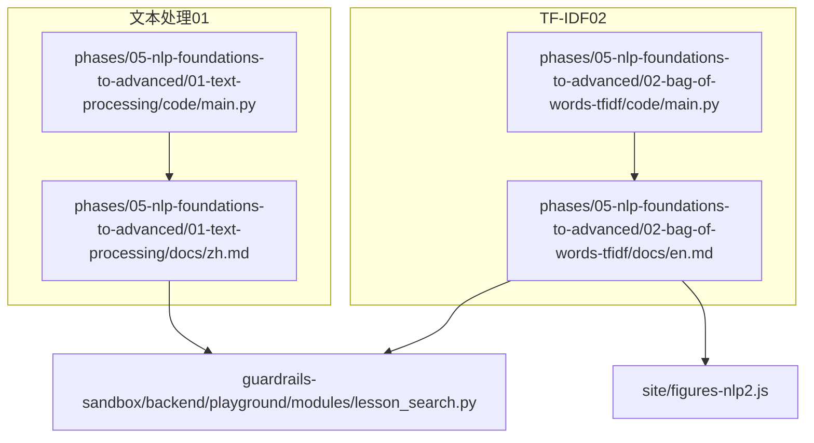
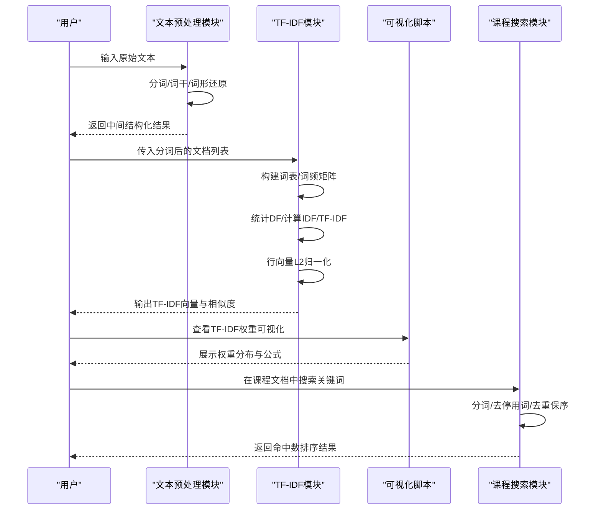
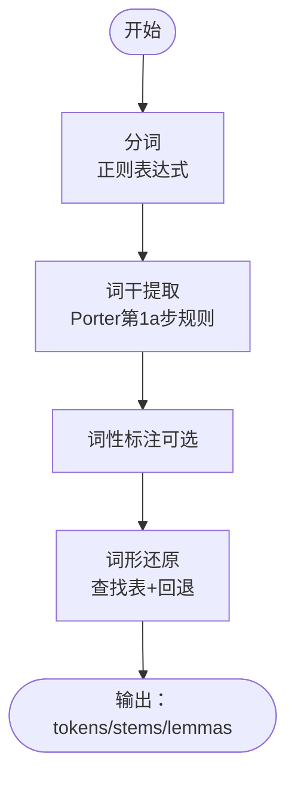
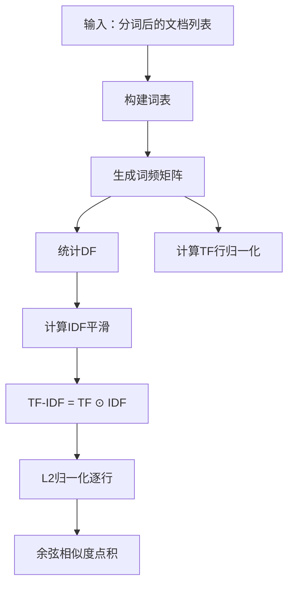
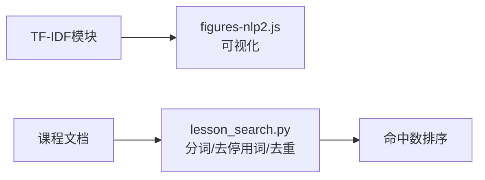
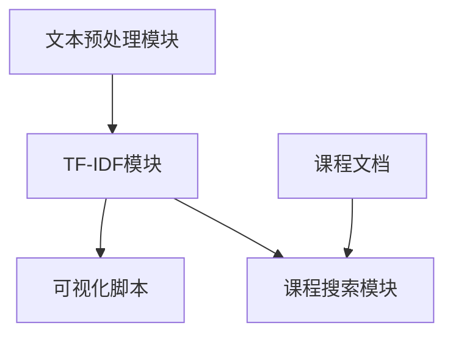

# 文本处理基础

<cite>
**本文档引用的文件**
- [phases/05-nlp-foundations-to-advanced/01-text-processing/code/main.py](file://phases/05-nlp-foundations-to-advanced/01-text-processing/code/main.py)
- [phases/05-nlp-foundations-to-advanced/01-text-processing/docs/zh.md](file://phases/05-nlp-foundations-to-advanced/01-text-processing/docs/zh.md)
- [phases/05-nlp-foundations-to-advanced/02-bag-of-words-tfidf/code/main.py](file://phases/05-nlp-foundations-to-advanced/02-bag-of-words-tfidf/code/main.py)
- [phases/05-nlp-foundations-to-advanced/02-bag-of-words-tfidf/docs/en.md](file://phases/05-nlp-foundations-to-advanced/02-bag-of-words-tfidf/docs/en.md)
- [site/figures-nlp2.js](file://site/figures-nlp2.js)
- [guardrails-sandbox/backend/playground/modules/lesson_search.py](file://guardrails-sandbox/backend/playground/modules/lesson_search.py)
</cite>

## 目录
1. [引言](#引言)
2. [项目结构](#项目结构)
3. [核心组件](#核心组件)
4. [架构概览](#架构概览)
5. [详细组件分析](#详细组件分析)
6. [依赖分析](#依赖分析)
7. [性能考虑](#性能考虑)
8. [故障排查指南](#故障排查指南)
9. [结论](#结论)
10. [附录](#附录)

## 引言
本课程面向“文本处理基础”，围绕文本预处理与传统向量表示方法展开，目标是帮助读者建立从原始文本到数值特征的完整流程认知。课程内容涵盖：
- 文本清洗与分词：识别词边界、处理标点与数字、应对常见边界情况
- 词干提取与词形还原：理解规则与形态学差异，掌握何时使用何种策略
- TF-IDF 向量表示：词频统计、逆文档频率计算、权重归一化与相似度评估
- 传统方法的优势与局限：在低资源、高可解释性与低延迟场景下的价值，以及在语义与 OOV 方面的不足
- 为后续深度学习方法打下基础：TF-IDF 加权嵌入等混合策略

## 项目结构
本次文档聚焦于 NLP 基础阶段的两门核心课程：
- 文本处理（分词、词干提取、词形还原）
- 词袋模型与 TF-IDF（向量化与相似度）

图示来源
- [phases/05-nlp-foundations-to-advanced/01-text-processing/code/main.py:1-82](file://phases/05-nlp-foundations-to-advanced/01-text-processing/code/main.py#L1-L82)
- [phases/05-nlp-foundations-to-advanced/01-text-processing/docs/zh.md:1-258](file://phases/05-nlp-foundations-to-advanced/01-text-processing/docs/zh.md#L1-L258)
- [phases/05-nlp-foundations-to-advanced/02-bag-of-words-tfidf/code/main.py:1-95](file://phases/05-nlp-foundations-to-advanced/02-bag-of-words-tfidf/code/main.py#L1-L95)
- [phases/05-nlp-foundations-to-advanced/02-bag-of-words-tfidf/docs/en.md:1-265](file://phases/05-nlp-foundations-to-advanced/02-bag-of-words-tfidf/docs/en.md#L1-L265)
- [site/figures-nlp2.js:23-66](file://site/figures-nlp2.js#L23-L66)
- [guardrails-sandbox/backend/playground/modules/lesson_search.py:24-64](file://guardrails-sandbox/backend/playground/modules/lesson_search.py#L24-L64)

章节来源
- [phases/05-nlp-foundations-to-advanced/01-text-processing/code/main.py:1-82](file://phases/05-nlp-foundations-to-advanced/01-text-processing/code/main.py#L1-L82)
- [phases/05-nlp-foundations-to-advanced/01-text-processing/docs/zh.md:1-258](file://phases/05-nlp-foundations-to-advanced/01-text-processing/docs/zh.md#L1-L258)
- [phases/05-nlp-foundations-to-advanced/02-bag-of-words-tfidf/code/main.py:1-95](file://phases/05-nlp-foundations-to-advanced/02-bag-of-words-tfidf/code/main.py#L1-L95)
- [phases/05-nlp-foundations-to-advanced/02-bag-of-words-tfidf/docs/en.md:1-265](file://phases/05-nlp-foundations-to-advanced/02-bag-of-words-tfidf/docs/en.md#L1-L265)
- [site/figures-nlp2.js:23-66](file://site/figures-nlp2.js#L23-L66)
- [guardrails-sandbox/backend/playground/modules/lesson_search.py:24-64](file://guardrails-sandbox/backend/playground/modules/lesson_search.py#L24-L64)

## 核心组件
- 文本预处理模块（分词、词干提取、词形还原）
  - 正则表达式分词器：识别字母词、数字与标点，兼顾缩写与边界情况
  - Porter 词干提取（第 1a 步）：基于后缀规则的快速归并
  - 基于查找表的词形还原：结合词性标签与回退规则
  - 预处理流水线：串联分词、词干与词形还原，输出结构化中间结果
- TF-IDF 向量表示模块（词频、DF、IDF、归一化、相似度）
  - 词表构建与词频矩阵
  - 文档频率统计与平滑 IDF 计算
  - 文档内词频归一化与全局 TF-IDF 权重
  - L2 归一化与余弦相似度
- 可视化与辅助工具
  - TF-IDF 权重可视化脚本，直观展示“常见词降权、稀有词升权”的效果
  - 课程搜索模块中的分词与停用词过滤逻辑，体现工程实践中的预处理要点

章节来源
- [phases/05-nlp-foundations-to-advanced/01-text-processing/code/main.py:7-53](file://phases/05-nlp-foundations-to-advanced/01-text-processing/code/main.py#L7-L53)
- [phases/05-nlp-foundations-to-advanced/02-bag-of-words-tfidf/code/main.py:8-64](file://phases/05-nlp-foundations-to-advanced/02-bag-of-words-tfidf/code/main.py#L8-L64)
- [site/figures-nlp2.js:23-66](file://site/figures-nlp2.js#L23-L66)
- [guardrails-sandbox/backend/playground/modules/lesson_search.py:24-47](file://guardrails-sandbox/backend/playground/modules/lesson_search.py#L24-L47)

## 架构概览
下图展示了从原始文本到 TF-IDF 特征向量的整体流程，以及与可视化和检索模块的衔接。

图示来源
- [phases/05-nlp-foundations-to-advanced/01-text-processing/code/main.py:48-53](file://phases/05-nlp-foundations-to-advanced/01-text-processing/code/main.py#L48-L53)
- [phases/05-nlp-foundations-to-advanced/02-bag-of-words-tfidf/code/main.py:43-64](file://phases/05-nlp-foundations-to-advanced/02-bag-of-words-tfidf/code/main.py#L43-L64)
- [site/figures-nlp2.js:23-66](file://site/figures-nlp2.js#L23-L66)
- [guardrails-sandbox/backend/playground/modules/lesson_search.py:24-47](file://guardrails-sandbox/backend/playground/modules/lesson_search.py#L24-L47)

## 详细组件分析

### 文本预处理组件分析
- 分词器
  - 使用正则表达式优先匹配：带可选内部撇号的单词、纯数字、单个非空白非字母数字字符（标点）
  - 注意事项：对“3pm”等组合的拆分策略；URL/邮箱/话题标签等需额外规则
- 词干提取（Porter 第 1a 步）
  - 规则顺序决定结果；存在“ies→i”导致“ponies→poni”的偏差
  - 适合对速度敏感、可容忍噪声的任务（如粗排、索引）
- 词形还原（基于查找表与回退）
  - 需要词性上下文；回退仅覆盖部分形态变化
  - 适合语义重要、用户可见内容的场景（如问答、语义检索）
- 预处理流水线
  - 将分词、词干、词形还原串联，输出 tokens/stems/lemmas
  - 词性标注器可替换为 NLTK/spaCy 等工具链

图示来源
- [phases/05-nlp-foundations-to-advanced/01-text-processing/code/main.py:7-53](file://phases/05-nlp-foundations-to-advanced/01-text-processing/code/main.py#L7-L53)

章节来源
- [phases/05-nlp-foundations-to-advanced/01-text-processing/code/main.py:4-53](file://phases/05-nlp-foundations-to-advanced/01-text-processing/code/main.py#L4-L53)
- [phases/05-nlp-foundations-to-advanced/01-text-processing/docs/zh.md:36-136](file://phases/05-nlp-foundations-to-advanced/01-text-processing/docs/zh.md#L36-L136)

### TF-IDF 向量表示组件分析
- 词表构建与词频矩阵
  - 词表映射：word → index，稳定插入顺序决定列序
  - 词频矩阵：行对应文档，列对应词表索引，元素为出现次数
- 文档频率与逆文档频率
  - DF：统计包含某词的文档数量
  - IDF：采用平滑公式 log((N+1)/(df+1))+1，避免 log(∞) 与零频问题
- TF-IDF 权重与归一化
  - 文档内词频归一化（TF）
  - TF-IDF = TF ⊙ IDF
  - 行向量 L2 归一化，使余弦相似度等于点积
- 相似度与应用
  - 余弦相似度用于文档间比较
  - 适用于低资源、高可解释性与低延迟场景
  - 在语义与 OOV 方面存在局限，需结合嵌入或混合策略

图示来源
- [phases/05-nlp-foundations-to-advanced/02-bag-of-words-tfidf/code/main.py:12-64](file://phases/05-nlp-foundations-to-advanced/02-bag-of-words-tfidf/code/main.py#L12-L64)

章节来源
- [phases/05-nlp-foundations-to-advanced/02-bag-of-words-tfidf/code/main.py:8-95](file://phases/05-nlp-foundations-to-advanced/02-bag-of-words-tfidf/code/main.py#L8-L95)
- [phases/05-nlp-foundations-to-advanced/02-bag-of-words-tfidf/docs/en.md:41-141](file://phases/05-nlp-foundations-to-advanced/02-bag-of-words-tfidf/docs/en.md#L41-L141)

### 可视化与工程实践
- TF-IDF 权重可视化
  - 展示“常见词降权、稀有词升权”的直观效果，强调 IDF 对判别性的影响
- 课程搜索中的分词与停用词过滤
  - 支持中英文混合、过滤停用词与单字噪声，去重保序，便于检索与排序

图示来源
- [site/figures-nlp2.js:23-66](file://site/figures-nlp2.js#L23-L66)
- [guardrails-sandbox/backend/playground/modules/lesson_search.py:24-47](file://guardrails-sandbox/backend/playground/modules/lesson_search.py#L24-L47)

章节来源
- [site/figures-nlp2.js:23-66](file://site/figures-nlp2.js#L23-L66)
- [guardrails-sandbox/backend/playground/modules/lesson_search.py:24-47](file://guardrails-sandbox/backend/playground/modules/lesson_search.py#L24-L47)

## 依赖分析
- 内部模块耦合
  - 文本预处理模块与 TF-IDF 模块解耦：前者负责结构化文本，后者负责数值向量
  - 可视化脚本与 TF-IDF 文档说明配合，形成“理论—可视化”的闭环
- 外部依赖与集成
  - 工程实践中的课程搜索模块体现了预处理在真实系统中的应用：分词、去停用词、去重保序
- 潜在循环依赖
  - 本课程模块均为单向数据流，无循环依赖风险

图示来源
- [phases/05-nlp-foundations-to-advanced/01-text-processing/code/main.py:48-53](file://phases/05-nlp-foundations-to-advanced/01-text-processing/code/main.py#L48-L53)
- [phases/05-nlp-foundations-to-advanced/02-bag-of-words-tfidf/code/main.py:43-64](file://phases/05-nlp-foundations-to-advanced/02-bag-of-words-tfidf/code/main.py#L43-L64)
- [guardrails-sandbox/backend/playground/modules/lesson_search.py:24-47](file://guardrails-sandbox/backend/playground/modules/lesson_search.py#L24-L47)

章节来源
- [phases/05-nlp-foundations-to-advanced/01-text-processing/code/main.py:48-53](file://phases/05-nlp-foundations-to-advanced/01-text-processing/code/main.py#L48-L53)
- [phases/05-nlp-foundations-to-advanced/02-bag-of-words-tfidf/code/main.py:43-64](file://phases/05-nlp-foundations-to-advanced/02-bag-of-words-tfidf/code/main.py#L43-L64)
- [guardrails-sandbox/backend/playground/modules/lesson_search.py:24-47](file://guardrails-sandbox/backend/playground/modules/lesson_search.py#L24-L47)

## 性能考虑
- 计算复杂度
  - 词表构建与词频矩阵：O(D·V)，D 为文档数，V 为词表大小
  - DF 统计与 IDF 计算：O(V)
  - TF-IDF 与 L2 归一化：O(D·V)
  - 余弦相似度矩阵：O(D^2·V)
- 存储与稀疏性
  - 词表规模通常达 10k–100k，多数文档为稀疏向量，应优先使用稀疏存储
- 实践建议
  - 在大规模数据上保持稀疏矩阵，仅在分类器需要时转为稠密
  - 使用行归一化避免长文档主导相似度
  - 配置 n-gram、最小/最大文档频率与停用词策略以控制词表规模

## 故障排查指南
- 可复现性漂移
  - 现象：升级 NLTK/spaCy 后分词/词形还原行为变化，导致训练/推理分布不一致
  - 措施：固定依赖版本，编写预处理回归测试，冻结若干示例的期望分词结果
- 训练/推理不匹配
  - 现象：训练时做激进预处理（小写、停用词、词干），推理时未执行相同流程
  - 措施：将预处理封装为模型包的一部分，确保训练与推理使用同一函数
- TF-IDF 语义盲区
  - 现象：否定词与上下文关系被忽略，导致情感判断困难
  - 措施：在小样本或强调可解释性的场景优先 TF-IDF；在需要语义时引入嵌入或混合策略
- OOV（未登录词）
  - 现象：新领域术语在训练中未出现，导致 TF-IDF 无法处理
  - 措施：采用子词嵌入（见后续课程）或 TF-IDF 加权嵌入的混合方法

章节来源
- [phases/05-nlp-foundations-to-advanced/01-text-processing/docs/zh.md:197-212](file://phases/05-nlp-foundations-to-advanced/01-text-processing/docs/zh.md#L197-L212)
- [phases/05-nlp-foundations-to-advanced/02-bag-of-words-tfidf/docs/en.md:180-190](file://phases/05-nlp-foundations-to-advanced/02-bag-of-words-tfidf/docs/en.md#L180-L190)

## 结论
本课程通过“动手构建 + 理论讲解 + 可视化验证”的方式，系统呈现了从文本到数值向量的关键路径。文本预处理强调“何时用词干、何时用词形还原”的权衡；TF-IDF 则提供了在低资源、高可解释性与低延迟场景下的稳健基线。尽管在语义与 OOV 方面存在局限，但 TF-IDF 仍是许多生产系统的首选，并可通过混合策略与工程最佳实践进一步提升效果。

## 附录
- 代码示例路径（不含具体代码内容）
  - 文本预处理主程序：[phases/05-nlp-foundations-to-advanced/01-text-processing/code/main.py:71-82](file://phases/05-nlp-foundations-to-advanced/01-text-processing/code/main.py#L71-L82)
  - TF-IDF 主程序：[phases/05-nlp-foundations-to-advanced/02-bag-of-words-tfidf/code/main.py:67-95](file://phases/05-nlp-foundations-to-advanced/02-bag-of-words-tfidf/code/main.py#L67-L95)
  - TF-IDF 可视化脚本：[site/figures-nlp2.js:23-66](file://site/figures-nlp2.js#L23-L66)
  - 课程搜索分词与停用词过滤：[guardrails-sandbox/backend/playground/modules/lesson_search.py:24-47](file://guardrails-sandbox/backend/playground/modules/lesson_search.py#L24-L47)