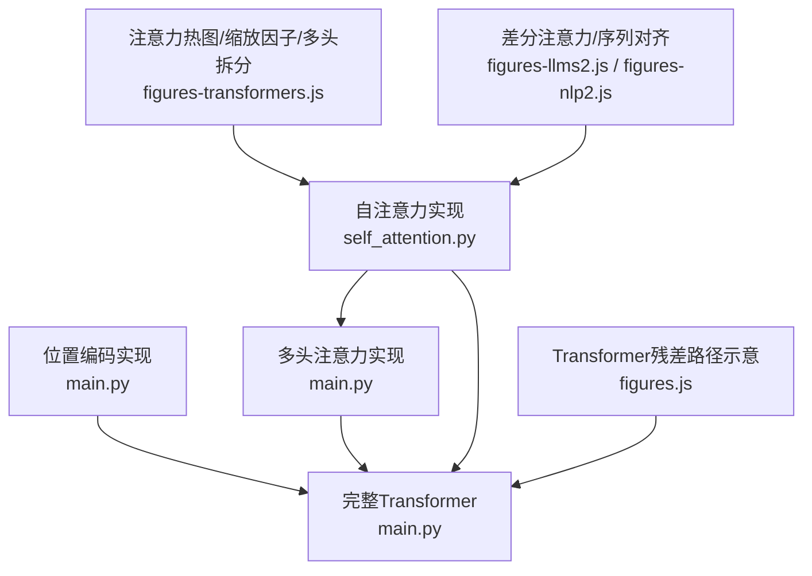
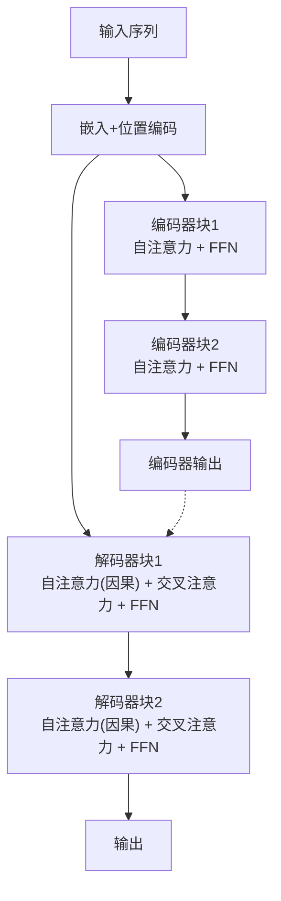
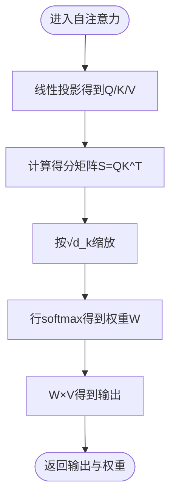
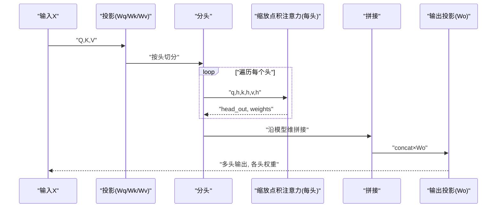
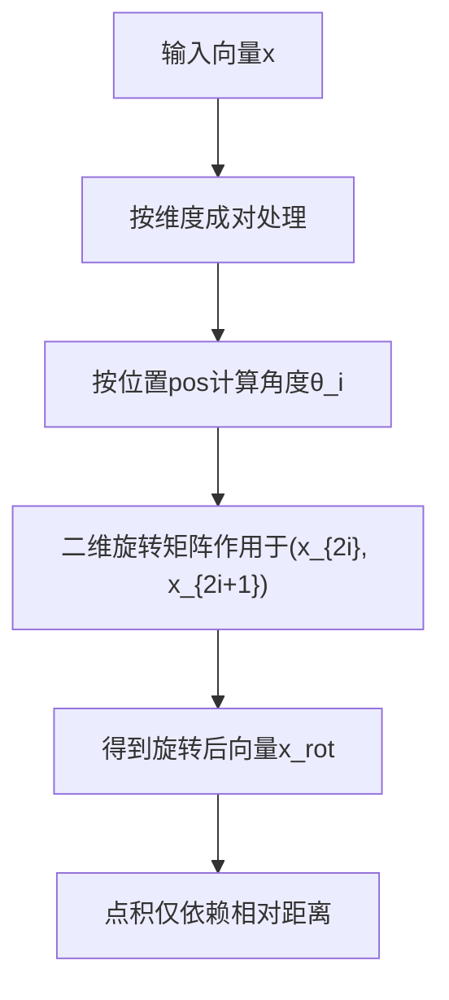
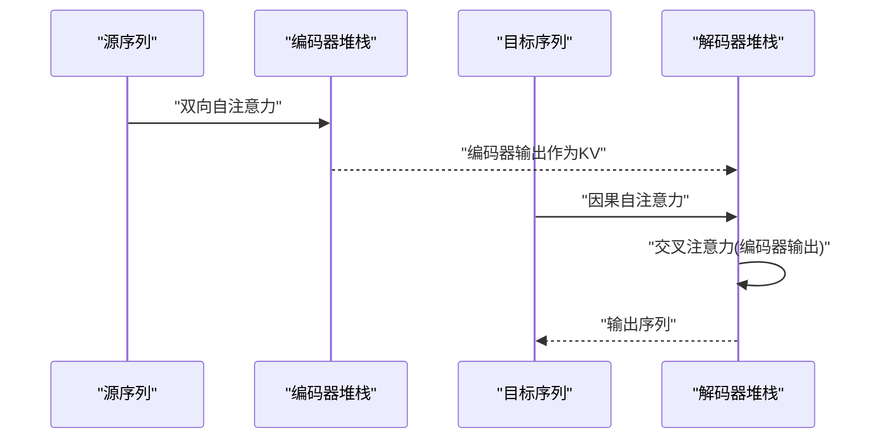
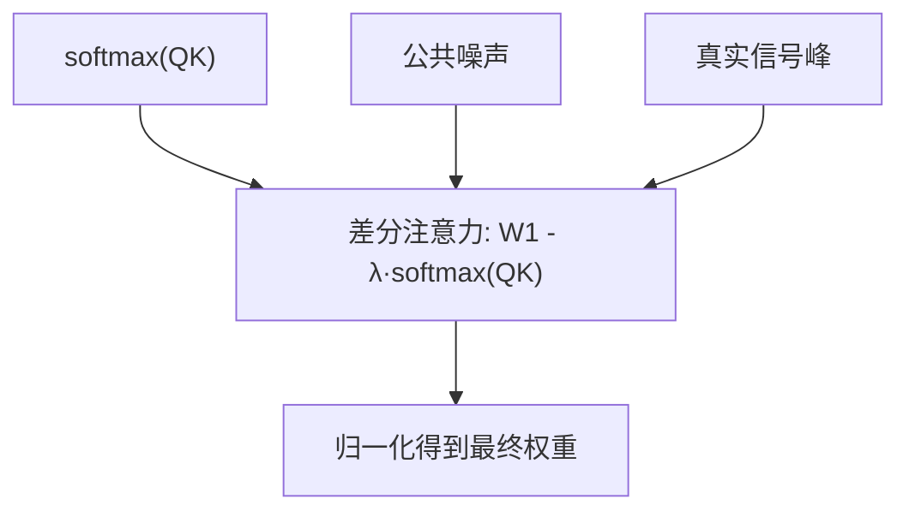
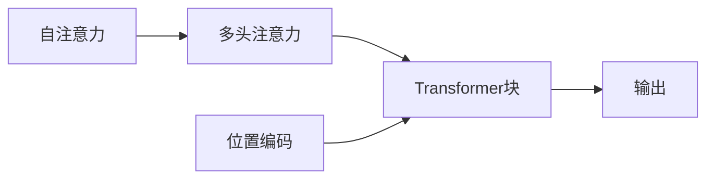

# 注意力机制与Transformer

<cite>
**本文引用的文件**
- [phases/07-transformers-deep-dive/02-self-attention-from-scratch/code/self_attention.py](file://phases/07-transformers-deep-dive/02-self-attention-from-scratch/code/self_attention.py)
- [phases/07-transformers-deep-dive/03-multi-head-attention/code/main.py](file://phases/07-transformers-deep-dive/03-multi-head-attention/code/main.py)
- [phases/07-transformers-deep-dive/04-positional-encoding/code/main.py](file://phases/07-transformers-deep-dive/04-positional-encoding/code/main.py)
- [phases/07-transformers-deep-dive/05-full-transformer/code/main.py](file://phases/07-transformers-deep-dive/05-full-transformer/code/main.py)
- [site/figures-transformers.js](file://site/figures-transformers.js)
- [site/figures-llms2.js](file://site/figures-llms2.js)
- [site/figures.js](file://site/figures.js)
- [site/figures-nlp2.js](file://site/figures-nlp2.js)
</cite>

## 目录
1. [引言](#引言)
2. [项目结构](#项目结构)
3. [核心组件](#核心组件)
4. [架构总览](#架构总览)
5. [详细组件分析](#详细组件分析)
6. [依赖关系分析](#依赖关系分析)
7. [性能考量](#性能考量)
8. [故障排查指南](#故障排查指南)
9. [结论](#结论)
10. [附录](#附录)

## 引言
本课程围绕“注意力机制与Transformer”展开，系统讲解注意力的核心思想、数学原理与实现细节，并结合仓库中的可运行示例与可视化脚本，帮助学习者从零构建理解：从缩放点积注意力到多头注意力，再到完整的编码器-解码器Transformer；同时覆盖位置编码（正弦、RoPE、ALiBi）与注意力权重的可视化分析方法。

## 项目结构
本仓库在“transformers-deep-dive”阶段提供了从基础到进阶的注意力与Transformer实现与演示：
- 自注意力从零实现：包含数值稳定的softmax、缩放点积注意力、以及自注意力类与多头注意力类。
- 多头注意力：纯Python实现矩阵运算、分头/合头、Grouped-Query Attention变体与KV缓存对比。
- 位置编码：正弦编码、旋转位置编码（RoPE）、ALiBi偏置，含相对距离不变性与长上下文缩放演示。
- 完整Transformer：编码器块、解码器块、前归一化（pre-norm）、RMSNorm、SwiGLU/ReLU前馈网络。
- 可视化：站点脚本提供注意力热图、多头拆分、因果掩码、缩放因子、差分注意力等交互式图示。

图表来源
- [phases/07-transformers-deep-dive/02-self-attention-from-scratch/code/self_attention.py:1-147](file://phases/07-transformers-deep-dive/02-self-attention-from-scratch/code/self_attention.py#L1-L147)
- [phases/07-transformers-deep-dive/03-multi-head-attention/code/main.py:1-210](file://phases/07-transformers-deep-dive/03-multi-head-attention/code/main.py#L1-L210)
- [phases/07-transformers-deep-dive/04-positional-encoding/code/main.py:1-126](file://phases/07-transformers-deep-dive/04-positional-encoding/code/main.py#L1-L126)
- [phases/07-transformers-deep-dive/05-full-transformer/code/main.py:1-255](file://phases/07-transformers-deep-dive/05-full-transformer/code/main.py#L1-L255)
- [site/figures-transformers.js:62-100](file://site/figures-transformers.js#L62-L100)
- [site/figures-llms2.js:378-427](file://site/figures-llms2.js#L378-L427)
- [site/figures.js:619-641](file://site/figures.js#L619-L641)

章节来源
- [phases/07-transformers-deep-dive/02-self-attention-from-scratch/code/self_attention.py:1-147](file://phases/07-transformers-deep-dive/02-self-attention-from-scratch/code/self_attention.py#L1-L147)
- [phases/07-transformers-deep-dive/03-multi-head-attention/code/main.py:1-210](file://phases/07-transformers-deep-dive/03-multi-head-attention/code/main.py#L1-L210)
- [phases/07-transformers-deep-dive/04-positional-encoding/code/main.py:1-126](file://phases/07-transformers-deep-dive/04-positional-encoding/code/main.py#L1-L126)
- [phases/07-transformers-deep-dive/05-full-transformer/code/main.py:1-255](file://phases/07-transformers-deep-dive/05-full-transformer/code/main.py#L1-L255)
- [site/figures-transformers.js:62-100](file://site/figures-transformers.js#L62-L100)
- [site/figures-llms2.js:378-427](file://site/figures-llms2.js#L378-L427)
- [site/figures.js:619-641](file://site/figures.js#L619-L641)

## 核心组件
- 缩放点积注意力与自注意力
  - 数值稳定softmax与缩放因子√d_k的动机与推导。
  - 自注意力类封装投影矩阵与前向计算。
- 多头注意力
  - 分头/合头策略、输出投影矩阵、Grouped-Query Attention（减少KV头数以降低KV缓存）。
- Transformer块
  - 预归一化（pre-norm）、残差连接、多头自注意力、交叉注意力（解码器）、SwiGLU/ReLU前馈网络。
- 位置编码
  - 正弦编码、RoPE（相对位置不变性与长上下文缩放）、ALiBi（无嵌入偏置）。
- 可视化工具
  - 注意力热图、多头维度拆分、因果掩码、差分注意力、序列对齐。

章节来源
- [phases/07-transformers-deep-dive/02-self-attention-from-scratch/code/self_attention.py:4-33](file://phases/07-transformers-deep-dive/02-self-attention-from-scratch/code/self_attention.py#L4-L33)
- [phases/07-transformers-deep-dive/03-multi-head-attention/code/main.py:80-150](file://phases/07-transformers-deep-dive/03-multi-head-attention/code/main.py#L80-L150)
- [phases/07-transformers-deep-dive/05-full-transformer/code/main.py:187-211](file://phases/07-transformers-deep-dive/05-full-transformer/code/main.py#L187-L211)
- [phases/07-transformers-deep-dive/04-positional-encoding/code/main.py:11-58](file://phases/07-transformers-deep-dive/04-positional-encoding/code/main.py#L11-L58)
- [site/figures-transformers.js:140-164](file://site/figures-transformers.js#L140-L164)
- [site/figures-transformers.js:62-100](file://site/figures-transformers.js#L62-L100)
- [site/figures-llms2.js:378-427](file://site/figures-llms2.js#L378-L427)
- [site/figures-nlp2.js:169-185](file://site/figures-nlp2.js#L169-L185)

## 架构总览
下图展示了从输入嵌入到最终输出的Transformer整体流程，强调预归一化、残差、自注意力与交叉注意力的组合方式。

图表来源
- [phases/07-transformers-deep-dive/05-full-transformer/code/main.py:187-211](file://phases/07-transformers-deep-dive/05-full-transformer/code/main.py#L187-L211)
- [site/figures.js:619-641](file://site/figures.js#L619-L641)

## 详细组件分析

### 自注意力与缩放点积注意力
- 数学与实现要点
  - 计算Q=XM_W^Q、K=XM_W^K、V=XM_W^V。
  - 计算得分矩阵S=QK^T/d_k，应用softmax得到权重W，输出Z=WV。
  - 数值稳定：减去每行最大值再指数化，避免溢出。
- 关键动机
  - √d_k缩放确保点积方差稳定，防止softmax饱和。
- 可视化与调试
  - 提供ASCII热图与打印矩阵，便于观察注意力分布。

图表来源
- [phases/07-transformers-deep-dive/02-self-attention-from-scratch/code/self_attention.py:10-15](file://phases/07-transformers-deep-dive/02-self-attention-from-scratch/code/self_attention.py#L10-L15)
- [phases/07-transformers-deep-dive/02-self-attention-from-scratch/code/self_attention.py:4-7](file://phases/07-transformers-deep-dive/02-self-attention-from-scratch/code/self_attention.py#L4-L7)

章节来源
- [phases/07-transformers-deep-dive/02-self-attention-from-scratch/code/self_attention.py:4-33](file://phases/07-transformers-deep-dive/02-self-attention-from-scratch/code/self_attention.py#L4-L33)
- [site/figures-transformers.js:140-164](file://site/figures-transformers.js#L140-L164)

### 多头注意力与Grouped-Query Attention
- 设计动机
  - 每个头专注不同子空间的关系；并行提升表达能力且参数总量不变。
- 实现细节
  - 将d_model均匀切分为n_heads个头，每头维度d_head=d_model/n_heads。
  - 对每个头执行缩放点积注意力，随后拼接并经输出投影Wo。
  - GQA：K/V使用更少的头（n_kv_heads），通过重复匹配Q的头数，显著降低KV缓存开销。
- 性能影响
  - 在相同推理延迟下，GQA可减少KV缓存存储与带宽压力。

图表来源
- [phases/07-transformers-deep-dive/03-multi-head-attention/code/main.py:91-150](file://phases/07-transformers-deep-dive/03-multi-head-attention/code/main.py#L91-L150)

章节来源
- [phases/07-transformers-deep-dive/03-multi-head-attention/code/main.py:1-210](file://phases/07-transformers-deep-dive/03-multi-head-attention/code/main.py#L1-L210)

### 位置编码：正弦、RoPE与ALiBi
- 正弦编码
  - 使用sin/cos函数编码绝对位置，偶/奇维度交替。
- RoPE（旋转位置编码）
  - 在二维对上进行角度为pos·θ_i的旋转变换，使点积仅依赖相对距离；支持大上下文的“长度外推”（NTK-aware）。
- ALiBi（偏置感知线性注意）
  - 不引入额外嵌入，直接在注意力分数上加偏置项，偏向较近的token；适合因果语言建模。

图表来源
- [phases/07-transformers-deep-dive/04-positional-encoding/code/main.py:21-33](file://phases/07-transformers-deep-dive/04-positional-encoding/code/main.py#L21-L33)
- [phases/07-transformers-deep-dive/04-positional-encoding/code/main.py:88-99](file://phases/07-transformers-deep-dive/04-positional-encoding/code/main.py#L88-L99)

章节来源
- [phases/07-transformers-deep-dive/04-positional-encoding/code/main.py:1-126](file://phases/07-transformers-deep-dive/04-positional-encoding/code/main.py#L1-L126)

### 完整Transformer：编码器与解码器
- 编码器块
  - 预归一化 + 多头自注意力 + 残差；再 + 前馈网络（SwiGLU或ReLU）+ 残差。
- 解码器块
  - 预归一化 + 多头自注意力（因果掩码）+ 残差；
  - 再 + 多头交叉注意力（K/V来自编码器输出）+ 残差；
  - 最后 + 前馈网络 + 残差。
- 归一化与激活
  - 支持LayerNorm与RMSNorm；FFN支持SwiGLU与ReLU两种实现。

图表来源
- [phases/07-transformers-deep-dive/05-full-transformer/code/main.py:187-211](file://phases/07-transformers-deep-dive/05-full-transformer/code/main.py#L187-L211)
- [site/figures.js:619-641](file://site/figures.js#L619-L641)

章节来源
- [phases/07-transformers-deep-dive/05-full-transformer/code/main.py:1-255](file://phases/07-transformers-deep-dive/05-full-transformer/code/main.py#L1-L255)

### 注意力权重可视化与分析
- 热图与ASCII热图
  - 打印注意力权重矩阵，支持ASCII字符密度表示，直观显示高权重区域。
- 多头维度拆分
  - 展示d_model如何被n_heads等分，以及每头的维度大小与参数总量保持不变。
- 差分注意力
  - 对两个softmax映射做减法，用λ抑制公共噪声，突出真实信号峰值。
- 序列对齐（seq2seq）
  - 展示解码器对编码器状态的软对齐，每行softmax为1，体现重排序能力。

图表来源
- [site/figures-llms2.js:378-427](file://site/figures-llms2.js#L378-L427)

章节来源
- [phases/07-transformers-deep-dive/02-self-attention-from-scratch/code/self_attention.py:61-86](file://phases/07-transformers-deep-dive/02-self-attention-from-scratch/code/self_attention.py#L61-L86)
- [site/figures-transformers.js:62-100](file://site/figures-transformers.js#L62-L100)
- [site/figures-llms2.js:378-427](file://site/figures-llms2.js#L378-L427)
- [site/figures-nlp2.js:169-185](file://site/figures-nlp2.js#L169-L185)

## 依赖关系分析
- 组件耦合
  - 自注意力与多头注意力共享相同的缩放点积注意力内核；多头注意力依赖分头/合头与输出投影。
  - Transformer块依赖归一化、注意力、前馈网络与残差连接；解码器还依赖编码器输出作为KV。
- 外部依赖
  - 示例代码采用纯Python实现，不依赖外部库，便于教学与移植。
- 可视化依赖
  - 站点脚本提供交互式演示，辅助理解注意力权重、多头拆分与差分注意力。

图表来源
- [phases/07-transformers-deep-dive/02-self-attention-from-scratch/code/self_attention.py:18-33](file://phases/07-transformers-deep-dive/02-self-attention-from-scratch/code/self_attention.py#L18-L33)
- [phases/07-transformers-deep-dive/03-multi-head-attention/code/main.py:116-150](file://phases/07-transformers-deep-dive/03-multi-head-attention/code/main.py#L116-L150)
- [phases/07-transformers-deep-dive/05-full-transformer/code/main.py:187-211](file://phases/07-transformers-deep-dive/05-full-transformer/code/main.py#L187-L211)

章节来源
- [phases/07-transformers-deep-dive/02-self-attention-from-scratch/code/self_attention.py:1-147](file://phases/07-transformers-deep-dive/02-self-attention-from-scratch/code/self_attention.py#L1-L147)
- [phases/07-transformers-deep-dive/03-multi-head-attention/code/main.py:1-210](file://phases/07-transformers-deep-dive/03-multi-head-attention/code/main.py#L1-L210)
- [phases/07-transformers-deep-dive/05-full-transformer/code/main.py:1-255](file://phases/07-transformers-deep-dive/05-full-transformer/code/main.py#L1-L255)

## 性能考量
- 计算复杂度
  - 单次缩放点积注意力对长度N的自注意力为O(N^2d)，多头为O(N^2d)（固定d_head时）。
- 内存与KV缓存
  - GQA通过减少KV头数显著降低KV缓存占用，适合长上下文推理。
- 近似与加速
  - FlashAttention通过分块避免显式构造N×N分数矩阵，内存随N线性增长，适合长序列。
- 归一化与激活
  - RMSNorm通常比LayerNorm更高效；SwiGLU相比ReLU具有更强的非线性表达能力。

章节来源
- [site/figures-transformers.js:439-445](file://site/figures-transformers.js#L439-L445)
- [phases/07-transformers-deep-dive/03-multi-head-attention/code/main.py:191-206](file://phases/07-transformers-deep-dive/03-multi-head-attention/code/main.py#L191-L206)

## 故障排查指南
- 归一化与数值稳定性
  - 若softmax输出全为NaN或0，请检查是否正确减去行最大值；确认缩放因子1/√d_k已应用。
- 多头维度一致性
  - d_model必须能被n_heads整除；否则会触发断言错误。若使用GQA，需确保n_kv_heads能整除n_heads。
- 因果掩码
  - 解码器自注意力应启用因果掩码，避免信息泄漏到未来token。
- KV缓存问题
  - GQA模式下，KV缓存大小与n_kv_heads成正比；若出现显存不足，可调低n_kv_heads或n_heads。

章节来源
- [phases/07-transformers-deep-dive/02-self-attention-from-scratch/code/self_attention.py:36-48](file://phases/07-transformers-deep-dive/02-self-attention-from-scratch/code/self_attention.py#L36-L48)
- [phases/07-transformers-deep-dive/03-multi-head-attention/code/main.py:91-101](file://phases/07-transformers-deep-dive/03-multi-head-attention/code/main.py#L91-L101)
- [phases/07-transformers-deep-dive/05-full-transformer/code/main.py:129-139](file://phases/07-transformers-deep-dive/05-full-transformer/code/main.py#L129-L139)

## 结论
本课程通过从零实现的自注意力、多头注意力与完整Transformer，配合正弦、RoPE与ALiBi位置编码，以及丰富的可视化工具，系统地呈现了注意力机制的核心思想与工程实践。读者可在纯Python环境中复现实验，深入理解缩放因子、多头并行、因果与交叉注意力、残差与归一化等关键设计，并掌握注意力权重的分析与优化方法。

## 附录
- 进一步阅读建议
  - 结合站点脚本中的交互式演示，加深对注意力热图、多头拆分与差分注意力的理解。
  - 尝试调整d_model、n_heads与序列长度，观察注意力权重分布与KV缓存变化。