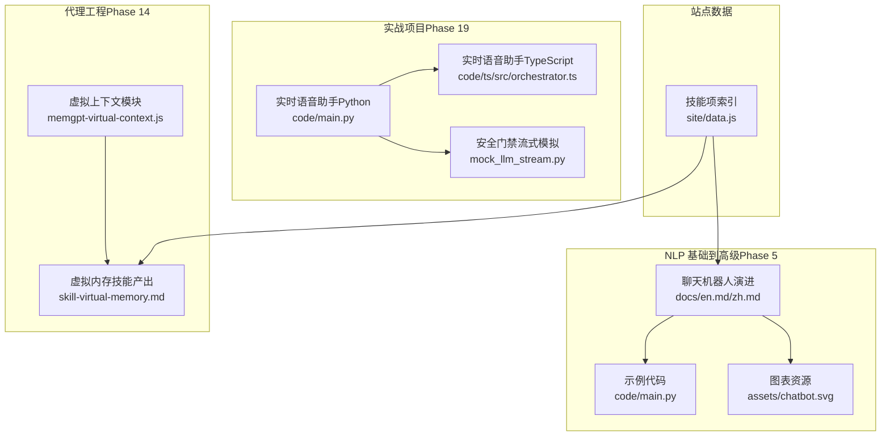
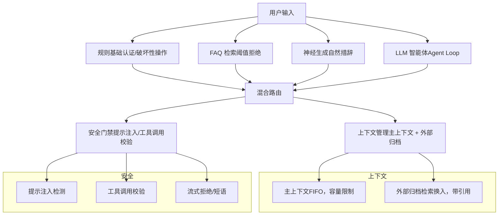
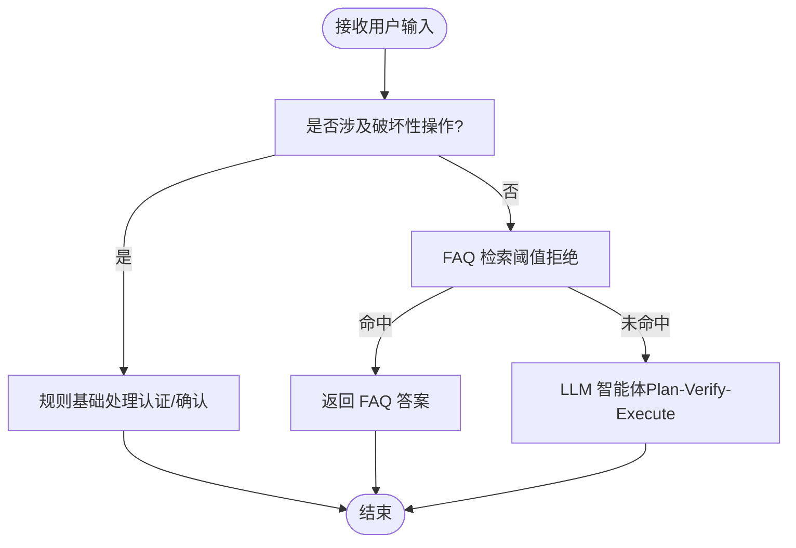
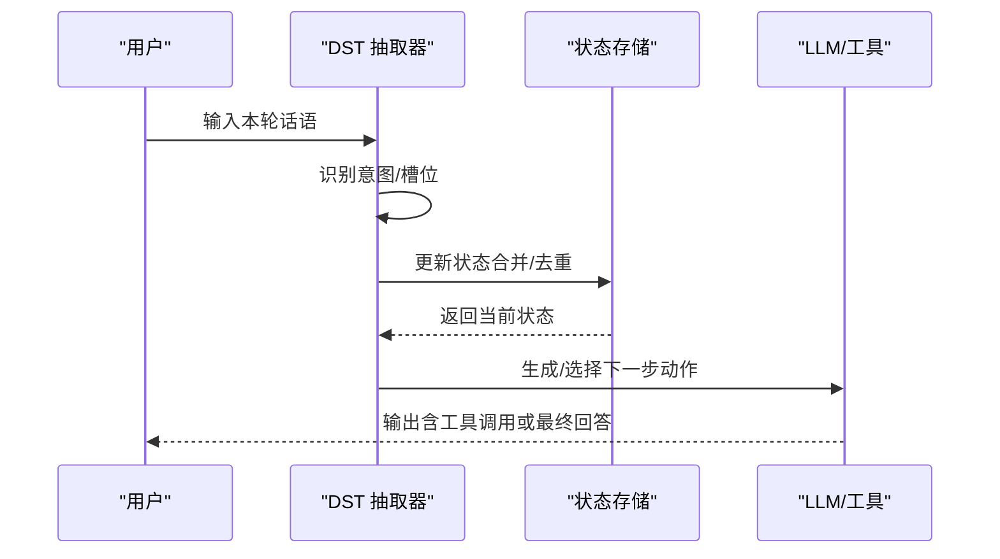
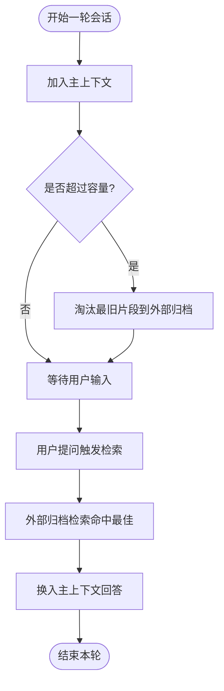
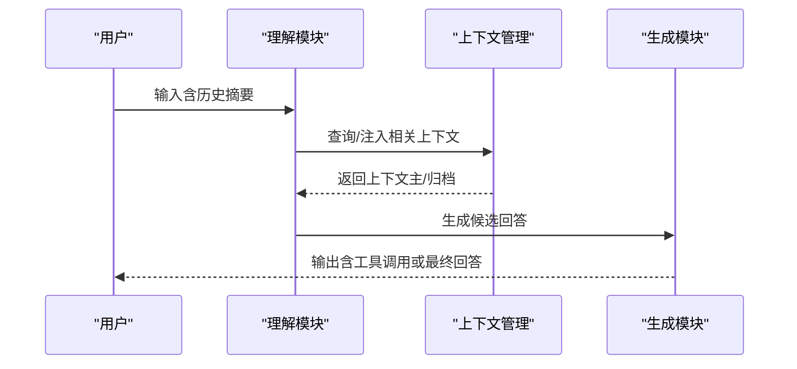
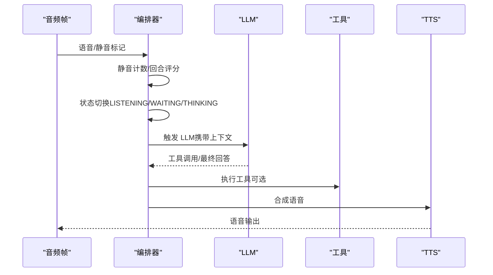
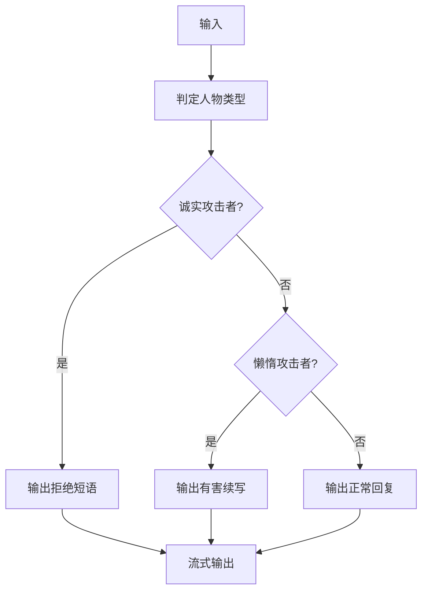
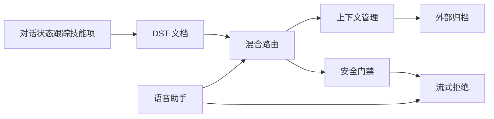

# 聊天机器人与对话系统

<cite>
**本文引用的文件**
- [phases/05-nlp-foundations-to-advanced/17-chatbots-rule-to-neural/docs/en.md](file://phases/05-nlp-foundations-to-advanced/17-chatbots-rule-to-neural/docs/en.md)
- [phases/05-nlp-foundations-to-advanced/17-chatbots-rule-to-neural/docs/zh.md](file://phases/05-nlp-foundations-to-advanced/17-chatbots-rule-to-neural/docs/zh.md)
- [phases/05-nlp-foundations-to-advanced/17-chatbots-rule-to-neural/code/main.py](file://phases/05-nlp-foundations-to-advanced/17-chatbots-rule-to-neural/code/main.py)
- [phases/05-nlp-foundations-to-advanced/17-chatbots-rule-to-neural/assets/chatbot.svg](file://phases/05-nlp-foundations-to-advanced/17-chatbots-rule-to-neural/assets/chatbot.svg)
- [site/vue-app/summary/src/data/modules/memgpt-virtual-context.js](file://site/vue-app/summary/src/data/modules/memgpt-virtual-context.js)
- [phases/14-agent-engineering/07-memory-virtual-context-memgpt/outputs/skill-virtual-memory.md](file://phases/14-agent-engineering/07-memory-virtual-context-memgpt/outputs/skill-virtual-memory.md)
- [site/data.js](file://site/data.js)
- [phases/19-capstone-projects/03-realtime-voice-assistant/code/main.py](file://phases/19-capstone-projects/03-realtime-voice-assistant/code/main.py)
- [phases/19-capstone-projects/03-realtime-voice-assistant/code/ts/src/orchestrator.ts](file://phases/19-capstone-projects/03-realtime-voice-assistant/code/ts/src/orchestrator.ts)
- [phases/19-capstone-projects/87-end-to-end-safety-gate/code/mock_llm_stream.py](file://phases/19-capstone-projects/87-end-to-end-safety-gate/code/mock_llm_stream.py)
</cite>

## 目录
1. 引言
2. 项目结构
3. 核心组件
4. 架构总览
5. 详细组件分析
6. 依赖分析
7. 性能考虑
8. 故障排查指南
9. 结论
10. 附录

## 引言
本文件面向“聊天机器人与对话系统”的工程实践，系统梳理从规则基础到神经网络再到智能体的演进路径，重点覆盖以下主题：
- 对话状态跟踪（DST）的核心概念与实现方法
- 多轮对话的理解与生成技术
- 会话管理与上下文维护（含虚拟内存与分层记忆）
- 情感计算与个性化响应生成（理念与落地建议）
- 对话质量评估与用户体验优化（指标与方法）

同时，结合仓库中的实战材料（规则/检索/神经/智能体混合路由、MemGPT 虚拟上下文、语音助手编排、安全门禁流式模拟等），给出可操作的设计与实现建议。

## 项目结构
围绕“聊天机器人与对话系统”，本仓库的关键资源分布如下：
- NLP 基础到高级（Phase 5）：包含“聊天机器人演进”“对话状态跟踪”等课程资料与示例代码
- 代理工程（Phase 14）：包含“虚拟上下文”“记忆块”“混合记忆”等与长期记忆、上下文管理相关的产出
- 实战项目（Phase 19）：包含实时语音助手、安全门禁等端到端样例，体现多模态与安全编排
- 站点数据：包含“对话状态跟踪”技能项的元数据，便于在学习平台中定位相关内容

**图表来源**
- [phases/05-nlp-foundations-to-advanced/17-chatbots-rule-to-neural/docs/en.md:1-243](file://phases/05-nlp-foundations-to-advanced/17-chatbots-rule-to-neural/docs/en.md#L1-L243)
- [phases/05-nlp-foundations-to-advanced/17-chatbots-rule-to-neural/code/main.py:1-89](file://phases/05-nlp-foundations-to-advanced/17-chatbots-rule-to-neural/code/main.py#L1-L89)
- [site/vue-app/summary/src/data/modules/memgpt-virtual-context.js:1-106](file://site/vue-app/summary/src/data/modules/memgpt-virtual-context.js#L1-L106)
- [phases/14-agent-engineering/07-memory-virtual-context-memgpt/outputs/skill-virtual-memory.md:1-34](file://phases/14-agent-engineering/07-memory-virtual-context-memgpt/outputs/skill-virtual-memory.md#L1-L34)
- [phases/19-capstone-projects/03-realtime-voice-assistant/code/main.py:147-175](file://phases/19-capstone-projects/03-realtime-voice-assistant/code/main.py#L147-L175)
- [phases/19-capstone-projects/03-realtime-voice-assistant/code/ts/src/orchestrator.ts:53-105](file://phases/19-capstone-projects/03-realtime-voice-assistant/code/ts/src/orchestrator.ts#L53-L105)
- [phases/19-capstone-projects/87-end-to-end-safety-gate/code/mock_llm_stream.py:49-76](file://phases/19-capstone-projects/87-end-to-end-safety-gate/code/mock_llm_stream.py#L49-L76)
- [site/data.js:8733-8777](file://site/data.js#L8733-L8777)

**章节来源**
- [phases/05-nlp-foundations-to-advanced/17-chatbots-rule-to-neural/docs/en.md:1-243](file://phases/05-nlp-foundations-to-advanced/17-chatbots-rule-to-neural/docs/en.md#L1-L243)
- [phases/05-nlp-foundations-to-advanced/17-chatbots-rule-to-neural/docs/zh.md:1-241](file://phases/05-nlp-foundations-to-advanced/17-chatbots-rule-to-neural/docs/zh.md#L1-L241)
- [phases/05-nlp-foundations-to-advanced/17-chatbots-rule-to-neural/code/main.py:1-89](file://phases/05-nlp-foundations-to-advanced/17-chatbots-rule-to-neural/code/main.py#L1-L89)
- [site/vue-app/summary/src/data/modules/memgpt-virtual-context.js:1-106](file://site/vue-app/summary/src/data/modules/memgpt-virtual-context.js#L1-L106)
- [phases/14-agent-engineering/07-memory-virtual-context-memgpt/outputs/skill-virtual-memory.md:1-34](file://phases/14-agent-engineering/07-memory-virtual-context-memgpt/outputs/skill-virtual-memory.md#L1-L34)
- [site/data.js:8733-8777](file://site/data.js#L8733-L8777)

## 核心组件
- 聊天机器人架构四代演进：规则基础、检索、神经、智能体（Agent Loop），以及 2026 生产级混合路由
- 对话状态跟踪（DST）：目标模式、抽取器、更新策略与评估
- 上下文与记忆：主上下文（窗口）与外部归档（分层虚拟内存），支持检索换入与引用溯源
- 多模态与实时编排：语音助手的端到端状态机与流式处理
- 安全与质量：提示注入防护、工具调用校验、流式输出与拒绝策略

**章节来源**
- [phases/05-nlp-foundations-to-advanced/17-chatbots-rule-to-neural/docs/en.md:16-31](file://phases/05-nlp-foundations-to-advanced/17-chatbots-rule-to-neural/docs/en.md#L16-L31)
- [phases/05-nlp-foundations-to-advanced/17-chatbots-rule-to-neural/docs/zh.md:16-31](file://phases/05-nlp-foundations-to-advanced/17-chatbots-rule-to-neural/docs/zh.md#L16-L31)
- [site/vue-app/summary/src/data/modules/memgpt-virtual-context.js:1-106](file://site/vue-app/summary/src/data/modules/memgpt-virtual-context.js#L1-L106)
- [phases/14-agent-engineering/07-memory-virtual-context-memgpt/outputs/skill-virtual-memory.md:10-19](file://phases/14-agent-engineering/07-memory-virtual-context-memgpt/outputs/skill-virtual-memory.md#L10-L19)
- [phases/19-capstone-projects/03-realtime-voice-assistant/code/main.py:147-175](file://phases/19-capstone-projects/03-realtime-voice-assistant/code/main.py#L147-L175)
- [phases/19-capstone-projects/87-end-to-end-safety-gate/code/mock_llm_stream.py:49-76](file://phases/19-capstone-projects/87-end-to-end-safety-gate/code/mock_llm_stream.py#L49-L76)

## 架构总览
下图展示从规则/检索/神经到智能体的混合路由，以及与上下文管理、安全门禁的集成关系。

**图表来源**
- [phases/05-nlp-foundations-to-advanced/17-chatbots-rule-to-neural/docs/en.md:143-162](file://phases/05-nlp-foundations-to-advanced/17-chatbots-rule-to-neural/docs/en.md#L143-L162)
- [phases/05-nlp-foundations-to-advanced/17-chatbots-rule-to-neural/code/main.py:57-71](file://phases/05-nlp-foundations-to-advanced/17-chatbots-rule-to-neural/code/main.py#L57-L71)
- [site/vue-app/summary/src/data/modules/memgpt-virtual-context.js:34-88](file://site/vue-app/summary/src/data/modules/memgpt-virtual-context.js#L34-L88)
- [phases/19-capstone-projects/87-end-to-end-safety-gate/code/mock_llm_stream.py:49-76](file://phases/19-capstone-projects/87-end-to-end-safety-gate/code/mock_llm_stream.py#L49-L76)

## 详细组件分析

### 组件一：聊天机器人演进与混合路由
- 规则基础：用于认证与破坏性操作，确保安全边界
- 检索 FAQ：针对常见问题，阈值拒绝避免幻觉
- 神经生成：作为自然语言润色与兜底，提升用户体验
- 智能体：对复杂任务进行计划-执行-验证（Plan-Verify-Execute），结合 RAG 与工具调用
- 混合路由：根据意图与风险动态分流

**图表来源**
- [phases/05-nlp-foundations-to-advanced/17-chatbots-rule-to-neural/docs/en.md:143-162](file://phases/05-nlp-foundations-to-advanced/17-chatbots-rule-to-neural/docs/en.md#L143-L162)
- [phases/05-nlp-foundations-to-advanced/17-chatbots-rule-to-neural/code/main.py:57-71](file://phases/05-nlp-foundations-to-advanced/17-chatbots-rule-to-neural/code/main.py#L57-L71)

**章节来源**
- [phases/05-nlp-foundations-to-advanced/17-chatbots-rule-to-neural/docs/en.md:16-31](file://phases/05-nlp-foundations-to-advanced/17-chatbots-rule-to-neural/docs/en.md#L16-L31)
- [phases/05-nlp-foundations-to-advanced/17-chatbots-rule-to-neural/docs/zh.md:16-31](file://phases/05-nlp-foundations-to-advanced/17-chatbots-rule-to-neural/docs/zh.md#L16-L31)
- [phases/05-nlp-foundations-to-advanced/17-chatbots-rule-to-neural/code/main.py:1-89](file://phases/05-nlp-foundations-to-advanced/17-chatbots-rule-to-neural/code/main.py#L1-L89)

### 组件二：对话状态跟踪（DST）
- 目标模式：识别槽位（Slot）、意图（Intent）与任务状态
- 抽取器：基于规则/分类器/槽位标注抽取
- 更新策略：增量更新、合并/去重、跨轮一致性维护
- 评估：任务完成率、槽位准确率、离题率、上下文窗口有效性

**图表来源**
- [site/data.js:8733-8747](file://site/data.js#L8733-L8747)

**章节来源**
- [site/data.js:8733-8747](file://site/data.js#L8733-L8747)

### 组件三：会话管理与上下文维护（MemGPT 虚拟上下文）
- 主上下文（主内存）：固定容量 FIFO，超限淘汰最旧片段
- 外部归档（磁盘/向量库）：检索换入，带来源引用（citation），支持溯源
- 换入策略：基于关键词/标签重叠的粗排（模拟向量检索）
- 记忆工具：core_memory_append/replace、archival_memory_insert/search、conversation_search
- 风险与约束：记忆腐烂、记忆投毒、引用丢失；主上下文需有淘汰策略

**图表来源**
- [site/vue-app/summary/src/data/modules/memgpt-virtual-context.js:34-88](file://site/vue-app/summary/src/data/modules/memgpt-virtual-context.js#L34-L88)

**章节来源**
- [site/vue-app/summary/src/data/modules/memgpt-virtual-context.js:1-106](file://site/vue-app/summary/src/data/modules/memgpt-virtual-context.js#L1-L106)
- [phases/14-agent-engineering/07-memory-virtual-context-memgpt/outputs/skill-virtual-memory.md:10-19](file://phases/14-agent-engineering/07-memory-virtual-context-memgpt/outputs/skill-virtual-memory.md#L10-L19)

### 组件四：多轮对话的理解与生成
- 理解：意图/槽位抽取、上下文压缩/检索、RAG 注入
- 生成：基于模板/提示的可控生成，必要时回退到检索答案
- 一致性：通过状态机/工具调用链路保证跨轮一致性

**图表来源**
- [phases/05-nlp-foundations-to-advanced/17-chatbots-rule-to-neural/docs/en.md:109-142](file://phases/05-nlp-foundations-to-advanced/17-chatbots-rule-to-neural/docs/en.md#L109-L142)

**章节来源**
- [phases/05-nlp-foundations-to-advanced/17-chatbots-rule-to-neural/docs/en.md:96-142](file://phases/05-nlp-foundations-to-advanced/17-chatbots-rule-to-neural/docs/en.md#L96-L142)

### 组件五：情感计算与个性化响应生成（理念与落地）
- 情感计算：在理解模块中引入情感标签/强度，驱动个性化语气与情绪一致性
- 个性化：基于用户画像/历史偏好调整提示模板与工具调用策略
- 落地建议：将情感特征作为上下文注入，配合工具调用生成更贴合用户状态的回答

（本节为概念性内容，不直接分析具体文件）

### 组件六：实时语音助手编排（Turn Detection 与状态机）
- 关键流程：静音检测、回合完成评分、状态切换（LISTENING/WAITING/THINKING/TOOL/SPEAKING）
- 流式处理：ASR 部分结果拼接、TTS 插入、打断（Barge-in）处理
- 时间度量：模拟首 token 时间、工具调用耗时，保障低延迟体验

**图表来源**
- [phases/19-capstone-projects/03-realtime-voice-assistant/code/main.py:147-175](file://phases/19-capstone-projects/03-realtime-voice-assistant/code/main.py#L147-L175)
- [phases/19-capstone-projects/03-realtime-voice-assistant/code/ts/src/orchestrator.ts:53-105](file://phases/19-capstone-projects/03-realtime-voice-assistant/code/ts/src/orchestrator.ts#L53-L105)

**章节来源**
- [phases/19-capstone-projects/03-realtime-voice-assistant/code/main.py:147-175](file://phases/19-capstone-projects/03-realtime-voice-assistant/code/main.py#L147-L175)
- [phases/19-capstone-projects/03-realtime-voice-assistant/code/ts/src/orchestrator.ts:53-105](file://phases/19-capstone-projects/03-realtime-voice-assistant/code/ts/src/orchestrator.ts#L53-L105)

### 组件七：安全门禁与流式输出（提示注入与拒绝）
- 人物判定：根据输入模式判断“攻击者-诚实/懒惰/正常”
- 流式输出：按 token 片段逐步输出，支持拒绝短语与有害续写
- 场景应用：在工具调用前进行拒绝/清洗，避免注入影响

**图表来源**
- [phases/19-capstone-projects/87-end-to-end-safety-gate/code/mock_llm_stream.py:49-76](file://phases/19-capstone-projects/87-end-to-end-safety-gate/code/mock_llm_stream.py#L49-L76)

**章节来源**
- [phases/19-capstone-projects/87-end-to-end-safety-gate/code/mock_llm_stream.py:49-76](file://phases/19-capstone-projects/87-end-to-end-safety-gate/code/mock_llm_stream.py#L49-L76)

## 依赖分析
- 技能索引：站点数据中包含“对话状态跟踪”技能项，指向 Phase 5 第 29 课
- 组件耦合：
  - 规则/检索/神经/智能体路由依赖上下文管理与安全门禁
  - 上下文管理依赖外部归档检索与引用溯源
  - 语音助手编排依赖 ASR/TTS/工具调用的协同

**图表来源**
- [site/data.js:8733-8747](file://site/data.js#L8733-L8747)

**章节来源**
- [site/data.js:8733-8747](file://site/data.js#L8733-L8747)

## 性能考虑
- 上下文窗口管理：通过淘汰最旧片段、检索相关历史、摘要压缩降低窗口压力
- 检索效率：外部归档采用粗排（如词集重叠）快速筛选，再做细排或 LLM rerank
- 流式处理：ASR/TTS/工具调用均采用流式，减少首 token 延迟
- 工具调用去重与步数预算：防止无限循环与范围蔓延
- 评估指标：任务成功率、工具调用正确率、离题率、幻觉率（保留对话）

（本节为通用指导，不直接分析具体文件）

## 故障排查指南
- 提示注入
  - 现象：LLM 产生与系统提示相悖的行为
  - 排查：检查用户输入是否包含隐藏指令；确认编排层是否实施 PVE（规划-验证-执行）
  - 处置：启用拒绝短语、白名单验证、语义异常检测
- 工具调用错误
  - 现象：未知工具名、参数类型不符、工具返回错误
  - 排查：核对工具签名与调用参数；记录工具调用历史
  - 处置：返回结构化错误信息，避免将工具输出直接注入系统提示
- 无限循环/范围蔓延
  - 现象：持续调用同一工具或偏离任务
  - 排查：检查步数预算、工具调用去重、LLM 评判“是否在取得进展”
- 上下文窗口耗尽
  - 现象：历史消息被挤出，导致上下文缺失
  - 排查：统计历史长度与窗口阈值
  - 处置：摘要旧轮次、相似检索历史、使用长上下文模型

**章节来源**
- [phases/05-nlp-foundations-to-advanced/17-chatbots-rule-to-neural/docs/en.md:178-191](file://phases/05-nlp-foundations-to-advanced/17-chatbots-rule-to-neural/docs/en.md#L178-L191)
- [phases/05-nlp-foundations-to-advanced/17-chatbots-rule-to-neural/docs/zh.md:176-189](file://phases/05-nlp-foundations-to-advanced/17-chatbots-rule-to-neural/docs/zh.md#L176-L189)

## 结论
- 聊天机器人应采用混合路由：规则/检索/神经/智能体各司其职，2026 生产级系统以“检索优先 + 工具调用 + 安全门禁”为核心
- 对话状态跟踪是多轮一致性的关键，需结合槽位抽取、状态更新与评估
- 上下文与记忆要分层：主上下文负责近期交互，外部归档负责海量知识与历史，支持检索换入与引用溯源
- 实时编排与安全门禁不可偏废：低延迟与抗注入并重
- 评估与优化：建立任务/工具/离题/幻觉等指标闭环，持续迭代

## 附录
- 相关课程与技能
  - 聊天机器人演进与混合路由：Phase 5 · 17
  - 对话状态跟踪：Phase 5 · 29
  - 虚拟上下文与分层记忆：Phase 14 · 07
  - 实时语音助手：Phase 19 · 03
  - 安全门禁与流式输出：Phase 19 · 87

**章节来源**
- [site/data.js:8733-8747](file://site/data.js#L8733-L8747)